# 1.1 — Keutamaan Haji

Tidak ada keraguan bahwa haji merupakan ibadah yang dirindukan oleh setiap muslim di atas muka bumi ini. Jika kita mendengar cerita tentang bagaimana kerinduan kaum muslimin terhadap ibadah haji, maka seluruh cerita tersebut sungguh sangat luar biasa.

Kita melihat bagaimana ada orang-orang yang mengumpulkan uang selama bertahun-tahun, bahkan puluhan tahun, hanya demi satu tujuan: bisa berangkat ke Tanah Suci untuk menunaikan ibadah.

Kita juga sering mendengar kisah sebagian orang dari Indonesia yang ketika pertama kali menginjakkan kaki di Saudi, mereka langsung bersujud syukur. Begitu besar rasa haru dan kebahagiaan yang memenuhi hati mereka. Bahkan, ada yang menyimpan cita-cita ingin menghembuskan napas terakhir di ketika berhaji. Terlalu banyak kisah yang menggambarkan betapa dahsyatnya kerinduan kaum muslimin terhadap ibadah haji.

Dan memang pantas mereka merindukan ibadah yang agung ini. Haji adalah ibadah yang luar biasa. Begitu banyak keutamaan yang Allah ﷻ dan Nabi ﷺ janjikan bagi siapa saja yang menunaikannya dengan haji yang mabrur.

Berikut ini adalah beberapa hadis yang menjelaskan tentang keutamaan ibadah haji. Di antaranya sebagai berikut:

---

## Pertama: Haji merupakan rukun Islam yang kelima

Allah ﷻ berfirman,

```arabic
﴿وَلِلَّهِ عَلَى ٱلنَّاسِ حِجُّ ٱلۡبَيۡتِ مَنِ ٱسۡتَطَاعَ إِلَيۡهِ سَبِيلٗاۚ﴾
```

“Dan (di antara) kewajiban manusia terhadap Allah adalah melaksanakan ibadah haji ke Baitullah, yaitu bagi orang-orang yang mampu[^1] mengadakan perjalanan ke sana.” (QS. Âli ‘Imrân: 97)

Nabi ﷺ bersabda,

```arabic
((بُنِيَ الْإِسْلَامُ عَلَى خَمْسٍ: شَهَادَةِ أَنْ لَا إِلَهَ إِلَّا اللَّهُ وَأَنَّ مُحَمَّدًا رَسُولُ اللَّهِ، وَإِقَامِ الصَّلَاةِ، وَإِيتَاءِ الزَّكَاةِ، وَالْحَجِّ، وَصَوْمِ رَمَضَانَ))
```

“Islam dibangun di atas 5 rukun, syahadatain, menegakkan salat, menunaikan zakat, berhaji, dan berpuasa di bulan Ramadhan.”[^2]

Lima perkara ini merupakan fondasi utama dalam Islam. Karena itu, setiap muslim hendaknya berusaha membangun bangunan keislamannya dengan sebaik dan sesempurna mungkin. Semakin kokoh dan sempurna bangunan Islam yang dia tegakkan, semakin sempurna pula keimanannya, dan semakin baik pula tempatnya kelak di surga.

---

## Kedua: Haji balasannya adalah Surga

Nabi ﷺ bersabda,

```arabic
((الْعُمْرَةُ إِلَى الْعُمْرَةِ كَفَّارَةٌ لِمَا بَيْنَهُمَا، وَالْحَجُّ الْمَبْرُورُ لَيْسَ لَهُ جَزَاءٌ إِلَّا الْجَنَّةُ))
```

“Sesungguhnya umrah yang satu hingga umrah yang berikutnya merupakan penebus dosa-dosa yang ada di antara kedua umrah tersebut, dan haji yang mabrur tidak ada balasan baginya yang setimpal kecuali surga.”[^3]

Hadis ini menunjukkan bahwa haji yang mabrur tidak memiliki balasan yang sepadan selain surga. Tidak ada ganjaran yang layak dan setimpal bagi pelakunya kecuali surga itu sendiri.

Berbeda dengan umrah. Dalam hadis tersebut, Nabi ﷺ membedakan antara umrah dan haji. Beliau menjelaskan bahwa satu umrah ke umrah berikutnya menjadi penghapus dosa-dosa di antara keduanya. Adapun haji yang mabrur, balasannya lebih tinggi dari itu. Ini menunjukkan perbedaan derajat antara pahala haji dan pahala umrah, karena haji yang mabrur tidak ada balasan yang pantas baginya selain surga.

---

## Ketiga: Haji menghilangkan dosa dan kemiskinan

Nabi ﷺ bersabda,

```arabic
((تَابِعُوا بَيْنَ الْحَجِّ وَالْعُمْرَةِ فَإِنَّهُمَا يَنْفِيَانِ الْفَقْرَ وَالذُّنُوبَ كَمَا يَنْفِي الْكِيرُ خَبَثَ الْحَدِيدِ وَالذَّهَبِ وَالْفِضَّةِ وَلَيْسَ لِلْحَجَّةِ الْمَبْرُورَةِ ثَوَابٌ إِلَّا الْجَنَّةَ))
```

“Tunaikanlah haji dan umrah secara silih berganti, karena haji dan umrah itu bisa menghilangkan kefakiran dan juga bisa menghilangkan dosa-dosa sebagaimana alat tiup pandai besi dapat menghilangkan kotoran besi/karat besi, emas, dan perak.”[^4]

Kata Nabi ﷺ, “Tunaikanlah haji dan umrah secara silih berganti” maksudnya hendaklah keduanya dilakukan secara beriringan dalam kehidupan seorang muslim. Jika seseorang telah menunaikan haji, maka hendaknya dia berusaha melaksanakan umrah. Dan jika dia telah berumrah, maka berusahalah untuk berhaji.

Hadis ini dengan jelas menunjukkan anjuran untuk mengiringkan antara haji dan umrah, tentu bagi mereka yang memiliki kemampuan untuk melaksanakannya. Mengapa? Karena Nabi ﷺ menjelaskan bahwa di balik keduanya terdapat keutamaan dan kebaikan yang besar,

```arabic
((فَإِنَّهُمَا يَنْفِيَانِ الْفَقْرَ وَالذُّنُوبَ))
```

“Karena haji dan umrah itu bisa menghilangkan kefakiran dan juga bisa menghilangkan dosa-dosa.”

Dalam hadis tersebut, Nabi ﷺ menyebutkan bahwa keutamaan haji dan umrah tidak hanya berkaitan dengan urusan akhirat. Ia bukan sekadar menjadi sebab diampuninya dosa, tetapi juga memiliki dampak dalam kehidupan dunia, di antaranya dapat menghilangkan kefakiran.

Artinya, haji dan umrah bukan hanya menghadirkan pahala, tetapi juga keberkahan. Siapa yang ingin ekonominya diberi kesejahteraan dan dijauhkan dari kefakiran, maka hendaknya dia menunaikan haji dan umrah, karena keduanya menjadi sebab datangnya kelapangan dan hilangnya kesempitan rezeki dengan izin Allah ﷻ.

Nabi ﷺ melanjutkan,

```arabic
((كَمَا يَنْفِى الْكِيرُ خَبَثَ الْحَدِيدِ وَالذَّهَبِ وَالْفِضَّةِ))
```

“Sebagaimana alat tiup pandai besi dapat menghilangkan kotoran besi/karat besi, emas, dan perak.”

Kemudian kata Nabi ﷺ,

```arabic
((وَلَيْسَ لِلْحَجَّةِ الْمَبْرُورَةِ ثَوَابٌ إِلَّا الْجَنَّةُ))
```

“Dan tidak ada balasan yang setimpal bagi haji yang mabrur kecuali surga.”

Dalil-dalil ini menunjukkan bahwa Nabi ﷺ menganjurkan untuk mengulang haji dan umrah. Anjuran tersebut tentu bukan tanpa hikmah. Di antara faedahnya adalah sebagai penghapus dosa dan sebagai sebab hilangnya kefakiran.

Karena itu, para ulama bersepakat bahwa mengulang umrah hukumnya disunahkan. Namun, mereka berbeda pendapat tentang jarak waktu minimal antara satu umrah dengan umrah berikutnya. Ada yang berpendapat setahun sekali, ada yang mengatakan sebulan sekali, dan ada pula yang membolehkan untuk mengulanginya kapan saja tanpa batasan waktu tertentu.[^5]

Hal ini sekaligus menepis pendapat sebagian orang yang memberi kesan seolah-olah mereka yang mengulang-ulang haji atau umrah disebut melakukan haji setan” atau “umrah setan.” Pandangan seperti ini jelas tidak benar, karena bertentangan dengan hadis-hadis Nabi ﷺ yang justru menganjurkan mengulang haji dan umrah bagi yang mampu.

Kita bisa melihat bagaimana para sahabat dan generasi salaf sejak dahulu begitu bersemangat untuk berulang kali menunaikan haji dan umrah. Semangat itu terus hidup hingga para ulama di zaman sekarang.

Jika seseorang memiliki kelapangan harta—dia telah menunaikan zakat, gemar bersedekah, berinfak, membantu fakir miskin, menyantuni anak yatim, serta berkontribusi untuk masjid dan lain sebagainya—lalu dia kembali berhaji dan berumrah, maka apa alasan untuk melarangnya? Justru dengan haji dan umrah itu Allah ﷻ dapat membukakan pintu rezeki baginya. Urusan rezeki adalah hak Allah ﷻ. Penulis memiliki banyak teman yang tetap lancar sedekahnya, tertib zakatnya, dan dimudahkan pula untuk berhaji serta berumrah, alhamdulillâh.

Karena itu, janganlah menuduh orang yang berulang kali menunaikan haji dan umrah dengan tuduhan-tuduhan buruk, atau dipandang seolah-olah melakukan kesalahan. Setiap muslim memiliki kerinduan untuk berhaji, rindu bertawaf di Ka’bah, berdoa di Multazam, berdiri di Padang Arafah, dan berharap dosa-dosanya dihapuskan. Lalu mengapa keinginan seperti itu harus dihalangi?

Adapun jika ada orang yang berhaji dan berumrah tetapi tidak membayar zakat, enggan bersedekah, tidak peduli pada fakir miskin, maka itu persoalan lain. Namun yang dibicarakan di sini adalah orang yang telah menunaikan kewajibannya dan masih memiliki kelebihan harta. Mengapa harus dicegah, sementara di sisi lain banyak orang yang menghabiskan hartanya untuk berfoya-foya, berlibur ke luar negeri, dan bersenang-senang?

Alhamdulillah, jika ada yang memilih membelanjakan hartanya untuk kembali berhaji atau berumrah, maka itu adalah kebaikan. Bahkan termasuk sunah untuk mengulang haji dan umrah, selama kewajiban-kewajibannya telah dia tunaikan dengan baik.

---

## Keempat: Haji merupakan jihad bagi kaum wanita

Aisyah radhiyallâhu ‘anhâ, Ummul mukminin/Ibunda kita semua, berkata,

```arabic
يَا رَسُولَ اللَّهِ، نَرَى الْجِهَادَ أَفْضَلَ الْعَمَلِ، أَفَلَا نُجَاهِدُ؟
```

“Wahai Rasulullah, kami (para wanita) melihat bahwasanya jihad merupakan amal yang terbaik, apakah kita (kami para wanita) tidak berjihad?”

Nabi ﷺ pun menjawab,

```arabic
((لَا، لَكُنَّ أَفْضَلُ الْجِهَادِ حَجٌّ مَبْرُورٌ))
```

[^6]

“Tidak, bagi kalian (para wanita) ada jihad yang terbaik yaitu haji mabrur.”[^7]

Dalam riwayat yang disebutkan oleh Ibnu Majah dan Ibnu Khuzaimah dalam Sahihnya, dari Aisyah radhiyallâhu ‘anhâ juga beliau berkata,

```arabic
قُلْتُ: يَا رَسُولَ اللَّهِ عَلَى النِّسَاءِ جِهَادٌ؟
```

“Aku bertanya wahai Rasulullah, apakah wajib bagi para wanita untuk berjihad?”,

Kata Nabi ﷺ,

```arabic
((نَعَمْ عَلَيْهِنَّ جِهَادٌ لَا قِتَالَ فِيهِ: الْحَجُّ وَالْعُمْرَةُ))
```

“Iya, wajib bagi kalian untuk berjihad yang tidak ada peperangan di dalamnya (yaitu) haji dan umrah.”[^8]

Dalil ini menunjukkan bahwa haji dan umrah, terutama haji, merupakan bentuk jihad bagi para wanita. Hal ini sangat masuk akal jika kita menilik betapa beratnya perjuangan mereka dalam menunaikan ibadah ini.

Dulu, tantangan utama bagi wanita adalah perjalanan jauh yang melelahkan, menempuh medan berat demi mencapai Tanah Suci. Sedangkan di zaman modern sekarang, kesulitan lebih banyak berasal dari kepadatan jamaah, dorong-mendorong, berdesakan, serta kemacetan kendaraan yang luar biasa. Bahkan bagi mereka yang menempuh haji plus dengan biaya lebih tinggi, kesulitan tetap dirasakan. Apalagi bagi para wanita, yang harus menyesuaikan diri dengan berbagai keterbatasan fisik dan keamanan.

Karena itulah, Nabi ﷺ menegaskan bahwa haji dan umrah bagi wanita termasuk jihad. Dan jika haji sendiri digolongkan sebagai jihad bagi mereka, hal ini semakin menunjukkan betapa luar biasanya amalan haji, tidak hanya dari sisi batin dan jiwa tetapi juga dari sisi perjuangan dan pengorbanannya.

---

## Kelima: Bagi lelaki, haji mabrur merupakan amalan terbaik setelah jihad

Dari Abu Hurairah radhiyallâhu ‘anhu, bahwasanya Nabi ﷺ pernah ditanya tentang amal apa yang paling afdal. Kata Nabi ﷺ,

```arabic
((إِيمَانٌ بِاللَّهِ وَرَسُولِهِ)). قِيلَ: ثُمَّ مَاذَا؟ قَالَ: ((الْجِهَادُ فِي سَبِيلِ اللَّهِ)) قِيلَ: ثُمَّ مَاذَا؟ قَالَ: ((حَجٌّ مَبْرُورٌ))
```

“Iman kepada Allah dan Rasul-Nya.”

Kemudian beliau ditanyakan lagi, “Kemudian amal apalagi yang afdal setelah itu?”

Beliau menjawab, “(Yaitu) jihad di jalan Allah.”

Kemudian ditanyakan lagi, “Lalu amalan apa lagi yang paling afdal setelah itu?”

Rasulullah bersabda, “Haji yang mabrur.”[^9]

Hal ini menunjukkan bahwa haji merupakan ibadah yang sangat mulia dan afdal, dan kedudukannya berada tepat setelah jihad di jalan Allah ﷻ. Artinya, dari segi keutamaan dan nilai pengorbanan, haji menempati posisi yang sangat tinggi di antara amalan-amalan yang dilakukan seorang muslim.

---

## Keenam: Haji mabrur menghapuskan seluruh dosa

Dari Abu Hurairah radhiyallâhu ‘anhu, dia berkata, Aku mendengar Nabi ﷺ bersabda,

```arabic
((مَنْ حَجَّ لِلَّهِ فَلَمْ يَرْفُثْ، وَلَمْ يَفْسُقْ، رَجَعَ كَيَوْمِ وَلَدَتْهُ أُمُّهُ))
```

“Barangsiapa yang berhaji karena Allah dan dia tidak melakukan rafas dan tidak melakukan kemaksiatan, maka dia akan kembali sebagaimana hari dia dilahirkan dari perut ibunya.”[^10]

Rafas adalah mengucapkan kata-kata keji saat ihram atau melakukan tindakan yang bisa menimbulkan syahwat, termasuk jimak atau hal-hal yang bisa mengarah kepadanya. Karena seorang yang sedang menunaikan haji dilarang melakukan segala sesuatu yang dapat menjadikan syahwat bergejolak.

Adapun mengenai haji mabrur, al-Hafizh Ibnu Hajar menjelaskan,

```arabic
أَنَّهُ يَظْهَرُ بِآخِرِهِ، فَإِنْ رَجَعَ خَيْرًا مِمَّا كَانَ عُرِفَ أَنَّهُ مَبْرُوْرٌ
```

“Sesungguhnya haji mabrur nampak di akhir haji. Jika ia kembali setelah haji dalam kondisi lebih baik dari sebelumnya maka diketahui bahwasanya hajinya mabrur.”[^11]

Hadis ini menjadi dalil yang sangat kuat, menunjukkan bahwa seseorang yang menunaikan haji yang mabrur: ikhlas karena Allah ﷻ; menjauhi rafas; dan tidak berbuat maksiat, maka seluruh dosanya akan diampuni, termasuk dosa-dosa besar. Ibnu Hajar menambahkan,

```arabic
وَظَاهِرُهُ غُفْرَانُ الصَّغَائِرِ وَالْكَبَائِرِ وَالتَّبِعَاتِ
```

“Zahir hadis ini adalah diampuninya dosa-dosa kecil dan dosa-dosa besar bahkan dihapuskan dampak-dampak dari dosa-dosa tersebut (di akhirat). [^12]”[^13]

Memang ada perbedaan pendapat di kalangan ulama mengenai apakah haji mabrur hanya menghapus dosa-dosa kecil atau juga dosa-dosa besar. Namun yang jelas, haji mabrur adalah amalan yang luar biasa dan menjadi sebab pengampunan yang agung dari Allah ﷻ.

Meskipun memang ada perselisihan di kalangan para ulama, apakah haji yang mabrur hanya menghapuskan dosa-dosa kecil atau juga menghapuskan dosa-dosa besar.

Namun mayoritas ulama berpendapat bahwa haji hanya menghapus dosa-dosa kecil. Untuk dosa-dosa besar, seseorang tetap harus melakukan tobat kepada Allah ﷻ; berhaji saja tidaklah cukup. Pendapat ini mereka dasarkan, antara lain, pada sabda Nabi ﷺ,

```arabic
((الصَّلَوَاتُ الْخَمْسُ، وَالْجُمْعَةُ إِلَى الْجُمْعَةِ، وَرَمَضَانُ إِلَى رَمَضَانَ، مُكَفِّرَاتٌ مَا بَيْنَهُنَّ إِذَا اجْتَنَبَ الْكَبَائِرَ))
```

“Salat lima waktu, jumat yang satu dengan jumat berikutnya, ramadan yang satu hingga ramadan berikutnya, akan menghapuskan dosa-dosa di antara keduanya, selama ia menjauhi dosa-dosa besar.”[^14]

Dalil ini menunjukkan bahwa yang dihapus oleh ibadah haji adalah dosa-dosa kecil, karena salah satu syarat agar dosa-dosa kecil diampuni adalah menjauhi dosa-dosa besar. Artinya, haji mabrur menghapus kesalahan-kesalahan ringan bagi orang yang tetap menjaga diri dari maksiat besar, sehingga amalan hajinya diterima dan menjadi sebab pengampunan dari Allah ﷻ. Dan ini selaras dengan firman Allah ﷻ,

```arabic
﴿إِن تَجۡتَنِبُواْ كَبَآئِرَ مَا تُنۡهَوۡنَ عَنۡهُ نُكَفِّرۡ عَنكُمۡ سَيِّـَٔاتِكُمۡ﴾
```

“Jika kamu menjauhi dosa-dosa besar di antara dosa-dosa yang dilarang mengerjakannya, niscaya Kami hapus kesalahan-kesalahanmu.” (QS. An-Nisâ`: 31)

Artinya, Allah ﷻ akan menghapuskan seluruh dosa dengan syarat menjauhi dosa-dosa besar.

Dalil ini menunjukkan bahwa amal saleh pada dasarnya hanya menghapus dosa-dosa kecil. Inilah pendapat mayoritas ulama. Mereka berpendapat bahwa salat yang sangat khusyuk, puasa Ramadan yang sempurna, dan bahkan ibadah haji pada hakikatnya menghapus dosa-dosa kecil saja.

Namun, wallâhu a’lam bish-shawâb, pendapat yang lebih kuat menyatakan bahwa haji mabrur juga dapat menghapus dosa-dosa besar. Pendapat ini dipilih oleh Ibnu Hajar, sebagaimana telah disebutkan sebelumnya, dan juga oleh Syekh Muhammad bin Shalih al-Utsaimin rahimahumullâh.

Dalilnya terlihat dari zahir hadis Nabi ﷺ yang menyatakan, “Dia akan kembali sebagaimana hari di mana dia dilahirkan oleh ibunya.” Kita mengetahui bahwa seorang bayi yang baru lahir dari rahim ibunya dalam keadaan bersih, tanpa dosa. Berbeda dengan pandangan sebagian orang Nasrani yang meyakini bayi lahir sudah membawa dosa warisan dari Nabi Adam ‘alaihissalâm, Islam menegaskan bahwa setiap anak lahir dalam keadaan suci dari dosa.

Dengan zahir hadis ini, dapat dipahami bahwa orang yang menunaikan haji dengan mabrur akan kembali bersih dari segala dosa, termasuk dosa-dosa besar.

Dalil ini menunjukkan bahwa haji mabrur memiliki kedudukan yang luar biasa dan tidak bisa dianalogikan dengan ibadah lain seperti salat atau puasa. Seperti telah disebutkan sebelumnya, salat lima waktu, salat Jumat, atau puasa Ramadan, hanya menghapus dosa-dosa kecil. Namun pengampunan haji mabrur bisa mencakup dosa-dosa besar, karena semua itu murni karunia dan kebaikan Allah ﷻ, sehingga tidak bisa disamakan dengan ibadah lain.

Bukankah Nabi ﷺ pernah menceritakan bahwa seorang wanita pezina dari Bani Israil diampuni oleh Allah ﷻ hanya karena memberi minum seekor anjing? Atau seorang lelaki diampuni karena memindahkan ranting yang mengganggu jalan? Hal ini menunjukkan betapa luasnya rahmat Allah ﷻ dan bagaimana Dia bisa membedakan amalan-amalan tertentu dengan ganjaran yang luar biasa.

Allah ﷻ memiliki kebijaksanaan mutlak dalam menetapkan pahala amalan. Misalnya, salat lima waktu menghapus dosa-dosa kecil, tetapi haji yang mabrur bisa menghapus dosa-dosa besar sekaligus. Karena Nabi ﷺ jelaskan bahwa orang yang berhaji mabrur akan kembali bersih sebagaimana saat dilahirkan oleh ibunya. Ini menunjukkan bahwa seluruh dosanya, termasuk dosa besar, diampuni.

Amr bin al-Ash radhiyallâhu 'anhu bertutur, tatkala beliau akan meninggal dunia,

```arabic
لَقَدْ رَأَيْتُنِي وَمَا أَحَدٌ أَشَدَّ بُغْضًا لِرَسُولِ اللهِ ﷺ مِنِّي، وَلَا أَحَبَّ إِلَيَّ أَنْ أَكُونَ قَدِ اسْتَمْكَنْتُ مِنْهُ، فَقَتَلْتُهُ، فَلَوْ مُتُّ عَلَى تِلْكَ الْحَالِ لَكُنْتُ مِنْ أَهْلِ النَّارِ، فَلَمَّا جَعَلَ اللهُ الْإِسْلَامَ فِي قَلْبِي أَتَيْتُ النَّبِيَّ ﷺ، فَقُلْتُ: ابْسُطْ يَمِينَكَ فَلْأُبَايِعْكَ، فَبَسَطَ يَمِينَهُ، قَالَ: فَقَبَضْتُ يَدِي، قَالَ: ((مَا لَكَ يَا عَمْرُو؟)) قَالَ: قُلْتُ: أَرَدْتُ أَنْ أَشْتَرِطَ، قَالَ: ((تَشْتَرِطُ بِمَاذَا؟)) قُلْتُ: أَنْ يُغْفَرَ لِي، قَالَ: ((أَمَا عَلِمْتَ أَنَّ الْإِسْلَامَ يَهْدِمُ مَا كَانَ قَبْلَهُ؟ وَأَنَّ الْهِجْرَةَ تَهْدِمُ مَا كَانَ قَبْلَهَا؟ وَأَنَّ الْحَجَّ يَهْدِمُ مَا كَانَ قَبْلَهُ؟)) وَمَا كَانَ أَحَدٌ أَحَبَّ إِلَيَّ مِنْ رَسُولِ اللهِ ﷺ، وَلَا أَجَلَّ فِي عَيْنِي مِنْهُ، وَمَا كُنْتُ أُطِيقُ أَنْ أَمْلَا عَيْنَيَّ مِنْهُ إِجْلَالًا لَهُ، وَلَوْ سُئِلْتُ أَنْ أَصِفَهُ مَا أَطَقْتُ؛ لِأَنِّي لَمْ أَكُنْ أَمْلَأُ عَيْنَيَّ مِنْهُ، وَلَوْ مُتُّ عَلَى تِلْكَ الْحَالِ لَرَجَوْتُ أَنْ أَكُونَ مِنْ أَهْلِ الْجَنَّةِ
```

“Aku pernah berada pada suatu keadaan, tidak ada seorang pun yang lebih aku benci daripada Rasulullah ﷺ. Bahkan tidak ada yang lebih aku inginkan selain mendapatkan kesempatan untuk menguasai beliau lalu membunuhnya. Seandainya aku mati dalam keadaan seperti itu, niscaya aku termasuk penghuni neraka.

Tatkala Allah menanamkan Islam ke dalam hatiku, aku pun mendatangi Nabi ﷺ dan berkata, ‘Bentangkan tangan kananmu, agar aku membaiatmu.’ Maka beliau membentangkan tangan kanannya. Namun aku justru menarik tanganku kembali.

Beliau bertanya, ‘Ada apa denganmu, wahai Amr?’

Aku menjawab, ‘Aku ingin mengajukan syarat.’

Beliau bertanya, ‘Syarat apa?’

Aku berkata, ‘Agar aku diampuni.’

Beliau bersabda, ‘Tidakkah engkau mengetahui bahwa Islam menghapus dosa-dosa sebelumnya? Bahwa hijrah menghapus dosa-dosa sebelumnya? Dan bahwa haji menghapus dosa-dosa sebelumnya?’

Setelah itu, tidak ada seorang pun yang lebih aku cintai daripada Rasulullah ﷺ, dan tidak ada yang lebih agung di mataku daripada beliau. Aku tidak sanggup memandang beliau dengan penuh tatapan karena begitu besarnya pengagunganku kepada beliau. Seandainya aku diminta untuk menggambarkan sosok beliau, niscaya aku tidak mampu, karena aku tidak pernah memenuhi pandanganku terhadap beliau. Seandainya aku meninggal dalam keadaan seperti itu, sungguh aku berharap termasuk penghuni surga.”[^15]

Amr bin al-Ash radhiyallâhu ‘anhu dulunya adalah salah seorang pembesar kaum Quraisy yang sangat memusuhi Islam. Beliau baru memeluk Islam pada sekitar tahun ke-7 atau ke-8 Hijriah.

Perhatikan hal yang penting di sini: Nabi ﷺ menggandengkan antara Islam, hijrah, dan haji sebagai penghapus dosa-dosa sebelumnya. Dan konteks ini ditujukan kepada Amr bin al-Ash, yang dahulu termasuk tokoh terkemuka kaum musyrikin.

Bagi kita yang kadang terjebak dalam dosa dan kesalahan, ini menjadi momen penting. Jika kita melaksanakan haji yang mabrur, maka itu adalah kesempatan besar untuk mendapatkan ampunan Allah ﷻ atas dosa-dosa kita, sekecil maupun sebesar apa pun.

Demikian pula, jika kita mengikuti pendapat mayoritas ulama yang menyatakan bahwa haji hanya menghapus dosa-dosa kecil, maka hal ini sebaiknya disampaikan kepada para jamaah haji. Mereka perlu menyiapkan diri dengan bertobat kepada Allah ﷻ dari dosa-dosa besar sebelum berangkat haji. Dengan demikian, saat menunaikan haji, dosa-dosa kecil akan diampuni, dan karena dosa-dosa besar telah diampuni dengan tobat, maka setelah haji seluruh dosa pun akan terampuni.

Namun, yang perlu digarisbawahi, pendapat yang lebih kuat adalah pendapat sebagian ulama yang menyatakan bahwa haji yang mabrur akan menghapus seluruh dosa, termasuk dosa-dosa besar. [^16]

---

## Ketujuh: Pahala yang berlimpah ruah bagi orang yang berhaji

Nabi ﷺ bersabda tentang seorang yang sedang berhaji,

```arabic
((فَإِنَّ لَهُ حِينَ يَخْرُجُ مِنْ بَيْتِهِ أَنَّ رَاحِلَتَهُ لَا تَخْطُو خُطْوَةً إِلَّا كُتِبَ لَهُ بِهَا حَسَنَةٌ أَوْ حُطَّت عَنْهُ بِهَا خَطِيئَةٌ فَإِذَا وَقَفَ بِعَرَفَةَ فَإِنَّ اللَّهَ عَزَّ وَجَلَّ يَنْزِلُ إِلَى السَّمَاءِ الدُّنْيَا فَيَقُولُ: انْظُرُوا إِلَى عِبَادِي شُعْثًا غُبْرًا اشْهَدُوا أَنِّي قَدْ غَفَرْتُ لَهُمْ ذُنُوبَهُمْ وَإِنْ كَانَ عَدَدَ قَطْرِ السَّمَاءِ وَرَمْلِ عَالِجٍ وَإِذَا رَمَى الْجِمَارَ لَا يَدْرِي أَحَدٌ مَا لَهُ حَتَّى يُوَفَّاهُ يَوْمَ الْقِيَامَةِ وَإِذَا حَلَقَ رَأْسَهُ فَلَهُ بِكُلِّ شَعْرَةٍ سَقَطَتْ مِنْ رَأْسِهِ نُورٌ يَوْمَ الْقِيَامَةِ وَإِذَا قَضَى آخِرَ طَوَافِهِ بِالْبَيْتِ خَرَجَ مِنْ ذُنُوبِهِ كَيَوْمِ وَلَدَتْهُ أُمُّهُ))
```

“Sesungguhnya ketika ia keluar dari rumahnya (untuk berhaji), setiap langkah yang ditempuh oleh kendaraannya tidaklah melangkah satu langkah pun melainkan dituliskan baginya satu kebaikan atau dihapus darinya satu dosa.

Apabila ia telah wukuf di Arafah, maka Allah ﷻ turun ke langit dunia, lalu berfirman, ‘Lihatlah hamba-hamba-Ku, mereka datang dalam keadaan kusut dan berdebu. Saksikanlah bahwa Aku telah mengampuni dosa-dosa mereka, meskipun sebanyak tetesan hujan di langit dan sebanyak pasir ‘Âlij (butiran pasir yang menjulang).’

Apabila ia melempar jamrah, tidak ada seorang pun yang mengetahui pahala yang disiapkan baginya hingga Allah menyempurnakannya pada hari Kiamat.

Apabila ia mencukur rambutnya, maka pada setiap helai rambut yang jatuh dari kepalanya terdapat cahaya baginya pada hari Kiamat.

Dan apabila ia telah menyelesaikan tawaf terakhir di Baitullah, ia keluar dari dosa-dosanya seperti pada hari ia dilahirkan oleh ibunya.”[^17]

Di antara faedah yang dapat dipetik dari hadis di atas antara lain:

1. Orang yang menunaikan haji memiliki derajat yang tinggi di sisi Allah ﷻ, karena setiap langkah yang diambil dalam perjalanan haji tidak hanya meninggikan derajatnya, tetapi juga menjadi sarana penghapusan dosa-dosa yang telah lalu.

1. Bagi seorang yang berhaji, terdapat banyak sebab ampunan dosa. Setiap langkah kaki, wukuf di Arafah, mencukur atau menggunting rambut, serta melakukan tawaf di Ka'bah, semuanya menjadi sarana penghapusan dosa dan mendekatkan diri kepada Allah ﷻ.

1. Keutamaan mencukur gundul kepala sangat besar, berbeda dengan sekadar memotong rambut pendek secara merata di seluruh kepala, apalagi jika hanya beberapa helai rambut yang dipotong.

1. Seorang yang berhaji dengan naik kendaraan tidak mengurangi pahala hajinya. Setiap langkah kaki hewan tunggangan pun dinilai seperti langkah kakinya sendiri. Bahkan Nabi ﷺ pernah berhaji menggunakan unta, dan Beliau juga melaksanakan wukuf di Arafah sambil berada di atas untanya.

1. Allah ﷻ membanggakan para jamaah haji di hadapan para malaikat. Bahkan, Dia mempersaksikan kepada malaikat bahwa dosa-dosa para jamaah haji telah diampuni di Padang Arafah,

1. Sebagian ganjaran haji tidak dijelaskan secara rinci oleh Nabi ﷺ, misalnya ganjaran melempar jamrah. Beliau hanya menyebutkan bahwa pahala tersebut akan diketahui di hari kiamat, yang menunjukkan betapa besarnya ganjaran yang Allah ﷻ sediakan bagi para jamaah haji.

1. Zahir sabda Nabi ﷺ, “kembali seperti hari dilahirkan dari perut ibunya,” menunjukkan bahwa seluruh dosa seorang haji yang mabrur, termasuk dosa-dosa besar, akan diampuni oleh Allah ﷻ, sehingga ia kembali dalam keadaan suci dan bersih sepenuhnya.

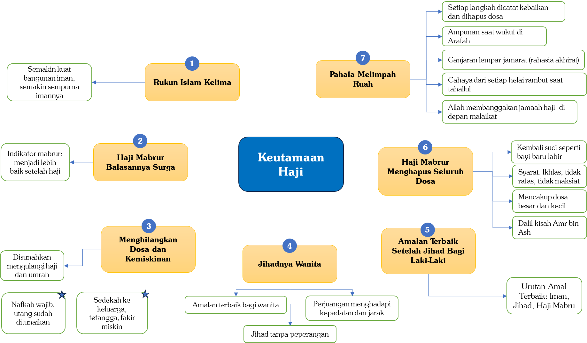

# 1.2 — Jamaah Haji Adalah Tamu-tamu Allah

Setelah Nabi Ibrahim dan putranya, Nabi Ismail ‘alaihimassalâm, selesai membangun Ka’bah, Allah ﷻ memerintahkan Nabi Ibrahim untuk menyeru manusia agar datang menunaikan ibadah haji.

Mengapa? Karena rumah Allah ﷻ, Baitullah, telah siap dibangun, dan tugas manusia tinggal datang menuju Baitullah untuk menunaikan haji. Allah ﷻ berfirman,

```arabic
﴿وَأَذِّن فِي ٱلنَّاسِ بِٱلۡحَجِّ يَأۡتُوكَ رِجَالٗا وَعَلَىٰ كُلِّ ضَامِرٖ يَأۡتِينَ مِن كُلِّ فَجٍّ عَمِيقٖ﴾
```

“Dan serulah manusia untuk mengerjakan haji, niscaya mereka akan datang kepadamu dengan berjalan kaki, atau mengendarai setiap unta yang kurus, mereka datang dari segenap penjuru yang jauh.” (QS. Al-Hajj: 27)

Untuk apakah manusia menempuh perjalanan jauh untuk berhaji? Allah ﷻ berfirman,

```arabic
﴿لِّيَشۡهَدُواْ مَنَٰفِعَ لَهُمۡ وَيَذۡكُرُواْ ٱسۡمَ ٱللَّهِ فِيٓ أَيَّامٖ مَّعۡلُومَٰتٍ عَلَىٰ مَا رَزَقَهُم مِّنۢ بَهِيمَةِ ٱلۡأَنۡعَٰمِۖ﴾
```

“Agar mereka menyaksikan berbagai manfaat untuk mereka dan agar mereka menyebut nama Allah pada beberapa hari yang telah ditentukan[^18] atas rezeki yang Dia berikan kepada mereka berupa hewan ternak.” (QS. Al-Hajj: 28)

Haji memiliki banyak manfaat. Manusia diperintahkan berhaji agar dapat merasakan dan menyaksikan manfaat-manfaat tersebut. Selain diampuni dosa-dosa, masih banyak kebaikan dan hikmah lain yang—insyâ`allâh—akan dijelaskan pada kesempatan lain.

Al-Imam Ibnu Katsir rahimahullâh menukil tafsir dari kalangan salaf mengenai ayat ini, yaitu ketika Allah ﷻ berfirman,

```arabic
﴿وَأَذِّن فِي ٱلنَّاسِ بِٱلۡحَجِّ﴾
```

“Wahai Ibrahim, serulah kepada manusia untuk datang melaksanakan ibadah haji.”

Ketika datang perintah ini kepada Nabi Ibrahim ‘alaihissalâm, maka disebutkan bahwa beliau berkata,

```arabic
يَا رَبِّ كَيْفَ أُبَلِّغُ النَّاسَ وَصَوْتِي لَا يَنْفُذُهُمْ؟
```

“Wahai Rabbku, bagaimana saya bisa menyampaikan kepada orang-orang, menyuruh kepada mereka untuk berhaji, sementara suaraku tidak akan sampai kepada mereka?”

Yakni ketika Nabi Ibrahim berada di Makkah, timbul pertanyaan: bagaimana mungkin seruannya sampai kepada seluruh manusia? Maka Allah ﷻ berkata,

```arabic
نَادِ، وَعَلَيْنَا الْبَلَاغُ
```

“Menyerulah engkau, yang akan menyampaikannya adalah Kami.”

Maka Nabi Ibrahim alaihissalâm pun berdiri di tempatnya. Ada yang mengatakan beliau berdiri di atas Hijir, ada yang mengatakan di atas bukit Shafa, dan ada pula yang mengatakan di atas gunung Abu Qubais. Dari situ, beliau menyeru seraya berkata,

```arabic
يَا أَيُّهَا النَّاسُ، إِنْ رَبَّكُمْ قَدِ اتَّخَذَ بَيْتًا فَحُجُّوهُ
```

“Wahai manusia sekalian, sesungguhnya Rabb kalian telah membangun Baitullah, maka datanglah, berhajilah kalian kepadanya.”[^19]

Demikianlah Nabi Ibrahim ‘alaihissalâm menyeru manusia, menyampaikan panggilan dan undangan Allah ﷻ agar mendatangi rumah-Nya. Sejak saat itu, orang-orang pun merindukan untuk menunaikan ibadah haji, karena suara Nabi Ibrahim telah menyampaikan undangan Allah ﷻ kepada mereka.

Mereka yang datang memenuhi seruan Nabi Ibrahim sesungguhnya sedang memenuhi undangan Allah ﷻ, sehingga mereka dikenal sebagai Tamu-tamu Allah. Nabi ﷺ bersabda,

```arabic
((الحُجَّاجُ وَالْعُمَّارُ وَفْدُ اللهِ، دَعَاهُمْ فَأَجَابُوْهُ، سَأَلُوْهُ فَأَعْطَاهُمْ))
```

“Sesungguhnya para jamaah haji dan para jamaah umrah adalah tamu Allah. Allah telah panggil mereka dan mereka pun memenuhi panggilan-Nya. Jika mereka memohon kepada Allah, maka Allah pun akan mengabulkan permohonan tersebut.”[^20]

Oleh karena itulah syiar mereka tatkala berihram adalah,

```arabic
لَبَّيْكَ اللَّهُمَّ لَبَّيْكَ
```

“Aku penuhi panggilanmu, ya Allah. Aku penuhi undanganmu.”

Sejak Nabi Ibrahim ‘alaihissalâm mengumandangkan seruan itu, Ka’bah terus dikunjungi oleh manusia dari generasi ke generasi. Kunjungan ini terus berlanjut, bahkan tetap berlangsung meskipun di akhir zaman muncul fitnah-fitnah besar.

Dalam hadis yang sahih, Nabi ﷺ bersabda,

```arabic
((لَيُحَجَّنَّ الْبَيْتُ وَلَيُعْتَمَرَنَّ بَعْدَ خُرُوجِ يَأْجُوجَ وَمَأْجُوجَ))
```

“Sungguh, Baitullah benar-benar akan tetap dihajikan dan diumrahkan, bahkan setelah keluarnya Ya`juj dan Ma`juj.”[^21]

Jadi, meskipun terjadi kekacauan dan huru-hara besar, Ka’bah tetap dikunjungi untuk berhaji. Kita ketahui bahwa salah satu tanda huru-hara yang sangat besar menjelang hari kiamat adalah keluarnya Ya`juj dan Ma`juj, yang akan menebarkan kerusakan di muka bumi dan membunuh makhluk-makhluk yang ada. Namun, meskipun mereka keluar dan menimbulkan kehancuran, ibadah haji tetap berlangsung.

Lalu, kapan haji akan berhenti? Kapan Ka’bah tidak lagi dikunjungi? Jawabannya adalah ketika ruh-ruh kaum mukminin di akhir zaman telah dicabut oleh Allah ﷻ, sehingga di muka bumi hanya tersisa orang-orang paling buruk, yang akan menyaksikan tibanya hari kiamat dalam keadaan hidup. Saat itulah ibadah haji akan benar-benar berhenti. Nabi ﷺ bersabda,

```arabic
((لَا تَقُومُ السَّاعَةُ حَتَّى لَا يُحَجَّ الْبَيْتُ))
```

“Tidak akan tegak hari kiamat kecuali sudah tidak ada orang lagi yang berhaji (tidak ada lagi yang datang menuju Baitullah).”[^22]

Pada saat itu, Ka’bah tidak lagi diagungkan. Maka Allah ﷻ membiarkan Ka’bah dihancurkan oleh seseorang yang berasal dari Habasyah. Nabi ﷺ bersabda,

```arabic
((يُخَرِّبُ الْكَعْبَةَ ذُوْ السُّوَيْقَتَيْنِ مِنَ الْحَبَشَةِ))
```

“Ka’bah akan dihancurkan oleh seseorang dari Habasyah yang kedua betisnya kurus kerempeng.”[^23]

# 1.3 — Segeralah Memperoleh Predikat “tamu Allah”

Seorang yang memiliki kemampuan untuk melaksanakan ibadah haji maka hendaknya dia segera melaksanakan ibadah haji, sebagai upaya untuk menyempurnakan rukun Islam yang lima.

Betapa indahnya apabila seseorang bertemu dengan Allah ﷻ dalam keadaan telah menyempurnakan seluruh rukun Islam: dia telah mengucapkan syahadat, menunaikan salat, membayar zakat, menunaikan puasa, dan menunaikan haji. Inilah kesempurnaan ibadah yang menjadi dambaan setiap muslim.

Nabi ﷺ bersabda,

```arabic
((مَنْ أَرَادَ الْحَجَّ فَلْيَتَعَجَّلْ فَإِنَّهُ قَدْ يَمْرَضُ الْمَرِيْضُ وَتَضِلُّ الضَّالَّةُ وَتَعْرِضُ الْحَاجَةُ))
```

“Barang siapa ingin berhaji maka bersegeralah, karena sesungguhnya bisa jadi seorang itu sakit, bisa jadi tunggangan yang akan dia gunakan hilang (tidak bisa digunakan), dan bisa jadi pula ada kebutuhan yang datang (sehingga dia tidak bisa untuk berhaji).”[^24]

Maka, jika seseorang sudah memiliki kemampuan dan harta untuk berhaji, hendaknya dia segera mendaftar dan berazam kepada Allah ﷻ untuk menunaikan ibadah ini. Jika dia menunda-nunda, bisa jadi dia dihadapkan dengan kondisi-kondisi sulit: mungkin di kemudian hari dia jatuh sakit, meninggal, atau keadaan yang mengharuskannya mengeluarkan uang untuk keperluan lain sehingga tidak dapat menunaikan haji. Kita tidak pernah tahu apa yang akan terjadi esok hari.

Jika mampu, segeralah berhaji untuk memenuhi panggilan Allah ﷻ dan menjadi tamu-Nya. Terlebih lagi, di beberapa daerah di tanah air kita, masa tunggu pendaftaran haji bisa mencapai 20-an tahun, bahkan di beberapa negara Islam hingga 40 tahun. Bisa jadi seseorang sudah mendaftar, tetapi ketika namanya dipanggil, dia telah lebih dahulu dipanggil oleh Allah ﷻ. Namun, barang siapa yang telah mendaftar dan berusaha menunaikan haji, semoga dia tetap memperoleh pahala, karena usahanya sudah dicatat sebagai kebaikan di sisi Allah ﷻ.

Memang, para ulama berbeda pendapat mengenai sifat kewajiban haji: apakah termasuk عَلَى الْفَوْرِ (harus segera dilakukan) atau عَلَى التَّرَاخِي (boleh ditunda). Mayoritas ulama berpendapat bahwa haji adalah kewajiban yang harus segera dilakukan begitu seseorang mampu, sedangkan ulama Syafi’iyah membolehkan menundanya.

Pendapat yang lebih kuat adalah pendapat mayoritas ulama: jika seseorang telah memiliki kemampuan, baik fisik yang kuat maupun harta yang cukup, hendaknya dia segera menunaikan ibadah haji tanpa menunda. Karena dia tidak mengetahui apa yang akan terjadi di masa mendatang, seperti yang telah dijelaskan dalam hadis sebelumnya.

Secara logis, perintah memang seharusnya segera dilaksanakan. Contohnya, Allah ﷻ memberi hukuman kepada Iblis tatkala dia diperintahkan bersujud kepada Adam tetapi menolak. Mengapa? Karena dia seharusnya segera melaksanakan perintah itu. Tatkala dia menolak untuk segera sujud kepada Adam, maka Allah ﷻ tidak memberi kesempatan baginya untuk sujud di lain waktu, dan Allah ﷻ pun menghukumnya.

Dalam pembahasan Usul Fikih, ada perbedaan pendapat mengenai hukum asal kewajiban: apakah hukum asalnya harus segera dilakukan sampai ada dalil yang memperbolehkan penundaan, atau hukum asalnya bisa ditunda sampai ada dalil yang menyatakan harus disegerakan.

Pendapat yang lebih kuat menyatakan bahwa segala perintah Allah ﷻ seharusnya segera dilaksanakan, kecuali ada dalil yang menunjukkan kelonggaran waktu. Jika tidak ada dalil semacam itu, maka hukum asalnya adalah kewajiban harus segera dilaksanakan. Ibadah haji termasuk dalam kategori ini: begitu seseorang mampu, dia seharusnya menunaikannya tanpa menunda.

Nabi ﷺ tidak pernah berkata, “Kalian boleh berhaji kapan saja,” dan memang tidak ada dalil seperti itu. Jika pun haji boleh ditunda, tidak ada petunjuk yang jelas sejauh mana penundaan diperbolehkan, apakah 10, 20, atau 30 tahun? Dan ini mengonsekuensikan jika seseorang berencana menunda hingga 30 tahun, tetapi meninggal 10 tahun kemudian, sehingga dia tidak sempat menunaikan haji, maka dia tidak berdosa.

Yang benar adalah ketika Allah ﷻ memerintahkan haji, seorang yang mampu harus segera menunaikannya. Artinya, jika seseorang telah memiliki kemampuan fisik dan harta, tapi dia menunda hajinya, maka penundaan tersebut merupakan bentuk dosa. Oleh karena itu, tidak benar seseorang yang berkata, “Saya akan berhaji bila sudah berumur 50 tahun” atau “nanti kalau sudah pensiun baru saya berhaji”. Jika kemampuan sudah ada, maka dia wajib segera mendaftar ibadah haji. Jika dia menundanya, maka penundaan tersebut merupakan bentuk dosa kepada Allah ﷻ.

Contoh semangat yang luar biasa ditunjukkan sahabat wanita yang bernama Asma` binti Umais. Tatkala dia berhaji, dia melahirkan putranya di Dzul Hulaifah, yaitu Muhammad bin Abu Bakar as-Shiddiq. Dia tentu menyadari betapa beratnya kondisi setelah melahirkan dan perjalanan jauh dari Madinah ke Makkah, sekitar 500 Km, serta tantangan merawat sang putra. Namun, semua itu tidak membuatnya menunda hajinya hingga tahun berikutnya.[^25]

# 1.4 — Bersabarlah…!

BESARNYA PAHALA SESUAI DENGAN TINGKAT KELETIHAN

Tidak diragukan lagi, haji adalah ibadah yang menuntut kelelahan dan kesulitan. Terlebih pada zaman dahulu, banyak orang yang ketika hendak berhaji menulis wasiat dan berpamitan seakan-akan mereka tidak akan kembali. Kenyataan pun menunjukkan banyak jamaah haji yang berpamitan kepada keluarga, namun akhirnya tidak kembali. Hal ini menegaskan bahwa haji adalah ibadah yang tidak terlepas dari kesulitan dan pengorbanan.

Di zaman modern ini, Allah ﷻ memberikan banyak kemudahan bagi para jamaah, mulai dari fasilitas transportasi yang nyaman seperti pesawat hingga penginapan yang layak. Namun, meskipun serba mudah, haji tetap tidak bisa lepas dari tantangan dan kepayahan. Beberapa jamaah yang “dengan kondisinya” menghadapi kesulitan dan kepayahan tambahan, misalnya karena usia yang sudah lanjut, kondisi kesehatan yang lemah, atau fisik yang kurang prima. Namun ingatlah: semakin berat kesulitan yang dihadapi dan semakin besar keletihan yang dirasakan dalam menjalankan ibadah haji, maka semakin besar pula pahala yang akan didapatkan.

Contohnya, sebagian jamaah haji reguler yang mendapat tenda di Mina jauh dari lokasi melontar jamrah, harus menempuh jarak pulang-pergi hampir 14 kilometer. Terlebih lagi jika musim haji bertepatan dengan musim panas yang terik dan menyengat, tentu ini menjadi ujian yang lebih berat lagi. Demikian pula, saat tawaf, kepadatan jamaah sering kali membuat yang biasanya bisa diselesaikan dalam 1/2 jam menjadi 2 jam. Beberapa jamaah bahkan terpaksa harus tawaf di lantai 2 atau 3, sehingga jarak tempuh menjadi lebih jauh.

Banyak juga jamaah yang menghadapi macet di Muzdalifah; sebagian tidak bisa turun dari bus hingga pagi hari, sementara yang lain harus menempati lokasi mabit yang kurang layak, jauh dari toilet, atau dilewati kendaraan yang mengeluarkan asap sehingga menyesakkan dada.

Demikian juga tidak sedikit jamaah yang tidak memiliki tenda sehingga harus berjalan kaki dari satu tempat ke tempat lain, bahkan terpisah dari rombongan karena padatnya jamaah. Banyak juga jamaah Indonesia yang tersesat, tidak mengetahui lokasi tenda atau hotel mereka.

Tentu masih banyak kesulitan-kesulitan lain yang dihadapi oleh para jamaah haji, beraneka ragam dan berbeda-beda. Namun, semua itu jika dihadapi dengan sabar akan menambah besar pahala di sisi Allah ﷻ.

Nabi ﷺ tidak pernah mengatakan, “Barang siapa yang tawafnya lebih cepat, maka pahalanya lebih besar,” atau “Barang siapa yang mendapat tenda lebih dekat dengan tempat melontar, maka pahalanya lebih besar.” Yang dikatakan Nabi ﷺ adalah,

```arabic
((وَلَكِنَّهَا عَلَى قَدْرِ نَفَقَتِكِ أَوْ نَصَبِكِ))
```

“Akan tetapi ganjarannya itu berdasarkan ukuran nafkahmu atau keletihanmu.”[^26]

Dalam riwayat lain,

```arabic
((وَلَكِنَّهُ عَلَى قَدْرِ عَنَائِكِ وَنَصَبِكِ))
```

“Akan tetapi pahalanya sesuai kadar kesulitanmu dan keletihanmu.”[^27]

Namun, semua keletihan, kelelahan, dan kesulitan dapat menjadi berpahala jika dihadapi dengan kesabaran. Hal ini sangat berkaitan dengan keyakinan seseorang terhadap takdir Allah ﷻ. Banyak jamaah haji yang mudah mengeluh karena imannya terhadap takdir masih lemah; mereka menjalani ibadah haji dengan keluhan, sehingga ruh kenikmatan beribadah menjadi pudar, padahal kesulitan yang dihadapi sebenarnya masih tergolong normal.

Sebaliknya, banyak jamaah yang menghadapi ujian dan kesulitan luar biasa, tetapi karena iman mereka kuat dan selalu berbaik sangka kepada Allah ﷻ, semua tantangan itu terasa lebih ringan. Mereka justru lebih merasakan kenikmatan dan kedalaman ibadah haji.

Oleh karena itu, setiap calon jamaah haji sebaiknya menyiapkan hati dan diri sebelum berangkat, menghadapi kemungkinan kesulitan apa pun yang bisa datang kapan saja. Betapa pun fasilitas yang diberikan pihak travel terlihat nyaman atau mewah, tetap saja pasti ada kesulitan yang muncul. Sebaliknya, kesulitan yang tampaknya berat sering kali terasa ringan begitu dijalani. Kesiapan hati dan keimanan sangat menentukan bagaimana seorang haji menyikapi setiap tantangan selama ibadahnya.

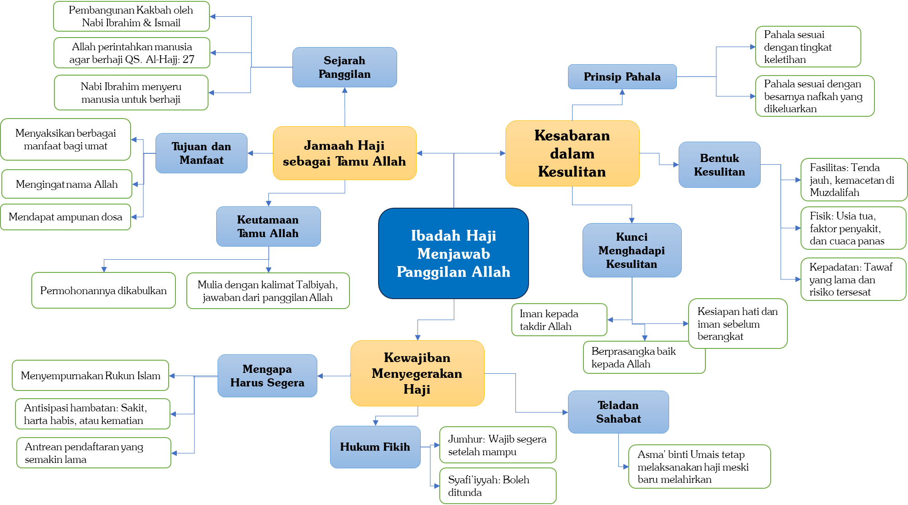

# 1.5 — Ikhlas Dalam Haji

Sesungguhnya ibadah haji yang diterima Allah ﷻ hanyalah yang dilaksanakan dengan keikhlasan dan sesuai dengan sunah Nabi ﷺ.

Sebesar apa pun pengorbanan yang dilakukan, sebanyak apa pun biaya yang dikeluarkan, atau seletih apa pun tenaga yang dikerahkan, jika semua itu tidak dibangun atas dasar keikhlasan, maka ibadah tersebut tidak akan diterima.

Lihatlah seorang mujahid yang berjuang di jalan Allah ﷻ, mengorbankan harta bahkan nyawanya. Namun, jika perjuangannya bukan karena Allah ﷻ, dia akan tetap menerima siksa di hari kiamat.

Begitu pula dengan haji. Orang yang berhaji memiliki potensi besar untuk memamerkan ibadahnya, sehingga niat dan keikhlasan menjadi penentu utama diterimanya hajinya. Oleh karena itu, tatkala Nabi ﷺ berhaji beliau berkata,

```arabic
((اللَّهُمَّ هَذِهِ حَجَّةٌ لَا رِيَاءَ فِيْهَا وَلَا سُمْعَةَ))
```

“Ya Allah, ini adalah haji yang tidak terdapat padanya ria maupun sumah.”[^28]

Ria—yaitu keinginan untuk dilihat orang lain, dan sumah—yaitu keinginan untuk didengar orang lain, menjadi godaan yang kuat dalam ibadah haji. Nabi ﷺ tidak pernah menekankan hal ini pada ibadah lain, sehingga ini menjadi isyarat bahwa haji sangat rawan terkontaminasi oleh ria dan sumah.

Bahkan, banyak orang setelah pulang dari haji merasa tersinggung atau marah jika tidak dipanggil “Pak Haji,” padahal hal itu menunjukkan kurangnya keikhlasan.

Berikut ini adalah beberapa bentuk kegiatan atau sikap yang dapat merusak keikhlasan seseorang dalam berhaji. Di antaranya adalah:

- Berhaji dengan niat “pencitraan”, misalnya untuk menunjukkan diri di media sosial atau terutama pada musim politik dan pemilu, di mana ada tim yang disiapkan untuk merekam dan mempublikasikan setiap aktivitas selama berhaji.

- Berhaji karena malu terhadap pandangan orang lain, misalnya takut dicemooh tetangga dengan perkataan, “Sudah kaya raya, kok tidak berhaji?” Sehingga niat berhajinya bukan untuk Allah ﷻ, tetapi semata-mata untuk menghindari celaan manusia, yang tentu merusak keikhlasan ibadah.

- Berhaji menggunakan travel atau paket yang mahal—tentu hal ini diperbolehkan—tetapi niatnya untuk memamerkan kekayaan dan kesombongan. Jika tujuan berhajinya bergeser menjadi ingin dilihat atau dikagumi karena biaya yang mahal, maka keikhlasan ibadahnya menjadi tercemar.

- Berhaji sambil terus-menerus selfie, kemudian hasilnya dipublikasikan di media sosial, dijadikan status profil, atau bahkan dipajang di ruang tamu.

Semua kegiatan yang berpotensi merusak niat saat berhaji sebaiknya dihindari. Ketahuilah, seseorang tidak akan menjadi haji mabrur kecuali jika dia ikhlas kepada Allah ﷻ, berhaji semata-mata karena mengharap rida dan ampunan-Nya, bukan untuk dilihat atau dikagumi manusia.

Nabi ﷺ bersabda,

```arabic
((مَنْ حَجَّ لِلَّهِ فَلَمْ يَرْفُثْ، وَلَمْ يَفْسُقْ، رَجَعَ كَيَوْمِ وَلَدَتْهُ أُمُّهُ))
```

“Barang siapa yang berhaji karena Allah dan dia tidak melakukan rafas[^29] juga tidak melakukan kemaksiatan saat berhaji maka dia akan kembali sebagaimana hari dia dilahirkan dari perut ibunya.”[^30]

Di sini Nabi ﷺ menetapkan tiga syarat agar haji seseorang menjadi haji mabrur: (1) ikhlas karena Allah semata, (2) tidak melakukan rafas (perbuatan atau perkataan yang memicu syahwat), dan (3) tidak bermaksiat. Perhatikanlah: syarat pertama adalah ikhlas. Ia menempati posisi yang paling pertama dan utama, karena menjadi dasar diterimanya seluruh ibadah.

Bukankah talbiah seorang haji adalah,

```arabic
لَبَّيْكَ لَا شَرِيكَ لَكَ لَبَّيْكَ
```

“Ya Allah, aku memenuhi panggilan-Mu. Ya Allah tidak ada sekutu bagi-Mu.”

Artinya, seseorang yang ikhlas mengikrarkan bahwa dia berhaji semata-mata untuk menunaikan panggilan Allah ﷻ dan menegaskan tiada sekutu bagi-Nya. Tidak ada niat untuk dipuji, disanjung, diakui, atau dihormati manusia.

Sungguh merugi orang yang telah mengeluarkan biaya besar, meninggalkan pekerjaan, bahkan keluarga dan kampung halamannya, berletih-letih di Mina, Padang Arafah, Muzdalifah, dan Masjidilharam, tetapi niatnya bukan karena Allah ﷻ. Segala pengorbanan itu akan sia-sia, hanya keletihan yang dia rasakan, dan bahkan siksaan menantinya di akhirat.

# 1.6 — Meneladani Nabi ﷺ

Syarat kedua agar suatu amal saleh diterima adalah mencontoh Nabi ﷺ. Jika dalam ibadah lain kita diwajibkan mengikuti sunah Nabi, apalagi dalam ibadah haji, yang terdiri dari banyak ritual dengan hikmah yang sering sulit kita pahami sepenuhnya.

Contohnya: mengapa tawaf harus dilakukan di Ka’bah dan bukan di tempat lain? Mengapa tawaf dilakukan dengan berputar-putar? Mengapa mencium Hajar Aswad? Mengapa harus tujuh putaran? Mengapa melempar jamrah dengan tujuh kerikil kecil? Mengapa lelaki yang sedang ihram tidak boleh menutup kepala, dan perempuan tidak boleh bercadar atau memakai kaos tangan saat ihram? Masih banyak lagi aturan lain yang hikmahnya mungkin sulit kita cerna.

Tatkala Umar bin al-Khaththab radhiyallâhu ‘anhu mencium Hajar Aswad, beliau berkata kepada Hajar Aswad,

```arabic
أَمَا وَاللَّهِ، إِنِّي لَأَعْلَمُ أَنَّكَ حَجَرٌ لَا تَضُرُّ وَلَا تَنْفَعُ، وَلَوْلَا أَنِّي رَأَيْتُ النَّبِيَّ ﷺ اسْتَلَمَكَ مَا اسْتَلَمْتُكَ
```

“Ketahuilah, demi Allah, sesungguhnya aku benar-benar tahu bahwasanya engkau hanyalah batu, engkau tidak memberi mudarat dan juga manfaat. Kalau bukan karena aku melihat Nabi mengusapmu maka aku tidak akan mengusapmu.”[^31]

Dalam riwayat yang lain,

```arabic
وَلَوْلَا أَنِّي رَأَيْتُ النَّبِيَّ ﷺ يُقَبِّلُكَ مَا قَبَّلْتُكَ
```

“Kalau bukan karena aku telah melihat Nabi menciummu maka aku tidak akan menciummu.”[^32]

Ibnu Hajar berkata,

```arabic
وَفِي قَوْلِ عُمَرَ هَذَا التَّسْلِيمُ لِلشَّارِعِ فِي أُمُورِ الدِّينِ وَحُسْنُ الِاتِّبَاعِ فِيمَا لَمْ يَكْشِفْ عَنْ مَعَانِيهَا وَهُوَ قَاعِدَةٌ عَظِيمَةٌ فِي اتِّبَاعِ النَّبِيِّ ﷺ فِيمَا يَفْعَلُهُ وَلَوْ لَمْ يَعْلَمِ الْحِكْمَةَ فِيهِ
```

“Dalam ucapan Umar ini terdapat sikap berserah diri kepada Syariat dalam urusan agama serta indahnya mengikuti ajaran, meskipun makna dan hikmahnya belum tersingkap. Ini merupakan kaidah agung dalam meneladani Nabi pada setiap perbuatan beliau, sekalipun hikmahnya belum diketahui.”[^33]

Oleh karena itu, Ketika Mu’awiyah radhiyallâhu ‘anhu tawaf, beliau menyentuh 4 rukun (sudut) Ka’bah. Perbuatan beliau ditegur oleh Ibnu Abbas radhiyallâhu ‘anhumâ,

```arabic
إِنَّهُ لَا يُسْتَلَمُ هَذَانِ الرُّكْنَانِ
```

“Sesungguhnya dua sudut ini tidak perlu disentuh.”

Mu’awiyah berkata,

```arabic
لَيْسَ شَيْءٌ مِنَ الْبَيْتِ مَهْجُوْرًا
```

“(Tidak apa-apa) Agar tidak ada sedikit pun bagian Ka’bah yang ditinggalkan.”[^34]

Dalam riwayat Ahmad, Ibnu Abbas kemudian membacakan ayat,

```arabic
ﵟلَّقَدۡ كَانَ لَكُمۡ فِي رَسُولِ ٱللَّهِ أُسۡوَةٌ حَسَنَةٞﵞ
```

“Sungguh telah ada bagi kalian teladan yang baik pada diri Rasulullah.” (QS. Al-Ahzâb: 21)

Maka Mu’awiyah pun berkata,

```arabic
صَدَقْتَ
```

“Engkau benar (wahai Ibnu Abbas).”[^35]

Kemudian Mu’awiyah hanya mengusap dua bagian saja, yaitu Rukun Yamani dan Rukun Hajar Aswad, karena dua rukun lainnya (Rukun Syamiyain) bukanlah bagian asli dari Ka’bah. Al-Imam asy-Syafi’i berkata,

```arabic
بِأَنَّا لَمْ نَدَّعِ اسْتِلَامَهُمَا هَجْرًا لِلْبَيْتِ، وَكَيْفَ يَهْجُرُهُ وَهُوَ يَطُوفُ بِهِ؟ وَلَكِنَّا نَتَّبِعُ السُّنَّةَ فِعْلًا أَوْ تَرْكًا، وَلَوْ كَانَ تَرْكُ اسْتِلَامِهِمَا هَجْرًا لَهُمَا، لَكَانَ تَرْكُ اسْتِلَامِ مَا بَيْنَ الْأَرْكَانِ هَجْرًا لَهَا، وَلَا قَائِلَ بِهِ
```

“Sesungguhnya kami tidak menganggap bahwa tidak mengusap (dua rukun itu) sebagai bentuk meninggalkan Baitullah. Bagaimana mungkin ia meninggalkannya, sementara ia sedang bertawaf mengelilinginya?

Akan tetapi, kami mengikuti sunah, baik dalam melakukan maupun dalam meninggalkan. Seandainya meninggalkan mengusap keduanya dianggap sebagai bentuk meninggalkan keduanya, tentu meninggalkan mengusap bagian di antara rukun-rukun juga dianggap sebagai bentuk meninggalkannya, dan tidak ada seorang pun yang berpendapat demikian.”[^36]

Maka meneladani Nabi ﷺ dalam setiap langkah dan gerakan merupakan kewajiban, dan tidak boleh diganti atau ditentang dengan pendapat pribadi atau analogi. Sebagaimana Jabir bin Abdillah radhiyallâhu ‘anhumâ berkata,

```arabic
رَأَيْتُ النَّبِيَّ ﷺ يَرْمِي عَلَى رَاحِلَتِهِ يَوْمَ النَّحْرِ، وَيَقُولُ: ((لِتَأْخُذُوا مَنَاسِكَكُمْ، فَإِنِّي لَا أَدْرِي لَعَلِّي لَا أَحُجُّ بَعْدَ حَجَّتِي هَذِهِ))
```

“Aku melihat Nabi ﷺ di atas untanya pada hari Raya Idul Adha melempar jamrah dan beliau berkata, ‘Hendaknya kalian mengambil tata cara manasik kalian, sesungguhnya aku tidak tahu bisa jadi aku tidak lagi berhaji setelah hajiku ini’.”[^37]

An-Nawawi berkata,

```arabic
وَهَذَا الْحَدِيثُ أَصْلٌ عَظِيمٌ فِي مَنَاسِكِ الْحَجِّ وَهُوَ نَحْوُ قَوْلِهِ ﷺ فِي الصَّلَاةِ ((صَلُّوا كَمَا رَأَيْتُمُونِي أُصَلِّي)) وَقَوْلُهُ ﷺ ((لَعَلِّي لَا أَحُجُّ بَعْدَ حَجَّتِي هَذِهِ)) فِيهِ إِشَارَةٌ إِلَى تَوْدِيعِهِمْ وَإِعْلَامِهِمْ بِقُرْبِ وَفَاتِهِ ﷺ وَحَثِّهِمْ عَلَى الِاعْتِنَاءِ بِالْأَخْذِ عَنْهُ
```

“Hadis ini adalah landasan yang agung dalam manasik haji, dan ini seperti sabda Nabi dalam salat, ‘Salatlah sebagaimana kalian melihatku salat.’

Sabda beliau, ‘Bisa jadi aku tidak berhaji lagi setelah hajiku ini.’ Di dalamnya terdapat isyarat perpisahan beliau dengan para sahabat, pemberitahuan tentang dekatnya wafat beliau, serta dorongan agar mereka bersungguh-sungguh dalam mengambil dan mempelajari ajaran darinya.”[^38]

Jabir bin Abdillah radhiyallâhu ‘anhumâ—yang meriwayatkan hadis terpanjang dan terlengkap tentang tata cara haji Nabi ﷺ—berkata,

```arabic
إِنَّ رَسُولَ اللهِ ﷺ مَكَثَ تِسْعَ سِنِينَ لَمْ يَحُجَّ، ثُمَّ أَذَّنَ فِي النَّاسِ فِي الْعَاشِرَةِ، أَنَّ رَسُولَ اللهِ ﷺ حَاجٌّ، فَقَدِمَ الْمَدِينَةَ بَشَرٌ كَثِيرٌ، كُلُّهُمْ يَلْتَمِسُ أَنْ يَأْتَمَّ بِرَسُولِ اللهِ ﷺ، وَيَعْمَلَ مِثْلَ عَمَلِهِ
```

“Sesungguhnya Rasulullah menetap (di Madinah) selama 9 tahun dan beliau tidak berhaji. Lalu beliau mengumumkan kepada manusia pada tahun ke 10 bahwasanya Rasulullah akan berhaji. Maka banyak orang yang datang ke Madinah, semuanya ingin mencontohi Rasulullah dan beramal seperti amal beliau.”[^39]

Maka kita pun hendaknya berusaha mengikuti jejak para sahabat, yang sebisa mungkin meneladani Nabi ﷺ secara maksimal. Tidak perlu menambah-nambah atau menciptakan amalan-amalan yang tidak dicontohkan oleh Nabi ﷺ.

Inti dari ibadah adalah menjalankan perintah Allah. Allah ﷻ menginginkan agar ibadah kita meneladani Rasul-Nya, bukan sekadar menuruti keinginan atau hawa nafsu kita sendiri.

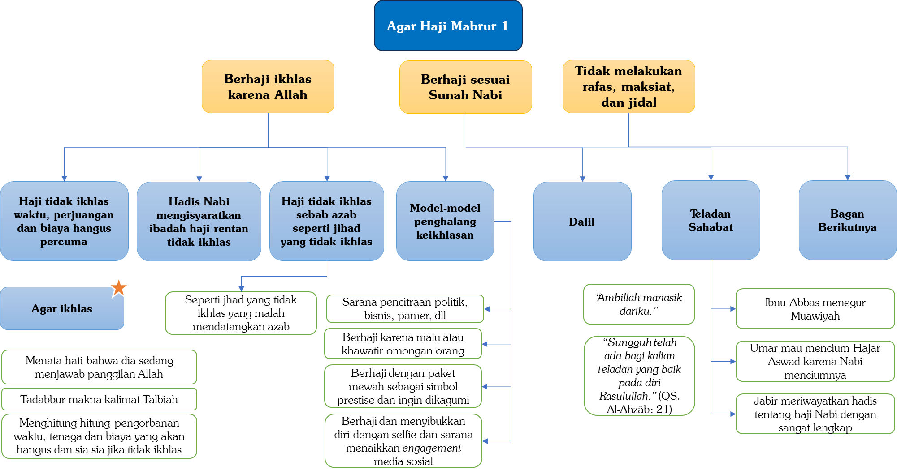

# 1.7 — Jangan Berdebat…!!!

Haji adalah ibadah yang biasanya dilaksanakan secara berjamaah dan berombongan. Seperti yang kita ketahui, sebuah rombongan terdiri dari berbagai macam orang dengan tingkat sosial, intelektual, usia, dan pengendalian emosi yang berbeda-beda. Perbedaan inilah yang menjadi potensi munculnya perselisihan dan perbedaan pandangan.

Selain itu, perjalanan haji yang panjang, melelahkan, dan penuh tantangan semakin memperbesar kemungkinan terjadinya perselisihan di antara jamaah.

Oleh karena itu, Allah menurunkan ayat khusus yang melarang perdebatan dan perselisihan dalam pelaksanaan ibadah haji. Allah ﷻ berfirman,

```arabic
﴿وَلَا جِدَالَ فِي ٱلۡحَجِّۗ﴾
```

“Dan tidak boleh berbantah-bantahan di dalam masa mengerjakan haji.” (QS. Al-Baqarah: 197)

Di antara makna “dilarang berjidal atau berdebat” menurut para salaf adalah:

- Jangan mendebat kawan hingga membuatnya marah,

- Jangan mengangkat suara di hadapannya,

- Jangan mencaci atau menghina saudara,

- Jangan menimbulkan permusuhan.[^40]

Bahkan, sebagian ulama menyatakan bahwa larangan berdebat juga mencakup permasalahan fikih haji, terutama jika perdebatan itu berpotensi menimbulkan sengketa atau perselisihan di antara jamaah.[^41] Hal ini karena perdebatan hanyalah menimbulkan keburukan dan permusuhan di antara jamaah haji.

As-Si’di rahimahullâh berkata,

```arabic
وَالْمَقْصُوْدُ مِنَ الْحَجِّ، الذُّلُّ وَالاِنْكِسَارُ لِلَّهِ، وَالتَّقَرُّبُ إِلَيْهِ بِمَا أَمْكَنَ مِنَ الْقُرُبَاتِ، وَالتَّنَزُّهُ عَنْ مُقَارَفَةِ السَّيِّئَاتِ، فَإِنَّهُ بِذَلِكَ يَكُوْنُ مَبْرُوْرًا، وَالْمَبْرُوْرُ لَيْسَ لَهُ جَزَاءٌ إِلَا الْجَنَّةُ، وَهَذِهِ الْأَشْيَاءُ وَإِنْ كَانَتْ مَمْنُوْعَةً فِي كُلِّ مَكَانٍ وَزَمَانٍ، فَإِنَّهَا يَتَغَلَّظُ الْمَنْعُ عَنْهَا فِي الْحَجِّ
```

“Tujuan dari haji adalah merendahkan dan menghinakan diri di hadapan Allah, mendekatkan diri kepada-Nya semaksimal mungkin dengan kebajikan-kebajikan, serta membersihkan diri dari melakukan hal-hal yang buruk. Dengan demikian maka jadilah haji mabur. Dan haji mabrur tidak ada balasan yang setimpal kecuali surga. Meskipun perkara-perkara ini (di antaranya perdebatan) dilarang di setiap tempat dan waktu akan tetapi lebih terlarang lagi tatkala haji.”[^42]

Oleh karena itu, seseorang yang berhaji, terutama saat berihram, hendaknya menjauhkan diri dari ego dan keakuan, yang menjadi penyebab utama perselisihan. Hendaklah dia berusaha untuk merendahkan diri di hadapan Allah ﷻ, salah satunya dengan bersikap mengalah karena Allah ﷻ. Ingatlah sabda Nabi ﷺ,

```arabic
((أَنَا زَعِيْمٌ بِبَيْتٍ فِي رَبَضِ الْجَنَّةِ لِمَنْ تَرَكَ الْمِرَاءَ وَإِنْ كَانَ مُحِقًّا))
```

“Aku menjamin istana di pinggiran surga bagi orang yang meninggalkan perdebatan meskipun ia yang benar.”[^43]

Meskipun pada umumnya jamaah haji Indonesia dikenal sabar dan tidak emosian dibandingkan jamaah dari negara lain, tetaplah berhati-hati dan selalu menghindari perdebatan. Karena jika perselisihan timbul, suasana hati saat berhaji akan terganggu; ibadah menjadi tidak khusyuk dan tidak tenteram. Apalagi jika pertikaian terjadi dengan kawan satu rombongan, satu kloter, satu grup, satu kamar, atau bahkan dengan pasangan sendiri.

Orang yang mampu menahan diri dari berdebat dan selamat dari permusuhan serta pertikaian selama haji, sungguh termasuk tamu Allah ﷻ yang berakhlak mulia. Jangan sampai seseorang tidak sabar lantas berdebat dan bertikai tatkala haji akhirnya ke-mabrur-an hajinya yang menjadi tumbal, sirna karena emosi sesaat. Semoga Allah ﷻ senantiasa membimbing para jamaah haji agar berhaji dengan akhlak yang mulia. [^44]

# 1.8 — Hindari Maksiat Tatkala Haji Agar Meraih Haji Mabrur

Jika maksiat dilarang di mana pun dan kapan pun, maka apalagi saat berhaji di Tanah Suci Makkah, tempat yang suci dan penuh keberkahan, di mana larangan maksiat seharusnya dijaga dengan lebih ketat.

Allah ﷻ berfirman,

```arabic
﴿ٱلۡحَجُّ أَشۡهُرٞ مَّعۡلُومَٰتٞۚ فَمَن فَرَضَ فِيهِنَّ ٱلۡحَجَّ فَلَا رَفَثَ وَلَا فُسُوقَ وَلَا جِدَالَ فِي ٱلۡحَجِّۗ وَمَا تَفۡعَلُواْ مِنۡ خَيۡرٖ يَعۡلَمۡهُ ٱللَّهُۗ وَتَزَوَّدُواْ فَإِنَّ خَيۡرَ ٱلزَّادِ ٱلتَّقۡوَىٰۖ وَٱتَّقُونِ يَٰٓأُوْلِي ٱلۡأَلۡبَٰبِ﴾
```

“(Musim) haji adalah beberapa bulan yang dimaklumi. Barang siapa yang menetapkan niatnya dalam bulan itu akan mengerjakan haji, maka tidak boleh rafas, berbuat fasik dan berbantah-bantahan di dalam masa mengerjakan haji. Dan apa yang kamu kerjakan berupa kebaikan, niscaya Allah mengetahuinya. Berbekallah, dan sesungguhnya sebaik-baik bekal adalah takwa dan bertakwalah kepada-Ku hai orang-orang yang berakal.” (QS. Al-Baqarah: 197)

Yang dimaksud dengan ﴿فُسُوقَ﴾ (kefasikan) menurut jumhur ahli tafsir adalah seluruh bentuk kemaksiatan, dan inilah pendapat yang dipilih oleh Ibnu Katsir rahimahullâh.

Meskipun kemaksiatan dilarang kapan pun dan di mana pun, pelarangannya menjadi lebih ditekankan saat seseorang berhaji. Hal ini serupa dengan larangan berbuat zalim di bulan-bulan haram; meskipun zalim dilarang sepanjang tahun, di bulan-bulan haram larangannya lebih ditekankan. Oleh karena itu, Allah ﷻ berfirman,

```arabic
﴿إِنَّ عِدَّةَ ٱلشُّهُورِ عِندَ ٱللَّهِ ٱثۡنَا عَشَرَ شَهۡرٗا فِي كِتَٰبِ ٱللَّهِ يَوۡمَ خَلَقَ ٱلسَّمَٰوَٰتِ وَٱلۡأَرۡضَ مِنۡهَآ أَرۡبَعَةٌ حُرُمٞۚ ذَٰلِكَ ٱلدِّينُ ٱلۡقَيِّمُۚ فَلَا تَظۡلِمُواْ فِيهِنَّ أَنفُسَكُمۡۚ﴾
```

“Sesungguhnya jumlah bulan menurut Allah ialah dua belas bulan, (sebagaimana) dalam ketetapan Allah pada waktu Dia menciptakan langit dan bumi, di antaranya ada empat bulan haram. Itulah (ketetapan) agama yang lurus, maka janganlah kamu menzalimi dirimu dalam (bulan yang empat) itu.” (QS. At-Taubah: 36)

Demikian pula, Allah secara khusus melarang berbuat zalim di Kota Makkah, sebagaimana difirmankan-Nya mengenai tanah suci Makkah,

```arabic
﴿وَمَن يُرِدۡ فِيهِ بِإِلۡحَادِۭ بِظُلۡمٖ نُّذِقۡهُ مِنۡ عَذَابٍ أَلِيمٖ﴾
```

“Dan siapa yang bermaksud di dalamnya melakukan kejahatan secara zalim, niscaya akan Kami rasakan kepadanya sebahagian siksa yang pedih.” (QS. Al-Hajj: 25)

Meskipun kezaliman dilarang di mana saja, di Kota Suci Makkah larangannya lebih tegas.[^45]

Para jamaah haji dianjurkan berusaha semaksimal mungkin untuk menghindari segala bentuk kemaksiatan, sekecil atau seringan apa pun, selama menjalankan ibadah haji, agar hajinya menjadi mabrur. Hal ini ditegaskan oleh Nabi ﷺ dalam sabdanya,

```arabic
((مَنْ حَجَّ لِلَّهِ فَلَمْ يَرْفُثْ، وَلَمْ يَفْسُقْ، رَجَعَ كَيَوْمِ وَلَدَتْهُ أُمُّهُ))
```

“Barang siapa yang berhaji karena Allah dan dia tidak melakukan rafas dan tidak melakukan kemaksiatan maka dia akan kembali sebagaimana hari dia dilahirkan dari perut ibunya.”[^46]

Bahkan, sebagian ulama, seperti Ibnu Hazm rahimahullâh, berpendapat bahwa maksiat yang dilakukan oleh seorang haji tidak hanya menghilangkan kemabruran hajinya, tetapi bahkan dapat membatalkan hajinya. Beliau berkata,

```arabic
وَكُلُّ مَنْ تَعَمَّدَ مَعْصِيَةً أَيَّ مَعْصِيَةٍ كَانَتْ - وَهُوَ ذَاكِرٌ لِحَجِّهِ مُذْ يُحْرِمُ إلَى أَنْ يُتِمَّ طَوَافَهُ بِالْبَيْتِ لِلْإِفَاضَةِ وَيَرْمِيَ الْجَمْرَةَ - فَقَدْ بَطَلَ حَجُّهُ
```

“Siapa saja yang sengaja melakukan kemaksiatan apapun, dan dia dalam kondisi ingat dirinya sedang berhaji, mulai dari sejak ihram hingga ia menyelesaikan tawaf ifadahnya di Ka’bah dan melempar jamrah, maka hajinya batal.”[^47]

Tentu, pendapat Ibnu Hazm ini tidaklah tepat. Namun, hal ini mengingatkan kita bahwa maksiat yang dilakukan oleh seorang haji tidak sama dengan maksiat yang dilakukan orang biasa.

Seorang haji yang bermaksiat sesungguhnya:

- Bermaksiat saat sedang menjalankan ibadah agung, yaitu haji.

- Bermaksiat di Tanah Haram Makkah, kecuali saat berada di Arafah yang merupakan tanah halal; tentu maksiat di Makkah tidak sama dengan di tempat lain.

- Bermaksiat di bulan-bulan haram (Zulkaidah, Zulhijah, Muharram, dan Rajab); tentu maksiat pada bulan-bulan ini lebih berat dibanding waktu lain.

- Merugi karena hilangnya kemabruran hajinya. Ibarat memanjat pohon dengan lelah tetapi tidak mendapatkan buahnya. Padahal buah dari haji adalah diampuni dosa-dosanya dan kembali bersih sebagaimana saat dilahirkan dari perut ibu.

Berikut beberapa bentuk kemaksiatan yang kadang dilakukan sebagian jamaah haji dan hendaknya dijauhi:

---

## Pertama: Syirik kepada Allah

Syirik kepada Allah, yang bentuknya sangat beragam. Salah satu yang sering terjadi adalah berdoa kepada Nabi ﷺ ketika berziarah ke kubur beliau. Ini termasuk syirik akbar yang bisa mengeluarkan seseorang dari Islam, sehingga hajinya gugur dan tidak bernilai sama sekali.

Di antara kesyirikan yang tersebar juga adalah menggunakan jimat. Hingga zaman sekarang, masih ada orang yang percaya pada jimat. Jimat adalah semua yang digantungkan atau dipakai sebagai penangkal atau penghilang bala. Jimat bisa berupa rajah yang ditulis di kertas, cincin atau gelang, atau bahkan foto seorang kiai atau Tuan Guru yang dipajang karena dianggap mendatangkan berkah atau menolak bala.

---

## Kedua: Merokok

Ketahuilah bahwa hukum merokok adalah haram. Nabi ﷺ bersabda,

```arabic
((لَا ضَرَرَ وَلَا ضِرَارَ))
```

“Tidak boleh memberi kemudaratan kepada diri sendiri dan juga kepada orang lain.”[^48]

Kemudaratan tersebut benar-benar ada pada rokok, selain merugikan diri sendiri, juga merugikan orang lain. Memang, dosa yang hanya berkaitan dengan diri sendiri relatif lebih ringan dibanding dosa yang menzalimi orang lain.

Namun, orang yang merokok di tempat umum, sadar atau tidak, asap rokoknya mengganggu orang lain. Banyak orang terganggu penciumannya oleh aroma rokok, bahkan ada yang sampai terbatuk-batuk karena menghirup asapnya.

Oleh karena itu, para perokok harus berusaha untuk meninggalkan rokok ketika berhaji. Jadikanlah haji sebagai momentum untuk membebaskan diri dari kecanduan rokok selamanya. Sungguh pemandangan yang sangat kontradiktif dan menyedihkan ketika ada seorang haji yang memakai kain ihram sambil mengisap rokok dengan tangannya.

---

## Ketiga: Mengganggu jamaah haji yang lain

Ini juga merupakan dosa berbahaya yang bisa menghilangkan kemabruran haji. Syekh Bin Baz berkata,

```arabic
كَمَا أَنَّهُ يَحْرِصُ كُلَّ الْحِرْصِ عَلَى الْبُعْدِ عَنْ كُلِّ مَا حَرَّمَ اللهُ مِنْ سَائِرِ الْمَعَاصِي، وَمِنْ جُمْلَةِ ذَلِكَ إِيْذَاءُ الْعِبَادِ، فَإِنَّ ذَلِكَ مِنْ أَكْبَرِ الْمُحَرَّمَاتِ، وَإِذَا كَانَ مَعَ حُجَّاجِ بَيْتِ اللهِ الْحَرَامِ وَمَعَ الْعُمَّارِ صَارَ الظُّلْمُ أَكْثَرَ إِثْمًا، وَأَشَدَّ عُقُوْبَةً، وَأَسْوَأَ عَاقِبَةً
```

“Sebagaimana dia juga berusaha semaksimal mungkin untuk menjauhkan diri dari semua kemaksiatan yang diharamkan oleh Allah. Di antaranya mengganggu orang lain, hal itu termasuk keharaman yang terbesar. Dan jika gangguan tersebut kepada para jamaah haji dan juga jamaah Umrah maka kezalimannya semakin besar dosanya, hukumannya semakin berat, dan akibatnya semakin buruk.”[^49]

Maka seorang yang sedang berhaji hendaknya berhati-hati agar tidak menyakiti jamaah lain.

Ketika tawaf, jangan sampai karena ingin segera selesai lalu mendorong-dorong orang lain. Demikian pula saat ingin mencium Hajar Aswad, jangan karena semangat berlebihan kemudian tidak mau mengantre, menyelonong masuk, atau merebut giliran orang lain.

Bayangkan jika kita sedang mengantre makanan, lalu ada orang yang tiba-tiba menyerobot tanpa ikut barisan—tentu kita akan merasa kesal. Lalu bagaimana jika kita justru melakukan hal itu kepada orang-orang yang hendak mencium Hajar Aswad?

Jangan sampai seseorang ingin meraih pahala sunah, tetapi menempuh cara yang haram, sehingga justru mengancam hilangnya kemabruran hajinya. Ibadah haji bukan hanya tentang banyaknya ritual yang dilakukan, tetapi juga tentang akhlak, kesabaran, dan menjaga hak sesama jamaah.

Para ulama menjelaskan bahwa di antara bentuk mengganggu jamaah haji adalah berzikir secara berjamaah dengan suara keras, terlebih lagi menggunakan mikrofon, saat tawaf dan sai.

Sesungguhnya Allah ﷻ Maha Mendengar doa dan zikir hamba-hamba-Nya. Tidaklah seseorang perlu mengangkat suara dalam berzikir, kecuali pada kondisi-kondisi yang memang disyariatkan untuk mengeraskannya, seperti ketika bertalbiah atau saat takbiran.

Adapun ketika tawaf dan sai, tidak disunahkan mengeraskan suara hingga mengganggu jamaah lain. Ibadah tersebut adalah momentum untuk khusyuk, tunduk, dan bermunajat secara pribadi kepada Allah ﷻ, tanpa menimbulkan gangguan bagi orang lain yang juga sedang beribadah.

---

## Keempat: Gibah (menggunjing dan menceritakan kejelekan orang lain)

Ini juga merupakan dosa yang sangat rawan dilakukan oleh jamaah, terlebih di zaman maraknya media sosial. Seseorang mudah terpancing untuk membaca kejelekan orang lain, bahkan ikut menyebarkannya.

Hati-hati, jangan sampai orang yang sedang berhaji justru turut menyebarkan berita hoaks, atau berita yang dia sendiri tidak mengetahui dengan pasti kebenarannya.

Gibah adalah dosa besar. Demikian pula berdusta atau ikut menyebarkan kedustaan. Padahal seorang orang yang berhaji sedang berada dalam ibadah yang agung, di tempat yang mulia, dan di waktu yang mulia. Sungguh tidak pantas jika lisannya justru digunakan untuk perkara yang dimurkai Allah ﷻ.

Nabi ﷺ bersabda,

```arabic
((كَفَى بِالْمَرْءِ كَذِبًا أَنْ يُحَدِّثَ بِكُلِّ مَا سَمِعَ))
```

“Cukuplah seseorang dikatakan berdusta jika ia menyampaikan semua yang ia dengar.” [^50]

---

## Kelima: Bersolek bagi jamaah haji wanita

Ber-tabarruj (bersolek berlebihan) juga termasuk perkara yang harus dihindari oleh jamaah haji wanita. Hendaknya para wanita yang berhaji tidak berhias di hadapan lelaki yang bukan suami dan bukan mahramnya.

Bersolek dengan make-up yang berlebihan, atau mengenakan pakaian yang mencolok dan menarik perhatian, tidak sesuai dengan ruh ibadah haji yang menuntut ketundukan dan kesederhanaan.

Seyogianya ketika pergi ke masjid maupun saat melaksanakan seluruh rangkaian manasik haji, mereka mengenakan pakaian yang sederhana, tidak menarik perhatian, dan tidak berhias secara berlebihan. Karena tujuan utama adalah mencari ampunan dan meraih keredaan Allah ﷻ, bukan untuk tampil memikat di hadapan manusia.

---

## Keenam: Ikhtilath (bercampur baur dengan lawan jenis)

Bercampur baur antara laki-laki dan perempuan, seperti berada dalam satu kamar atau satu kemah di Mina dan di Arafah tanpa pemisahan yang jelas. Padahal ibadah haji adalah momen menjaga kehormatan, kesucian, dan adab, bukan bermudah-mudahan dalam pergaulan.

---

## Ketujuh: Mengumbar pandangan

Tidak menjaga pandangan dari lawan jenis, memandang dengan sengaja atau berulang-ulang tanpa kebutuhan. Mengumbar pandangan termasuk pintu fitnah yang dapat mengurangi kesempurnaan ibadah, menjadikan syahwat bergejolak, dan merusak kekhusyukan selama berhaji.

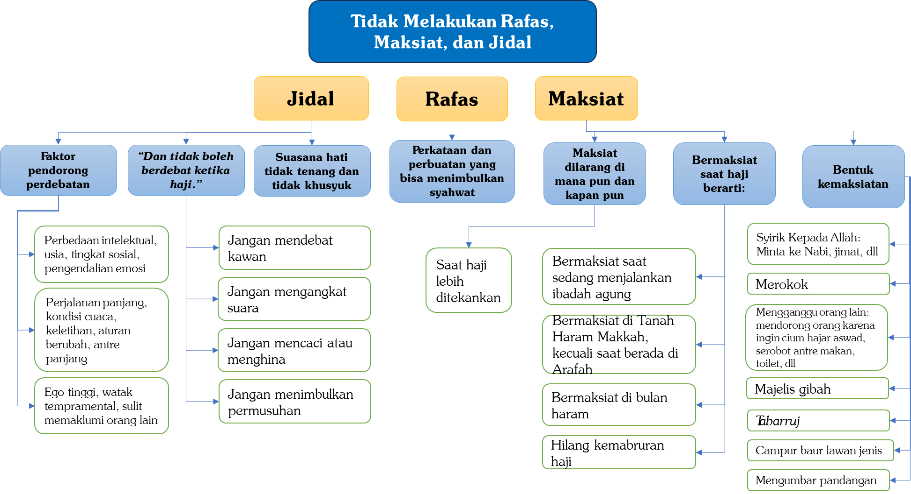

# 1.9 — Jangan Menzalimi Orang (dengan Visa Bermasalah)

Di antara bentuk kejahatan sebagian travel penyelenggara haji adalah ketika demi meraih keuntungan sebesar-besarnya mereka nekat mengambil atau memanfaatkan jatah haji yang bukan haknya. Ini merupakan kezaliman yang sangat besar. Bayangkan seseorang yang telah menunggu antrean haji selama puluhan tahun, atau setidaknya bertahun-tahun, dengan penuh kesabaran dan harapan. Lalu ternyata jatahnya dirampas. Bagaimana jika setelah itu ia meninggal dunia sebelum sempat menunaikan haji? Betapa besar tanggung jawab dan dosa orang yang menjadi sebab terhalangnya ia dari rukun Islam tersebut.

Di antara peristiwa yang sempat menghebohkan kaum muslimin, khususnya di Indonesia, pada musim haji tahun 2025, adanya dugaan pemangkasan kuota haji reguler hingga sekitar 8.000 jamaah. Kuota tersebut kemudian diduga dialihkan kepada orang-orang kaya yang ingin berhaji tanpa antrean panjang. Disebutkan bahwa satu visa diperjualbelikan dengan harga sekitar 4.000 dolar, bahkan bisa lebih, dan keuntungan dari praktik tersebut dibagi-bagikan demi kepentingan pribadi dan hawa nafsu.

Ketika visa diperjualbelikan dengan praktik rasywah (sogokan), sebagian travel pun berlomba-lomba membelinya. Untuk memberi kesan legal dan sah, visa tersebut dinamai dengan istilah “visa percepatan”. Istilah ini seakan-akan menunjukkan bahwa biaya tambahan ribuan dolar adalah sesuatu yang wajar sebagai konsekuensi percepatan layanan. Padahal pada hakikatnya, visa tersebut bukanlah komoditas yang diperjualbelikan, alias gratis.

Seharusnya para calon jamaah melakukan pengecekan dan verifikasi secara cermat tentang hakikat “visa percepatan” tersebut sebelum membelinya dari pihak travel. Namun karena semangat berhaji yang begitu besar, ditambah lagi yang memasarkan adalah orang-orang yang dikenal sebagai dai atau ustaz, maka sebagian orang menganggapnya sebagai produk yang halal dan tidak mengandung syubhat. Padahal jika benar praktiknya demikian, maka itu termasuk bentuk kezaliman dan dosa besar yang tidak ringan pertanggungjawabannya di hadapan Allah ﷻ.

Di antara bentuk pelanggaran dan kezaliman efek visa percepatan adalah:

---

## Pertama: Menzalimi jamaah haji reguler yang telah mengantre sekian lama. mereka menunggu dengan penuh kesabaran, bahkan ada yang menanti belasan hingga puluhan tahun. ternyata jatah kuota mereka diambil dan dialihkan kepada orang-orang kaya. ini adalah bentuk perampasan hak. bisa jadi, dari sekitar 8.000 jamaah yang terzalimi tersebut, sebagian telah meninggal dunia sebelum sempat menunaikan haji. maka siapa yang akan menanggung dosanya di hadapan Allah ﷻ?

---

## Kedua: Menzalimi jamaah haji khusus (plus) yang telah mengantre sekitar tujuh tahun. ketika jumlah jamaah membludak akibat masuknya peserta dengan visa ilegal atau tidak semestinya, kapasitas tenda menjadi melebihi batas. akibatnya, sebagian jamaah yang telah lama menunggu justru tidak mendapatkan fasilitas yang semestinya, seperti kasur untuk beristirahat. ironisnya, ada travel yang seluruh jamaahnya menggunakan visa percepatan tersebut dan tetap memperoleh fasilitas lengkap, dengan berbagai trik yang pada akhirnya mengorbankan hak jamaah lain yang telah lama mengantre

---

## Ketiga: Melakukan dosa besar karena turut menyukseskan praktik ghulûl (pengkhianatan atau penggelapan harta yang bukan haknya), yaitu harta yang diterima secara tidak sah oleh aparatur yang diberi amanah. perbuatan ini termasuk dosa besar yang ancamannya sangat keras. Nabi ﷺ telah memperingatkan tentang bahaya harta haram dan pengkhianatan terhadap amanah, karena harta semacam itu akan menjadi sebab azab dan kebinasaan di akhirat. Nabi ﷺ bersabda,

```arabic
((‌هَدَايَا ‌الْعُمَّالِ ‌غُلُولٌ))
```

“Hadiah-hadiah kepada para ASN adalah ghulûl.”[^51]

Ghulûl artinya mengambil harta yang bukan haknya baik dari ganimah, baitulmal (harta kaum muslimin), atau harta zakat, atau menerima gratifikasi dari masyarakat. Barang siapa yang mengambilnya tanpa hak maka dia telah melakukan dosa besar. Allah ﷻ berfirman,

```arabic
﴿وَمَا كَانَ لِنَبِيٍّ أَن يَغُلَّۚ وَمَن يَغۡلُلۡ يَأۡتِ بِمَا غَلَّ يَوۡمَ ٱلۡقِيَٰمَةِ﴾
```

“Tidak mungkin seorang nabi berkhianat dalam urusan harta rampasan perang. Barang siapa yang berkhianat dalam urusan rampasan perang itu, maka pada hari kiamat ia akan datang membawa apa yang dikhianatkannya itu.” (QS. Âli-‘Imrân: 161)

Ayat ini menunjukkan betapa beratnya dosa ghulûl di sisi Allah ﷻ sampai-sampai Allah menyebutkan hukumannya secara khusus pada hari kiamat kelak. Salah satu bentuk ghulûl yang sering luput dari perhatian adalah gratifikasi yang diterima pegawai ASN karena pekerjaannya yang “menyenangkan” si pemberi.[^52] Jika gratifikasi saja sudah masuk kategori ghulûl, yakni harta yang bisa mengantarkan seseorang ke neraka, lantas bagaimana lagi dengan korupsi yang jauh lebih terang-terangan? Nabi ﷺ sendiri telah bersabda,

```arabic
((لَعْنَةُ اللَّهِ عَلَى ‌الرَّاشِي ‌وَالْمُرْتَشِي))
```

“Allah melaknat penyogok (pemberi gratifikasi) dan yang menerima sogokan.”[^53]

Ada beberapa perkara lain yang sebaiknya diperiksa dengan cermat oleh calon tamu Allah ﷻ sebelum melangkahkan kaki. Di antaranya adalah:

---

## Pertama: Soal visa percepatan

Jika pihak travel menawarkan proses percepatan dengan jenis visa tertentu, jangan langsung tergiur. Cek dulu duduk perkaranya. Apakah visa percepatan itu diperoleh melalui jalur ilegal yang sudah dibahas sebelumnya? Kalau demikian, jauhilah sejauh mungkin.

Namun jika percepatan itu memang berasal dari tambahan kuota resmi Kerajaan Arab Saudi yang diperuntukkan bagi jamaah haji khusus (haji plus), maka periksa lagi: apakah travel meminta biaya tambahan? Kalau iya, atas dasar apa?

Dan yang tidak kalah penting, apakah percepatan itu sudah sesuai urutan antrean yang berlaku, atau justru melangkahi hak jamaah lain yang sudah lebih dahulu menunggu? Jangan sampai keberangkatan kita menjadi kezaliman bagi saudara-saudara kita yang sudah bersabar bertahun-tahun dalam antrean.

---

## Kedua: Soal visa mujamalah

Visa mujamalah adalah jatah yang diberikan Kerajaan Arab Saudi kepada para pejabat negeri ini sebagai bentuk penghormatan. Pertanyaannya: bolehkah visa tersebut diperjualbelikan oleh sang pejabat jika ia tidak berminat berhaji? Ini sesungguhnya kembali kepada ketentuan Kerajaan Arab Saudi sendiri, apakah hadiah berupa visa yang mereka berikan kepada pejabat itu boleh dialihkan atau dijual? Sebelum mengambil jalur ini, pastikan dulu jawabannya jelas dan sahih.

---

## Ketiga: Soal visa pekerja atau iqamah

Secara prosedur, visa pekerja dengan sistem iqamah (izin tinggal di Arab Saudi) umumnya tidak melanggar aturan pemerintah Arab Saudi. Namun calon tamu Allah harus benar-benar berhati-hati: jangan sampai dalam proses pengurusannya ada kebohongan yang menyusup. Misalnya, saat wawancara visa seseorang mengaku hendak bekerja, padahal niatnya semata-mata untuk berhaji.

Selain itu, perhatikan pula apakah jalur ini tidak mengambil jatah haji yang seharusnya menjadi hak pekerja-pekerja yang sudah lama bermukim di Arab Saudi dan sudah lama mendambakan kesempatan berhaji dengan kuota yang terjangkau. Bisa jadi karena ulah kita, kuota murah yang mereka nantikan sudah habis, dan yang tersisa hanya kuota dengan biaya yang jauh lebih mahal.

Seperti yang sudah disinggung sebelumnya, haji yang mabrur adalah haji yang bersih dari maksiat. Maka bagaimana mungkin kita mengharapkan kemabruran, sementara perjalanan haji kita justru dimulai dengan kebohongan?

Haji bukan sekadar soal kita berhasil sampai di Arafah. Yang jauh lebih penting adalah dengan cara apa kita sampai ke sana, dan apa yang kita kerjakan selama berada di Arafah.

---

## Keempat: Soal visa ziarah

Berhaji menggunakan visa ziarah jelas-jelas melanggar peraturan Kerajaan Arab Saudi. Namun anehnya, ada saja pihak travel yang nekat membenarkannya dengan dalih, “Di zaman Nabi tidak ada aturan visa, yang penting kita sampai ke lokasi haji!”

Baiklah, kalau begitu logikanya, kita jawab dengan logika yang sama.

Di zaman Nabi juga tidak ada sistem antrean. Apakah berarti semua orang boleh berhaji sekaligus tanpa antrean? Coba bayangkan, ritual haji yang mulia itu akan berubah menjadi ritual berdesak-desakan yang mengancam jiwa, karena jutaan orang datang tanpa kendali.

Tidakkah pihak travel seperti ini merasa malu kepada jamaah yang sudah mengantre puluhan tahun dengan sabar dan ikhlas? Sementara mereka justru membantu orang-orang menyerobot antrean melalui jalur ilegal.

Dan satu lagi, di zaman Nabi juga tidak ada travel yang mencari keuntungan dari penyelenggaraan haji. Lantas mengapa mereka mencari untung, bahkan dengan cara yang ilegal?

Pelaksanaan haji tahun 2024 meninggalkan pelajaran yang pahit dan memilukan. Ribuan jamaah yang berangkat dengan visa ziarah, tanpa akses tenda dan tanpa fasilitas memadai, harus menghadapi terik matahari yang luar biasa menyengat. Ratusan bahkan ribuan di antara mereka meninggal dunia akibat kepanasan dan dehidrasi. Qaddarallâh, musim haji tahun itu memang datang di tengah gelombang panas yang ekstrem.

Semoga Allah ﷻ melindungi kita semua dan memberikan kita rezeki haji yang benar, bersih, dan mabrur. Wallâhu a’lam bish-shawab.

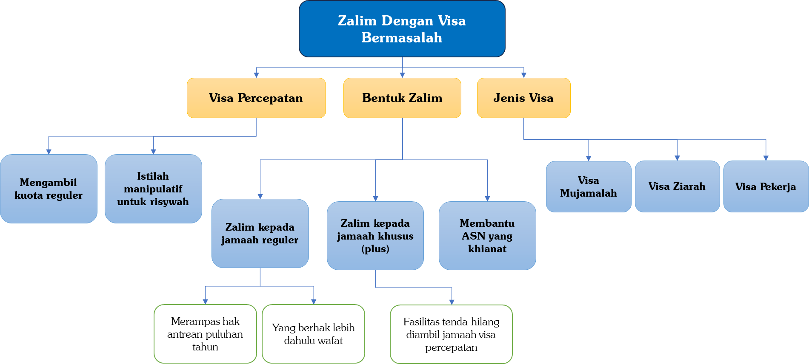

# 1.10 — Bertobat Sebelum Haji

Bertobat adalah ibadah yang sangat diperlukan oleh setiap mukmin. Betapa tidak, manusia adalah makhluk yang lemah, yang hampir selalu saja terjerumus ke dalam berbagai macam dosa, baik yang disadari maupun yang tidak. Namun di sinilah keagungan Rabb kita, Allah ﷻ. Dia Maha pengasih kepada hamba-Nya dan Maha menerima tobat mereka.

Di antara nama-nama Allah yang terindah adalah ar-Rahîm, Yang Maha penyayang. Betapa banyak lembaran-lembaran al-Qur`an yang menyebut nama ini. Seolah Allah ingin terus-menerus mengingatkan hamba-Nya, “Aku menyayangimu. Jangan putus asa dari rahmat-Ku.”

Dan kasih sayang Allah itu sungguh tidak terbatas. Ia jauh lebih besar dari kasih sayang siapa pun di muka bumi ini, bahkan lebih besar dari kasih sayang seorang ibu kepada anaknya.

Dari Umar bin al-Khaththab radhiyallâhu 'anhu berkata,

```arabic
قَدِمَ عَلَى رَسُولِ اللهِ ﷺ بِسَبْيٍ فَإِذَا امْرَأَةٌ مِنَ السَّبْيِ تَبْتَغِي، إِذَا وَجَدَتْ صَبِيًّا فِي السَّبْيِ، أَخَذَتْهُ فَأَلْصَقَتْهُ بِبَطْنِهَا وَأَرْضَعَتْهُ، فَقَالَ لَنَا رَسُولُ اللهِ ﷺ: ((أَتَرَوْنَ هَذِهِ الْمَرْأَةَ طَارِحَةً وَلَدَهَا فِي النَّارِ؟)) قُلْنَا: لَا، وَاللهِ وَهِيَ تَقْدِرُ عَلَى أَنْ لَا تَطْرَحَهُ، فَقَالَ رَسُولُ اللهِ ﷺ: ((لَلَّهُ أَرْحَمُ بِعِبَادِهِ مِنْ هَذِهِ بِوَلَدِهَا))
```

“Tawanan perang didatangkan kepada Nabi ﷺ. Di antara mereka ada seorang wanita yang terus mencari-cari (anaknya). Setiap kali ia menemukan seorang bayi di tengah para tawanan itu, ia segera mengambilnya, mendekapnya ke perutnya, lalu menyusuinya. Maka Rasulullah ﷺ kepada kami, ‘Menurut kalian apakah wanita ini akan rela melemparkan anaknya ke dalam api?’

Maka kami berkata, ‘Tidak, Demi Allah, selama ia mampu untuk tidak melemparnya.’

Maka Rasulullah ﷺ bersabda, ‘Sungguh Allah lebih sayang kepada hamba-hamba-Nya dibanding wanita ini terhadap anaknya’.”[^54]

Bayangkan sejenak kondisi wanita dalam hadis itu. Ia baru saja kehilangan anaknya di tengah hiruk-pikuk tawanan perang. Ia mencari-cari dengan hati yang hancur, penuh kekhawatiran dan rindu yang mengimpit dada. Lalu ketika ia akhirnya menemukan sang anak, ia langsung mendekap dan menyusuinya tanpa membuang waktu sesaat pun. Inilah puncak kasih sayang seorang ibu, dalam kondisi yang paling mengharukan yang bisa kita bayangkan.

Namun ketika Nabi ﷺ melihat pemandangan itu, beliau ingin mengajak para sahabatnya berpikir lebih jauh. Beliau bertanya, “Apakah mungkin ibu seperti ini akan melemparkan anaknya ke dalam api?” Tentu tidak. Demi Allah, tidak mungkin. Dan ternyata, kasih sayang Allah kepada hamba-Nya jauh melampaui kasih sayang ibu yang luar biasa itu.

Sungguh, kasih sayang Allah meliputi segala sesuatu. Para malaikat pun mengakui keluasan rahmat-Nya seraya berucap,

```arabic
﴿رَبَّنَا وَسِعۡتَ كُلَّ شَيۡءٖ رَّحۡمَةٗ وَعِلۡمٗا﴾
```

“Ya Tuhan kami, rahmat dan ilmu Engkau meliputi segala sesuatu.” (QS. Ghâfir: 7)

Perhatikan bagaimana Allah menggandengkan rahmat-Nya dengan ilmu-Nya dalam satu ayat. Sebagaimana ilmu Allah mencakup segala sesuatu tanpa terkecuali, demikian pula rahmat-Nya mencakup segala sesuatu. Allah sendiri telah menegaskan hal ini,

```arabic
﴿وَرَحۡمَتِي وَسِعَتۡ كُلَّ شَيۡءٖۚ﴾
```

“Dan rahmat-Ku (kasih sayang-Ku) meliputi segala sesuatu.” (QS. Al-A’râf: 156)

As-Si’di rahimahullâh dalam tafsirnya berkata,

```arabic
﴿وَرَحۡمَتِي وَسِعَتۡ كُلَّ شَيۡءٖۚ﴾ مِنَ الْعَالَمِ الْعُلْوِي وَالسُّفْلِي، الْبَرِّ وَالْفَاجِرِ، الْمُؤْمِنِ وَالْكَافِرِ، فَلَا مَخْلُوْقَ إِلَّا وَقَدْ وَصَلَتْ إِلَيْهِ رَحْمَةُ اللهِ، وَغَمَرَهُ فَضْلُهُ وَإِحْسَانُهُ
```

“Firman-Nya, ‘Dan rahmat-Ku meliputi segala sesuatu’ yakni meliputi seluruh makhluk yang ada di alam atas maupun alam bawah, meliputi orang yang baik maupun orang yang tidak baik, orang mukmin maupun orang kafir. Tidak ada satu pun makhluk melainkan rahmat Allah telah sampai kepadanya, serta telah diliputi oleh karunia dan kebaikan-Nya.”[^55]

Yang sedang kita bicarakan di sini bukan tentang orang-orang beriman yang memang sudah menempuh jalan yang mendatangkan kasih sayang Allah. Mereka tentu sudah mengerti. Yang ingin kita ajak bicara adalah mereka yang selama ini justru menempuh jalan yang mendatangkan murka Allah, mereka yang membangkang perintah-Nya, mereka yang terus-menerus menerjang larangan-larangan-Nya.

Mereka yang seharusnya sudah layak dimurkai. Seharusnya sudah dicabut nyawanya. Seharusnya sudah ditimpa azab. Namun ternyata Allah masih memberi mereka kesempatan untuk hidup. Masih memberi mereka kesempatan untuk merayakan hari raya. Masih memberi mereka kesempatan untuk menunaikan ibadah haji yang sangat agung ini.

Itulah rahmat Allah yang tiada bertepi. Dan kesempatan itu, jika kita sadari dengan sepenuh hati, adalah undangan Allah untuk segera kembali kepada-Nya sebelum melangkah menuju Baitullah.

Sungguh, kasih sayang Allah tidak pernah berhenti tercurah, bahkan kepada para pendosa sekalipun. Mari kita renungkan satu per satu wujud kasih sayang itu.

Pertama, Allah menutup aib mereka.

Di antara nama-nama Allah yang terindah adalah as-Sittîr, Yang Maha menutupi. Allah menutupi aib-aib para hamba-Nya dan tidak membongkarnya di hadapan orang lain. Inilah salah satu bentuk rahmat Allah yang sering kita lupakan. Jika hari ini kita masih dihormati orang lain, masih dianggap baik oleh lingkungan kita, itu bukan karena kita memang benar-benar baik. Itu semata-mata karena Allah belum membuka aib kita.

Coba bayangkan seandainya satu saja aib kita dibuka oleh Allah. Niscaya tidak akan ada seorang pun yang mau mendekat. Muhammad bin Wasi’ rahimahullâh pernah berkata,

```arabic
لَوْ كَانَ لِلذُّنُوْبِ رِيْحٌ مَا جَلَسَ إِلَيَّ أَحَدٌ
```

“Kalau seandainya dosa-dosa itu memiliki aroma bau, niscaya tidak seorang pun yang mau duduk di dekatku.”[^56]

Seorang penyair pun pernah mengungkapkan hal yang serupa,

| لَأَبَى السَّلَامَ عَلَيَّ مَنْ يَلْقَانِي |  | وَاللهِ لَوْ عَلِمُوْا قَبِيْحَ سَرِيْرَتِيْ |
| --- | --- | --- |

“Demi Allah, seandainya mereka mengetahui betapa buruknya diriku ketika bersendirian, niscaya setiap orang yang berpapasan denganku tidak akan sudi untuk mengucapkan salam kepadaku.”[^57]

Maka sudah sepatutnya kita bersyukur kepada Allah al-Ghafûr yang telah menutupi keburukan, aib, dan maksiat-maksiat kita. Kalau saja Allah membukanya, binasalah kita.

Para ulama pun mengingatkan bahwa terkadang aib seseorang dibuka justru karena ia terlalu sering melakukannya. Pada dosa yang pertama, biasanya Allah masih menutupinya. Namun jika ia terus-menerus tenggelam dalam kemaksiatan tanpa mau berhenti, maka suatu saat Allah akan membuka aib itu.

Kedua, Allah tidak menyegerakan azab kepada para pendosa.

Allah adalah al-Halîm, Yang Maha penyantun. Ia terus memberikan kesempatan kepada para pelaku dosa untuk kembali kepada-Nya. Bahkan yang lebih mengherankan lagi, tatkala seorang hamba membangkang perintah Allah, ia justru sedang menggunakan nikmat-nikmat pemberian Allah itu sendiri untuk bermaksiat. Namun Allah tidak langsung mencabut nyawanya.

Allah ﷻ berfirman,

```arabic
﴿وَرَبُّكَ ٱلۡغَفُورُ ذُو ٱلرَّحۡمَةِۖ لَوۡ يُؤَاخِذُهُم بِمَا كَسَبُواْ لَعَجَّلَ لَهُمُ ٱلۡعَذَابَۚ بَل لَّهُم مَّوۡعِدٞ لَّن يَجِدُواْ مِن دُونِهِۦ مَوۡئِلٗا﴾
```

“Dan Tuhanmulah yang Maha pengampun, lagi mempunyai rahmat. Jika Dia mengazab mereka karena perbuatan mereka, tentu Dia akan menyegerakan azab bagi mereka. Tetapi bagi mereka ada waktu yang tertentu (untuk mendapat azab) yang mereka sekali-kali tidak akan menemukan tempat berlindung dari padanya.” (QS. Al-Kahfi: 58)

Bahkan Allah menegaskan, seandainya Ia menghukum setiap kezaliman manusia secara langsung, tidak akan ada satu pun makhluk yang tersisa di muka bumi ini,

```arabic
﴿وَلَوۡ يُؤَاخِذُ ٱللَّهُ ٱلنَّاسَ بِظُلۡمِهِم مَّا تَرَكَ عَلَيۡهَا مِن دَآبَّةٖ وَلَٰكِن يُؤَخِّرُهُمۡ إِلَىٰٓ أَجَلٖ مُّسَمّٗىۖ فَإِذَا جَآءَ أَجَلُهُمۡ لَا يَسۡتَـٔۡخِرُونَ سَاعَةٗ وَلَا يَسۡتَقۡدِمُونَ﴾
```

“Dan kalau Allah menghukum manusia karena kezalimannya, niscaya tidak akan ada yang ditinggalkan-Nya (di bumi) dari makhluk yang melata sekali pun, tetapi Allah menangguhkan mereka sampai waktu yang sudah ditentukan. Maka apabila ajalnya tiba, mereka tidak dapat meminta penundaan atau percepatan sesaat pun.” (QS. An-Nahl: 61)

Allah juga berfirman,

```arabic
﴿وَلَوۡ يُؤَاخِذُ ٱللَّهُ ٱلنَّاسَ بِمَا كَسَبُواْ مَا تَرَكَ عَلَىٰ ظَهۡرِهَا مِن دَآبَّةٖ وَلَٰكِن يُؤَخِّرُهُمۡ إِلَىٰٓ أَجَلٖ مُّسَمّٗىۖ فَإِذَا جَآءَ أَجَلُهُمۡ فَإِنَّ ٱللَّهَ كَانَ بِعِبَادِهِۦ بَصِيرَۢا﴾
```

“Dan sekiranya Allah menghukum manusia disebabkan apa yang telah mereka perbuat, niscaya Dia tidak akan menyisakan satu pun makhluk bergerak yang bernyawa di bumi ini, tetapi Dia menangguhkan (hukuman)-nya, sampai waktu yang sudah ditentukan. Nanti apabila ajal mereka tiba, maka Allah Maha Melihat (keadaan) hamba-hamba-Nya.” (QS. Fâthir: 45)

Betapa banyak orang yang sudah melampaui batas, hingga Allah mematikan mereka dalam kondisi suulkhatimah, dicabut nyawanya tepat saat mereka sedang bermaksiat. Sementara sebagian kita sudah berulang kali berbuat dosa, namun Allah masih memberi kita nafas untuk kembali dan bertobat.

Ketiga, musibah yang Allah timpakan pun sesungguhnya adalah undangan untuk kembali.

Ketika Allah mendatangkan ujian atau bencana, tujuan-Nya bukan semata-mata untuk menghukum, melainkan agar sang pendosa tersadar dan segera kembali kepada-Nya.

Allah ﷻ berfirman,

```arabic
﴿ظَهَرَ ٱلۡفَسَادُ فِي ٱلۡبَرِّ وَٱلۡبَحۡرِ بِمَا كَسَبَتۡ أَيۡدِي ٱلنَّاسِ لِيُذِيقَهُم بَعۡضَ ٱلَّذِي عَمِلُواْ لَعَلَّهُمۡ يَرۡجِعُونَ﴾
```

“Telah tampak kerusakan di darat dan di laut disebabkan karena perbuatan tangan manusia; Allah menghendaki agar mereka merasakan sebagian dari (akibat) perbuatan mereka, agar mereka kembali (ke jalan yang benar).” (QS. Ar-Rûm: 41)

Allah ﷻ juga berfirman,

```arabic
﴿وَمَآ أَصَٰبَكُم مِّن مُّصِيبَةٖ فَبِمَا كَسَبَتۡ أَيۡدِيكُمۡ وَيَعۡفُواْ عَن كَثِيرٖ﴾
```

“Dan musibah apapun yang menimpa kamu adalah karena perbuatan tanganmu sendiri, dan Allah memaafkan banyak (dari kesalahan-kesalahanmu).” (QS. Asy-Syûrâ: 30)

Keempat, musibah itu juga menggugurkan dosa-dosa.

Rahmat Allah benar-benar tidak terbatas. Bukan hanya sebagai peringatan, musibah yang menimpa seorang mukmin pun ternyata sekaligus menghapuskan dosa-dosanya.

Nabi ﷺ bersabda,

```arabic
((مَا يُصِيبُ الْمُسْلِمَ، مِنْ نَصَبٍ وَلَا وَصَبٍ، وَلَا هَمٍّ وَلَا حُزْنٍ وَلَا أَذًى وَلَا غَمٍّ، حَتَّى الشَّوْكَةِ يُشَاكُهَا، إِلَّا كَفَّرَ اللَّهُ بِهَا مِنْ خَطَايَاهُ))
```

“Tidak ada musibah apa pun yang menimpa seorang muslim baik berupa keletihan, sakit, kekhawatiran, kesedihan, gangguan orang lain, kegelisahan/galau, bahkan duri yang menimpanya kecuali Allah akan menggugurkan dosa-dosanya dengan itu semua.”[^58]

Bahkan di antara hikmah tersembunyi di balik rahmat Allah, terkadang Ia menjadikan seseorang yang banyak berdosa dilanda kegelisahan dan kesedihan yang ia sendiri tidak tahu penyebabnya. Allah tidak menimpakan musibah pada harta, anak, atau tubuhnya. Allah hanya menjadikan hatinya resah dan gundah. Ternyata itulah cara Allah menggugurkan tumpukan dosa-dosanya dengan cara yang paling lembut.

Kelima, Allah membuka pintu tobat selebar-lebarnya.

Tidak peduli seberapa banyak dosa seseorang dan tidak peduli seberapa besar dosa yang pernah ia lakukan. Allah ﷻ berfirman,

```arabic
﴿قُلۡ يَٰعِبَادِيَ ٱلَّذِينَ أَسۡرَفُواْ عَلَىٰٓ أَنفُسِهِمۡ لَا تَقۡنَطُواْ مِن رَّحۡمَةِ ٱللَّهِۚ إِنَّ ٱللَّهَ يَغۡفِرُ ٱلذُّنُوبَ جَمِيعًاۚ إِنَّهُۥ هُوَ ٱلۡغَفُورُ ٱلرَّحِيمُ﴾
```

“Katakanlah, ‘Wahai hamba-hamba-Ku yang melampaui batas terhadap diri mereka sendiri! Janganlah kamu berputus asa dari rahmat Allah. Sesungguhnya Allah mengampuni dosa-dosa semuanya. Sungguh, Dialah Yang Maha pengampun, Maha penyayang.” (QS. Az-Zumar: 53)

Lihatlah Firaun, manusia yang dengan lancangnya mengaku sebagai tuhan. Allah tidak langsung mengirimkan halilintar untuk membakarnya. Sebaliknya, Allah justru mengutus dua orang rasul, Musa dan Harun, untuk menasihatinya dengan selemah-lembutnya. Andai saja Firaun mau bertobat, dosanya pun pasti akan diampuni Allah.

Keenam, Allah bahkan memberi bonus kepada pendosa yang mau bertobat.

Bukan hanya mengampuni, Allah juga memberikan hadiah berlipat. Di dunia, Ia menambahkan rezeki dan kekuatan. Allah berfirman dalam kisah Nabi Nuh,

```arabic
﴿فَقُلۡتُ ٱسۡتَغۡفِرُواْ رَبَّكُمۡ إِنَّهُۥ كَانَ غَفَّارٗا ١٠ يُرۡسِلِ ٱلسَّمَآءَ عَلَيۡكُم مِّدۡرَارٗا١١ وَيُمۡدِدۡكُم بِأَمۡوَٰلٖ وَبَنِينَ وَيَجۡعَل لَّكُمۡ جَنَّٰتٖ وَيَجۡعَل لَّكُمۡ أَنۡهَٰرٗا﴾
```

“Maka aku berkata (kepada mereka), ‘Mohonlah ampunan kepada Tuhanmu, Sungguh, Dia Maha pengampun, niscaya Dia akan menurunkan hujan yang lebat dari langit kepadamu, dan Dia memperbanyak harta dan anak-anakmu, dan mengadakan kebun-kebun untukmu dan mengadakan sungai-sungai untukmu’.” (QS. Nûh: 10-12)

```arabic
﴿وَيَٰقَوۡمِ ٱسۡتَغۡفِرُواْ رَبَّكُمۡ ثُمَّ تُوبُوٓاْ إِلَيۡهِ يُرۡسِلِ ٱلسَّمَآءَ عَلَيۡكُم مِّدۡرَارٗا وَيَزِدۡكُمۡ قُوَّةً إِلَىٰ قُوَّتِكُمۡ وَلَا تَتَوَلَّوۡاْ مُجۡرِمِينَ﴾
```

“Dan (Hud berkata), ‘Wahai kaumku! Mohonlah ampunan kepada Tuhanmu lalu bertobatlah kepada-Nya, niscaya Dia menurunkan hujan yang sangat deras, Dia akan menambahkan kekuatan di atas kekuatanmu, dan janganlah kamu berpaling menjadi orang yang berdosa’.” (QS. Hûd: 52)

Di akhirat, Allah menjanjikan surga bagi mereka yang bertobat dengan sungguh-sungguh,

```arabic
﴿يَٰٓأَيُّهَا ٱلَّذِينَ ءَامَنُواْ تُوبُوٓاْ إِلَى ٱللَّهِ تَوۡبَةٗ نَّصُوحًا عَسَىٰ رَبُّكُمۡ أَن يُكَفِّرَ عَنكُمۡ سَيِّـَٔاتِكُمۡ وَيُدۡخِلَكُمۡ جَنَّٰتٖ تَجۡرِي مِن تَحۡتِهَا ٱلۡأَنۡهَٰرُ﴾
```

“Wahai orang-orang yang beriman! Bertobatlah kepada Allah dengan tobat yang semurni-murninya, mudah-mudahan Tuhan kamu akan menghapus kesalahan-kesalahanmu dan memasukkan kamu ke dalam surga-surga yang mengalir di bawahnya sungai-sungai.” (QS. At-Tahrîm: 8)

Pernahkah kita menemukan zat yang seperti ini? Kita yang sudah bersalah kepadanya, namun ia malah memberikan hadiah kepada kita? Itulah Allah.

Ketujuh, terjerumus dalam dosa pun mengandung hikmah tersendiri.

Di antara hikmah yang tersembunyi dari pengalaman seseorang yang pernah terperosok ke dalam dosa adalah ia terhindar dari sifat ujub, yakni bangga diri yang bisa menggugurkan amal saleh. Orang yang pernah jatuh dalam kemaksiatan tidak akan mudah merasa dirinya hebat, karena ia tahu betul betapa lemahnya dirinya. Ia pernah terjebak dalam perangkap setan. Ia pernah merasakan hinanya kubangan maksiat.

Dengan pengalaman itu pula, ia akan lebih benar-benar mengenal nama-nama Allah: Al-Ghafûr (Yang Maha pengampun), at-Tawwâb (Yang Maha menerima tobat), al-‘Afuww (Yang Maha pemaaf dan mencintai untuk memaafkan), as-Sittîr (Yang Maha menutup aib hamba-Nya), dan al-Halîm (Yang Maha penyantun, yang mudah saja bagi-Nya untuk menghukum, namun Ia memilih untuk menunda).

Maka tampaklah rahasia sabda Nabi ﷺ,

```arabic
((وَالَّذِي نَفْسِي بِيَدِهِ لَوْ لَمْ تُذْنِبُوا لَذَهَبَ اللهُ بِكُمْ، وَلَجَاءَ بِقَوْمٍ يُذْنِبُونَ، فَيَسْتَغْفِرُونَ اللهَ فَيَغْفِرُ لَهُمْ))
```

“Demi yang jiwaku berada di tangan-Nya, seandainya kalian tidak berdosa, maka Allah akan sirnakan kalian, dan sungguh Allah akan mendatangkan suatu kaum yang mereka berdosa, lalu mereka beristigfar kepada Allah, maka Allah pun mengampuni mereka.”[^59]

Sebagian orang menyangka bahwa siapa yang pernah terjerumus dalam kubangan kemaksiatan tidak akan pernah lagi bisa meraih cinta Allah. Ini adalah prasangka buruk kepada Tuhan Yang Maha pengasih lagi Maha penyayang.

Coba bayangkan seorang anak yang nakal, yang selalu membuat ibunya menangis dan marah. Lalu suatu hari sang anak minggat dari rumah. Sang ibu pun bersedih dengan kepergiannya. Berminggu-minggu sang anak tidak pulang. Bagaimanapun sang ibu marah, di sudut hatinya ia pasti masih menyimpan cinta kepada buah hatinya itu, kepada anak yang pernah ia kandung.

Lalu suatu hari sang anak akhirnya pulang, dengan air mata penyesalan yang mengalir deras. Kira-kira bagaimana perasaan sang ibu? Tentu ia akan kembali menyayangi anaknya, bahkan bisa jadi lebih dalam dari sebelumnya.

Dan bagi Allah, perumpamaan yang jauh lebih tinggi dari semua itu.

Ibnu Rajab pernah menuturkan sebuah kisah,

```arabic
كَانَ بَعْضُ أَصْحَابِ ذِي النُّونِ يَطُوفُ وَيُنَادِي: آهْ أَيْنَ قَلْبِي، مَنْ وَجَدَ قَلْبِي؟ فَدَخَلَ يَوْمًا بَعْضَ السِّكَكِ، فَوَجَدَ صَبِيًّا يَبْكِي وَأُمُّهُ تَضْرِبُهُ، ثُمَّ أَخْرَجَتْهُ مِنَ الدَّارِ، وَأَغْلَقَتِ الْبَابَ دُونَهُ، فَجَعَلَ الصَّبِيَّ يَلْتَفِتُ يَمِينًا وَشِمَالًا لَا يَدْرِي أَيْنَ يَذْهَبُ وَلَا أَيْنَ يَقْصِدُ، فَرَجَعَ إِلَى بَابِ الدَّارِ، فَجَعَلَ يَبْكِي وَيَقُولُ: يَا أُمَّاهُ مَنْ يَفْتَحُ لِيَ الْبَابَ إِذَا أَغْلَقْتِ عَنِّي بَابَكِ؟ وَمَنْ يُدْنِينِي إِذَا طَرَدْتِينِي؟ وَمَنِ الَّذِي يُدْنِينِي إِذَا غَضِبْتِ عَلَيَّ؟ فَرَحِمَتْهُ أُمُّهُ، فَنَظَرَتْ مِنْ خَلَلِ الْبَابِ، فَوَجَدَتْ وَلَدَهَا تَجْرِي الدُّمُوعُ عَلَى خَدَّيْهِ مُتَمَعِّكًا فِي التُّرَابِ، فَفَتَحَتِ الْبَابَ، وَأَخَذَتْهُ حَتَّى وَضَعَتْهُ فِي حِجْرِهَا وَجَعَلَتْ تُقَبِّلُهُ، وَتَقُولُ: يَا قُرَّةَ عَيْنِي، وَيَا عَزِيزَ نَفْسِي، أَنْتَ الَّذِي حَمَلْتَنِي عَلَى نَفْسِكَ، وَأَنْتَ الَّذِي تَعَرَّضْتَ لِمَا حَلَّ بِكَ، لَوْ كُنْتَ أَطَعْتَنِي لَمْ تَلْقَ مِنِّي مَكْرُوهًا، فَتَوَاجَدَ الْفَتَى، ثُمَّ قَامَ فَصَاحَ، وَقَالَ: قَدْ وَجَدْتُ قَلْبِي، قَدْ وَجَدْتُ قَلْبِي
```

“Ada seorang pemuda, sahabat Dzun Nûn, yang selalu berkeliling sambil berseru, ‘Aduh, di mana hatiku? Siapakah yang menemukan hatiku?’

Suatu hari ia melewati sebuah lorong dan mendapati seorang anak kecil yang sedang menangis, sementara ibunya memukulinya lalu mengusirnya keluar rumah dan mengunci pintu. Sang anak kebingungan, melihat ke kanan dan ke kiri, tidak tahu harus pergi ke mana. Akhirnya ia kembali ke depan pintu rumahnya, menangis tersedu-sedu seraya berkata,

‘Wahai ibu, siapa yang akan membukakan pintu jika engkau telah menguncinya? Siapa yang akan mendekatiku jika engkau telah mengusirku? Siapa yang akan menerimaku jika engkau sedang marah kepadaku?’

Maka hati sang ibu pun luluh. Ia mengintip dari celah pintu dan mendapati anaknya bercucuran air mata di pipinya, bergulingan di atas tanah. Ia pun membuka pintu, meraih sang anak, mendudukkannya di pangkuannya, lalu menciumnya berkali-kali sambil berkata, ‘Wahai buah hatiku, wahai sayangku, engkau sendirilah yang menyebabkan semua ini terjadi. Kalau saja engkau tadinya taat kepadaku, tentu engkau tidak akan merasakan apa yang kau alami ini.’

Maka pemuda itu seperti tersengat oleh sesuatu. Ia berdiri dan berteriak, ‘Sungguh aku telah menemukan hatiku! Sungguh aku telah menemukan hatiku!’”[^60]

Syekh Abdurrahman bin Nashir as-Si’di menjelaskan bahwa firman Allah,

```arabic
﴿وَهُوَ ٱلۡغَفُورُ ٱلۡوَدُودُ﴾
```

“Dan Dialah Yang Maha Pengampun lagi Maha Pengasih.” (QS. Al-Burûj: 14) adalah bantahan tegas terhadap anggapan bahwa seorang hamba yang pernah bermaksiat lalu bertobat tidak akan lagi dicintai Allah. Justru sebaliknya, barang siapa yang berdosa lalu bertobat kepada Allah, tobatnya akan diterima dan Allah akan kembali mencintainya. Itulah rahasia mengapa Allah menggandengkan al-Ghafûr dengan al-Wadûd dalam satu ayat yang sama.[^61]

Oleh karena itu, Rasulullah ﷺ bersabda,

```arabic
((لَلَّهُ أَشَدُّ فَرَحًا بِتَوْبَةِ عَبْدِهِ حِينَ يَتُوبُ إِلَيْهِ مِنْ أَحَدِكُمْ كَانَ عَلَى رَاحِلَتِهِ بِأَرْضِ فَلَاةٍ فَانْفَلَتَتْ مِنْهُ وَعَلَيْهَا طَعَامُهُ وَشَرَابُهُ فَأَيِسَ مِنْهَا فَأَتَى شَجَرَةً فَاضْطَجَعَ فِى ظِلِّهَا قَدْ أَيِسَ مِنْ رَاحِلَتِهِ فَبَيْنَا هُوَ كَذَلِكَ إِذَا هُوَ بِهَا قَائِمَةً عِنْدَهُ فَأَخَذَ بِخِطَامِهَا ثُمَّ قَالَ مِنْ شِدَّةِ الْفَرَحِ اللَّهُمَّ أَنْتَ عَبْدِى وَأَنَا رَبُّكَ. أَخْطَأَ مِنْ شِدَّةِ الْفَرَحِ))
```

“Sesungguhnya Allah sangat gembira dengan tobat hamba-Nya ketika ia bertobat pada-Nya melebihi kegembiraan seseorang di antara kalian yang berada di atas kendaraannya dan berada di suatu tanah yang luas (padang pasir), kemudian hewan yang ditungganginya lari meninggalkannya.

Padahal pada hewan tunggangannya itu ada perbekalan makan dan minumnya. Sehingga ia pun menjadi putus asa.

Kemudian ia mendatangi sebuah pohon dan tidur berbaring di bawah naungannya dalam keadaan hati yang telah berputus asa. Tiba-tiba ketika ia dalam keadaan seperti itu, kendaraannya tampak berdiri di sisinya, lalu ia mengambil ikatnya. Karena sangat gembiranya, maka ia berkata, ‘Ya Allah, Engkau adalah hambaku dan aku adalah Rabb-Mu.’ Ia salah mengucapkan karena sangat gembiranya.”[^62]

Orang itu sangat gembira karena menyangka dirinya akan binasa namun ternyata selamat. Namun Allah jauh lebih gembira dari itu ketika seorang hamba-Nya bertobat. Maka jika seseorang tergelincir dalam dosa, hendaknya ia segera bertobat kepada Allah. Meskipun dosa itu sama dengan yang pernah ia lakukan sebelumnya, hendaknya ia tidak berburuk sangka kepada Allah. Karena justru di situlah celah yang ingin dimanfaatkan setan, agar seseorang merasa tidak layak untuk kembali, lalu akhirnya mati dalam keadaan belum bertobat.

Jika seorang hamba sudah mengerti bahwa Allah lebih sayang kepadanya daripada siapa pun di dunia ini, bahkan lebih dari ibunya sendiri, maka sudah seharusnya ia hanya menggantungkan seluruh harapannya kepada Allah saja.

Ibnu Hajar berkata,

```arabic
وَفِيهِ إِشَارَةٌ إِلَى أَنَّهُ يَنْبَغِي لِلْمَرْءِ أَنْ يَجْعَلَ تَعَلُّقَهُ فِي جَمِيعِ أُمُورِهِ بِاللَّهِ وَحْدَهُ وَأَنَّ كُلَّ مَنْ فُرِضَ أَنَّ فِيهِ رَحْمَةً مَا حَتَّى يُقْصَدَ لِأَجْلِهَا فَاللَّهُ سُبْحَانَهُ وَتَعَالَى أَرْحَمُ مِنْهُ فَلْيَقْصِدِ الْعَاقِلُ لِحَاجَتِهِ مَنْ هُوَ أَشَدُّ لَهُ رَحْمَةً
```

“Pada hadis ini terdapat isyarat bahwa seseorang hendaknya menjadikan ketergantungannya dalam segala urusannya hanya kepada Allah. Siapa pun yang memiliki kasih sayang tertentu hingga ia dicari dan dituju karenanya, maka Allah jauh lebih penyayang darinya. Maka orang yang berakal hendaknya mencari pemenuhan hajatnya kepada Zat yang paling sayang kepadanya.”[^63]

# 1.11 — Berhaji dengan Harta yang Halal

Sesungguhnya Allah hanya menerima ibadah yang berasal dari sesuatu yang baik dan halal.

Nabi ﷺ bersabda,

```arabic
((إِنَّ اللهَ طَيِّبٌ لَا يَقْبَلُ إِلَّا طَيِّبًا))
```

“Sesungguhnya Allah Maha baik dan Allah tidak menerima kecuali yang baik pula.”[^64]

Karena itulah Allah berfirman kepada para jamaah haji,

```arabic
﴿وَتَزَوَّدُواْ فَإِنَّ خَيۡرَ ٱلزَّادِ ٱلتَّقۡوَىٰۖ﴾
```

“Berbekalah (tatkala berhaji), sesungguhnya sebaik-baik bekal adalah ketakwaan.” (QS. Al-Baqarah: 197)

Bekal yang dimaksud bukan hanya bekal materi untuk perjalanan, tetapi juga bekal yang halal dan bersih, yang diperoleh dari jalan yang diridai Allah.

Lalu bagaimana jika seseorang ternyata berhaji menggunakan harta yang haram, entah itu hasil riba, hasil judi, hasil penipuan, atau hasil menzalimi orang lain? Para ulama telah memberikan jawabannya dengan jelas. An-Nawawi berkata,

```arabic
إَذَا حَجَّ بِمَالٍ حَرَامٍ أَوْ رَاكِبًا دَابَّةً مَغْصُوْبَةً أَثِمَ وَصَحَّ حَجُّهُ وَأَجْزَأَهُ عِنْدَنَا وَبِهِ قَالَ أَبُو حَنِيْفَةَ وَمَالِكٌ وَالْعَبْدَرِي وَبِهِ قَالَ أَكْثَرُ الْفُقَهَاءِ
```

“Jika seseorang berhaji dengan harta yang haram atau menunggangi tunggangan hasil curian, maka ia berdosa, namun hajinya sah dan sudah mencukupi (yaitu kewajiban hajinya sudah gugur-pen) menurut kami. Ini juga merupakan pendapat Abu Hanifah, Malik, al-Abdari, dan pendapat mayoritas ahli fikih.”[^65]

Jadi secara hukum, hajinya sah dan kewajiban hajinya gugur. Namun ia tidak mendapatkan pahala, karena Allah tidak menerima kecuali yang baik. Hajinya selesai secara administratif, tetapi kosong dari sisi ibadah.

Ada sebuah hadis yang maknanya sangat mengena, meskipun derajatnya lemah,

```arabic
((مَنْ حَجَّ بِمَالٍ حَرَامٍ فَقَالَ: لَبَّيْكَ اللَّهُمَّ لَبَّيْكَ، فَقَالَ عَزَّ وَجَلَّ: لَا لَبَّيْكَ وَلَا سَعْدَيْكَ وَحَجُّكَ مَرْدُودٌ عَلَيْكَ))
```

“Barang siapa yang berhaji dengan harta yang haram, lalu ia berkata, ‘Labbaikallâhumma labbaik’, maka Allah berkata, “Tidak ada Labbaik bagimu, dan tidak ada sa’daik (kebahagiaan) bagimu, hajimu tertolak.”[^66]

Hadis ini lemah dari sisi sanad, namun maknanya sejalan dengan prinsip yang sudah ditegaskan oleh hadis-hadis yang sahih: Allah tidak menerima kecuali yang baik.

Maka dari itu, sudah seharusnya setiap calon jamaah haji bersungguh-sungguh dalam memastikan bahwa harta yang ia gunakan untuk berhaji adalah harta yang halal dan bersih. Bukan hanya agar ibadah hajinya sah secara fikih, tetapi agar hajinya benar-benar diterima oleh Allah dan layak disebut sebagai haji yang mabrur.

# 1.12 — Mencari Teman yang Baik Dalam Perjalanan

Ada satu hal yang kerap dianggap sepele oleh sebagian calon jamaah haji, padahal pengaruhnya sangat besar terhadap kualitas ibadah, yaitu dengan siapa kita bepergian.

Nabi ﷺ bersabda,

```arabic
((الرَّجُلُ عَلَى دِينِ خَلِيلِهِ، فَلْيَنْظُرْ أَحَدُكُمْ مَنْ يُخَالِلُ))
```

“Seseorang di atas agama sahabatnya, maka hendaknya salah seorang dari kalian melihat siapa yang hendak ia jadikan sahabatnya”[^67]

Pepatah Arab pun menegaskan hal yang sama,

```arabic
الصَّاحِبُ سَاحِبٌ
```

“Sahabat itu menggeret.”

Pengaruh seorang teman memang luar biasa kuatnya. Ketika dua orang bersahabat, akan terjadi sinkronisasi di antara keduanya secara alamiah. Kebiasaan, cara pandang, bahkan semangat beribadah pun lambat laun akan saling memengaruhi.

Karena itulah Nabi ﷺ memerintahkan kita untuk selektif dalam memilih teman. Terlebih lagi teman dalam perjalanan safar untuk menunaikan ibadah haji yang begitu agung ini. Salah memilih teman bisa berakibat fatal bagi kualitas ibadah kita di tanah suci.

Carilah teman perjalanan yang saleh, yang lisannya terjaga, yang mengingatkan kita akan akhirat, yang membuat semangat ibadah kita tidak padam. Teman yang menjauh dari gibah, yang tidak menghabiskan waktu dengan obrolan-obrolan tidak perlu, dan yang justru mendorong kita untuk terus beribadah dengan sepenuh hati. Ingat, waktu di tanah suci Makkah dan Madinah itu sangat singkat dan sangat berharga. Sayang sekali jika ia terbuang sia-sia hanya karena salah memilih teman duduk.

Prinsip yang sama berlaku pula dalam memilih travel atau bimbingan haji. Pilihlah yang benar-benar serius membantu jamaahnya meraih haji yang mabrur, bukan sekadar memberangkatkan.

Jika dalam rombongan kita ada yang gemar menghabiskan waktu dengan hal-hal yang tidak bermanfaat, menggosip, atau memancing perdebatan yang tidak perlu, maka jauhilah dengan cara yang baik. Sebaliknya, jika ada yang rajin membaca al-Qur`an, tekun berzikir, dan semangat beribadah, maka dekati dan ikuti semangatnya. Biarkan energi kebaikannya menular kepada kita.

# 1.13 — Hakikat Talbiah “labbaik Allâhumma Labbaik”

Ada zikir yang begitu dirindukan oleh jutaan kaum muslimin di seluruh penjuru dunia. Zikir yang hanya boleh diucapkan oleh mereka yang sedang berihram, baik dalam umrah maupun haji. Zikir yang setiap kali terdengar, hati siapa pun yang mendengarnya pasti bergetar.

Itulah talbiah: “Labbaik Allâhumma labbaik...”

Ibnu Umar radhiyallâhu ‘anhumâ meriwayatkan bahwa talbiah Rasulullah ﷺ adalah,

```arabic
((لَبَّيْكَ اللَّهُمَّ لَبَّيْكَ، لَبَّيْكَ لَا شَرِيكَ لَكَ لَبَّيْكَ، إِنَّ الْحَمْدَ وَالنِّعْمَةَ لَكَ وَالْمُلْكَ، لَا شَرِيكَ لَكَ))
```

“Ya Allah aku memenuhi panggilan-Mu, Ya Allah aku memenuhi panggilan-Mu, tidak ada sekutu bagi-Mu, sesungguhnya pujian dan kenikmatan hanya milik-Mu. Demikian pula kerajaan hanyalah milik-Mu. Tiada sekutu bagi-Mu.”[^68]

Apa sesungguhnya makna talbiah?

Ibnul Qayyim rahimahullâh mengurai delapan makna yang terkandung di dalamnya:

Pertama, إِجَابَةً لَكَ بَعْدَ إِجَابَةٍ (Aku memenuhi panggilan-Mu, lagi dan lagi).

Kedua, اِنْقَدْتُ لَكَ وَسَعَتْ نَفْسِي لَكَ خَاضِعَةً ذَلِيلَةً (Aku tunduk kepada-Mu dan jiwaku lapang untuk-Mu dalam kerendahan dan kehinaan).

Ketiga, أَنَا مُقِيْمٌ عَلَى طَاعَتِكَ مُلَازِمٌ لَهَا (Aku senantiasa teguh dalam ketaatan kepada-Mu dan terus melazimkannya).

Keempat, مُوَاجِهَتُكَ بِمَا تُحِبُّ مُتَوَجِّهٌ إِلَيْكَ (Aku menghadap dan menuju kepada-Mu dengan apa yang Engkau cintai).

Kelima, حُبًّا لَكَ بَعْدَ حُبٍّ (Aku datang karena mencintai-Mu, dengan cinta yang terus bertumbuh).

Keenam, أَخْلَصْتُ لُبِّي وَقَلْبِي لَكَ (Aku memurnikan akal dan hatiku hanya untuk-Mu).

Ketujuh, فِي حَالٍ وَاسِعَةٍ مُنْشَرِحِ الصَّدْرِ (Aku mendatangi-Mu dalam keadaan hati yang lapang dan penuh kegembiraan).

Kedelapan, اِقْتِرَابًا إِلَيْكَ بَعْدَ اِقْتِرَابٍ كَمَا يَتَقَرَّبُ الْمُحِبُّ مِنْ مَحْبُوْبِهِ (Aku terus mendekatkan diri kepada-Mu, sebagaimana seorang pecinta yang tak pernah berhenti mendekat kepada pihak yang ia cintai).[^69]

Kedelapan makna ini melukiskan gambaran yang sangat indah: seseorang yang mengucapkan talbiah dengan sepenuh hati adalah seseorang yang seluruh perhatiannya tertuju kepada Allah, yang melangkah dengan hati lapang dan penuh kerinduan, yang datang bukan sekadar karena kewajiban, tetapi karena cinta.

Lalu perhatikan penggalan berikutnya:

```arabic
إِنَّ الحَمْدَ وَالنِّعْمَةَ لَكَ وَالْمُلْكَ، لَا شَرِيكَ لَكَ
```

“Sesungguhnya segala pujian dan kenikmatan hanya milik-Mu, begitu pula kerajaan. Tiada sekutu bagi-Mu.”

Mengapa al-Hamd (pujian) dan an-Ni’mah (kenikmatan) digandengkan, sementara al-Mulk (kepemilikan) disebutkan secara terpisah? Para ulama menjelaskan bahwa pujian kepada Allah tidak bisa dipisahkan dari kenikmatan-kenikmatan yang Ia berikan. Seolah-olah orang yang bertalbiah sedang berkata, “Tidak ada pujian yang sesungguhnya kecuali hanya kepada-Mu, karena seluruh kenikmatan yang ada hanyalah berasal dari-Mu.” [^70]

Maka setiap kali mengucapkan talbiah, resapilah dengan segenap kesadaran bahwa seluruh kenikmatan, kemudahan, keimanan, dan segala karunia yang tidak terhitung jumlahnya, semuanya berasal dari Allah. Tidak ada sedikit pun yang datang dari selain-Nya.

Allah ﷻ berfirman,

```arabic
﴿وَمَا بِكُم مِّن نِّعۡمَةٖ فَمِنَ ٱللَّهِۖ﴾
```

“Dan segala nikmat yang ada padamu (datangnya) dari Allah.” (QS. An-Nahl: 53)

Adapun al-mulk, kepemilikan hanya milik Allah, karena hanya Allah yang menciptakan alam semesta ini. Tidak ada satu pun selain-Nya yang mampu mencipta.

Allah ﷻ berfirman,

```arabic
﴿يَٰٓأَيُّهَا ٱلنَّاسُ ضُرِبَ مَثَلٞ فَٱسۡتَمِعُواْ لَهُۥٓۚ إِنَّ ٱلَّذِينَ تَدۡعُونَ مِن دُونِ ٱللَّهِ لَن يَخۡلُقُواْ ذُبَابٗا وَلَوِ ٱجۡتَمَعُواْ لَهُۥۖ وَإِن يَسۡلُبۡهُمُ ٱلذُّبَابُ شَيۡـٔٗا لَّا يَسۡتَنقِذُوهُ مِنۡهُۚ ضَعُفَ ٱلطَّالِبُ وَٱلۡمَطۡلُوبُ﴾
```

“Wahai manusia! Telah dibuat suatu perumpamaan. Maka dengarkanlah! Sesungguhnya segala yang kamu seru selain Allah tidak dapat menciptakan seekor lalat pun, walaupun mereka bersatu untuk menciptakannya. Dan jika lalat itu merampas sesuatu dari mereka, mereka tidak akan dapat merebutnya kembali dari lalat itu. Sama lemahnya yang menyembah dan yang di sembah.” (QS. Al-Hajj: 73)

Bayangkan: seluruh malaikat, seluruh nabi, seluruh orang saleh, seluruh jin, jika berkumpul bersama untuk menciptakan seekor lalat, mereka tidak akan sanggup. Bahkan untuk menciptakan sebutir biji yang jika ditanam akan tumbuh bertunas pun, mereka tidak akan mampu.

Allah ﷻ berfirman dalam hadis qudsi,

```arabic
((وَمَنْ أَظْلَمُ مِمَّنْ ذَهَبَ يَخْلُقُ كَخَلْقِي، فَلْيَخْلُقُوا حَبَّةً، وَلْيَخْلُقُوا ذَرَّةً))
```

“Dan siapakah yang lebih zalim dari orang yang hendak menciptakan seperti ciptaanku? Maka cobalah mereka menciptakan satu biji saja dan hendaknya mereka menciptakan seekor semut.”[^71]

Dari sini kita memahami bahwa kandungan kalimat talbiah sesungguhnya adalah tauhid yang murni. Pengakuan bahwa hanya Allah yang menciptakan, hanya Allah yang memiliki, dan hanya Allah yang memberikan kenikmatan. Maka hanya kepada-Nya ibadah layak ditujukan. Jabir pun menyifati talbiah Nabi ﷺ dengan satu kata yang tepat: tauhid.

Jabir berkata,

```arabic
فَأَهَلَّ بِالتَّوْحِيدِ ((لَبَّيْكَ اللَّهُمَّ، لَبَّيْكَ، لَبَّيْكَ لَا شَرِيكَ لَكَ لَبَّيْكَ، إِنَّ الْحَمْدَ وَالنِّعْمَةَ لَكَ، وَالْمُلْكَ لَا شَرِيكَ لَكَ))
```

“Maka Nabi pun bertalbiah dengan kalimat tauhid, ‘Labbaikallâhumma Labbaik…’.”[^72]

Inilah syiar para jamaah haji, talbiah yang merupakan syiar tauhid, yang disunahkan untuk diucapkan dengan suara yang keras. Nabi ﷺ bersabda,

```arabic
((أَتَانِي جِبْرِيلُ عَلَيْهِ السَّلَامُ فَقَالَ: أَنْ آمُرَ أَصْحَابِي، أَوْ مَنْ مَعِي أَنْ يَرْفَعُوا أَصْوَاتَهُمْ بِالتَّلْبِيَةِ))
```

“Jibril ‘alaihissalâm datang kepadaku, lalu memerintahkan aku agar aku memerintahkan para sahabatku atau yang sedang bersamaku untuk mengeraskan suara mereka dengan talbiah.”[^73]

Abu Sa’id al-Khudri pun berkata,

```arabic
خَرَجْنَا مَعَ رَسُولِ اللهِ ﷺ نَصْرُخُ بِالْحَجِّ صُرَاخًا
```

“Kami keluar/bersafar bersama Rasulullah. Kami sungguh berteriak dengan talbiah haji.”[^74]

Namun tentu saja teriakan talbiah ini adalah teriakan yang wajar, tidak sampai menyakiti diri sendiri. Adapun bagi wanita, cukup dengan suara yang lirih yang hanya terdengar oleh dirinya sendiri, karena suara wanita yang keras bisa menimbulkan fitnah.[^75]

Talbiah adalah zikir yang paling banyak diucapkan oleh jamaah haji. Mereka mengucapkannya di Mina, di Muzdalifah, di padang Arafah, dan menjelang pelemparan jamarat.

Rasulullah ﷺ juga bersabda,

```arabic
((مَا أَهَلَّ مُهِلٌّ قَطٌّ وَلَا كَبَّرَ مُكَبِّرٌ قَطٌّ إِلَّا بُشِّرَ بِالْجَنَّةِ))
```

“Tidaklah seorang pun berihlal (bertalbiah) dan tidak pula seorang pun bertakbir kecuali ia diberi kabar gembira dengan surga.”[^76]

Talbiah adalah ungkapan bahwa seseorang sedang meninggalkan dunia menuju akhirat. Ia menyatakan dari lubuk hatinya yang paling dalam bahwa ia datang untuk memenuhi panggilan Allah. Dan ungkapan yang lahir dari hati yang tulus ini ternyata bukan hanya bergema di udara begitu saja. Ia meresap dan mempengaruhi segala sesuatu di sekitarnya hingga ikut bertalbiah bersama.

Nabi ﷺ bersabda,

```arabic
((مَا مِنْ مُسْلِمٍ يُلَبِّي إِلَّا لَبَّى مَنْ عَنْ يَمِينِهِ وَشِمَالِهِ: مِنْ حَجَرٍ أَوْ شَجَرٍ أَوْ مَدَرٍ حَتَّى تَنْقَطِعَ الْأَرْضُ مِنْ هَهُنَا وَهَهُنَا))
```

“Tidaklah seorang muslim pun yang bertalbiah kecuali bertalbiah juga semua yang ada di kanan dan kirinya, baik batu, pohon, atau tanah lihat, hingga di penjuru bumi dari arah sana dan sana.”[^77]

Subhânallâh. Batu bertalbiah. Pohon bertalbiah. Tanah bertalbiah. Semuanya ikut menyambut seruan sang hamba yang datang menghadap Tuhannya.

Kapan talbiah dimulai dan kapan dihentikan?

Untuk umrah, talbiah dimulai sejak berihram di mikat hingga hendak memulai tawaf. Karena talbiah berarti memenuhi panggilan menuju Ka’bah, dan ketika telah tiba di Ka’bah serta hendak bertawaf, maka talbiah dihentikan karena tujuan sudah tercapai. Selanjutnya diganti dengan zikir-zikir tawaf.

Adapun dalam haji, talbiah dimulai sejak berihram hingga awal pelemparan jamrah ‘Aqabah pada tanggal 10 Zulhijah. Setelah itu zikir beralih menjadi takbir.

Semakin banyak talbiah seorang jamaah haji, semakin tinggi pula kualitas hajinya. Suatu ketika Nabi ﷺ ditanya, “Haji apakah yang paling afdal?” Beliau menjawab,

```arabic
((العَجُّ وَالثَّجُّ))
```

“Yang paling banyak mengangkat suara dalam bertalbiah dan yang paling banyak menyembelih hewan hadyu.”[^78]

Sayangnya, betapa banyak jamaah haji yang kurang bertalbiah dan kurang mengangkat suara mereka. Waktu yang seharusnya dipenuhi dengan talbiah justru terbuang untuk obrolan-obrolan yang tidak memberi manfaat.

Peringatan

Sebagian jamaah haji ketika berangkat dari Madinah menuju Makkah hanya bertalbiah sebentar di dalam bus, setelah itu lebih banyak diam atau tidur. Tidak ada larangan untuk beristirahat, namun jika sudah terjaga hendaknya segera memperbanyak talbiah kembali.

Coba renungkan: para sahabat dahulu menempuh perjalanan dari Madinah ke Makkah sekitar sepekan dengan berjalan kaki atau berkuda, dan sepanjang perjalanan itu mereka terus bertalbiah. Sementara kita yang hanya menempuh perjalanan enam hingga tujuh jam dengan kendaraan yang nyaman, apakah tidak lebih pantas untuk lebih banyak bertalbiah?

Begitu pula sejak tanggal 8 hingga 10 Zulhijah, para jamaah hendaknya memperbanyak talbiah, bahkan ketika sedang duduk-duduk di tenda sekalipun. Di antara hikmah diulang-ulangnya talbiah adalah agar jamaah haji terus-menerus diingatkan untuk menjaga keikhlasan. Bahwa kehadirannya di tanah suci ini semata-mata untuk memenuhi panggilan Allah, bukan untuk mencari sanjungan dan pujian dari sesama manusia.

Jamaah haji Indonesia pada umumnya melaksanakan haji Tamattu’, yaitu berumrah terlebih dahulu di bulan-bulan haji (Syawal, Zulkaidah, dan Zulhijah), kemudian bertahalul dan menunggu tanggal 8 Zulhijah untuk berihram kembali guna melaksanakan haji.

Berikut ini tata cara umrah secara praktis. Dalam umrah terdapat empat rangkaian kegiatan: (1) ihram di mikat, (2) tawaf di Ka’bah, (3) sai, dan (4) mencukur habis atau memendekkan rambut kepala.

# 2.1 — Berihram di Mikat

# 2.1.1 — Ihram

# 2.1.1.1 — Penjelasan

Jamaah haji Indonesia secara umum terbagi dalam dua gelombang keberangkatan.

Gelombang pertama adalah jamaah yang tiba di Madinah terlebih dahulu, baru kemudian berangkat menuju Makkah. Mikat mereka adalah Dzul Hulaifah, yang kini lebih dikenal dengan nama Bir Ali.

Gelombang kedua adalah jamaah yang langsung menuju Makkah, dan baru ke Madinah setelah selesai berhaji. Mereka berihram di atas pesawat, tepatnya ketika sejajar dengan Yalamlam atau al-Qarn al-Manâzil (as-Sail al-Kabîr). Mereka tidak boleh menunda ihram hingga tiba di Bandara King Abdul Aziz, Jeddah.

Penjelasan lebih lengkap mengenai hal ini dapat dibaca pada pembahasan khusus tentang “Jeddah bukan Mikat”. Apabila seseorang di dalam pesawat khawatir akan kelewatan Mikat, maka ia boleh berihram sebelum sampai di titik Mikat.

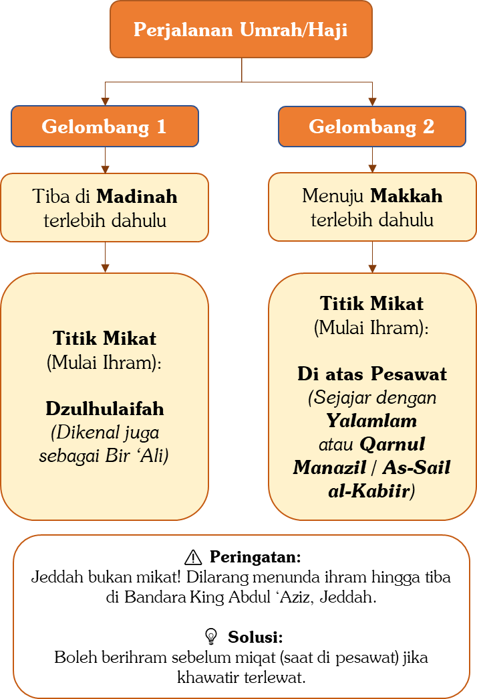

# 2.1.1.2 — Larangan-larangan Ihram

Sebelum masuk ke dalam rincian larangan ihram, ada baiknya kita pahami dulu apa sesungguhnya makna kata “ihram” itu sendiri.

Ihram secara bahasa artinya “pengharaman”, dan pengharaman ini berakhir melalui proses yang disebut tahalul, yang berarti “penghalalan”. Konsepnya mirip dengan salat. Nabi ﷺ bersabda,

```arabic
((مِفْتَاحُ الصَّلَاةِ الطُّهُورُ وَتَحْرِيمُهَا التَّكْبِيرُ وَتَحْلِيلُهَا التَّسْلِيمُ))
```

“Kunci salat adalah bersuci (wudu) dan pengharamannya adalah takbir dan penghalalannya adalah salam.”[^79]

Sebelum salat, kita bebas berbicara, bergerak ke mana saja, tidak harus menghadap kiblat, bahkan boleh makan dan minum. Namun begitu kita mengucapkan Takbiratul ihram, semua itu seketika menjadi haram. Dan semuanya baru boleh kembali dilakukan setelah kita mengucapkan salam sebagai tahalul dalam salat.

Demikian pula dengan ihram dan tahalul dalam umrah dan haji. Sebelum berihram, kita masih bebas mengenakan pakaian biasa, memakai topi, peci, atau sorban, menggunakan wewangian, bahkan bermesraan dengan istri. Namun begitu kita berniat masuk dalam ihram di Mikat, semua itu menjadi haram dan terlarang. Baru boleh kembali dilakukan setelah kita melaksanakan tahalul.

Berikut ini adalah perkara-perkara yang dilarang ketika seseorang sedang berihram.

# 2.1.1.2.1 — Larangan Pertama: Memotong, Mencukur, atau Mencabut Rambut dan Bulu Badan.

Larangan ini mencakup rambut kepala, bulu ketiak, bulu kemaluan, bulu di badan, bulu hidung, kumis, maupun jenggot. Allah ﷻ berfirman,

```arabic
﴿وَلَا تَحۡلِقُواْ رُءُوسَكُمۡ حَتَّىٰ يَبۡلُغَ ٱلۡهَدۡيُ مَحِلَّهُۥۚ فَمَن كَانَ مِنكُم مَّرِيضًا أَوۡ بِهِۦٓ أَذٗى مِّن رَّأۡسِهِۦ فَفِدۡيَةٞ مِّن صِيَامٍ أَوۡ صَدَقَةٍ أَوۡ نُسُكٖۚ﴾
```

“Janganlah kalian mencukur rambut-rambut kalian sampai hewan hadyu tiba pada tempatnya, barang siapa di antara kalian ada yang sakit atau gangguan di kepalanya (lalu dia bercukur) maka wajib baginya membayar fidyah; yaitu puasa 3 (tiga) hari, atau sedekah (memberi makan kepada 6 orang fakir miskin) atau nusuk (menyembelih kambing).” (QS. Al-Baqarah: 196)


Ada beberapa catatan penting yang perlu diperhatikan dalam masalah ini.

Pertama, jika kepala atau tubuh terasa gatal, seorang yang sedang berihram boleh menggaruknya, meskipun garukan itu menyebabkan beberapa helai rambut atau bulu tercabut. Ini bukan pelanggaran. Aisyah radhiyallâhu 'anhâ pernah ditanya tentang hal ini, dan beliau menjawab dengan tegas,

```arabic
نَعَمْ فَلْيَحْكُكْهُ وَلْيَشْدُدْ، وَلَوْ رُبِطَتْ يَدَايَ وَلَمْ أَجِدْ إِلَّا رِجْلَيَّ لَحَكَكْتُ
```

“Iya, hendaknya ia garuk, dan garuk dengan kuat. Seandainya kedua tanganku diikat dan aku tidak bisa menggaruk kecuali dengan kedua kakiku, maka aku akan menggaruk dengan kedua kakiku.”[^80]

Ibnu Taimiyyah berkata,

```arabic
وَكَذَلِكَ إذَا اغْتَسَلَ وَسَقَطَ شَيْءٌ مِنْ شَعْرِهِ بِذَلِكَ لَمْ يَضُرَّهُ
```

“Demikian pula jika seseorang mandi lalu beberapa helai rambut atau bulunya gugur, maka hal itu tidak mengapa.”[^81]

Kedua, jika seseorang mencukur seluruh rambutnya dalam keadaan ihram, para ulama telah sepakat bahwa ia wajib membayar fidyah.

Ketiga, jika yang sengaja dicabut hanya satu, dua, atau tiga helai rambut, maka itu tetap dosa. Namun para ulama berbeda pendapat mengenai kafaratnya.[^82]

Dari penjelasan ini, gugurlah anggapan yang beredar di kalangan sebagian jamaah haji bahwa mencabut satu helai rambut berarti wajib membayar satu ekor kambing, dua helai berarti dua ekor kambing, dan seterusnya. Anggapan yang keliru ini bahkan membuat banyak jamaah haji takut menggaruk ketika gatal, padahal menggaruk itu dibolehkan.

# 2.1.1.2.2 — Larangan Kedua: Memotong Kuku.

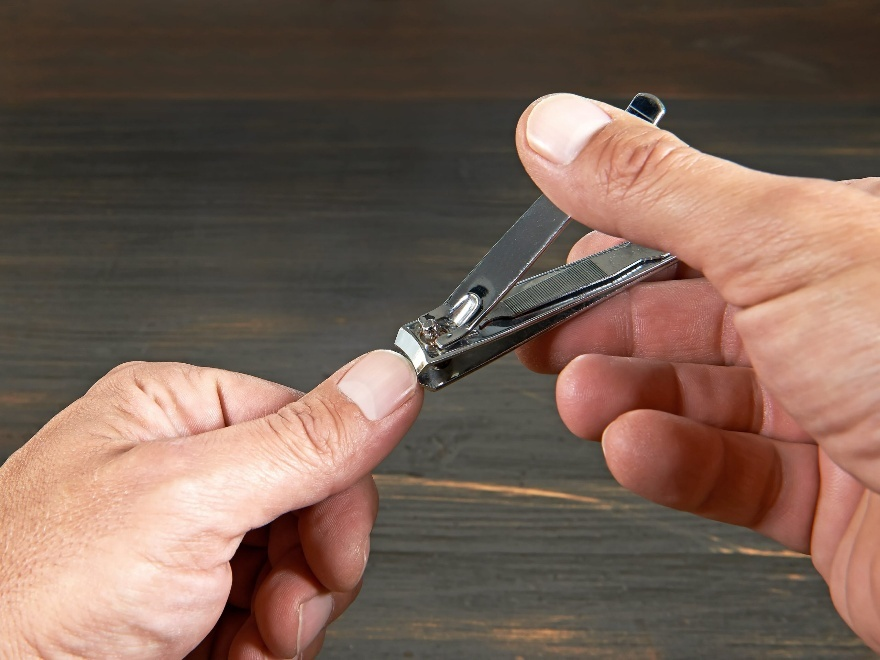

Larangan memotong kuku ketika berihram adalah perkara yang telah disepakati oleh para ulama, kecuali Ibnu Hazm. Ibnul Munzir berkata,

```arabic
وَأَجْمَعُوْا عَلَى أَنَّ الْمُحْرِمَ مَمْنُوْعٌ مِنْ أَخْذِ أَظْفَارِهِ
```

“Para ulama sepakat (ijmak), bahwasanya orang yang sedang ihram, dilarang untuk memotong kukunya.”[^83]

Di antara dalil yang menguatkan larangan ini adalah firman Allah ﷻ,

```arabic
﴿ثُمَّ لۡيَقۡضُواْ تَفَثَهُمۡ﴾
```

“Hendaklah mereka (para jamaah haji) membersihkan kotoran dari tubuh mereka.” (QS. Al-Hajj: 29)

Sebagian ulama salaf, di antaranya Ibnu Abbas, Ikrimah, dan Mujahid, menafsirkan kata tafatsahum (kotoran mereka) sebagai aktivitas yang baru boleh dilakukan pada tanggal 10 Zulhijah, yaitu mencukur rambut, memotong kumis, mencabut bulu ketiak, dan memotong kuku.[^84]

Dari tafsiran ini dipahami bahwa sebelum tanggal tersebut, selama masih berihram, semua hal itu terlarang untuk dilakukan.

Larangan ini juga diperkuat oleh sabda Nabi ﷺ,

```arabic
((إِذَا رَأَيْتُمْ هِلَالَ ذِى الْحِجَّةِ وَأَرَادَ أَحَدُكُمْ أَنْ يُضَحِّىَ فَلْيُمْسِكْ عَنْ شَعْرِهِ وَأَظْفَارِهِ))
```

“Jika kalian melihat hilal bulan Zulhijah dan seorang di antara kalian hendak berkurban, maka hendaknya dia tidak mencukur rambutnya dan tidak memotong kukunya.”[^85]

Hadis ini memang ditujukan bagi orang yang hendak berkurban. Namun para ulama menjelaskan bahwa larangan memotong rambut dan kuku bagi orang yang hendak berkurban adalah karena ia menyerupai orang yang sedang berihram dari satu sisi. Kalau orang yang hendak berkurban saja sudah dilarang memotong kuku, tentu orang yang benar-benar sedang berihram lebih utama untuk dilarang.

Ada beberapa catatan penting yang perlu diperhatikan dalam masalah ini.

Pertama, larangan ini mencakup kuku kedua tangan sekaligus kuku kedua kaki.

Kedua, para ulama sepakat bahwa kuku yang pecah boleh dipotong karena mengganggu, tanpa perlu membayar fidyah sama sekali. Ibnul Munzir berkata,

```arabic
وَأَجْمَعُوا عَلَى أَنَّ لَهُ أَنْ يُزِيْلَ عَنْ نَفْسِهِ مَا كَانَ مُنْكَسِرًا مِنْهُ
```

“Para ulama telah berijmak bahwa ia (seorang yang ihram) boleh memotong kukunya yang pecah.”[^86]

Ketiga, jika seseorang dengan sengaja memotong seluruh kuku kedua tangannya, para ulama sepakat bahwa ia wajib membayar fidyah. Namun jika yang dipotong hanya satu, dua, atau tiga kuku, para ulama berbeda pendapat.

Mazhab Hanafi berpendapat tidak ada fidyah kecuali jika seluruh kuku kedua tangan dipotong, karena tidak ada dalil yang mewajibkan fidyah untuk kuku yang dipotong satu per satu. Sementara mayoritas ulama dari kalangan Malikiyah, Syafi’iyah, dan Hanabilah berpendapat bahwa tetap ada kewajiban memberi makan, meski mereka berbeda tentang kadarnya. Ada yang mengatakan setiap kuku wajib memberi segenggam makanan, ada yang mengatakan satu mud, yakni sekitar seperempat takaran zakat fitrah atau kurang lebih 0,65 kg beras. Perselisihan ini persis seperti khilaf dalam masalah mencabut satu atau dua helai rambut yang sudah dibahas sebelumnya. Ini adalah ijtihad para ulama, karena memang tidak ada nas yang tegas dari Rasulullah ﷺ mengenai kafarat memotong kuku.

# 2.1.1.2.3 — Larangan Ketiga: Memakai Minyak Wangi.

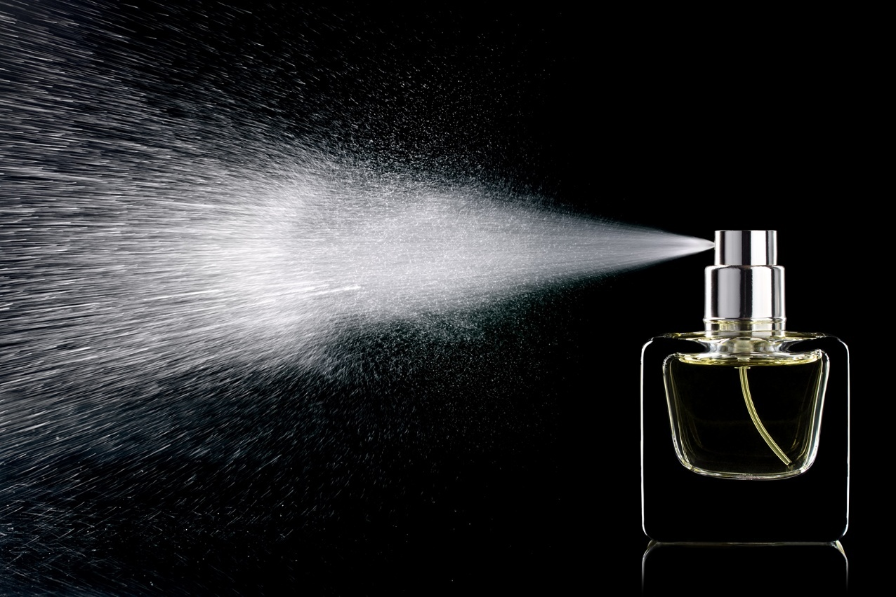

Rasulullah ﷺ bersabda,

```arabic
((وَلَا تَلْبَسُوا مِنَ الثِّيَابِ شَيْئًا مَسَّهُ زَعْفَرَانٌ وَلَا الْوَرْسُ))
```

“Janganlah kalian memakai baju atau kain yang terkena za’farân atau wars.”[^87]

Za’faran dan wars adalah nama-nama wewangian yang dikenal pada masa Nabi ﷺ.

Dalil lain datang dari kisah seorang sahabat yang wafat dalam keadaan berihram. Ibnu Abbas radhiyallâhu ‘anhumâ berkata,

```arabic
أَنَّ رَجُلاً، كَانَ مَعَ النَّبِيِّ ﷺ فَوَقَصَتْهُ نَاقَتُهُ، وَهُوَ مُحْرِمٌ، فَمَاتَ، فَقَالَ رَسُولُ اللَّهِ ﷺ: ((اِغْسِلُوهُ بِمَاءٍ وَسِدْرٍ، وَكَفِّنُوهُ فِي ثَوْبَيْهِ، وَلَا تَمَسُّوهُ بِطِيْبٍ، وَلَا تُخَمِّرُوا رَأْسَهُ، فَإِنَّهُ يُبْعَثُ يَوْمَ الْقِيَامَةِ مُلَبِّيًا))
```

“Ada seorang lelaki yang bersama Nabi ﷺ dalam perjalanan haji, lalu ia terjatuh dari untanya dalam keadaan berihram dan meninggal dunia. Maka Rasulullah ﷺ bersabda, ‘Mandikanlah ia dengan air dan daun bidara, kafankan dengan dua helai bajunya, jangan sentuhkan wewangian padanya, dan jangan tutup kepalanya ketika dikafankan, karena ia akan dibangkitkan pada hari kiamat dalam keadaan bertalbiah’.”[^88]

Perhatikan, bahkan orang yang sudah wafat dalam keadaan berihram pun tidak boleh diberi wewangian. Ini menunjukkan betapa seriusnya larangan ini.

Agar lebih jelas, mari kita bedakan dua kondisi terkait wewangian dan ihram.

Kondisi pertama: Sebelum berihram.

Sebelum ihram, yakni ketika seseorang sedang mempersiapkan diri untuk berihram, ia tidak hanya boleh memakai wewangian, bahkan disunahkan untuk melakukannya. Ini boleh dipakaikan pada badan atau rambut, hanya saja tidak boleh langsung di atas kain ihram.

Aisyah radhiyallâhu ‘anhâ berkata,

```arabic
كُنْتُ أُطَيِّبُ رَسُولَ اللَّهِ ﷺ لِإِحْرَامِهِ حِينَ يُحْرِمُ، وَلِحِلِّهِ قَبْلَ أَنْ يَطُوفَ بِالْبَيْتِ
```

“Aku pernah memakaikan minyak wangi kepada Rasulullah ﷺ tatkala beliau hendak berihram. Aku juga memakaikan minyak wangi setelah Nabi bertahalul (yaitu Tahalul awal setelah beliau melempar jumrah dan mencukur rambut-pen) sebelum beliau bertawaf di Ka’bah.”[^89]

Bahkan Aisyah juga menyebutkan,

```arabic
كَأَنِّيْ أَنْظُرُ إِلَى وَبِيْصَ اْلمِسْكِ فِيْ مَفْرَقِ رَسُوْلِ اللهِ وَهُوَ مُحْرِمٌ
```

“Seakan-akan aku melihat ada kilatan bekas minyak rambut di bagian belahan rambut kepala Nabi ﷺ tatkala beliau sedang ihram.”[^90]

Ini adalah dalil bahwa wewangian yang dipakai sebelum berihram tidak mengapa masih tersisa bekasnya ketika seseorang sudah berihram.[^91] Yang penting, wewangian itu dipakai sebelum ihram. Jika kemudian kain ihramnya terkena sisa wewangian yang ada di badan, itu tidak menjadi masalah. Yang dilarang adalah menumpahkan atau mengoleskan wewangian langsung di atas kain ihram.

Kondisi kedua: Sesudah berihram.

Begitu seseorang sudah berihram, sudah mengucapkan niat, “Labbaik Allâhumma umrah,” atau, “Labbaik Allâhumma hajjan,” maka tidak boleh lagi menggunakan wewangian, baik di baju maupun di badan.

Mengapa? Para ulama menyebutkan dua alasan. Pertama, orang yang berihram tidak dituntut untuk berhias dan berpenampilan mewah. Kedua, wewangian sangat mudah membangkitkan syahwat ke arah hubungan suami istri, sementara hubungan suami istri adalah salah satu larangan paling keras dalam ihram, sebagaimana akan dijelaskan pada babnya tersendiri. Karena itulah Rasulullah ﷺ juga melarang wanita keluar rumah dengan memakai wewangian, karena hal itu bisa membangkitkan syahwat orang yang menciumnya.

Ada beberapa catatan penting seputar larangan ini yang perlu diketahui.

Pertama, orang yang sedang berihram juga dilarang untuk sengaja mencium bau wewangian.[^92] Namun jika tercium tanpa sengaja, maka tidak mengapa.

Kedua, sebagian jamaah haji mencuci kain ihramnya dengan pewangi pakaian seperti molto atau sejenisnya. Ini tidak boleh. Kain ihram tersebut harus dibilas kembali hingga sisa pewangi pakaian itu benar-benar hilang.

Ketiga, yang dilarang adalah wewangian sebagaimana yang ditunjukkan oleh lafaz hadis. Adapun benda lain yang kebetulan memiliki aroma enak atau aroma menyengat namun bukan termasuk wewangian, maka tidak mengapa. Beberapa contoh praktisnya adalah sebagai berikut:

- Jeruk. Memakan jeruk tidak menjadi masalah, karena jeruk adalah sesuatu yang alami dan bukan wewangian. Kecuali jika sudah diolah dan diubah menjadi minyak wangi beraroma jeruk, maka hukumnya berubah menjadi terlarang.

- Pasta gigi. Pasta gigi yang sekadar memiliki rasa dan aroma mint bukanlah wewangian, sehingga tidak mengapa digunakan ketika menggosok gigi. Sebagian ulama bahkan memandang tidak mengapa pasta gigi yang harum, karena pasta gigi memang tidak dimaksudkan sebagai wewangian. Namun untuk lebih berhati-hati, sebaiknya tidak menggunakan pasta gigi yang mengandung aroma pewangi yang kuat. Wallâhu a’lam.

- Balsam, minyak angin, dan sejenisnya. Tidak mengapa menggunakan balsam, minyak angin, atau minyak kayu putih meskipun aromanya tajam, karena semua itu bukan wewangian. Kecuali minyak angin yang mengandung aroma terapi atau aroma parfum, maka ini tidak boleh, karena minyak angin tersebut sudah dicampurkan dengan wewangian.

- Sabun. Sabun yang tidak mengandung parfum, seperti sabun umrah, sabun cuci piring, atau sabun cuci baju, tidak menjadi masalah untuk digunakan selama berihram, karena sabun-sabun ini tidak mengandung wewangian.

Jadi, tidak semua benda yang berbau harum otomatis masuk dalam kategori wewangian yang dilarang. Yang menjadi patokan adalah apakah benda tersebut memang termasuk dalam golongan wewangian atau tidak.

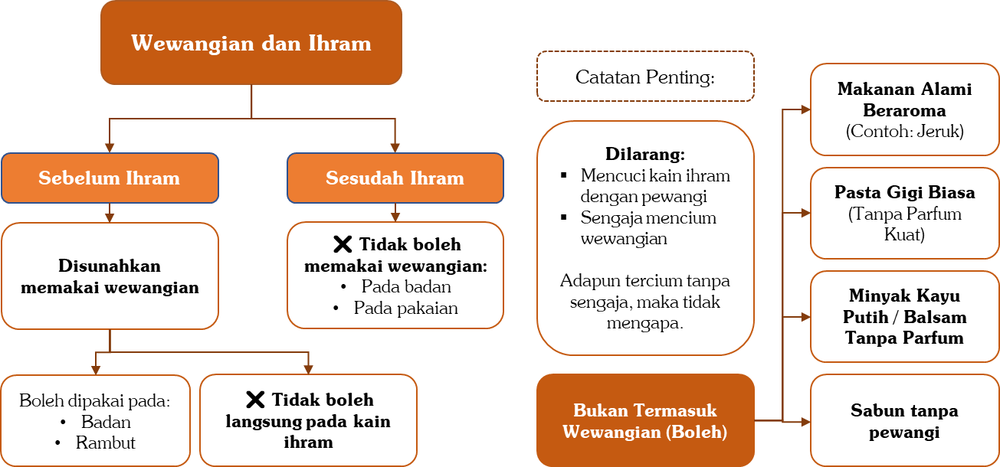

# 2.1.1.2.4 — Larangan Keempat: Menutup Kepala bagi Laki-laki.

Larangan ihram berikutnya adalah menutup kepala, dan ini khusus berlaku bagi para lelaki. Adapun bagi wanita, menutup kepala tentu tidak menjadi masalah karena mereka memang berjilbab. Yang dilarang bagi wanita adalah memakai cadar dan sarung tangan, sebagaimana akan dijelaskan nanti.

Nabi ﷺ bersabda,

```arabic
((لَا يَلْبَسُ الْقُمُصَ، وَلَا الْعَمَائِمَ))
```

“Seseorang yang sedang ihram tidak boleh memakai gamis dan jubah dan tidak boleh memakai imamah (surban).”[^93]

Demikian pula dalam hadis Ibnu Abbas yang telah kita sebutkan sebelumnya, tentang seorang sahabat yang terjatuh dari untanya lalu meninggal dalam keadaan berihram. Rasulullah ﷺ bersabda mengenai jasadnya,

```arabic
((وَلَا تُخَمِّرُوا رَأْسَهُ))
```

“Janganlah kalian menutup kepalanya.”[^94]

Ini adalah dalil bahwa orang yang sedang ihram tidak boleh menempelkan sesuatu di atas kepalanya, seperti menutup kepala dengan kain ihramnya sendiri.

Namun perlu dibedakan antara menutup kepala dengan sesuatu yang menempel dan berteduh dari terik matahari. Berteduh dengan payung, kain tenda, atau atap kendaraan tidaklah terlarang. Ini bukan termasuk menutup kepala yang dilarang. Buktinya, Rasulullah ﷺ sendiri ketika melempar jamrah ‘Aqabah dalam keadaan masih berihram, beliau dinaungi dengan kain oleh para sahabatnya.

Ummul Hushain berkata,

```arabic
حَجَجْتُ مَعَ رَسُولِ اللهِ ﷺ حَجَّةَ الْوَدَاعِ، فَرَأَيْتُ أُسَامَةَ وَبِلَالًا، وَأَحَدُهُمَا آخِذٌ بِخِطَامِ نَاقَةِ النَّبِيِّ ﷺ وَالْآخَرُ رَافِعٌ ثَوْبَهُ يَسْتُرُهُ مِنَ الْحَرِّ (وَفِي رِوَايَةٍ: مِنَ الشَّمْسِ) حَتَّى رَمَى جَمْرَةَ الْعَقَبَةِ
```

“Aku berhaji bersama Rasulullah ﷺ yaitu ketika haji Wadak maka aku melihat Usamah dan Bilal, salah satu dari mereka berdua memegang kendali unta Nabi ﷺ dan yang lainnya mengangkat bajunya menutupi Rasulullah ﷺ karena panas (Dalam riwayat yang lain: karena matahari) hingga Nabi selesai melempar jumrah Aqabah.”[^95]

Jabir berkata tatkala menjelaskan perjalanan haji Nabi,

```arabic
وَأَمَرَ بِقُبَّةٍ مِنْ شَعَرٍ تُضْرَبُ لَهُ بِنَمِرَةَ.... فَوَجَدَ الْقُبَّةَ قَدْ ضُرِبَتْ لَهُ بِنَمِرَةَ، فَنَزَلَ بِهَا، حَتَّى إِذَا زَاغَتِ الشَّمْسُ أَمَرَ بِالْقَصْوَاءِ
```

“Dan Nabi memerintahkan untuk ditegakkan kemah baginya di Namirah (di Arafah)….Lalu Nabi mendapati kemah telah ditegakkan untuk beliau di Namirah, maka beliau ﷺ pun singgah di kemah tersebut hingga tiba waktu Zuhur, lalu beliau memerintahkan untuk mempersiapkan ontanya, al-Qashwâ`.”[^96]

Jadi, berteduh dibolehkan. Yang terlarang adalah menempelkan sesuatu langsung di atas kepala.

Bagaimana dengan menutup wajah bagi laki-laki?

Dalam hal ini para ulama berbeda pendapat. Dalam riwayat Muslim, tatkala Rasulullah ﷺ memerintahkan para sahabat untuk mengurus jenazah sahabat yang terjatuh dari unta di padang Arafah, beliau bersabda,

```arabic
((وَلَا تُخَمِّرُوا رَأْسَهُ وَلَا وَجْهَهُ))
```

“Jangan kalian tutup kepalanya dan jangan kalian tutup pula wajahnya.”[^97]

Terdapat tambahan lafaz “dan jangan tutup wajahnya” dalam riwayat Muslim ini. Para ulama berbeda pendapat tentang kesahihan tambahan tersebut. Sebagian ulama memandangnya sahih, di antaranya az-Zaila’i[^98] dan al-Albani[^99], sehingga menurut mereka lelaki yang berihram tidak boleh menutup wajahnya, termasuk tidak boleh memakai masker berbahan kain.

Namun sebagian ulama lain berpendapat bahwa tambahan lafaz ini tidak sahih, di antaranya al-Imam al-Bukhari sebagaimana dinukil oleh Ibnul Muzhaffar al-Bazzar dan Abu Abdillah al-Hakim. Dengan demikian, menurut pendapat ini, lelaki yang berihram boleh menutup wajahnya.

Penulis lebih condong kepada pendapat kedua. Pasalnya, larangan Nabi ﷺ terhadap orang yang berihram berkaitan dengan pakaian, yaitu serban sebagai penutup kepala, jubah sebagai penutup badan, burnus sebagai penutup pundak, dan celana sebagai penutup kaki. Sementara bagi kaum pria, tidak ada pakaian khusus yang diperuntukkan bagi wajah. Berbeda dengan wanita yang memang mengenal cadar sebagai pakaian wajah. Karena itulah Rasulullah ﷺ bersabda khusus tentang wanita,

```arabic
((وَلَا تَنْتَقِبِ الْمَرْأَةُ))
```

“Jangan seorang wanita memakai cadar.”[^100]

Dengan demikian, lelaki yang berihram boleh menutup wajahnya dan boleh memakai masker meskipun terbuat dari kain.

# 2.1.1.2.5 — Larangan Kelima: Memakai Pakaian Berjahit bagi Laki-laki.

Lelaki yang sedang berihram tidak boleh memakai pakaian yang dijahit membentuk potongan tubuh manusia, seperti gamis (jubah), sirwal/celana, khuf (sepatu tertutup), kaos kaki, kaos dalam, celana dalam, dan sejenisnya.

Ibnu Umar radhiyallâhu ‘anhumâ meriwayatkan,

```arabic
أَنَّ رَجُلاً، سَأَلَ رَسُولَ اللَّهِ ﷺ مَا يَلْبَسُ الْمُحْرِمُ مِنَ الثِّيَابِ فَقَالَ رَسُولُ اللَّهِ ﷺ: ((لَا تَلْبَسُوا الْقُمُصَ وَلَا الْعَمَائِمَ وَلَا السَّرَاوِيلَاتِ وَلَا الْبَرَانِسَ وَلَا الْخِفَافَ إِلَّا أَحَدٌ لَا يَجِدُ النَّعْلَيْنِ فَلْيَلْبَسِ الْخُفَّيْنِ وَلْيَقْطَعْهُمَا أَسْفَلَ مِنَ الْكَعْبَيْنِ وَلَا تَلْبَسُوا مِنَ الثِّيَابِ شَيْئًا مَسَّهُ الزَّعْفَرَانُ وَلَا الْوَرْسُ))
```

“Ada seorang bertanya kepada Rasulullah, ‘Wahai Rasulullah, pakaian apa yang boleh dipakai oleh seorang yang sedang ihram?’

Rasulullah ﷺ bersabda, ‘Orang yang berihram tidak boleh memakai baju jubah, serban, celana panjang, barânis (pakaian yang diletakan di bagian pundak dan ada tutup kepalanya) dan tidak boleh pakai khuf (sepatu), kecuali seseorang yang tidak memiliki sandal. Jika tidak memiliki sandal maka dia boleh memakai sepatu, dengan syarat sepatu tersebut dipotong sampai di bawah mata kaki. Tidak boleh memakai baju yang tercampur dengan minyak wangi za'farân dan wars.”[^101]

Di sini Rasulullah ﷺ melarang pakaian yang dijahit membentuk anggota tubuh. Para ulama menyebut ini dengan istilah al-Makhîth, yang secara harfiah berarti “yang dijahit”. Sayangnya, istilah ini kerap menimbulkan kesalahpahaman di kalangan jamaah haji dan umrah.

Banyak yang mengira bahwa semua benda yang ada jahitannya adalah terlarang, sementara yang tidak ada jahitannya boleh dipakai. Padahal bukan itu maksudnya. Yang dimaksud dengan al-Makhîth oleh para ulama adalah pakaian yang dijahit sedemikian rupa sehingga membentuk potongan tubuh manusia.

Perhatikan bahwa Rasulullah ﷺ sama sekali tidak berbicara soal “jahitan”. Beliau hanya menyebutkan jenis-jenis pakaiannya: jubah, celana, serban, burnus. Dari sini para ulama menyimpulkan bahwa yang dilarang adalah pakaian yang membentuk anggota tubuh, bukan sekadar karena ada jahitannya.

Konsekuensinya, seandainya ada seseorang yang menenun kaos dalam atau jubah tanpa satu pun jahitan, namun bentuknya sudah seperti jubah atau kaos dalam, maka tetap saja haram dipakai. Sebaliknya, seandainya ada benda yang ada jahitannya tetapi tidak berbentuk pakaian, maka tidak terlarang.

Beberapa contoh praktis yang perlu diketahui adalah sebagai berikut.

Kain ihram yang diberi jahitan tulisan nama travel, misalnya, tidak menjadi masalah karena jahitan itu tidak menjadikan kain tersebut berbentuk pakaian. Adapun memasang kancing pada kain ihram, jika hanya satu atau dua kancing yang berjauhan, mudah-mudahan tidak mengapa. Namun jika kancing-kancing itu berdekatan dan rapat, maka tidak boleh karena menyerupai menjahit kain ihram menjadi pakaian.

Ikat pinggang yang ada jahitannya tidak terlarang, karena bukan pakaian yang membentuk tubuh. Sandal yang ada jahitannya juga tidak terlarang. Tas yang penuh jahitan pun tidak terlarang karena tas bukan pakaian. Dompet berjahit juga tidak mengapa. Apalagi jam tangan dan kacamata, tentu lebih boleh lagi untuk dipakai.

Bagaimana dengan sepatu bagi yang tidak memiliki sandal?

Rasulullah ﷺ memberikan keringanan bagi yang tidak memiliki sandal untuk memakai sepatu tertutup (khuf), dengan syarat dipotong hingga di bawah mata kaki. Namun banyak ulama berpendapat bahwa syarat memotong khuf ini sudah mansukh atau tidak berlaku lagi. Dalilnya adalah khotbah Nabi ﷺ di padang Arafah yang diriwayatkan oleh Ibnu Abbas,

```arabic
سَمِعْتُ النَّبِيَّ ﷺ يَخْطُبُ بِعَرَفَاتٍ: ((مَنْ لَمْ يَجِدِ النَّعْلَيْنِ فَلْيَلْبَسِ الْخُفَّيْنِ، وَمَنْ لَمْ يَجِدْ إِزَارًا فَلْيَلْبَسْ سَرَاوِيلَ لِلْمُحْرِمِ))
```

“Aku mendengar Rasulullah ﷺ berkhotbah di padang Arafah. Nabi ﷺ bersabda, ‘Barang siapa yang tidak mendapati dua sandal, silakan pakai khuf. Barang siapa yang tidak punya izâr (sarung) silakan pakai sirwal/celana. Ini berlaku bagi yang sedang berihram’.”[^102]

Khotbah ini disampaikan di hadapan ribuan jamaah di Arafah. Dan dalam khotbah itu Rasulullah ﷺ hanya berkata, “Pakailah khuf,” tanpa menambahkan, “Dan potonglah di bawah mata kaki.” Para ulama menjadikan ini sebagai dalil bahwa perintah memotong khuf sudah mansukh. Maka bagi yang tidak memiliki sandal, boleh memakai sepatu tertutup tanpa perlu memotongnya.

Keringanan ini memang diberikan karena pada masa itu tidak semua orang memiliki perlengkapan yang lengkap. Tidak semua yang punya celana juga punya sarung. Tidak semua yang punya sepatu juga punya sandal. Maka rahmat Allah datang melalui lisan Nabi-Nya dengan keringanan yang memudahkan.

Peringatan Khusus untuk Wanita.

Adapun bagi wanita yang sedang berihram, larangan yang berlaku bagi mereka adalah memakai cadar dan sarung tangan. Nabi ﷺ bersabda,

```arabic
((وَلَا تَنْتَقِبِ الْمَرْأَةُ الْمُحْرِمَةُ وَلَا تَلْبَسِ الْقُفَّازَيْنِ))
```

“Seorang wanita yang sedang berihram tidak boleh memakai cadar dan tidak boleh juga memakai dua kaos tangan.”[^103]

Jika seorang wanita berada di hadapan laki-laki asing yang bukan mahramnya, ia boleh menjulurkan kain khimarnya ke bawah hingga menutupi wajah, namun tidak boleh memakai cadar. Cadar adalah penutup wajah yang ditempelkan di wajah lalu diikat di belakang kepala. Adapun menjulurkan kain dari atas kepala ke bawah tanpa menempelkan dan mengikatnya di wajah, maka ini dibolehkan.

Aisyah radhiyallâhu ‘anhâ berkata,

```arabic
كَانَ الرُّكْبَانُ يَمُرُّونَ بِنَا وَنَحْنُ مَعَ رَسُولِ اللَّهِ ﷺ مُحْرِمَاتٌ، فَإِذَا حَاذَوْا بِنَا سَدَلَتْ إِحْدَانَا جِلْبَابَهَا مِنْ رَأْسِهَا عَلَى وَجْهِهَ، فَإِذَا جَاوَزُونَا كَشَفْنَاهُ
```

“Dahulu para pengendara melewati kami, sementara kami sedang berihram bersama Rasulullah. Apabila mereka telah sejajar dengan kami, salah seorang dari kami menjulurkan jilbabnya dari atas kepalanya hingga menutupi wajahnya. Namun apabila mereka telah melewati kami, kami pun membukanya kembali.”[^104]

Dengan demikian, yang dilarang bagi wanita adalah memakai pakaian yang memang dibuat dan diperuntukkan untuk menutup wajah, seperti cadar/nikab dan burqu’. Adapun menjulurkan kain dari atas kepala tanpa mengikatnya di wajah, maka dibolehkan berdasarkan riwayat-riwayat di atas.

Ada dua catatan penting dalam masalah ini.

Pertama, jika wanita menutup wajahnya dengan cara apa pun selain cadar dan burqu', maka tidak mengapa. Ibnu Taimiyyah berkata,

```arabic
تَخْصِيْصُ النَّهْيِ بِالنِّقَابِ، وَقَرْنُهُ بِالقُفَّازِ: دَلِيْلٌ عَلَى أَنَّهُ إِنَّمَا نَهَاهَا عَمَّا صُنِعَ لِسَتْرِ الْوَجْهِ، كَالْقُفَّازِ الْمَصْنُوْعِ لِسَتْرِ الْيَدِ، وَالْقَمِيْصُ الْمَصْنُوْعُ لِسَتْرِ الْبَدْنِ؛ فَعَلَى هَذَا: يَجُوْزُ أَنْ تُخَمِّرَهُ بِالثَّوْبِ مِنْ أَسْفَلَ وَمِنْ فَوْقَ مَا لَمْ يَكُنْ مَصْنُوْعًا عَلَى وَجْهٍ يَثْبُتُ عَلَى الْوَجْهِ، وَأَنْ تُخَمِّرَهُ بالْمِلْحَفَةِ وَقْتَ النَّوْمِ
```

“Pengkhususan larangan pada cadar dan disandingkannya dengan sarung tangan merupakan dalil bahwa Nabi hanya melarang wanita dari sesuatu yang memang dibuat khusus untuk menutup wajah, sebagaimana sarung tangan dibuat untuk menutup tangan dan jubah dibuat untuk menutup badan.

Dengan demikian, boleh bagi wanita menutup wajahnya dengan bajunya dari atas maupun dari bawah selama penutup itu tidak dibuat sebagai pakaian yang menempel di wajah. Dan ia boleh menutup wajahnya dengan selimut ketika tidur.”[^105]

Solusi praktis bagi wanita yang ingin tetap menjaga wajahnya adalah dengan menjulurkan kain dari atas kepala, selama tidak diikat seperti cara mengikat cadar. Imam Ahmad berkata sebagaimana dinukil oleh Ibnu Qudamah,

```arabic
إِنَّمَا لَهَا أَنْ تَسْدُلَ عَلَى وَجْهِهَا مِنْ فَوْقُ، وَلَيْسَ لَهَا أَنْ تَرْفَعَ الثَّوْبَ مِنْ أَسْفَلَ. كَأَنَّهُ يَقُولُ: إِنَّ النِّقَابَ مِنْ أَسْفَلَ عَلَى وَجْهِهَا
```

“Hanyalah boleh bagi wanita untuk menjulurkan kain dari atas ke wajahnya, dan tidak boleh baginya mengangkat baju dari bawah,”

Seakan-akan Imam Ahmad berkata, “Sesungguhnya nikab dipasang di wajah wanita dari bawah.”[^106]

Kedua, berkaitan dengan masker bagi wanita. Masker memiliki dua model yang perlu dibedakan hukumnya.

Model pertama adalah masker yang tidak menutup seluruh wajah, yakni hanya menutup hidung dan mulut, sementara pipi masih terlihat. Sebagian ulama kontemporer berpendapat bahwa masker model ini tidak menyerupai cadar yang dilarang bagi wanita yang berihram, sehingga boleh dipakai tanpa perlu membayar fidyah.

Model kedua adalah masker yang menutup seluruh wajah layaknya cadar, yakni seluruh wajah tertutup kecuali kedua mata. Untuk model ini sebaiknya ditinggalkan demi keluar dari ranah perselisihan para ulama. Meskipun pendapat yang lebih kuat adalah bahwa masker bukanlah pakaian yang memang dibuat untuk menutup wajah sebagaimana cadar dan burqu’, sehingga sebenarnya boleh dipakai oleh wanita yang berihram.

Ibnu Qudamah berkata,

```arabic
وَإِنَّمَا مُنِعَتِ الْمَرْأَةُ مِنَ الْبُرْقُعِ وَالنِّقَابِ وَنَحْوِهِمَا، مِمَّا يُعَدُّ لِسَتْرِ الْوَجْهِ
```

“Sesungguhnya wanita itu hanya dilarang memakai burqu’, nikab (cadar), dan yang semisal keduanya, yaitu segala sesuatu yang memang dibuat secara khusus untuk menutup wajah.”[^107]

Dan Ibnu Taimiyyah sebagaimana telah disebutkan menegaskan bahwa selama sesuatu tidak dibuat sebagai pakaian wajah, maka tidak mengapa bagi wanita yang berihram untuk memakainya.[^108]

# 2.1.1.2.6 — Larangan Keenam: Berburu Hewan Buruan Darat.

Yang dimaksud dengan hewan buruan darat di sini adalah hewan liar yang biasa diburu, bukan hewan ternak. Ayam, kambing, sapi, dan unta bukan termasuk hewan buruan. Adapun hewan laut seperti ikan, boleh ditangkap meskipun seseorang sedang berihram.

Allah ﷻ berfirman,

```arabic
﴿أُحِلَّ لَكُمۡ صَيۡدُ ٱلۡبَحۡرِ وَطَعَامُهُۥ مَتَٰعٗا لَّكُمۡ وَلِلسَّيَّارَةِۖ وَحُرِّمَ عَلَيۡكُمۡ صَيۡدُ ٱلۡبَرِّ مَا دُمۡتُمۡ حُرُمٗاۗ وَٱتَّقُواْ ٱللَّهَ ٱلَّذِيٓ إِلَيۡهِ تُحۡشَرُونَ﴾
```

“Dihalalkan bagimu binatang buruan laut dan makanan (yang berasal) dari laut sebagai makanan yang lezat bagimu, dan bagi orang-orang yang dalam perjalanan; dan diharamkan atasmu (menangkap) binatang buruan darat, selama kamu dalam ihram. Dan bertakwalah kepada Allah Yang kepada-Nya-lah kamu akan dikumpulkan.” (QS. Al-Mâ`idah: 96)

```arabic
﴿يَٰٓأَيُّهَا ٱلَّذِينَ ءَامَنُواْ لَا تَقۡتُلُواْ ٱلصَّيۡدَ وَأَنتُمۡ حُرُمٞۚ﴾
```

“Wahai orang yang beriman, janganlah kalian berburu hewan buruan darat sementara kalian dalam kondisi ihram.” (QS. Al Mâ`idah: 95)

Dan setelah tahalul, larangan ini dicabut. Allah ﷻ berfirman,

```arabic
﴿وَإِذَا حَلَلۡتُمۡ فَٱصۡطَادُواْۚ﴾
```

“Jika kalian telah bertahalul maka silakan kalian berburu.” (QS. Al-Mâ`idah: 2)

Di zaman kita sekarang, larangan ini mungkin terasa jauh dari keseharian jamaah haji. Perjalanan kini ditempuh dengan kendaraan yang nyaman dan ber-AC, makanan sudah tersedia, dan tidak ada lagi kebutuhan untuk berburu di tengah jalan. Namun meskipun demikian, tetap perlu diperhatikan bahwa hewan-hewan liar yang ada di sekitar kawasan haji, seperti burung merpati, tidak boleh diusik atau diganggu. Begitu pula belalang yang kerap beterbangan di halaman Masjid Nabawi, menurut sebagian ulama, tidak boleh dibunuh karena termasuk hewan buruan.

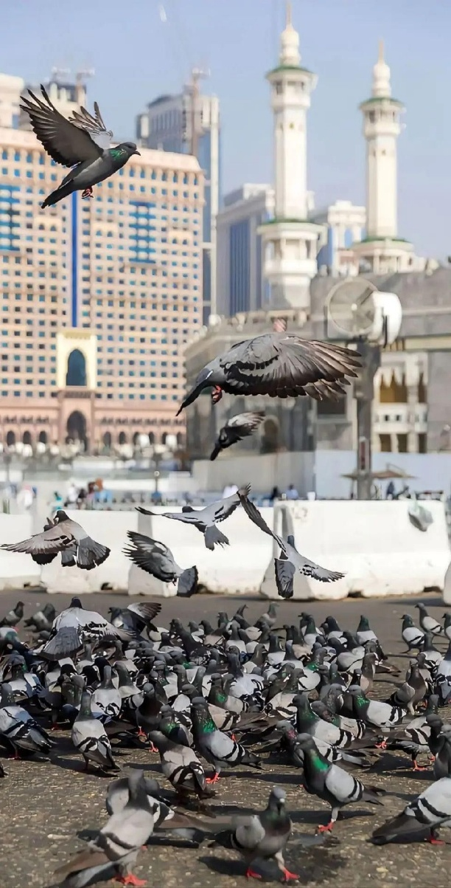

Betapa berbeda kondisi ini dengan zaman dahulu. Bayangkan, seseorang yang hendak berihram untuk umrah dari Madinah menuju Makkah harus menempuh jarak sekitar 450 hingga 500 kilometer, dan perjalanan itu bisa memakan waktu seminggu atau lebih. Di tengah perjalanan panjang seperti itu, tidak jarang bekal habis dan seseorang terpaksa harus mencari makanan. Di sinilah relevansi larangan ini menjadi sangat nyata.

Menariknya, larangan berburu ini tidak hanya berlaku bagi yang berihram. Allah bahkan melarang orang yang tidak sedang berihram untuk membantu orang yang berihram mendapatkan buruan. Misalnya, seseorang yang tidak berihram menunjukkan keberadaan hewan buruan kepada orang yang berihram, ini tidak boleh. Begitu pula jika seseorang yang tidak berihram berburu dengan niat memberikan hasilnya kepada orang yang sedang berihram, ini juga tidak dibolehkan. Namun jika ia berburu untuk dirinya sendiri, lalu kemudian memasak dan menghidangkannya kepada orang yang berihram, maka itu tidak mengapa.

Dendanya bagi yang melanggar.

Bagi siapa yang sengaja berburu dalam keadaan berihram, Allah ﷻ telah menetapkan dendanya. Ada tiga pilihan denda yang dapat dipilih salah satunya.

Pilihan pertama: Membayar dengan hewan ternak.

Allah ﷻ berfirman,

```arabic
﴿يَٰٓأَيُّهَا ٱلَّذِينَ ءَامَنُواْ لَا تَقۡتُلُواْ ٱلصَّيۡدَ وَأَنتُمۡ حُرُمٞۚ وَمَن قَتَلَهُۥ مِنكُم مُّتَعَمِّدٗا فَجَزَآءٞ مِّثۡلُ مَا قَتَلَ مِنَ ٱلنَّعَمِ يَحۡكُمُ بِهِۦ ذَوَا عَدۡلٖ مِّنكُمۡ هَدۡيَۢا بَٰلِغَ ٱلۡكَعۡبَةِ أَوۡ كَفَّٰرَةٞ طَعَامُ مَسَٰكِينَ أَوۡ عَدۡلُ ذَٰلِكَ صِيَامٗا لِّيَذُوقَ وَبَالَ أَمۡرِهِۦ﴾
```

“Wahai orang-orang yang beriman, janganlah kalian berburu hewan buruan darat sementara kalian dalam kondisi ihram. Barang siapa yang sengaja berburu hewan buruan di antara kalian. Maka dendanya adalah hewan dari binatang ternak yang mirip (seimbang) dengan hewan buruan tersebut. Yang memutuskan haruslah dua orang yang adil di antara kalian, denda tersebut harus di bagi di Ka'bah. Atau memberi makan kepada fakir miskin. Atau berpuasa yang seimbang dengan makanan yang dikeluarkan itu.” (QS. Al-Mâ`idah: 95)

Perlu diperhatikan beberapa hal di sini. Pertama, denda ini hanya berlaku jika perbuatan itu dilakukan dengan sengaja, karena Allah menggunakan kata muta’ammidan (sengaja). Jika tidak sengaja atau lupa, tidak ada kewajiban membayar denda.

Kedua, denda dibayar dengan hewan ternak yang sebanding dengan hewan yang diburu, bukan hewan yang sama jenisnya. Misalnya, seseorang berburu merpati, maka dendanya bukan membayar seekor merpati, melainkan hewan ternak yang sebanding dengannya, dalam hal ini seekor kambing. Jika berburu burung unta, dendanya seekor unta. Jika berburu keledai liar, dendanya seekor sapi. Inilah fatwa sebagian sahabat dan tabiin.

Ketiga, hewan denda tersebut harus disembelih di Makkah dan dibagikan kepada fakir miskin di sana, sesuai firman Allah hadyan bâlighal Ka’bah (hadyu yang dibawa ke Ka’bah).

Pilihan kedua: Memberi makan fakir miskin.

Para ulama berbeda pendapat tentang teknisnya. Ibnu Hazm berpendapat bahwa memberi makan tiga orang fakir miskin sudah mencukupi, karena Allah hanya menggunakan kata jamak masâkîn.

Namun sebagian ulama lain berpendapat dengan cara yang lebih terukur, yaitu dengan menaksir nilai hewan ternak yang menjadi denda. Misalnya, dendanya seekor kambing seharga 300 riyal. Maka 300 riyal itu tidak harus dibelikan kambing, melainkan bisa dibelikan beras, lalu dibagikan kepada fakir miskin masing-masing setengah sha’ atau sekitar 1,3 kg beras. Pendapat ini dipandang lebih berhati-hati dan lebih banyak dianut para ulama.

Pilihan ketiga: Berpuasa.

Jika seseorang tidak mampu membayar denda dengan hewan ternak maupun memberi makan fakir miskin, maka ia boleh menggantinya dengan puasa. Caranya adalah dengan menghitung berapa orang miskin yang bisa mendapatkan bagian dari nilai hewan denda tersebut, lalu setiap satu orang miskin diganti dengan satu hari puasa.

Sebagai gambaran, jika dendanya seekor kambing seharga 300 riyal, lalu 300 riyal itu dibelikan beras dan dibagikan kepada fakir miskin masing-masing 1,3 kg, katakanlah menghasilkan sekitar 15 orang penerima, maka orang tersebut harus berpuasa 15 hari. Tentu ini pilihan yang paling berat, dan memang demikianlah mestinya sebagai efek jera.

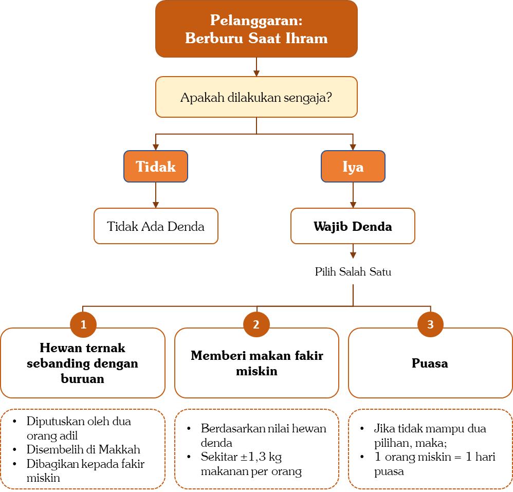

# 2.1.1.2.7 — Larangan Ketujuh: Melakukan Akad Nikah, Menikahkan, dan Melamar.

Larangan ini berlaku bagi pria maupun wanita yang sedang berihram. Rasulullah ﷺ bersabda,

```arabic
((لَا يَنْكِحُ الْمُحْرِمُ وَلَا يُنْكَحُ وَلَا يَخْطُبُ))
```

“Tidak boleh seseorang yang sedang ihram menikah, tidak boleh juga menikahkan dan tidak boleh juga melamar.”[^109]

Maka seseorang yang sedang berihram tidak boleh melangsungkan akad nikah meskipun calon pasangannya tidak sedang berihram. Ia juga tidak boleh menikahkan orang lain, tidak boleh menjadi wali, tidak boleh menjadi wakil wali dalam akad nikah, dan tidak boleh melamar seorang wanita selama masih dalam keadaan ihram.

Mengapa larangan ini ada? Karena Allah ﷻ telah berfirman,

```arabic
ﵟفَلَا رَفَثَﵞ
```

“Tidak boleh berbuat rafas.” (QS. Al-Baqarah: 197)

Rafas adalah hubungan suami istri dan segala sesuatu yang mengarah dan mengantarkan kepadanya. Pernikahan, melamar, dan segala sesuatu yang membangkitkan syahwat semuanya termasuk dalam cakupan larangan ini. Itulah pula sebabnya wewangian dilarang bagi orang yang berihram, karena wewangian termasuk perkara yang bisa membangkitkan syahwat.

Ada beberapa hal penting yang perlu diperhatikan dalam masalah ini.

Pertama, jika akad nikah tetap dilangsungkan sementara salah satu pihak, entah suami, istri, atau walinya, sedang berihram, maka akad tersebut fasid atau tidak sah. Misalnya, calon suami dan istri keduanya tidak berihram, namun wali sang wanita sedang berihram dan tetap menikahkan putrinya. Maka pernikahan itu tidak sah. Dan untuk membatalkannya tidak perlu talak, karena pernikahan itu memang tidak pernah sah sejak awal.

Kedua, jika seseorang melangsungkan akad nikah dalam keadaan berihram karena tidak tahu bahwa hal itu dilarang, apakah ia berdosa? Tidak berdosa, karena ia tidak tahu. Namun akadnya tetap tidak sah dan harus diulang setelah tahalul. Sebaliknya, jika ia tahu larangan ini namun tetap melangsungkan akad, maka ia berdosa. Perlu dicatat pula bahwa larangan ini termasuk larangan yang jika dilanggar tidak mengharuskan membayar fidyah atau denda. Cukup beristigfar kepada Allah ﷻ.

Ketiga, bagaimana status anak-anak yang lahir dari pernikahan yang dilangsungkan dalam keadaan ihram? Apakah mereka dianggap anak di luar nikah? Jawabannya tidak.

Para ulama menyebut pernikahan dalam keadaan ihram sebagai nikah syubhat. Dalam kaidah fikih, seluruh anak yang lahir dari pernikahan syubhat tetap dinasabkan kepada ayahnya dan bukan dianggap anak di luar nikah. Namun akad nikahnya tetap harus diulang kembali setelah tahalul.

Keempat, bolehkah seseorang yang sedang berihram menjadi saksi dalam akad nikah orang lain? Dari zahir hadis, hal ini tidak dilarang. Karena Rasulullah ﷺ hanya mengatakan,

```arabic
((لَا يَنْكِحُ الْمُحْرِمُ وَلَا يُنْكَحُ وَلَا يَخْطُبُ))
```

“Tidak boleh seorang yang sedang berihram menikah atau menikahkan dan tidak boleh pula melamar.”[^110]

Menjadi saksi tidak termasuk dalam larangan tersebut, sehingga zahirnya tidak mengapa.

Kelima, ada satu kondisi menarik yang perlu dibahas. Bagaimana jika seseorang menceraikan istrinya sebelum berangkat haji, lalu ketika ia sedang berihram ternyata masa idah istrinya hampir habis? Di sini perlu diingat bahwa selama masa idah belum habis, suami boleh rujuk tanpa akad nikah baru. Namun jika masa idah sudah habis dan ia ingin kembali, maka harus ada akad nikah baru.

Jika ia masih berihram dan masa idah istrinya hampir habis, bolehkah ia rujuk? Jawabannya boleh. Karena yang dilarang hanyalah menikah, menikahkan, dan melamar. Adapun rujuk kepada istri yang masih dalam masa idah tidak termasuk dalam larangan tersebut. Ia cukup menghubungi istrinya, atau mengangkat saksi dan mengucapkan, “Saya rujuk kepada istri saya,” maka pernikahan mereka pun kembali tersambung.

---

[^1]: Orang yang memiliki kemampuan untuk berhaji adalah orang yang sanggup menyediakan perbekalan, memiliki sarana transportasi, dalam keadaan sehat jasmani, perjalanan yang akan ditempuh aman, serta keluarga yang ditinggalkan tetap terjamin kehidupannya.
[^2]: HR. Al-Bukhari, No. 8 dan Muslim, No. 16.
[^3]: HR. Al-Bukhari, No. 1773 dan Muslim, No. 1349.
[^4]: HR. At-Tirmidzi dan an-Nasa`i, dan dinyatakan sahih oleh al-Albani dalam as-Shahîhah, No. 1200.
[^5]: Misbâh Az-Zujâjah Syarh Sunan Ibni Mâjah, hlm. 207.
[^6]: Sebagian ulama memberi harakat dengan, ((لَكِنَّ أَفْضَلَ الْجِهَادِ حَجٌّ مَبْرُورٌ)) Sehingga artinya, “Akan tetapi jihad yang paling afdal adalah haji mabrur.” Hal ini semakin menegaskan besarnya keutamaan haji mabrur, dan keutamaannya berlaku bagi wanita maupun lelaki tanpa terkecuali.
[^7]: HR. Al-Bukhari, No. 1520.
[^8]: HR. Ibnu Majah, No. 2901. Disahihkan oleh al-Albani dalam al-Irwâ’, No. 981.
[^9]: HR. Al-Bukhari, No. 26 dan Muslim, No. 135.
[^10]: HR. Al-Bukhari, No. 1521 dan Muslim, No. 1350.
[^11]: Fath al-Bârî, Ibnu Hajar al-‘Asqalani (3/382).
[^12]: Ini juga pendapat yang dipilih oleh Ibnu al-Utsaimin, yaitu: haji mabrur juga menghapuskan dosa-dosa besar. [Lihat: Fatâwâ Nûr ’ala ad-Darb, Ibnu al-Utsaimin (8/22)]. Sebagian ulama berpendapat bahwa haji yang mabrur menggugurkan dosa-dosa, baik dosa besar maupun dosa kecil. Adapun at-tabi’ât—yaitu konsekuensi di akhirat yang timbul dari perbuatan seorang hamba di dunia, seperti utang yang belum dibayar dan hak-hak manusia lainnya—maka haji tidak serta-merta menggugurkannya. [Lihat: Fatâwâ al-Kholîl ‘alâ al-Madzhab asy-Syâfi’î (1/116)].
[^13]: Fath al-Bârî, Ibnu Hajar al-‘Asqalani (3/383).
[^14]: HR. Muslim, No. 233.
[^15]: HR. Muslim, No. 121.
[^16]: Namun tentu, seseorang yang telah menunaikan haji mabrur dan diampuni dosanya tidak otomatis terbebas dari kewajiban dan tanggungannya. Jika dia memiliki hutang setelah berhaji, tetap wajib dilunasi. Jika ada tanggungan diat atau hak-hak orang lain yang menjadi tanggungannya, tetap harus diselesaikan. Haji mabrur hanya membersihkan dosa, bukan menggugurkan kewajiban duniawi atau hak-hak orang lain yang belum terpenuhi.
[^17]: Shahîh Ibni Khuzaimah No. 1984. Dinyatakan hasan lighairihi oleh al-Albani.
[^18]: Hari raya haji dan hari Tasyrik, yaitu tanggal 10, 11, 12 dan 13 Zulhijah.
[^19]: Tafsîr Ibnu Katsîr (5/414).
[^20]: HR. Ibnu Majah, No. 2884, dihasankan oleh Al-Albani dalam as-Shahîhah No. 1820.
[^21]: HR. Al-Bukhari, No. 1593.
[^22]: HR. Al-Bukhari, No. 1593.
[^23]: HR. Al-Bukhari, No. 1591 dan Muslim, No. 2909.
[^24]: HR. Ibnu Majah No. 2874. Disahihkan oleh al-Albani, namun dilemahkan oleh sebagian ulama.
[^25]: Haji, menurut pendapat yang paling kuat, disyari’atkan pada tahun 9 Hijriah, karena ayat yang mewajibkan haji, yaitu firman Allah ﷻ, ﴿وَلِلَّهِ عَلَى ٱلنَّاسِ حِجُّ ٱلۡبَيۡتِ مَنِ ٱسۡتَطَاعَ إِلَيۡهِ سَبِيلٗاۚ﴾ “Dan (di antara) kewajiban manusia terhadap Allah adalah melaksanakan ibadah haji ke Baitullah, yaitu bagi orang-orang yang mampu mengadakan perjalanan ke sana.” (QS. Âli ‘Imrân: 97) turun di ‘Âm al-Wufûd pada tahun 9 Hijriah, yaitu tahun ketika Nabi ﷺ menerima para tamu dari berbagai negeri. Pada tahun tersebut, Nabi ﷺ memerintahkan Abu Bakar radhiyallâhu ‘anhu untuk menunaikan haji, sementara beliau sendiri baru menunaikannya pada tahun berikutnya, yaitu 10 Hijriah. Ada beberapa sebab mengapa Nabi ﷺ tidak berhaji pada tahun 9 Hijriah, namun menundanya hingga tahun 10 Hijriah, antara lain: Pertama: Banyaknya utusan dan tamu-tamu (wufûd) yang datang kepada Nabi ﷺ pada tahun 9 Hijriah Tahun 9 Hijriah dikenal dengan sebutan ‘Âm al-Wufûd (tahun penerimaan utusan), karena banyak kaum Muslimin dari berbagai penjuru datang menemui Nabi ﷺ untuk belajar agama, bahkan ada juga yang belum memeluk Islam ingin mengenal ajaran Islam. Maka Nabi ﷺ menetap pada tahun tersebut untuk menerima tamu-tamu dan menyampaikan dakwah. Beliau lebih mengutamakan mengajarkan Islam kepada kaum muslimin dan para tamu-tamu, sehingga pelaksanaan hajinya baru dilakukan pada tahun berikutnya, 10 Hijriah. Kedua: Rasulullah ﷺ ingin hajinya menjadi teladan yang sempurna bagi umat Islam. Jika beliau berhaji sementara masih ada kaum musyrikin yang menunaikan haji, bisa timbul kerancuan dalam pelaksanaan manasik. Oleh karena itu, beliau menunda hajinya hingga tahun 10 Hijriah. Nabi ﷺ bersabda, "Ambillah dariku tata cara manasik haji kalian." Pada tahun 9 Hijriah, masih banyak orang musyrikin yang berhaji. Nabi ﷺ tidak ingin hajinya bercampur dengan mereka, melainkan ingin berhaji bersama kaum Muslimin saja. Dahulu orang musyrikin berhaji dengan praktik-praktik yang penuh kesyirikan dan bidah, misalnya talbiah yang mengandung unsur kesyirikan, ada yang melakukan tawaf tanpa menutup aurat, dan sebagian kaum Quraisy melakukan wukuf di Muzdalifah, bukan di Arafah. Semua hal tersebut berpotensi mengganggu konsentrasi kaum Muslimin sehingga tidak dapat meneladani Nabi secara murni dalam berhaji. Maka pada tahun 9 Hijriah Nabi ﷺ mengutus Abu Bakar radhiyallâhu ‘anhu untuk berhaji terlebih dahulu untuk memberi pengumuman dari Nabi ﷺ, yaitu memberi pengumuman kepada penduduk kota Makkah, ((أَنْ لَا يَحُجَّ بَعْدَ الْعَامِ مُشْرِكٌ وَلَا يَطُوْفَ بِالْبَيْتِ عُرْيَانٌ)) "Setelah tahun ini (setelah tahun 9 H) tidak boleh lagi ada seorang musyrik yang berhaji dan tidak boleh lagi ada orang yang telanjang yang tawaf di Ka'bah." (HR. Al-Bukhari, No. 369) Oleh karena itu, setelah pengumuman tentang kewajiban haji ini, baru pada tahun berikutnya Rasulullah ﷺ menunaikan haji bersama kaum Muslimin saja. Hal ini menjadi dalil yang menguatkan bahwa kewajiban haji bagi Nabi ﷺ sebenarnya telah ditetapkan pada tahun 9 Hijriah, meskipun beliau baru melaksanakannya pada tahun 10 Hijriah.
[^26]: HR. Al-Bukhari, No. 1787 dan Muslim, No. 1211.
[^27]: HR. Al-Baihaqi dalam as-Sunan al-Kubrâ, No. 8643.
[^28]: Disahihkan oleh al-Albani dalam as-Shahîhah, No. 2617.
[^29]: Rafas adalah hubungan intim (jimak) dan segala hal yang dapat mengantarkannya. Seseorang yang sedang berihram dilarang melakukan jimak, berkata-kata mesra, atau melakukan hal-hal yang bisa menimbulkan rangsangan syahwat. Setelah melakukan tahalul dari ihram, larangan ini tidak berlaku lagi. Insyâ`allâh, penjelasan lebih detail mengenai hal ini akan disampaikan berikutnya.
[^30]: HR. Al-Bukhari, No. 1521 dan Muslim, No. 1350.
[^31]: HR. Al-Bukhari No. 1605 dan Muslim, No. 1270.
[^32]: HR. Al-Bukhari, No. 1579.
[^33]: Fath al-Bârî, Ibnu Hajar al-‘Asqalani (3/463).
[^34]: HR. Al-Bukhari, No. 1608.
[^35]: HR. Ahmad No. 1877 dengan sanad yang shahih, [Lihat: Fath al-Bârî, Ibnu Hajar al-Asqalani (3/474)].
[^36]: Fath al-Bârî, Ibnu Hajar al-‘Asqalani (3/474-475).
[^37]: HR. Muslim No. 1297.
[^38]: Al-Minhâj Syarh Shahîh Muslim (9/45).
[^39]: HR. Muslim, No. 1218.
[^40]: Lihat: Tafsîr ath-Thabarî (3/477-482) dan Zâd al-Masîr (1/165), dan ini adalah pendapat Ibnu Umar, Ibnu Abbas, Thawus, Atha`, Ikrimah, an-Nakha`i, Qatadah dan ad-Dhahhak, dan inilah pendapat mayoritas ulama. [Lihat: Al-Majmû’, an-Nawawi (7/140), yang dipilih oleh Ibnu Qudamah dalam al-Mughnî (3/277)]
[^41]: Lihat: Tafsîr surah al-Baqarah, al-Utsaimin (2/414).
[^42]: Taisîr al-Karîm ar-Rahmân, hlm. 92.
[^43]: HR. Abu Daud dan dihasankan oleh al-Albani dalam ash-Shahîhah, No. 273.
[^44]: Namun, larangan berdebat saat haji tidak berarti menghalangi kita untuk menasihati kawan atau saudara yang melakukan kesalahan. Kita tetap diperbolehkan menasihati atau meluruskan kesalahan mereka, dengan cara yang santun dan sebisa mungkin tanpa menimbulkan perdebatan. Demikian pula, kita tetap boleh berdiskusi mengenai permasalahan ‘ilmiyyah, misalnya tentang fikih haji atau hal-hal keagamaan lainnya, namun tetap dengan santun, tanpa mengangkat suara atau memaksakan pendapat sehingga berubah menjadi debat. Allah berfirman, ﴿ٱدۡعُ إِلَىٰ سَبِيلِ رَبِّكَ بِٱلۡحِكۡمَةِ وَٱلۡمَوۡعِظَةِ ٱلۡحَسَنَةِۖ وَجَٰدِلۡهُم بِٱلَّتِي هِيَ أَحۡسَنُۚ﴾ “Serulah (manusia) kepada jalan Tuhan-mu dengan hikmah dan pelajaran yang baik dan bantahlah mereka dengan cara yang baik.” (QS. An-Nahl: 125) Jika ternyata lawan bicara mulai mengangkat suara, maka hendaknya kita segera tinggalkan diskusi tersebut demi menjaga “ke-mabruran” haji kita.
[^45]: Lihat: Tafsîr Ibnu Katsîr (1/405).
[^46]: HR. Al-Bukhari, No. 1521 dan Muslim, No. 1350.
[^47]: Al-Muhallâ (5/197).
[^48]: HR. Ibnu Majah, No. 2341 dan dinyatakan sahih lighairihi oleh al-Albani.
[^49]: Fatâwâ Ibn Bâz (5/139).
[^50]: HR. Muslim, No. 5.
[^51]: HR. Ahmad No. 23601, dengan sanad yang sahih.
[^52]: Sebagaimana kisah Ibnu Lutbiyyah. Abu Humaid as-Sa’idi berkata, اسْتَعْمَلَ النَّبِيُّ صَلَّى اللهُ عَلَيْهِ وَسَلَّمَ رَجُلًا مِنَ الْأَزْدِ ، يُقَالُ لَهُ: ابْنُ اللُّتْبِيَّةِ عَلَى الصَّدَقَةِ، فَلَمَّا قَدِمَ قَالَ: هَذَا لَكُمْ، وَهَذَا أُهْدِيَ لِي، قَالَ: فَقَامَ النَّبِيُّ صَلَّى اللهُ عَلَيْهِ وَسَلَّمَ عَلَى الْمِنْبَرِ، فَحَمِدَ اللهَ، وَأَثْنَى عَلَيْهِ، ثُمَّ قَالَ: ((أَمَّا بَعْدُ فَإِنِّيْ أَسْتَعْمِلُ الرَّجُلَ مِنْكُمْ، فَيَقُولُ: هَذَا لَكُمْ، وَهَذَا أُهْدِيَ لِي، أَفَلَا جَلَسَ فِيْ بَيْتِ أَبِيْهِ أَوْ بَيْتِ أُمِّهِ، حَتَّى تَأْتِيَهُ هَدِيَّتُهُ إِنْ كَانَ صَادِقًا، وَاللهِ لَا يَأْخُذُ أَحَدٌ مِنْكُمْ شَيْئاً بِغَيْرِ حَقٍّ إِلَّا لَقِيَ اللهَ يَحْمِلُهُ يَوْمَ الْقِيَامَةِ فَلَأَعْرِفَنَّ رَجُلاً مِنْكُمْ [لَقِيَ اللهَ] يَحْمِلُ بَعِيرًا لَهُ رُغَاءٌ، أَوْ بَقَرَةً لَهَا خُوَارٌ، أَوْ شَاةً تَيْعَرُ)) ثُمَّ رَفَعَ يَدَيْهِ، فَقَالَ: ((اَللَّهُمَّ، هَلْ بَلَّغْتُ)) “Rasulullah ﷺ menugaskan pada seorang pria dari Bani Azad bernama Ibnul Lutbiyah untuk mengumpulkan harta zakat. Ketika datang ia berkata, ‘Harta ini (zakat) untuk kalian, sedangkan yang itu dihadiahkan untukku.’ Mendengar hal itu, Rasulullah ﷺ pun bangkit menuju mimbar, memuji dan menyanjung Allah, lalu bersabda, ‘Sesungguhnya aku telah memperkerjakan salah satu dari kalian, kemudian ia datang dengan mengatakan, “Ini untuk kalian dan ini dihadiahkan untukku.” Tidakkah ia duduk di rumah ayahnya atau rumah ibunya, apakah hadiah itu akan tetap datang padanya jika ia benar? Demi Allah! tidak seorang pun dari kalian mengambil secuil harta yang bukan haknya, kecuali di hari kiamat nanti ia akan datang dengan memikulnya di pundaknya. Sungguh aku tahu salah seorang dari kalian bertemu dengan Allah ﷻ pada hari kiamat sambil ia memikul unta yang mengeluarkan suara, atau sapi yang melenguh, atau kambing yang mengembik.’ Kemudian beliau mengangkat kedua tangannya seraya berkata, ‘Ya Allah, aku telah menyampaikannya. Ya Allah, aku telah menyampaikannya’.” (HR. Al-Bukhari, No. 1832).
[^53]: HR. Ibnu Majah No. 2313, dengan sanad sahih.
[^54]: HR. Al-Bukhari, No. 5999 dan Muslim, No. 2754.
[^55]: Tafsîr as-Si’dî, hlm. 305.
[^56]: Siyar A’lâm an-Nubalâ` (6/120).
[^57]: Nûniyah al-Qahthânî (1/18).
[^58]: HR. Al-Bukhari No. 5641.
[^59]: HR. Muslim, No. 2749.
[^60]: Jâmi’ al-‘Ulûm wa-al-Hikam (2/44-45).
[^61]: Lihat: Taisîr al-Karîm ar-Raḥmân, hlm. 918.
[^62]: HR. Muslim, No. 2747.
[^63]: Fath al-Bârî, Ibnu Hajar al-‘Asqalani (3/431).
[^64]: HR. Muslim, No. 1015.
[^65]: Al-Majmû’, an-Nawawi (7/62). Fath al-Bârî, Ibnu Hajar al-‘Asqalani (3/382).
[^66]: Lihat: Majma’ Az-Zawâ`id, al-Haitsami (10/522), al-Maqâshid al-Hasanah, as-Sakhawi No. 57, Jâmi’ al-Úlûm wa-al-Hikam, Ibnu Rajab (1/262) dan Silsilah ad-Dha’îfah, al-Albani No. 1091.
[^67]: HR. At-Tirmidzi, No. 2378.
[^68]: HR. Al-Bukhari, No. 1549 dan Muslim, No. 1184.
[^69]: Lihat: Hâsyiah Ibnil Qayyim ’alâ Sunan Abî Dâwud (5/175-176).
[^70]: Lihat: Fath al-Bârî (3/409).
[^71]: HR. Al-Bukhari, No. 5953.
[^72]: HR. Muslim, No. 1218.
[^73]: HR. Ahmad, No. 16567, Ibnu Majah, No. 2922, Abu Daud, No. 1814, at-Tirmidzi, No. 829 dan an-Nasa`i, No. 2753.
[^74]: HR. Muslim, No. 1247.
[^75]: Lihat penjelasan an-Nawawi dalam al-Minhâj (8/232).
[^76]: HR. Ath-Thabrani. Disahihkan oleh al-Albani dalam as-Shahîhah, No. 1621.
[^77]: HR. At-Tirmidzi dan Ibnu Majah,. Disahihkan oleh al-Albani dalam Shahîh al-Jâmi’, No. 5570.
[^78]: HR. At-Tirmidzi dan Ibnu Majah. Dinyatakan sahih oleh al-Albani dalam aṣ-Ṣhaḥîḥah No. 1500.
[^79]: HR. Abu Daud, No. 61 dan at-Tirmidzi, No. 3, dan dihasankan oleh al-Albani.
[^80]: Muwaṭhṭha' Mâlik, No. 93.
[^81]: Majmû’ al-Fatâwâ (26/116).
[^82]: Lihat: Al-Mughnî, Ibnu Qudamah (3/433).
[^83]: Al-Ijmâ, hlm. 52.
[^84]: Lihat: Tafsîr Ath-Thabarî (16/526-527).
[^85]: HR. Muslim, No. 1977.
[^86]: Al-Ijmâ`, hlm. 52.
[^87]: HR. Al-Bukhari, No. 5803.
[^88]: HR. Al-Bukhari, No. 1851 dan Muslim, No. 1206.
[^89]: HR. Al-Bukhari, No. 1539 dan Muslim, No. 2040.
[^90]: HR. Muslim, No. 1190.
[^91]: Lihat: Ma’âlim as-Sunan (2/150).
[^92]: Lihat: Majmû’ Fatâwâ, Ibnu Taimiyyah (26/116).
[^93]: HR. Al-Bukhari, No. 1842 dan Muslim, No. 1177.
[^94]: HR. Al-Bukhari, No. 1851 dan Muslim, No. 1206.
[^95]: HR. Muslim, No. 1298.
[^96]: HR. Muslim, No. 1218.
[^97]: HR. Muslim, No. 1206, sementara Al-Bukhari meriwayatkan tanpa tambahan “wajahnya”.
[^98]: Lihat: Nashbu ar-Râyah (3/28).
[^99]: Lihat: Ahkâm al-Janâ’iz, hlm. 13.
[^100]: HR. An-Nasa`i, No. 2673.
[^101]: HR. Al-Bukhari, No. 1842 dan Muslim, No. 1177.
[^102]: HR. Al-Bukhari, No. 184.
[^103]: HR. Al-Bukhari, No. 1838.
[^104]: HR. Ahmad, No. 23501, Abu Daud, No. 1833. Dinyatakan hasan oleh al-Albani dan yang lainnya tapi sanadnya agak lemah, meskipun lemah tapi ada syahidnya yang sahih dalam riwayat al-Imam Malik dari Fathimah binti al-Mundzir dia berkata, كُنَّا نُخَمِّرُ وُجُوهَنَا وَنَحْنُ مُحْرِمَاتٌ وَنَحْنُ مَعَ أَسْمَاءَ بِنْتِ أَبِي بَكْرٍ الصِّدِّيقِ “Kami dahulu menutup wajah-wajah kami tatkala kami sedang ihram bersama Asma` binti Abu Bakr Ash-Shiddiq.” [Al-Muwattha’ (1/328), No. 16]
[^105]: Syarḥ al-'Umdah, (3/270).
[^106]: Al-Mughni (5/155).
[^107]: Al-Mughni (5/155).
[^108]: Lihat juga fatwa Syekh Sa’ad al-Khatslan di
[^109]: HR. Muslim, No. 1409.
[^110]: HR. Muslim, No. 1409.
