# 2.1.1.2.8 — Larangan Kedelapan: Melakukan Hubungan Suami Istri.

Allah ﷻ berfirman,

```arabic
﴿ٱلۡحَجُّ أَشۡهُرٞ مَّعۡلُومَٰتٞۚ فَمَن فَرَضَ فِيهِنَّ ٱلۡحَجَّ فَلَا رَفَثَ﴾
```

“Sesungguhnya haji itu ada bulan-bulan yang telah diketahui, barang siapa yang menetapkan hatinya untuk berhaji pada bulan-bulan tersebut maka tidak boleh melakukan rafas.” (QS. Al-Baqarah: 197)

Rafas mencakup beberapa hal berikut:

- Jimak, yaitu berhubungan suami istri.

- Al-Mubâsyarah, yakni bercumbu atau menikmati tubuh istri, namun tidak sampai pada hubungan badan.

- Ucapan-ucapan yang dapat membangkitkan syahwat, seperti rayuan atau perkataan seorang lelaki yang sedang berihram kepada istrinya. Misalnya mengatakan, “Nanti setelah kita bertahalul, kita akan begini dan begitu.”

- Perbuatan-perbuatan yang dapat mengantarkan kepada jimak, seperti sentuhan-sentuhan yang menimbulkan rangsangan.[^1]

Seluruh bentuk rafas ini dilarang ketika seseorang sedang berihram dalam ibadah haji.

Apabila seseorang melanggar larangan tersebut dengan berhubungan badan bersama istrinya saat sedang menunaikan haji, maka ada beberapa konsekuensi hukum yang akan menimpanya, di antaranya:

Pertama, hajinya dinyatakan rusak atau batal apabila dia berhubungan dengan istrinya sebelum wukuf di Padang Arafah. Ini merupakan pendapat empat mazhab: Mazhab Hanafi, Maliki, Mazhab Syafi’i, dan Hanbali.

Demikian pula, apabila dia berhubungan dengan istrinya setelah wukuf di Padang Arafah namun sebelum tahalul awal—yakni sebelum melempar jamrah dan mencukur rambut—maka hajinya dianggap batal menurut tiga mazhab: Mazhab Maliki, Syafi’i, dan Hanbali. Adapun menurut Mazhab Hanafi, hajinya tidak rusak. Namun pendapat yang lebih kuat adalah bahwa hajinya rusak.

Jika dia berhubungan dengan istrinya setelah tahalul awal tetapi sebelum tahalul tsani—misalnya dia sudah melempar jamrah, mencukur rambut, sudah mengenakan pakaian biasa dan memakai wewangian, namun belum melaksanakan tawaf ifadah—lalu dia berhubungan badan, maka hajinya tidak batal. Ini adalah pendapat keempat mazhab.

Akan tetapi, dia wajib menyembelih seekor kambing yang dibagikan kepada kaum fakir di Makkah. Selain itu, dia hendaknya kembali berihram dengan keluar menuju tanah halal, kemudian berihram dari sana dan melaksanakan tawaf ifadah dalam keadaan berihram.[^2]

Kedua, dia tetap wajib melanjutkan rangkaian ibadah hajinya bersama para jemaah haji yang lain. Dia harus menyempurnakan seluruh manasik yang tersisa, mulai dari melempar jamrah, melaksanakan tawaf ifadah, hingga menunaikan tawaf Wadak. Dengan demikian, dia tetap menyelesaikan seluruh rangkaian ibadah haji sampai tuntas, meskipun telah melakukan pelanggaran tersebut.

Ketiga, dia wajib membayar fidyah. Yang dimaksud fidyah di sini adalah fidyah mughallazhah, yaitu fidyah yang berat. Menurut jumhur ulama, orang yang melakukan pelanggaran tersebut wajib membayar seekor unta. Ini berbeda dengan kasus seseorang yang berhubungan dengan istrinya setelah tahalul awal. Sebagaimana telah dijelaskan sebelumnya, dalam kondisi itu hajinya tidak rusak dan dia hanya wajib menyembelih seekor kambing.

Kewajiban membayar unta ini berlaku bagi suami dan istri sekaligus. Jika si istri dirayu lalu bersedia melakukan hubungan tersebut, maka dia pun wajib membayar unta sebagaimana suaminya. Dengan demikian, keduanya harus membayar dua ekor unta (masing-masing satu ekor).

Namun, apabila si istri dipaksa oleh suaminya sehingga dia melakukannya dalam keadaan terpaksa, maka dia tidak wajib membayar unta. Inilah pendapat jumhur ulama.

Pendapat ini berdasarkan fatwa para sahabat, seperti Abdullah bin Umar dan Abdullah bin Abbas radhiyallâhu ‘anhumâ.

Al-Hakim meriwayatkan,

```arabic
عَنْ عَمْرِو بْنِ شُعَيْبٍ، عَنْ أَبِيهِ، أَنَّ رَجُلًا أَتَى عَبْدَ اللَّهِ بْنَ عَمْرٍو يَسْأَلُهُ عَنْ مُحْرِمٍ وَقَعَ بِامْرَأَةٍ، فَأَشَارَ إِلَى عَبْدِ اللَّهِ بْنِ عُمَرَ، فَقَالَ: اذْهَبْ إِلَى ذَلِكَ فَسَلْهُ.
```

```arabic
قَالَ شُعَيْبٌ: فَلَمْ يَعْرِفْهُ الرَّجُلُ، فَذَهَبْتُ مَعَهُ، فَسَأَلَ ابْنَ عُمَرَ، فَقَالَ: بَطُلَ حَجُّكَ.
```

```arabic
فَقَالَ الرَّجُلُ: فَمَا أَصْنَعُ؟
```

```arabic
قَالَ: اخْرُجْ مَعَ النَّاسِ وَاصْنَعْ مَا يَصْنَعُونَ، فَإِذَا أَدْرَكْتَ قَابِلًا فَحُجَّ وَأَهْدِ.
```

```arabic
فَرَجَعَ إِلَى عَبْدِ اللَّهِ بْنِ عَمْرٍو وَأَنَا مَعَهُ، فَأَخْبَرَهُ، فَقَالَ: اذْهَبْ إِلَى ابْنِ عَبَّاسٍ فَسَلْهُ.
```

```arabic
قَالَ شُعَيْبٌ: فَذَهَبْتُ مَعَهُ إِلَى ابْنِ عَبَّاسٍ فَسَأَلَهُ، فَقَالَ لَهُ كَمَا قَالَ ابْنُ عُمَرَ.
```

```arabic
فَرَجَعَ إِلَى عَبْدِ اللَّهِ بْنِ عَمْرٍو وَأَنَا مَعَهُ، فَأَخْبَرَهُ بِمَا قَالَ ابْنُ عَبَّاسٍ، ثُمَّ قَالَ: مَا تَقُولُ أَنْتَ؟
```

```arabic
فَقَالَ: قَوْلِي مِثْلُ مَا قَالَا
```

“Dari Amr bin Syu’aib, dari ayahnya, bahwa seorang lelaki datang kepada Abdullah bin Amr bin al-‘Ash untuk bertanya tentang seorang yang sedang berihram lalu berhubungan dengan istrinya. Maka beliau menunjuk kepada Abdullah bin Umar seraya berkata, ‘Pergilah kepada orang itu dan tanyakan kepadanya.’

Syu‘aib berkata, Lelaki itu tidak mengenalnya, maka aku pun pergi bersamanya. Ia bertanya kepada Ibnu Umar, lalu beliau berkata, ‘Hajimu batal.’

Lelaki itu bertanya, ‘Lalu apa yang harus aku lakukan?’

Beliau menjawab, ‘Keluarlah bersama manusia (tetap lanjutkan manasikmu) dan lakukan apa yang mereka lakukan. Apabila engkau mendapati tahun berikutnya, maka berhajilah kembali dan sembelihlah hadyu (hewan kurban).’

Kemudian lelaki itu kembali kepada Abdullah bin Amr bin al-‘Ash bersama aku, lalu mengabarkan jawaban tersebut. Beliau berkata, ‘Pergilah kepada Abdullah bin Abbas dan tanyakan kepadanya.’

Syu‘aib berkata, Maka aku pergi bersamanya kepada Ibnu Abbas, lalu ia bertanya kepadanya, dan beliau menjawab seperti jawaban Ibnu Umar.

Kemudian ia kembali lagi kepada Abdullah bin Amr bin al-‘Ash bersama aku dan mengabarkan apa yang dikatakan Ibnu Abbas. Lalu beliau berkata, ‘Apa pendapatmu?’

Beliau menjawab, ‘Pendapatku sama seperti pendapat keduanya.’”[^3]

Dalam masalah ini, Abdullah bin Amr bin al-‘Ash sependapat dengan Abdullah bin Umar dan Abdullah bin Abbas radhiyallâhu ta’âlâ ‘anhum ajma’în.

Adapun jika jimak terjadi ketika seseorang sedang melaksanakan umrah, maka rinciannya sebagai berikut:

---

## Pertama: Jika hubungan suami istri itu dilakukan sebelum tawaf atau sebelum sai, maka umrahnya batal. namun dia tetap wajib melanjutkan rangkaian umrahnya hingga selesai, kemudian menggantinya dengan umrah yang baru. selain itu, dia juga wajib membayar fidyah berupa seekor kambing lalu dibagikan kepada fakir miskin di tanah haram

---

## Kedua: Jika dia melakukan hubungan suami istri setelah tawaf dan sai, tetapi sebelum mencukur rambut, maka umrahnya tidak rusak. karena mencukur rambut bukan termasuk rukun umrah. rukun umrah adalah ihram, tawaf, dan sai

# 2.1.1.2.9 — Larangan Kesembilan: Bercumbu (tidak Sampai Jimak).

Sebagaimana jimak dilarang ketika berihram, maka bercumbu pun demikian, karena dia termasuk dalam makna rafas sebagaimana telah dijelaskan sebelumnya.

Hanya saja, apabila seseorang mencumbui—seperti menyentuh atau mencium—istrinya untuk berlezat-lezat, namun tidak sampai melakukan jimak, maka dia tetap wajib membayar fidyah. Bentuk fidyahnya adalah memilih salah satu dari tiga hal: berpuasa tiga hari, memberi makan enam orang fakir miskin, atau menyembelih seekor kambing.

Ketentuan ini berlaku baik cumbuan tersebut sampai mengeluarkan air mani maupun tidak—selama tidak sampai pada jimak. Demikian pula, hukumnya sama saja apakah dilakukan sebelum tahalul awal ataupun setelah tahalul awal (selama belum tahalul tsani).[^4]

Sebagian ulama berpendapat bahwa setiap bentuk cumbuan dengan sentuhan maka harus memotong kambing saja, tanpa ada pilihan puasa atau memberi makan enam orang miskin. Adapun jika sekadar ucapan atau pandangan tanpa sentuhan, maka tidak ada kewajiban fidyah.[^5]

# 2.1.1.2.10 — Peringatan: Tidak Semua Pelanggaran Harus Bayar Denda.

Banyak jemaah haji yang beranggapan bahwa setiap pelanggaran dalam ihram pasti harus ditebus dengan denda. Bahkan mereka menyangka setiap pelanggaran mesti dibayar dengan menyembelih seekor kambing. Anggapan seperti ini tidak tepat.

Para ulama menjelaskan bahwa orang yang melakukan larangan ihram terbagi ke dalam tiga keadaan berikut:

---

## Pertama: Melakukannya dalam keadaan lupa, tidak mengetahui hukumnya, atau karena dipaksa, maka tidak ada dosa baginya dan tidak pula wajib membayar fidyah

Dari Ya’la bin Umayyah ia berkata,

```arabic
أَنَّ رَجُلًا أَتَى النَّبِيَّ ﷺ وَهُوَ بِالْجِعْرَانَةِ، وَعَلَيْهِ جُبَّةٌ وَعَلَيْهِ أَثَرُ الْخَلُوقِ - أَوْ قَالَ: صُفْرَةٌ -، فَقَالَ: كَيْفَ تَأْمُرُنِي أَنْ أَصْنَعَ فِي عُمْرَتِي؟
```

“Bahwa seorang lelaki datang kepada Nabi ketika beliau berada di Al-Ji'ranah, sementara lelaki itu mengenakan jubah dan pada tubuhnya terdapat bekas khalûq (wewangian berwarna kuning) —atau ia berkata, warna kekuningan— lalu ia bertanya, ‘Bagaimana arahanmu, apa yang harus aku lakukan untuk umrahku ini?’

Maka Nabi ﷺ berkata,

```arabic
((اخْلَعْ عَنْكَ الْجُبَّةَ، وَاغْسِلْ أَثَرَ الْخَلُوقِ عَنْكَ، وَأَنْقِ الصُّفْرَةَ، وَاصْنَعْ فِي عُمْرَتِكَ كَمَا تَصْنَعُ فِي حَجِّكَ))
```

“Bukalah bajumu, dan cucilah bekas minyak wangi darimu, dan bersihkan warna kuning, dan lakukanlah umrahmu sebagaimana yang kau lakukan pada hajimu.”

Dalam riwayat lain, Nabi ﷺ berkata,

```arabic
((اِغْسِلِ الطِّيبَ الَّذِي بِكَ ثَلَاثَ مَرَّاتٍ، وَانْزِعْ عَنْكَ الجُبَّةَ))
```

“Cucilah minyak wangi yang ada padamu tiga kali, dan lepaskanlah bajumu.”[^6]

Orang tersebut berada dalam keadaan ihram, lalu melakukan dua pelanggaran sekaligus: memakai minyak wangi dan mengenakan jubah/baju. Namun dia melakukannya karena tidak mengetahui hukumnya.

Dalam kasus ini, Nabi ﷺ memerintahkannya untuk segera menghilangkan pelanggaran tersebut, yaitu dengan mencuci minyak wangi yang dipakainya dan melepaskan jubahnya. Akan tetapi, beliau tidak memerintahkannya untuk membayar fidyah.

Hal ini menunjukkan bahwa orang yang melakukan larangan ihram karena ketidaktahuan, maka dia tidak dibebani fidyah, selama dia segera menghentikan pelanggaran tersebut ketika telah mengetahui hukumnya.

Ibnu Hajar berkata,

```arabic
وَاسْتُدِلَّ بِهِ عَلَى أَنَّ مَنْ أَصَابَهُ طِيبٌ فِي إِحْرَامِهِ نَاسِيًا أَوْ جَاهِلًا ثُمَّ عَلِمَ فَبَادَرَ إِلَى إِزَالَتِهِ فَلَا كَفَّارَةَ عَلَيْهِ
```

“Hadis ini dijadikan argumen bahwa barang siapa yang terkena minyak wangi tatkala ihram karena lupa atau karena tidak tahu lalu ia mengetahuinya dan segera menghilangkannya maka tidak ada kafarat/fidyah baginya.”[^7]

Oleh karena itu—beberapa contoh berikut termasuk dalam kondisi tidak berdosa dan tidak wajib fidyah:

- Jika seseorang berada di dalam bus lalu merasa kedinginan, kemudian tanpa sadar atau karena tidak tahu dia mengambil kain ihramnya untuk menutup kepala, maka dia tidak wajib membayar fidyah. Ketika dia mengetahui atau diingatkan, dia cukup segera membuka kembali penutup kepalanya.

- Seseorang yang sedang berihram lalu tidur, kemudian tanpa sadar menutup kepalanya dengan selimut. Perbuatan menutup kepala bagi laki-laki yang berihram memang tidak diperbolehkan. Namun karena dia melakukannya dalam keadaan tidur dan tidak sadar, maka tidak ada dosa baginya. Ketika dia terbangun, dia harus segera membuka kembali penutup tersebut.

- Demikian pula jika seseorang lupa sehingga tanpa sengaja mencabut bulu ketiaknya saat berihram, maka tidak mengapa dan tidak ada kewajiban fidyah atasnya.

---

## Kedua: Apabila seseorang melakukan larangan ihram dengan sengaja, namun ada uzur atau kebutuhan yang mendesak, maka dia tidak berdosa. akan tetapi, dia tetap diwajibkan membayar fidyah sebagai konsekuensi dari pelanggaran tersebut

Dari Ka’ab bin Ujrah radhiyallâhu ‘anhu, dia berkata,

```arabic
أَتَى عَلَيَّ النَّبِيُّ ﷺ زَمَنَ الحُدَيْبِيَةِ، وَالقَمْلُ يَتَنَاثَرُ عَلَى وَجْهِي، فَقَالَ: ((أَيُؤْذِيكَ هَوَامُّ رَأْسِكَ؟)) قُلْتُ: نَعَمْ، قَالَ: ((فَاحْلِقْ، وَصُمْ ثَلَاثَةَ أَيَّامٍ، أَوْ أَطْعِمْ سِتَّةَ مَسَاكِينَ، أَوْ انْسُكْ نَسِيكَةً))
```

“Nabi ﷺ mendatangiku tatkala umrah Hudaibiah, sementara kutu tersebar di wajahku. Beliau berkata, ‘Apakah kutu-kutu kepalamu mengganggumu?’

Aku berkata, ‘Iya.’

Beliau berkata, ‘Kalau begitu cukurlah kepalamu, dan puasalah tiga hari atau berilah makan kepada enam orang miskin, atau sembelihlah sembelihan’.”[^8]

Dalam riwayat lain[^9], Ka’ab bin ‘Ujroh berkata,

```arabic
وَأُنْزِلَتْ هَذِهِ الآيَةُ: ﵟفَمَن كَانَ مِنكُم مَّرِيضًا أَوۡ بِهِۦٓ أَذٗى مِّن رَّأۡسِهِۦ فَفِدۡيَةٞ مِّن صِيَامٍ أَوۡ صَدَقَةٍ أَوۡ نُسُكٖۚﵞ
```

“Dan turunlah firman Allah, ‘Jika ada di antaramu yang sakit atau ada gangguan di kepalanya (lalu ia bercukur), maka wajiblah atasnya membayar fidyah, yaitu: berpuasa, atau bersedekah atau menyembelih sembelihan’.” (QS. Al-Baqarah: 196).

Oleh karena itu, jika seseorang melanggar larangan ihram karena ada kebutuhan atau keperluan yang mendesak, dia tidak berdosa. Contohnya:

- Petugas polisi: Petugas polisi yang sedang berhaji diwajibkan memakai seragam lengkap. Jika mereka tidak mengenakan seragam, tentu perintah mereka tidak akan ditaati oleh jemaah haji lainnya. Maka, demi kepentingan menjalankan tugas dan kebutuhan mendesak, mereka diperbolehkan memakai seragam beserta perlengkapannya—seperti topi, pistol, dan lain-lain—meskipun hal ini melanggar larangan ihram. Kondisi ini diizinkan oleh syariat sehingga mereka tidak berdosa, namun tetap diwajibkan membayar fidyah.

- Orang sakit: Misalnya seseorang menderita penyakit hernia dan membutuhkan celana khusus atau pakaian tertentu untuk menjaga kesehatannya. Dalam kondisi seperti ini, dia diperbolehkan memakai pakaian tersebut meskipun melanggar larangan ihram. Begitu pula bagi orang dengan penyakit lain yang mengharuskannya mengenakan pakaian tertentu, dia tidak berdosa dan diperbolehkan melanggar larangan ihram, tetapi dia tetap wajib membayar fidyah.

---

## Ketiga: Apabila seseorang melanggar larangan ihram dengan sengaja, tanpa adanya uzur atau kebutuhan mendesak, maka dia telah berdosa karena sengaja melakukan pelanggaran secara sadar. dalam hal ini, dia wajib membayar fidyah dan juga harus bertobat kepada Allah ﷻ atas kesalahannya

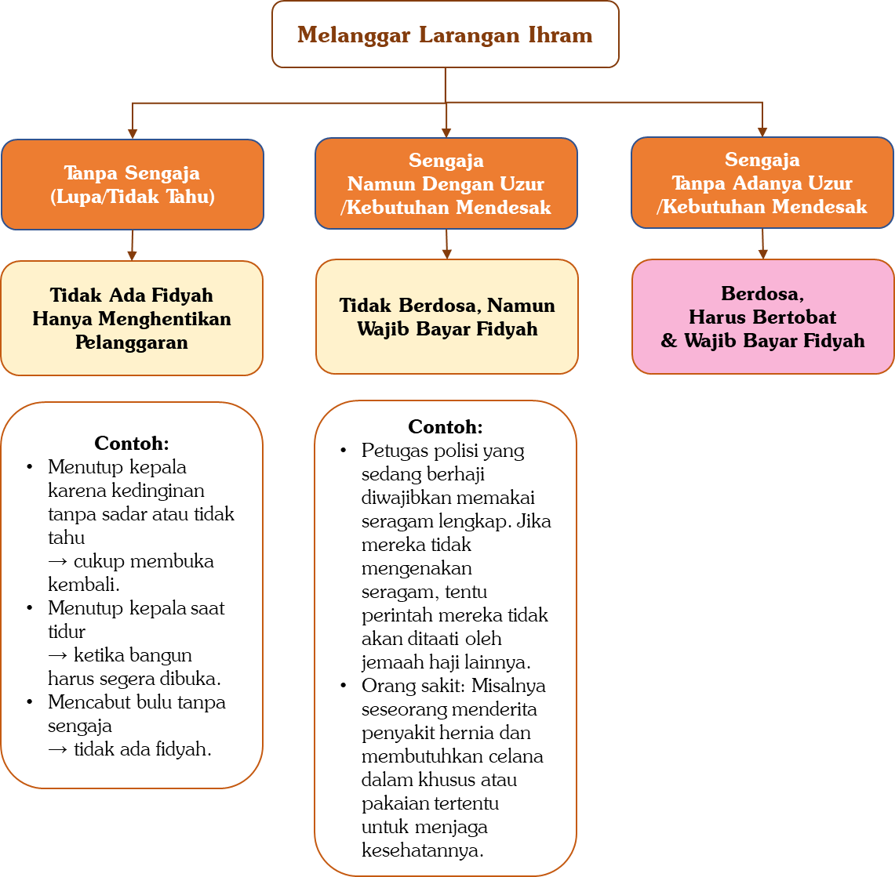

Pembagian larangan ihram berdasarkan hukum fidyah:

1. Pelanggaran tanpa fidyah, tetapi tetap wajib bertobat kepada Allah ﷻ:

- Melamar, menikah, dan menikahkan, serta mencumbui istri dengan perkataan atau pandangan tanpa ada sentuhan.

1. Fidyah dengan seekor unta:

- Jimak (hubungan intim) sebelum tahalul awal.

1. Fidyah minimal dengan menyembelih kambing:

- Jimak setelah tahalul awal tetapi sebelum tahalul tsani.

1. Fidyah berburu hewan darat buruan: sesuai rincian yang telah dijelaskan sebelumnya.

1. Fidyah alternatif (memilih salah satu dari tiga):

- Berpuasa tiga hari – tidak harus berturut-turut, boleh dilakukan sebelum atau sesudah haji di mana pun.

- Memberi makan enam orang miskin – masing-masing diberi ½ shâ’ (±1,3 kg beras). Pemberian tidak harus di Tanah Haram, bisa dilakukan di lokasi dia melanggar.

- Menyembelih seekor kambing – bisa jantan atau betina, kambing Jawa atau domba, dan tidak harus disembelih di Tanah Haram. Jika pelanggaran terjadi sebelum sampai Tanah Haram, fidyah boleh dibayarkan di tempat pelanggaran, sebagaimana kasus Ka’ab bin Ujrah: tatkala melanggar dia belum sampai ke Tanah Haram, dan Nabi ﷺ menyuruhnya membayar fidyah.

Karena kambing ini adalah fidyah pelanggaran, dagingnya tidak boleh dimakan sendiri, melainkan harus diberikan kepada fakir miskin, baik di Tanah Haram maupun di tempat pelanggaran dilakukan.

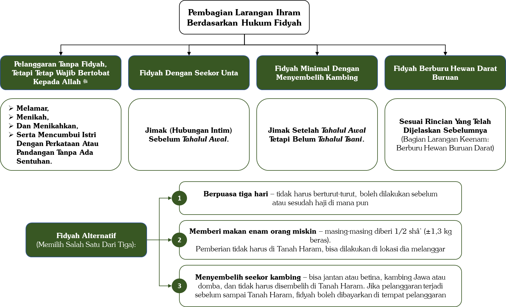

Pembagian larangan ihram berdasarkan jenis kelamin:

---

## Pertama: Larangan khusus laki-laki

- Memakai pakaian yang dijahit.

- Memakai tutup kepala.

---

## Kedua: Larangan khusus wanita

- Memakai cadar.

- Memakai kaus tangan.

---

## Ketiga: Larangan untuk laki-laki dan wanita

- Memakai minyak wangi.

- Memotong kuku.

- Mencukur rambut atau bulu badan.

- Bercumbu sebelum tahalul tsani dengan cumbuan yang disertai sentuhan, baik sampai mengeluarkan mani atau tidak, selama tidak sampai melakukan jimak.

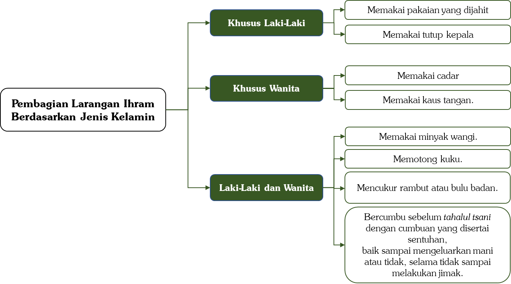


# 2.1.1.3 — Sunah

---

## Pertama: Mandi sebelum ihram

Ibnu Umar berkata,

```arabic
مِنَ السُّنَّةِ أَنْ يَغْتَسِلَ الرَّجُلُ إِذَا أَرَادَ أَنْ يُحْرِمَ
```

“Termasuk sunah adalah seseorang mandi jika hendak berihram.”[^10]

Demikian pula, Nabi ﷺ memerintahkan Asma’ binti Umais yang sedang nifas untuk mandi sebelum ihram,[^11] padahal wanita nifas tetap tidak suci meski telah mandi. Maka begitu pula orang yang suci lebih utama untuk mandi sebelum ihram, karena mandinya bermanfaat untuk meningkatkan kesucian dan kenyamanan dalam beribadah.

Catatan:

- Sunahnya: mandi dilakukan di Mikat. Namun, mengingat kepadatan jemaah haji yang sangat tinggi, para ulama membolehkan mandi di rumah atau hotel menjelang keberangkatan. Bagi yang ihramnya dimulai di pesawat, jika tidak memungkinkan mandi di dalam pesawat, maka diperbolehkan mandi sebelum naik pesawat.[^12]

- Mencukur bulu kemaluan, memotong kuku, mencabut bulu ketiak, dan membersihkan bagian tubuh lainnya bukan termasuk sunah ihram secara khusus. Jika memang diperlukan demi kebersihan, maka boleh untuk dilakukan. Namun jika tidak perlu, maka hal-hal tersebut tidak dikategorikan sebagai sunah sebelum ihram. Yang menjadi sunah sebelum ihram adalah mandi.

Ibnu Taimiyyah berkata,

```arabic
وَإِنِ احْتَاجَ إلَى التَّنْظِيفِ: كَتَقْلِيمِ الَاظْفَارِ وَنَتْفِ الْإِبِطِ وَحَلْقِ الْعَانَةِ وَنَحْوِ ذَلِكَ فَعَلَ ذَلِكَ. وَهَذَا لَيْسَ مِنْ خَصَائِصِ الْإِحْرَامِ
```

“Jika ia perlu untuk bersih-bersih seperti memotong kuku, mencabut bulu ketiak, mencukur bulu kemaluan dan yang semisalnya, maka silakan ia melakukannya. Hal ini bukan perkara-perkara khusus yang berkaitan dengan ihram.”[^13]

---

## Kedua: Memakai minyak wangi di badan sebelum berihram

Ummul Mukminin, Aisyah radhiyallâhu ‘anha berkata,

```arabic
كُنْتُ أُطَيِّبُ رَسُولَ اللَّهِ ﷺ لِإِحْرَامِهِ حِينَ يُحْرِمُ، وَلِحِلِّهِ قَبْلَ أَنْ يَطُوفَ بِالْبَيْتِ
```

“Aku pernah memakaikan minyak wangi kepada Rasulullah tatkala beliau hendak berihram, aku juga memakaikan minyak wangi setelah Nabi bertahalul (yaitu tahalul awal setelah beliau melempar jamrah dan mencukur rambut-pen) sebelum beliau bertawaf di Ka’bah.”[^14]

Di sini jelas bahwa 'Aisyah radhiyallâhu ‘anhâ pernah mengenakan minyak wangi pada tubuh Nabi ﷺ sebelum beliau berihram.

‘Aisyah radhiyallâhu ‘anha juga berkata,

```arabic
كَأَنِّيْ أَنْظُرُ إِلَى وَبِيْصَ الْمِسْكِ فِيْ مَفْرَقِ رَسُوْلِ اللهِ وَهُوَ مُحْرِمٌ
```

“Seakan-akan aku melihat ada kilatan bekas minyak rambut di bagian belahan rambut kepala Nabi ﷺ tatkala beliau sedang ihram.”[^15]

‘Aisyah radhiyallâhu ‘anha juga berkata,

```arabic
كُنَّا نَخْرُجُ مَعَ النَّبِيِّ ﷺ إِلَى مَكَّةَ، فنُضَمِّدُ جِبَاهَنَا بِالسُّكِّ الْمُطَيَّبِ عِنْدَ الْإِحْرَامِ، فَإِذَا عَرِقَتْ إِحْدَانَا؛ سَالَ عَلَى وَجْهِهَا، فَيَرَاهُ النَّبِيُّ ﷺ؛ فَلَا يَنْهَانَا
```

“Kami keluar bersama Nabi Muhammad ﷺ ke Makkah, maka kami pun mengoles dahi kami dengan as-Sukk (sejenis minyak wangi) tatkala hendak ihram. Maka jika salah seorang dari kami (para istri Nabi) berkeringat maka minyak wangi tersebut mengalir ke wajahnya. Lalu Nabi ﷺ melihatnya namun beliau tidak melarang kami.”[^16]

Ibnu Hajar berkata, “Sangat jelas sekali bahwasanya zat minyak wangi tersebut masih tersisa.”[^17]

---

## Ketiga: Berihram setelah salat

Ada dua pendapat ulama dalam hal ini:

Pendapat pertama, disunahkan melaksanakan salat sunah dua rakaat sebelum berihram. Ini adalah pendapat keempat mazhab, bahkan an-Nawawi menyatakan bahwa hal ini merupakan ijmak ulama.[^18]

Dan pendapat kedua, Disunahkan memulai berihram setelah salat fardu. Jika waktu berihram tidak bertepatan dengan selesai salat fardu, maka tidak disunahkan melakukan salat khusus dua rakaat sebelum berihram. Memang benar bahwa Nabi ﷺ berihram setelah salat, namun salat tersebut adalah salat fardu, bukan salat khusus ihram.[^19] Pendapat ini merupakan salah satu riwayat al-Imam Ahmad.[^20]

Sebagian ulama berpendapat, jika seseorang berihram setelah salat fardu, itu yang terbaik. Namun jika waktunya tidak pas dengan selesai salat fardu, maka disunahkan melaksanakan salat sunah yang lain, misalnya salat sunah wudu, atau ketika berada di masjid Mikat melakukan salat tahiat masjid sebelum berihram. [^21]

---

## Keempat: Talbiah

Di antara yang disunahkan juga adalah ber-ihlâl (bertalbiah) saat di atas tunggangan atau kendaraan. Setelah berada di atas tunggangan—baik unta, kuda, atau kendaraan modern—seseorang disunahkan memulai talbiah dengan menyebutkan tujuan nusuknya. Misalnya berkata,

```arabic
لَبَّيْكَ عُمْرَةً
```

Atau,

```arabic
اللَّهُمَّ لَبَّيْكَ عُمْرَةً
```

“Ya Allah aku memenuhi panggilanmu untuk menjalankan umrah.”

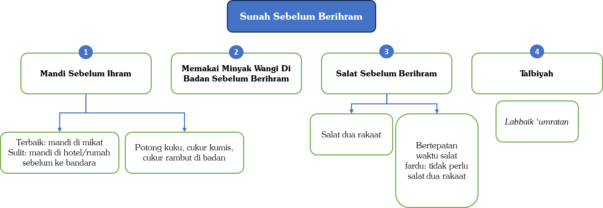

# 2.1.1.4 — Niat

Dengan melafalkan,

```arabic
لَبَّيْكَ عُمْرَةً
```

“Aku memenuhi panggilanmu untuk menjalankan umrah.”

Atau,

```arabic
اللَّهُمَّ لَبَّيْكَ عُمْرَةً
```

“Ya Allah aku memenuhi panggilanmu untuk menjalankan umrah.”

# 2.1.1.5 — Kesalahan-kesalahan

Di antara kesalahan-kesalahan yang sering terjadi:

1. Banyak jemaah beranggapan bahwa semua barang yang berjahit tidak boleh dipakai. Akibatnya, sebagian dari mereka enggan mengenakan sandal, ikat pinggang, atau tas yang berjahit. Padahal yang dilarang hanyalah pakaian yang dijahit membentuk belahan atau menonjolkan bagian-bagian badan.

1. Menganggap bahwa wanita haid tidak boleh berihram, sehingga mereka boleh melewati Mikat tanpa berihram dan menunda ihram sampai suci di Makkah.

1. Sebagian wanita meyakini bahwa mereka harus memakai pakaian atau warna khusus untuk ihram. Padahal, wanita bebas mengenakan pakaian apa saja yang syar’i selama menutupi auratnya.

1. Lelaki yang berihram harus selalu dalam kondisi idthibâ’ (bahu kanan terbuka). Padahal, membuka bahu kanan hanya disyariatkan saat tawaf qudum, bukan sepanjang waktu berihram.

1. Sebagian orang meyakini bahwa mandi atau berwudu sebelum berihram hukumnya wajib. Padahal mandi dan berwudu sebelum berihram hanya sunah, bukan wajib.

1. Sebagian orang beranggapan bahwa selama perjalanan dari Madinah menuju Makkah dalam keadaan ihram, mereka harus selalu dalam kondisi suci, dan jika batal, harus segera berwudu kembali. Padahal menjaga wudu hukumnya sunah, bukan wajib.

1. Sebagian orang beranggapan bahwa kain ihram tidak boleh diganti. Padahal tidak mengapa mengganti kain ihram dengan kain ihram yang lain. Demikian juga bagi wanita, mereka boleh mengganti bajunya meski sedang dalam kondisi ihram.

1. Sebagian wanita meyakini bahwa jilbab tidak boleh dilepas karena rambutnya akan terlihat oleh wanita lain. Padahal tidak mengapa melepas jilbab selama rambutnya tidak terlihat oleh lelaki ajnabi (yang bukan mahramnya).

1. Sebagian orang beranggapan bahwa begitu tiba di Makkah harus segera melaksanakan umrah, meskipun malam hari. Padahal jika lelah atau ada halangan lain, seseorang boleh menunda umrahnya sampai keesokan harinya, namun aturan dan larangan ihram tetap berlaku sampai dia menyelesaikan umrah.

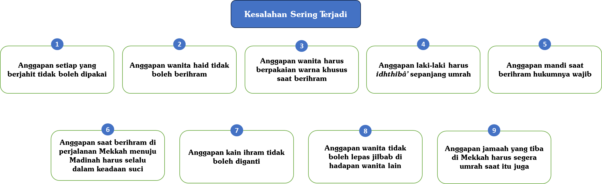

# 2.1.2.1 — Penjelasan

Mikat adalah tempat atau waktu yang telah ditetapkan oleh syariat Islam sebagai batas untuk memulai suatu ibadah. Dalam hal ini adalah yang berkaitan dengan pelaksanaan haji dan umrah. Mikat terbagi menjadi dua: (1) mikat makani, dan (2) mikat zamani.

---

## Pertama: Mikat makani

Mikat Makani adalah tempat-tempat tertentu yang telah ditentukan syariat untuk memulai ihram. Setiap orang yang hendak menunaikan haji atau umrah dilarang melewati Mikat Makani sebelum melakukan ihram.

Ibnu Abbas radhiyallâhu ‘anhu berkata,

```arabic
إِنَّ النَّبِيَّ ﷺ وَقَّتَ لَاهْلِ الْمَدِينَةِ ذَا الْحُلَيْفَةِ، وَلَاهْلِ الشَّامِ الجُحْفَةَ، وَلَاهْلِ نَجْدٍ قَرْنَ الْمَنَازِلِ، وَلَاهْلِ الْيَمَنِ يَلَمْلَمَ، هُنَّ لَهُنَّ، وَلِمَنْ أَتَى عَلَيْهِنَّ مِنْ غَيْرِهِنَّ مِمَّنْ أَرَادَ الْحَجَّ وَالْعُمْرَةَ، وَمَنْ كَانَ دُونَ ذَلِكَ، فَمِنْ حَيْثُ أَنْشَأَ حَتَّى أَهْلُ مَكَّةَ مِنْ مَكَّةَ
```

“Sesungguhnya Rasulullah telah menetapkan mikat bagi penduduk Madinah adalah Dzul Hulaifah, dan bagi penduduk Syam adalah al-Juhfah, dan bagi penduduk Najd adalah Qarnul Manâzil, bagi penduduk Yaman adalah Yalamlam. Lalu beliau berkata, ‘Semua mikat-mikat ini diperuntukkan bagi penduduknya dan orang-orang yang melaluinya yang hendak melaksanakan haji atau umrah. Dan siapa yang tinggal di bawah mikat-mikat tersebut (yaitu lokasi antara Makkah dan mikat-mikat tersebut) maka mereka boleh berihram dari tempat mereka, seperti penduduk Makkah yang berihram dari Kota Makkah.”[^22]

Jika kita melihat posisi kota Makkah sebagaimana gambar di bawah ini, maka terdapat titik-titik Mikat yang mengitari kota Makkah.

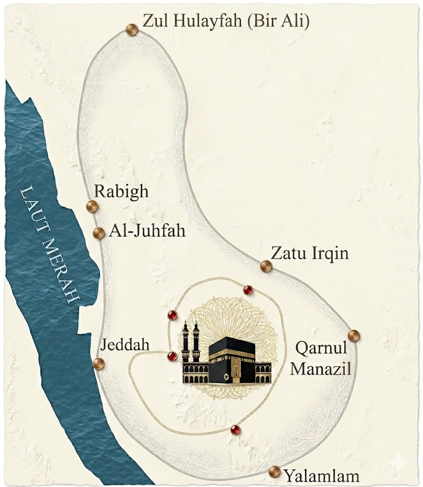

---

## Kedua: Mikat zamani

Mikat Zamani adalah batas waktu yang ditetapkan untuk melakukan ibadah haji atau umrah.

---

## Pertama: Mikat zamani untuk haji:

- Bulan-bulan haji, yaitu: Syawal, Zulkaidah, dan sepuluh hari pertama di bulan Zulhijah.

- Batas terakhir untuk memulai ihram haji adalah sebelum subuh tanggal 10 Zulhijah.

---

## Pertama: Mikat zamani untuk umrah:

- Berlaku selama sepanjang tahun, karena umrah bisa dilakukan kapan saja.

# 2.1.2.2 — Mikat-mikat

Mikat-Mikat

---

## Pertama: Dzulhulaifah

Dzulhulaifah terletak di sebelah utara kota Makkah dan merupakan Mikat yang paling jauh. Tempat ini lebih dikenal dengan nama Bir ‘Ali, yang berada di kota Madinah. Jarak antara Makkah dan Bir ‘Ali adalah sekitar 450 Km. Dzulhulaifah atau Bir ‘Ali menjadi Mikat bagi penduduk Madinah yang hendak menunaikan haji atau umrah.

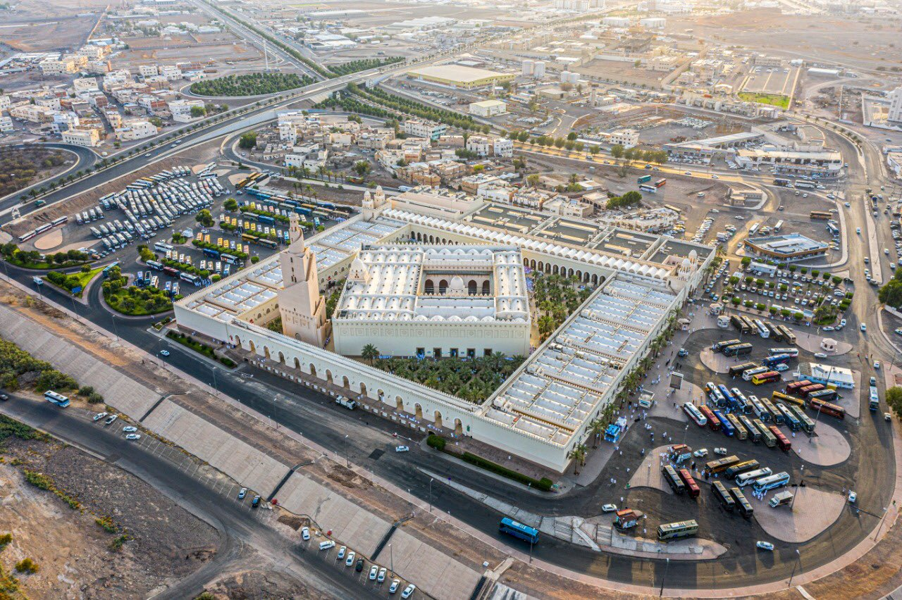(Masjid Mikat Dzulhulaifah. Sumber: haj.gov.sa)

---

## Kedua: Al-juhfah

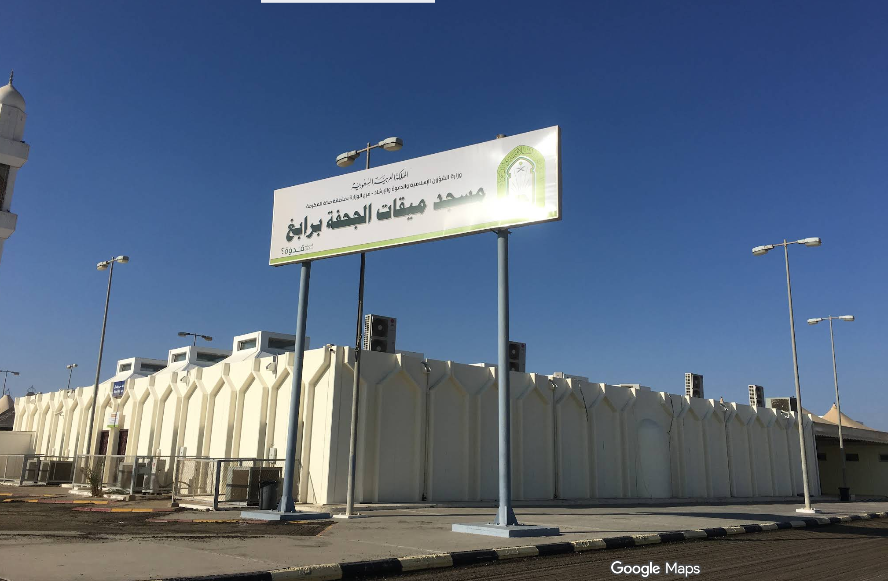

Al-Juhfah adalah Mikat bagi penduduk Syam, Mesir, dan Maroko. Jaraknya ke kota Makkah kurang lebih 157 Km.

Namun saat ini, banyak orang mengambil Mikat dari Rabigh, yang posisinya sedikit sebelum al-Juhfah. Para ulama sepakat bahwa siapa pun yang berihram sebelum Mikat, ihramnya tetap sah, karena al-Juhfah kini merupakan lokasi yang rusak dan tidak dihuni.

Dahulu, kota Madinah pernah dilanda wabah demam. Nabi ﷺ berdoa kepada Allah ﷻ agar wabah itu dipindahkan ke al-Juhfah. Beliau berdoa,

```arabic
((اللَّهُمَّ حَبِّبْ إِلَيْنَا الْمَدِينَةَ كَحُبِّنَا مَكَّةَ أَوْ أَشَدَّ، اَللَّهُمَّ بَارِكْ لَنَا فِي صَاعِنَا وَفِي مُدِّنَا، وَصَحِّحْهَا لَنَا، وَانْقُلْ حُمَّاهَا إِلَى الْجُحْفَةِ))
```

“Ya Allah, jadikanlah kami cinta kepada kota Madinah sebagaimana cinta kami kepada kota Makkah atau lebih dari itu. Ya Allah berkahilah sha’ dan mudd kami (yaitu alat-alat takaran di kota Madinah-pen). Jadikanlah kota Madinah tempat yang sehat bagi kami, dan pindahkanlah demamnya ke al-Juhfah.”[^23]

Akhirnya, al-Juhfah sejak saat itu tidak lagi menjadi tempat hunian, bahkan al-Imam An-Nawawi berkata,

```arabic
فَإِنَّ الْجُحْفَةَ مِنْ يَوْمِئِذٍ مُجْتَنَبَةٌ وَلَا يَشْرَبُ أَحَدٌ مِنْ مَائِهَا إِلَّا حُمَّ
```

“Sesungguhnya al-Juhfah sejak saat itu dijauhi, dan tidak seorang pun yang minum dari airnya kecuali ia demam.”[^24]

---

## Ketiga: Yalamlam

Di sebelah selatan kota Makkah ada Mikat Yalamlam. Yalamlam adalah Mikat bagi penduduk negeri Yaman. Jarak Yalamlam ke kota Makkah sekitar 130 Km.

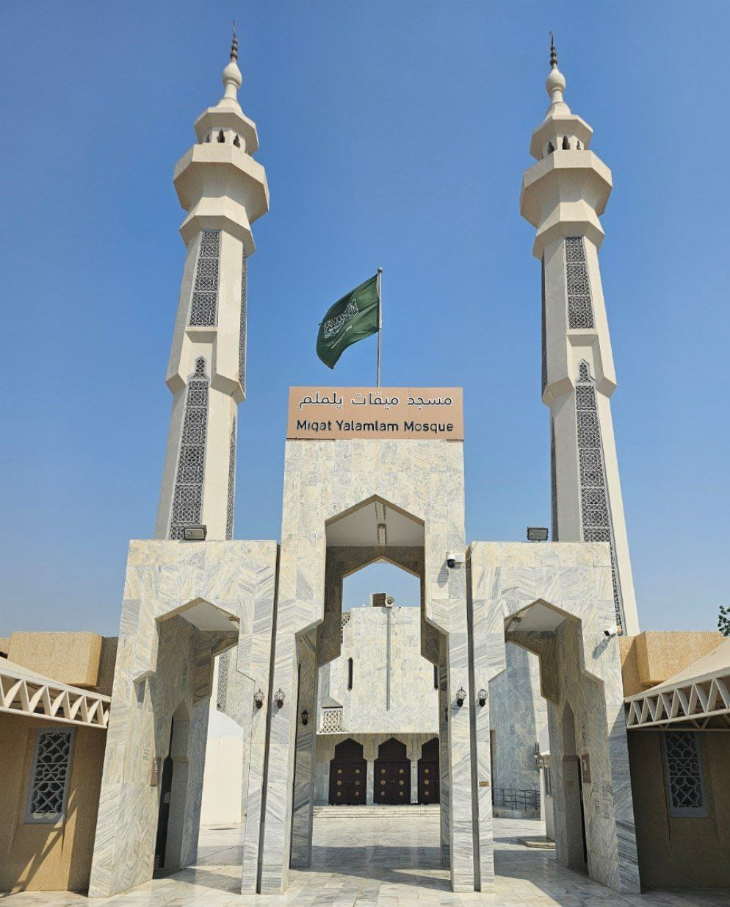

---

## Keempat: Qarn al-manâzil (as-sail al-kabîr)

Qarn al-Manazil terletak timur kota Makkah. Qarn al-Manazil adalah Mikat bagi penduduk Najed. Jarak antara Qarn al-Manazil dengan kota Makkah sekitar 80-90 Km. Mikat ini termasuk yang terdekat, dengan jarak sekitar 2 marhalah (±80 Km) dari Makkah.


---

## Kelima: Dzatu ‘irq

Dzatu ‘Irq adalah mikat bagi penduduk Iraq. Para ulama berselisih pendapat mengenai status mikat Dzatu ‘Irq: apakah ditetapkan langsung oleh Nabi ﷺ atau merupakan ijtihad Umar bin Khattab radhiyallāhu ta‘ālā ‘anhu.

Pada masa Umar, penduduk Irak ingin menunaikan haji atau umrah. Jika mereka harus pergi ke Qarn al-Manazil, maka jaraknya terlalu jauh. Lalu Umar menetapkan Dzatu ‘Irq sebagai mikat bagi mereka, yang kira-kira sama dengan Qarn al-Manazil.

Dalam sebagian riwayat disebutkan bahwa Nabi ﷺ yang sebenarnya menentukan Dzatu ‘Irq. Sebagian ulama berpendapat bahwa Nabi ﷺ telah menetapkannya, tetapi Umar tidak mengetahuinya. Ketika penduduk Irak datang dan ingin berihram dari tempat selain Qarn al-Manazil (karena jaraknya terlalu jauh), Umar pun menetapkan Dzatu ‘Irq bagi mereka. Ternyata, ijtihad Umar ini sesuai dengan hadis Nabi ﷺ.

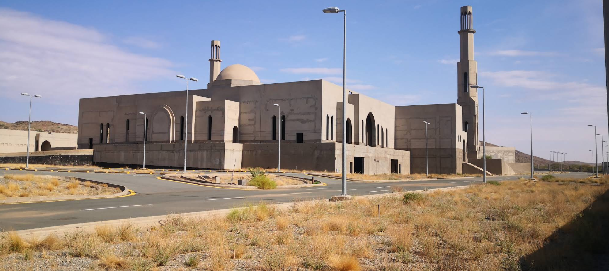

# 2.1.2.3 — Jeddah Bukan Mikat bagi Jemaah Haji/umrah Indonesia

Pembahasan “Apakah Bandara Jeddah termasuk atau bukan?” menjadi topik yang sangat urgen bagi para jemaah haji dan umrah Indonesia. Karena jika ternyata Jeddah bukanlah, maka melakukan ihram di sana berarti meninggalkan kewajiban berihram dari yang seharusnya. Haji atau umrah mereka tetap sah, namun sebagai konsekuensinya, mereka diwajibkan membayar dam karena telah meninggalkan kewajiban ini.

Kalau diperhatikan, Nabi ﷺ mengatakan,

```arabic
((هُنَّ لَهُنَّ وَلِمَنْ أَتَى عَلَيْهِنَّ مِنْ غَيْرِهِنَّ، مِمَّنْ أَرَادَ الْحَجَّ وَالْعُمْرَةَ))
```

“Tempat-tempat itu (mikat-mikat tersebut) adalah untuk penduduknya dan juga untuk siapa saja yang melewatinya dari selain mereka, yaitu bagi orang yang hendak menunaikan haji dan umrah.”

Hadis tersebut menunjukkan bahwa mikat-mikat ini meliputi seluruh sisi Makkah; baik arah utara, timur, selatan maupun barat. Sehingga Nabi ﷺ menyatakan, “Dan demikian pula bagi orang-orang yang melewati Mikat-Mikat tersebut dari selain penghuni negeri-negeri tersebut”.

Barang siapa yang hendak memasuki kota Makkah, maka dia pasti akan melewati salah satu mikat atau yang sejajar dengannya:

- Jika datang dari arah utara Makkah, pasti bertemu atau sejajar dengan Madinah.

- Jika datang dari arah timur, pasti bertemu atau sejajar dengan Qarn al-Manazil.

- Jika datang dari arah selatan, maka akan bertemu atau sejajar dengan Yalamlam.

- Jika datang dari arah barat laut, maka akan sejajar dengan al-Juhfah.

- Jika datang dari arah barat daya, maka akan sejajar dengan Yalamlam.

Namun, bagi mereka yang datang tepat dari arah barat—baik melalui laut maupun udara—menuju Jeddah, maka muncul perbedaan pendapat di kalangan ulama: apakah orang ini memungkinkan untuk sejajar dengan mikat terdekat (muhâdzâh), ataukah hal itu tidak mungkin? Dalam hal ini, ada dua pendapat yang dikemukakan para ulama:

Pendapat Pertama: Orang tersebut tidak memungkinkan untuk melakukan muhâdzâh.

Pendapat ini dikemukakan oleh Ibnu Hajar al-Haitami. al-Imam An-Nawawi rahimahullâh berkata,

```arabic
وَإِنْ لَمْ يُحَاذِ أَحْرَمَ عَلَى مَرْحَلَتَيْنِ مِنْ مَكَّةَ
```

“Jika ia tidak sejajar dengan mikat mana pun maka ia berihram dari jarak 2 marhalah dari Makkah.”[^25]

Ibnu Hajar al-Haitami mengomentari perkataan an-Nawawi tersebut. Beliau berkata,

```arabic
لَانَّهُ لَا مِيقَاتَ دُونَهُمَا... أَنَّ الْإِحْرَامَ مِنْ الْمَرْحَلَتَيْنِ هُنَا بَدَلٌ عَنْ أَقْرَبِ مِيقَاتٍ إلَى مَكَّةَ وَأَقْرَبُ مِيقَاتٍ إِلَيْهَا عَلَى مَرْحَلَتَيْنِ مِنْهَا
```

“Karena tidak ada mikat yang jaraknya lebih dekat dari 2 marhalah...sesungguhnya ihram dari jarak 2 marhalah di sini sebagai pengganti dari mikat terdekat ke Makkah, dan jarak mikat terdekat ke Makkah adalah 2 marhalah (yaitu Qarnul Manâzil).”[^26]

Dari sini, Ibnu Hajar al-Haitami menyimpulkan bahwa Jeddah menjadi mikat bagi orang-orang yang datang dari Suakin (suatu kota di Sudan) melalui laut, karena mereka akan sampai di Jeddah sebelum sejajar (muhâdzâh) yang sejajar dengan Rabigh atau Yalamlam. Beliau menegaskan hal ini dengan berkata,

```arabic
يُتَصَوَّرُ بِالْجَائِي مِنَ السَّوَاكِنِ إِلَى جِدَّةَ مِنْ غَيْرِ أَنْ يَمُرَّ بِرَابِغٍ وَلَا بِيَلَمْلَمَ؛ لَانَّهُمَا حِينَئِذٍ أَمَامَهُ، فَيَصِلُ جِدَّةَ قَبْلَ مُحَاذَاتِهِمَا، وَهِيَ عَلَى مَرْحَلَتَيْنِ مِنْ مَكَّةَ، فَتَكُونُ هِيَ مِيقَاتَهُ
```

“Bisa dibayangkan seseorang yang datang dari Suakin (suatu kota pelabuhan di Sudan) menuju Jeddah tanpa melewati Rabigh (al-Juhfah) dan Yalamlam; karena pada saat itu keduanya berada di hadapannya, sehingga ia sampai di Jeddah sebelum sejajar (muhâdzâāt) dengan keduanya. Sementara Jeddah berjarak dua marhalah dari Makkah, maka Jeddah itulah yang menjadi mikat baginya.”[^27]

Pendapat Ibnu Hajar al-Haitami ini juga persis seperti pendapat yang dipilih oleh al-Buhuti dari mazhab Hanbali.[^28]

Pendapat Kedua: Orang tersebut memungkinkan untuk melakukan muhâdzâh.

Pendapat ini dikemukakan oleh Ibnu Abidin al-Hanafi. Menurut beliau, tidak mungkin seseorang sama sekali tidak melewati atau mensejajari satu pun mikat. Karena mikat-mikat yang telah ditetapkan oleh Nabi ﷺ telah mencakup seluruh arah menuju Makkah. Dengan kata lain, siapa pun yang hendak ke Makkah pasti akan melewati mikat atau sejajar dengannya.

Ibnu Abidin menegaskan bahwa dalam kondisi seseorang tidak mengetahui apakah dia mensejajari salah satu mikat, maka: dia diperbolehkan berihram dari jarak sekitar dua marhalah dari Makkah. Meskipun pada hakikatnya orang itu pasti telah melewati atau mensejajari salah satu Mikat.

Beliau berkata,

```arabic
(قَوْلُهُ فَإِنْ لَمْ يَكُنْ إلَخْ) كَذَا فِي الْفَتْحِ لَكِنَّ الَاصْوَبَ قَوْلُ اللُّبَابِ، فَإِنْ لَمْ يَعْلَمْ الْمُحَاذَاةَ لِمَا قَالَ شَارِحُهُ أَنَّهُ لَا يُتَصَوَّرُ عَدَمُ الْمُحَاذَاةِ اهـ أَيْ لَانَّ الْمَوَاقِيتَ تَعُمُّ جِهَاتِ مَكَّةَ كُلِّهَا فَلَا بُدَّ مِنْ مُحَاذَاةِ أَحَدِهَا (قَوْلُهُ فَعَلَى مَرْحَلَتَيْنِ)
```

“Perkataannya, ‘Jika ia tidak bersejajar dengan mikat’—demikian ibarat yang terdapat dalam kitab al-Fath. Namun yang lebih tepat adalah perkataan al-Lubab, ‘Jika ia tidak mengetahui sejajar dengan mikat’ karena pensyarah buku tersebut berkata, ‘Tidaklah mungkin tergambarkan tidak adanya kesejajaran dengan mikat’. Yaitu karena mikat-mikat meliputi seluruh sisi Makkah, maka pasti adanya kesejajaran dengan salah satu dari mikat-mikat tersebut.”[^29]

Pendapat ini juga dipilih oleh Ibnu Hajar al-Asqalani—meskipun beliau bermazhab namun berbeda dengan sebagian ulama Syafi’iyyah. Beliau berkata,

```arabic
وَاسْتُدِلَّ بِهِ عَلَى أَنَّ مَنْ لَيْسَ لَهُ مِيقَاتٌ أَنَّ عَلَيْهِ أَنْ يُحْرِمَ إِذَا حَاذَى مِيقَاتًا مِنْ هَذِهِ الْمَوَاقِيتِ الْخَمْسَةِ وَلَا شَكَّ أَنَّهَا مُحِيطَةٌ بِالْحَرَمِ فَذُو الْحُلَيْفَةِ شَامِيَّةٌ وَيَلَمْلَمُ يَمَانِيَةٌ فَهِيَ مُقَابِلُهَا وَإِنْ كَانَتْ إِحْدَاهُمَا أَقْرَبَ إِلَى مَكَّةَ مِنَ الْأُخْرَى وَقَرْنٌ شَرْقِيَّةٌ وَالْجُحْفَةُ غَرْبِيَّةٌ فَهِيَ مُقَابِلُهَا وَإِنْ كَانَتْ إِحْدَاهُمَا كَذَلِكَ وَذَاتُ عِرْقٍ تُحَاذِي قَرْنًا فَعَلَى هَذَا فَلَا تَخْلُو بُقْعَةٌ مِنْ بِقَاعِ الَارْضِ مِنْ أَنْ تُحَاذِيَ مِيقَاتًا مِنْ هَذِهِ الْمَوَاقِيتِ فَبَطَلَ قَوْلُ مَنْ قَالَ مَنْ لَيْسَ لَهُ مِيقَاتٌ وَلَا يُحَاذِي مِيقَاتًا هَلْ يُحْرِمُ مِنْ مِقْدَارٍ أَبْعَدَ مِنَ الْمَوَاقِيتِ أَوْ أَقْرَبَهَا
```

“Dengan dalil ini disimpulkan bahwa orang yang tidak memiliki mikat tertentu (yang telah ditetapkan baginya), maka ia wajib berihram ketika sejajar (muhâdzât) dengan salah satu dari lima mikat tersebut.

Tidak diragukan bahwa mikat-mikat itu mengelilingi Tanah Haram. Dzul Hulaifah berada di arah Syam, Yalamlam di arah Yaman dan keduanya saling berhadapan meskipun salah satunya lebih dekat ke Makkah daripada yang lain. Qarn berada di arah timur, dan Juhfah di arah barat, keduanya pun saling berhadapan meskipun salah satunya lebih dekat. Sedangkan Dzâtu ‘Irq sejajar dengan Qarn.

Berdasarkan hal ini, tidak ada satu pun tempat di muka bumi melainkan pasti sejajar dengan salah satu dari mikat-mikat tersebut. Dengan demikian gugurlah pendapat yang mengatakan, ‘Orang yang tidak memiliki mikat dan tidak sejajar dengan mikat mana pun, apakah ia berihram dari jarak yang lebih jauh daripada mikat-mikat itu atau dari yang paling dekat?’”[^30]

Beliau juga mengkritik penentuan jarak dua marhalah bagi orang yang tidak sejajar dengan mikat.[^31]

Sementara itu, ulama Malikiyyah dengan tegas menyatakan bahwa Jeddah bukanlah mikat. Asy-Syaikh ad-Dirdir menjelaskan hal ini dengan berkata,

```arabic
(وَلَوْ) كَانَ الْمُحَاذِي (بِبَحْرٍ) كَالْمُسَافِرِ مِنْ جِهَةِ مِصْرَ بِبَحْرِ السُّوَيْسِ؛ فَإِنَّهُ يُحَاذِي الْجُحْفَةَ قَبْلَ وُصُولِهِ جُدَّةَ فَيُحْرِمُ فِي الْبَحْرِ حِينَ الْمُحَاذَاةِ
```

“Meskipun jemaah (haji/umrah) yang bersejajar (dengan mikat) berada di lautan. Seperti orang yang safar dari arah Mesir melalui laut as-Suwais, maka ia akan bersejajar dengan al-Juhfah sebelum sampai ke Jeddah, maka ia berihram di laut tatkala sejajar (dengan al-Juhfah).”[^32]

Perselisihan di atas pada dasarnya berakar pada dua hal:

1. Apakah mungkin seseorang masuk ke Makkah tanpa sejajar dengan salah satu mikat yang telah ditetapkan oleh Nabi ﷺ?

1. Apa pengertian muhâdzâh (sejajar)? Apakah yang dimaksud muhâdzâh adalah seseorang berada tepat di garis lurus antara dua mikat, ataukah yang dimaksud adalah posisi dengan jarak yang sama ke Makkah?

Kedua hal ini sebenarnya saling berkaitan. Bagi mereka yang berpendapat bahwa makna muhâdzâh adalah posisi dengan jarak yang sama ke Mekkah, maka seseorang tidak mungkin masuk Mekkah kecuali telah ber-muhâdzâh dengan salah satu mikat. Dengan kata lain, orang yang masuk Mekkah dari arah barat melalui laut menuju Jeddah, sebelum sampai ke Jeddah, pastilah sudah melewati atau ber-muhâdzâh dengan al-Juhfah atau Yalamlam.

Sementara itu, bagi yang berpendapat bahwa seseorang mungkin masuk Mekkah tanpa ber-muhâdzâh dengan salah satu mikat, argumennya adalah: jika seseorang datang dari barat melalui laut menuju Jeddah, dia akan sampai di Jeddah sebelum ber-muhâdzâh dengan al-Juhfah atau Yalamlam. Agar hal ini bisa terjadi, makna muhâdzâh pun harus dipahami sebagai posisi yang berada di garis lurus antara dua Mikat terdekat—sebagaimana terlihat pada gambar berikut:

Sementara itu, bagi yang berpendapat bahwa seseorang mungkin masuk Mekkah tanpa ber-muhâdzâh dengan salah satu Mikat, argumennya adalah: jika seseorang datang dari barat melalui laut menuju Jeddah, dia akan sampai di Jeddah sebelum ber-muhâdzâh dengan al-Juhfah atau Yalamlam. Agar hal ini bisa terjadi, makna muhâdzâh pun harus dipahami sebagai posisi yang berada di garis lurus antara dua Mikat terdekat—sebagaimana terlihat pada gambar berikut:

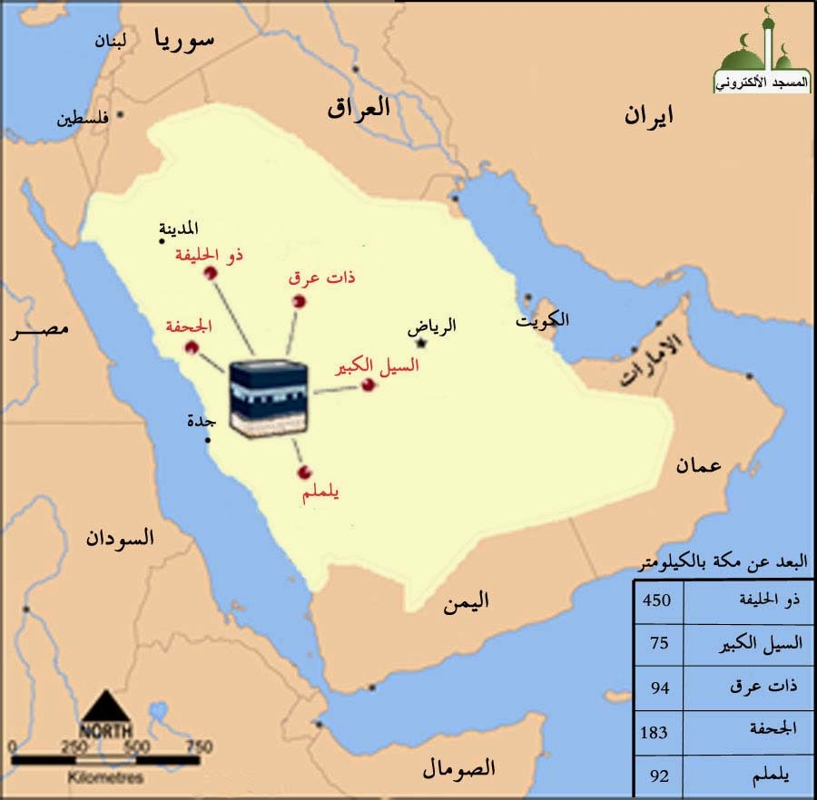

Pendapat terkuat:

Pendapat yang paling kuat adalah pendapat yang menyatakan bahwa Jeddah sama sekali bukanlah mikat, karena letaknya lebih dekat ke Mekkah dibandingkan posisi muhâdzâh al-Juhfah atau Yalamlam. Karena pengertian muhâdzâh (sejajar) adalah posisi dengan jarak yang sama ke Mekkah.

Ibnul al-Manzhur berkata,

```arabic
ذَاتُ عِرْقٍ حَذْوَ قَرْنٍ...وَذَاتُ عِرْقٍ مِيقَاتُ أَهْلِ الْعِرَاقِ، وَقَرْنٌ مِيقَاتُ أَهْلِ نَجْدٍ، وَمَسَافَتُهُمَا مِنَ الْحَرَمِ سَوَاءٌ.
```

“Dzâtu ‘Irq sejajar dengan Qarn (al-Manâzil)...Dzâtu ‘Irq adalah mikatnya penduduk Irak, dan Qarn (al-Manâzil) adalah mikatnya penduduk Nejd. Jarak keduanya dari haram (Makkah) adalah sama.”[^33]

Ibnu Syaas Al-Maaliki (wafat 616 H) berkata,

```arabic
وَمَنْ حَاذَي مِيْقَاتًا فَمِيْقَاتُهُ عِنْدَ الْمُحَاذَاةِ؛ إِذِ الْمَقْصُوْدُ مِقْدَارُ الْبُعْدِ عَنْ مَكَّةَ
```

“Barang siapa yang sejajar dengan mikat maka mikatnya adalah tatkala sejajar, karena maksud dari sejajar adalah ukuran jarak dari Makkah.”[^34]

Mari kita perhatikan kasus Dzatu ‘Irq. Dzatu ‘Irq merupakan yang ditetapkan oleh Umar bin Khathab radhiyallāhu ‘anhu khusus bagi penduduk Irak. Hal ini dilakukan karena penduduk tidak ingin melewati Qarn al-Manazil (As-Sail Al-Kabīr), sehingga Umar menetapkan bagi mereka yang sejajar dengan Qarn Al-Manazil.

Jika kita memahami maksud “sejajar dengan mikat” sebagai menarik garis lurus dari satu titik mikat ke titik mikat lainnya, maka ketika kita tarik garis lurus dari Dzulhulaifah menuju Qarn Al-Manazil, jarak Dzātu ‘Irq menjadi terlalu jauh.

Namun kenyataannya, cara Umar menentukan mikat bukan dengan menarik garis lurus, melainkan dengan mensejajarkan posisi. Artinya, jarak Dzātu ‘Irq ke Makkah mirip dengan jarak Qarn Al-Manazil ke Makkah, yaitu sekitar dua marhalah—sebagaimana dijelaskan oleh Ibnu Mandzuur.

Dengan ini, jika muhâdzâh dipahami sebagai menarik garis lurus antara dua mikat, maka seharusnya posisi Jeddah masih jauh sebelum mencapai kesejajaran dengan mikat. Hal ini semakin menguatkan bahwa Jeddah bukanlah mikat.

Dari sini kita dapat memahami makna pernyataan yang sering dikatakan para ulama secara ijmak, “Barang siapa yang masuk kota Makkah tanpa melewati mikat atau tempat yang sejajar dengan mikat, maka dia cukup berihram dari jarak dua marhalah dari kota Makkah.” Maksud dari pernyataan ini adalah berlaku bagi seseorang yang tidak ber-muhâdzâh dengan satu mikat pun, atau bagi orang yang tidak mengetahui apakah dia telah ber-muhâdzâh atau belum.

Dengan demikian, jika kita membahas penduduk Suakin di Sudan yang masuk ke Makkah melalui laut dan melewati Jeddah, menurut pendapat pertama, mereka diperbolehkan menjadikan Jeddah sebagai Mikat; karena mereka tidak bersejajar dengan mikat mana pun.

Namun menurut pendapat kedua—dan ini yang lebih kuat—para jemaah tetap tidak boleh di Jeddah. Mereka harus melakukan muhâdzâh, yaitu ber-muhâdzâh dengan Yalamlam sekitar 130 dari Makkah, atau dengan al-Juhfah sekitar 157 dari Makkah; dan kedua jarak ini berarti sebelum mereka sampai ke Jeddah, di mana jarak pelabuhannya ke Makkah sekitar 76 dan jarak bandaranya sekitar 97 Pendapat inilah yang menjadi (ketetapan) -Majma’ al-Fiqhi al-Islami pada tahun 1. H.

| Nama Tempat | Jaraknya ke Makkah |
| --- | --- |
| Pelabuhan Jeddah | 76 Km |
| Bandara King Abdul Aziz Jeddah | 97 Km |
| Dzulhulaifah (Bir Ali) | 480 Km |
| Al-Juhfah | 157 Km |
| Qarn al-Manaazil (as-Sail al-Kabiir) | 79 Km |
| Dzaatu ‘Irq | 100 Km |
| Yalamlam | 130 Km |

Peringatan:

Pembahasan para ulama dari berbagai mazhab—al-Hanafiyah, as-Syafi’iyah, dan al-Hanabilah—adalah orang yang tidak melewati mikat dan sama sekali tidak sejajar dengan mikat. Dalam kondisi ini, seseorang diperbolehkan berihram dari jarak sekitar dua marhalah (±80 Km) dari Makkah.

Adapun orang yang melewati mikat atau berada sejajar dengan mikat, maka kasus ini berada di luar pembahasan mereka. Para ulama sepakat bahwa siapa pun yang melewati mikat atau sejajar dengannya harus berihram dari tempat tersebut.

Dengan demikian, para ulama tidak menjadikan Jeddah sebagai bagi jemaah haji atau umrah dari arah mana pun. Akan tetapi, hanya membatasi bagi mereka yang datang dari arah barat Makkah, yaitu dari kota Suakin di Sudan.

Oleh karena itu, sebagian ulama kontemporer secara tegas membolehkan Jeddah sebagai mikat khusus bagi orang-orang yang datang dari arah Suakin (yaitu dari arah barat), karena mereka tidak sejajar dengan mikat Yalamlam maupun al-Juhfah. Namun, bagi mereka yang datang dari Sudan tetapi melalui arah selatan atau utara Jeddah, maka harus berihram sebelum mencapai Jeddah, sebagaimana ditegaskan oleh Syekh Bin Baz[^35] dan Syekh al-‘Utsaimin.[^36]

Bagi masyarakat Indonesia, jemaah biasanya memasuki Makkah melalui Yalamlam. Jika mereka terlebih dahulu singgah ke Madinah, maka pastilah melewati Dzulhulaifah. Dengan demikian, tidak diperbolehkan bagi jemaah haji dari Indonesia menunda ihram hingga tiba di Bandara King Abdul Aziz di Jeddah.

Perlu diingat, pendapat ini dibangun di atas gambaran bahwa penduduk Suakin tidak akan sejajar dengan Mikat, sehingga mereka akan sampai ke Jeddah sebelum bersejajar dengan Yalamlam atau al-Juhfah. Namun, sebagaimana telah dibahas sebelumnya, pendapat yang benar menyatakan bahwa penduduk Suakin pun harus berihram sebelum sampai di Jeddah, karena jarak Jeddah–Makkah lebih dekat dibanding jarak Yalamlam–Makkah maupun al-Juhfah–Makkah. Ketentuan ini telah ditegaskan oleh Al-Majma’ al-Fiqhi al-Islami.

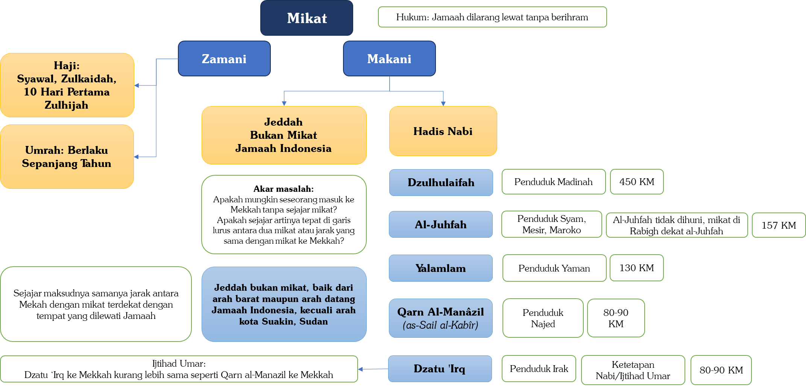

Kesimpulan:

Ketahuilah bahwa para haji atau umrah Indonesia yang mendarat di Bandara King Abdul Aziz Jeddah masuk ke Makkah dari arah selatan atau timur kota Makkah. Artinya, mereka pasti akan melewati Yalamlam, Qarn al-Manazil, atau yang sejajar dengan keduanya. Oleh karena itu, tidak diperbolehkan menunda ihram hingga tiba di Jeddah, melainkan harus berihram di atas pesawat menjelang mendarat.

Dari sini, dapat dipahami bahwa sebagian jemaah yang di Jeddah adalah keliru dan bertentangan dengan pendapat para ulama mazhab, termasuk ulama Syafi’iyah. Pernyataan Ibnu Hajar al-Haitami sebelumnya, yang menyebut Jeddah sebagai Mikat, sebenarnya khusus untuk mereka yang tidak melewati mikat.

Maka, menjadikan perkataan Ibnu Hajar al-Haitami sebagai dalil untuk menetapkan Jeddah sebagai bagi jemaah haji atau umrah Indonesia adalah kesalahan, karena jemaahIndonesia pasti melewati mikat, yaitu Yalamlam atau Qarn al-Manazil atau yang sejajar dengannya. Wallāhu Ta'āla A'lam bish Shawab

Peringatan:

Peringatan pertama: Jemaah yang berihram di pesawat hendaknya sudah mengambil persiapan dengan memakai kain ihram tatkala menjelang sampai ke zona mikat. Dan dia baru berniat ihram setelah pemberitahuan dari pihak pesawat bahwa pesawat sudah berada di zona

Namun, jika kawatir tertidur sehingga mikat terlewatkan; atau tidak ada yang memberitahu kapan pesawat berada di zona Mikat; atau menurut persangkaannya pemberitahuan bisa jadi terlambat—maka dia boleh berniat ihram sebelum ikat sebagai bentuk kehati-hatian.[^37]

Hukum asal berihram sebelum mikat adalah makruh. Seharusnya, seseorang mulai berihram tepat di titik mikat. Misalnya, penduduk Madinah jika ingin berihram maka hendaknya mengambil ihram di Dzul Hulaifah (Bir ‘Ali), bukan di masjid Nabawi atau hotel, karena hotel atau masjid Nabawi letaknya jauh sebelum mikat.

Tetapi, jika melihat kondisi pesawat yang terbang dengan kecepatan tinggi, maka jemaah boleh berihram sebelum meskipun jaraknya tinggal 10 atau 30 menit lagi. Meskipun hukum asalnya adalah makruh, namun kaidah fikih menyatakan bahwa jika berada dalam kondisi kebutuhan (hâjah) maka makruhnya menjadi hilang, karena kaidah menyebutkan,

```arabic
الْحَاجَةُ تُنَزَّلُ مَنِزْلَةَ الضَّرُوْرَةِ
```

“Kebutuhan terkadang menempati posisi darurat.”

Di samping itu, para ulama juga telah sepakat bahwa berihram sebelum mikat hukumnya sah. Ibnul Munzir berkata,

```arabic
وَأَجْمَعُوا عَلَى أَنَّ مَنْ أَحْرَمَ قَبْلَ الْمِيْقَاتِ أَنَّهُ مُحْرِمٌ
```

“Para ulama telah ijmak (sepakat) bahwasanya barang siapa yang berihram sebelum mikat maka ia telah sah berihram.”[^38]

Peringatan kedua: Jika ternyata dia lupa membawa kain ihram di atas pesawat, maka dia harus tetap berihram di atas pesawat sebelum pesawat mendarat di bandara King Abdul Aziz di Jeddah. Dan dia tetap memakai celana, namun tidak boleh memakai songkok (penutup kepala) dan tidak boleh juga mengenakan baju. Nabi ﷺ bersabda,

```arabic
((مَنْ لَمْ يَجِدْ إِزَارًا فَلْيَلْبَسْ سَرَاوِيلَ، وَمَنْ لَمْ يَجِدْ نَعْلَيْنِ فَلْيَلْبَسْ خُفَّيْنِ))
```

“Barang siapa yang tidak mendapati izâr (kain ihram) maka hendaknya ia memakai celana panjang, dan barang siapa yang tidak mendapati dua sandal maka hendaknya ia memakai sepatu.”[^39]

Jika dia memiliki kain yang bisa digunakan sebagai penutup badan, maka wajib baginya untuk membuka bajunya dan menjadikan kain tersebut sebagai kain ihram atasnya. Namun, jika tidak mendapatinya, maka dia tetap memakai baju hingga pesawat mendarat, lalu dia mengganti baju dan celana setelah mendapati kain ihram. Dan dia harus membayar fidyah atas pelanggaran yang dia lakukan—yaitu memakai baju. Fidyah tersebut adalah salah satu dari tiga pilihan: (1) berpuasa selama tiga hari, atau (2) menyembelih seekor kambing, atau (3) memberikan sedekah kepada 6 orang fakir miskin, masing-masing 1/2 zakat fitrah, yaitu sekitar 1,3 kg beras.[^40]

Hal yang sama juga berlaku bagi jemaah yang berihram di atas kereta cepat al-Haramain dari Madinah menuju Makkah. Mereka hendaknya mulai berihram sekitar 6 menit setelah kereta bergerak, agar ihram bisa dilakukan sejajar dengan mikat atau sebelum melewati mikat.

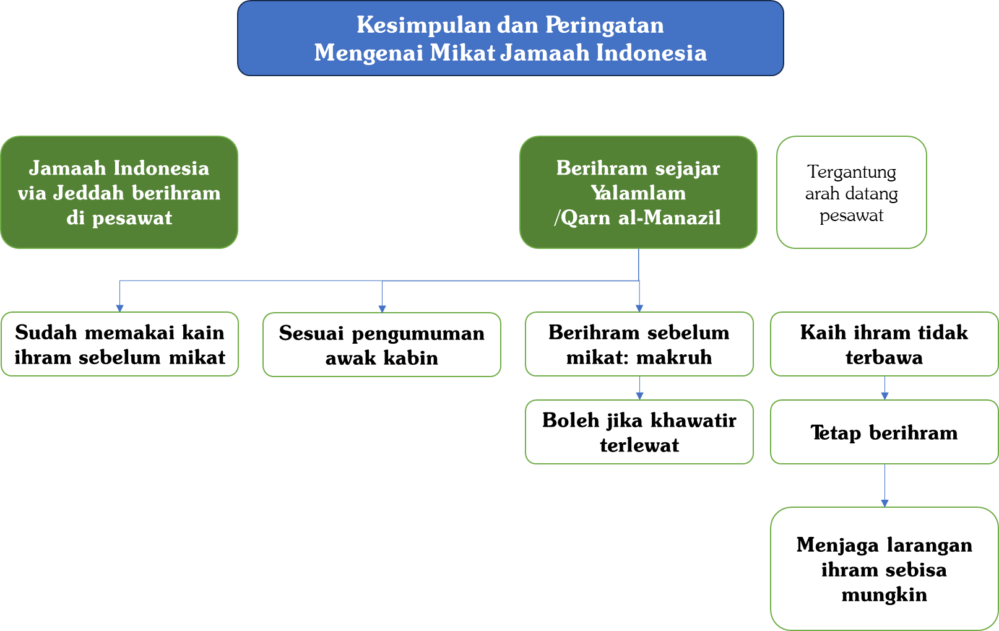

# 2.1.2.4 — Kesalahan-kesalahan

Di antara kesalahan-kesalahan yang sering terjadi berkaitan dengan mikat:

1. Sebagian jemaah haji tidak berihram di atas pesawat tatkala melewati mikat, namun menunda ihram hingga di bandara Jeddah.

1. Sebagian jemaah berihram setelah melewati mikat.

1. Sebagian jemaah berkeyakinan bahwa mandi harus dilakukan di mikat, padahal sebenarnya mandi di mikat hukumnya sunah, bukan wajib. Seseorang tetap diperbolehkan mandi di hotelnya sebelum sampai mikat, terutama di Madinah, di mana jarak dari hotel ke mikat Dzulhulaifah sekitar 15 menit. Hal ini juga mempertimbangkan kenyamanan rombongan, karena jika harus mandi di mikat, biasanya akan memakan waktu lebih lama akibat antrean, sehingga bisa merepotkan anggota rombongan yang harus menunggunya.

# 2.2 — Tawaf

# 2.2.1 — Penjelasan

# 2.2.1.1 — Keutamaan Tawaf

Tawaf adalah ibadah yang sangat mulia. Allah ﷻ berfirman,

```arabic
﴿وَعَهِدۡنَآ إِلَىٰٓ إِبۡرَٰهِـۧمَ وَإِسۡمَٰعِيلَ أَن طَهِّرَا بَيۡتِيَ لِلطَّآئِفِينَ وَٱلۡعَٰكِفِينَ وَٱلرُّكَّعِ ٱلسُّجُودِ﴾
```

“Dan telah Kami perintahkan kepada Ibrahim dan Ismail, ‘Bersihkanlah rumah-Ku untuk orang-orang yang tawaf, yang itikaf, yang rukuk dan yang sujud’.” (QS. Al-Baqarah: 125)

Allah ﷻ juga firmankan,

```arabic
﴿وَطَهِّرۡ بَيۡتِيَ لِلطَّآئِفِينَ وَٱلۡقَآئِمِينَ وَٱلرُّكَّعِ ٱلسُّجُودِ﴾
```

“Dan sucikanlah rumah-Ku ini bagi orang-orang yang tawaf, dan orang-orang yang beribadah dan orang-orang yang rukuk dan sujud.” (QS. Al-Hajj: 26)

Nabi ﷺ bersabda,

```arabic
((مَنْ طَافَ بِهَذَا البَيْتِ أُسْبُوعًا فَأَحْصَاهُ كَانَ كَعِتْقِ رَقَبَةٍ، لَا يَضَعُ قَدَمًا وَلَا يَرْفَعُ أُخْرَى إِلَّا حَطَّ اللَّهُ عَنْهُ خَطِيئَةً وَكَتَبَ لَهُ بِهَا حَسَنَةً))
```

“Barang siapa yang tawaf di Ka’bah ini sebanyak 7 putaran, lalu ia menyempurnakannya maka seperti (pahala) memerdekakan seorang budak. Tidaklah ia meletakkan kakinya dan tidak pula ia mengangkat kaki yang lain kecuali Allah akan menghapuskan satu dosanya dan mencatat baginya satu kebaikan.”[^41]

Dalam riwayat lain ada tambahan,

```arabic
((وَصَلَّى رَكْعَتَيْنِ كَانَ كَعِدْلِ رَقَبَةٍ))
```

“Dan salat dua rakaat maka seperti (pahala) memerdekakan budak.”[^42]

Nabi ﷺ juga sabdakan,

```arabic
((مَا رَفَعَ رَجُلٌ قَدَمًا، وَلَا وَضَعَهَا إِلَّا كُتِبَتْ لَهُ عَشْرُ حَسَنَاتٍ، وَحُطَّ عَنْهُ عَشْرُ سَيِّئَاتٍ، وَرُفِعَ لَهُ عَشْرُ دَرَجَاتٍ))
```

“Tidaklah seseorang mengangkat kakinya dan tidak pula menginjakkan kakinya kecuali dicatat baginya 10 kebaikan, digugurkan atasnya 10 keburukan, dan diangkat baginya 10 derajat.”[^43]

Nabi ﷺ juga bersabda,

```arabic
((إِنَّمَا الطَّوَافُ صَلَاةٌ، فَإِذَا طُفْتُمْ، فَأَقِلُّوا الْكَلَامَ))
```

“Sesungguhnya tawaf adalah salat, maka jika kalian sedang tawaf janganlah banyak berbicara.”[^44]

Nabi ﷺ juga bersabda,

```arabic
((الطَّوَافُ حَوْلَ البَيْتِ مِثْلُ الصَّلَاةِ، إِلَّا أَنَّكُمْ تَتَكَلَّمُونَ فِيهِ، فَمَنْ تَكَلَّمَ فِيهِ فَلَا يَتَكَلَّمَنَّ إِلَّا بِخَيْرٍ)
```

“Tawaf seputar Ka’bah seperti salat, hanya saja kalian boleh berbicara saat itu. Maka barang siapa yang berbicara ketika tawaf maka janganlah ia berbicara kecuali tentang kebaikan.”[^45]

Tawaf adalah ibadah yang hanya dilakukan di Ka’bah. Tidak ada tawaf yang sah dilakukan di tempat lain. Adapun praktik tawaf yang dilakukan sebagian orang—misalnya tawaf di kuburan orang saleh, di sekitar batu tertentu, atau tempat lain—merupakan bidah yang sangat mungkar. Hal ini karena perbuatan tersebut merupakan bentuk menyaingi rumah Allah ﷻ.

Bahkan, jika seseorang melakukan tawaf dalam rangka mendekatkan diri kepada penghuni kubur, maka ini adalah bentuk kesyirikan dan kekufuran kepada Allah ﷻ.

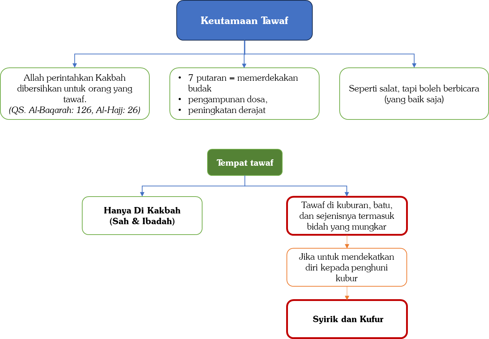

# 2.2.1.2 — Macam-macam Tawaf

---

## Pertama: Tawaf qudum (kedatangan)

Tawaf qudum adalah tawaf yang dikerjakan tatkala seseorang yang haji atau umrah masuk Makkah. Hukum tawaf qudum tersebut berbeda-beda:

- Bagi yang melaksanakan haji kiran dan haji ifrad, disunahkan untuk melakukan tawaf qudum (tawaf kedatangan), bahkan sebagian ulama berpendapat hukumnya wajib. Adapun penduduk Makkah yang melaksanakan haji ifrad atau kiran maka tidak, karena mereka memang telah berada dan menetap di Makkah.

- Bagi yang melaksanakan haji Tamattu’, dia wajib terlebih dahulu menunaikan umrah. Jika saat tiba di Makkah dia telah melakukan tawaf umrah, maka dengan itu gugurlah tawaf qudum baginya. Oleh karena itu, sebagian ulama menyebut tawaf qudum dengan istilah tawaf tahiat (tawaf penghormatan). Hal ini seperti salat tahiat masjid. Jika seseorang masuk masjid lalu langsung melaksanakan salat fardu, maka gugurlah salat tahiat masjid baginya, karena tujuan penghormatan terhadap masjid telah tercapai dengan salat fardu tersebut.

---

## Kedua: Tawaf umrah

Tawaf umrah adalah tawaf yang menjadi rukun dalam ibadah umrah. Tawaf ini wajib dilakukan oleh setiap orang yang melaksanakan umrah, baik umrah yang berdiri sendiri (biasa) maupun umrah dalam rangka haji Tamattu’. Pelaksanaan tawaf umrah ini sekaligus telah mencukupi dan menggugurkan tawaf qudum, sehingga tidak perlu lagi melakukan tawaf qudum.

---

## Ketiga: Tawaf ifadah/haji

Tawaf ini merupakan rukun haji yang harus dilakukan setelah wukuf di Padang Arafah. Tanpa tawaf ifadah, haji seseorang tidak sah.

---

## Keempat: Tawaf wadak

Tawaf Wadak adalah tawaf yang dilakukan ketika seluruh rangkaian haji telah selesai dan hendak meninggalkan kota Makkah. Tawaf ini sebagai bentuk perpisahan dengan Baitullah.

---

## Kelima: Tawaf nazar

Tawaf nazar adalah tawaf yang dilakukan karena adanya nazar kepada Allah ﷻ. Ketika seseorang bernazar untuk melakukan tawaf, maka dia wajib menunaikannya.

---

## Keenam: Tawaf sunah

Tawaf sunah adalah tawaf yang dapat dilakukan kapan saja sebagai bentuk pendekatan diri kepada Allah ﷻ, tanpa terkait dengan haji, umrah, ataupun nazar.

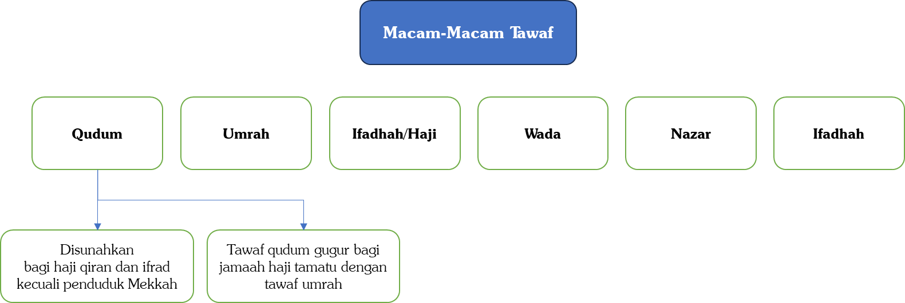

# 2.2.1.3 — Syarat-syarat Tawaf

Syarat-syarat agar ibadah tawaf dihukumi sah adalah:

---

## Pertama: Niat. seseorang yang hendak melakukan tawaf harus menghadirkan niat untuk melaksanakannya. hal ini karena Nabi ﷺ menyebut tawaf sebagai bagian dari salat. dan salat tidak sah tanpa niat berdasarkan kesepakatan para ulama

Dengan demikian, sebagaimana salat membutuhkan niat, maka tawaf pun harus diawali dengan niat di dalam hati sebelum memulainya.

---

## Kedua: Menutup aurat. dahulu, kaum musyrikin melakukan tawaf di ka’bah dalam keadaan telanjang. hal ini terus berlangsung hingga pada tahun ke-9 hijriah, Nabi ﷺ mengutus abu bakar ‘anhu untuk memimpin pelaksanaan haji dan sekaligus mengumumkan kepada seluruh manusia bahwa,

```arabic
((أَنْ لَا يَحُجَّ بَعْدَ الْعَامِ مُشْرِكٌ وَلَا يَطُوفَ بِالْبَيْتِ عُرْيَانٌ))
```

“Ketahuilah, setelah tahun ini tidak boleh ada orang musyrik yang berhaji dan tidak boleh tawaf dalam keadaan telanjang di Ka’bah.”[^46]

Larangan tawaf dalam keadaan telanjang menunjukkan bahwa menutup aurat tatkala tawaf adalah syarat sah tawaf.

---

## Ketiga: Bersuci dari hadas. namun, syarat ini diperselisihkan oleh para ulama. jumhur ulama berpendapat bahwa suci dari hadas adalah syarat sah tawaf, sementara mazhab hanafiyah berpendapat bahwa suci dari hadas bukan syarat sah tawaf. namun mereka sepakat bahwa wanita haid dan nifas tidak boleh tawaf.[^47]

Sebagian ulama lain memperincinya, yaitu syarat tawaf adalah suci dari hadas besar, bukan suci dari hadas kecil, sehingga tidak wajib berwudu tatkala hendak tawaf.[^48] Namun seseorang hendaknya berusaha untuk berwudu sebelum tawaf. Akan tetapi jika memang di tengah tawaf dia berhadas, dan kondisi saat itu sangat ramai dan padat—seperti di musim haji—maka tidak mengapa dia melanjutkan tawafnya. Karena mewajibkan orang yang berada dalam kondisi demikian untuk berwudu dengan dalil yang tidak tegas dan jelas, maka itu tidaklah tepat.([^49])

Jika terdapat uzur—seperti wanita yang sedang haid atau nifas—lalu dia belum sempat melaksanakan tawaf ifadah dan tidak memungkinkan baginya untuk menundanya karena rombongannya akan segera meninggalkan Makkah, maka dalam hal ini para ulama berbeda pendapat. Sebagian ulama membolehkan si wanita untuk tetap tawaf meski dalam kondisi haid karena kondisi darurat.([^50])

Keempat, putaran tawaf dimulai dari Hajar Aswad. Putaran tawaf yang dimulai setelah lewat Hajar Aswad tidak sah.([^51])

Kelima, menjadikan Ka’bah di sebelah kiri tatkala tawaf.

Keenam, memutari Ka’bah secara utuh. Oleh karena itu, seseorang tidak boleh masuk ke dalam Hijir ketika sedang tawaf. Karena Hijir termasuk bagian dari Ka’bah, sehingga jika seseorang melewatinya dari dalam, berarti dia tidak mengelilingi Ka’bah secara sempurna.

Ketujuh, tawaf harus dilakukan di dalam area Masjidilharam. Tidak sah tawaf yang dilakukan di luar kawasan masjid.

1. Kedelapan, tawaf dilakukan sebanyak

7 putaran secara sempurna. Tidak sah jika kurang dari 7 putaran, sebagaimana pendapat mayoritas ulama.

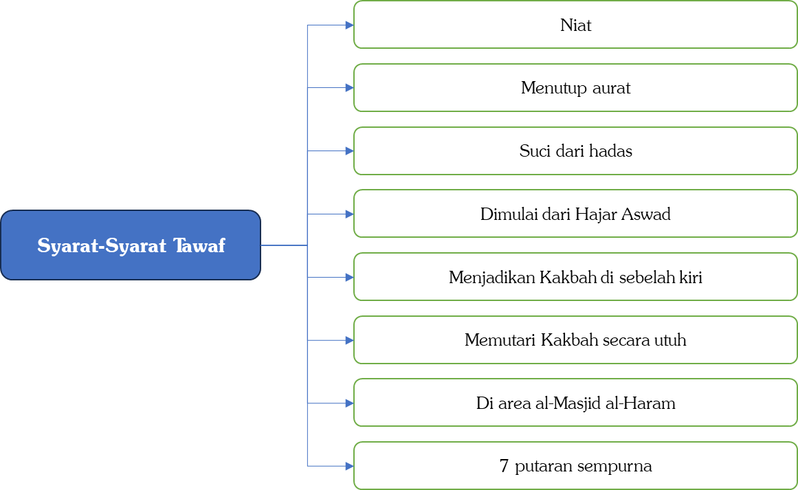

# 2.2.1.4 — Sunah-sunah Tawaf

---

## Pertama: Al-idhthibâ’

Disunahkan ketika melakukan tawaf qudum atau tawaf umrah untuk melakukan الاِضْطِبَاعُ,([^52]) yaitu membuka bahu dan lengan kanan serta menutup bahu dan lengan kiri dengan kain ihram.

Praktiknya adalah dengan menyampirkan kain ihram di bawah ketiak kanan lalu meletakkannya di atas bahu kiri, sehingga bahu kanan tampak terbuka.

---

## Kedua: Ar-ramal

Disunahkan ketika melakukan tawaf qudum atau tawaf umrah untuk melakukan ar-Ramal, yaitu berjalan lebih cepat dari biasanya dengan langkah-langkah pendek, disertai dengan menggoyangkan kedua bahu.([^53])

Namun, di antara kekeliruan yang sering terjadi adalah sebagian orang memahami ar-Ramal sebagai berlari-lari dengan lompatan kecil, bahkan ada yang berlari cukup kencang. Padahal yang dimaksud ar-Ramal bukanlah berlari, melainkan berjalan cepat dengan langkah pendek dan gerakan bahu yang ringan.

Mengapa disunahkan ar-Ramal dan al-Idhthibâ’? Ibnu ‘Abbas radhiyallâhu ‘anhuma berkata,

```arabic
قَدِمَ رَسُولُ اللهِ ﷺ وَأَصْحَابُهُ مَكَّةَ، وَقَدْ وَهَنَتْهُمْ حُمَّى يَثْرِبَ، قَالَ الْمُشْرِكُونَ: إِنَّهُ يَقْدَمُ عَلَيْكُمْ غَدًا قَوْمٌ قَدْ وَهَنَتْهُمُ الْحُمَّى، وَلَقُوا مِنْهَا شِدَّةً، فَجَلَسُوا مِمَّا يَلِي الْحِجْرَ، وَأَمَرَهُمُ النَّبِيُّ ﷺ أَنْ يَرْمُلُوا ثَلَاثَةَ أَشْوَاطٍ، وَيَمْشُوا مَا بَيْنَ الرُّكْنَيْنِ، لِيَرَى الْمُشْرِكُونَ جَلَدَهُمْ، فَقَالَ الْمُشْرِكُونَ: هَؤُلَاءِ الَّذِينَ زَعَمْتُمْ أَنَّ الْحُمَّى قَدْ وَهَنَتْهُمْ، هَؤُلَاءِ أَجْلَدُ مِنْ كَذَا وَكَذَا. قَالَ ابْنُ عَبَّاسٍ: وَلَمْ يَمْنَعْهُ أَنْ يَأْمُرَهُمْ أَنْ يَرْمُلُوا الأَشْوَاطَ كُلَّهَا، إِلَّا الْإِبْقَاءُ عَلَيْهِمْ
```

“Nabi Muhammad bersama para sahabatnya tiba di Makkah([^54]), sementara mereka telah dilemahkan oleh demam Yatsrib (Madinah).

Orang-orang musyrik berkata, ‘Besok akan datang kepada kalian suatu kaum yang telah dilemahkan oleh demam dan sangat menderita karenanya.’

Lalu orang-orang musyrik itu duduk di arah Hijr (Hijr Ismail). Nabi memerintahkan para sahabat agar melakukan ramal (berjalan cepat) pada tiga putaran pertama dan berjalan biasa di antara dua rukun, agar orang-orang musyrik melihat kekuatan mereka.

Maka orang-orang musyrik berkata, ‘Inikah orang-orang yang kalian katakan telah dilemahkan oleh demam? Mereka ini lebih kuat daripada ini dan itu!’

Ibnu Abbas berkata, ‘Tidaklah beliau (Nabi) terhalang untuk memerintahkan mereka melakukan ramal pada seluruh putaran kecuali karena belas kasih dan menjaga kondisi mereka’.”[^55]

Pada riwayat lain,

```arabic
أَنَّ النَّبِيَّ ﷺ اضْطَبَعَ فَاسْتَلَمَ وَكَبَّرَ، ثُمَّ رَمَلَ ثَلَاثَةَ أَطْوَافٍ وَكَانُوا، إِذَا بَلَغُوا الرُّكْنَ الْيَمَانِيَ وَتَغَيَّبُوا مِنْ قُرَيْشٍ مَشَوْا، ثُمَّ يَطْلُعُونَ عَلَيْهِمْ يَرْمُلُونَ، تَقُولُ قُرَيْشٌ: كَأَنَّهُمُ الْغِزْلَانُ، قَالَ ابْنُ عَبَّاسٍ: فَكَانَتْ سُنَّةً
```

“Sesungguhnya Nabi melakukan idhthibâ’ lalu menyentuh hajar aswad dan bertakbir, setelah itu melakukan ar-Ramal tiga putaran. Dan para sahabat jika sampai pada Rukun Yamani dan tidak kelihatan dari Quraisy maka mereka berjalan, setelah mereka nampak melakukan ar-Ramal di hadapan mereka. Quraisy berkata, ‘Seakan-akan mereka (kaum muslimin) rusa-rusa.’ Ibnu Abbas berkata, ‘Maka jadilah perbuatan ini sunah (tuntunan)’.”[^56]

Meskipun sebabnya sudah tidak ada, namun Nabi ﷺ tetap melakukan al-Idhthibâ’ dan ar-Ramal. Oleh karena itu, ketika melaksanakan umrah al-Ju’ranah, beliau melakukan ar-Ramal dan al-Idhthibâ’ sebagaimana sunah yang beliau ajarkan.

- Ibnu Abbas radhiyallâhu ‘anhuma berkata,

```arabic
أَنَّ رَسُولَ اللَّهِ ﷺ وَأَصْحَابَهُ اعْتَمَرُوا مِنَ الْجِعْرَانَةِ فَرَمَلُوا بِالْبَيْتِ وَجَعَلُوا أَرْدِيَتَهُمْ تَحْتَ آبَاطِهِمْ قَدْ قَذَفُوهَا عَلَى عَوَاتِقِهِمُ الْيُسْرَى
```

Ji’ranah. Ramal di Ka’bah dan mereka menjadikan ridâ` (kain atas ihram) di bawah ketiak mereka dan mereka melemparkan rida mereka di atas pundak kiri mereka.”[^57]

Umar bin al-Khaththab radhiyallâhu ‘anhu berkata,

```arabic
فِيمَ الرَّمَلَانُ الْآنَ؟ وَقَدْ أَطَّأَ اللَّهُ الْإِسْلَامَ، وَنَفَى الْكُفْرَ وَأَهْلَهُ، وَايْمُ اللَّهِ، مَا نَدَعُ شَيْئًا، كُنَّا نَفْعَلُهُ عَلَى عَهْدِ رَسُولِ اللَّهِ ﷺ
```

“Buat apa ar-Ramal sekarang? Padahal Allah telah menjadikan Islam kokoh dan mengusir kekufuran dan pelaku kekufuran? Demi Allah kami tidak akan meninggalkan sesuatu pun yang kami lakukan di masa Rasulullah ﷺ.”

Beberapa hal yang berkaitan dengan ar-Ramal:

- Ar-Ramal dari Hajar Aswad ke Hajar Aswad.

Meskipun awalnya Nabi ﷺ dan para sahabat hanya melakukan ar-Ramal dari Hajar Aswad hingga Rukun Yamani saat melaksanakan Umrah al-Qadha`, namun beliau setelah itu tetap melakukan ar-Ramal dari Hajar Aswad hingga ke Hajar Aswad, yakni satu putaran penuh.

Tatkala haji Wadak, Jabir bin Abdillah berkata,

```arabic
رَأَيْتُ رَسُولَ اللهِ ﷺ رَمَلَ مِنَ الْحَجَرِ الأَسْوَدِ، حَتَّى انْتَهَى إِلَيْهِ، ثَلَاثَةَ أَطْوَافٍ
```

“Aku melihat Rasulullah ﷺ melakukan ar-Ramal dari Hajar Aswad hingga ke Hajar Aswad lagi, tiga kali putaran.”[^58]

```arabic
عَنْ نَافِعٍ أَنَّ ابْنَ عُمَرَ، رَمَلَ مِنَ الْحَجَرِ إِلَى الْحَجَرِ، وَذَكَرَ أَنَّ رَسُولَ اللهِ ﷺ فَعَلَهُ
```

Dari Nafi’ bahwasanya Ibnu Umar melakukan ar-Ramal dari hajar aswad ke hajar aswad, dan Ibnu Umar menyebutkan bahwa Rasulullah ﷺ melakukannya.[^59]

- Ar-Ramal hanya dilakukan pada tiga putaran pertama. Adapun setelah itu maka hanya berjalan biasa.

Diriwayatkan dari Ibnu Umar, bahwa beliau berkata,

```arabic
أَنَّ النَّبِيَّ ﷺ كَانَ إِذَا طَافَ بِالْبَيْتِ الطَّوَافَ الْأَوَّلَ، يَخُبُّ ثَلَاثَةَ أَطْوَافٍ، وَيَمْشِي أَرْبَعَةً، وَأَنَّهُ كَانَ يَسْعَى بَطْنَ الْمَسِيلِ، إِذَا طَافَ بَيْنَ الصَّفَا وَالْمَرْوَةِ
```

[^60]

“Bahwa Nabi ﷺ apabila melakukan tawaf pertama di Ka’bah, beliau berjalan cepat (ramal/khabb) pada tiga putaran dan berjalan biasa pada empat putaran sisanya.

Dan beliau juga berlari kecil di lembah (bagian rendah, bathnul-masîl) ketika melakukan sa‘i antara Safa dan Marwah.”

Jabir juga berkata,

```arabic
فَرَمَلَ ثَلَاثًا، وَمَشَى أَرْبَعًا
```

“Nabi melakukan ar-Ramal 3 putaran, dan berjalan 4 putaran”[^61]

Ini adalah ar-Ramal tatkala Nabi ﷺ tawaf qudum ketika haji Wadak. Adapun hadis tentang sebab awal Nabi ﷺ melakukan ar-Ramal adalah tatkala tawaf umrah.

- Al-idhthibâ’ dilakukan selama tujuh putaran penuh tawaf. Inilah satu-satunya perbedaan dengan ar-Ramal, yang hanya disunahkan pada tiga putaran pertama.

- Ar-Ramal tidak disunahkan bagi wanita,[^62] sehingga wanita cukup berjalan normal tanpa melakukan langkah cepat atau menggoyangkan bahu seperti yang dianjurkan bagi pria.

---

## Ketiga: Mulai tawaf dengan mengusap/menyentuh Hajar aswad

Diriwayatkan dalam sebuah hadis,

```arabic
أنَّ النَّبِيَّ ﷺ اضْطَبَعَ فَاسْتَلَمَ وَكَبَّرَ
```

“Sesungguhnya Nabi melakukan idhthibâ’ lalu menyentuh hajar aswad dan bertakbir.”[^63]

---

## Keempat: Salat sunah dua rakaat

Setelah tawaf, disunahkan untuk mendirikan salat dua rakaat di belakang Maqam Ibrahim. Jabir berkata,

```arabic
حَتَّى إِذَا أَتَيْنَا الْبَيْتَ مَعَهُ، اسْتَلَمَ الرُّكْنَ فَرَمَلَ ثَلَاثًا وَمَشَى أَرْبَعًا، ثُمَّ نَفَذَ إِلَى مَقَامِ إِبْرَاهِيمَ عَلَيْهِ السَّلَام، فَقَرَأَ: ﵟوَٱتَّخِذُواْ مِن مَّقَامِ إِبۡرَٰهِـۧمَ مُصَلّٗىۖ ﵞ فَجَعَلَ الْمَقَامَ بَيْنَهُ وَبَيْنَ الْبَيْتِ،...كَانَ يَقْرَأُ فِي الرَّكْعَتَيْنِ ﵟقُلۡ هُوَ ٱللَّهُ أَحَدٌﵞ وَ ﵟقُلۡ يَٰٓأَيُّهَا ٱلۡكَٰفِرُونَﵞ، ثُمَّ رَجَعَ إِلَى الرُّكْنِ فَاسْتَلَمَهُ
```

“Hingga tatkala kami tiba di Ka’bah maka Nabi melakukan ar-Ramal 3 putaran dan beliau berjalan biasa 4 putaran. Lalu beliau menuju ke Maqam Ibrahim alaihissalâm maka beliau membaca firman Allah, ‘Dan jadikanlah sebahagian Maqam Ibrahim tempat salat.’ (QS. Al-Baqarah: 125)

Lalu beliau menjadikan Maqam Ibrahim antara beliau dan Ka’bah…Beliau membaca pada dua rakaat tersebut al-Ikhlâsh dan al-Kâfirûn, lalu beliau kembali lagi ke Hajar Aswad dan mengusapnya.”[^64]

Beberapa hal yang berkaitan dengan salat sunah dua rakaat setelah tawaf:

- Setelah tawaf selesai dilaksanakan, maka posisi kain ihram dikembalikan seperti sedia kala, yaitu menutupi kedua bahunya.

- Salat dua rakaat setelah tawaf disunahkan untuk seluruh jenis tawaf, termasuk tawaf ifadah dan tawaf sunah. Ibnu Abbas berkata,

```arabic
عَلَى كُلِّ سُبُعٍ رَكْعَتَانِ
```

“Setiap 7 putaran tawaf hendaknya melaksanakan salat 2 rakaat.”[^65]

- Boleh mengerjakan salat sunah tersebut meskipun di waktu terlarang.[^66]

- Jika tidak memungkinkan salat di belakang Maqam Ibrahim karena ramai dan padat, maka boleh melaksanakannya di mana pun dari bagian Masjidilharam.[^67]

- Bahkan jika lupa untuk melaksanakan salat tersebut, maka boleh diqada meskipun di luar Masjidilharam[^68]

- Setelah salat dua rakaat

- di belakang maqam, maka disunahkan untuk kembali ke Hajar Aswad untuk mengusapnya kembali—sebagaimana ditunjukkan oleh hadis Jabir di atas.

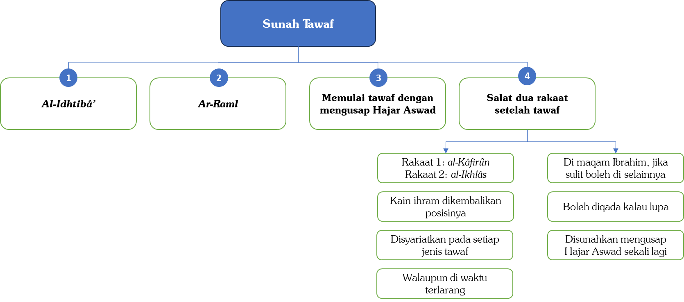

# 2.2.1.5 — Peringatan-peringatan Terkait dengan Tawaf

Peringatan pertama: jika seseorang ragu tatkala tawaf, maka:

- Jika keraguannya muncul ketika sedang tawaf; misalnya dia ragu apakah tawafnya sudah 4 atau 5 putaran, maka hendaknya dia membuang keraguan tersebut dan berpegang dengan yang pasti. Dalam hal ini, dia memegang anggapan sudah tawaf 4 putaran, itulah yang pasti, dan tidak menganggap sudah tawaf 5 putaran, karena itulah yang diragukan.([^69])

- Jika dia ragu tatkala tawaf, kemudian ada orang lain yang terpercaya mengabarkannya tentang jumlah putaran tawaf, maka dia boleh menerima berita orang tersebut.([^70])

- Jika keraguannya muncul setelah selesai tawaf, maka dia tidak perlu memedulikan keraguan tersebut.([^71])

- Peringatan kedua: jika

tatkala tawaf lalu tiba-tiba iqamat salat, maka seseorang boleh menghentikan tawafnya lalu melaksanakan salat. Setelah selesai salat, barulah dia melanjutkan kembali tawaf dari tempat dia berhenti tawaf.([^72])

Peringatan ketiga: jika mendapati kepadatan yang sangat ketika tawaf, maka dia boleh melanjutkan tawafnya di lantai lain di Masjidilharam. Karena tawafnya tetap sah selama masih di dalam Masjidilharam.

Peringatan keempat: setelah tawaf selesai dilakukan, hendaklah kembali menutup bahu kanan sebelum melaksanakan salat sunah dua rakaat di belakang Maqam Ibrahim. Karena salat dalam kondisi bahu tersingkap hukumnya makruh.

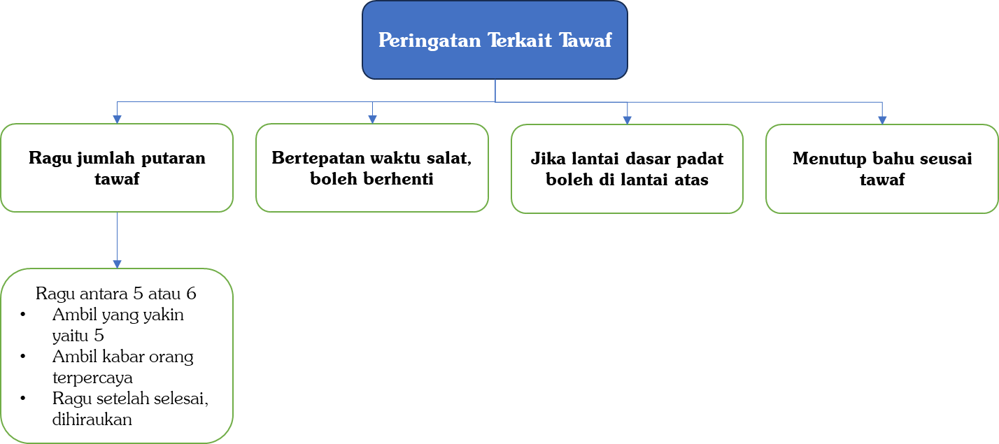

# 2.2.2 — Tata Cara Tawaf (ringkasan)

Tawaf dimulai ketika seseorang telah sejajar dengan Hajar Aswad. Dia dianjurkan untuk menciumnya jika memungkinkan. Namun, jika tidak memungkinkan, cukup mengusapnya. Jika tetap tidak memungkinkan, maka dia cukup memberi isyarat ke arahnya sambil mengucapkan, “Allahu Akbar.”

Setelah itu, dia mulai berjalan mengelilingi Ka’bah dengan menjadikan Ka’bah berada di sebelah kirinya. Dia mengitari al-Hijr (Hijir Ismail) dari luar, karena al-Hijr termasuk bagian dari Ka’bah.

Ketika melewati Rukun Yamani, dianjurkan untuk mengusapnya tanpa menciumnya dan tanpa mengucapkan bacaan tertentu. Jika tidak memungkinkan untuk mengusapnya, maka tidak perlu memberi isyarat.

Kemudian melanjutkan putarannya hingga kembali lagi ke Hajar Aswad. Dengan demikian, selesailah satu putaran tawaf. Dia terus melanjutkan dengan cara yang sama hingga sempurna tujuh putaran.

# 2.2.3 — Doa Tawaf

Tidak ada doa khusus yang ditetapkan pada setiap putaran tawaf, kecuali ketika berada di antara Rukun Yamani dan Hajar Aswad. Pada bagian ini, disunahkan untuk membaca,

```arabic
ﵟرَبَّنَآ ءَاتِنَا فِي ٱلدُّنۡيَا حَسَنَةٗ وَفِي ٱلۡأٓخِرَةِ حَسَنَةٗ وَقِنَا عَذَابَ ٱلنَّارِﵞ
```

[^73]

Adapun selain doa di atas, maka seseorang yang sedang tawaf bebas untuk berdoa dengan doa apa pun. Dia juga bebas untuk berzikir dengan zikir apa pun.

# 2.2.4 — Kesalahan-kesalahan Terkait Tawaf

Di antara kesalahan yang terjadi ketika tawaf adalah:

1. Tidak menjadikan Ka’bah di sebelah kiri ketika tawaf.

Sebagian orang, demi mengatur jemaah atau rombongannya, justru menjadikan Ka’bah berada di sebelah kanan atau bahkan di belakangnya. Ini keliru, karena syarat tawaf adalah mengelilingi Ka’bah dengan posisi Ka’bah di sebelah kiri.

1. Meyakini bahwa setiap putaran Ka’bah memiliki doa khusus.

Padahal tidak ada doa khusus pada setiap putaran Ka’bah. Doa yang dianjurkan secara khusus hanyalah antara Rukun Yamani dan Hajar Aswad. Adapun selain itu, seseorang bebas berdoa dengan doa apa pun yang dia kehendaki.

1. Berhenti lama di depan Hajar Aswad lalu berdoa.

Sebagian orang berhenti cukup lama ketika berhadapan dengan Hajar Aswad lalu berdoa, padahal ini dapat mengganggu jemaah lain yang sedang tawaf, terlebih dalam kondisi sangat padat sehingga menghambat putaran.

Adapun hadis yang menyebutkan bahwa Nabi ﷺ ketika mengusap Hajar Aswad membaca doa,

```arabic
((اللَّهُمَّ إِيْمَانًا بِكَ وَتَصْدِيْقًا بِكِتَابِكَ وَاتِّبَاعًا سُنَّةَ نَبِيِّكَ))
```

“Ya Allah karena beriman kepada-Mu, karena membenarkan kitab-Mu, dan karena mengikuti sunah Nabi-Mu.”

Maka riwayat tersebut berstatus maukuf dan lemah, sehingga tidak dapat dijadikan dalil. (Lihat: Adh-Dha’îfah, al-Albani, No. 1049)

1. Berdoa dengan suara keras, terlebih lagi secara bersama-sama.

Hal ini dapat mengganggu kekhusyukan jemaah lain yang sedang beribadah.

1. Memaksakan diri untuk melakukan ar-Ramal (lari kecil) ketika kondisi sangat padat.

Jika keadaan sangat ramai, tetap memaksakan ar-Ramal justru akan mengganggu dan membahayakan jemaah lain.

1. Mencium Rukun Yamani.

Padahal sunahnya hanya mengusapnya, bukan menciumnya.

1. Memberi isyarat kepada Rukun Yamani ketika tidak bisa mengusapnya.

Padahal isyarat dari jauh hanya disyariatkan pada Hajar Aswad. Jika tidak bisa mengusap Rukun Yamani, cukup dilewati tanpa isyarat.

1. Mengusap atau mencium bagian lain dari Ka’bah.

Padahal yang disyariatkan untuk diusap hanyalah Hajar Aswad dan Rukun Yamani.

1. Sibuk berfoto dan selfie saat tawaf.

Sebagian orang justru lebih sibuk mengambil gambar hingga lalai dari doa dan zikir, padahal tawaf adalah kesempatan yang sangat berharga untuk mendekatkan diri dan memperbanyak doa kepada Allah ﷻ.

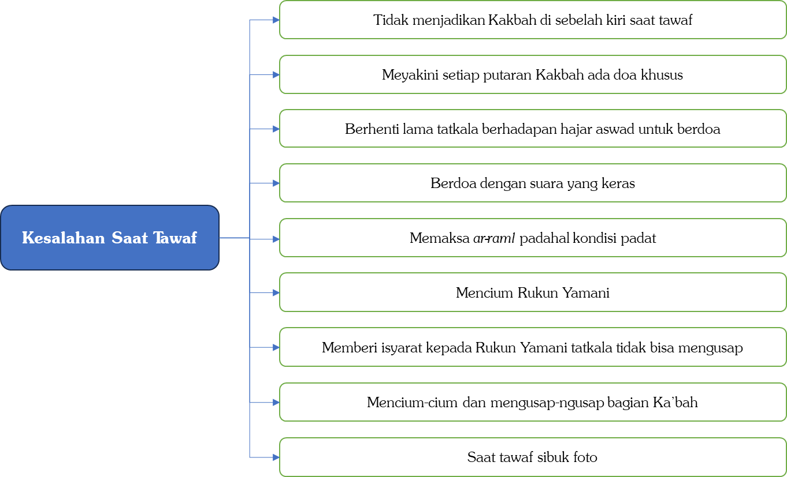

# 2.3 — Salat di Belakang Maqam Ibrahim

Setelah tawaf disunahkan untuk melakukan salat sunah dua rakaat di belakang Maqam Ibrahim. Secara ringkas:

- Setelah selesai melaksanakan tawaf qudum, jangan lupa untuk kembali menutup bahu kanan dengan kain ihram, karena idhthibâ’ hanya dilakukan saat tawaf.

- Kemudian menuju ke belakang Maqam Ibrahim sambil membaca firman Allah ﷻ,

```arabic
ﵟوَٱتَّخِذُواْ مِن مَّقَامِ إِبۡرَٰهِـۧمَ مُصَلّٗىۖ ﵞ
```

“Dan jadikanlah Maqam Ibrahim sebagai tempat salat.” (QS. Al-Baqarah: 125)

- Setelah itu, disunahkan melaksanakan salat dua rakaat di belakang Maqam Ibrahim (jika memungkinkan). Pada rakaat pertama membaca surah Al-Kâfirûn, dan pada rakaat kedua membaca surah Al-Ikhlâs.[^74]

# 2.3.1 — Apa Itu Maqam Ibrahim?

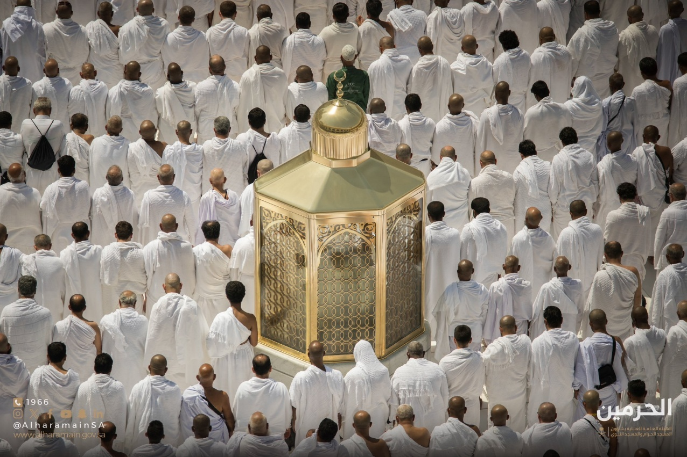

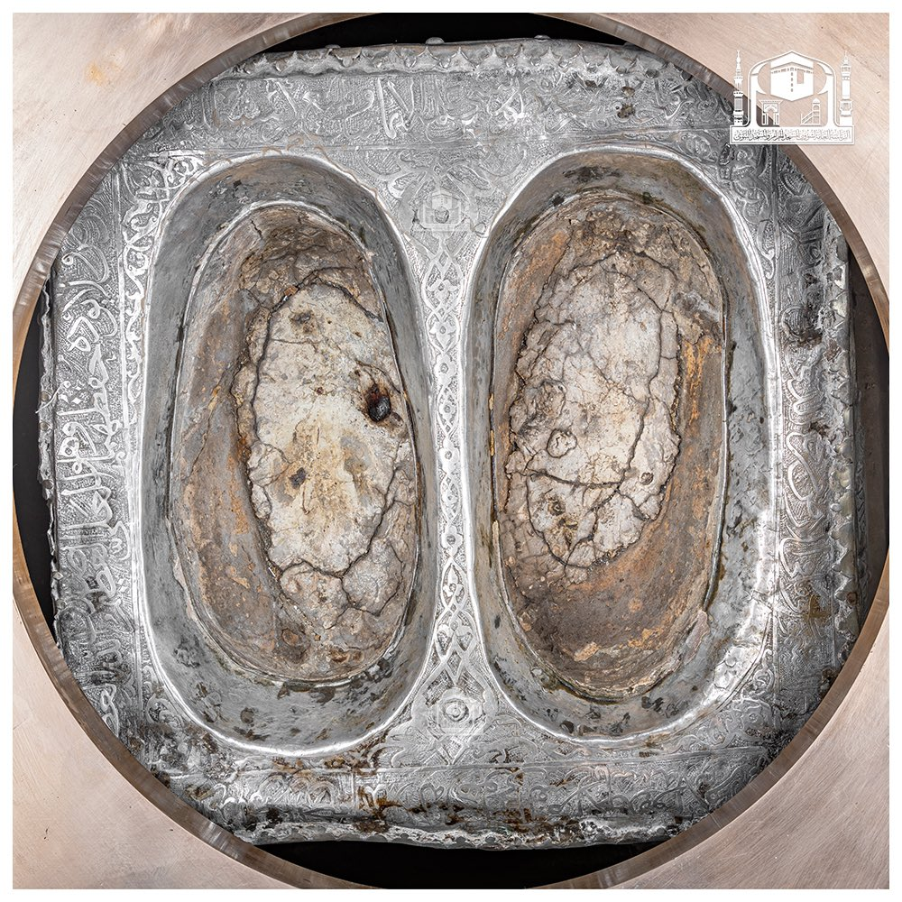

Allah ﷻ menyebutkan bahwa Maqam Ibrahim termasuk dari ayat-ayat-Nya,

```arabic
﴿إِنَّ أَوَّلَ بَيۡتٖ وُضِعَ لِلنَّاسِ لَلَّذِي بِبَكَّةَ مُبَارَكٗا وَهُدٗى لِّلۡعَٰلَمِينَ ٩٦ فِيهِ ءَايَٰتُۢ بَيِّنَٰتٞ مَّقَامُ إِبۡرَٰهِيمَۖ﴾
```

“Sesungguhnya rumah yang mula-mula dibangun untuk (tempat beribadat) manusia, ialah Baitullah yang di Bakkah (Makkah) yang diberkahi dan menjadi petunjuk bagi semua manusia. Padanya terdapat tanda-tanda yang nyata, (di antaranya) Maqam Ibrahim.” (QS. Âli-‘Imrân: 96-97)

Ibnu Katsir berkata, “Tatkala dinding Ka’bah mulai meninggi, maka Ismail ‘alaihissalâm membawakan batu (yaitu Maqam Ibrahim) kepada ayahnya, Ibrahim, sebagai tempat untuk berdiri di atasnya. Kemudian Ismail mengoper bata kepada Ibrahim, dan Ibrahim pun meletakkan bata tersebut dengan tangannya ke atas dinding. Jika telah selesai dari satu sisi dinding Ka’bah, maka Ibrahim berpindah ke sisi lainnya. Dan beliau mengitari Ka’bah sambil berdiri di atas batu pijakan tersebut. Demikian seterusnya hingga beliau selesai dari membangun seluruh dinding Ka’bah. Bekas kedua kaki beliau masih tampak di batu pijakan tersebut. Dan hal ini diketahui oleh orang Arab Jahiliah. Oleh karena itu, Abu Thalib pernah berkata dalam syairnya:

| عَلَى قَدَمَيْهِ حَافِيًا غَيْرَ نَاعِلِ |  | وَمَوْطِئُ إِبْرَاهِيمَ فِي الصَّخْرِ رَطْبَةٌ |
| --- | --- | --- |

“Pijakan Ibrahim di batu masih basah….di atas kedua kakinya yang kosong tidak beralas kaki.”[^75]

Ibnu Katsir juga berkata, “Pada awalnya Maqam Ibrahim menempel di dinding Ka’bah. Letaknya berada di sisi dinding setelah Hajar Aswad, di sebelah kanan—orang yang hendak masuk ke pintu Ka’bah, pada posisi tersendiri. Ketika Ibrahim selesai membangun Ka’bah, beliau meletakkan Maqam tersebut di dinding Ka’bah. Atau beliau selesai membangun dinding Ka’bah ketika posisi Maqam berada di tempat itu.

Karena itulah—wallâhu

a’lam—disyariatkan untuk melaksanakan salat di belakang Maqam Ibrahim setelah selesai tawaf. Dan hal itu sangat sesuai, karena di situlah pembangunan Ka’bah berakhir.

Kemudian posisi Maqam Ibrahim dimundurkan oleh Amirul Mukminin Umar bin al-Khaththab radhiyallâhu ‘anhu—salah seorang imam yang mendapat petunjuk dan seorang khulafa rasyidin yang kita diperintahkan untuk mengikuti mereka. Dan beliau adalah salah satu dari dua orang yang Nabi katakan tentang mereka berdua, ‘Teladanilah dua orang setelahku, Abu Bakar dan Umar.’ Beliau pula yang pendapatnya dikuatkan oleh turunnya ayat al-Qur`an tentang perintah menjadikan Maqam Ibrahim sebagai tempat salat. Oleh karena itu, tidak ada seorang sahabat pun yang mengingkari keputusan beliau ketika memundurkan posisi Maqam Ibrahim.” [^76]

# 2.3.2 — Kesalahan-kesalahan Terkait Maqam Ibrahim

Di antara kesalahan yang sering terjadi berkaitan dengan Maqam Ibrahim adalah sebagai berikut:

Pertama, mengusap-usap Maqam Ibrahim. Perlu diketahui bahwa Maqam Ibrahim bukanlah tempat untuk diusap-usap. Yang disyariatkan adalah menjadikannya sebagai tempat salat, yaitu dengan melaksanakan salat dua rakaat di belakangnya setelah selesai tawaf.

Umar bin Al-Khaththab radhiyallâhu ‘anhu berkata,

```arabic
وَافَقْتُ رَبِّي فِي ثَلَاثٍ: فَقُلْتُ يَا رَسُولَ اللَّهِ، لَوِ اتَّخَذْنَا مِنْ مَقَامِ إِبْرَاهِيمَ مُصَلًّى، فَنَزَلَتْ: ﵟوَٱتَّخِذُواْ مِن مَّقَامِ إِبۡرَٰهِـۧمَ مُصَلّٗىۖ ﵞ
```

“Aku menyepakati Rabbku pada tiga perkara. Aku berkata, ‘Wahai Rasulullah, bagaimana kalau kita menjadikan sebagian Maqam Ibrahim tempat salat?’

, ‘Maqam Ibrahim tempat salat.’ (QS. Al-Baqarah: 125)”[^77]

Dan inilah yang dipraktikkan oleh Nabi ﷺ. Setelah selesai melaksanakan tawaf, beliau pun menunaikan salat dua rakaat di belakang Maqam Ibrahim.

Ibnu Umar berkata,

```arabic
قَدِمَ النَّبِيُّ ﷺ، فَطَافَ بِالْبَيْتِ سَبْعًا، وَصَلَّى خَلْفَ الْمَقَامِ رَكْعَتَيْنِ، وَطَافَ بَيْنَ الصَّفَا وَالْمَرْوَةِ
```

rakaatMaqam Ibrahim, lalu tawaf/bersai antara Safa dan Marwah.”[^78]

Qatadah rahimahullâh berkata,

```arabic
إِنَّمَا أُمِرُوا أَنْ يُصَلُّوا عِنْدَهُ وَلَمْ يُؤْمَرُوا بِمَسْحِهِ، وَلَقَدْ تَكَلَّفَتْ هَذِهِ الْأُمَّةُ شَيْئًا مِمَّا تَكَلَّفَتْهُ الْأُمَمُ قَبْلَهَا، وَلَقَدْ ذَكَرَ لَنَا بَعْضُ مَنْ رَأَى عَقِبَهُ وَأَصَابِعَهُ، فَمَا زَالَتْ هَذِهِ الْأُمَمُ يَمْسَحُونَهُ حَتَّى اخْلَوْلَقَ وَانْمَحَى
```

“Mereka hanyalah diperintahkan untuk salat di sisi Maqam Ibrahim, bukan untuk mengusapnya. Sungguh umat ini telah berlebih-lebihan melakukan sesuatu yang dilakukan oleh umat-umat sebelumnya. Sebagian orang yang pernah melihat bekas kaki dan jari-jari kaki Ibrahim telah bercerita kepada kami, namun umat ini terus mengusapnya hingga akhirnya bekas itu aus dan hilang.”[^79]

Kedua, sebagian orang meyakini bahwa salat dua rakaat setelah tawaf harus dilakukan tepat di belakang Maqam Ibrahim. Padahal jika kondisi sangat ramai, salat boleh dilakukan di mana saja di dalam Masjidilharam dan tetap sah.

Akibat keyakinan yang keliru ini, sebagian orang nekat salat tepat di belakang Maqam Ibrahim meskipun lokasi tawaf sedang sangat padat. Niatnya memang ingin menjalankan sunah, tetapi caranya justru melakukan sesuatu yang haram karena menghalangi orang-orang yang sedang bertawaf.

Ketiga, sebagian orang berlama-lama dalam salat dua rakaat setelah tawaf. Padahal sunahnya adalah salat yang ringan, sebagaimana yang dicontohkan oleh Nabi ﷺ, yaitu membaca Surah Al-Kâfirûn pada rakaat pertama dan Surah Al-Ikhlâs pada rakaat kedua. Dan sebaik-baik petunjuk adalah petunjuk Nabi ﷺ. Maka hendaknya seseorang salat dengan ringkas lalu segera memberikan tempat bagi jemaah lain yang belum salat, terlebih dalam kondisi yang padat.

Keempat, sebagian orang berhenti di Maqam Ibrahim lalu berdoa di sana. Padahal perbuatan ini sama sekali tidak disyariatkan.

Kelima, sebagian orang meyakini bahwa setelah salat dua rakaat tawaf dianjurkan untuk berdoa di tempat tersebut. Padahal Nabi ﷺ setelah salat dua rakaat tawaf langsung beranjak pergi, tidak menetap dan tidak berdoa di sana. Dan sebaik-baik petunjuk adalah petunjuk Nabi ﷺ. Maka hendaknya seseorang salat dengan ringan, dan setelah salam langsung beranjak memberikan tempatnya kepada jemaah lain yang belum salat tawaf.

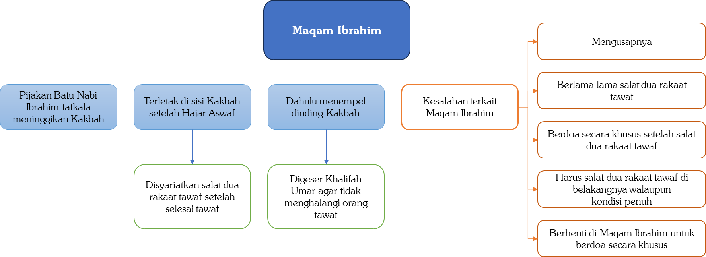

# 2.4 — Minum Air Zamzam

Setelah salat dua rakaat tawaf, disunahkan untuk minum air zamzam sebanyak mungkin,[^80] sambil berdoa dengan doa apa saja yang disyariatkan sesuai kehendak hati. Disunahkan pula untuk menuangkan air zamzam di atas kepala.

Jabir bin Abdillah radhiyallâhu ‘anhu berkata,

```arabic
ثُمَّ ذَهَبَ إِلَى زَمْزَمَ فَشَرِبَ مِنْهَا، وَصَبَّ عَلَى رَأْسِهِ، ثُمَّ رَجَعَ فَاسْتَلَمَ الرُّكْنَ، ثُمَّ رَجَعَ إِلَى الصَّفَا
```

“(Setelah tawaf) lalu Nabi ﷺ pergi ke zamzam lalu minum darinya, dan menumpahkan zamzam di atas kepalanya, lalu beliau kembali dan mengusap Hajar Aswad lalu beliau pergi menuju bukit Shafa.” [^81]

Adapun doa ketika minum air zamzam, tidak ada doa khusus yang ditetapkan. Maka silakan berdoa dengan apa saja yang diinginkan.

# 2.4.1 — Sejarah Zamzam

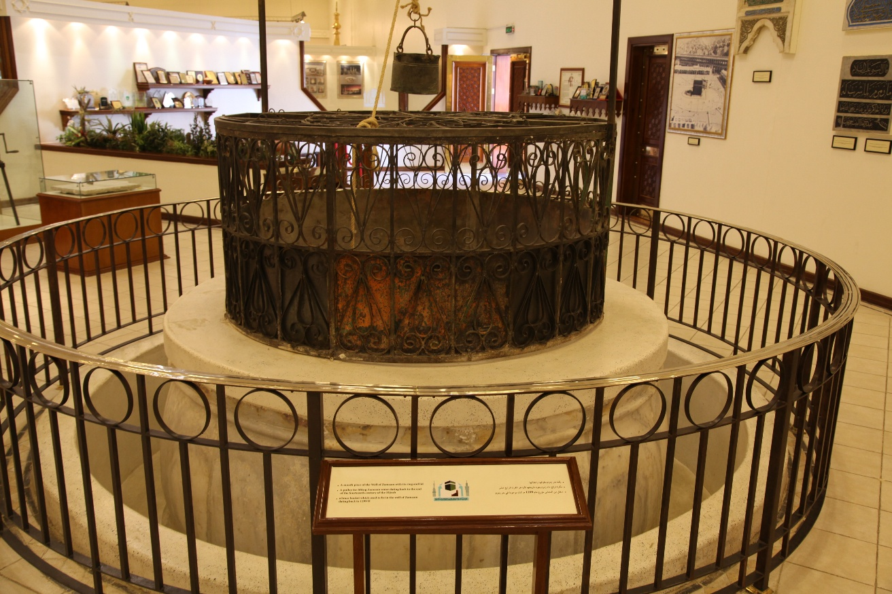

(Sumur Zamzam. Sumber: Wikipedia)

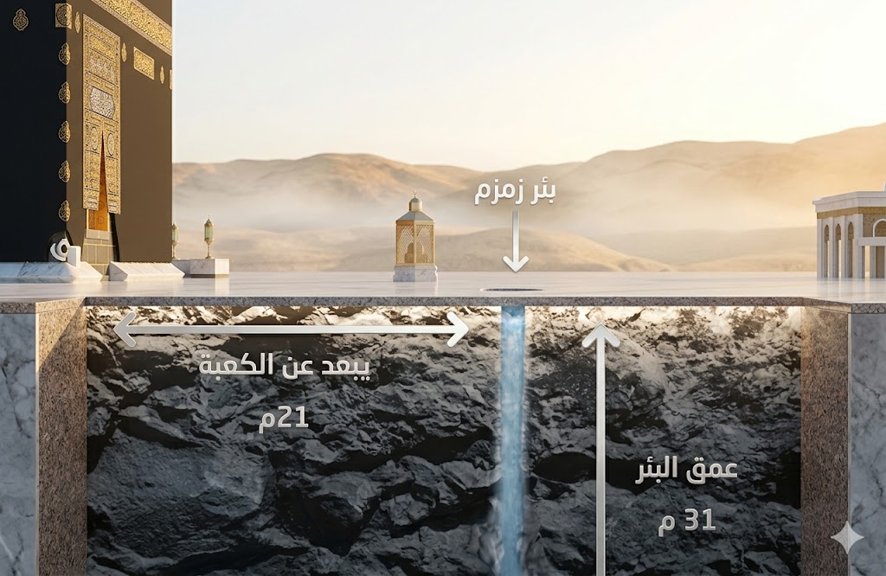

Di balik mata air yang mulia ini tersimpan sebuah kisah yang luar biasa, kisah tentang keimanan seorang ibu, kesabaran seorang anak, dan kepasrahan total kepada Allah ﷻ.

Ibnu Abbas radhiyallâhu ‘anhumâ meriwayatkan kisah ini dengan panjang lebar dari Nabi ﷺ.

Kebiasaan wanita memakai ikat pinggang pertama kali dimulai dari ibu Ismail. Ia mengikat pinggang untuk menyamarkan jejaknya dari Sarah. Kemudian Ibrahim membawa Hajar dan putranya Ismail yang masih menyusu, hingga ia menempatkan keduanya di dekat Baitullah, di bawah pohon besar di atas sumur Zamzam, di bagian atas Masjidilharam.([^82]) Saat itu tidak ada seorang pun di Makkah, dan tidak ada air di sana. Ibrahim meninggalkan di sisi mereka sebuah kantong berisi kurma dan wadah berisi air, kemudian ia berbalik pergi.

Hajar segera mengikutinya dan berkata, “Wahai Ibrahim, ke mana engkau pergi dan meninggalkan kami di lembah yang tidak ada manusia dan tidak ada apa-apa ini?” Ia mengulang pertanyaan itu berkali-kali, namun Ibrahim tidak menoleh sedikit pun.

Akhirnya Hajar bertanya, “Apakah Allah yang memerintahkanmu melakukan ini?” Ibrahim menjawab, “Ya.” Maka Hajar berkata, “Kalau begitu, Allah tidak akan menyia-nyiakan kami.” Lalu ia pun kembali.

Ibrahim terus berjalan hingga ketika sampai di sebuah bukit yang dari sana mereka tidak bisa lagi melihatnya, ia menghadapkan wajahnya ke arah Baitullah, mengangkat kedua tangannya, dan berdoa,

“Ya Tuhan kami, sesungguhnya aku telah menempatkan sebagian keturunanku di sebuah lembah yang tidak ada tanamannya, di sisi rumah-Mu yang suci...” hingga beliau membaca “...semoga mereka bersyukur.” (QS. Ibrahîm: 37)

Sementara itu Hajar terus menyusui Ismail dan meminum air dari wadah yang ada, sampai akhirnya air itu habis. Ia pun kehausan, begitu pula bayinya. Ia memandang Ismail yang menggeliat-geliat berguling-guling di atas tanah. Tidak sanggup menyaksikannya, ia bangkit dan pergi menjauh.

Ia mendapati bukit Shafa sebagai bukit yang paling dekat. Ia naiki bukit itu dan memandang ke sekeliling lembah, berharap melihat seseorang. Tidak ada siapa-siapa. Ia turun dari Shafa, dan ketika tiba di dasar lembah ia angkat ujung bajunya lalu berlari sekuat tenaga hingga menyeberangi lembah dan tiba di bukit Marwah. Ia naiki Marwah dan kembali mencari dengan pandangannya. Tetap tidak ada siapa-siapa.

Begitu ia lakukan sebanyak tujuh kali.

Ibnu Abbas berkata, Nabi ﷺ bersabda, “Itulah asal-usul sai yang dilakukan manusia di antara keduanya.”

Ketika untuk terakhir kalinya Hajar berada di atas Marwah, ia mendengar sebuah suara. Ia berkata pada dirinya sendiri, “Diam!” lalu ia pasang telinga. Suara itu terdengar lagi. Ia berseru, “Aku sudah mendengarmu! Jika engkau membawa pertolongan, datanglah!”

Ternyata ada seorang malaikat (Jibril) di tempat sumur Zamzam berada. Malaikat itu mengais tanah dengan tumitnya atau dengan sayapnya hingga air memancar keluar. Hajar segera membendung air itu dengan tangannya dan mengisi wadahnya. Air itu terus memancar meski terus-menerus diciduk.

Ibnu Abbas berkata, Nabi ﷺ bersabda, “Semoga Allah merahmati ibu Ismail. Seandainya ia biarkan Zamzam mengalir begitu saja, atau tidak menciduknya, niscaya Zamzam akan menjadi mata air yang mengalir deras.”[^83]

Hajar pun minum dan menyusui anaknya.[^84] Lalu malaikat berkata kepadanya, “Janganlah kalian takut terlantar. Di sinilah rumah Allah. Anak ini bersama ayahnya kelak akan membangunnya. Dan Allah tidak akan menyia-nyiakan hamba-Nya.”

Baitullah saat itu tampak menonjol dari permukaan tanah seperti sebuah bukit kecil, yang apabila datang banjir akan terkikis dari samping kanan dan kirinya.

Begitulah keadaan mereka, hingga suatu hari rombongan dari kabilah Jurhum atau beberapa keluarga dari Jurhum melintas dari arah Kada’ dan singgah di bagian bawah Makkah. Mereka melihat seekor burung yang terus berputar-putar di satu tempat. Mereka berkata, “Burung itu pasti berputar di atas air. Padahal kita kenal betul lembah ini, dan tidak pernah ada air di sana.” Mereka mengutus satu atau dua orang untuk memeriksa, dan ternyata benar ada air. Mereka kembali membawa kabar itu, dan seluruh rombongan pun bergerak menuju ke sana.

Hajar saat itu sedang berada di sisi mata air. Mereka bertanya, “Bolehkah kami singgah dan menetap di dekatmu?” Hajar menjawab, “Boleh, tapi air ini bukan hak kalian untuk dikuasai.” Mereka pun menyetujuinya.

Ibnu Abbas berkata, Nabi ﷺ bersabda, “Hal itu sangat menyenangkan Hajar, karena ia memang merindukan kehadiran manusia.” [^85]

Kisah Jurhum dan Zamzam

Setelah dewasa, Ismail menikah dengan seorang wanita dari kabilah Jurhum dan beranak-pinak di sana. Ketika Nabi Ismail wafat, kekuasaan atas kota Makkah pun berpindah ke tangan suku Jurhum. Merekalah yang menguasai sumur zamzam, dan keadaan itu berlangsung dalam waktu yang sangat lama.

Namun sayang, Jurhum tidak menjaga amanah itu dengan baik. Mereka melanggar kehormatan Baitullah, memakan harta yang dihadiahkan untuk Ka’bah, baik secara terang-terangan maupun diam-diam, dan terus-menerus melanggar berbagai hal yang besar. Akibatnya, nikmat Allah pun mulai dicabut sedikit demi sedikit. Air zamzam berangsur-angsur menyusut dan akhirnya kering. Tempatnya makin terlupakan, tertimbun banjir dari masa ke masa, hingga akhirnya tidak ada seorang pun yang bisa mengenali di mana sumur itu berada.

Al-Azraqi dalam kitabnya Akhbâr Makkah menuturkan tingkah laku Jurhum yang menjadi sebab terusirnya mereka dari Ka’bah dan Tanah Haram. Mereka akhirnya diperangi oleh kabilah Khuza’ah. Sebagian mereka terbunuh, dan yang selamat pun keluar dalam keadaan hina dan tidak berdaya. Khuza’ah pun mengambil alih kekuasaan atas Ka’bah dan memegang kendali Makkah untuk beberapa waktu lamanya.

Sementara itu, lokasi zamzam semakin tenggelam dalam kegelapan sejarah. Tidak ada yang tahu di mana sumur itu berada. Begitulah keadaannya, dari generasi ke generasi, hingga Allah memilih seorang lelaki mulia untuk menyingkap kembali tabir yang telah lama tertutup itu. Lelaki itu adalah Abdul Muththalib bin Hasyim, kakek Rasulullah ﷺ.

Abdul Muththalib menggali sumur Zamzam

Penggalian ini terjadi sebelum kelahiran Nabi ﷺ. Ketika itu Abdul Muththalib baru memiliki satu orang putra, al-Harits. Ayah Rasulullah dan paman-paman beliau belum satu pun yang terlahir ke dunia.

Kisahnya bermula dari sebuah mimpi. Abdul Muththalib sendiri yang menuturkannya,[^86] sebagaimana tercatat dalam Sîrah Ibnu Ishâq, “Suatu hari aku tidur di Hijr Ismail, dekat Ka’bah. Tiba-tiba ada suara yang berkata kepadaku, ‘Galilah thayyibah.’ Aku bertanya, ‘Apa itu thayyibah?’ Namun suara itu pergi begitu saja tanpa menjawab.

Keesokan harinya aku kembali tidur di tempat yang sama. Suara itu datang lagi, ‘Galilah barrah.’ Aku bertanya, ‘Apa itu barrah?’ Ia pun pergi lagi.

Besoknya aku tidur lagi di sana. Suara itu datang kembali, ‘Galilah al-madhnûnah.’ Aku bertanya, ‘Apa itu al-madhnûnah?’ Ia pergi lagi.

Keesokan harinya aku kembali tidur di tempat tidurku. Kali ini suara itu berkata, ‘Galilah zamzam.’ Aku bertanya, ‘Apa itu zamzam?’ Maka ia menjawab, ‘Zamzam adalah air yang tidak akan pernah surut. Dengan air itu engkau akan memberi minum para jemaah haji.’ Lalu disebutkanlah posisinya, di tempat sarang semut.”

Dalam riwayat lain disebutkan ada tanda seekor burung gagak yang mematuk-matuk di titik itu. Karena mimpi keempat ini begitu jelas, keesokan harinya Abdul Muththalib pun berangkat dengan cangkulnya. Hanya berdua dengan putranya al-Hârits, ia mulai menggali. Hingga akhirnya tanda-tanda keberadaan sumur itu mulai tampak.

Ketika orang-orang Quraisy mendengar bahwa Abdul Muththalib menemukan sumur, mereka berdatangan dan berkata, “Wahai Abdul Muththalib, itu adalah sumur leluhur kita, Ismail ‘alaihissalâm. Kami pun punya hak atasnya. Jadikanlah kami bagian dari pemilik sumur itu.”

Abdul Muththalib menjawab, “Tidak. Ini milikku. Sumur ini telah dikhususkan untukku. Namun aku bersedia berbagi hasilnya dengan kalian.”

Mereka tidak terima. “Berlaku adillah kepada kami, atau kami tidak akan membiarkanmu menguasainya sendirian. Kita serahkan keputusan ini kepada orang lain.”

Abdul Muththalib menyetujuinya. “Baiklah, tunjuklah siapa yang akan kita jadikan hakim.”

Mereka sepakat untuk mendatangi seorang perempuan dukun yang tinggal jauh di negeri Syam. Maka berangkatlah dua rombongan bersama. Rombongan pertama adalah Abdul Muththalib bersama Bani Abdi Manaf, dan rombongan kedua adalah kabilah-kabilah lain yang menuntut hak atas zamzam.

Di tengah padang pasir yang panjang, sesuatu yang luar biasa terjadi. Bekal air rombongan Abdul Muththalib habis, sementara perjalanan masih sangat jauh dan tidak ada mata air di sekitar mereka. Mereka meminta air kepada rombongan satunya, namun ditolak mentah-mentah.

Kehausan semakin mencekik. Satu per satu dari rombongan Abdul Muththalib mulai merasakan bayang-bayang kematian. Dalam keadaan itulah muncul sebuah gagasan, Abdul Muththalib berkata, “Kita masing-masing gali kuburan kita sendiri. Daripada kita mati bergelimpangan tanpa dikuburkan, lebih baik yang mati duluan dikuburkan oleh yang masih hidup, begitu seterusnya, hingga yang terakhir mati sendirian tanpa ada yang menguburkan.”

Maka mulailah mereka menggali lubang masing-masing, disaksikan oleh rombongan satunya yang membiarkan mereka begitu saja tanpa peduli.

Namun ketika lubang-lubang itu sudah tergali, sesuatu berubah dalam diri Abdul Muththalib. Ia berkata, “Tidak. Ini hanyalah sikap pasrah tanpa usaha. Kita harus terus berjuang.” Mereka pun meninggalkan lubang-lubang galian itu dan kembali melanjutkan perjalanan.

Abdul Muththalib naik ke atas untanya. Dan tiba-tiba, tepat dari bawah kaki untanya, memancar mata air.

Ia segera mengambil air itu dan meminumnya, lalu memanggil rombongan yang tadi menolak memberinya air. Mereka pun datang dan ikut minum bersama. Saat itulah kesadaran menyergap mereka. Di tengah padang pasir yang tandus, Allah mengeluarkan air khusus untuk Abdul Muththalib. Bukti yang lebih nyata dari ini, apa lagi yang bisa mereka minta?

Mereka pun mengurungkan niat pergi ke dukun di Syam. Rombongan itu berbalik arah menuju Makkah, dan dengan kepala tertunduk mereka mengakui: zamzam adalah milik Abdul Muththalib.”

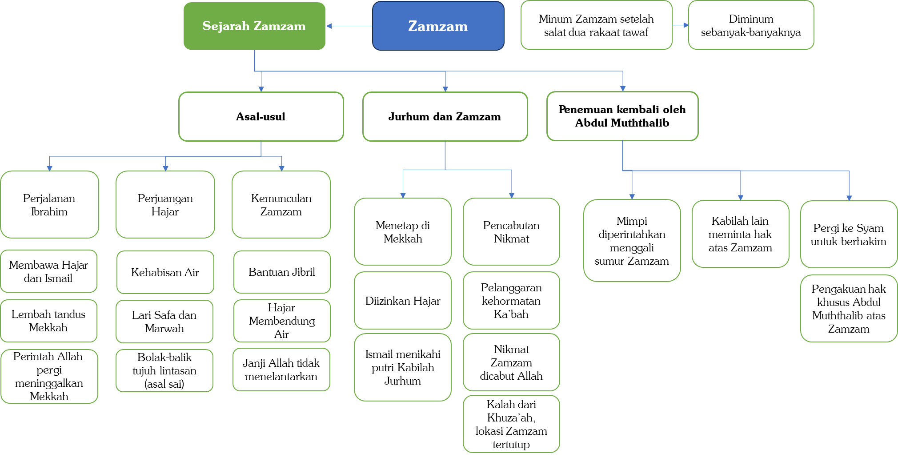

# 2.4.2 — Keutamaan Air Zamzam

Air zamzam memiliki keutamaan yang sangat besar karena keberkahan yang terkandung di dalamnya. Tidak mengherankan jika banyak kaum muslimin yang berlomba-lomba membawanya pulang dari tanah suci sebagai oleh-oleh paling berharga dari perjalanan haji atau umrah mereka. Lalu apa saja keutamaan yang tersimpan di dalam air zamzam ini?

Pertama, air zamzam adalah sebab makmur dan hijaunya kota Makkah.

Ketika Ibrahim bersama istrinya Hajar dan putranya Ismail ‘alaihimussalâm pertama kali tiba di Makkah, lembah itu benar-benar tidak layak untuk dihuni. Tidak ada sumber air, tidak ada kehidupan. Kemudian Allah memancarkan zamzam bagi Ismail dan ibunya. Dari mata air itulah kehidupan bermula. Kabilah Jurhum dari Bani Qahthan yang datang dari Yaman pun akhirnya menetap di sana, dan kelak Ismail ‘alaihissalâm akan menikahi seorang wanita dari kabilah tersebut. Sebuah kota besar lahir dari setetes air di tengah padang tandus.

Kedua, air zamzam adalah nikmat dan manfaat yang paling nyata di Baitulharam.

Allah ﷻ berfirman,

```arabic
﴿وَأَذِّن فِي ٱلنَّاسِ بِٱلۡحَجِّ يَأۡتُوكَ رِجَالٗا وَعَلَىٰ كُلِّ ضَامِرٖ يَأۡتِينَ مِن كُلِّ فَجٍّ عَمِيقٖ ٢٧ لِّيَشۡهَدُواْ مَنَٰفِعَ لَهُمۡ﴾
```

“Dan serulah manusia untuk berhaji, maka akan berdatangan kepadamu dengan berjalan kaki dan mengendarai unta, mereka datang dari segala penjuru yang jauh. Agar mereka menyaksikan berbagai manfaat untuk mereka.” (QS. Al-Hajj: 27-28)

Di antara manfaat yang disebutkan dalam ayat ini adalah air zamzam beserta seluruh keberkahan yang terkandung di dalamnya. Dengan izin Allah, banyak manusia yang memohon kesembuhan melalui air zamzam, memohon agar Allah mengabulkan permintaannya, baik yang bersifat duniawi maupun ukhrawi.

Ketiga, air zamzam adalah air terbaik di muka bumi.

Rasulullah ﷺ bersabda sebagaimana diriwayatkan oleh Ibnu Abbas radhiyallâhu ‘anhu,

```arabic
((خَيْرُ مَاءٍ عَلَى وَجْهِ الْأَرْضِ مَاءُ زَمزَمَ، فِيْهِ طَعَامُ الطُّعمِ وَشِفَاءُ السُّقْمِ))
```

“Air terbaik di muka bumi adalah air zamzam, air ini bisa mengenyangkan dan menyembuhkan penyakit.”[^87]

Keempat, air zamzam telah diberkahi dengan air ludah Nabi ﷺ yang mulia.

Ibnu Abbas radhiyallâhu ‘anhumâ berkata,

```arabic
جَاءَ النَّبِيُّ ﷺ إِلَى زَمْزَمَ، فَنَزَعْنَا لَهُ دَلْوًا، فَشَرِبَ، ثُمَّ مَجَّ فِيهَا، ثُمَّ أَفْرَغْنَاهَا فِي زَمْزَمَ
```

beliau.”[^88]

Dari hadis ini kita mengetahui bahwa air ludah Nabi ﷺ yang penuh berkah telah bercampur dengan air zamzam, sehingga menambah berlipat-lipat keberkahan yang terkandung di dalamnya.

Lebih dari itu, hadis ini juga memperlihatkan betapa dalamnya kasih sayang Nabi ﷺ kepada umatnya yang datang setelah beliau hingga hari kiamat. Mereka tidak bisa merasakan keberkahan ludah beliau secara langsung, namun melalui air zamzam, seluruh umat beliau dari generasi ke generasi tetap dapat merasakan keutamaan itu.

Kelima, air zamzam mengandung gizi yang mencukupi.

Kisah Hajar dan Ismail ‘alaihimâssalâm menjadi bukti nyata pertama. Ditinggalkan Ibrahim di lembah tandus tanpa bekal yang memadai, sebagaimana Allah ﷻ abadikan dalam firman-Nya,

```arabic
ﵟرَّبَّنَآ إِنِّيٓ أَسۡكَنتُ مِن ذُرِّيَّتِي بِوَادٍ غَيۡرِ ذِي زَرۡعٍ عِندَ بَيۡتِكَ ٱلۡمُحَرَّمِﵞ
```

“Wahai Rabb kami, sesungguhnya aku telah anak cucuku di lembah yang tidak ada tanaman di sisi rumahmu yang haram.” (QS. Ibrâhîm: 37)

Namun dengan izin Allah, air zamzam yang memancar dari tanah itu cukup menopang hidup Hajar bahkan membuatnya tetap bisa menyusui Ismail kecil.

Kisah kedua datang dari Abu Dzar radhiyallâhu ‘anhu. Ketika Nabi ﷺ bertemu dengannya setelah lama bersembunyi di Masjidilharam, beliau bertanya,

```arabic
((مَتَى كُنْتَ هَاهُنَا؟))
```

“Sejak kapan engkau di sini?”

Abu Dzar menjawab,

```arabic
قَدْ كُنْتُ هَاهُنَا مُنْذُ ثَلَاثِينَ بَيْنَ لَيْلَةٍ وَيَوْمٍ
```

“Aku di sini sudah tiga puluh hari.”

Nabi bertanya lagi,

```arabic
((فَمَنْ كَانَ يُطْعِمُكَ؟))
```

“Siapa yang memberimu makan?”

Abu Dzar menjawab,

```arabic
مَا كَانَ لِي طَعَامٌ إِلَّا مَاءُ زَمْزَمَ فَسَمِنْتُ حَتَّى تَكَسَّرَتْ عُكَنُ بَطْنِي وَمَا أَجِدُ عَلَى كَبِدِي سُخْفَةَ جُوعٍ
```

“Aku tidak memiliki makanan kecuali air zamzam. Aku bahkan menjadi gemuk hingga perutku berlipatan, dan aku sama sekali tidak merasakan rasa lapar.”

Maka Nabi ﷺ bersabda,

```arabic
((إِنَّهَا مُبَارَكَةٌ، إِنَّهَا طَعَامُ طُعْمٍ))
```

“Sesungguhnya zamzam adalah air yang penuh berkah dan makanan yang mengenyangkan.”[^89]

Keenam, air zamzam adalah obat penyakit.

Telah disebutkan dalam sabda Nabi ﷺ,

```arabic
((وَشِفَاءُ السُّقمِ))
```

“Air zamzam adalah obat bagi penyakit.”[^90]

Dan ini mencakup penyakit badan maupun penyakit hati. Betapa banyak orang yang telah sembuh dari penyakitnya berkat zamzam, padahal para dokter sudah angkat tangan dan tidak mampu lagi mengobati.

Ketujuh, air zamzam sesuai dengan niat dan keinginan orang yang meminumnya.

Jabir radhiyallâhu ‘anhu meriwayatkan bahwa ia mendengar Nabi ﷺ bersabda,

```arabic
((مَاءُ زَمْزَمَ لِمَا شُرِبَ لَهُ))
```

“Air zamzam sesuai dengan keinginan orang yang meminumnya.” [^91]

Betapa banyak ulama yang dikabulkan doa dan cita-cita mereka setelah berdoa ketika minum air zamzam. Maka jangan sia-siakan setiap tegukan. Minumlah dengan niat yang jelas, hati yang hadir, dan doa yang tulus.

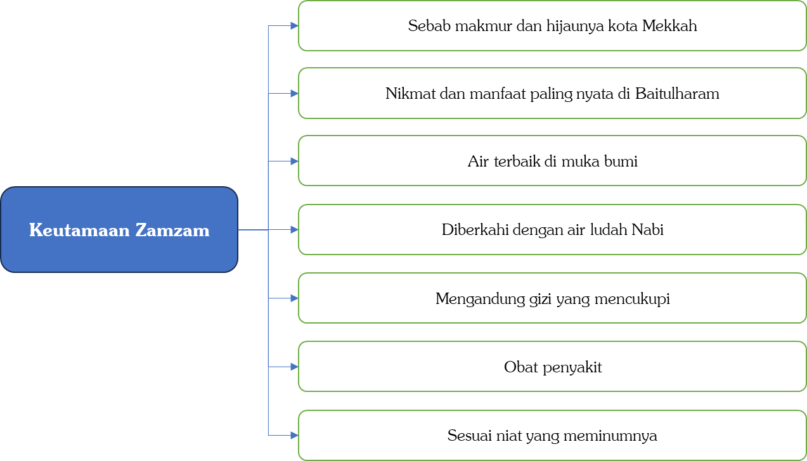

# 2.4.3 — Kesalahan-kesalahan Seputar Minum Zamzam

Ada beberapa kekeliruan yang kerap dilakukan jemaah haji dan umrah berkaitan dengan minum air zamzam. Berikut ini dua di antaranya yang paling sering dijumpai.

Pertama, sebagian jemaah menyangka bahwa minum air zamzam disunahkan sambil berdiri. Padahal sunah ketika minum secara umum adalah dalam keadaan duduk, dan tidak ada perbedaan antara minum air zamzam dengan air lainnya. Para ulama tidak membedakan keduanya dalam hal ini.

Memang benar bahwa Nabi ﷺ pernah minum zamzam dalam keadaan berdiri[^92], namun para ulama menjelaskan bahwa hal itu dilakukan untuk menunjukkan bolehnya minum sambil berdiri, bukan untuk menunjukkan bahwa itulah sunah khusus minum zamzam.

Kedua, sebagian orang mengambil air zamzam lalu mengusapkannya pada mata atau pada bagian tubuh yang sakit. Padahal cara berobat dengan air zamzam yang benar adalah dengan meminumnya sambil diniatkan sebagai obat, bukan dengan mengusapkannya pada anggota tubuh yang sakit.

# 2.5 — Sai

# 2.5.1 — Penjelasan

---

## Pertama: Sejarah sai

Asal mula disyariatkannya sai adalah kisah Hajar, ibunda Ismail, yang berlari bolak-balik antara bukit Shafa dan bukit Marwah untuk mencari air atau pertolongan. Bekal yang ditinggalkan Ibrahim untuknya dan putranya Ismail telah habis. Ismail pun kehausan dan kesakitan. Maka Hajar pun bangkit dan pergi menuju bukit Shafa, lalu bukit Marwah, dalam upayanya mencari pertolongan.

Ibnu Abbas radhiyallâhu ‘anhumâ berkata,

```arabic
أَوَّلَ مَا اتَّخَذَ النِّسَاءُ المِنْطَقَ مِنْ قِبَلِ أُمِّ إِسْمَاعِيلَ، اتَّخَذَتْ مِنْطَقًا لِتُعَفِّيَ أَثَرَهَا عَلَى سَارَةَ، ثُمَّ جَاءَ بِهَا إِبْرَاهِيمُ وَبِابْنِهَا إِسْمَاعِيلَ وَهِيَ تُرْضِعُهُ، حَتَّى وَضَعَهُمَا عِنْدَ البَيْتِ عِنْدَ دَوْحَةٍ، فَوْقَ زَمْزَمَ فِي أَعْلَى المَسْجِدِ، وَلَيْسَ بِمَكَّةَ يَوْمَئِذٍ أَحَدٌ، وَلَيْسَ بِهَا مَاءٌ، فَوَضَعَهُمَا هُنَالِكَ، وَوَضَعَ عِنْدَهُمَا جِرَابًا فِيهِ تَمْرٌ، وَسِقَاءً فِيهِ مَاءٌ، ثُمَّ قَفَّى إِبْرَاهِيمُ مُنْطَلِقًا، فَتَبِعَتْهُ أُمُّ إِسْمَاعِيلَ فَقَالَتْ: يَا إِبْرَاهِيمُ، أَيْنَ تَذْهَبُ وَتَتْرُكُنَا بِهَذَا الوَادِي، الَّذِي لَيْسَ فِيهِ إِنْسٌ وَلَا شَيْءٌ؟ فَقَالَتْ لَهُ ذَلِكَ مِرَارًا، وَجَعَلَ لَا يَلْتَفِتُ إِلَيْهَا، فَقَالَتْ لَهُ: آللَّهُ الَّذِي أَمَرَكَ بِهَذَا؟ قَالَ نَعَمْ، قَالَتْ: إِذَنْ لَا يُضَيِّعُنَا، ثُمَّ رَجَعَتْ، فَانْطَلَقَ إِبْرَاهِيمُ حَتَّى إِذَا كَانَ عِنْدَ الثَّنِيَّةِ حَيْثُ لَا يَرَوْنَهُ، اسْتَقْبَلَ بِوَجْهِهِ البَيْتَ، ثُمَّ دَعَا بِهَؤُلَاءِ الكَلِمَاتِ، وَرَفَعَ يَدَيْهِ فَقَالَ: ﵟرَّبَّنَآ إِنِّيٓ أَسۡكَنتُ مِن ذُرِّيَّتِي بِوَادٍ غَيۡرِ ذِي زَرۡعٍ عِندَ بَيۡتِكَ ٱلۡمُحَرَّمِﵞ  - حَتَّى بَلَغَ - ﵟيَشۡكُرُونَﵞ وَجَعَلَتْ أُمُّ إِسْمَاعِيلَ تُرْضِعُ إِسْمَاعِيلَ وَتَشْرَبُ مِنْ ذَلِكَ المَاءِ، حَتَّى إِذَا نَفِدَ مَا فِي السِّقَاءِ عَطِشَتْ وَعَطِشَ ابْنُهَا، وَجَعَلَتْ تَنْظُرُ إِلَيْهِ يَتَلَوَّى، أَوْ قَالَ يَتَلَبَّطُ، فَانْطَلَقَتْ كَرَاهِيَةَ أَنْ تَنْظُرَ إِلَيْهِ، فَوَجَدَتِ الصَّفَا أَقْرَبَ جَبَلٍ فِي الَارْضِ يَلِيهَا، فَقَامَتْ عَلَيْهِ، ثُمَّ اسْتَقْبَلَتِ الوَادِيَ تَنْظُرُ هَلْ تَرَى أَحَدًا فَلَمْ تَرَ أَحَدًا، فَهَبَطَتْ مِنَ الصَّفَا حَتَّى إِذَا بَلَغَتِ الوَادِيَ رَفَعَتْ طَرَفَ دِرْعِهَا، ثُمَّ سَعَتْ سَعْيَ الإِنْسَانِ المَجْهُودِ حَتَّى جَاوَزَتِ الوَادِيَ، ثُمَّ أَتَتِ المَرْوَةَ فَقَامَتْ عَلَيْهَا وَنَظَرَتْ هَلْ تَرَى أَحَدًا فَلَمْ تَرَ أَحَدًا، فَفَعَلَتْ ذَلِكَ سَبْعَ مَرَّاتٍ، قَالَ ابْنُ عَبَّاسٍ: قَالَ النَّبِيُّ ﷺ: فَذَلِكَ سَعْيُ النَّاسِ بَيْنَهُمَا فَلَمَّا أَشْرَفَتْ عَلَى المَرْوَةِ سَمِعَتْ صَوْتًا، فَقَالَتْ صَهٍ - تُرِيدُ نَفْسَهَا -، ثُمَّ تَسَمَّعَتْ، فَسَمِعَتْ أَيْضًا، فَقَالَتْ: قَدْ أَسْمَعْتَ إِنْ كَانَ عِنْدَكَ غِوَاثٌ، فَإِذَا هِيَ بِالْمَلَكِ عِنْدَ مَوْضِعِ زَمْزَمَ، فَبَحَثَ بِعَقِبِهِ، أَوْ قَالَ بِجَنَاحِهِ، حَتَّى ظَهَرَ المَاءُ، فَجَعَلَتْ تُحَوِّضُهُ وَتَقُولُ بِيَدِهَا هَكَذَا، وَجَعَلَتْ تَغْرِفُ مِنَ المَاءِ فِي سِقَائِهَا وَهُوَ يَفُورُ بَعْدَ مَا تَغْرِفُ. قَالَ ابْنُ عَبَّاسٍ: قَالَ النَّبِيُّ ﷺ: ((يَرْحَمُ اللَّهُ أُمَّ إِسْمَاعِيلَ، لَوْ تَرَكَتْ زَمْزَمَ - أَوْ قَالَ: لَوْ لَمْ تَغْرِفْ مِنَ الْمَاءِ -، لَكَانَتْ زَمْزَمُ عَيْنًا مَعِينًا)) قَالَ: فَشَرِبَتْ وَأَرْضَعَتْ وَلَدَهَا، فَقَالَ لَهَا الْمَلَكُ: لَا تَخَافُوا الضَّيْعَةَ، فَإِنَّ هَا هُنَا بَيْتَ اللَّهِ، يَبْنِي هَذَا الغُلَامُ وَأَبُوهُ، وَإِنَّ اللَّهَ لَا يُضِيعُ أَهْلَهُ
```

“Kebiasaan wanita memakai ikat pinggang pertama kali dimulai dari ibu Ismail. Ia mengikat pinggang untuk menyamarkan jejaknya dari Sarah. Kemudian Ibrahim membawa Hajar dan puteranya Ismail yang masih menyusu, hingga ia menempatkan keduanya di dekat Baitullah, di bawah pohon besar di atas sumur Zamzam, di bagian atas al-Masjidilharam.

Saat itu tidak ada seorang pun di Makkah, dan tidak ada air di sana. Ibrahim meninggalkan di sisi mereka sebuah kantong berisi kurma dan wadah berisi air, kemudian ia berbalik pergi.

Hajar segera mengikutinya dan berkata, ‘Wahai Ibrahim, ke mana engkau pergi dan meninggalkan kami di lembah yang tidak ada manusia dan tidak ada apa-apa ini?’ Ia mengulang pertanyaan itu berkali-kali, namun Ibrahim tidak menoleh sedikit pun.

Akhirnya Hajar bertanya, ‘Apakah Allah yang memerintahkanmu melakukan ini?’

Ibrahim menjawab, ‘Ya.’

Maka Hajar berkata, ‘Kalau begitu, Allah tidak akan menyia-nyiakan kami.’ Lalu ia pun kembali.

Ibrahim terus berjalan hingga ketika sampai di sebuah bukit yang dari sana mereka tidak bisa lagi melihatnya, ia menghadapkan wajahnya ke arah Baitullah, mengangkat kedua tangannya, dan berdoa,

‘Ya Tuhan kami, sesungguhnya aku telah menempatkan sebagian keturunanku di sebuah lembah yang tidak ada tanamannya, di sisi rumah-Mu yang suci...’ hingga beliau membaca, ‘...Semoga mereka bersyukur.’ (QS. Ibrahîm: 37)

Sementara itu Hajar terus menyusui Ismail dan meminum air dari wadah yang ada, sampai akhirnya air itu habis. Ia pun kehausan, begitu pula bayinya. Ia memandang Ismail yang menggeliat-geliat berguling-guling di atas tanah. Tidak sanggup menyaksikannya, ia bangkit dan pergi menjauh.

Ia mendapati bukit Shafa sebagai bukit yang paling dekat. Ia naiki bukit itu dan memandang ke sekeliling lembah, berharap melihat seseorang. Tidak ada siapa-siapa. Ia turun dari Shafa, dan ketika tiba di dasar lembah ia angkat ujung bajunya lalu berlari sekuat tenaga hingga menyeberangi lembah dan tiba di bukit Marwa. Ia naiki Marwa dan kembali mencari dengan pandangannya. Tetap tidak ada siapa-siapa.

Begitu ia lakukan sebanyak tujuh kali.

Ibnu Abbas berkata, Nabi ﷺ bersabda, “Itulah asal-usul sai yang dilakukan manusia di antara keduanya.”

Ketika untuk terakhir kalinya Hajar berada di atas Marwah, ia mendengar sebuah suara. Ia berkata pada dirinya sendiri, “Diam!” lalu ia pasang telinga. Suara itu terdengar lagi. Ia berseru, “Aku sudah mendengarmu! Jika engkau membawa pertolongan, datanglah!”

Ternyata ada seorang malaikat (Jibril) di tempat sumur Zamzam berada. Malaikat itu mengais tanah dengan tumitnya atau dengan sayapnya hingga air memancar keluar. Hajar segera membendung air itu dengan tangannya dan mengisi wadahnya. Air itu terus memancar meski terus-menerus diciduk.

Ibnu Abbas berkata, Nabi ﷺ bersabda, “Semoga Allah merahmati ibu Ismail. Seandainya ia biarkan Zamzam mengalir begitu saja, atau tidak menciduknya, niscaya Zamzam akan menjadi mata air yang mengalir deras.

Hajar pun minum dan menyusui anaknya. Lalu malaikat berkata kepadanya, “Janganlah kalian takut terlantar. Di sinilah rumah Allah. Anak ini bersama ayahnya kelak akan membangunnya. Dan Allah tidak akan menyia-nyiakan hamba-Nya.”

---

## Kedua: Hikmah disyariatkannya sai

Hikmah sai adalah untuk mengenang kisah bersejarah Hajar, bagaimana ketaatannya kepada Allah dan bagaimana ia tidak putus asa dalam meraih pertolongan-Nya.

Ibnu ad-Daqîq rahimahullâh ketika menjelaskan hikmah ar-Ramal berkata,

```arabic
وَفِي ذَلِكَ مِنْ الْحِكْمَةِ تَذَكُّرُ الْوَقَائِعِ الْمَاضِيَةِ لِلسَّلَفِ الْكِرَامِ، وَفِي طَيِّ تَذَكُّرِهَا: مَصَالِحُ دِينِيَّةٌ. إذْ يَتَبَيَّنُ فِي أَثْنَاءِ كَثِيرٍ مِنْهَا مَا كَانُوا عَلَيْهِ مِنْ امْتِثَالِ أَمْرِ اللَّهِ تَعَالَى، وَالْمُبَادَرَةِ إلَيْهِ، وَبَذْلِ الَانْفُسِ فِي ذَلِكَ. وَبِهَذِهِ النُّكْتَةِ يَظْهَرُ لَكَ أَنَّ كَثِيرًا مِنْ الَاعْمَالِ الَّتِي وَقَعَتْ فِي الْحَجِّ، وَيُقَالُ فِيهَا إنَّهَا تَعَبُّدٌ لَيْسَتْ كَمَا قِيلَ. أَلَا تَرَى أَنَّا إذَا فَعَلْنَاهَا وَتَذَكَّرْنَا أَسْبَابَهَا: حَصَلَ لَنَا مِنْ ذَلِكَ تَعْظِيمُ الَاوَّلِينَ، وَمَا كَانُوا عَلَيْهِ مِنْ احْتِمَالِ الْمَشَاقِّ فِي امْتِثَالِ أَمْرِ اللَّهِ، فَكَانَ هَذَا التَّذَكُّرُ بَاعِثًا لَنَا عَلَى مِثْلِ ذَلِكَ، وَمُقَرِّرًا فِي أَنْفُسِنَا تَعْظِيمَ الَاوَّلِينَ. وَذَلِكَ مَعْنًى مَعْقُولٌ. مِثَالُهُ: السَّعْيُ بَيْنَ الصَّفَا وَالْمَرْوَةِ. إذَا فَعَلْنَاهُ وَتَذَكَّرْنَا أَنَّ سَبَبَهُ: قِصَّةُ هَاجَرَ مَعَ ابْنِهَا، وَتَرْكُ الْخَلِيلِ لَهُمَا فِي ذَلِكَ الْمَكَانِ الْمُوحِشِ مُنْفَرِدَيْنِ مُنْقَطِعَيْ أَسْبَابِ الْحَيَاةِ بِالْكُلِّيَّةِ، مَعَ مَا أَظْهَرهُ اللَّهُ تَعَالَى لَهُمَا مِنْ الْكَرَامَةِ، وَالْآيَةِ فِي إخْرَاجِ الْمَاءِ لَهُمَا – كَانَ فِي ذَلِكَ مَصَالِحُ عَظِيمَةٌ. أَيْ فِي التَّذَكُّرِ لِتِلْكَ الْحَالِ. وَكَذَلِكَ رَمْيُ الْجِمَارِ إذَا فَعَلْنَاهُ، وَتَذَكَّرْنَا أَنَّ سَبَبَهُ: رَمْيُ إبْلِيسٍ بِالْجِمَارِ فِي هَذِهِ الْمَوَاضِعِ عِنْدَ إرَادَةِ الْخَلِيلِ ذَبْحَ وَلَدِهِ: حَصَلَ مِنْ ذَلِكَ مَصَالِحُ عَظِيمَةُ النَّفْعِ فِي الدِّينِ.
```

“Dan pada hal ini ada hikmah yaitu mengingat peristiwa-peristiwa lampau yang dilakukan oleh para salaf yang mulia. Dengan mengingat peristiwa-peristiwa tersebut muncullah kemaslahatan-kemaslahatan agama, yaitu menjadi jelas bagaimana ketundukan orang-orang terdahulu dalam menjalankan perintah Allah, bersegera melaksanakannya, serta pengorbanan jiwa dalam hal itu. Dengan demikian jelaslah bahwa banyak amalan haji yang dikatakan hikmahnya sekadar menjalankan perintah Allah ternyata tidaklah demikian. Tidakkah engkau lihat, jika kita mengerjakan amalan-amalan haji sambil mengingat sebab terjadinya amalan tersebut, maka kita akan menyadari betapa agungnya orang-orang terdahulu dan bagaimana kesabaran mereka dalam memikul beban berat demi menjalankan perintah Allah. Maka mengingat hal ini memotivasi kita untuk meneladani mereka dan menetapkan dalam jiwa kita pengagungan terhadap mereka. Ini merupakan kandungan makna yang dapat dipahami. Contohnya adalah sai antara Shafa dan Marwah. Jika kita mengerjakannya sambil mengenang bahwa sebabnya adalah kisah Hajar bersama putranya Ismail, di mana Ibrahim meninggalkan mereka berdua di tempat yang sunyi, terputus total dari seluruh sebab kehidupan, lalu Allah menampakkan kemuliaan bagi mereka berdua dengan memancarkan air zamzam, maka terdapatlah kemaslahatan-kemaslahatan yang agung dalam pengenangan kondisi tersebut. Demikian pula melempar kerikil di jamarat, jika kita mengerjakannya sambil mengingat bahwa sebabnya adalah Ibrahim melempar kerikil kepada Iblis di lokasi-lokasi tersebut ketika hendak menyembelih putranya, maka akan timbul kemaslahatan yang besar manfaatnya dalam agama.” [^93]

Asy-Syinqithi rahimahullâh berkata,

```arabic
وَقَوْلُ النَّبِيِّ ﷺ فِي هَذَا الْحَدِيثِ: فَذَلِكَ سَعْيُ النَّاسِ بَيْنَهُمَا، فِيهِ الْإِشَارَةُ الْكَافِيَةُ إِلَى حِكْمَةِ السَّعْيِ بَيْنَ الصَّفَا وَالْمَرْوَةِ; لَانَّ هَاجَرَ سَعَتْ بَيْنَهُمَا السَّعْيَ الْمَذْكُورَ، وَهِيَ فِي أَشَدِّ حَاجَةٍ، وَأَعْظَمِ فَاقَةٍ إِلَى رَبِّهَا، لَانَّ ثَمَرَةَ كَبِدِهَا، وَهُوَ وَلَدُهَا إِسْمَاعِيلُ تَنْظُرُهُ يَتَلَوَّى مِنَ الْعَطَشِ فِي بَلَدٍ لَا مَاءَ فِيهِ، وَلَا أَنِيسَ، وَهِيَ أَيْضًا فِي جُوعٍ، وَعَطَشٍ فِي غَايَةِ الِاضْطِرَارِ إِلَى خَالِقِهَا جَلَّ وَعَلَا، وَهِيَ مِنْ شِدَّةِ الْكَرْبِ تَصْعَدُ عَلَى هَذَا الْجَبَلِ فَإِذَا لَمْ تَرَ شَيْئًا جَرَتْ إِلَى الثَّانِي فَصَعِدَتْ عَلَيْهِ لِتَرَى أَحَدًا، فَأُمِرَ النَّاسُ بِالسَّعْيِ بَيْنَ الصَّفَا، وَالْمَرْوَةِ لَيَشْعُرُوا بِأَنَّ حَاجَتَهُمْ وَفَقْرَهُمْ إِلَى خَالِقِهِمْ وَرَازِقِهِمْ كَحَاجَةِ وَفَقْرِ تِلْكَ الْمَرْأَةِ فِي ذَلِكَ الْوَقْتِ الضَّيِّقِ، وَالْكَرْبِ الْعَظِيمِ إِلَى خَالِقِهَا وَرَازِقِهَا، وَلِيَتَذَكَّرُوا أَنَّ مَنْ كَانَ يُطِيعُ اللَّهَ كَإِبْرَاهِيمَ عَلَيْهِ وَعَلَى نَبِيِّنَا الصَّلَاةُ وَالسَّلَامُ لَا يُضَيِّعُهُ، وَلَا يُخَيِّبُ دُعَاءَهُ وَهَذِهِ حِكْمَةٌ بَالِغَةٌ ظَاهِرَةٌ دَلَّ عَلَيْهَا حَدِيثٌ صَحِيحٌ
```

“Sabda Nabi ﷺ dalam hadis ini. ‘Maka itulah sebab orang-orang melakukan sai antara Shafa dan Marwah,’ mengandung isyarat yang cukup akan hikmah sai. Karena Hajar melakukan sai tersebut dalam kondisi sangat membutuhkan dan sangat fakir kepada Rabbnya. Ia menyaksikan buah hatinya, Ismail, menggeliat kesakitan karena kehausan di negeri yang tidak ada air dan tidak ada seorang pun. Hajar pun dalam kondisi lapar dan haus, benar-benar darurat membutuhkan Penciptanya. Dalam kondisi sangat menderita itulah ia naik ke atas bukit, dan ketika tidak melihat apa pun ia berlari menuju bukit kedua untuk melihat apakah ada orang. Maka orang-orang pun diperintahkan untuk sai antara Shafa dan Marwah agar mereka menghayati bahwa kebutuhan dan kefakiran mereka kepada Pencipta dan Pemberi rezeki mereka adalah seperti kebutuhan dan kefakiran wanita itu di saat yang genting tersebut kepada Rabbnya. Dan agar mereka ingat bahwa barang siapa yang taat kepada Allah seperti Ibrahim ‘alaihissalâm tidak akan ditelantarkan Allah dan tidak akan disia-siakan doanya. Ini adalah hikmah yang tinggi dan jelas yang ditunjukkan oleh hadis yang sahih.” [^94]

Al-‘Utsaimin berkata,

```arabic
فَالْإِنْسَانُ إِذَا سَعَى يَسْتَحْضِرُ أَوَّلاً: سُنَّةَ الرَّسُوْلِ ـ عَلَيْهِ الصَّلَاةُ وَالسَّلَامُ، وَثَانِياً: حَالَ هَذِهِ الْمَرْأَةِ وَأَنَّهَا وَقَعَتْ فِي شِدَّةٍ عَظِيْمَةٍ حَتَّى أَنْجَاهَا اللهُ، فَأَنْتَ الآنَ فِي شِدَّةٍ عَظِيْمَةٍ مِنَ الذُّنُوْبِ فَتَسْتَشْعِرُ أَنَّكَ تَحْتَاجُ إِلَى مَغْفِرَةِ اللهِ عَزَّ وَجَلَّ ـ كَمَا احْتَاجَتْ هَذِهِ الْمَرْأَةُ إِلَى الْغِذَاءِ، وَاحْتَاجَ وَلَدُهَا إِلَى اللَّبَنِ
```

“Seseorang ketika sai hendaknya menghadirkan dua hal. Pertama, ini adalah sunah Rasulullah ﷺ. Kedua, hendaknya mengingat kondisi wanita ini, yaitu Hajar, yang berada dalam kondisi sangat genting hingga Allah menyelamatkannya. Maka engkau pun sekarang berada dalam kondisi yang amat genting karena dosa-dosamu. Maka hadirkanlah dalam hatimu bahwa engkau sangat membutuhkan ampunan Allah, sebagaimana wanita itu membutuhkan makanan dan puteranya membutuhkan susu.” [^95]

---

## Ketiga: Sai adalah rukun haji dan umrah

Allah ﷻ berfirman,

```arabic
﴿إِنَّ ٱلصَّفَا وَٱلۡمَرۡوَةَ مِن شَعَآئِرِ ٱللَّهِۖ﴾
```

“Sesungguhnya Safa dan Marwah adalah sebahagian dari syiar Allah.” (QS. Al-Baqarah: 158)

Jika Shafa dan Marwah merupakan syiar Allah, maka sai antara keduanya adalah perkara yang harus ada dalam manasik haji dan umrah, tidak boleh dianggap remeh.

Ketika Nabi ﷺ melakukan sai dan naik ke bukit Shafa, beliau membaca ayat ini lalu bersabda,

```arabic
((أَبْدَأُ بِمَا بَدَأَ اللهُ بِهِ))
```

“Aku mulai dengan apa yang Allah mulai terlebih dahulu.”[^96]

---

## Keempat: Hukum-hukum yang berkaitan dengan sai

Pertama, Sai tidak disyariatkan kecuali dalam umrah dan haji. Tidak ada yang namanya sai sunah di luar dua ibadah tersebut. Ibnu Hajar rahimahullâh berkata,

```arabic
لِإِجْمَاعِ الْمُسْلِمِينَ عَلَى أَنَّ التَّطَوُّعَ بِالسَّعْيِ لِغَيْرِ الْحَاجِّ وَالْمُعْتَمِرِ غَيْرُ مَشْرُوعٍ
```

“Karena ijmak kaum muslimin bahwa melakukan sai sunah tidaklah disyariatkan bagi selain orang yang berhaji dan berumrah.”[^97]

Hal ini berbeda dengan tawaf, di mana seseorang boleh bertawaf sunah secara mandiri meskipun tidak sedang berhaji atau berumrah.

Kedua, disunahkan al-Muwâlât antara sai dan tawaf, yaitu sai dilakukan langsung setelah tawaf secara berkesinambungan. Akan tetapi hal ini tidaklah wajib, karena sai merupakan ibadah yang berdiri sendiri. Ini adalah pendapat mazhab Hanafi,[^98] Syafi’i,[^99] dan Hanbali.[^100] Karenanya, jika seseorang sedang berumrah lalu setelah tawaf ia merasa kelelahan dan baru melanjutkan sai keesokan harinya, maka tidak mengapa, selama ia masih dalam keadaan berihram.

Ketiga, disunahkan pula al-Muwâlât antara putaran sai yang satu dengan yang lain, namun ini pun tidak wajib.[^101] Yang dituntut adalah menyelesaikan tujuh putaran sai, kapan pun tujuh putaran itu terpenuhi, baik secara berkesinambungan maupun terpisah. Jika seseorang baru menyelesaikan dua putaran lalu pergi ke kamar mandi, kemudian kembali melanjutkan putaran ketiga dan seterusnya, maka tidak mengapa.

Keempat, sai harus melewati antara kedua bukit tersebut, dalam arti seseorang harus menginjak Shafa dan Marwah. Jika kurang dari itu maka tidak sah. Namun tidak wajib naik ke atas bukit,[^102] karena naik ke atasnya hukumnya sunah. Jika seseorang sudah sampai di pagar yang dipasang untuk pengguna kursi roda, maka sainya sudah sah, karena ujung pagar tersebut berada di awal lereng bukit Shafa maupun Marwah.([^103])

Kelima, sai harus tujuh lintasan. Jika kurang dari tujuh lintasan maka tidak sah.([^104]) Cara menghitungnya: dari Shafa ke Marwah dihitung satu lintasan, dan dari Marwah kembali ke Shafa dihitung lintasan kedua.

Keenam, sai harus dikerjakan setelah tawaf. Tidak boleh sai terlebih dahulu sebelum tawaf.([^105]) Namun ada pengecualian pada tanggal 10 Zulhijah, yaitu setelah wukuf di Arafah dan mabit di Muzdalifah, seseorang boleh sai sebelum tawaf ifadah.([^106]) Dalilnya adalah hadis Abdullah bin ‘Amr bin Al-‘Ash radhiyallâhu ‘anhu,

```arabic
أَنَّ رَسُولَ اللَّهِ ﷺ وَقَفَ فِي حَجَّةِ الوَدَاعِ، فَجَعَلُوا يَسْأَلُونَهُ، فَقَالَ رَجُلٌ: لَمْ أَشْعُرْ، فَحَلَقْتُ قَبْلَ أَنْ أَذْبَحَ، قَالَ: ((اذْبَحْ وَلَا حَرَجَ))، فَجَاءَ آخَرُ فَقَالَ: لَمْ أَشْعُرْ فَنَحَرْتُ قَبْلَ أَنْ أَرْمِيَ، قَالَ: ((ارْمِ وَلَا حَرَجَ))، فَمَا سُئِلَ يَوْمَئِذٍ عَنْ شَيْءٍ قُدِّمَ وَلَا أُخِّرَ إِلَّا قَالَ: ((افْعَلْ وَلَا حَرَجَ))
```

“Bahwasanya Rasulullah ﷺ berdiri tatkala haji Wadak (yaitu pada tanggal 10 Dzulhijjah dalam riwayat yang lain, ‘Di sisi jamrah Aqabah’) maka orang-orang pun bertanya kepada beliau.

Maka ada seseorang berkata, ‘Wahai Rasulullah, aku tidak sadar maka akupun menggundul rambutku sebelum aku menyembelih.’

Maka Nabi berkata, ‘Sembelihlah dan tidak mengapa.’

Lalu datang orang lain dan berkata, ‘Wahai Rasulullah aku tidak sadar, ternyata aku menyembelih sebelum aku melempar jamrah Aqabah?’

Maka Nabi berkata, ‘Lempar saja dan tidak mengapa.’

Maka tidaklah Nabi ﷺ pada hari itu ditanya sesuatu pun yang dimajukan atau dimundurkan kecuali beliau berkata, ‘Lakukan saja tidak mengapa’.”[^107]

Perkataan Abdullah bin 'Amr, “Tidaklah Nabi ﷺ ditanya tentang sesuatu yang dimajukan atau dimundurkan...” menunjukkan keumuman yang mencakup manasik mana pun yang dimajukan atau dimundurkan, termasuk sai dan tawaf.

Bahkan dalam riwayat lain disebutkan secara tegas,

```arabic
يَا رَسُولَ اللَّهِ، سَعَيْتُ قَبْلَ أَنْ أَطُوفَ
```

“Wahai Rasulullah, aku sai sebelum tawaf.”

Nabi Muhammad ﷺ menjawab,

```arabic
لَا حَرَجَ لَا حَرَجَ
```

“Tidak mengapa, tidak mengapa.”[^108]

Ketujuh, ada beberapa perkara yang tidak disyaratkan dalam sai.

Pertama, tidak disyaratkan niat khusus untuk sai, karena niatnya sudah tercakup dalam niat di awal haji atau umrah. Haji dan umrah adalah ibadah yang tersusun dari beberapa ritual, dan sai adalah bagian darinya. Sebagaimana seseorang ketika salat cukup berniat di awal dan tidak perlu niat khusus untuk rukuk atau sujud. Namun tentu menghadirkan dalam hati bahwa sai dikerjakan karena Allah adalah sesuatu yang baik.

Kedua, tidak disyaratkan bersuci, baik dari hadas besar maupun hadas kecil, berdasarkan ijmak ulama. Sai adalah ibadah yang tidak berkaitan langsung dengan Ka’bah, sehingga mirip dengan wukuf di Arafah yang juga tidak disyaratkan bersuci. Ketiga, tidak disyaratkan menutup aurat dalam sai. Jika bersuci saja tidak disyaratkan, maka menutup aurat pun tidak disyaratkan, karena syarat bersuci lebih tinggi kedudukannya daripada syarat menutup aurat.

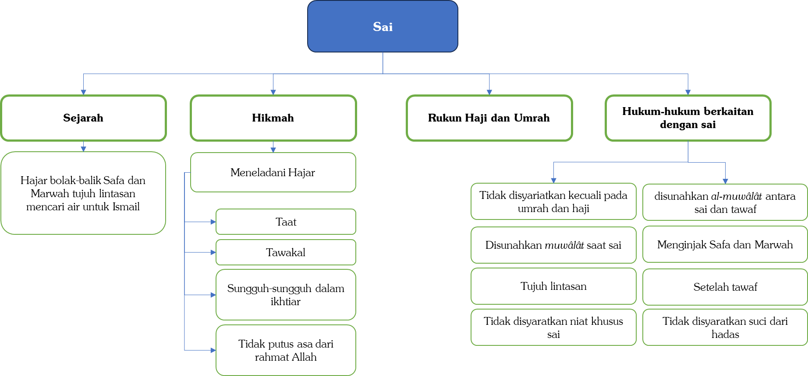

# 2.5.2 — Cara Melakukan Sai Sesuai Sunah

Berikut ini tata cara sai sebagaimana yang dicontohkan oleh Nabi ﷺ.

Ketika menuju bukit Shafa untuk memulai sai, disunahkan membaca firman Allah ﷻ,

```arabic
﴿إِنَّ ٱلصَّفَا وَٱلۡمَرۡوَةَ مِن شَعَآئِرِ ٱللَّهِۖ﴾
```

“Sesungguhnya Shafa dan Marwah adalah sebagian dari syiar Allah.” (QS. Al-Baqarah: 158)

Setelah itu membaca,

```arabic
((أَبْدَأُ بِمَا بَدَأَ اللهُ بِهِ))
```

“Aku mulai dengan apa yang Allah mulai terlebih dahulu.”[^109]

Penting untuk diketahui bahwa ayat dan ucapan ini hanya dibaca sekali, yaitu di awal sai ketika hendak naik ke bukit Shafa. Tidak dibaca setiap kali naik ke Shafa maupun Marwah pada putaran-putaran berikutnya.[^110]

Ketika berada di atas bukit Shafa, menghadaplah ke kiblat, yaitu dengan melihat Ka’bah secara langsung jika memungkinkan, atau mengikuti arah ubin yang mengarah ke Ka’bah. Kemudian bertakbir tiga kali,

```arabic
اللهُ أَكْبَرُ، اللهُ أَكْبَرُ، اللهُ أَكْبَرُ
```

Lalu membaca zikir,

```arabic
لَا إِلَهَ إِلَّا اللهُ وَحْدَهُ لَا شَرِيكَ لَهُ، لَهُ الْمُلْكُ وَلَهُ الْحَمْدُ وَهُوَ عَلَى كُلِّ شَيْءٍ قَدِيرٌ، لَا إِلَهَ إِلَّا اللهُ وَحْدَهُ، أَنْجَزَ وَعْدَهُ، وَنَصَرَ عَبْدَهُ، وَهَزَمَ الْأَحْزَابَ وَحْدَهُ
```

“Tiada sesembahan yang berhak disembah selain Allah semata, tiada sekutu bagi-Nya. Milik-Nya segala kerajaan dan bagi-Nya segala pujian, dan Dia Mahakuasa atas segala sesuatu.

Tiada sesembahan yang berhak disembah selain Allah semata. Dia telah menepati janji-Nya, menolong hamba-Nya, dan mengalahkan golongan-golongan (musuh) dengan sendirian.”

Kemudian mengangkat kedua tangan dan berdoa dengan doa apa saja yang dikehendaki. Setelah itu membaca kembali zikir di atas, lalu berdoa lagi, lalu membaca zikir tersebut untuk ketiga kalinya.[^111]

Ringkasnya, yang dilakukan di atas bukit Shafa dan Marwah adalah: bertakbir tiga kali, lalu zikir, lalu doa, lalu zikir, lalu doa, lalu zikir. Jadi zikirnya dibaca tiga kali dan diselingi doa dua kali.

Setelah itu turun dari bukit Shafa menuju bukit Marwah sambil berzikir dan berdoa dengan doa bebas.

Ketika melewati area antara dua lampu hijau, bagi laki-laki disunahkan untuk berlari-lari kecil.([^112]) Setelah melewati lampu hijau, kembali berjalan seperti biasa. Sunah ini hanya berlaku bagi kaum pria. Adapun wanita, tetap berjalan biasa meskipun berada di antara dua lampu hijau.[^113]

Ketika melewati area dua lampu hijau tersebut, boleh membaca doa yang dibaca oleh Ibnu Mas'ud dan Ibnu Umar radhiyallâhu ‘anhumâ,

```arabic
اللهُمَّ اغْفِرْ وَارْحَمْ، وَأَنْتَ الَاعَزُّ الَاكْرَمُ
```

“Ya Allah, ampunilah dan rahmatilah aku. Engkau adalah Yang Maha Mulia lagi Maha Pemurah.” [^114]

Ketika tiba di bukit Marwah, lakukan hal yang sama seperti yang dilakukan di bukit Shafa. [^115] Dengan demikian selesailah lintasan pertama.

Selanjutnya turun kembali menuju Shafa, dan seterusnya hingga lintasan ketujuh yang berakhir di bukit Marwah. Maka selesailah sai.

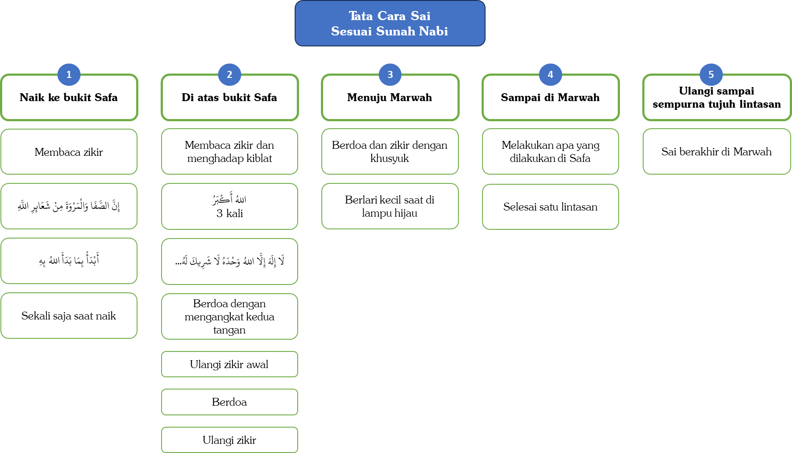

# 2.5.3 — Kesalahan-kesalahan Seputar Sai

Ada beberapa kekeliruan yang sering terjadi ketika jemaah melaksanakan sai dan perlu untuk diperhatikan.

Pertama, mengerjakan sai sunah sebagaimana mengerjakan tawaf sunah. Padahal sai sunah tidak disyariatkan.

Kedua, selalu membaca ayat “Innash-Shafâ wal-Marwata min sya’â`irillâh” setiap kali sampai di bukit Shafa maupun Marwah. Padahal ayat ini hanya dibaca sekali, yaitu ketika pertama kali menuju bukit Shafa di awal sai.

Ketiga, berzikir secara berjemaah dengan suara keras, karena hal ini sangat mengganggu jemaah yang lain.

Keempat, bagi yang sedang sai umrah masih tetap melakukan idhthibâ’ (membuka bahu kanan ketika berihram). Padahal idhthiba’ hanya disyariatkan ketika tawaf qudum atau tawaf umrah, bukan ketika sai.

Kelima, melakukan salat dua rakaat setelah sai sebagaimana setelah tawaf. Ini adalah bidah yang tidak ada dasarnya dalam agama.

Keenam, memulai sai dari bukit Marwah menuju bukit Shafa. Jika sai dimulai dari Marwah maka putaran pertama ini tidak sah dan tidak dihitung.

Ketujuh, sebagian wanita yang rambutnya atau lehernya tersingkap karena langsung bertahalul di bukit Marwah setelah sai selesai, tanpa memastikan aurat tertutup terlebih dahulu.

Kedelapan, sebagian wanita ikut berlari-lari kecil ketika berada di antara dua lampu hijau, padahal sunah berlari-lari kecil hanya berlaku bagi kaum pria.

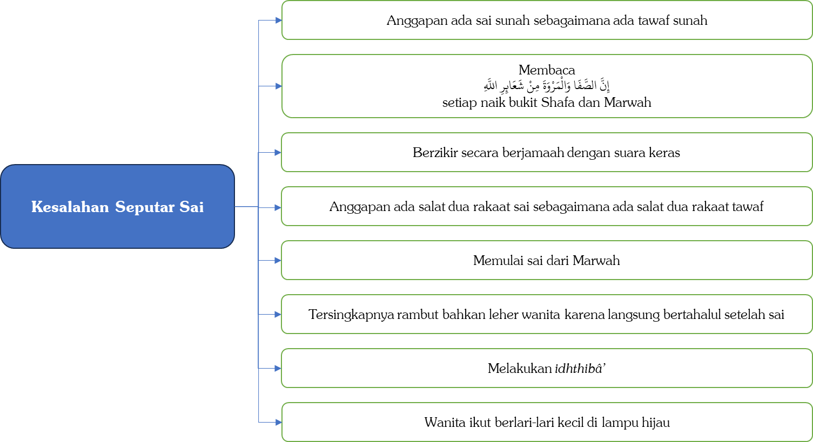

# 2.6 — Gundul atau Mencukur Pendek Rambut Kepala

# 2.6.1 — Penjelasan

Pertama, menggundul kepala lebih utama daripada sekadar mencukur pendek. Dalilnya adalah firman Allah ﷻ,

```arabic
﴿لَتَدۡخُلُنَّ ٱلۡمَسۡجِدَ ٱلۡحَرَامَ إِن شَآءَ ٱللَّهُ ءَامِنِينَ مُحَلِّقِينَ رُءُوسَكُمۡ وَمُقَصِّرِينَ﴾
```

"Sesungguhnya kamu pasti akan memasuki Masjidilharam, insya Allah dalam keadaan aman, dengan mencukur gundul kepala dan memotong pendek rambut kalian." (QS. Al-Fath: 27)

Perhatikan bahwa Allah mendahulukan penyebutan orang-orang yang gundul sebelum yang mencukur pendek. Ini adalah isyarat akan keutamaannya.

Ibnu Umar radhiyallâhu ‘anhu meriwayatkan,

```arabic
أَنَّ رَسُولَ اللَّهِ ﷺ قَالَ: ((اللَّهُمَّ ارْحَمِ الْمُحَلِّقِينَ)). قَالُوا: وَالْمُقَصِّرِينَ يَا رَسُولَ اللَّهِ؟ قَالَ: ((اللَّهُمَّ ارْحَمِ الْمُحَلِّقِينَ)). قَالُوا: وَالْمُقَصِّرِينَ يَا رَسُولَ اللَّهِ؟ قَالَ: ((وَالْمُقَصِّرِينَ))
```

"Rasulullah ﷺ berdoa, 'Ya Allah, rahmatilah orang-orang yang gundul.'

Para sahabat yang mencukur pendek berkata, 'Yang mencukur pendek juga, wahai Rasulullah?'

Nabi kembali berdoa, 'Ya Allah, rahmatilah orang-orang yang gundul.'

Mereka berkata lagi, 'Yang mencukur pendek juga, wahai Rasulullah?'

Barulah Nabi bersabda, 'Dan yang mencukur pendek.'" [^116]

Dalam hadis Abu Hurairah, Nabi ﷺ mendoakan yang gundul dengan,

```arabic
((اللَّهُمَّ اغْفِرْ لِلْمُحَلِّقِينَ))
```

“Ya Allah, ampunilah yang gundul.” sebanyak tiga kali, dan baru pada kali ketiga beliau mendoakan ampunan juga bagi yang mencukur pendek.[^117]

Nabi Muhammad ﷺ mendoakan yang gundul dua hingga tiga kali, sementara yang mencukur pendek hanya sekali. An-Nawawi berkata, “Ijmak bahwa gundul lebih utama.”[^118]

Namun keutamaan menggundul ini hanya berlaku bagi laki-laki. Adapun wanita, Nabi ﷺ bersabda,

```arabic
((لَيْسَ عَلَى النِّسَاءِ حَلْقٌ، إِنَّمَا عَلَى النِّسَاءِ التَّقْصِيرُ))
```

“Tidak ada kewajiban gundul bagi wanita. Yang wajib bagi mereka hanyalah mencukur pendek.”[^119]

Bagi wanita, cukup memotong ujung rambutnya sepanjang satu ruas jari.[^120] Jika bisa mengumpulkan seluruh rambutnya lalu memotong seruas jari sekaligus, maka itu sudah cukup. Jika tidak, maka ia mencukur ujung-ujung rambutnya dari beberapa sisi secara merata sepanjang seruas jari.

Kedua, para ulama telah sepakat bahwa mencukur atau menggundul dari seluruh bagian kepala adalah yang terbaik. Namun mereka berselisih tentang kadar minimal yang wajib dicukur.[^121] Yang lebih berhati-hati adalah menggundul atau mencukur pendek dari seluruh sisi kepala.

Ketiga, disunahkan untuk mencukur atau menggundul bagian kanan kepala terlebih dahulu, baru kemudian bagian kiri.[^122]

Keempat, meskipun gundul lebih utama, bagi seseorang yang melaksanakan umrah Tamattu’ menjelang haji sebaiknya tidak menggundul kepalanya. Cukup mencukur pendek saja agar rambutnya masih tersisa untuk digundul pada tanggal 10 Zulhijah.[^123]

# 2.6.2 — Kesalahan-kesalahan Seputar Tahalul

Pertama, tidak benar anggapan yang berkembang di masyarakat bahwa yang boleh mencukur hanyalah orang yang sudah bertahalul. Bahkan seseorang boleh mencukur kepalanya sendiri dan itu sah.

Kedua, sebagian wanita langsung mencukur rambutnya di bukit Marwah begitu selesai sai sehingga rambutnya tersingkap. Padahal rambut adalah aurat yang wajib dijaga.

Ketiga, sebagian jemaah laki-laki begitu sampai di Marwah langsung mencukur sedikit rambutnya dengan niat akan melanjutkan gundul di salon. Ini hanya pekerjaan yang sia-sia. Hendaknya langsung saja menuju salon untuk mencukur pendek atau menggundul kepala di sana.

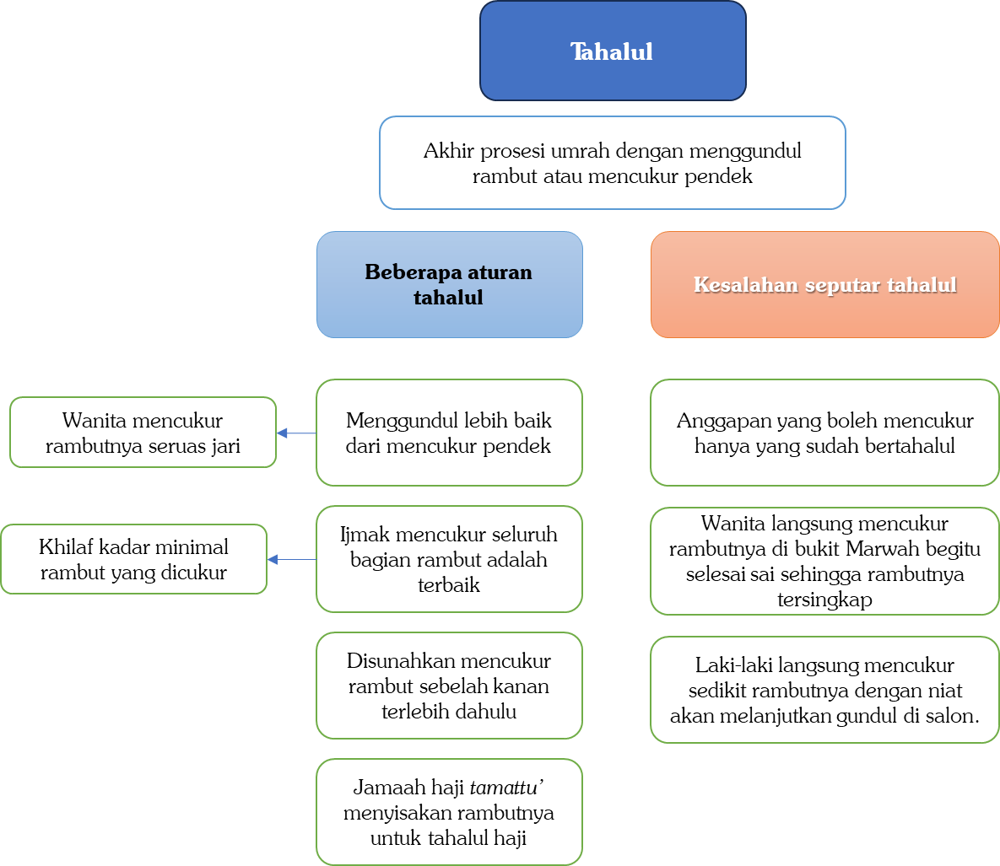

# 3.1 — Haji Tamattu’

# 3.1.1 — Penjelasan

Haji Tamattu’ adalah haji yang pelaksanaannya dimulai dengan umrah terlebih dahulu, baru kemudian haji. Hanya saja umrah Tamattu’ hanya boleh dikerjakan pada bulan-bulan haji, yaitu Syawal, Zulkaidah, dan Zulhijah. Jika seseorang berumrah di bulan Ramadan lalu menetap di Makkah untuk menunggu haji, maka umrah tersebut tidak dianggap sebagai umrah Tamattu’ karena dikerjakan di luar bulan-bulan haji.

Kata Tamattu’ dalam bahasa Arab berarti bersenang-senang atau berlezat-lezatan. Disebut demikian karena dua alasan:

Pertama, setelah selesai umrah ia bertahalul, dan selama menunggu waktu haji ia boleh memakai pakaian biasa, memakai wewangian, dan menggauli istrinya.

Kedua, dalam satu perjalanan ia bisa sekaligus menunaikan haji dan umrah tanpa perlu bersafar lagi untuk umrah di lain waktu.

Orang yang berhaji Tamattu’ wajib menyembelih hewan hadyu. Allah ﷻ berfirman,

```arabic
﴿فَمَن تَمَتَّعَ بِٱلۡعُمۡرَةِ إِلَى ٱلۡحَجِّ فَمَا ٱسۡتَيۡسَرَ مِنَ ٱلۡهَدۡيِۚ﴾
```

"Maka bagi siapa yang ingin mengerjakan umrah sebelum haji, wajib menyembelih hadyu yang mudah didapat." (QS. Al-Baqarah: 196)

# 3.1.2 — Umrah

(lihat kembali nomor 2)

# 3.1.3 — Menetap di Makkah

Setelah melaksanakan umrah Tamattu’, jemaah menunggu di Makkah hingga tiba waktu haji pada tanggal 8 Zulhijah. Selama masa menunggu ini, hendaknya jemaah menjaga kesehatan dan memperhatikan asupan gizi sebagai persiapan menghadapi hari-hari haji yang cukup melelahkan.

Hendaknya waktu luang diisi dengan ibadah, namun jangan terlalu memaksakan diri hingga kelelahan. Dikhawatirkan ketika hari pelaksanaan haji tiba, kondisi tubuh sudah tidak prima. Selama masa ini jemaah boleh memakai wewangian, berpakaian seperti biasa, dan menggauli istri, karena mereka tidak sedang dalam keadaan berihram.

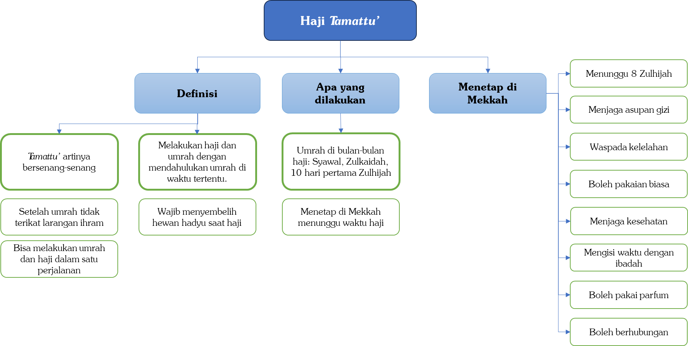

# 3.1.4 — Pelaksanaan Haji

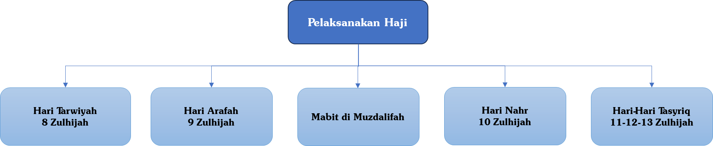

# 3.1.4.1 — Hari Tarwiyah

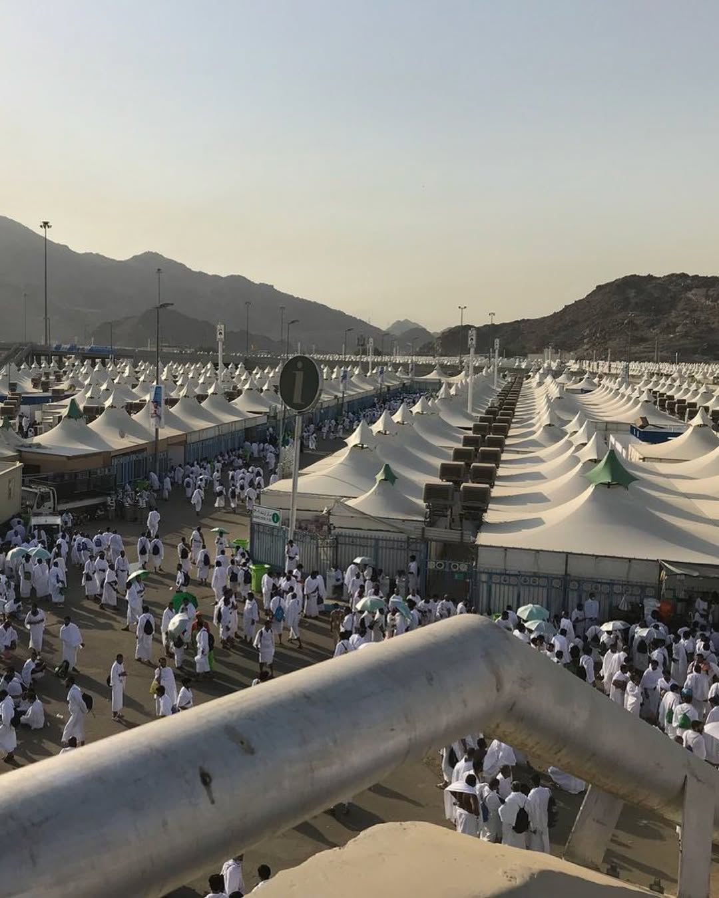

At-Tarwiyah secara bahasa berarti mengangkut air untuk persediaan menghilangkan dahaga. Nama ini muncul karena di zaman dahulu Mina tidak memiliki sumber air, sehingga para jemaah haji harus membawa air dari Makkah untuk dibawa ke sana.

Berikut ini hal-hal yang perlu diperhatikan pada hari Tarwiyah.

Pertama, disunahkan untuk mempersiapkan diri sebelum berihram, yaitu dengan mencukur bulu kemaluan, mencabut bulu ketiak, dan memotong kuku agar setelah berihram tidak perlu melakukan semua itu lagi. Hendaknya juga mandi sebelum berihram.

Kedua, bagi laki-laki disunahkan memakai wewangian di tubuh dan rambut sebelum berihram. Adapun wanita tidak boleh memakai wewangian, kecuali sekadar penghilang bau badan atau bedak ringan yang wanginya tidak tercium dari luar.

Ketiga, kain ihram bagi laki-laki maupun pakaian ihram bagi wanita tidak boleh diberi wewangian.

Keempat, kemudian berniat masuk dalam ihram dengan mengucapkan “Labbaik Allâhumma hajjan.” Bagi yang menghajikan orang lain, ditambahkan: “Labbaik Allâhumma hajjan ‘an fulân.”

Kelima, berihram dilakukan dari hotel masing-masing dan tidak perlu pergi ke Masjidilharam.

Keenam, berangkat menuju Mina di waktu duha sambil memperbanyak talbiah.

Ketujuh, hukum pergi ke Mina dan mabit di sana pada tanggal 8 Zulhijah adalah sunah, bukan wajib. Jika jemaah haji Indonesia terikat dengan aturan maktab dan tidak bisa ke Mina pada tanggal 8, maka tidak mengapa langsung menuju Arafah.

Catatan penting: sebagian jemaah pada tanggal 8 sudah berangkat ke padang Arafah, bahkan bermalam di sana. Mereka boleh berihram pada tanggal 8, atau berihram di pagi hari Arafah tanggal 9 Zulhijah. Sebaliknya, sebagian jemaah justru berangkat ke Mina pada tanggal 7 siang untuk menghindari kemacetan. Mereka boleh berihram pada tanggal 7 ketika berangkat, namun lebih baik jika berihram di Mina ketika waktu duha tanggal 8 Zulhijah.

Kedelapan, di Mina disunahkan untuk salat Zuhur, Asar, Magrib, Isya, dan Subuh pada waktunya masing-masing dengan diqasar tanpa dijamak. Salat Zuhur dikerjakan pada waktunya sebanyak dua rakaat, asar dua rakaat pada waktunya, magrib tiga rakaat pada waktunya, isya dua rakaat pada waktunya, dan subuh dua rakaat pada waktunya.

Kesembilan, di Mina para jemaah tidak dianjurkan mengerjakan salat sunah rawatib, kecuali dua rakaat sebelum subuh karena Nabi ﷺ tidak pernah meninggalkannya meskipun dalam perjalanan. Adapun salat sunah lainnya, seperti salat duha, salat malam, dan salat witir, boleh tetap dikerjakan.

Kesepuluh, jika di Mina bertepatan dengan hari Jumat, maka salat Jumat tidak didirikan karena para jemaah berstatus musafir.

Kesebelas, pada malam harinya jemaah bermalam di Mina. Waktu minimalnya adalah setengah malam, dan bermalam hingga subuh lebih utama sesuai sunah Nabi ﷺ.

Kedua belas, hendaknya para jemaah mengisi waktu mereka dengan ibadah yang bermanfaat, seperti talbiah, membaca al-Qur`an, berzikir, mendengarkan pengajian, dan salat malam. Terlebih lagi hari Tarwiyah adalah bagian dari sepuluh hari pertama Zulhijah yang mana beramal saleh pada hari-hari tersebut sangat dicintai Allah. Nabi ﷺ bersabda,

```arabic
((مَا الْعَمَلُ فِي أَيَّامٍ أَفْضَلَ مِنْهَا فِي هَذِهِ)) قَالُوا: وَلَا الْجِهَادُ؟ قَالَ: ((وَلَا الْجِهَادُ، إِلَّا رَجُلٌ خَرَجَ يُخَاطِرُ بِنَفْسِهِ وَمَالِهِ فَلَمْ يَرْجِعْ بِشَيْءٍ))
```

“Tidak ada amal saleh di hari-hari mana pun yang lebih utama daripada di hari-hari ini (sepuluh hari pertama Zulhijah).”

Para sahabat bertanya, "Tidak juga jihad?"

Nabi menjawab, "Tidak juga jihad, kecuali seseorang yang keluar mempertaruhkan nyawa dan hartanya lalu tidak kembali dengan sesuatu pun, yakni nyawa dan hartanya melayang karena syahid." [^124]

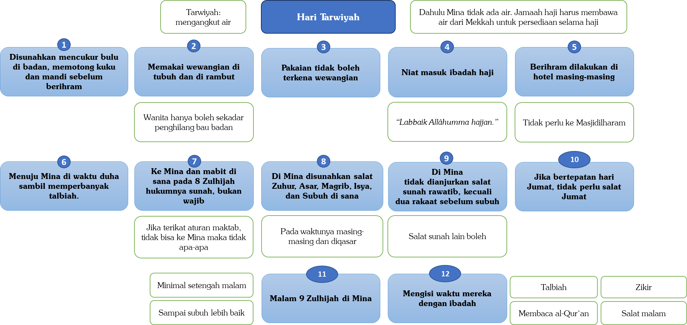

# 3.1.4.2 — Hari Arafah

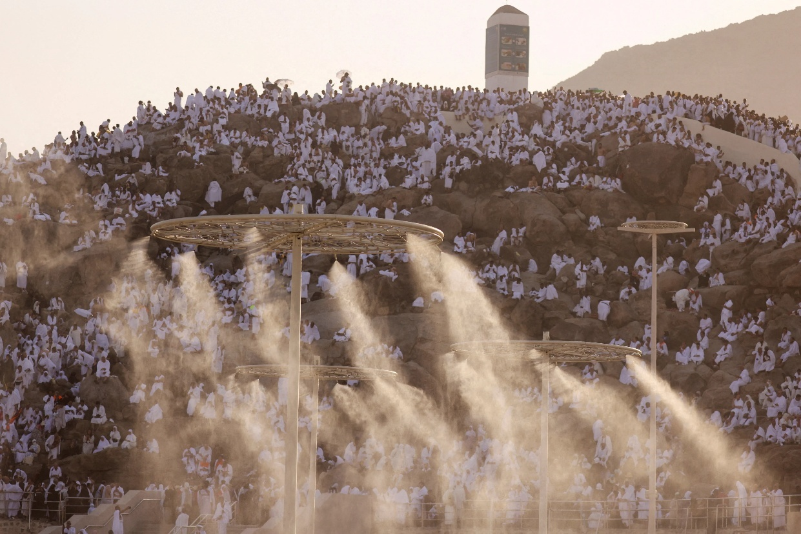

Hari Arafah adalah tanggal 9 Zulhijah. Inilah hari yang paling agung dalam seluruh rangkaian ibadah haji, bahkan dalam satu tahun penuh.

1. Keutamaan hari Arafah

Hari Arafah memiliki banyak keutamaan yang luar biasa.

Pertama, ini adalah hari di mana Allah ﷻ paling banyak membebaskan hamba-Nya dari neraka.

Kedua, hari di mana Allah ﷻ membanggakan jemaah haji di hadapan para malaikat.

Ketiga, hari di mana Allah turun ke langit dunia mendekat kepada para jemaah yang sedang wukuf.

Nabi ﷺ bersabda,

```arabic
((مَا مِنْ يَوْمٍ أَكْثَرَ مِنْ أَنْ يُعْتِقَ اللهُ فِيهِ عَبْدًا مِنَ النَّارِ مِنْ يَوْمِ عَرَفَةَ، وَإِنَّهُ لَيَدْنُو ثُمَّ يُبَاهِي بِهِمُ الْمَلَائِكَةَ فَيَقُولُ: مَا أَرَادَ هَؤُلَاءِ؟))
```

"Tidak ada hari yang paling banyak Allah membebaskan hamba-Nya dari neraka selain hari Arafah. Dan sesungguhnya Allah mendekat, lalu membanggakan para jemaah haji kepada para malaikat seraya berkata, 'Apa yang diinginkan oleh mereka?'" [^125]

Nabi ﷺ juga bersabda,

```arabic
فَإِذَا وَقَفَ بِعَرَفَةَ فَإِنَّ اللَّهَ عَزَّ وَجَلَّ يَنْزِلُ إِلَى السَّمَاءِ الدُّنْيَا فَيَقُولُ: انْظُرُوا إِلَى عِبَادِي شُعْثًا غُبْرًا، اشْهَدُوا أَنِّي قَدْ غَفَرْتُ لَهُمْ ذُنُوبَهُمْ وَإِنْ كَانَ عَدَدَ قَطْرِ السَّمَاءِ وَرَمْلِ عَالِجٍ
```

"Jika ia wukuf di Arafah, maka Allah turun ke langit dunia dan berfirman, 'Lihatlah hamba-hamba-Ku yang datang memenuhi panggilan-Ku dalam keadaan rambut semrawut dan penuh debu. Saksikanlah, sesungguhnya Aku telah mengampuni dosa-dosa mereka meskipun sebanyak butiran air hujan dan butiran pasir yang menjulang.’" [^126]

Allah Maha kaya, sama sekali tidak membutuhkan haji para jemaah, tidak membutuhkan kelelahan mereka, tidak membutuhkan apa pun dari hamba-Nya. Namun Allah membanggakan para jemaah di padang Arafah kepada para malaikat sebagai bentuk pemuliaan terhadap mereka.

Keempat, pada hari Arafah turun ayat tentang sempurnanya Islam. Dari Umar bin Al-Khaththab radhiyallâhu ‘anhu, bahwa seorang Yahudi berkata kepadanya, “Wahai Amirul mukminin, ada sebuah ayat dalam kitab suci kalian yang kalian baca. Seandainya ayat itu turun kepada kami kaum Yahudi, tentu kami jadikan hari turunnya sebagai hari raya.”

Umar bertanya, “Ayat yang mana?”

Ia menjawab,

```arabic
ﵟٱلۡيَوۡمَ أَكۡمَلۡتُ لَكُمۡ دِينَكُمۡ وَأَتۡمَمۡتُ عَلَيۡكُمۡ نِعۡمَتِي وَرَضِيتُ لَكُمُ ٱلۡإِسۡلَٰمَ دِينٗاۚﵞ
```

“Pada hari ini telah Kusempurnakan bagi kalian agama kalian, dan telah Ku-cukupkan kepada kalian nikmat-Ku, serta telah Kuridai Islam itu menjadi agama kalian.” (QS. Al-Mâ'idah: 3).

Umar berkata, “Kami telah mengetahui hari itu dan tempat diturunkannya ayat tersebut kepada Nabi ﷺ, yaitu ketika beliau wukuf di Arafah pada hari Jumat.” [^127]

Lihatlah, orang Yahudi saja mengerti betapa agungnya hari Arafah, hari diturunkannya ayat tentang sempurnanya nikmat Allah dan sempurnanya Islam, sampai-sampai mereka berkata bahwa jika ayat itu turun di kalangan mereka, tentu akan dijadikan hari raya.[^128]

Kelima, hari Arafah disebut dengan masyhûd, hari yang dipersaksikan. Allah bersumpah dengan hari ini dalam firman-Nya,

```arabic
ﵟوَشَاهِدٖ وَمَشۡهُودٖﵞ
```

"Demi yang menyaksikan dan demi yang dipersaksikan." (QS. Al-Burûj: 3)

Nabi ﷺ bersabda,

```arabic
((وَالْيَوْمُ الْمَشْهُودُ يَوْمُ عَرَفَةَ، وَالشَّاهِدُ يَوْمُ الْجُمُعَةِ))
```

"Hari yang dipersaksikan adalah hari Arafah, dan yang menyaksikan adalah hari Jumat." ([^129])

Keenam, jemaah haji tidak disunahkan berpuasa pada hari Arafah, karena mereka sedang menunaikan ibadah yang lebih mulia, yaitu wukuf yang merupakan rukun haji. Puasa justru dapat melemahkan jemaah sehingga tidak maksimal dalam berdoa dan berzikir.

Adapun bagi yang tidak berhaji, puasa di hari Arafah akan menghapus dosa setahun sebelumnya dan setahun sesudahnya. Nabi ﷺ bersabda,

```arabic
((صِيَامُ يَوْمِ عَرَفَةَ أَحْتَسِبُ عَلَى اللهِ أَنْ يُكَفِّرَ السَّنَةَ الَّتِي قَبْلَهُ وَالسَّنَةَ الَّتِي بَعْدَهُ))
```

"Puasa hari Arafah, aku berharap kepada Allah agar menghapus dosa setahun sebelumnya dan dosa setahun sesudahnya." [^130]

Jika orang yang tidak berhaji saja bisa mendapat ampunan dosa hanya dengan berpuasa, lantas bagaimana lagi dengan jemaah haji yang langsung memohon ampunan di padang Arafah?

Ketujuh, hari Arafah adalah siang terbaik sepanjang tahun,[^131] sebagaimana malam Lailatul Qadar adalah malam terbaik sepanjang tahun.

1. Memastikan berada di dalam batas Arafah

Seseorang yang hendak wukuf harus memastikan ia benar-benar berada di dalam padang Arafah. Di sana telah dipasang plakat dan papan penanda yang menunjukkan batas-batas Arafah.

Alhamdulillâh, seluruh tenda jemaah haji yang resmi, termasuk tenda jemaah haji Indonesia, berada di dalam kawasan Arafah. Bagi yang wukuf di Masjid Namirah perlu berhati-hati, karena hanya sekitar sepertiga bagian belakang masjid yang termasuk wilayah Arafah. Jangan sampai wukuf di bagian depan atau tengah masjid.

Jemaah haji tidak perlu jauh-jauh mencari Jabal ar-Rahmah karena lokasinya jauh dari tenda jemaah Indonesia, dan naik ke sana pun tidak disyariatkan.[^132] Yang terpenting adalah memastikan berada di dalam batas Arafah. Barang siapa wukuf di luar batas Arafah hingga habis waktunya, maka hajinya tidak sah.

1. Waktu wukuf

Wukuf di Arafah hanya sah jika dilakukan pada waktu yang disyariatkan. Waktu mulai wukuf, menurut jumhur ulama, adalah sejak masuk waktu zuhur. [^133] Karena itu, jika jemaah sudah tiba di Arafah sejak pagi hari, sebaiknya beristirahat terlebih dahulu agar ketika waktu zuhur tiba mereka kuat untuk berdoa dan tidak mengantuk hingga magrib.

Adapun akhir waktu wukuf adalah hingga terbit fajar hari an-Nahr, tanggal 10 Zulhijah.

Bagi yang tidak ada halangan, hendaknya wukuf dari waktu zuhur hingga terbenam matahari. Jika seseorang keluar dari Arafah sebelum matahari terbenam namun kemudian kembali lagi meskipun sudah malam, ia tidak perlu membayar dam. Namun jika ia keluar sebelum matahari terbenam dan tidak kembali sama sekali, maka ia wajib membayar dam. Yang lebih berhati-hati dan sesuai sunah adalah wukuf dari zuhur hingga matahari terbenam.

Bagi yang berhalangan,[^134] tidak mengapa wukuf di malam hari, yang penting sebelum terbit fajar.

1. Salat di Arafah

Disunahkan bagi imam untuk berkhotbah setelah masuk waktu Zuhur dan sebelum salat. Setelah khotbah baru kemudian azan,([^135]) lalu ikamah, lalu salat Zuhur dua rakaat, lalu ikamah lagi, kemudian salat asar dua rakaat (jamak takdim).[^136] Setelah selesai salat, jemaah haji memulai wukuf dengan memperbanyak doa dan zikir kepada Allah.

1. Bersuci saat wukuf

Disunahkan untuk wukuf dan berdoa dalam keadaan suci, bahkan disunahkan untuk mandi sebelum wukuf.[^137] Namun jika dalam keadaan tidak suci pun, wukufnya tetap sah berdasarkan kesepakatan para ulama. Maka orang yang junub, wanita yang haid dan nifas, wukufnya tetap sah.[^138]

1. Posisi saat wukuf

Nabi ﷺ wukuf di atas untanya, sehingga sebagian ulama berpendapat bahwa wukuf di atas kendaraan lebih utama karena lebih memudahkan untuk berdoa. Sebagaimana jemaah haji dianjurkan untuk tidak berpuasa pada hari itu agar lebih kuat berdoa.[^139]

Sebagian ulama memandang bahwa hal ini kembali kepada kondisi masing-masing Jika seseorang lebih khusyuk berdoa ketika di dalam kendaraan, maka lebih utama di kendaraan. Jika sebaliknya lebih khusyuk di kemah, maka di kemah lebih utama baginya.[^140]

1. Mengangkat tangan saat berdoa

Disunahkan berdoa dengan mengangkat kedua tangan. Usamah bin Zaid radhiyallâhu ‘anhumâ berkata,

```arabic
كُنْتُ رَدِيفَ النَّبِيِّ ﷺ بِعَرَفَاتٍ فَرَفَعَ يَدَيْهِ يَدْعُو فَمَالَتْ بِهِ نَاقَتُهُ فَسَقَطَ خِطَامُهَا فَتَنَاوَلَ الْخِطَامَ بِإِحْدَى يَدَيْهِ وَهُوَ رَافِعٌ يَدَهُ الْأُخْرَى
```

"Aku dibonceng di belakang Nabi ﷺ di padang Arafah. Beliau berdoa sambil mengangkat kedua tangannya. Lalu unta beliau bergerak memiringkan beliau dan tali kekangnya terjatuh. Maka beliau mengambil tali kekang dengan salah satu tangan, sementara tangan yang lain tetap beliau angkat untuk berdoa." [^141]

Lihatlah betapa semangatnya Nabi ﷺ berdoa hingga tetap mengangkat satu tangan meskipun tangan yang lain harus memegang tali kekang untanya.

1. Doa dan zikir di Arafah

Nabi ﷺ tidak menetapkan doa atau zikir khusus di Arafah, kecuali satu zikir yang paling sering beliau ucapkan pada hari itu. Abdullah bin 'Amr bin Al-'Ash radhiyallâhu ‘anhumâ berkata,

```arabic
كَانَ أَكْثَرُ دُعَاءِ رَسُولِ اللهِ ﷺ يَوْمَ عَرَفَةَ: لَا إِلَهَ إِلَّا اللهُ وَحْدَهُ لَا شَرِيكَ لَهُ، لَهُ الْمُلْكُ وَلَهُ الْحَمْدُ، بِيَدِهِ الْخَيْرُ، وَهُوَ عَلَى كُلِّ شَيْءٍ قَدِيرٌ
```

"Doa Rasulullah ﷺ yang paling banyak beliau ucapkan pada hari Arafah adalah: Lâ ilâha illallâhu wahdahu lâ syarîka lahu, lahul mulku walahul hamdu, biyadihil khairu, wa huwa 'alâ kulli syai'in qadîr." [^142]

Dalam riwayat lain Nabi ﷺ bersabda,

```arabic
((خَيْرُ الدُّعَاءِ دُعَاءُ يَوْمِ عَرَفَةَ، وَخَيْرُ مَا قُلْتُ أَنَا وَالنَّبِيُّونَ مِنْ قَبْلِي: لَا إِلَهَ إِلَّا اللَّهُ وَحْدَهُ لَا شَرِيكَ لَهُ، لَهُ الْمُلْكُ وَلَهُ الْحَمْدُ وَهُوَ عَلَى كُلِّ شَيْءٍ قَدِيرٌ))
```

"Sebaik-baik doa adalah doa di hari Arafah, dan sebaik-baik yang aku ucapkan dan juga para nabi sebelumku adalah: Lâ ilâha illallâhu wahdahu lâ syarîka lahu, lahul mulku walahul hamdu wa huwa 'alâ kulli syai'in qadîr." [^143]

Selain zikir ini, seorang jemaah haji bebas membaca doa apa saja, bertakbir, bertahlil, bertalbiah, dan zikir apa saja yang ia sukai hingga azan magrib.[^144]

1. Haji itu adalah Arafah

Ingatlah bahwa Nabi ﷺ telah bersabda,

```arabic
((الْحَجُّ عَرَفَةُ))
```

"Haji itu adalah Arafah." [^145]

Ibnu Hajar berkata tentang hadis ini: "Yaitu mayoritas amalan haji dan rukunnya yang terbesar adalah wukuf di Arafah."[^146]

Ini menunjukkan bahwa inti dari ibadah haji adalah wukuf di Arafah. Tujuan para jemaah mengeluarkan biaya yang besar, meninggalkan keluarga dan kampung halaman, serta meninggalkan pekerjaan adalah untuk bisa berdoa kepada Allah di padang Arafah. Maka hendaknya setiap jemaah benar-benar menyadari betapa bernilainya setiap detik dan menit di sana.

1. Doa di Arafah dikabulkan

Nabi ﷺ bersabda,

```arabic
((خَيْرُ الدُّعَاءِ دُعَاءُ يَوْمِ عَرَفَةَ))
```

"Sebaik-baik doa adalah doa di hari Arafah."

Ibnu Abdilbarr berkata, "Di antara fikih hadis ini adalah bahwa doa di hari Arafah lebih utama dari doa di hari-hari lain... dan hadis ini juga menunjukkan bahwa doa pada hari Arafah secara dominan akan dikabulkan seluruhnya." [^147]

1. Syafaat bagi yang didoakan

Di antara bentuk pemuliaan Allah kepada para jemaah yang wukuf di Arafah adalah Allah menerima syafaat mereka untuk orang-orang yang mereka doakan. Nabi ﷺ bersabda,

```arabic
((وَأَمَّا وُقُوفُكَ عَشِيَّةَ عَرَفَةَ فَإِنَّ اللَّهَ تَبَارَكَ وَتَعَالَى يَهْبِطُ إِلَى سَمَاءِ الدُّنْيَا فَيُبَاهِي بِكُمُ الْمَلَائِكَةَ يَقُولُ: عِبَادِي جَاءُونِي شُعْثًا مِنْ كُلِّ فَجٍّ عَمِيقٍ يَرْجُونَ جَنَّتِي، فَلَوْ كَانَتْ ذُنُوبُكُمْ كَعَدَدِ الرَّمْلِ أَوْ كَقَطْرِ الْمَطَرِ أَوْ كَزَبَدِ الْبَحْرِ لَغَفَرْتُهَا، أَفِيضُوا عِبَادِي مَغْفُورًا لَكُمْ وَلِمَنْ شَفَعْتُمْ لَهُ))
```

"Adapun wukufmu di petang hari Arafah, maka sesungguhnya Allah Tabâraka wa Ta'âlâ turun ke langit dunia dan membanggakan kalian di hadapan para malaikat. Allah berkata, 'Hamba-hamba-Ku datang kepada-Ku dalam keadaan rambut semerawut dari segenap penjuru karena mengharapkan surga-Ku. Jika dosa kalian sebanyak butiran pasir, tetesan hujan, atau buih di lautan, maka Aku akan mengampuninya. Maka pergilah kalian dalam keadaan telah diampuni, begitu pula orang-orang yang kalian doakan.'" [^148]

Maka hendaknya seorang jemaah berbaik sangka kepada Allah ﷻ dan meyakini bahwa Allah ﷻ akan mengabulkan doanya di Arafah.

Abdullah bin al-Mubarak berkata,

```arabic
جِئْتُ إلَى سُفْيَانَ عَشِيَّةَ عَرَفَةَ وَهُوَ جَاثٍ عَلَى رُكْبَتَيْهِ وَعَيْنَاهُ تَهْمِلَانِ فَبَكَيْتُ فَالْتَفَتَ إِلَيَّ فَقَالَ: مَا شَأْنُكَ؟ فَقُلْتُ: مَنْ أَسْوَأُ هَذَا الْجَمْعِ حَالًا؟ قَالَ: الَّذِي يَظُنُّ أَنَّ اللَّهُ عَزَّ وَجَلَّ لَا يُغْفَرَ لَهُمْ
```

"Aku mendatangi Sufyan at-Tsauri di petang hari Arafah, sementara beliau sedang bertelekan di atas kedua lututnya dengan kedua mata mengalirkan air mata, maka aku pun menangis. Lalu beliau menoleh kepadaku dan berkata, 'Ada apa denganmu?'

Aku berkata, 'Siapakah orang yang paling buruk di antara kumpulan jemaah haji ini?'

Beliau menjawab, 'Orang yang berprasangka bahwa Allah tidak mengampuni mereka.'" [^149]

Al-Fudhail bin 'Iyâdh pernah wukuf di padang Arafah, lalu menyaksikan isak tangis para Ia berkata, "Menurut kalian, jika mereka semua pergi kepada seseorang lalu meminta satu dâniq (1/6 dirham), apakah orang itu akan menolak?" Mereka menjawab, "Tentu tidak." Al-Fudhail berkata, "Demi Allah, sungguh ampunan di sisi Allah jauh lebih mudah daripada seseorang memberikan satu dâniq kepada mereka."[^150]

Dalam hadis mursal dari Thalhah bin Ubaidillah al-Khuzâ'î bahwa Nabi ﷺ bersabda,

```arabic
((مَا رُئِيَ الشَّيْطَانُ يَوْمًا هُوَ أَصْغَرُ فِيهِ وَلَا أَدْحَرُ وَلَا أَحْقَرُ وَلَا أَغْيَظُ مِنْهُ فِي يَوْمِ عَرَفَةَ، وَمَا ذَلِكَ إِلَّا مِمَّا يَرَى مِنْ تَنَزُّلِ الرَّحْمَةِ وَتَجَاوُزِ اللهِ عَنِ الذُّنُوبِ الْعِظَامِ))
```

"Tidaklah terlihat setan pada suatu hari dalam keadaan paling kecil, paling terkalahkan, paling terhina, dan paling marah seperti pada hari Arafah. Dan tidaklah demikian melainkan karena ia menyaksikan rahmat Allah yang banyak turun dan Allah memaafkan dosa-dosa yang besar."[^151]

1. Beberapa peringatan penting

Ada beberapa hal yang perlu diperhatikan oleh para jemaah selama wukuf di Arafah.

Hendaknya semangat berdoa dengan doa-doa yang diajarkan Nabi ﷺ, karena doa-doa tersebut penuh berkah dan lebih mendorong untuk dikabulkan. Demikian pula doa-doa yang ada dalam al-Qur`an. Tentu boleh berdoa dengan bahasa Indonesia jika ingin mengungkapkan permohonan dengan lebih leluasa, namun tetap memperhatikan adab-adab berdoa.

Jika ada saudara yang menitipkan doa, hendaknya didoakan. Karena sebagaimana telah disebutkan, Allah juga mengabulkan syafaat jemaah haji yang mendoakan orang lain. Maka jangan batasi doa hanya untuk diri sendiri. Doakanlah kedua orang tua, saudara-saudara, kerabat, dan kaum muslimin secara umum, terlebih di zaman sekarang yang penuh dengan fitnah yang menimpa kaum muslimin di berbagai penjuru dunia.

Hendaknya berdoa secara sendiri-sendiri, karena itulah sunah Nabi ﷺ dan para sahabat ketika berdoa di Arafah.

Hendaknya ikhlas dalam berdoa. Banyak jemaah yang berpose sambil berdoa lalu berfoto atau ber-selfie. Ini perlu diwaspadai, karena dikhawatirkan doanya, wukufnya, bahkan hajinya terancam ria sehingga pahalanya hilang. Setan tidak peduli seberapa banyak seseorang beribadah, yang penting bagi setan adalah ibadah itu tidak diterima. Dan salah satu sebab ibadah tidak diterima adalah ria.

Hendaknya benar-benar memanfaatkan waktu. Jika sudah lelah berdoa, beralihlah ke zikir. Jangan membuang waktu dengan jalan-jalan, berfoto-foto, mengobrol, atau tidur hingga menjelang magrib. Tidak mengapa meminum kopi atau yang semisalnya untuk mengusir kantuk agar tetap kuat beribadah pada siang yang sangat mulia ini.

Waktu berdoa adalah hingga azan Magrib, maka hingga menjelang Magrib hendaknya tetap semangat berdoa. Jika sudah harus naik bus sebelum Magrib, teruslah berdoa di dalam bus. Siapa tahu doa di penghujung waktu itulah yang paling berkah.

Ketika berdoa, disunahkan menghadap ke kiblat, bukan menghadap Jabal ar-Rahmah. Sebagian jemaah sengaja menghadap Jabal ar-Rahmah saat berdoa, dan ini adalah kekeliruan.

1. Bertolak menuju Muzdalifah

Ketika azan Magrib berkumandang, jemaah bertolak dari Arafah menuju Muzdalifah. Selama dalam perjalanan, hendaknya terus bertalbiah dan berzikir. Disunahkan untuk berjalan dengan tenang. Jabir radhiyallâhu ‘anhu berkata,

```arabic
وَيَقُولُ بِيَدِهِ الْيُمْنَى: أَيُّهَا النَّاسُ، السَّكِينَةَ السَّكِينَةَ
```

"Nabi mengisyaratkan dengan tangan kanannya seraya berkata, 'Wahai manusia, berjalanlah dengan tenang, berjalanlah dengan tenang.'" [^152]

Demikian pula Ibnu Abbas radhiyallâhu ‘anhumâ meriwayatkan bahwa ketika Nabi ﷺ mendengar orang-orang memukul unta mereka dengan keras agar berjalan cepat, beliau bersabda,

```arabic
((أَيُّهَا النَّاسُ عَلَيْكُمْ بِالسَّكِينَةِ فَإِنَّ الْبِرَّ لَيْسَ بِالإِيضَاعِ))
```

"Wahai manusia, hendaklah kalian tenang. Sesungguhnya kebaikan bukan dengan tergesa-gesa." [^153]

Ibnu Hajar berkata,

```arabic
فَبَيَّنَ ﷺ أَنَّ تَكَلُّفَ الْإِسْرَاعِ فِي السَّيْرِ لَيْسَ مِنَ الْبِرَّ أَيْ مِمَّا يُتَقَرَّبُ بِهِ وَمِنْ هَذَا أَخَذَ عُمَرُ بْنُ عَبْدِ الْعَزِيزِ قَوْلَهُ لَمَّا خَطَبَ بِعَرَفَةَ لَيْسَ السَّابِقُ مَنْ سَبَقَ بَعِيرُهُ وَفَرَسُهُ وَلَكِنَّ السَّابِقَ مَنْ غُفِرَ لَهُ
```

"Nabi ﷺ menjelaskan bahwa berusaha berjalan cepat-cepat bukanlah kebaikan, yakni bukan perkara yang mendekatkan diri kepada Allah. Dari sinilah Umar bin Abdul Aziz mengambil perkataannya ketika berkhotbah di Arafah, 'Bukanlah orang yang terdepan itu adalah yang untanya atau kudanya paling di depan, melainkan orang yang terdepan adalah yang paling banyak diampuni dosanya.'" [^154]

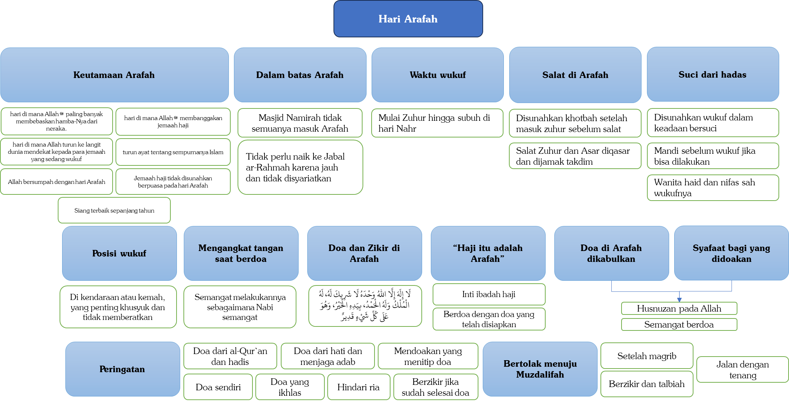

---

[^1]: Lihat: Adhwâ` al-Bayân (5/13).
[^2]: Lihat: Liqâ` al-Bâb al-Maftûh, al-‘Utsaimin (17/90).
[^3]: HR. Al-Hakim, No. 2375 dan al-Baihaqi dalam as-Sunan al-Kubrâ, No. 9783, melalui jalur al-Imam al-Hakim dan disahihkan olehnya. Beliau berkata, “Ini adalah hads orang-orang yang tsiqah dan perawinya adalah para hafiz”. Disepakai oleh adz-Dzahabi, dan juga disahihkan oleh al-Baihaqi.
[^4]: Lihat: Majmû’ Fatâwâ wa Rasâ`il as-Syaikh al-‘Utsaimîn (22/179-180).
[^5]: Lihat: Al-Mughnî, Ibnu Qudamah (3/311-312).
[^6]: HR. Al-Bukhari, No. 1536, 1789 dan Muslim, No. 1180.
[^7]: Fath al-Bârî (3/395).
[^8]: HR. Al-Bukhari, No. 4190 dan Muslim, No. 1201.
[^9]: HR. Al-Bukhari, No. 4991.
[^10]: Diriwayatkan oleh Al-Bazzar dalam musnadnya No. 6158 dan ath-Thabrani di al-Mu’jam al-Ausath No. 8046 dan al-Mu’jam al-Kabîr No. 14034 dengan tambahan, وَحِينَ يَدْخُلُ مَكَّةَ “Mandi tatkala masuk kota Makkah.” Al-Haitsami berkata, وَرِجَالُ الْبَزَّارِ ثِقَاتٌ كُلُّهُمْ “Semua perawi dalam riwayat al-Bazzar adalah tsiqah.” [Majma’ az-Zawâ`id (3/217) dan disahihkan oleh Ibnu Hajar di al-Futuhât ar-Rabbâniyah, (4/350), al-Albani dalam al-Irwâ` (1/179), Muqbil al-Wadi’i di dalam ash-Shahîh al-Musnad, hlm. 719]
[^11]: Nabi Muhammad ﷺ berkata kepadanya, ((اِغْتَسِلِي، وَاسْتَثْفِرِي بِثَوْبٍ وَأَحْرِمِي)) “Mandilah dan tutuplah lokasi nifas dengan kain, dan berihramlah.” (HR. Muslim No. 1218)
[^12]: Lihat: Fatâwa Ibn Bâz (16/172 dan 17/38).
[^13]: Majmû’ al-Fatâwâ (26/109).
[^14]: HR. Al-Bukhari, No. 1539 dan Muslim, No. 2040.
[^15]: HR. Muslim, No. 1190.
[^16]: HR. Abu Daud, No. 1606, Ahmad No. 24502, dan dinyatakan sahih oleh al-Albani.
[^17]: Fath al-Bârî, (3/399).
[^18]: An-Nawawi berkata, يُسْتَحَبُّ أَنْ يُصَلِّيَ رَكْعَتَيْنِ عِنْدَ إرَادَةِ الْإِحْرَامِ وَهَذِهِ الصَّلَاةُ مُجْمَعٌ عَلَى اسْتِحْبَابِهَا “Disukai untuk salat dua rakaat tatkala hendak berihram, dan salat ini disepakati akan dianjurkannya.” [Al-Majmû’ (7/221)] Sebagian ulama Syafi’iyah berpendapat jika seseorang sudah salat fardu, maka hal itu sudah cukup untuk mewakili salat sunah ihram—sebagaimana salat fardu mewakili salat tahiyatulmasjid. Namun an-Nawawi mengkritiki pendapat ini, karena menurut beliau salat sunah ihram ini maqshûdah (dimaksudkan dan menjadi tujuan syariat secara zatnya), maka hendaknya dilakukan secara khusus sebagaimana salat sunah rawatib, yang kedudukannya tidak dapat digantikan oleh salat fardu. Adapun jika seseorang hendak berihram di waktu terlarang salat, maka ulama Syafi’iyah berselisih menjadi dua pendapat: (1) pertama makruh, dan (2) kedua boleh, karena ia merupakan salat yang memiliki sebab, sehingga boleh dilakukan di waktu terlarang. [Lihat: Al-Majmû’ (7/221)]
[^19]: Para ulama telah sepakat bahwa Nabi ﷺ ketika haji Wadak, beliau berihram di Dzul Hulaifah (mikat penduduk kota Madinah) setelah salat. Ibnu Umar berkata, كَانَ رَسُولُ اللهِ ﷺ يَرْكَعُ بِذِي الْحُلَيْفَةِ رَكْعَتَيْنِ، ثُمَّ إِذَا اسْتَوَتْ بِهِ النَّاقَةُ قَائِمَةً عِنْدَ مَسْجِدِ ذِي الْحُلَيْفَةِ، أَهَلَّ بِهَؤُلَاءِ الْكَلِمَاتِ “Rasulullah salat 2 rakaat di Dzul Hulaifah (Bir Áli). Kemudian tatkala beliau sudah berada di atas unta di masjid Dzul Hulaifah beliau pun bertalbiah dengan kalimat-kalimat (talbiah) tersebut.” (HR. Muslim, No. 1184) Hanya saja, apakah salat tersebut adalah salat fardu ataukah salat khusus ihram? Jumhur ulama memandang bahwa salat tersebut adalah salat sunah ihram dua rakaat [Lihat: Al-Minhâj Syarh Shahîh Muslim, an-Nawawi (8/92-93)]. Namun, penunjukan hal tersebut dalam hadis Ibnu Umar di atas tidak secara tegas dan jelas. Sehingga masih ada kemungkinan besar salat tersebut adalah salat fardu. Karena Nabi Muhammad ﷺ ketika menetap di Dzul Hulaifah mengqasar salatnya. Anas bin Malik radhiyallâhu ‘anhu berkata, أَنَّ رَسُولَ اللهِ ﷺ صَلَّى الظُّهْرَ بِالْمَدِينَةِ أَرْبَعًا، وَصَلَّى الْعَصْرَ بِذِي الْحُلَيْفَةِ رَكْعَتَيْنِ “Bahwasanya Rasulullah salat Zuhur di Madinah 4 rakaat, dan beliau salat Asar di Dzul Hulaifah 2 rakaat.” (HR. Muslim No. 690) Maka sebagian ulama memandang bahwa dua rakaat yang disebutkan dalam hadis Umar bukanlah salat sunah khusus Ihram, akan tetapi salat fardu yang dikerjakan oleh Nabi ﷺ di Dzul Hulaifah. Bisa jadi itu adalah salat subuh sebagaimana pendapat sebagian ulama [Lihat: Al-Minhâj (8/93)], atau bisa jadi itu adalah salat zuhur sebagaimana pendapat Ibnul Qayyim [Lihat: Zâd al-Ma’âd (2/101)].
[^20]: Lihat: Al-Inshâf, al-Mawardi (8/143), dan dipilih oleh Ibnu Taimiyyah [Majmû’ al-Fatâwâ (26/108–109)].
[^21]: Lihat: Fatâwâ Nûr ‘alâ ad-Darb, Syekh Bin Baz (17/240-242).
[^22]: HR. Al-Bukhari, No. 1524.
[^23]: HR. Al-Bukhari, No. 1889 dan Muslim No. 1376.
[^24]: Al-Minhâj Syarh Shahih Muslim (9/150).
[^25]: Minhâj at-Thâlibîn, hlm. 84.
[^26]: Tuhfah al-Muhtâj (4/42).
[^27]: Tuhfah al-Muhtâj (4/42).
[^28]: Lihat: Daqâ`ia Ulî an-Nuhâ Li-Syarh Muntahâ al-Irâdât, (1/525).
[^29]: Radd al-Muhtâr ‘alâ ad-Durr al-Mukhtâr (2/476).
[^30]: Fath al-Bârî (3/390).
[^31]: Lihat: Fath al-Bârî (3/390-391).
[^32]: Hâsyiah as-Shâwi ‘alâ asy-Syarh ash-Shagîr (2/23).
[^33]: Lisân al-‘Arab (14/170).
[^34]: ‘Aqdu al-Jawâhir ats-Tsamînah fî Madzhab ‘Âlim al-Madinah (1/270).
[^35]: Silahkan lihat
[^36]: 
[^37]: Lihat: Majmu’ Fatâwâ Ibn Bâz (17/48).
[^38]: Al-Ijmâ’ hlm. 51.
[^39]: HR. Al-Bukhari dari Hadis Ibnu Umar No, 5852 dan Muslim dari Hadis Jabir No. 1179.
[^40]: Lihat: Majmû’ Fatâwâ Ibn Bâz (17/48-49).
[^41]: HR. At-Tirmidzi, No. 959 dan dinyatakan sahih oleh al-Albani.
[^42]: HR. At-Tirmidzi, No. 959 dan dinyatakan sahih oleh al-Albani.
[^43]: HR. Ahmad, No. 4462 dengan sanad yang hasan.
[^44]: HR. Ahmad, No. 15423.
[^45]: HR. At-Tirmidzi, No. 960 dan dinyatakan sahih oleh al-Albani.
[^46]: HR. Al-Bukhari, No. 369 dan Muslim, No. 1347. Alasan kaum musyrikin tawaf dalam keadaan telanjang adalah karena mereka beranggapan bahwa pakaian yang mereka kenakan sehari-hari adalah pakaian yang telah dipakai untuk bermaksiat, sehingga menurut anggapan mereka pakaian tersebut tidak pantas dipakai untuk bertawaf di hadapan Allah, sehingga mereka malu tawaf dengan mengenakan baju tersebut. Karena perasaan tersebut, mereka justru melakukan kebidahan yang mereka ada-adakan sendiri. Mereka meyakini bahwa dengan menanggalkan pakaian dan bertawaf dalam keadaan telanjang, tubuh mereka menjadi “lebih suci” dari dosa dan maksiat. Mujahid rahimahullâh berkata, “Dahulu orang-orang musyrik tawaf di dalam kondisi telanjang, mereka berkata, ‘Kami tawaf sebagaimana kami dilahirkan oleh ibu kami.’ Maka salah seorang wanita dari mereka meletakan sepotong kain atau sesuatu di kemaluannya dan berkata, الْيَوْمَ يَبْدُوْ بَعْضُهُ أَوْ كُلُّهُ... وَمَا بَدا مِنْهُ فَلَا أُحِلُّهُ... ‘Pada hari ini tampak sebagiannya atau semuanya….maka apa yang terlihat darinya maka aku tidak halalkan.’ Maka Allah ﷻ pun menurunkan firman-Nya, ﴿وَإِذَا فَعَلُواْ فَٰحِشَةٗ قَالُواْ وَجَدۡنَا عَلَيۡهَآ ءَابَآءَنَا وَٱللَّهُ أَمَرَنَا بِهَاۗ قُلۡ إِنَّ ٱللَّهَ لَا يَأۡمُرُ بِٱلۡفَحۡشَآءِۖ أَتَقُولُونَ عَلَى ٱللَّهِ مَا لَا تَعۡلَمُونَ﴾ “Dan apabila mereka melakukan perbuatan keji, mereka berkata, ‘Kami mendapati nenek moyang kami mengerjakan yang demikian itu, dan Allah menyuruh kami mengerjakannya.’ Katakanlah, ‘Sesungguhnya Allah tidak menyuruh (mengerjakan) perbuatan yang keji.’ Mengapa kamu mengada-adakan terhadap Allah apa yang tidak kamu ketahui.” (QS. Al-A’râf: 28) Tafsîr Ibnu Katsîr (3/402) Ibnu Katsir berkata—mengomentari perkataan Mujahid di atas, كَانَتِ الْعَرَبُ -مَا عَدَا قُرَيْشًا -لَا يَطُوفُونَ بِالْبَيْتِ فِي ثِيَابِهِمُ الَّتِي لَبِسُوهَا، يَتَأَوَّلُونَ فِي ذَلِكَ أَنَّهُمْ لَا يَطُوفُونَ فِي ثِيَابٍ عَصَوُا اللَّهَ فِيهَا، وَكَانَتْ قُرَيْشٌ -وَهُمُ الحُمْس -يَطُوفُونَ فِي ثِيَابِهِمْ، وَمَنْ أَعَارَهُ أَحْمَسِيٌّ ثَوْبًا طَافَ فِيهِ، وَمِنْ مَعَهُ ثَوْبٌ جَدِيدٌ طَافٍ فِيهِ ثُمَّ يُلْقِيهِ فَلَا يَتَمَلَّكُهُ أَحَدٌ، فَمَنْ لَمْ يَجِدْ ثَوْبًا جَدِيدًا وَلَا أَعَارَهُ أَحْمَسِيٌّ ثَوْبًا، طَافَ عُرْيَانًا...وَأَكْثَرُ مَا كَانَ النِّسَاءُ يَطُفْنَ عُرَاةً بِاللَّيْلِ، وَكَانَ هَذَا شَيْئًا قَدِ ابْتَدَعُوهُ مِنْ تِلْقَاءِ أَنْفُسِهِمْ، وَاتَّبَعُوا فِيهِ آبَاءَهُمْ وَيَعْتَقِدُونَ أَنَّ فِعْلَ آبَائِهِمْ مُسْتَنِدٌ إِلَى أَمْرٍ مِنَ اللَّهِ وَشَرْعٍ، فَأَنْكَرَ اللَّهُ تَعَالَى عَلَيْهِمْ ذَلِكَ “Dahulu orang-orang Arab—selain Quraisy—tidak melakukan tawaf di Ka’bah dengan pakaian yang pernah mereka pakai. Mereka menakwilkan hal itu dengan anggapan bahwa mereka tidak boleh tawaf dengan pakaian yang pernah dipakai untuk bermaksiat kepada Allah. Adapun Quraisy—yang dikenal dengan sebutan al-Ḥums (kaum yang bersemangat ibadah)—mereka tetap tawaf dengan pakaian mereka. Siapa yang dipinjami pakaian oleh orang Ḥums, maka ia tawaf dengan pakaian itu. Dan siapa yang memiliki pakaian baru, ia tawaf dengan pakaian tersebut, kemudian setelah selesai ia membuangnya sehingga tidak boleh dimiliki oleh siapa pun. Barang siapa tidak mendapatkan pakaian baru dan tidak pula dipinjami oleh orang Ḥums, maka ia tawaf dalam keadaan telanjang. Kebanyakan wanita pada waktu itu melakukan tawaf dalam keadaan telanjang pada malam hari. Perbuatan ini adalah sesuatu yang mereka ada-adakan sendiri, lalu mereka mengikuti tradisi nenek moyang mereka. Mereka meyakini bahwa perbuatan leluhur mereka bersandar pada perintah dan syariat dari Allah. Maka Allah ﷻ mengingkari perbuatan mereka tersebut.” [Tafsîr Ibnu Katsîr (3/402). Lihat juga Fath al-Bârî (3/483), Sirah Ibnu Hisyâm (1/202)]
[^47]: Oleh karena itu Nabi melarang ‘Aisyah radhiyallâhu ‘anha untuk tawaf dalam haid. Nabi ﷺ berkata kepadanya, ((اِفْعَلِي مَا يَفْعَلُ الْحَاجُّ غَيْرَ أَلَا تَطُوْفِي بِالْبَيْتِ حَتَّى تَطْهُرِي)) “Kerjakanlah apa yang dikerjakan oleh jemaah haji, hanya saja janganlah engkau tawaf di Ka’bah hingga engkau suci.” Dalam riwayat yang lain, ((حَتَّى تَغْتَسِلِي)) “Hingga engkau mandi.” (HR. Al-Bukhari, No. 305 dan Muslim, No. 1211). An-Nawawi berkata, “Tawaf tidak sah bagi wanita haid, dan ini adalah perkara ijmak yang disepakati oleh para ulama. Hanya saja, mereka berselisih apa sebabnya (tidak sah?), berdasarkan perselisihan mereka tentang bersuci merupakan syarat tawaf atau tidak. Malik, asy-Sayafi’i, dan Ahmad berpendapat bahwa taharah (bersuci) adalah syarat sah tawaf. Adapun Abu Hanifah berpendapat bukan syarat sah tawaf. Dan ini juga adalah pendapat Daud (azh-Zhahiri). Siapa yang mempersyaratkan bersuci, maka menurutnya sebab batalnya tawaf wanita haid adalah karena tidak suci. Dan siapa yang tidak mempersyaratkan bersuci, maka menurutnya tawaf wanita haid tidak sah karena wanita haid dilarang untuk menetap di masjid.” [Al-Minhâj Syarh Shahîh Muslim (8/147)]
[^48]: () Di antaranya Syaikhul Islam Ibnu Taimiyyah. Beliau berkata, “Dan mereka yang mewajibkan wudu untuk tawaf tidak memiliki argumentasi sama sekali, karena tidak ada seorang pun yang menukil dari Nabi Muhammad—baik dengan sanad yang sahih maupun sanad yang lemah—bahwa beliau memerintahkan berwudu untuk tawaf. Padahal jumlah manusia yang berhaji bersama beliau sangat banyak. Demikian juga beliau telah berumrah berulang kali, dan orang-orang pun berumrah bersama beliau. Jika wudu wajib untuk tawaf, maka tentu Nabi akan menjelaskannya dengan penjelasan umum. Jika Nabi menjelaskannya, maka tentu kaum muslimin akan menukil hal tersebut dari beliau dan tidak akan dilalaikan. Akan tetapi, yang valid dalam hadis sahih adalah bahwa Nabi berwudu tatkala hendak tawaf. Namun, dalil ini saja tidak cukup untuk menunjukkan kewajiban. Karena Nabi selalu berwudu setiap kali salat, dan beliau berkata, ‘Sesungguhnya aku benci untuk berzikir kepada Allah kecuali dalam kondisi suci.’ Maka Nabi pun bertayamum untuk menjawab salam.” [Majmû’ al-Fatâwâ (21/273)] Meskipun tawaf disamakan dengan doa, namun penyamaan ini hanya dari sisi tawaf dan salat adalah tempat untuk berdoa. Adapun penyamaan kedua hal tersebut dari segala sisi, maka tidaklah tepat. Karena jika diperhatikan, maka hampir seluruh hukum tawaf berbeda dengan tawaf salat—bukan hanya sekedar boleh bicara saja. Pada tawaf boleh berbicara, boleh bergerak-gerak, boleh makan dan minum, tidak wajib takbiratul ihram dan salam serta tidak juga membaca al-Fatihah. Saat tawaf juga tidak wajib menghadap kiblat, bahkan kiblat harus dijadikan di sebelah kiri. Demikian juga tidak ada rukuk dan sujud. Demikian juga tidak wajib berdiri ketika tawaf, bahkan jika seseorang tawaf dalam kondisi merangkak maka tawafnya tetap sah. Tertawa dalam salat membatalkan salat, adapun dalam tawaf tidak. Jika demikian, maka menyatakan wajibnya berwudu ketika tawaf karena disamakan dengan salat maka tidaklah tepat. [Lihat: Asy-Syarh al-Mumti’ (7/260)]
[^49]: Lihat: Asy-Syarh al-Mumti’ (7/262-263).
[^50]: Karena salat lebih agung daripada tawaf. Jika seseorang dalam kondisi darurat, maka dia boleh salat dalam kondisi tidak menutup aurat dan bahkan dalam kondisi tidak bersuci; maka demikian juga dengan tawaf, Jika seorang wanita haid dan tidak mungkin baginya menunggu di Makkah hingga suci lalu tawaf ifadah karena akan ditinggal oleh rombongan, maka dia boleh tawaf dalam kondisi haid karena darurat. [Lihat: Majmû’ al-Fatâwâ (26/244-245)]
[^51]: Lihat: Al- Majmû’ (8/32), Kassyâf al-Qinâ’ (2/485), Badâ`i’ ash-Shanâ`i’ (2/130), Mawâhib al-Jalîl (4/90).
[^52]: الاِضْطِبَاعُ diambil dari kata الضَبْعُ yang berarti العَضُدُ (lengan atas).
[^53]: Demikianlah kesimpulan definisi para ulama dan ahli bahasa tentang ar-Ramal, berputar pada tiga perkara: (1) berjalan cepat, (2) langkah kaki yang pendek, dan (3) menggoyangkan kedua bahu. [Lihat: Ahkâm al-Idhthibâ’ wa-ar-Ramal fî-at-Thawâf, Abdullah Az-Zahim (hlm. 227-229)]. Ibnu Abdil barr berkata, وَأَمَّا الرَّمَلُ فَهُوَ الْمَشْيُ خَبَبًا يَشْتَدُّ فِيهِ دُونَ الْهَرْوَلَةِ قَلِيلًا وَأَصْلُهُ أَنْ يُحَرِّكَ الْمَاشِي مَنْكِبَيْهِ لِشِدَّةِ الْحَرَكَةِ فِي مَشْيِهِ “Adapun ramal, maka ia adalah berjalan dengan langkah cepat (kecil dan berirama), yang lebih cepat sedikit daripada berjalan biasa, namun tidak sampai seperti berlari kecil (harwalah). Asal maknanya adalah orang yang berjalan itu menggerakkan kedua pundaknya karena kuatnya gerakan dalam langkahnya.” [At-Tamhîd (2/70)] Siddiq Hasan Khan berkata, وَمَعْنَى الرَّمَلِ: الإِسْرَاعُ فِي الْمَشْيِ مَعَ تَقَارُبِ الْخُطَى، وَهُوَ دُوْنَ الْعَدْوِ، وَفَوْقَ الْمَشْيِ الْمُعْتَادَ، وَلَا يَعْدُو، كَمَا يَفْعَلُ الْعَوَّامُّ “Makna ar-Ramal adalah cepat dalam berjalan disertai langkah yang pendek. Kecepatannya di bawah lari namun di atas jalan normal. Dan jangan lari sebagaimana yang dilakukan oleh orang-orang awam.” (Rihlat as-Siddîq hlm. 92).
[^54]: () Yaitu tatkala Nabi Muhammad ﷺ melakukan Umrah al-Qadha` pada tahun 7 Hijriah. Sesungguhnya Nabi ﷺ hanya umrah 4 kali setelah Islam Umrah Hudaibiyah pada tahun 6 Hijriah. Saat itu Nabi ﷺ bersama para sahabatnya datang untuk umrah, namun akhirnya tidak jadi tawaf dan harus menyembelih sembelihan mereka. Umrah al-Qadha` pada tahun 7 Hijriah. Umrah al-Ju’ranah. Umrah haji qiran. Umrah haji Kiran.
[^55]: HR. Al-Bukhari, No. 1602 dan Muslim, No. 1266.
[^56]: HR. Abu Daud, No. 1889 dan dinyatakan sahih oleh al-Albani.
[^57]: HR. Abu Daud, No. 1884 dan Ahmad No. 2792, dan disahihkan oleh al-Albani dan al-Arnauth.
[^58]: HR. Muslim, No. 1263.
[^59]: HR. Muslim, No. 1262.
[^60]: HR. Al-Bukhari, No. 1617.
[^61]: HR. Muslim, No. 1218.
[^62]: Ibnul Mundzir berkata, وَأَجْمَعُوا أَلَا رَمَلَ عَلَى النِّسَاءِ حَوْلَ الْبَيْتِ “Dan para ulama sepakat bahwasanya tidak ada ar-Ramal bagi wanita” (Al-Ijmâ’, hlm. 55)
[^63]: HR. Abu Daud, No. 1889.
[^64]: HR. Muslim, No. 1218.
[^65]: Atsar riwayat Abdurrazzaq di al-Mushannaf, No. 9012, dan disahihkan sanadnya oleh al-Albani di Hajjah an-Nabi ﷺ, hlm. 37.
[^66]: Nabi Muhammad ﷺ bersabda, ((يَا بَنِي عَبْدِ مَنَافٍ مَنْ وَلِيَ مِنْكُمْ مِنْ أَمْرِ النَّاسِ شَيْئًا فَلَا يَمْنَعَنَّ أَحَدًا طَافَ بِهَذَا الْبَيْتِ وَصَلَّى أَيَّ سَاعَةٍ شَاءَ مِنْ لَيْلٍ أَوْ نَهَارٍ)) “Wahai bani Abdu Manaf, barang siapa di antara kalian yang mengurusi sesuatu pun dari urusan manusia maka janganlah ia melarang seorang pun yang tawaf di Ka’bah ini dan salat di waktu mana pun yang ia kehendaki; baik di malam hari maupun siang hari.” (HR. Abu Daud, at-Tirmidzi, an-Nasa`i, dan disahihkan oleh al-Albani di al-Irwâ’, No. 481) Sebagaimana tawaf boleh kapan saja meskipun di waktu terlarang, maka demikian juga salat dua rakaat sesudahnya; karena tawaf mengonsekuensikan salat dua rakaat yang disyariatkan untuk dikerjakan setelah tawaf. [Lihat: Fath al-Bâri, (3/488)]
[^67]: Ibnul Mundzir berkata, وَأَجْمَعُوا عَلَى أَنَّ الطَّائِفَ يُجْزِئُهُ أَنْ يُصَلِّيَ الرَّكْعَتَيْنِ حَيْثُ شَاءَ، وَانْفَرَدَ مَالِكٌ، فَقَالَ: لَا يُجْزِئُهُ أَنْ يُصَلِّيَهُمَا فِي الْحِجْرِ “Dan mereka (para ulama) telah ijmak (sepakat) bahwasanya orang yang tawaf sah baginya untuk salat dua rakaat di mana pun ia kehendaki. Namun Imam Malik berbeda sendiri, ia berkata, ‘Tidak sah jika ia salat dua rakaat tersebut di Hijir Ismail.’” (Al-Ijmâ’, hlm. 56)
[^68]: Ibnu Hajar berkata, مَنْ نَسِيَ رَكْعَتَيِ الطَّوَافِ قَضَاهُمَا حَيْثُ ذَكَرَهُمَا مِنْ حِلٍّ أَوْ حَرَمٍ وَهُوَ قَوْلُ الْجُمْهُورِ... قَالَ ابْنُ الْمُنْذِرِ لَيْسَ ذَلِكَ أَكْثَرَ مِنْ صَلَاةِ الْمَكْتُوبَةِ وَلَيْسَ عَلَى مَنْ تَرَكَهَا غَيْرُ قَضَائِهَا حَيْثُ ذَكَرَهَا “Barang siapa yang lupa salat dua rakaat tawaf maka hendaknya ia mengqadanya saat ingat, baik di tanah halal maupun di tanah haram. Ini adalah pendapat mayoritas ulama… Ibnul Mundzir berkata, ‘Pengqadaannya tidak lebih berat dari salat wajib, dan orang yang lupa salat wajib tidak lebih dari hanya mengqadanya tatkala ingat (yaitu tidak perlu bayar dam sebagaimana pendapat sebagian ulama).’” [Lihat: Fath al-Bâri, (3/487)]
[^69]: Ibnul Mundzir berkata, وَأَجْمَعُوا...عَلَى أَنَّهُ مَنْ شَكَّ فِي طَوَافِهِ بَنَى عَلَى الْيَقِيْنِ “Dan para ulama sepakat bahwasanya barang siapa yang ragu maka ia kerjakan yang ia yakini.” (Al-Ijmâ’, hlm. 55)
[^70]: Ibnu Qudamah berkata, وَإِنْ أَخْبَرَهُ ثِقَةٌ عَنْ عَدَدِ طَوَافِهِ، رَجَعَ إلَيْهِ إذَا كَانَ عَدْلًا berpegang dengan perkataanselama.”[Al-Mughnî, (3/344), dan lihat juga al-Mausû’ah al-Fiqhiyyah al-Kuwaitiyyah (29/125)]
[^71]: Ibnu Qudamah berkata, وَإِنْ شَكَّ فِي ذَلِكَ بَعْدَ فَرَاغِهِ مِنَ الطَّوَافِ، لَمْ يَلْتَفِتْ إلَيْهِ، كَمَا لَوْ شَكَّ فِي عَدَدِ الرَّكَعَاتِ بَعْدَ فَرَاغِ الصَّلَاةِ “Dan jika ia ragu setelah selesai dari tawafnya maka jangan ia pedulikan, sebagaimana jika seseorang ragu tentang jumlah rakaat salatnya setelah selesai salat.” [Al-Mughnî, (3/344), dan lihat juga al-Mausû’ah al-Fiqhiyyah al-Kuwaitiyyah (29/125)]
[^72]: Hal ini karena al-Muwâlâh (kesinambungan dan bersambung) bukan merupakan syarat tawaf. Berbeda dengan wudu, jika seseorang membasuh wajahnya lalu dia disibukkan dengan sesuatu hingga air di wajah kering karena terlalu lama, maka dia harus mengulangi wudunya dari awal. Hal ini tidak berlaku pada tawaf, karena Allah ﷻ memerintahkan untuk tawaf secara mutlak dalam firman-Nya, “Dan hendaklah mereka melakukan melakukan tawaf di sekeliling rumah yang tua itu (Baitullah)” (QS. Al-Hajj: 29), dan Allah ﷻ tidak mempersyaratkan al-Muwâlâh. Oleh karena itu, tidak mengapa bagi seorang yang sedang tawaf untuk keluar untuk salat jenazah, atau untuk memperbarui wudunya, atau untuk salat fardu, kemudian setelah itu boleh kembali dan melanjutkan tawaf perlu untuk mengulanginya. [Lihat: Badâ’i’ ash-Shanâ`i’, al-Kasani al-Hanafi (2/130)] Ibnul Mundzir berkata, وَأَجْمَعُوا فِيْمَنْ طَافَ بَعْضَ سَبْعَةٍ ثُمَّ قَطَعَ عَلَيْهِ بِالصَّلَاةِ الْمَكْتُوْبَةِ أَنَّهُ يَبْتَنِي مِنْ حَيْثُ قَطَعَ عَلَيْهِ إِذَا فَرَغَ مِنْ صَلَاتِهِ، وَانْفَرَدَ الْحَسَنُ الْبَصْرِي، فَقَالَ: يَسْتَأْنِفُ “Dan para ulama sepakat tentang orang yang tawaf sebagian putaran (belum selesai 7 putaran) lalu ia berhenti dari tawafnya karena salat fardu, maka jika ia selesai dari salat fardunya ia melanjutkan tawafnya dari lokasi berhentinya tadi. Hanya al-Hasan al-Bashri yang berpendapat bahwa ia harus mengulangi kembali tawafnya.” (Al-Ijmâ’, hlm. 55) Dengan demikian ia tidak perlu mengulangi lagi dari Hajar Aswad tapi ia tinggal melanjutkan dari mana dia berhenti [Lihat: Asy-Syarh al-Mumti’ (7/277)]
[^73]: Sebagaimana diriwayatkan oleh sahabat Abdullah bin as-Sa`ib radhiyallâhu ‘anhu (HR. Ahmad, No. 15398).
[^74]: HR. Muslim No. 1218.
[^75]: Tafsîr Ibnu Katsîr (1/293).
[^76]: Tafsîr Ibnu Katsîr (1/294).
[^77]: HR. Al-Bukhari, No. 402.
[^78]: HR. Al-Bukhari, No. 395.
[^79]: Tafsîr Ath-Thabarî (2/527). Zahir perkataan Qatadah, dan beliau adalah salah seorang tabiin, menunjukkan bahwa bekas kaki Ibrahim 'alaihissalâm sudah tidak terlihat lagi di zaman beliau, karena banyaknya orang yang mengusapnya hingga bekas tersebut aus dan hilang. Adapun bekas kaki yang ada sekarang bukanlah bekas kaki Ibrahim 'alaihissalâm yang asli. [Lihat penjelasan asy-Syaikh Al-'Utsaimin rahimahullâh dalam Majmû' Fatâwâ wa Rasâ'il al-'Utsaimin, (22/411)]
[^80]: Banyak ulama yang menyatakan disyariatkannya minum zamzam sebanyak-banyaknya, di antaranya Ibnu Taimiyyah [Majmû' al-Fatâwâ, (26/144), Ibnu Qudamah [Al-Mughnî, (3/394), dan al-Bujairami asy-Syafi'i [Hasyiyah-nya atas Syarh al-Khathîb asy-Syirbinî, (2/447). Pendapat ini berlandaskan pada riwayat dari Ibnu Abbas, di mana Muhammad bin Abdirrahman bin Abi Bakar berkata, كُنْتُ عِنْدَ ابْنِ عَبَّاسٍ جَالِسًا، فَجَاءَهُ رَجُلٌ، فَقَالَ: مِنْ أَيْنَ جِئْتَ؟ قَالَ: مِنْ زَمْزَمَ، قَالَ: فَشَرِبْتَ مِنْهَا، كَمَا يَنْبَغِي؟ قَالَ: وَكَيْفَ؟ قَالَ: إِذَا شَرِبْتَ مِنْهَا، فَاسْتَقْبِلِ الْقِبْلَةَ، وَاذْكُرِ اسْمَ اللَّهِ، وَتَنَفَّسْ ثَلَاثًا، وَتَضَلَّعْ مِنْهَا، فَإِذَا فَرَغْتَ، فَاحْمَدِ اللَّهَ عَزَّ وَجَلَّ، فَإِنَّ رَسُولَ اللَّهِ ﷺ قَالَ: ((إِنَّ آيَةَ مَا بَيْنَنَا، وَبَيْنَ الْمُنَافِقِينَ، إِنَّهُمْ لَا يَتَضَلَّعُونَ، مِنْ زَمْزَمَ)) "Aku sedang duduk di sisi Ibnu Abbas. Lalu datanglah seorang lelaki. Ibnu Abbas bertanya, 'Dari mana engkau?' Ia menjawab, 'Dari sumur zamzam.' Ibnu Abbas bertanya, 'Apakah engkau sudah minum zamzam sebagaimana mestinya?' Ia balik bertanya, 'Bagaimana caranya?' Ibnu Abbas menjawab, 'Jika engkau minum zamzam, menghadaplah ke kiblat, sebutlah nama Allah, bernapaslah tiga kali, dan minumlah sebanyak-banyaknya hingga puas. Jika sudah selesai, pujilah Allah. Karena Rasulullah ﷺ bersabda, “Sesungguhnya pembeda antara kita dan orang-orang munafik adalah mereka tidak mau minum air zamzam dengan banyak”.'" (HR. Ibnu Majah No. 3061). Namun hadis ini diperselisihkan kesahihannya oleh para ulama. Al-Albani melemahkannya dalam adh-Dha’îfah, No. 2682 dan al-Irwâ` (4/328). Meskipun demikian, anjuran minum zamzam sebanyak-banyaknya tetap didukung oleh banyak ulama berdasarkan dalil-dalil lain yang lebih kuat.
[^81]: Ada satu hal yang perlu dicatat di sini. Hadis Ahmad yang menyebutkan Nabi ﷺ minum zamzam setelah tawaf qudum memang disahihkan oleh para penahkik al-Musnad, dan Ibnul Mulaqqin menyatakan sanadnya jayyid (baik) dalam at-Tawḍhîḥ (11/459), demikian pula al-‘Aini dalam ‘Umdah al-Qârî (9/277). Namun yang lebih masyhur justru menunjukkan sebaliknya. Jabir radhiyallâhu ‘anhu meriwayatkan, فَأَفَاضَ إِلَى الْبَيْتِ، فَصَلَّى بِمَكَّةَ الظُّهْرَ، فَأَتَى بَنِي عَبْدِ الْمُطَّلِبِ، يَسْقُونَ عَلَى زَمْزَمَ، فَقَالَ: ((انْزِعُوا، بَنِي عَبْدِ الْمُطَّلِبِ، فَلَوْلَا أَنْ يَغْلِبَكُمُ النَّاسُ عَلَى سِقَايَتِكُمْ لَنَزَعْتُ مَعَكُمْ)) فَنَاوَلُوهُ دَلْوًا فَشَرِبَ مِنْهُ “Rasulullah ﷺ melaksanakan tawaf ifadhah, lalu salat zuhur di Makkah, kemudian beliau mendatangi Bani Abdul Muththalib yang sedang menimba air zamzam untuk dibagikan kepada jemaah haji. Nabi ﷺ berkata, 'Teruslah menimba, wahai Bani Abdul Muththalib. Kalau bukan karena aku khawatir orang-orang akan mengambil alih tugas mulia kalian ini, niscaya aku akan ikut menimba bersama kalian.' Maka mereka pun mengambilkan seember air, dan Nabi ﷺ minum darinya.” (HR. Muslim, No. 1218 dan Abu Daud, No. 1663 melalui jalan Ja’far bin Muhammad). Mengapa Nabi ﷺ tidak ikut menimba sendiri? Para ulama menjelaskan bahwa jika beliau ikut menimba secara langsung, kemuliaan tugas mengurus air zamzam akan semakin tampak nyata di mata semua orang. Akibatnya, banyak orang akan berebut ingin mengambil alih tugas tersebut dari Bani Abdul Muththalib yang memang telah lama memegangnya secara turun-temurun. [Lihat: Fath al-Bâri (3/492)] Demikian pula hadis Ali bin Abi Thalib menunjukkan hal yang sama, bahwa Nabi ﷺ minum zamzam setelah tawaf ifadah, bukan setelah tawaf qudum. (HR. At-Tirmidzi, No. 885 dan dihasankan oleh al-Albani) Adapun hadis Jabir yang diriwayatkan oleh Ahmad, yang menyebutkan Nabi minum zamzam setelah tawaf qudum, sebagian ulama memandangnya lemah karena hanya diriwayatkan secara tunggal oleh Musa bin Daud aḍ-Ḍabbi tanpa ada perawi lain yang mendukungnya. (Lihat: Syarh Kitâb al-Hajj Min Bulûgh al-Marâm, Abdullah bin Mani’ al-‘Utaibi, hlm. 125) Berdasarkan pertimbangan inilah para ulama mazhab Syafi'i dan mazhab Hanbali menyebutkan bahwa minum zamzam dilakukan setelah tawaf ifadah, bukan tawaf qudum. [Lihat: Mughnî al-Muhtâj (1/503) dan Kasysyâf al-Qinâ’ (2/506)]. Ibnu ‘Abidin berkata وَلَمْ يُذْكَرْ فِي كَثِيرٍ مِنَ الْكُتُبِ إتْيَانُ زَمْزَمَ وَالْمُلْتَزَمِ فِيمَا بَيْنَ الصَّلَاةِ إلَى الصَّفَا وَلَعَلَّهُ لِعَدَمِ تَأَكُّدِهِ “Dalam banyak kitab tidak disebutkan tentang mendatangi zamzam dan multazam di antara salat tawaf dengan sai di Safa, mungkin karena hal tersebut memang tidak ditekankan.” [Hasyiah Ibni ‘Âbidîn (2/500)]. Para ulama sepakat bahwa minum air zamzam secara umum adalah sunah, baik bagi orang yang sedang bertawaf maupun tidak. Namun mereka berselisih pendapat apakah minum zamzam secara khusus setelah tawaf itu disyariatkan atau tidak. Ibnul ‘Utsaimin pernah ditanya tentang masalah ini, “Apakah pergi ke zamzam termasuk amalan haji, amalan umrah, atau keduanya? Karena sebagian buku fikih tidak menyebutkan bahwa setelah tawaf dan salat dua rakaat hendaknya pergi ke zamzam. Apakah minum zamzam setelah tawaf adalah sunah?” Beliau menjawab, “Para ulama berselisih pendapat: apakah Rasulullah ﷺ minum zamzam sebagai bentuk ibadah, ataukah karena beliau memang sedang haus dan butuh minum? Inilah yang masih membuat saya ragu. Adapun hukum asal minum zamzam adalah sunah. Selama perkaranya masih diragukan, apakah Nabi minum zamzam karena ibadah atau karena kebutuhan, maka kami tidak berani menyatakan hal itu disyariatkan kecuali ada perintah dari Nabi ﷺ. Sangat mungkin beliau minum zamzam setelah tawaf karena memang beliau haus. Tidak ada dalil yang sampai kepadaku bahwa Nabi minum zamzam ketika tawaf umrah, baik umrah al-Ju'ranah maupun umrah al-Qadha`. Kemungkinan yang sangat kuat adalah Nabi minum karena haus. Karena itulah para ulama yang tidak menyebutkan minum zamzam setelah tawaf memandang bahwa hal itu tidak disyariatkan secara khusus." [Majmû’ Fatâwâ wa-Rasâ`il (23/220)]
[^82]: Maksudnya adalah lokasi zamzam dan lokasi Masjidilharam, karena ketika Hajar dan Ismail diletakkan di sana tentu belum ada zamzam dan Masjidilharam.
[^83]: Sebagian ulama mengatakan, “Itu adalah rahmat Allah ﷻ yang bercampur dengan tangan manusia sehingga menjadikannya terbatas. Seandainya karunia Allah berupa zamzam itu tidak dibendung oleh Hajar, niscaya ia akan menjadi mata air yang terus mengalir memenuhi kota Makkah.”
[^84]: Dan inilah yang membuat zamzam bukan sekadar air biasa. Zamzam adalah air yang penuh berkah, air yang bisa mengenyangkan. Hajar tidak mengonsumsi makanan apa pun selain air zamzam, namun air itu cukup mengenyangkannya, bahkan membuat air susunya terus keluar untuk menyusui Ismail ‘alaihissalâm. Keajaiban ini bukan hanya terjadi pada Hajar. Kisah Abu Dzar al-Gifari menjadi bukti nyata yang lain. Ketika ia datang ke Makkah untuk mencari Nabi ﷺ, ia dalam kondisi tidak memiliki apa-apa, dilanda ketakutan, dan tidak tahu ke mana harus pergi. Ia pun menunggu Nabi ﷺ datang ke Masjidilharam. Penantian itu berlangsung selama sebulan penuh, tanpa makanan dan minuman sedikit pun kecuali air zamzam. Setelah sebulan berlalu, ia akhirnya bertemu dengan Nabi ﷺ. Rasulullah ﷺ memandangnya dan melihat ada bekas kegemukan di perutnya. Beliau pun bertanya, “Apa yang engkau makan selama sebulan ini?” Abu Dzar menjawab, “Tidak ada makanan kecuali air zamzam.” Maka Rasulullah ﷺ bersabda, ((إِنَّهَا مُبَارَكَةٌ، إِنَّهَا طَعَامُ طُعْمٍ)) "Sesungguhnya zamzam adalah air yang penuh berkah. Ia adalah makanan yang mengenyangkan." (HR. Muslim, No. 2473).
[^85]: HR. Al-Bukhari, No. 3364.
[^86]: Keterangan tentang kisah Abdul Muththalib ini diriwayatkan oleh Ibnu Ishaq dalam Sirah-nya dengan Tashrih bi-as-Sama' (penegasan bahwa ia benar-benar mendengar langsung dari gurunya). Ibnu Ishaq sendiri adalah seorang perawi yang shadûq (jujur dan dapat dipercaya). Para ulama Jarh wa Ta'dil telah memberikan kaidah yang jelas dalam menilai riwayat Ibnu Ishaq. Apabila ia menggunakan ungkapan “haddatsanî” (telah menyampaikan kepadaku) atau “sami'tu” (aku telah mendengar), maka sanadnya dinilai hasan. Namun apabila ia hanya menggunakan kata “‘an” (dari), maka sanadnya dinilai lemah, karena ia dikenal sebagai seorang mudallis, yakni perawi yang terkadang menyamarkan mata rantai riwayatnya. Dalam riwayat ini, Ibnu Ishaq menyampaikannya secara Tashrih bi-at-Tahdîts, dengan mengucapkan secara tegas, “Haddatsanî Yazîd bin Abî Habîb Al-Mishrî”, lalu menyebutkan sanad selengkapnya hingga sampai kepada Ali bin Abi Thalib radhiyallâhu ta’âla ‘anhu. Yang menarik untuk dipahami adalah hubungan Ali bin Abi Thalib dengan kisah ini. Ali adalah putra Abu Thalib, sementara Abu Thalib adalah putra Abdul Muththalib. Artinya, Ali bin Abi Thalib sedang menuturkan kisah tentang kakeknya sendiri. Maka riwayat ini bukanlah hadis dalam pengertian yang sesungguhnya, melainkan sebuah kisah keluarga yang diceritakan oleh seorang cucu tentang kakeknya. Dan Ali bin Abi Thalib, sebagaimana diketahui, adalah sepupu Rasulullah ﷺ.
[^87]: HR. Ath-Thabrani di al-Kabîr, No. 11167 dan di al-Aushath, No. 3912 dan 8129, sanadnya dinyatakan sahih oleh al-Mundziri, al-Haitsami [Majma’ az-Zawâ`id (3/286), Ibnu Hajar dan al-Albani di as-Shahîhah, No. 1056)]
[^88]: HR. Ahmad No. 3526 dengan sanad yang sahih.
[^89]: HR. Muslim, No. 2473.
[^90]: HR. Al-Faqihi, di dalam Akhbâr Makkah, No. 1106. Dinyatakan sahih oleh al-Albani.
[^91]: HR. Ahmad dan Ibnu Majah, disahihkan oleh Ibnul Mulaqqin dalam at-Taudhîh (11/454) dan al-Albani dalam al-Irwâ', No. 1123 dan ash-Shahîhah, No. 883.
[^92]: Lihat: HR. Al-Bukhari, No. 1637, dan Muslim, No. 2027.
[^93]: Ihkâm al-Ahkâm, (2/72).
[^94]: Adhwâ` al-Bayân, (4/480-481).
[^95]: Asy-Syarh al-Mumti’ (7/271).
[^96]: HR. Muslim, No. 1218.
[^97]: Fatḥ al-Bârî, (3/499).
[^98]: Ibnu Nujaim berkata, أَنَّ السَّعْيَ لَا يَجِبُ بَعْدَ الطَّوَافِ فَوْرًا بَلْ لَوْ أَتَى بِهِ بَعْدَ زَمَانٍ وَلَوْ طَوِيلًا لَا شَيْءَ عَلَيْهِ وَالسُّنَّةُ الِاتِّصَالُ بِهِ “Sesungguhnya sai tidak wajib langsung dikerjakan setelah tawaf, akan tetapi bahkan jika ia mengerjakan sai setelah waktu yang meskipun lama maka tidaklah mengapa. Dan sunahnya adalah setelah tawaf langsung sai.”[Al-Bahr ar-Râ`iq, (2/357)]
[^99]: An-Nawawi berkata, الْمُوَالَاةُ بَيْنَ الطَّوَافِ وَالسَّعْيِ فَسُنَّةٌ فَلَوْ فَرَّقَ بَيْنَهُمَا تَفْرِيْقًا قَلِيْلاً أَوْ كَثِيْرًا جَازَ وَصَحَّ سَعْيُهُ “Bersambung antara tawaf dan sai adalah sunah (tidak wajib), maka jika ia memisahkan antara keduanya dengan pemisahan yang sebentar atau lama maka boleh, dan sah sai-nya.” [Al-Majmû’ (8/73)]
[^100]: Ibnu Qudamah berkata, وَلَا تَجِبُ الْمُوَالَاةُ بَيْنَ الطَّوَافِ وَالسَّعْيِ. قَالَ أَحْمَدُ: لَا بَأْسَ أَنْ يُؤَخِّرَ السَّعْيَ حَتَّى يَسْتَرِيحَ أَوْ إلَى الْعَشِيِّ. وَكَانَ عَطَاءٌ، وَالْحَسَنُ لَا يَرَيَانِ بَأْسًا لِمَنْ طَافَ بِالْبَيْتِ أَوَّلَ النَّهَارِ، أَنْ يُؤَخِّرَ الصَّفَا وَالْمَرْوَةَ إلَى الْعَشِيِّ. وَفَعَلَهُ الْقَاسِمُ، وَسَعِيدُ بْنُ جُبَيْرٍ؛ لَانَّ الْمُوَالَاةَ إذَا لَمْ تَجِبْ فِي نَفْسِ السَّعْيِ، فَفِيمَا بَيْنَهُ وَبَيْنَ الطَّوَافِ أَوْلَى “Tidak wajib sambung antara tawaf dengan sai. Imam Ahmad berkata, ‘Tidak mengapa seseorang mengakhirkan sai hingga beristirahat, atau hingga sore hari.’ ‘Atha` dan al-Hasan memandang tidak mengapa bagi orang yang tawaf di Ka’bah pagi hari untuk menunda sai antara Shafa dan Marwah hingga sore hari. Hal ini juga dilakukan oleh al-Qasim dan Sa’id bin Jubair. Karena al-Muwâlât (sambung satu putaran dengan putaran yang lainnya) jika tidak wajib pada sai-nya sendiri maka antara sai dan tawaf lebih utama untuk tidak wajib.” [Al-Mughnî (3/352)]
[^101]: Dan ini adalah pendapat Mazhab Asy-Syafi’i, an-Nawawi berkata, وَالْمُوَالَاةُ فِي مَرَّاتِ السَّعْيِ سُنَّةٌ “Dan ketersambungan antara putaran-putaran sai adalah sunah.” [Raudhah at-Thâlibîn, (3/90)] Bahkan An-Nawawi juga berkata, فَلَوْ تَخَلَّلَ فَصْلٌ يَسِيْرٌ أَوْ طَوِيْلٌ بَيْنَهُنَّ لَمْ يَضُرَّ وَإِنْ كَانَ شَهْرًا أَوْ سَنَةً أَوْ أَكْثَرَ، هَذَا هُوَ الْمَذْهَبُ وَبِهِ قَطَعَ الْجُمْهُوْرُ “Jika terpisah antara putaran yang satu dengan yang lainnya jeda yang sebentar atau yang lama maka tidak mengapa. Bahkan meskipun jedanya hingga sebulan atau setahun atau lebih dari itu. Ini adalah pendapat Mazhab Syafi’i dan inilah pendapat yang ditegaskan oleh mayoritas ulama.” [Al-Majmû’ ((8/73)] Dan pendapat inilah yang dirajihkan oleh Ibnu Qudamah al-Hanbali [Lihat: Al-Mughnî, (3/198) dan Syekh Bin Baz [Lihat: Majmû’ Fatâwâ Ibn Bâz (17/232).
[^102]: An-Nawawi berkata, أَنْ يَقْطَعَ جَمِيعَ الْمَسَافَةِ بَيْنَ الصَّفَا وَالْمَرْوَةِ فَلَوْ بَقِيَ مِنْهَا بَعْضُ خُطْوَةٍ لَمْ يَصِحَّ سَعْيُهُ حَتَّى لَوْ كَانَ رَاكِبًا اُشْتُرِطَ أَنْ يُسَيِّرَ دَابَّتَهُ حَتَّى تَضَعَ حَافِرَهَا عَلَى الْجَبَلِ أَوْ إلَيْهِ حَتَّى لَا يَبْقَى من المسافة شئ وَيَجِبُ عَلَى الْمَاشِي أَنْ يُلْصِقَ فِي الِابْتِدَاءِ وَالِانْتِهَاءِ رِجْلَهُ بِالْجَبَلِ بِحَيْثُ لَا يَبْقَى بَيْنَهُمَا فُرْجَةٌ فَيَلْزَمُهُ أَنْ يُلْصِقَ الْعَقِبَ بِأَصْلِ مَا يذهب منه ويلصق رؤوس أَصَابِعِ رِجْلَيْهِ بِمَا يَذْهَبُ إلَيْهِ هَذَا كُلُّهُ إذَا لَمْ يَصْعَدْ عَلَى الصَّفَا وَعَلَى الْمَرْوَةِ فَإِنْ صَعِدَ فَهُوَ الَاكْمَلُ وَقَدْ زَادَ خَيْرًا وَهَكَذَا فَعَلَ رَسُولُ اللَّهِ ﷺ كَمَا ذَكَرْنَاهُ فِي الَاحَادِيثِ الصَّحِيحَةِ السَّابِقَةِ وَهَكَذَا عَمِلَتْ الصَّحَابَةُ فَمَنْ بَعْدَهُمْ وَلَيْسَ هَذَا الصُّعُودُ شَرْطًا وَاجِبًا بَلْ هُوَ سُنَّةٌ مُتَأَكِّدَةٌ “Hendaknya ia menempuh seluruh jarak antara Shafa dan Marwah. Jika tersisa kurang dari selangkah pun maka sainya tidak sah. Bahkan jika ia sai dengan berkendaraan, disyaratkan agar kaki tunggangannya menginjak bukit di titik awal maupun titik tujuan hingga tidak tersisa jarak sedikit pun. Bagi yang berjalan kaki, wajib menempelkan tumitnya ke dasar bukit tempat ia memulai, dan menempelkan ujung jari-jari kakinya ke bukit yang ia tuju, sehingga tidak ada celah yang tersisa. Ini semua berlaku jika ia tidak naik ke atas bukit Shafa dan Marwah. Adapun jika ia naik ke atasnya, maka itu lebih sempurna dan ia telah menambah kebaikan. Demikianlah yang dilakukan oleh Rasulullah ﷺ sebagaimana telah disebutkan dalam hadis-hadis sahih yang telah lalu, dan demikian pula yang dikerjakan oleh para sahabat dan orang-orang setelah mereka. Namun naik ke atas bukit bukanlah syarat wajib, melainkan sunah muakkadah.” [Al-Majmû’ Syarh al-Muhadzdzab, (8/69)]
[^103]: Lihat penjelasan Ibnu al-‘Utsaimin di asy-Syarh al-Mumti’ (7/272-273).
[^104]: Ini adalah pendapat mayoritas ulama [Lihat: Al-Majmû' Syarh Al-Muhadzdzab, (8/71). Adapun mazhab Hanafiyah, menurut mereka syarat sah sai adalah empat lintasan, sehingga jika seseorang hanya mengerjakan empat lintasan maka sainya sah, namun ia wajib membayar fidyah. [Lihat: Hâsyiyah Ibn 'Âbidin, (2/556-557)]
[^105]: Ini adalah pendapat empat mazhab. Ketika Aisyah radhiyallâhu 'anhâ berhaji dalam kondisi haid, Nabi ﷺ berkata kepadanya, اِفْعَلِي مَا يَفْعَلُ الْحَاجُّ غَيْرَ أَلَا تَطُوْفِي بِالْبَيْتِ حَتَّى تَطْهُرِي "Kerjakanlah apa yang dikerjakan oleh jemaah haji, hanya saja janganlah engkau tawaf di Ka’bah hingga engkau suci," Dalam riwayat lain, ((حَتَّى تَغْتَسِلِي)) "Hingga engkau mandi." (HR. Al-Bukhari No. 305 dan Muslim No. 1211). Aisyah radhiyallâhu 'anhâ berkata, فَقَدِمْتُ مَكَّةَ وَأَنَا حَائِضٌ، وَلَمْ أَطُفْ بِالْبَيْتِ "Aku datang ke dalam kondisi haid, maka aku tidak tawaf di Ka’bah dan tidak pula sai antara Shafa dan Marwah." (HR. Al-Bukhâri No. 1556 dan Muslim No. 1211). Seandainya sai boleh dilakukan sebelum tawaf, tentu Aisyah akan melakukannya, karena ijmak ulama bahwa sai boleh dikerjakan dalam kondisi haid. Namun ternyata beliau tidak melakukannya. Ibnu Ad-Daqîq berkata, أَنَّ السَّعْيَ لَا يَصِحُّ إلَّا بَعْدَ طَوَافٍ صَحِيحٍ. فَإِنَّهُ لَوْ صَحَّ لَمَا لَزِمَ مِنْ تَأْخِيرِ الطَّوَافِ بِالْبَيْتِ تَأْخِيرُ السَّعْيِ، إذْ هِيَ قَدْ فَعَلَتْ الْمَنَاسِكَ كُلَّهَا غَيْرَ الطَّوَافِ بِالْبَيْتِ، فَلَوْلَا اشْتِرَاطُ تَقَدُّمِ الطَّوَافِ عَلَى السَّعْيِ لَفَعَلَتْ فِي السَّعْيِ مَا فَعَلَتْ فِي غَيْرِهِ "Sesungguhnya sai tidak sah kecuali setelah tawaf yang sah. Karena seandainya sai boleh dilakukan sebelum tawaf, maka pengakhiran tawaf tidak mengharuskan pengakhiran sai. Aisyah telah mengerjakan seluruh manasik kecuali tawaf. Kalau bukan karena disyaratkannya tawaf sebelum sai, tentu Aisyah sudah mengerjakan sai sebagaimana ia mengerjakan amalan yang lainnya." [Ihkâm al-Ahkâm, (2/88)]; lihat juga Majmû’ Fatâwâ wa-Rasâ'il al-'Utsaimin, (23/355).
[^106]: Lihat penjelasan Ibnu al-‘Utsaimin di Majmû’ Fatâwâ wa-Rasâ'il al-'Utsaimin, (23/355).
[^107]: HR. Al-Bukhari, No. 1736 dan Muslim, No. 1306.
[^108]: HR. Abu Daud No. 2015 dan disahihkan oleh an-Nawawi dalam al-Majmû’ (8/78), al-Albani, al-Arnauth, dan al-A’zhami.
[^109]: HR. Muslim, No. 1218.
[^110]: Lihat: Asy-Syarh al-Mumti’ (7/271).
[^111]: Sebagian ulama berpendapat bahwa setelah zikir yang ketiga diikuti pula dengan doa yang ketiga. An-Nawawi berkata, يُسَنُّ أَنْ يَقِفَ عَلَى الصَّفَا مُسْتَقْبِلَ الْكَعْبَةِ وَيَذْكُرَ اللَّهَ تَعَالَى بِهَذَا الذِّكْرِ الْمَذْكُورِ وَيَدْعُوَ وَيُكَرِّرَ الذِّكْرَ وَالدُّعَاءَ ثَلَاثَ مَرَّاتٍ هَذَا هُوَ الْمَشْهُورُ عِنْدَ أَصْحَابِنَا وَقَالَ جَمَاعَةٌ مِنْ أَصْحَابِنَا يُكَرِّرُ الذِّكْرَ ثَلَاثًا وَالدُّعَاءَ مَرَّتَيْنِ فَقَطْ وَالصَّوَابُ الَاوَّلُ "Disunahkan untuk berdiri di atas bukit Shafa sambil menghadap kiblat, berzikir kepada Allah dengan zikir tersebut, lalu berdoa, dan mengulangi zikir serta doa sebanyak tiga kali. Inilah pendapat yang masyhur dari para ulama kami (mazhab Syafi'iyah). Namun sekelompok ulama dari kalangan kami berpendapat bahwa zikir diulang tiga kali sedangkan doa hanya dua kali. Dan yang benar adalah pendapat yang pertama." [Al-Minhâj Syarh Shahîh Muslim, (8/177). Sebab munculnya dua pendapat ini adalah karena Jabir bin Abdillah ketika menjelaskan sifat haji Nabi ﷺ menyebutkan bahwa Nabi membaca zikir tersebut tiga kali, lalu beliau berkata, ثُمَّ دَعَا بَيْنَ ذَلِكَ "Lalu Nabi berdoa di antara zikir-zikir tersebut." (HR. Muslim, No. 1218). Sebagian ulama memahami kata "di antara" menunjukkan bahwa doanya hanya dua kali, sementara sebagian ulama lainnya memahami bahwa keduanya, baik zikir maupun doa, masing-masing dibaca tiga kali.
[^112]: Ibnu al-‘Utsaimin berkata, أَنَّه كَانَ فِي هَذَا الْمَكَانِ وَادٍ، أَيْ مَسِيْلَ مَطَرٍ، وَالْوَادِي فِي الْغَالِبِ يَكُوْنُ نَازلِاً وَيَكُوْنُ رَخْواً رَمْلِيًّا فَيَشُقُّ فِيْهِ الْمَشْيُ الْعَادِي، فَيَرْكُضُ رَكْضاً “Dahulu di lokasi tersebut (yaitu yang sekarang diberi tanda dua lampu hijau) ada lembah yaitu tempat mengalirnya air hujan. Dan namanya lembah pada umumnya dalam kondisi turun dan biasanya pasir yang lembut, maka susah jika melewati lembah dengan jalan biasa, maka seseorang berjalan dengan lari-lari.” [Asy-Syarh al-Mumti’ (7/269)]
[^113]: An-Nawawi berkata, أَمَّا الْمَرْأَةُ فَفِيهَا وَجْهَانِ، (الصَّحِيحُ) الْمَشْهُورُ بِهِ قَطَعَ الْجُمْهُورُ: أَنَّهَا لَا تَسْعَى فِي مَوْضِعِ السَّعْيِ، بَلْ تَمْشِي جَمِيعَ الْمَسَافَةِ، سَوَاءٌ كَانَتْ نَهَارًا أَوْ لَيْلًا فِي الْخَلْوَةِ؛ لِأَنَّهَا عَوْرَةٌ، وَأَمْرُهَا مَبْنِيٌّ عَلَى السَّتْرِ، وَلِهَذَا لَا تَرْمُلُ فِي الطَّوَافِ tatkalaaurat, dan perkara wanita dibangun di atas menutup dirinya, karenanya wanita tidak melakukan ar-Ramal tatkala tawaf.” [Al-Majmû’ Syarh al-Muhadzzab (8/75)] Bahkan Ibnul Mundzir menyatakan ijmak ulama bahwa berlari-lari kecil tidak disyariatkan bagi wanita ketika sai. (Lihat: Al-Ijmâ’, hlm. 55) Jika ada yang bertanya, bagaimana bisa berlari-lari kecil tidak disyariatkan bagi wanita, sementara asal mula sai justru bersumber dari sai-nya Hajar yang seorang wanita? Jawabannya adalah karena Hajar ketika itu sendirian dan tidak ada seorang pun yang melihatnya. Adapun sekarang, jika wanita berlari-lari kecil maka dikhawatirkan auratnya tersingkap atau lekuk tubuhnya terlihat. Wallâhu a'lam.
[^114]: Atsar Ibnu Mas’ud diriwayatkan oleh al-Baihaqi dalam as-Sunan al-Kubrâ, No. 9351 dan atsar Ibnu Umar, No. 9352, dan kedua atsar ini disahihkan oleh al-Albani dalam Hajjah an-Nabi ﷺ hlm. 119. Lihat juga al-Majmû’ Syarh al-Muhadzzab (8/66).
[^115]: Zahir dari perkataan Jabir radhiyallâhu ‘anhu, "Maka Nabi ﷺ mengerjakan di bukit Marwah apa yang beliau kerjakan di bukit Shafa" (HR. Muslim No. 1218), menunjukkan bahwa di akhir lintasan sai, yaitu ketika berada di bukit Marwah, tetap disunahkan membaca zikir dan doa tersebut. Sebagian ulama telah menegaskan hal ini, bahwa total zikir dan doa yang dibaca di Marwah ada empat kali, dan yang keempat adalah ketika berada di Marwah pada akhir sai. [Lihat: Fatḥ al-Bârî, (13/297) dan Syarh az-Zarqânî 'alâ al-Muwaththa', (2/471)]
[^116]: HR. Al-Bukhari, No. 1727 dan Muslim, No. 1301.
[^117]: HR. Al-Bukhari No. 1728.
[^118]: Al-Majmû', (9/188).
[^119]: HR. Abu Daud, No. 1984, dinyatakan sahih oleh al-Albani.
[^120]: Karena wanita membutuhkan rambutnya untuk berhias bagi suaminya.
[^121]: Menurut mazhab Hanafi, minimal seperempat rambut kepala yang wajib digundul atau dicukur pendek. Menurut mazhab Syafi'iyah, minimal tiga helai rambut [Lihat: Al-Majmû' Syarh Al-Muhadzdzab,(8/199-200)]. Adapun menurut mazhab Malikiyah dan Hanabilah, seluruh bagian kepala harus terkena, baik digundul maupun dicukur pendek [Lihat: Al-Mughnî, Ibnu Qudamah (3/355)]. Pendapat terakhir inilah yang lebih kuat dan lebih berhati-hati, karena firman Allah ﷻ, "dengan mencukur gundul dan memotong pendek rambut kepala" (QS. Al-Fatḥ: 27) bersifat umum mencakup seluruh kepala. Bahkan dalam bahasa Arab, seseorang yang hanya mencukur tiga helai rambut tidak bisa disebut melakukan al-Halqu (gundul) maupun at-Taqshîr (cukur pendek). Pendapat ini juga didukung oleh praktik Nabi ﷺ dan para sahabat ketika mengamalkan ayat ini, di mana tidak seorang pun dari mereka yang hanya menggundul atau mencukur sebagian kepala saja. Dan perbuatan Nabi ﷺ ini merupakan penjelasan atas kemutlakan perintah dalam ayat, sehingga wajib kembali kepada penjelasan beliau. [Lihat: Al-Mughnî, (3/355)]
[^122]: Anas bin Malik berkata, أَنَّ رَسُولَ اللهِ ﷺ رَمَى جَمْرَةَ الْعَقَبَةِ، ثُمَّ انْصَرَفَ إِلَى الْبُدْنِ فَنَحَرَهَا وَالْحَجَّامُ جَالِسٌ، وَقَالَ: بِيَدِهِ عَنْ رَأْسِهِ، فَحَلَقَ شِقَّهُ الَايْمَنَ فَقَسَمَهُ فِيمَنْ يَلِيهِ "، ثُمَّ قَالَ: ((احْلِقِ الشِّقَّ الْآخَرَ)) فَقَالَ: ((أَيْنَ أَبُو طَلْحَةَ؟ فَأَعْطَاهُ إِيَّاهُ)) “Bahwasanya Rasulullah melempar jumrah Aqabah, lalu beliau menuju ke unta maka beliau pun menyembelihnya sementara tukang cukur duduk. Lalu Nabi Muhammad memberi isyarat kepada tukang cukur agar mencukur kepalanya, maka tukang cukur tersebut menggunduli bagian kepala kanan, lalu Nabi membagikan rambutnya kepada orang yang dekat dengannya. Lalu Nabi berkata, ‘Gundul bagian kiri kepala.’ Lalu beliau berkata, ‘Ke mana Abu Thalhah?’ Lalu Nabi memberikan rambutnya (Cukuran dari kiri kepala beliau-pen) kepada Abu Thalhah.” (HR. Muslim, No. 1305).
[^123]: Ketika Nabi ﷺ dan para sahabat berhaji Wadak, mereka tiba di pada tanggal 4 Zulhijah, hanya sekitar enam hari sebelum tanggal 10 Zulhijah. Maka Nabi ﷺ memerintahkan para sahabat untuk berumrah dan bertahalul dengan mencukur pendek rambut mereka. Beliau ﷺ bersabda, ((أَحِلُّوا مِنْ إِحْرَامِكُمْ، فَطُوفُوا بِالْبَيْتِ وَبَيْنَ الصَّفَا وَالْمَرْوَةِ، وَقَصِّرُوا، وَأَقِيمُوا حَلَالًا حَتَّى إِذَا كَانَ يَوْمُ التَّرْوِيَةِ فَأَهِلُّوا بِالْحَجِّ)) "Bertahalullah kalian dari ihram kalian, maka tawaf lah di Kakbah dan sai lah antara Shafa dan Marwah, cukur pendeklah kepala kalian, dan menetaplah dalam kondisi tidak berihram hingga tiba hari Tarwiyah (8 Zulhijah), maka berihramlah kembali untuk haji." (HR. Muslim, No. 1216) Ibnu Hajar rahimahullâh berkata, إِنَّمَا أَمَرَهُمْ بِذَلِكَ لَانَّهُمْ يُهِلُّونَ بَعْدَ قَلِيلٍ بِالْحَجِّ فَأَخَّرَ الْحَلْقَ لَانَّ بَيْنَ دُخُولِهِمْ وَبَيْنَ يَوْمِ التَّرْوِيَةِ أَرْبَعَةَ أَيَّامٍ فَقَطْ "Sesungguhnya Nabi ﷺ memerintahkan mereka untuk mencukur pendek, bukan menggundul, karena sebentar lagi mereka akan berihram kembali untuk haji. Maka penggundulan ditunda, karena antara kedatangan mereka ke Makkah hingga hari tarwiyah hanya tersisa empat hari." [Fatḥ al-Bârî, (3/431)]
[^124]: HR. Al-Bukhari No. 969.
[^125]: HR. Muslim No. 1348. Mulla ‘Ali al-Qari berkata, أَيْ: أَيُّ شَيْءٍ أَرَادَ هَؤُلَاءِ حَيْثُ تَرَكُوا أَهْلَهُمْ، وَأَوْطَانَهُمْ، وَصَرَفُوا أَمْوَالَهُمْ، وَأَتْعَبُوا أَبْدَانَهُمْ، أَيْ: مَا أَرَادُوا إِلَّا الْمَغْفِرَةَ، وَالرِّضَا، وَالْقُرْبَ، وَاللِّقَاءَ، وَمَنْ جَاءَ هَذَا الْبَابَ لَا يَخْشَى الرَّدَّ، أَوِ التَّقْدِيرُ: مَا أَرَادَ هَؤُلَاءِ فَهُوَ حَاصِلٌ لَهُمْ، وَدَرَجَاتُهُمْ عَلَى قَدْرِ مُرَادَاتِهِمْ، وَنِيَّاتِهِمْ، أَوْ أَيُّ شَيْءٍ أَرَادَ هَؤُلَاءِ أَيْ: شَيْئًا سَهْلًا يَسِيرًا عِنْدَنَا إِذَا مَغْفِرَةُ كَفٍّ مِنَ التُّرَابِ لَا يَتَعَاظَمُ عِنْدَ رَبِّ الَارْبَابِ “Yaitu apakah yang diinginkan oleh mereka para jemaah haji? Di mana mereka telah meninggalkan keluarga mereka, negeri mereka, mengeluarkan harta mereka, melelahkan tubuh mereka? Yaitu tidak lain kecuali mereka menghendaki ampunan, keridaan, kedekatan, dan bertemu dengan Allah. Barang siapa yang mendatangi pintu ini maka ia tidak perlu khawatir ditolak. Atau maksudnya: Apa yang dikehendaki mereka akan mereka raih. Dan derajat mereka sesuai dengan kadar kehendak/keinginan mereka dan niat mereka. Atau “Apa yang mereka kehendaki?”, yaitu perkara yang mudah dan gampang bagi Kami, karena mengampuni dosa-dosa ibarat mengambil segenggam tanah, tidak sulit bagi Penguasa seluruh makhluk.” [Mirqâh al-Mafâtîh Syarh Misykât al-Mashâbîh (5/1800)]
[^126]: Shahîh Ibni Khuzaimah, No. 1984, al-Albani berkata: hasan lighairihi.
[^127]: HR. Al-Bukhari No. 45 dan Muslim No. 3017.
[^128]: Disebut "hari yang dipersaksikan" karena hari tersebut disaksikan oleh para jemaah haji dan juga oleh para malaikat. [Lihat: Asy-Syâfî Syarh Musnad asy-Syâfi'î, Ibnul Atsîr, (2/138)]. Mulla Ali Al-Qârî berkata, تَقْدِيمِ الْيَوْمِ الْمَشْهُودِ مَعَ أَنَّ فِي الْقُرْآنِ {وَشَاهِدٍ وَمَشْهُودٍ} [البروج: 3] إِشَارَةً إِلَى أَعَظْمِيَّةِ يَوْمِ عَرَفَةَ وَأَفْضَلِيَّتِهِ، أَوْ إِلَى أَكْثَرِيَّةِ جَمْعِيَّتِهِ فَتُشَابِهُ الْقِيَامَةَ بِالْجَمْعِيَّةِ وَالْهَيْئَةِ الْإِحْرَامِيَّةِ، فَكَأَنَّهَا قِيَامَةٌ صُغْرَى، وَهُمْ مَعْرُوضُونَ عَلَى رَبِّهِمْ كَالْعَرْضَةِ الْكُبْرَى "Didahulukannya penyebutan 'hari yang disaksikan' oleh Nabi ﷺ, padahal dalam al-Qur'an urutannya 'demi yang menyaksikan dan demi yang disaksikan' (QS. Al-Burûj: 3), merupakan isyarat akan agungnya hari Arafah dan keutamaannya. Atau isyarat akan banyaknya orang yang menghadirinya, sehingga menyerupai hari kiamat dari sisi perkumpulan manusia, kondisi, dan ihramnya. Maka seakan-akan hari Arafah adalah hari kiamat kecil, di mana manusia dihadapkan kepada Rabb mereka sebagaimana mereka akan dihadapkan pada hari kiamat yang besar." [Mirqâh al-Mafâtîh, (3/1018)]
[^129]: HR. At-Tirmidzi, No. 3339, dihasankan oleh al-Albani dalam ash-Shahîhah No. 1502. Akan tetapi penentuan hari raya bukan dengan akal dan perasaan. Ibnu Rajab al-Hanbali berkata, فَهَذَا قَدْ يُؤْخَذُ مِنْ أَنَّ الَاعْيَادَ لَا تَكُوْنُ بِالرَّأْيِ وَالاِخْتِرَاعِ كَمَا يَفْعَلُهُ أَهْلُ الْكِتَابَيْنِ مِنْ قَبْلِنَا؛ إِنَّمَا تَكُوْنُ بِالشَّرْعِ وَالاِتِّبَاعِ "Dapat diambil dari hadis ini bahwa hari-hari raya tidak ditentukan dengan pendapat dan diada-adakan sebagaimana yang dilakukan oleh Yahudi dan Nasrani sebelum kita, melainkan ditentukan dengan syariat dan keteladanan kepada Nabi ﷺ." [Fatḥ al-Bârî, Ibnu Rajab, (1/172)]
[^130]: HR. Muslim, No. 1162.
[^131]: Lihat: Al-Minhâj Syarh Shahîh Muslim, an-Nawawi (9/117). Sebagian ulama berpendapat bahwa hari terbaik sepanjang tahun adalah hari an-Nahr (10 Zulhijah). Inilah pendapat yang dirajihkan oleh Ibnu Taimiyyah. [Lihat: Majmû' al-Fatâwâ, (25/288)]
[^132]: Sebagaimana akan datang penjelasan yang lebih luas dalam subbab "Jabal ar-Rahmah Gunung Cinta?"
[^133]: Sebagian ulama berpendapat bahwa permulaan waktu wukuf adalah setelah terbit fajar tanggal 9 Zulhijah. Karenanya, barang siapa yang wukuf di pagi hari sebelum zuhur, wukufnya sudah sah. Mereka berdalil dengan hadis Urwah bin Mudharris, Nabi ﷺ bersabda, ((مَنْ أَدْرَكَ مَعَنَا هَذِهِ الصَّلَاةَ وَأَتَى عَرَفَاتٍ قَبْلَ ذَلِكَ لَيْلًا أَوْ نَهَارًا فَقَدْ تَمَّ حَجُّهُ)) "Barang siapa yang mendapati salat subuh bersama kami di Muzdalifah, dan sebelumnya ia telah mendatangi Arafah, baik malam maupun siang hari, maka hajinya telah sempurna." (HR. Abu Daud, No. 1704, disahihkan oleh al-Albani) Rasulullah ﷺ menyebut "siang hari," dan siang tentu dimulai sejak terbit fajar. Namun jumhur ulama memahami keumuman hadis ini pada waktu setelah zuhur, karena Nabi ﷺ sendiri tidak memulai wukuf kecuali setelah masuk waktu zuhur. Dan kaum muslimin sejak dahulu telah berijmak untuk tidak memulai wukuf di pagi hari. [Lihat: Fatḥ al-'Azîz Syarh al-Wajîz, ar-Rafi'i, (7/363)]. Karenanya, yang lebih berhati-hati adalah seseorang tidak memulai wukufnya kecuali setelah zuhur agar keluar dari perselisihan para ulama.
[^134]: Termasuk orang-orang yang sakit, sehingga mereka harus wukuf di waktu yang lebih sepi. Mereka dibawa dengan kendaraan, dan cukup sekadar melewati padang Arafah meskipun hanya seperempat jam, maka wukufnya sudah sah. Hendaknya orang yang sakit tersebut dalam keadaan terjaga meskipun sebentar. Namun jika terpaksa harus dalam kondisi tidur, para ulama mengatakan wukufnya tetap sah, karena orang yang tidur masih tergolong ahli ibadah. Lain halnya jika pingsan, maka wukufnya tidak sah karena orang pingsan bukan ahli ibadah. Ini sebagaimana orang yang berpuasa; jika setelah berniat ia tertidur dari sebelum fajar hingga terbenam matahari, puasanya tetap sah. Namun hal ini tidak berlaku bagi orang yang pingsan. [Lihat: Al-Muhadzdzab, asy-Syirazi, (1/412)]. Adapun menurut mazhab Hanafi, mazhab Maliki, dan pilihan Syekh al-‘Utsaimin, orang yang pingsan wukufnya tetap sah. [Lihat: Asy-Syarh Al-Mumti’, (7/299)] Demikian pula orang yang terlambat datang, sebagaimana yang dialami oleh Urwah bin Mudharris radhiyallâhu ‘anhu, yang tidak bisa sampai ke Arafah kecuali di malam hari. Nabi ﷺ tetap menilai hajinya sah.
[^135]: Ketika Nabi ﷺ wukuf, hari itu bertepatan dengan hari Jumat. Namun Nabi tidak melaksanakan salat Jumat. Karena jika salat Jumat, maka harus didahului dengan azan dan salat dikerjakan dengan bacaan yang dijaharkan. Sementara yang terjadi di Arafah adalah Nabi berkhotbah terlebih dahulu baru kemudian salat zuhur dengan bacaan yang disirkan.
[^136]: Hikmah dijamaknya salat Zuhur dan Asar adalah agar waktu wukuf dan berdoa kepada Allah hingga magrib menjadi lebih lapang dan tidak terputus oleh persiapan salat Asar. Karena kemaslahatan berdoa di padang Arafah jauh lebih besar. [Lihat: Jâmi’ al-Masâ'il, Ibnu Taimiyyah, (6/336-337)]
[^137]: Ini adalah perkara yang disepakati oleh empat mazhab. Ibnu Taimiyyah berkata, وَلَمْ يُنْقَلْ عَنِ النَّبِيِّ ﷺ وَلَا عَنْ أَصْحَابِهِ فِي الْحَجِّ إِلَّا ثَلَاثَةُ أَغْسَالٍ: غُسْلُ الْإِحْرَامِ وَالْغُسْلُ عِنْدَ دُخُولِ مَكَّةَ وَالْغُسْلُ يَوْمَ عَرَفَةَ. وَمَا سِوَى ذَلِكَ كَالْغُسْلِ لِرَمْيِ الْجِمَارِ وَلِلطَّوَافِ وَالْمَبِيتِ بِمُزْدَلِفَةَ فَلَا أَصْلَ لَهُ لَا عَنِ النَّبِيِّ ﷺ... إِلَّا أَنْ يَكُونَ هُنَاكَ سَبَبٌ يَقْتَضِي الِاسْتِحْبَابَ مِثْلَ أَنْ يَكُونَ عَلَيْهِ رَائِحَةٌ يُؤْذِي النَّاسَ بِهَا فَيَغْتَسِلُ لِإِزَالَتِهَا "Tidak dinukilkan dari Nabi ﷺ maupun para sahabatnya dalam haji kecuali tiga mandi: (1) mandi untuk ihram, (2) mandi ketika masuk kota, dan (3) mandi pada hari Arafah. Adapun selain itu, seperti mandi untuk melempar jamarat, untuk tawaf, dan mabit di Muzdalifah, maka tidak ada dalilnya dari Nabi ﷺ… kecuali jika ada sebab yang menjadikan mandi dianjurkan, seperti tubuhnya berbau yang mengganggu orang lain, maka ia mandi untuk menghilangkan bau tersebut."[Majmû' al-Fatâwâ (26/132-133)]
[^138]: Al-Majmû' Syarh al-Muhadzdzab, (8/118).
[^139]: Lihat: Al-Muhadzdzab (1/412).
[^140]: Majmû' Fatâwâ wa-Rasâ'il, Ibnu al-‘Utsaimin (24/531-532).
[^141]: HR. An-Nasa`i, No. 3011, dinyatakan sahih oleh al-Albani.
[^142]: HR. Ahmad, No. 6961, dinyatakan hasan oleh para penahkik al-Musnad.
[^143]: HR. At-Tirmidzi, No. 3585, dinyatakan hasan oleh al-Albani.
[^144]: Majmû’ al-Fatâwâ, Ibnu Taimiyyah, (26/132).
[^145]: HR. Abu Daud, No. 1949 dan at-Tirmidzi, No. 889, dinyatakan sahih oleh al-Albani dalam al-Irwâ', No. 1064.
[^146]: Fatḥ al-Bârî, (11/94).
[^147]: At-Tamhîd, (6/41).
[^148]: HR. Al-Bazzar dalam Musnad-nya No. 6177. Al-Haitsami berkata, "Para perawinya dinyatakan tsiqah (terpercaya)." [Majma' az-Zawâ'id, (3/275)]. Dinyatakan hasan pula oleh al-Albani dalam Shahîh at-Targhîb wa-at-Tarhîb, No. 1112.
[^149]: Diriwayatkan oleh Ibnu Abiddunya dalam Ḥusnu azh-Zhann Billâhi, No. 72.
[^150]: Majlis fî Fadhl Yaumi 'Arafah, Ibnu Nashiruddin ad-Dimasyqi, hlm. 63.
[^151]: HR. Malik dalam al-Muwaththa', No. 2762, hanya saja sanadnya mursal karena Thalhah bin Ubaidillah adalah seorang tabiin yang tidak bertemu dengan Nabi ﷺ. Akan tetapi Ibnu Abdilbarr berkata, "Makna hadis ini sahih dari banyak riwayat." [At-Tamhîd (1/116)]
[^152]: HR. Muslim, No. 1218.
[^153]: HR. Al-Bukhari, No. 1671.
[^154]: Fatḥ al-Bârî (3/522).
