# 3.1.4.3 — Muzdalifah

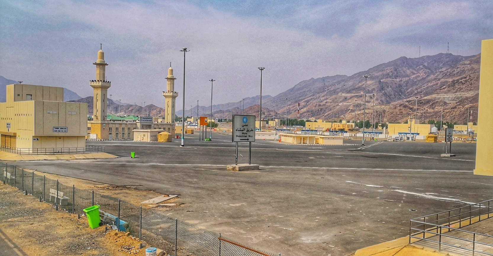

Ada beberapa hal yang berkaitan dengan Muzdalifah. Di antaranya sebagai berikut:

Pertama, Muzdalifah adalah sebuah tempat yang terletak di antara Arafah dan Mina. Secara bahasa, kata Muzdalifah berasal dari kata زَلَفَ, yang bermakna “dekat.” Dalam ungkapan Arab dikatakan زَلَفَ إِلَيْهِ atau اِزْدَلَفَ إِلَيْهِ, yang artinya “mendekat kepadanya.” artinya mendekat kepadanya.

Dinamakan Muzdalifah karena para jemaah haji, ketika tiba di tempat tersebut, berarti mereka telah semakin dekat dengan Mina. Ada pula yang menjelaskan bahwa Muzdalifah dinamakan demikian karena ia merupakan tempat berkumpulnya jemaah haji; sebab kata الاِزْدِلَافُ artinya الاِجْتِمَاعُ perkumpulan.

Kedua, Allah ﷻ menamakan Muzdalifah juga dengan al-Masy’ar al-Haram. Allah ﷻ berfirman,

```arabic
﴿فَإِذَآ أَفَضۡتُم مِّنۡ عَرَفَٰتٖ فَٱذۡكُرُواْ ٱللَّهَ عِندَ ٱلۡمَشۡعَرِ ٱلۡحَرَامِۖ وَٱذۡكُرُوهُ كَمَا هَدَىٰكُمۡ وَإِن كُنتُم مِّن قَبۡلِهِۦ لَمِنَ ٱلضَّآلِّينَ﴾
```

“Maka apabila kamu telah bertolak dari Arafah, berzikirlah kepada Allah di Masy´arilharam. Dan berzikirlah (dengan menyebut) Allah sebagaimana yang ditunjukkan-Nya kepadamu; dan sesungguhnya kamu sebelum itu benar-benar termasuk orang-orang yang sesat.” (QS. Al-Baqarah: 198)

Jumhur ahli tafsir menyatakan bahwa yang dimaksud dengan al-Masy’ar al-Haram dalam ayat ini adalah Muzdalifah secara keseluruhan.([^1])

Nabi ﷺ juga menamakan Muzdalifah dengan جَمْعٌ; karena para jemaah haji menjamak salat Magrib dan Isya di Muzdalifah.[^2] Nabi ﷺ bersabda,

```arabic
((وَوَقَفْتُ هَاهُنَا، وَجَمْعٌ كُلُّهَا مَوْقِفٌ))
```

“Aku wukuf (berdiam diri) di sini (salah satu tempat di Muzdalifah[^3]) dan Jam’un (yaitu Muzdalifah) seluruhnya adalah tempat wukuf.” [^4]

Ketiga, ketika tiba di Muzdalifah, amalan pertama yang dilakukan adalah melaksanakan salat Magrib dan Isya dengan jamak takhir, yaitu menggabungkan keduanya pada waktu Isya.[^5] Salat tersebut dilakukan dengan satu kali azan dan dua kali ikamah.

Catatan:

- Jika seseorang masih menunggu bus jemputan di Arafah, namun busnya terlambat hingga malam semakin larut, atau ia terjebak kemacetan dan mengalami hambatan di perjalanan, sehingga khawatir ketika tiba di Muzdalifah waktu Isya sudah habis, maka ia diperbolehkan untuk menjamak salat Magrib dan Isya meskipun belum sampai di Muzdalifah.

An-Nawawi rahimahullâh berkata,

```arabic
فَلَوْ جَمَعَ بَيْنَهُمَا فِي وَقْتِ الْمَغْرِبِ أَوْ فِي غَيْرِ الْمُزْدَلِفَةِ جَازَ
```

“Jika seseorang menjamak salat Magrib dan salat Isya di waktu Magrib (yaitu jamak takdim) atau menjamaknya bukan di Muzdalifah maka tidak mengapa.”[^6]

- Jika seseorang tiba di Muzdalifah lebih awal sementara waktu Isya belum masuk, maka dia boleh langsung melaksanakan salat Magrib dan Isya dengan jamak takdim. Karena amalan pertama yang dilakukan Nabi ﷺ setibanya di Muzdalifah adalah menjamak salat Magrib dan Isya. Dan beliau tidak merinci dengan mengatakan, “Jika ada yang sampai di Muzdalifah sebelum masuk waktu Isya, maka tunggulah hingga masuk waktu Isya baru kemudian salat.” Dan tentu sangat mungkin ada yang tiba di Muzdalifah sebelum waktu Isya. Terlebih lagi, seorang musafir memang diperbolehkan melakukan jamak takdim maupun jamak takhir.[^7]

Keempat, jika telah salat Magrib dan Isya maka hendaknya istirahat sebagaimana Nabi ﷺ beristirahat di Muzdalifah.

Jabir radhiyallâhu 'anhu berkata,

```arabic
وَلَمْ يُسَبِّحْ بَيْنَهُمَا شَيْئًا، ثُمَّ اضْطَجَعَ رَسُولُ اللهِ صَلَّى اللهُ عَلَيْهِ وَسَلَّمَ حَتَّى طَلَعَ الْفَجْرُ
```

“Nabi sama sekali tidak salat sunah apapun antara salat Magrib dan Isya, kemudian Nabi ﷺ berbaring hingga terbit fajar.”[^8]

Oleh karena itu, tidak disunahkan di malam Muzdalifah untuk beribadah, baik dengan salat malam, baca al-Qur`an, dan lain-lain. Yang menjadi sunah adalah tidur, sebagaimana yang dilakukan oleh Nabi ﷺ.

Catatan:

- Apakah pada malam Muzdalifah tetap disyariatkan salat witir? Dalam masalah ini terdapat perselisihan di kalangan para ulama. Sebab, tidak ada satu riwayat pun yang secara tegas menyebutkan bahwa Nabi ﷺ melaksanakan salat witir pada malam di Muzdalifah. Karena itu, sebagian ulama berpendapat bahwa tidak dianjurkan salat witir pada malam tersebut. Namun, sebagian ulama lain tetap memandang disunahkan untuk melaksanakan salat witir berdasarkan keumuman hadis yang menyebutkan bahwa Nabi ﷺ senantiasa melaksanakan witir, baik ketika bermukim maupun dalam keadaan safar.[^9]

- Jika seseorang tidak bisa tidur pada malam di Muzdalifah, maka hendaknya dia tetap berusaha untuk tidur.[^10] Namun, dia juga boleh berzikir sambil berbaring, mengisi waktunya dengan hal yang bermanfaat daripada membiarkannya berlalu tanpa nilai ibadah.[^11] Apabila dia sedang bersemangat dan tidak merasa letih, lalu ingin melaksanakan salat malam, maka tidak mengapa baginya untuk melakukannya. Sebagaimana disebutkan bahwa Asma’ binti Abu Bakar melaksanakan salat malam sambil menunggu waktu untuk meninggalkan Muzdalifah.[^12]

Kelima, tidak harus—dan tidak dikatakan sunah—mencari kerikil di Muzdalifah, namun tetap boleh dan dianjurkan bagi jemaah haji untuk mencari kerikil di Muzdalifah sebagai persiapan melempar jamrah. Nabi ﷺ sendiri mengambil kerikil bukan di Muzdalifah, namun saat di perjalanan menuju Mina. Di Muzdalifah memang tersedia banyak kerikil, berbeda dengan Mina saat ini yang agak susah untuk mencari kerikil.[^13]

Keenam, bagi orang yang kuat dan tidak beruzur, maka dia wajib untuk bermalam atau mabit di Muzdalifah sampai salat subuh. Adapun orang yang lemah seperti anak-anak, para wanita, orang tua, orang yang sakit, dan beruzur maka dibolehkan bagi mereka untuk meninggalkan Muzdalifah setelah lewat tengah malam.[^14]

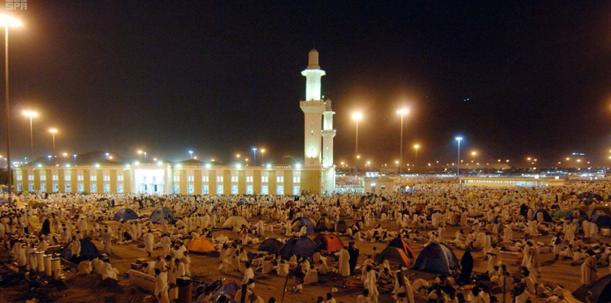

Rukhsah (keringanan) ini juga berlaku bagi orang yang kuat namun dia harus menemani atau menjaga wanita dan orang yang lemah. Sebagaimana Nabi ﷺ mengutus Ibnu Abbas—tatkala itu usianya remaja sekitar 14 tahun—untuk menemani orang-orang lemah. Ibnu Abbas berkata,

```arabic
بَعَثَنِي رَسُولُ اللهِ صَلَّى اللهُ عَلَيْهِ وَسَلَّمَ فِي الثَّقَلِ - أَوْ قَالَ فِي الضَّعَفَةِ - مِنْ جَمْعٍ بِلَيْلٍ
```

“Rasulullah ﷺ mengutus beliau bersama orang-orang lemah untuk keluar dari Muzdalifah di malam hari.”[^15]

Sebagaimana juga Abdullah maula Asma’ binti Abu Bakar menemani Asma’ untuk keluar dari Muzdalifah setelah lewat tengah malam.[^16]

Jika hal ini diperbolehkan di zaman Nabi ﷺ yang tidak begitu padat, maka tentu lebih boleh lagi di zaman sekarang yang sangat padat, yang bahkan mencapai jutaan jemaah haji.[^17]

Ketujuh, disunahkan bagi jemaah haji—setelah mabit di Muzdalifah—untuk salat subuh di Muzdalifah di awal waktu. Setelah salat, hendaknya berdoa kepada Allah ﷻ hingga matahari sangat menguning sebelum terbit—yaitu menjelang terbit. Dan ini adalah sunah yang banyak ditinggalkan oleh para jemaah haji. Banyak dari mereka, setelah salat subuh, langsung beranjak menuju ke Mina. Padahal, setelah subuh adalah waktu untuk berdoa kepada Allah ﷻ hingga menjelang matahari terbit.

Kedelapan, disunahkan sebelum matahari terbit para jemaah haji berangkat meninggalkan Muzdalifah menuju Mina.

Kesembilan, barang siapa yang tidak mabit di Muzdalifah tanpa uzur, maka dia harus bayar dam karena telah meninggalkan salah satu kewajiban haji.

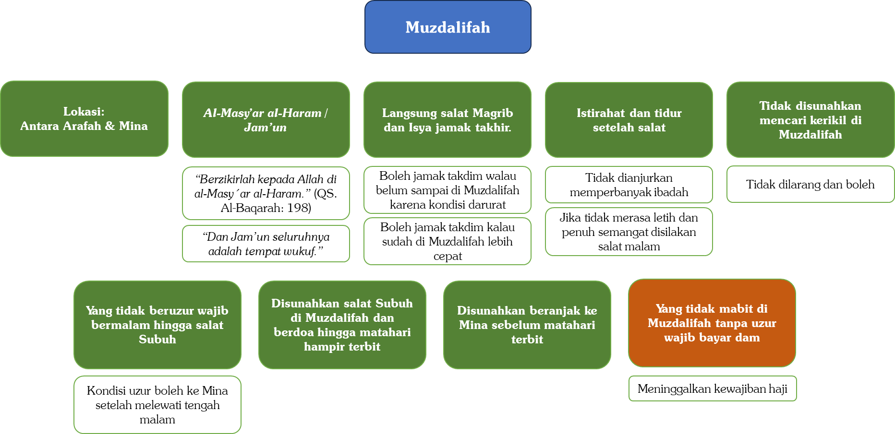

# 3.1.4.4 — Hari An-nahr (10 Zulhijah)

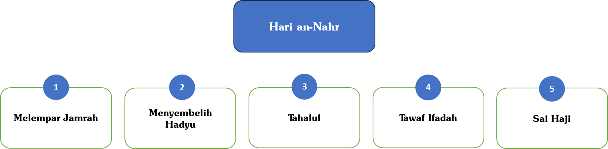

# 3.1.4.4.1 — Melempar Jamrah

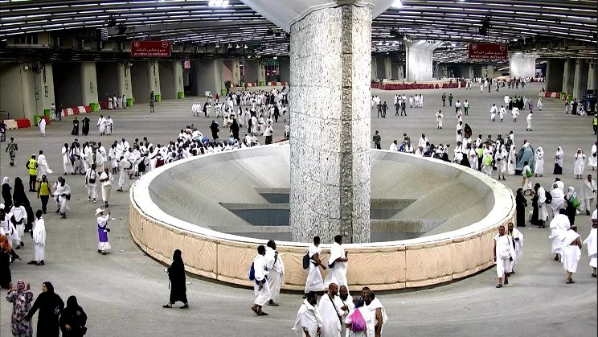

Di antara hikmah disyariatkannya melempar jamrah adalah:

---

## Pertama: Untuk mengingat Allah

Allah ﷻ berfirman,

```arabic
﴿وَٱذۡكُرُواْ ٱللَّهَ فِيٓ أَيَّامٖ مَّعۡدُودَٰتٖۚ﴾
```

“Dan berzikirlah (dengan mengingat) Allah dalam beberapa hari yang berbilang.” (QS. Al-Baqarah: 203)

Hari-hari berbilang tersebut adalah hari-hari Tasyrik.[^18] Allah ﷻ memerintahkan untuk berzikir di hari-hari tersebut. Di antaranya adalah berzikir kepada Allah dengan melempar jamrah. Oleh karena itu Allah ﷻ kemudian berkata,

```arabic
ﵟفَمَن تَعَجَّلَ فِي يَوۡمَيۡنِ فَلَآ إِثۡمَ عَلَيۡهِ وَمَن تَأَخَّرَ فَلَآ إِثۡمَ عَلَيۡهِۖ لِمَنِ ٱتَّقَىٰۗ ﵞ
```

“Barang siapa yang ingin cepat berangkat (dari Mina) sesudah dua hari, maka tiada dosa baginya. Dan barangsiapa yang ingin menangguhkan (keberangkatannya dari dua hari itu), maka tidak ada dosa pula baginya, bagi orang yang bertakwa.” (QS. Al-Baqarah: 203)

Ini menunjukkan bahwa melempar jamrah disyariatkan dalam rangka berzikir kepada Allah ﷻ.([^19]) Dan hal ini didukung oleh hadis yang diriwayatkan dari Nabi ﷺ bahwa beliau berkata,

```arabic
إِنَّمَا جُعِلَ الطَّوَافُ بِالْبَيْتِ وَبَيْنَ الصَّفَا وَالْمَرْوَةِ وَرَمْيُ الْجِمَارِ لِإِقَامَةِ ذِكْرِ اللَّهِ
```

“Hanyalah disyariatkan tawaf di Ka’bah dan sai antara Shafa dan Marwah serta melempar jumrah adalah untuk menegakkan zikir kepada Allah.”[^20]

Oleh karena itu juga, di setiap lemparan kerikil disyariatkan untuk bertakbir sebagai bentuk pengagungan terhadap Allah ﷻ.

---

## Kedua: Meneladani ibrahim ‘alaihissalâm dalam memusuhi dan tidak menaati setan

Ibnu Abbas meriwayatkan secara marfû’,

```arabic
لَمَّا أَتَى إِبْرَاهِيمُ خَلِيلُ اللَّهِ الْمَنَاسِكَ عَرَضَ لَهُ الشَّيْطَانُ عِنْدَ جَمْرَةِ الْعَقَبَةِ فَرَمَاهُ بِسَبْعِ حَصَيَاتٍ حَتَّى سَاخَ فِي الَارْضِ، ثُمَّ عَرَضَ لَهُ عِنْدَ الْجَمْرَةِ الثَّانِيَةِ فَرَمَاهُ بِسَبْعِ حَصَيَاتٍ حَتَّى سَاخَ فِي الَارْضِ، ثُمَّ عَرَضَ لَهُ عِنْدِ الْجَمْرَةِ الثَّالِثَةِ فَرَمَاهُ بِسَبْعِ حَصَيَاتٍ حَتَّى سَاخَ فِي الَارْضِ
```

“Ketika Ibrahim kekasih Allah mendatangi manasik maka setan muncul menghadanginya/menggodanya di jamrah Aqabah, maka Ibrahim pun melemparnya dengan tujuh kerikil hingga setan pun tenggelam ke bumi. Lalu setan pun menggodanya di jamrah yang kedua maka Ibrahim pun melemparnya dengan tujuh kerikil hingga hilang di telan bumi. Lalu setan muncul dan menggoda beliau di jamrah yang ketiga, maka Ibrahim pun melemparnya dengan tujuh kerikil hingga menghilang ditelan bumi.”

Ibnu Abbas berkata,

```arabic
الشَّيْطَانَ تَرْجُمُونَ وَمِلَّةَ أَبِيكُمْ تَتَّبِعُونَ
```

“Kalian melempar setan dan kalian mengikuti agama ayah kalian (Ibrahim).”[^21]

Al-Ghazali berkata, “Adapun melempar jamrah, maka jadikanlah tujuannya untuk tunduk kepada perintah Allah dengan menampakkan penghambaan dan ketundukan diri kepada-Nya, yaitu dengan semangat menjalankan perintahnya meskipun tidak memahaminya atau tidak keuntungan bagi jiwa. Lalu niatkanlah untuk meniru Nabi Ibrahim ‘alaihissalâm, karena beliau digoda oleh Iblis—yang dilaknat oleh Allah—di lokasi tersebut untuk memasukkan syubhat kepada beliau atau untuk menjerumuskan beliau dalam kemaksiatan. Maka Allah memerintahkan beliau untuk melemparnya dengan batu untuk mengusir dan memutuskan harapannya.

Jika terbetik dalam benakmu bahwa setan memang menggoda Ibrahim, dan disaksikan oleh beliau serta melemparnya, sementara setan tidak muncul menggodaku, maka ketahuilah bahwa pikiran ini berasal dari setan. Dialah yang telah melemparkan pemikiran itu ke dalam hatimu agar engkau menjadi malas untuk melempar, dan dia juga mengkhayalkan kepadamu bahwa melempar jamrah adalah perbuatan yang tidak ada faedahnya, bahkan hanya merupakan permainan belaka, maka cueklah darinya serta buanglah pemikiran tersebut dari dirimu dengan serius dan semangat dalam melempar agar setan menjadi jengkel.

Ketahuilah, sesungguhnya engkau, meskipun secara zahir sedang melempar kerikil ke jamrah, namun pada hakikatnya engkau sedang melempar wajah setan serta mematahkan pundaknya. Karena tidaklah menjadikan setan jengkel kecuali jika engkau menjalankan perintah Allah sebagai bentuk pengagungan kepada Allah dengan menjalankan perintah-Nya meskipun tidak memberikan manfaat bagi jiwa dan tidak bisa dipahami (hikmahnya).”[^22]

Asy-Syinqithi berkata, “Seakan-akan melempar jamrah merupakan lambang dan isyarat permusuhan kepada setan yang Allah perintahkan kita untuk memusuhinya dalam firman-Nya, ‘Sesungguhnya setan adalah musuh kalian, maka jadikanlah dia sebagai musuh.” (QS. Fâthir: 6), dan juga dalam firman-Nya—yang mengingkari orang yang berwalâ` kepada setan, ‘Patutkah kamu mengambil dia dan turunan-turunannya sebagai pemimpin selain dari pada-Ku, sedang mereka adalah musuhmu?’ (QS. Al-Kahfi: 50). Dan sebagaimana diketahui bahwa melempar dengan batu termasuk bentuk permusuhan yang paling besar.”[^23]

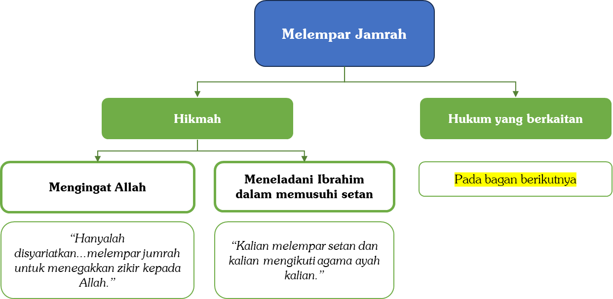

Di antara hukum yang berkaitan dengan melempar jamrah adalah sebagai berikut:

Pertama, jamrah di Mina ada tiga:

1. Al-Jamrah ash-Shughrâ, yang terdekat dengan Mina.

1. Al-Jamrah al-Wushthâ, yang terletak setelah Al-Jamrah Ash-Shughrâ, yakni jamrah letaknya di tengah.

1. Al-Jamrah al-Kubrâ—disebut juga dengan Jamrah Aqabah, yang terakhir, terjauh dari Mina, dan terdekat dengan Makkah. Dan Jamrah ini bukan bagian dari Mina.[^24] (Yang tidak termasuk wilayah Mina adalah area di belakang posisi fisik Jamrah, yaitu bagian yang mengarah ke Makkah. Adapun sisi Jumrah yang mengarah ke Mina, maka bagian tersebut termasuk wilayah Mina).


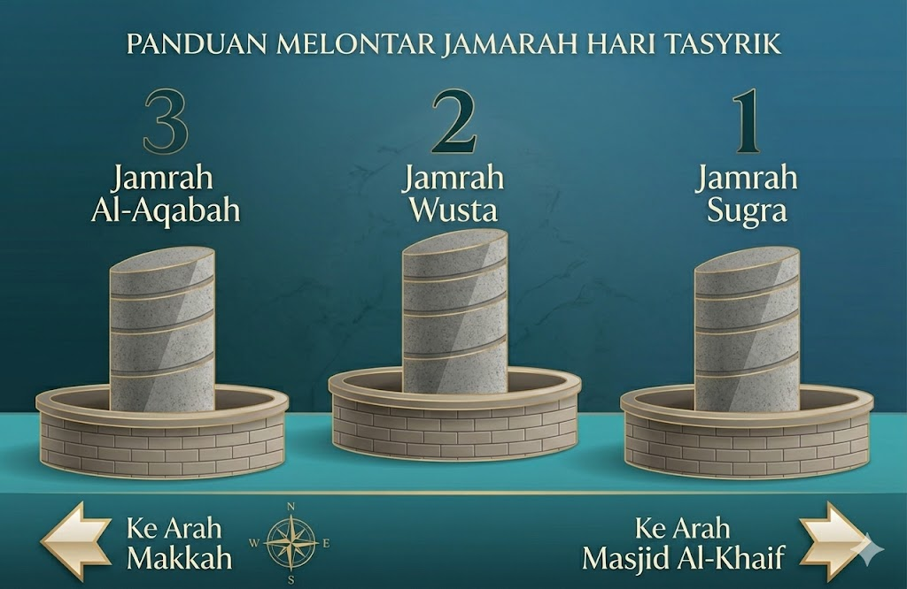

Kedua, tatkala tanggal 10 Zulhijah, maka jamrah yang dilempar hanyalah al-Jamrah al-Kubrâ (Jamrah Aqabah), dan lemparan tersebut sebanyak 7 kerikil.

Ketiga, sunahnya, melempar Jamrah Aqabah dilakukan setelah matahari terbit, sebagaimana yang dicontohkan oleh Nabi ﷺ. Namun, bagi orang-orang yang mendapatkan keringanan untuk keluar dari Muzdalifah setelah lewat tengah malam, mereka diperbolehkan langsung melempar Jamrah Aqabah, sebagaimana yang dilakukan oleh sebagian sahabat radhiyallâhu 'anhum.

Keempat, apabila seseorang tidak sempat melempar di siang hari, maka dia diperbolehkan melempar di malam hari. Waktu untuk melempar pun memanjang hingga menjelang terbit fajar, sebelum azan subuh esok harinya.[^25]

Kelima, di antara syarat melempar:

1. Benda yang digunakan untuk melempar harus berupa batu kerikil. Tidak diperbolehkan menggunakan tanah, logam, pasir, atau aspal.

1. Setiap Jamrah harus dilempari dengan 7 kerikil.

1. Lemparan dilakukan satu per satu; tidak boleh melempar 7 kerikil sekaligus.

1. Kerikil harus masuk ke dalam sumur Jamrah. Tiang atau dinding yang ada hanya sebagai penanda, bukan sebagai target. Jika lemparan terlalu kuat sehingga kerikil memantul keluar dari sumur, maka lemparan itu tidak sah.

1. Harus disertai niat melempar. Apabila kerikil terjatuh karena tangan tersenggol orang lain, meskipun masuk sumur, lemparan tidak sah karena tidak disertai niat.

1. Kerikil harus dilempar, tidak cukup hanya diletakkan.

Keenam, kerikil yang digunakan untuk melempar ukurannya sedang, tidak terlalu kecil dan tidak juga terlalu besar.[^26]

Ibnu Abbas berkata,

```arabic
قَالَ لِي رَسُولُ اللهِ صَلَّى اللهُ عَلَيْهِ وَسَلَّمَ غَدَاةَ الْعَقَبَةِ، وَهُوَ وَاقِفٌ عَلَى رَاحِلَتِهِ: ((هَاتِ الْقُطْ لِي)) فَلَقَطْتُ لَهُ حَصَيَاتٍ هُنَّ حَصَى الْخَذْفِ، فَوَضَعَهُنَّ فِي يَدِهِ، فَقَالَ: ((بِأَمْثَالِ هَؤُلَاءِ)) مَرَّتَيْنِ، وَقَالَ بِيَدِهِ - فَأَشَارَ يَحْيَى أَنَّهُ رَفَعَهَا - وَقَالَ: ((إِيَّاكُمْ وَالْغُلُوَّ؛ فَإِنَّمَا هَلَكَ مَنْ كَانَ قَبْلَكُمْ بِالْغُلُوِّ فِي الدِّينِ))
```

“Rasulullah ﷺ berkata kepadaku di pagi hari melempar jamrah Aqabah, sementara beliau menunggangi unta beliau, ‘Carikan buatku (kerikil).’

Maka aku pun mengambil untuk beliau kerikil-kerikil yaitu kerikil ukuran untuk mengutik. Lalu beliau meletakkan kerikil-kerikil tersebut di tangan beliau lalu beliau berkata sebanyak dua kali, ‘Seperti (ukuran) kerikil-kerikil inilah (kalian melempar).’

Dan beliau berkata—dengan mengangkat tangannya, ‘Waspadalah kalian dari sikap berlebih-lebihan dalam agama. Karena sesungguhnya umat sebelum kalian dibinasakan oleh sikap berlebihan dalam agama’.”[^27]

Ini menunjukkan bahwa sikap berlebih-lebihan dalam ukuran kerikil adalah terlarang.[^28]

Ketujuh, hendaknya melempar dengan tangan kanan disertai takbir setiap lemparan.

Kedelapan, tidak masalah kerikil diambil dari mana pun, karena yang penting tetap berupa kerikil.[^29] Hanya saja, para ulama berbeda pendapat mengenai tempat yang lebih utama untuk mengambilnya, apakah dari Muzdalifah atau dari perjalanan menuju Mina[^30]

Kesembilan, kerikil-kerikil tersebut tidak perlu dicuci terlebih dahulu. Hal ini sebagaimana ketika Nabi ﷺ memerintahkan Ibnu Abbas mencari kerikil, posisi beliau saat itu sedang di atas untanya, dan tidak ada riwayat yang menyebutkan beliau mencuci kerikil tersebut.[^31]

Kesepuluh, apabila seseorang tidak mampu melempar jamrah karena sakit atau uzur yang sulit disembuhkan hingga akhir waktu melempar, maka dia diperbolehkan mewakilkan lemparannya. Hal yang perlu diperhatikan:

1. Wakil yang akan melempar hendaknya terlebih dahulu melempar untuk dirinya sendiri sebelum mewakili orang lain.

1. Jika ingin keluar Mina pada nafar awal, maka dia tidak boleh meninggalkan Mina sebelum wakilnya selesai melempar.

Kesebelas, setelah melempar jamrah Aqabah—baik pada tanggal 10 Zulhijah maupun tanggal 11, 12, dan 13 Zulhijah—tidak disunahkan untuk berdoa. Doa yang disunahkan adalah setelah melempar al-Jamrah ash-Shughrâ dan al-Jamrah al-Wusthâ pada hari-hari Tasyrik (tanggal 11, 12, dan 13 Zulhijah).

Kedua belas, bagi orang yang memiliki uzur yang kuat, diperbolehkan menggabungkan pelemparan dua hari dan melaksanakannya dalam satu hari.

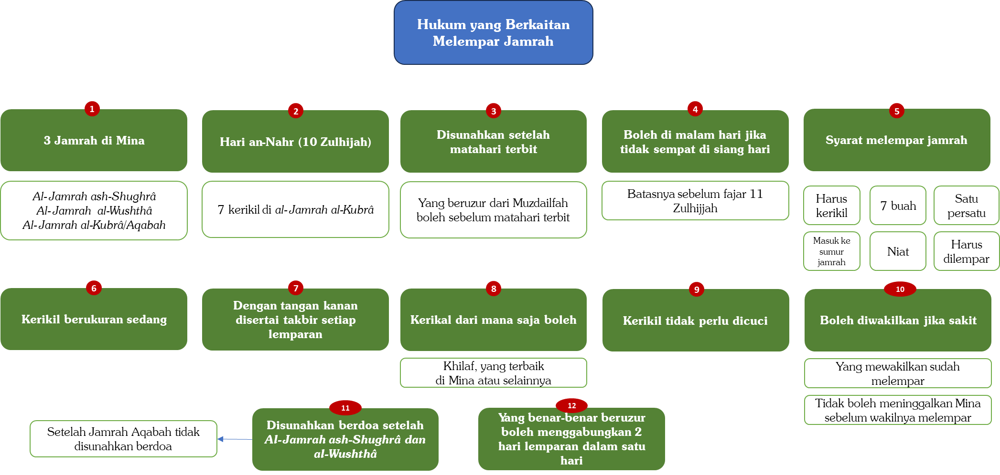

# 3.1.4.4.2 — Menyembelih Hadyu

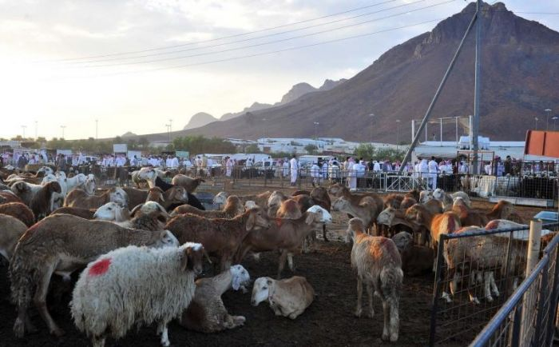

1. Hadyu adalah hewan yang dibawa oleh jemaah haji atau umrah ke tanah haram untuk disembelih dan diserahkan sebagai ibadah kepada Allah. Hadyu diwajibkan bagi orang yang melaksanakan haji Tamattu’ atau haji Kiran, sedangkan bagi yang melaksanakan haji Ifrad, menyembelih hadyu tidak diwajibkan.

1. Syarat-syarat hewan hadyu secara umum sama dengan syarat hewan al-udhiyah (kurban):

- Hewan harus sehat dan bebas dari aib atau cacat, seperti buta, pincang, kurus, atau sakit.

- Seperti kurban, hadyu juga boleh disembelih secara patungan (isytirâk). Misalnya, tujuh jemaah haji dapat bergabung untuk menyembelih seekor unta atau sapi. Namun, jika seseorang menyembelih seekor unta atau sapi sendirian, tentu lebih utama. Bahkan Nabi ﷺ pernah menyembelih 100 ekor unta sekaligus.

- Hewan harus cukup umur: domba minimal 6 bulan, kambing Jawa minimal 1 tahun, sapi minimal 2 tahun, dan unta minimal 5 tahun.

1. Jika tidak mampu menyembelih hewan hadyu, maka seorang yang berhaji boleh menggantinya dengan puasa 3 hari selama berada di kota Makkah ketika sedang dalam rangka menunaikan ibadah haji, dan 7 hari setelah pulang ke tanah air.

Catatan:

- Untuk puasa tiga hari, seorang jemaah boleh memulainya sejak ihram untuk umrah tamatu (bagi yang melaksanakan haji tamatu) atau sejak ihram haji (bagi yang haji Kiran). Dengan demikian, jemaah haji yang sedang menunaikan umrah tamatu atau baru selesai dari umrah tamatu diperbolehkan menjalankan puasa tiga hari.

- Yang paling utama adalah berpuasa tiga hari sebelum tanggal 9 Zulhijah, agar pada tanggal 9 dia berada dalam kondisi berbuka.

- Jika tidak sempat berpuasa sebelumnya, maka dia diperbolehkan puasa pada hari-hari Tasyrik (11, 12, dan 13 Zulhijah).

- Apabila puasa tiga hari diakhirkan dan tidak dilaksanakan saat haji, maka wajib mengqadanya setelah haji, meskipun di tanah air. Dia tidak terkena denda atau fidyah.

- Asalnya, yang lebih afdal adalah berpuasa tujuh hari di tanah air setelah pulang dari haji. Namun, jika setelah selesai haji waktunya masih lama sebelum kembali ke tanah air, dia boleh berpuasa tujuh hari meskipun belum pulang.

- Puasa tiga hari dan tujuh hari boleh dilaksanakan secara berurutan maupun terpisah-pisah.

1. Waktu awal menyembelih hadyu adalah tanggal 10 Zulhijah menurut jumhur ulama—Hanafiyyah, Malikiah, dan Hanabilah. Adapun menurut Syafi’iyyah, maka boleh menyembelih hadyu sebelum tanggal 10 Zulhijah jika dia telah berihram untuk umrah tamatu (Akan datang pembahasannya secara khusus).

1. Waktu akhir menyembelih hadyu menurut pendapat yang sahih adalah sebelum terbenam matahari pada tanggal 13 Zulhijah.

1. Para jemaah haji hendaknya tidak membeli kambing hadyu kecuali dari orang yang amanah, mengingat banyaknya penjual kambing yang tidak amanah.

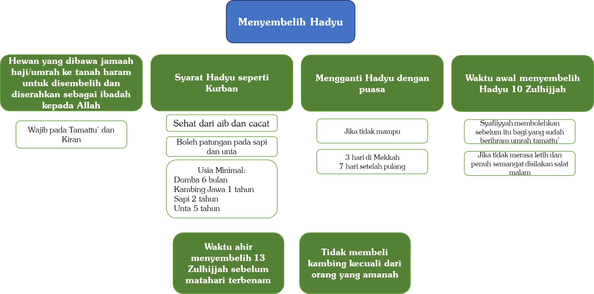

# 3.1.4.4.3 — Menggundul Kepala atau Mencukur Pendek Rambut Kepala.

Dan menggundul lebih baik—sebagaimana telah lalu penjelasannya. (Nomor 2.6)

# 3.1.4.4.4 — Tawaf Ifadah

1. Tawaf ifadah atau tawaf ziarah atau tawaf haji merupakan salah satu rukun haji. Tawaf ini dilakukan setelah wukuf di padang Arafah.[^32]

1. Disunahkan untuk dikerjakan pada siang hari tanggal 10 Zulhijah sebagaimana yang dilakukan oleh Nabi ﷺ.[^33]

1. Waktu paling awal untuk melaksanakan tawaf ifadah adalah setelah lewat tengah malam, yaitu bagi orang-orang yang lemah dan diizinkan meninggalkan Muzdalifah setelah lewat tengah malam.[^34]

1. Tidak ada batas waktu akhir untuk melaksanakan tawaf ifadah; kapan pun seseorang melakukannya, tawaf tersebut sah.[^35]

1. Bagi yang telah melakukan tahalul awal (setelah melempar jamrah dan mencukur rambut), maka dia boleh tawaf dengan pakaian biasa. Sedangkan bagi yang belum bertahalul awal dan langsung menuju tawaf dari Muzdalifah, maka tetap harus tawaf menggunakan kain ihram.

1. Dalam tawaf ifadah, tidak disyariatkan ar-Ramal (jalan cepat) dan idhthiba’,([^36]) karena keduanya hanya diwajibkan dalam tawaf qudum atau tawaf umrah.

1. Tata cara tawaf lainnya yang telah dijelaskan sebelumnya juga berlaku pada pelaksanaan tawaf ifadah.[^37]

1. Setelah tawaf, disunahkan salat dua rakaat di belakang Maqam Ibrahim jika memungkinkan. Jika tidak memungkinkan, boleh melaksanakan salat di tempat lain di Masjidilharam.

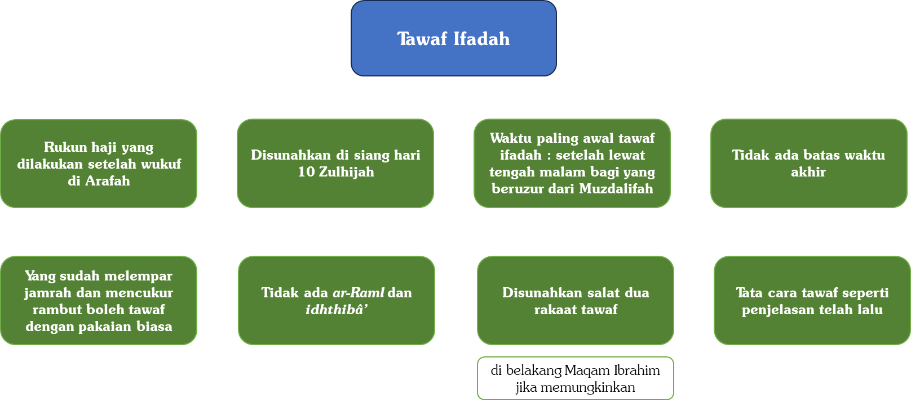

# 3.1.4.4.5 — Sai Haji

Setelah tawaf ifadah maka melakukan sai haji, dan tata cara sai telah lalu penjelasannya.

# 3.1.4.5 — Hari-hari Tasyrik

# 3.1.4.5.1 — Mabit di Mina Pada Malam Hari-hari Tasyrik

Ada beberapa hal yang berkaitan dengan mabit di Mina pada malam hari-hari tasyrik. Di antaranya adalah sebagai berikut:

Pertama, mabit di Mina di malam hari-hari Tasyrik hukumnya adalah wajib.[^38]

Kedua, kewajiban mabit di Mina adalah berada di sana selama mayoritas malam (مُعْظَمُ اللَّيْلِ), yaitu lebih dari setengah malam.[^39] Jika rentang waktu dari terbenam matahari hingga terbit fajar adalah 12 jam, maka wajib berada di Mina minimal 6 jam lebih dikit.

Ketiga, bagi jemaah yang mengambil nafar awal, maka dia hanya wajib untuk mabit pada malam ke-11 dan malam ke-12 Dzulhijjah saja, dan tidak wajib baginya untuk mabit pada malam ke-13 Dzulhijjah.[^40] Dan bagi jemaah yang mengambil nafar tsani, maka dia harus bermalam di Mina pada malam ke-13 Zulhijah.

Keempat, bagi jemaah yang mengambil nafar awal, maka wajib baginya untuk keluar dari Mina sebelum matahari tenggelam pada tanggal 12 Zulhijah. Apabila dia masih berada di Mina hingga matahari tenggelam pada tanggal tersebut, maka wajib baginya untuk mengambil nafar tsani, sehingga wajib pula baginya untuk mabit di Mina pada malam ke-13 Zulhijah.[^41]

Jika dia sudah bersiap mengambil nafar awal untuk meninggalkan Mina, namun kendaraan yang menjemputnya terlambat; atau dia terhalang oleh suatu halangan sehingga matahari terbenam, maka dia tetap boleh keluar dari Mina.[^42]

Kelima, bagi jemaah yang memiliki uzur, maka diperbolehkan untuk tidak mabit di Mina. Di antara dalilnya, Nabi ﷺ pernah memberikan keringanan kepada para penggembala[^43] dan para penyedia air bagi jemaah haji untuk tidak bermalam di Mina.[^44] Karena itu, siapa saja yang memiliki uzur sehingga tidak dapat mabit di Mina, maka tidak mengapa baginya dan dia tidak berkewajiban membayar dam. Uzur ini bersifat umum, mencakup kepentingan pribadi maupun kepentingan jemaah haji. Uzur yang berkaitan dengan kepentingan pribadi dapat dikiaskan dengan para penggembala unta yang harus menjaga hewan-hewan mereka agar tidak hilang atau dicuri. Adapun uzur yang berkaitan dengan kemaslahatan jemaah haji dapat dikiaskan dengan para penyedia air yang diberi izin untuk meninggalkan mabit demi melayani kebutuhan kaum muslimin.[^45] Di antara contoh uzur tersebut adalah:

- Orang yang sakit.

- Dokter dan perawat yang harus menangani para jemaah haji yang sakit.

- Para guide yang harus wira-wiri mengurus kebutuhan jemaah serta pengaturan bus-bus mereka.

- Orang yang tidak mendapatkan kemah atau tempat di Mina, setelah dia berusaha mencarinya.[^46]

Keenam, bagi jemaah yang tidak mabit di Mina tanpa uzur, jika hanya meninggalkan satu malam saja maka cukup baginya untuk bersedekah,[^47] akan tetapi jika meninggalkan dua malam maka wajib baginya untuk bayar dam.[^48]

Peringatan:

- Selama berada di Mina, salat wajib lima waktu dilaksanakan dengan cara qasar, namun tidak dijamak. Artinya, setiap salat tetap dikerjakan pada waktunya masing-masing, hanya saja dilakukan dengan diqasar.

- Tidak mengerjakan salat sunah rawatib kecuali hanya qabliyyah subuh saja, karena Nabi ﷺ tetap mengerjakannya meskipun ketika safar. Namun boleh mengerjakan salat-salat sunah yang lain seperti salat duha dan salat malam.

- Hendaknya para jemaah memperbanyak zikir dan membaca al-Qur`an serta mengisi waktu di Mina dengan perkara-perkara yang bisa mendekatkan diri kepada Allah ﷻ.

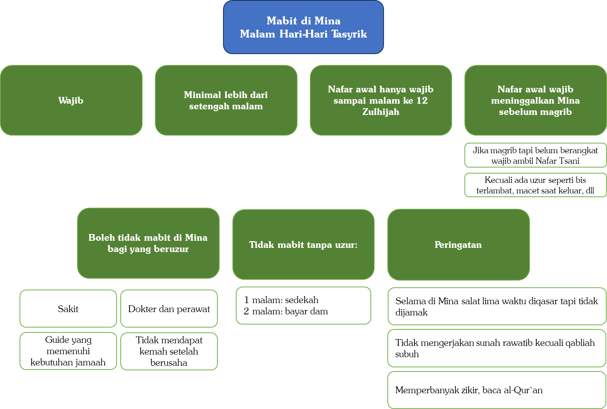

# 3.1.4.5.2 — Melempar Tiga Jamrah di Hari-hari Tasyrik

Di antara hal-hal yang berkaitan dengan melempar jamrah di hari-hari tasyrik adalah:

Pertama, pada tanggal 10 Zulhijah yang dilempar hanyalah Jamrah Aqabah saja. Adapun waktu pelemparannya dimulai sejak pertengahan malam—sebagaimana telah dijelaskan sebelumnya. Sementara itu, pada tanggal 11, 12, dan 13 Zulhijah, yang dilempar adalah ketiga jamarat seluruhnya. Waktu pelemparannya dimulai setelah masuk waktu Zuhur.[^49]

Kedua, jika seseorang belum sempat melempar setelah waktu zuhur, maka dia boleh melakukannya pada malam hari hingga sebelum terbit fajar. Kecuali pada hari ke-13 Zulhijah (hari Tasyrik terakhir); karena pada hari tersebut waktu melempar berakhir saat matahari terbenam.[^50]

Ketiga, apabila terdapat kondisi yang benar-benar mendesak,[^51] diperbolehkan menunda pelemparan ke hari berikutnya (jamak takhir).[^52] Misalnya, lemparan tanggal 11 Zulhijah digabungkan dengan lemparan tanggal 12 Zulhijah. Demikian pula, lemparan tanggal 12 dapat digabungkan dengan tanggal 13. Bahkan, boleh juga menunda lemparan tanggal 11 dan 12 sekaligus untuk digabungkan pada tanggal 13, sehingga seluruh lemparan tiga hari dilakukan dalam satu hari. Adapun tata caranya adalah sebagai berikut:

- Setelah masuk waktu Zuhur, dia memulai dengan melempar untuk hari yang tertunda terlebih dahulu, yaitu melempar ketiga jamrah.

- Setelah selesai, dia kembali lagi ke al-Jamrah ash-Shugrâ untuk memulai lemparan hari berikutnya, lalu dilanjutkan secara berurutan hingga selesai.

- Batas akhir melempar pada tanggal 13 Zulhijah adalah sebelum matahari terbenam.

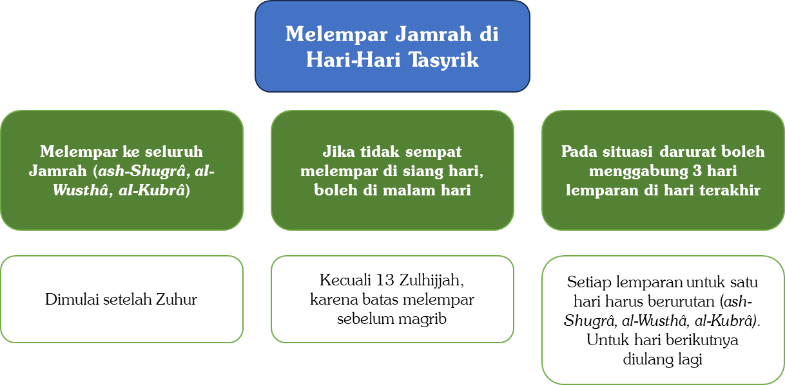

# 3.1.5 — Tawaf Wadak (perpisahan)

Setelah meninggalkan Mina, maka jemaah haji kembali ke Makkah untuk melakukan tawaf wadak sebelum meninggalkan kota Makkah.

Ibnu Abbas berkata,

```arabic
أُمِرَ النَّاسُ أَنْ يَكُونَ آخِرُ عَهْدِهِمْ بِالْبَيْتِ، إِلَّا أَنَّهُ خُفِّفَ عَنِ الحَائِضِ
```

“Orang-orang diperintahkan agar kegiatan terakhir yang mereka lakukan sebelum meninggalkan kota Makkah adalah tawaf di Ka’bah, hanya saja diberi keringanan kepada wanita yang sedang haid.”[^53]

Ibnu Abbas juga berkata,

```arabic
كَانَ النَّاسُ يَنْصَرِفُونَ فِي كُلِّ وَجْهٍ، فَقَالَ رَسُولُ اللهِ صَلَّى اللهُ عَلَيْهِ وَسَلَّمَ: ((لَا يَنْفِرَنَّ أَحَدٌ حَتَّى يَكُونَ آخِرُ عَهْدِهِ بِالْبَيْتِ))
```

“Orang-orang pergi (setelah dari Mina) ke segala arah, maka Rasulullah ﷺ berkata, ‘Janganlah seorang pun pergi (meninggalkan Makkah untuk pulang) hingga kegiatannya yang terakhir adalah ia tawaf di Ka’bah’.”[^54]

Hukum-hukum yang berkaitan dengan tawaf wadak adalah sebagai berikut:

Pertama, tawaf wadak hukumnya wajib bagi orang yang menunaikan haji. Hal ini karena hadis-hadis di atas menggunakan lafaz perintah, sedangkan hukum asal dari sebuah perintah adalah menunjukkan kewajiban. Adapun bagi orang yang melaksanakan umrah, tawaf wadak tidaklah wajib.[^55]

Kedua, tawaf wadak hanya disyariatkan bagi jemaah haji yang datang dari luar Makkah, karena merekalah yang akan meninggalkan kota tersebut sehingga membutuhkan tawaf perpisahan. Adapun penduduk Makkah yang menunaikan haji tidak diwajibkan melakukannya, karena mereka memang tinggal di Makkah. Demikian pula, jemaah dari luar Makkah yang setelah berhaji berniat untuk bermukim atau menetap di Makkah, maka tidak wajib atasnya tawaf wadak.

Ketiga, bagi wanita, disyaratkan dalam keadaan suci dari haid dan nifas untuk melaksanakan tawaf wadak. Oleh karena itu, wanita yang sedang haid atau nifas gugur kewajiban tawaf wadak atasnya. Aisyah radhiyallâhu 'anhâ berkata,

```arabic
أَنَّ صَفِيَّةَ بِنْتَ حُيَيٍّ - زَوْجَ النَّبِيِّ صَلَّى اللهُ عَلَيْهِ وَسَلَّمَ - حَاضَتْ، فَذَكَرْتُ ذَلِكَ لِرَسُولِ اللَّهِ صَلَّى اللهُ عَلَيْهِ وَسَلَّمَ، فَقَالَ: ((أَحَابِسَتُنَا هِيَ؟)) قَالُوا: إِنَّهَا قَدْ أَفَاضَتْ قَالَ: ((فَلَا إِذًا))
```

“Bahwasanya Shafiyah bintu Huyai—istri Nabi ﷺ—haid, maka aku pun menyebutkan hal itu kepada Rasulullah ﷺ. Maka Nabi berkata, ‘Apakah Shafiyah akan menahan kita (sehingga tidak bisa pulang ke Madinah)?’

Mereka berkata, ‘Shafiyah telah melakukan tawaf ifadah.’

Nabi berkata, ‘Kalau begitu ia tidak menahan kita untuk pulang’.”[^56]

Hukum wanita yang nifas sama dengan wanita haid, sehingga kewajiban tawaf wadak juga gugur darinya. Apabila seorang wanita telah bersiap meninggalkan bangunan kota Makkah, lalu ternyata haid atau nifasnya berhenti sebelum meninggalkan bangunan kota Makkah, maka dia wajib kembali untuk menunaikan tawaf wadak. Namun jika dia baru suci setelah menempuh jarak safar (sekitar 80 km), maka dia tidak perlu kembali untuk melaksanakan tawaf wadak.[^57]

Keempat, waktu pelaksanaan tawaf wadak adalah setelah seluruh rangkaian ibadah haji selesai dan yang tersisa hanyalah bersiap untuk pulang. Hal ini sebagaimana sabda Nabi Muhammad ﷺ, “Janganlah seorang pun pergi (meninggalkan Makkah untuk pulang) hingga kegiatannya yang terakhir adalah tawaf di Ka’bah.”[^58]

Namun demikian, tidak mengapa apabila setelah tawaf wadak seseorang melakukan aktivitas yang berkaitan dengan persiapan safar, seperti membeli bekal perjalanan, menunggu bus, mengangkat barang ke kendaraan, atau menunggu rombongan. Aktivitas-aktivitas semacam ini tidak mengubah statusnya menjadi mukim (menetap).([^59])

Kelima, setelah melaksanakan tawaf wadak, tidak boleh lagi melakukan aktivitas yang menunjukkan seakan-akan hendak menetap (mukim), seperti tidur dan semisalnya.[^60]

Keenam, adapun seseorang yang telah melakukan tawaf wadak lalu berjalan keluar dari Makkah—misalnya menuju hotel atau penginapan untuk menunggu bus—kemudian ternyata busnya terlambat hingga dia harus bermalam, atau dia sibuk memperbaiki kendaraannya yang rusak, atau dia mencari anggota keluarganya yang hilang dengan niat setelah bertemu akan langsung keluar dari Makkah, maka dia tidak perlu mengulangi tawaf wadak. Karena dia telah berniat meninggalkan Makkah, hanya saja terhalang oleh uzur.

Ketujuh, setelah tawaf wadak disunahkan melakukan salat dua rakaat.

Kedelapan, boleh menggabungkan tawaf wadak dengan tawaf ifadah[^61] dengan syarat:

1. Niatnya bukan niat tawaf wadak, akan tetapi niatnya adalah niat tawaf ifadah, atau meniatkan keduanya—menurut sebagian ulama). Jika dia tawaf dengan niat tawaf wadak saja, maka dia harus mengulang tawaf dengan niat tawaf ifadah.

1. Agar tawaf ifadah tersebut sekaligus mencukupi sebagai tawaf wadak, maka dia harus menjadikannya sebagai amalan terakhir sebelum meninggalkan Makkah. Bagi yang belum melaksanakan sai haji, dia boleh melakukan sai setelah tawaf ifadah tersebut, karena sai mengikuti tawaf.[^62]

Kesembilan, sebagian orang menyangka bahwa setelah melaksanakan tawaf wadak tidak boleh lagi menunaikan salat di Masjidilharam. Anggapan ini tidak tepat. Sebab Nabi ﷺ setelah tawaf wadak masih mengimami salat subuh. Karena itu, apabila setelah tawaf wadak ternyata waktu salat akan segera tiba, maka tidak mengapa dia menunggu dan menunaikan salat di Masjidilharam. Demikian pula, jika setelah tawaf wadak bertepatan dengan waktu salat Jumat, maka boleh baginya untuk tetap menunggu dan melaksanakan salat Jumat terlebih dahulu sebelum meninggalkan Makkah.[^63]

Kesepuluh, barang siapa yang sakit dan masih mampu untuk tawaf dalam keadaan diangkat atau di dorong dengan kursi roda, maka kewajiban tawaf wadaknya tidaklah gugur. Berbeda jika dia sakit parah sehingga tidak bisa tawaf meskipun diangkat atau didorong dengan kursi roda, maka kewajiban tawaf wadaknya menjadi gugur. Namun jika dia diberi kelapangan, maka lebih baik dia membayar dam dengan memotong seekor kambing untuk dibagikan kepada kaum fukara di Makkah.[^64]

Kesebelas, barang siapa yang keluar dari Makkah dengan jarak safar (sekitar 80 Km), maka hendaknya dia melakukan tawaf ifadah sebelum keluar, meskipun dia akan kembali lagi ke Makkah. Sebagai contoh, jemaah haji yang telah menyelesaikan seluruh amalan hajinya, lalu hendak jalan-jalan ke Madinah atau ke Jeddah, meskipun dia akan kembali lagi ke Makkah, maka hendaknya dia tawaf wadak sebelum keluar ke Madinah atau Jeddah. Ini adalah pendapat yang lebih hati-hati, bahkan merupakan pendapat mayoritas ulama.

Dan setelah kembali ke Makkah, lalu dia hendak pulang ke tanah air, maka hendaklah dia melakukan tawaf wadak kembali sebagai bentuk kehati-hatian.[^65] Meskipun sebagian ulama berpendapat, bahwa ke mana pun seseorang pergi—meskipun sudah melewati jarak safar—apabila dia berniat untuk kembali ke Makkah, maka dia tidak diwajibkan melakukan tawaf wadak. Karena tawaf wadak hanya diwajibkan bagi orang yang benar-benar hendak meninggalkan Makkah menuju kampung halamannya atau tempat tinggalnya di luar kota.[^66]

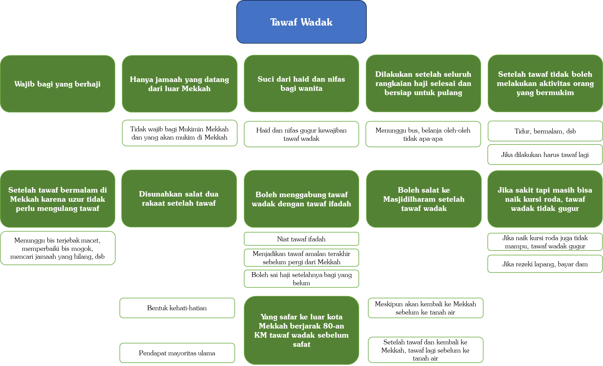

# 3.2 — Haji Ifrad

Haji Ifrad adalah haji yang dilakukan hanya dengan menunaikan ibadah haji di musim haji, tanpa disertai umrah. Karena itu, ihram hanya dilakukan sekali, yaitu ihram haji.

Berbeda dengan haji Tamattu’, yang mengharuskan seseorang berihram dua kali: pertama untuk umrah, kemudian untuk haji. Selain itu, orang yang melaksanakan haji Ifrad tidak berkewajiban menyembelih hadyu, berbeda dengan haji Tamattu’ yang mewajibkan penyembelihan hadyu.

Pelaksanaan Haji

---

## Pertama: Ihram di mikat

---

## Kedua: Tawaf qudum (hukumnya sunah)

---

## Ketiga: Sai haji

---

## Keempat: Melaksanakan haji sebagaimana haji tamattu’ mulai tanggal 8 hingga tawaf wadak

Hanya saja:

- Setelah tawaf qudum dan sai haji, dia tidak mencukur atau menggundul rambut. Namun, dia tetap berihram dengan kain ihramnya hingga lanjut pada tanggal 8 Zulhijah.

- Jika dia sudah melaksanakah sai haji—ketika tawaf qudum, maka setelah tawaf ifadah dia tidak perlu melakukan sai haji lagi.

# 3.3 — Haji Kiran

Kiran dalam bahasa Arab artinya adalah menggandengkan. Yang dimaksud dengan haji Kiran adalah haji yang dilakukan dengan satu nusuk, namun mewakili dua nusuk sekaligus.

Haji Ifrad hanya melaksanakan satu nusuk, yaitu satu ihram untuk haji saja, tanpa umrah. Sedangkan haji Tamattu’ melaksanakan dua nusuk, yaitu ihram untuk umrah dan kemudian ihram untuk haji. Sedangkan haji Kiran, meskipun hanya melaksanakan satu ihram, namun ia menggandengkan keduanya sehingga mencakup haji dan umrah sekaligus. Dari segi pelaksanaan, haji Kiran sama dengan haji Ifrad. Perbedaannya terletak pada kewajiban penyembelihan hadyu: pada haji Ifrad tidak wajib menyembelih hadyu, sedangkan pada haji Kiran wajib menyembelih hewan hadyu.

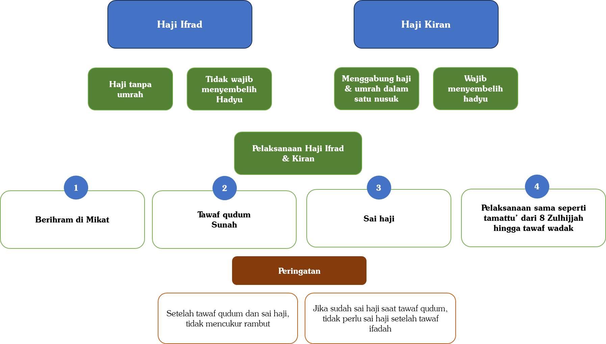

Zikir Haji dan Umrah

Niat umrah:

```arabic
اَللَّهُمَّ لَبَّيْكَ عُمْرَةً
```

Allâhumma Labbaika ‘Umratan

“Ya Allah aku memenuhi panggilan-Mu untuk umrah.”

Niat haji:

```arabic
اَللَّهُمَّ لَبَّيْكَ حَجًّا
```

Allâhumma Labbaika Hajjan

“Ya Allah aku memenuhi panggilan-Mu untuk berhaji.”

Bacaan talbiah:

```arabic
لَبَّيْكَ اللَّهُمَّ لَبَّيْكَ، لَبَّيْكَ لَا شَرِيْكَ لَكَ لَبَّيْكَ، إِنَّ الْحَمْدَ وَالنِّعْمَةَ لَكَ وَالْمُلْكَ لَا شَرِيْكَ لَكَ
```

Labbaikallâhumma labbaik, labbaika lâ syarîka laka labbaik, innal hamda wan-ni'mata laka wal-mulk, lâ syarîka lak

“Aku memenuhi panggilan-Mu ya Allah, aku memenuhi panggilan-Mu. Aku memenuhi panggilan-Mu, tiada sekutu bagi-Mu, aku memenuhi panggilan-Mu. Sesungguhnya pujaan dan nikmat adalah milik-Mu, begitu juga kerajaan, tiada sekutu bagi-Mu. “[^67]

Doa masuk kota Makkah:

```arabic
اَللَّهُمَّ رَبَّ السَّمَاوَاتِ السَّبْعِ وَمَا أَظْلَلْنَ، وَرَبَّ اْلَارَضِيْنَ السَّبْعِ وَمَا أَقْلَلْنَ، وَرَبَّ الشَّيَاطِيْنِ وَمَا أَضْلَلْنَ، وَرَبَّ الرِّيَاحِ وَمَا ذَرَيْنَ. أَسْأَلُكَ خَيْرَ هَـٰذِهِ الْقَرْيَةِ وَخَيْرَ أَهْلِهَا، وَخَيْرَ مَا فِيْهَا، وَأَعُوْذُ بِكَ مِنْ شَرِّهَا وَشَرِّ أَهْلِهَا وَشَرِّ مَا فِيْهَا
```

“Ya Allah, Tuhan tujuh langit dan apa yang dinaunginya, Tuhan penguasa tujuh bumi dan apa yang di atasnya, Tuhan yang menguasai setan-setan dan apa yang mereka sesatkan, Tuhan yang menguasai angin dan apa yang diterbangkannya. Aku mohon kepada-Mu kebaikan desa ini, kebaikan penduduknya dan apa yang ada di dalamnya. Aku berlindung kepada-Mu dari kejelekan desa ini, kejelekan penduduknya dan apa yang ada di dalamnya.([^68])

Doa masuk Masjidilharam:

```arabic
أَعُوْذُ بِاللَّهِ الْعَظِيْمِ، وَبِوَجْهِهِ الْكَرِيْمِ، وَسُلْطَانِهِ الْقَدِيْمِ، مِنَ الشَّيْطَانِ الرَّجِيْمِ
```

```arabic
بِسْمِ اللَّهِ، وَالصَّلَاةُ وَالسَّلَامُ عَلَى رَسُوْلِ اللَّهِ
```

```arabic
اَللَّهُمَّ افْتَحْ لِيْ أَبْوَابَ رَحْمَتِكَ
```

A'ûdzu billâhil 'azhîm, wa biwajhihil-karîm, wa sulthânihil-qadîm minasy-syaithânir-rajîm. Bismillâh, wash-shalâatu was-salâmu 'alâ rasûlillâh. Allâhummaftah lî abwâba rahmatik

“Aku berlindung kepada Allah Yang Maha agung, dengan wajah-Nya Yang mulia dan kekuasaan-Nya yang abadi, dari setan yang terkutuk. [^69] Dengan nama Allah dan semoga selawat [^70] dan salam tercurahkan kepada Rasulullah. [^71]Ya Allah, bukalah pintu-pintu rahmat-Mu untukku.” [^72]

Doa ketika melihat Ka’bah:

Sa’id bin al-Musayyib rahimahullâh (seorang ulama tabiin), jika masuk ke Masjidilharam dan melihat Ka’bah, maka beliau berkata,

```arabic
اللهُمَّ أَنْتَ السَّلَامُ وَمِنْكَ السَّلَامُ، فَحَيِّنَا رَبَّنَا بِالسَّلَامِ
```

Allâhumma antas-salâm wa minkas-salâm fahayyinâ rabbanâ bis-salâm

“Ya Allah sesungguhnya Engkau adalah as-Salâm (Yang suci/selamat dari segala aib dan kekurangan). Dari-Mu-lah keselamatan. Maka sambutlah kami—wahai Rabb kami—dengan keselamatan.”[^73]

Bertakbir setiap datang ke hajar aswad:

Nabi Muhammad ﷺ melakukan tawaf di Baitullah sambil menunggang unta. Setiap kali beliau sampai di Hajar Aswad—tiang di Ka’bah tempat Hajar Aswad berada—beliau memberi isyarat dengan sesuatu yang dipegangnya sambil mengucapkan takbir.[^74]

Doa antara Rukun Yamani dan Hajar Aswad:

```arabic
ﵟرَبَّنَآ ءَاتِنَا فِي ٱلدُّنۡيَا حَسَنَةٗ وَفِي ٱلۡأٓخِرَةِ حَسَنَةٗ وَقِنَا عَذَابَ ٱلنَّارِﵞ
```

Rabbanâ âtinâ fid-dunyâ hasanah, wa fil-âkhirati hasanah, wa qinâ 'adzâban-nâr

“Wahai Tuhan kami, berilah kami kebaikan di dunia dan kebaikan di akhirat. Serta lindungilah kami dari adzab neraka.” [^75]

Doa menuju Maqam Ibrahim:

```arabic
ﵟوَٱتَّخِذُواْ مِن مَّقَامِ إِبۡرَٰهِـۧمَ مُصَلّٗىۖ ﵞ
```

Wattakhidzû mim maqâmi ibrâhîma mushallâ

“Dan jadikanlah sebahagian Maqam Ibrahim sebagai tempat Salat.” (QS. Al-Baqarah: 125)

Doa minum air zamzam:

Tidak ada doa khusus yang berasal langsung dari Nabi ﷺ untuk dibaca saat minum air zamzam. Oleh karena itu, boleh berdoa dengan doa apa saja sesuai kebutuhan dan niat masing-masing, karena Nabi ﷺ bersabda, “Air zamzam untuk niat meminumnya.”

Namun, diriwayatkan dari Ibnu Abbas bahwa ketika ia minum zamzam, ia membaca:

```arabic
اللَّهُمَّ إِنِّي أَسْأَلُكَ عِلْمًا نَافِعًا وَرِزْقًا وَاسِعًا وَشِفَاءً مِنْ كُلِّ دَاءٍ
```

Allâhumma innî as`aluka ‘ilman nâfi’an wa rizqan wâsi’an wa syifâ`an min kulli dâ`in

“Ya Allah sesungguhnya aku memohon kepada-Mu ilmu yang bermanfaat, rezeki yang lapang, dan kesembuhan dari segala penyakit.”[^76]

Doa di atas Bukit Shafa dan Marwah:

Ketika Nabi Muhammad ﷺ dekat dengan bukit Shafa, beliau membaca,

```arabic
ﵟإِنَّ ٱلصَّفَا وَٱلۡمَرۡوَةَ مِن شَعَآئِرِ ٱللَّهِۖ ﵞ أَبْدَأُ بِمَا بَدَأَ اللَّهُ بِهِ
```

Innash-Shafâ wal-marwata min sya’â`irillâh. Abda`u bimâ bada`allâhu bihi

“Sesungguhnya Shafa dan Marwah adalah termasuk syiar agama Allah. Aku memulai sai dengan apa yang didahulukan oleh Allah.”

Kemudian beliau memulai dengan naik ke Bukit Shafa hingga dapat melihat Ka’bah. Setelah itu, beliau menghadap kiblat, membaca kalimat tauhid, bertakbir 3x, dan kemudian membaca,

```arabic
لَا إِلَـٰهَ إِلَا اللَّهُ وَحْدَهُ لَا شَرِيْكَ لَهُ، لَهُ الْمُلْكُ وَلَهُ الْحَمْدُ، وَهُوَ عَلَى كُلِّ شَيْءٍ قَدِيْرٌ، لَا إِلَـٰهَ إِلَا اللَّهُ وَحْدَهُ أَنْجَزَ وَعْدَهُ وَنَصَرَ عَبْدَهُ وَهَزَمَ اْلَاحْزَابَ وَحْدَهُ
```

Lâ ilâha illallâh wahdahû lâ syarîka lah, lahul-mulku wa lahul-hamdu, wa huwa 'alâ kulli syai`in qadîr. Lâ ilâha illallâhu wahdah, anjaza wa'dah, wa nashara 'abdah, wa hazamal-ahzâba wahdah

“Tidak ada sesembahan yang berhak disembah kecuali Allah, Yang Maha Esa, Tiada sekutu bagi-Nya. Bagi-Nya kerajaan dan pujian. Dialah Yang Mahakuasa atas segala sesuatu. Tidak ada sesembahan yang berhak disembah kecuali Allah, Yang Maha Esa, yang melaksanakan janji-Nya, membela hamba-Nya (Muhammad) dan mengalahkan golongan musuh sendirian.”

Kemudian beliau berdoa. Beliau membaca zikir di atas sebanyak 3x. Disebutkan dalam hadis bahwa Nabi ﷺ membaca di Marwah sebagaimana beliau membaca di Shafa.[^77]

Doa pada Hari Arafah:

Nabi Muhammad ﷺ bersabda, “Doa yang terbaik (yang mustajab) adalah di hari Arafah, dan sebaik-baiknya apa yang aku dan para nabi baca, adalah:

```arabic
لَا إِلَـٰهَ إِلَا اللَّهُ، وَحْدَهُ لَا شَرِيْكَ لَهُ، لَهُ الْمُلْكُ وَلَهُ الْحَمْدُ، وَهُوَ عَلَى كُلِّ شَيْءٍ قَدِيْرٌ
```

Lâ ilâha illallâh wahdahû lâ syarîka lah, lahul-mulku wa lahul-hamdu, wa huwa 'alâ kulli syai`in qadîr

“Tidak ada sesembahan yang berhak disembah kecuali Allah, Yang Maha Esa, tiada sekutu bagi-Nya. Bagi-Nya kerajaan dan bagi-Nya pujian. Dan Dia Maha Kuasa atas segala sesuatu.” [^78]

Bacaan di al-Masy’ar al-Haram (Muzdalifah):

Setelah salat subuh Nabi Muhammad ﷺ menghadap kiblat, berdoa, membaca takbir dan tahlil serta kalimat tauhid. Beliau terus berdoa hingga fajar menyingsing. Kemudian beliau berangkat (ke Mina) sebelum matahari terbit. [^79]

Bertakbir setiap melempar jumrah:

Nabi ﷺ bertakbir setiap kali melempar ketiga jamrah dengan kerikil. Setelah melempar jamrah pertama dan kedua, beliau maju sedikit dan berdiri untuk berdoa sambil menghadap kiblat dan mengangkat kedua tangan. Adapun ketika melempar Jamrah Aqabah, beliau hanya melempar dan bertakbir, tanpa berhenti untuk berdoa, lalu langsung pergi.[^80]

# 4.1 — Ihram dan Mikat

Pertanyaan 1: Bagaimanakah cara berihram di pesawat?

Jawab:

Berikut adalah hal-hal yang perlu diperhatikan bagi orang yang berihram di pesawat, karena saat melewati mikat dia berada di atas pesawat—seperti halnya jemaah haji yang datang pada gelombang kedua:

---

## Pertama: Sunahnya adalah mandi di mikat, namun melihat kondisi kepadatan jemaah haji yang luar biasa maka para ulama membolehkan mandi di rumah atau di hotel menjelang keberangkatan. demikian juga jemaah yang berihram di pesawat, jika tidak memungkinkan mandi di pesawat maka boleh mandi sebelum berangkat naik pesawat.[^81]

---

## Kedua: Jemaah yang berihram di pesawat hendaknya sudah melakukan persiapan dengan memakai kain ihram menjelang sampai ke zona mikat. niat ihram dilakukan setelah pihak pesawat memberitahukan bahwa pesawat telah memasuki wilayah atau daerah mikat

Namun jika kawatir tertidur sehingga mikat terlewat; atau tidak ada yang memberitahukan kapan pesawat berada di zona mikat; atau menurut persangkaannya pemberitahuan bisa jadi terlambat, maka dia boleh untuk berniat ihram sebelum mikat sebagai bentuk kehati-hatian.[^82]

Hukum asal berihram sebelum mikat adalah makruh. Semestinya seseorang berihram tepat di titik mikat. Misalnya, penduduk Madinah yang ingin berihram, seharusnya memulai ihram di Dzul Hulaifah (Bir ‘Ali), bukan di Masjid Nabawi atau hotel, karena kedua tempat tersebut berada sebelum miqat.

Namun, melihat kondisi pesawat yang terbang dengan kecepatan tinggi—bisa mencapai 800 hingga 1000 Km/jam—seseorang boleh memulai ihram sebelum mikat, meskipun hanya 10 hingga 30 menit sebelumnya.[^83] Meskipun hukum asalnya makruh, dalam kaidah fikih: suatu kebutuhan dapat menghilangkan kemakruhan, karena kaidah berbunyi,

```arabic
الحَاجَةُ تُنَزَّلُ مَنِزْلَةَ الضَّرُوْرَةِ
```

“Hajat (kebutuhan) ditempatkan menempati posisi darurat.”

Terlebih lagi para ulama telah sepakat bahwa berihram sebelum mikat hukumnya sah. Ibnul Munzir berkata,

```arabic
وَأَجْمَعُوا عَلَى أَنَّ مَنْ أَحْرَمَ قَبْلَ الْمِيْقَاتِ أَنَّهُ مُحْرِمٌ
```

“Dan para ulama telah ijmak (sepakat) bahwasanya barang siapa yang berihram sebelum mikat maka ia telah sah berihram.”[^84]

---

## Ketiga: Jika dia lupa membawa kain ihram di atas pesawat, maka dia harus tetap berihram di atas pesawat sebelum pesawat mendarat di bandara jeddah. dan dia tetap memakai celana, namun tidak boleh memakai songkok (penutup kepala) dan tidak boleh memakai baju. Nabi muhammad ﷺ bersabda,

```arabic
((مَنْ لَمْ يَجِدْ إِزَارًا فَلْيَلْبَسْ سَرَاوِيلَ، وَمَنْ لَمْ يَجِدْ نَعْلَيْنِ فَلْيَلْبَسْ خُفَّيْنِ))
```

“Barang siapa yang tidak mendapati izâr (kain ihram) maka hendaknya ia memakai celana panjang, dan barang siapa yang tidak mendapati dua sandal maka hendaknya ia memakai sepatu.”[^85]

Jika seseorang memiliki kain yang bisa digunakan sebagai penutup badan, maka wajib baginya membuka baju biasa dan menggunakan kain tersebut sebagai kain ihram.

Namun, jika tidak mendapatinya, maka dia tetap memakai baju sampai pesawat mendarat. Setelah itu, dia mengganti baju dan celananya dengan kain ihram setelah mendapatkannya, dan dia wajib membayar fidyah atas pelanggaran memakai pakaian sebelum ihram. Fidyah ini bisa dipilih salah satu dari tiga cara: (1) berpuasa selama tiga hari, (2) menyembelih seekor kambing, atau (3) memberikan sedekah kepada enam orang fakir miskin, masing-masing 1/2 zakat fitrah (yaitu sekitar 1,3 kg beras).[^86]

Adapun bagi wanita yang berihram di pesawat, pelaksanaannya lebih mudah, karena cukup meniatkan ihram ketika berada di zona mikat, tanpa harus mengganti pakaian.

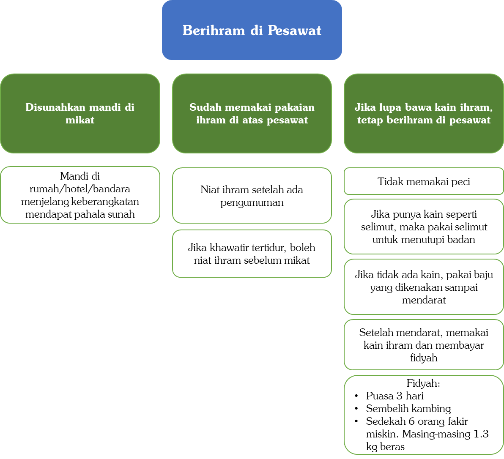

# 4.2 — Tawaf

# 4.2.1 — Pertanyaan 1: Apakah Menyentuh atau Tersentuh Wanita Tatkala Tawaf Membatalkan Wudu?

Jawab:

Di antara tantangan yang cukup sulit dihindari bagi jemaah haji, khususnya dari Indonesia, adalah bersentuhan langsung dengan wanita saat tawaf. Hal ini menjadi persoalan karena menurut sebagian ulama, salah satu syarat sah tawaf adalah dalam kondisi suci (wudu). Bagi mayoritas jemaah Indonesia yang mengikuti mazhab al-Imam asy-Syafi’i, bersentuhan dengan wanita membatalkan wudu, sehingga situasi ini menjadi sangat merepotkan.

Lantas apa yang harus mereka lakukan sebagai solusi?

Pertama, sebagian mereka ada yang berfatwa untuk mengubah mazhab sementara dari mazhab Syafi’i ke mazhab Hanbali. Karena menurut mazhab Hanbali, menyentuh wanita hanya membatalkan wudu jika disertai syahwat, jika tidak, maka wudu tetap sah. Fatwa tersebut diberikan karena kondisi darurat, meskipun pada dasarnya mereka tetap meyakini kebenaran mazhab Syafi’i dalam masalah ini.

Bahkan sebagian juga berfatwa agar mengubah mazhab bukan hanya tatkala tawaf saja, tetapi perubahan tersebut dimulai sejak melakukan tata cara wudu. Artinya, wudu harus dikerjakan sesuai dengan mazhab Hanbali, agar tidak batal tatkala bersentuhan dengan wanita ketika tawaf.

Kedua, sebagian mereka tetap bertahan dengan mazhab Syafi’i dan tidak mau berpindah kepada mazhab Hanbal, namun mengikuti fatwa yang membolehkan bertayamum sementara jika bersentuhan dengan wanita ketika tawaf.

Kedua solusi ini merupakan upaya praktis, namun hingga saat ini Penulis belum menemukan apakah ada ulama Syafi’iyah yang secara resmi membolehkan berpindah ke mazhab lain—padahal diyakini mazhab Syafi’i adalah yang benar—atau yang membolehkan bertayamum sementara air tersedia dan mudah didapatkan.

Batalnya wudu karena menyentuh wanita adalah permasalahan khilafiah yang masyhur di kalangan para ulama, bahkan telah timbul khilaf di kalangan para sahabat.

Al-Hafiz Ibnu Hajar rahimahullâh berkata, “Adapun Ibnu Umar maka al-Imam Malik dan al-Imam asy-Syafi'i meriwayatkan dari beliau dengan lafal,

```arabic
مَنْ قَبَّلَ امْرَأَةً أَوْ جَسَّهَا بِيَدِهِ فَعَلَيْهِ الْوُضُوْءُ
```

‘Barang siapa yang mencium seorang wanita atau merabanya dengan tangannya maka wajib baginya untuk berwudu.’

Al-Baihaqi meriwayatkan dari Ibnu Mas’ud dengan lafal,

```arabic
الْقُبْلَةُ مِنَ اللَّمْسِ وَفِيْهَا الْوُضُوْءُ وَاللَّمْسُ مَا دُوْنَ الْجِمَاعِ
```

‘Mencium termasuk menyentuh, dan ada wudu, dan menyentuh adalah di bawah/sebelum jimak.’

Dan dalam riwayat yang lain dari Ibnu Mas’ud tentang firman Allah,

```arabic
ﵟأَوۡ لَٰمَسۡتُمُ ٱلنِّسَآءَ ﵞ مَعْنَاهُ ماَ دُوْنَ الْجِمَاعِ
```

(atau menyentuh wanita): ‘Maknanya adalah di bawah/selain jimak’...

Adapun Ibnu Abbas maka beliau membawa makna ayat ini kepada makna jimak.”[^87]

Dalam permasalahan ini secara umum ada tiga pendapat:

Pendapat Pertama: Membatalkan wudu.

Pendapat Ibnu Umar dan Ibnu Mas’ud diikuti oleh ulama mazhab Syafi’i, yaitu menyentuh istri dan juga wanita lain yang bukan mahram (yaitu wanita yang mungkin untuk dinikahi) dapat membatalkan wudu, meskipun menyentuhnya tanpa disertai syahwat. Dalil mereka adalah firman Allah ﷻ,

```arabic
﴿وَإِن كُنتُمۡ جُنُبٗا فَٱطَّهَّرُواْۚ وَإِن كُنتُم مَّرۡضَىٰٓ أَوۡ عَلَىٰ سَفَرٍ أَوۡ جَآءَ أَحَدٞ مِّنكُم مِّنَ ٱلۡغَآئِطِ أَوۡ لَٰمَسۡتُمُ ٱلنِّسَآءَ فَلَمۡ تَجِدُواْ مَآءٗ فَتَيَمَّمُواْ صَعِيدٗا طَيِّبٗا﴾
```

"Dan jika kamu junub Maka mandilah, dan jika kamu sakit atau dalam perjalanan atau kembali dari tempat buang air (kakus) atau menyentuh wanita, lalu kamu tidak memperoleh air, Maka bertayamumlah dengan tanah yang baik (bersih)." (QS. Al-Mâ`idah: 6)

Firman Allah ﷻ, ﴿أَوۡ لَٰمَسۡتُمُ ٱلنِّسَآءَ﴾ (atau menyentuh wanita) ditafsirkan dengan الْتِقَاءُ الْبَشَرَةِ الْبَشَرَةَ (persentuhan kulit lelaki dengan kulit wanita) meskipun tanpa disertai jimak.[^88] Tafsiran seperti ini karena beberapa sebab:

Pertama, Allah ﷻ menyebut janabah di awal ayat, lalu meng-‘athaf-kan menyentuh wanita dengan buang air besar. Ini menunjukkan bahwa menyentuh wanita termasuk jenis hadas kecil seperti buang air besar, dan ini bukanlah janabah.[^89] Maka dengan demikian bahwa yang dimaksud dengan menyentuh adalah menyentuh dengan tangan, bukan jimak atau sanggama.

Kedua, kata (لَامَسَ) secara zahir maknanya sama dengan (لَمَسَ), sebagaimana terdapat dalam qiraah lain: (أَوْ لَمَسْتُمُ النِّسَاءَ). Qiraah yang satu menafsirkan qiraah yang lain, atau masing-masing qiraah dipahami sesuai maknanya. Dengan demikian, qiraah ﴿أَوۡ لَٰمَسۡتُمُ ٱلنِّسَآءَ﴾ dibawakan kepada makna jimak, sedangkan qiraah (أَوْ لَمَسْتُمُ النِّسَاءَ) dibawakan kepada makna menyentuh.

Ketiga, lafal (لَمَسَ) dalam al-Qur`an maknanya adalah menyentuh, seperti firman Allah ﷻ,

```arabic
﴿وَلَوۡ نَزَّلۡنَا عَلَيۡكَ كِتَٰبٗا فِي قِرۡطَاسٖ فَلَمَسُوهُ بِأَيۡدِيهِمۡ لَقَالَ ٱلَّذِينَ كَفَرُوٓاْ إِنۡ هَٰذَآ إِلَّا سِحۡرٞ مُّبِينٞ﴾
```

“Dan kalau Kami turunkan kepadamu tulisan di atas kertas, lalu mereka dapat menyentuhnya dengan tangan mereka sendiri, tentulah orang-orang kafir itu berkata, "Ini tidak lain hanyalah sihir yang nyata." (QS. Al-An’âm: 7)[^90]

Keempat, demikian juga Nabi ﷺ dalam hadis menyatakan bahwa menyentuh kemaluan sendiri dengan telapak tangan dapat membatalkan wudu. Dari Busrah binti Shafwan radhiyallâhu 'anhâ bahwasanya Rasulullah ﷺ bersabda,

```arabic
وَعَنْ بُسْرَةَ بِنْتِ صَفْوَانَ رَضِيَ اَللَّهُ عَنْهَا، أَنَّ رَسُولَ اَللَّهِ قَالَ: ((مَنْ مَسَّ ذَكَرَهُ فَلْيَتَوَضَّأْ))
```

"Barang siapa yang menyentuh kemaluannya maka hendaknya ia berwudu." [^91]

Sebabnya, hal ini berpotensi menimbulkan syahwat, apalagi jika yang disentuh adalah wanita.

Menyentuh wanita dapat dianalogikan dengan menyentuh kemaluan sendiri, karena keduanya sama-sama berpotensi menimbulkan syahwat. Seperti yang dikatakan oleh Syaikhul Islam Zakariya al-Anshari rahimahullâh,

```arabic
وَالْمَعْنَى في النَّقْضِ بِهِ أَنَّهُ مَظِنَّةُ التَّلَذُّذِ الْمُثِيرِ لِلشَّهْوَةِ
```

“Dan makna dari membatalkan wudu karena menyentuh wanita, karena hal itu merupakan dugaan timbulnya berlezat-lezat yang bisa menggerakkan syahwat.”[^92]

Dari sini, para ulama Syafi’iyah menyatakan bahwa menyentuh wanita yang merupakan mahram tidak membatalkan wudu, karena tidak menimbulkan syahwat.

Pendapat Kedua: Tidak membatalkan wudu.

Ibnu Abbas berpendapat bahwa yang membatalkan wudu adalah berjimak, bukan hanya sekedar menyentuh. Pendapat ini diikuti oleh ulama Hanafiyah. As-Sarakhsi berkata,

```arabic
لَا يَجِبُ الْوُضُوءُ مِنَ الْقُبْلَةِ وَمَسِّ الْمَرْأَةِ، بِشَهْوَةٍ أَوْ غَيْرِ شَهْوَةٍ
```

"Tidak wajib berwudu karena mencium dan menyentuh wanita, baik dengan syahwat maupun tanpa syahwat."[^93]

Di antara dalil atas pendapat ini adalah:

Pertama, hukum asal wudu seseorang adalah tetap suci dengan keyakinan, dan tidak batal kecuali ada dalil yang meyakinkan sebaliknya. Artinya, ketika seseorang berwudu, wudunya secara asal sah dan tetap suci, sehingga hanya dalil yang tegas yang dapat membatalkannya. Jika tidak ada dalil yang menunjukkan batalnya wudu, maka wudu itu tetap berlaku. Dan dalam hal ini, pembatal tersebut tidak ada.

Ibnu Taimiyyah rahimahullâh berkata,

```arabic
وَأَيْضًا فَمِنْ الْمَعْلُومِ أَنَّ مَسَّ النَّاسِ نِسَاءَهُمْ مِمَّا تَعُمُّ بِهِ الْبَلْوَى وَلَا يَزَالُ الرَّجُلُ يَمَسُّ امْرَأَتَهُ؛ فَلَوْ كَانَ هَذَا مِمَّا يَنْقُضُ الْوُضُوءَ لَكَانَ النَّبِيُّ بَيَّنَهُ لِأُمَّتِهِ؛ وَلَكَانَ مَشْهُورًا بَيْنَ الصَّحَابَةِ وَلَمْ يَنْقُلْ أَحَدٌ أَنَّ أَحَدًا مِنْ الصَّحَابَةِ كَانَ يَتَوَضَّأُ بِمُجَرَّدِ مُلَاقَاةِ يَدِهِ لِامْرَأَتِهِ أَوْ غَيْرِهَا وَلَا نَقَلَ أَحَدٌ فِي ذَلِكَ حَدِيثًا عَنْ النَّبِيِّ: فَعُلِمَ أَنَّ ذَلِكَ قَوْلٌ بَاطِلٌ
```

“Padahal kita ketahui bersama bahwa menyentuh istri adalah suatu hal yang amat sering terjadi. Seandainya itu membatalkan wudu, tentu Nabi Muhammad ﷺ akan menjelaskan kepada umatnya dan masyhur di kalangan sahabat, tetapi tidak ada seorang pun dari kalangan sahabat yang berwudu hanya karena sekedar menyentuh istrinya.”[^94]

Kedua, telah datang hadis-hadis sahih yang menunjukkan bahwa Nabi ﷺ menyentuh istrinya dan wudu beliau tidak batal. Di antara hadis-hadis tersebut adalah: Dari Urwah bin az-Zubair—beliau adalah keponakan Aisyah—dari Aisyah radhiyallâhu 'anhâ, ia berkata,

```arabic
أَنَّ رَسُولَ اللهِ صَلَّى اللهُ عَلَيْهِ وَسَلَّمَ قَبَّلَ بَعْضَ نِسَائِهِ، ثُمَّ خَرَجَ إِلَى الصَّلَاةِ، وَلَمْ يَتَوَضَّأْ
```

"Bahwa Rasulullah ﷺ pernah mencium salah seorang istrinya, kemudian keluar menuju salat dan tidak berwudu lagi."

Urwah berkata,

```arabic
قُلْتُ لَهَا: مَنْ هِيَ إِلَّا أَنْتِ؟
```

"Aku berkata kepada Aisyah, 'Tidaklah istri Nabi yang beliau cium itu kecuali engkau, bukan?'

Aisyah pun tertawa."[^95]

Hadis ini diperselisihkan oleh para ulama pada dua perkara: (1) apakah Urwah dalam sanad ini adalah Urwah bin az-Zubair ataukah Urwah al-Muzani yang majhul? dan (2) jika memang Urwah bin az-Zubair, apakah riwayat Habib bin Abi Tsabit darinya bersambung atau terputus?[^96]

Hadis ini menunjukkan bahwa menyentuh istri tidaklah membatalkan wudu meskipun disertai syahwat.

Hadis berikutnya, Aisyah radhiyallâhu ‘anhâ berkata,

```arabic
كُنْتُ أَنَامُ بَيْنَ يَدَيْ رَسُولِ اللهِ صَلَّى اللهُ عَلَيْهِ وَسَلَّمَ وَرِجْلَايَ فِي قِبْلَتِهِ فَإِذَا سَجَدَ غَمَزَنِي فَقَبَضْتُ رِجْلَيَّ فَإِذَا قَامَ بَسَطْتُهُمَا قَالَتْ وَالْبُيُوتُ يَوْمَئِذٍ لَيْسَ فِيهَا مَصَابِيحُ
```

“Aku pernah tidur di depan Rasulullah ﷺ dan kedua kakiku berada di arah kiblatnya. Apabila beliau sujud, maka beliau menyentuhku lalu saya pun mengangkat kedua kakiku, dan bila beliau berdiri, maka aku membentangkan kedua kakiku seperti semula. (Aisyah) berkata, ‘Rumah-rumah saat itu masih belum punya lampu’.”[^97]

Hadis ini menunjukkan bahwa suami menyentuh istri tidaklah membatalkan wudu, karena Nabi ﷺ terus melanjutkan salatnya setelah menyentuh Aisyah.

Hadis berikutnya juga dari Aisyah radhiyallâhu ‘anhâ, beliau berkata,

```arabic
فَقَدْتُ رَسُوْلَ اللهِ صَلَّى اللهُ عَلَيْهِ وَسَلَّمَ لَيْلَةً مِنَ الْفِرَاشِ فَالْتَمَسْتُهُ فَوَقَعَتْ يَدِي عَلَى بَطْنِ قَدَمَيْهِ وَهُوَ فِي الْمَسْجِدِ وَهُمَا مَنْصُوْبَتَانِ وَهُوَ يَقُوْلُ: ((اللَّهُمَّ أَعُوذُ بِرِضَاكَ مِنْ سَخَطِكَ، وَبِمُعَافَاتِكَ مِنْ عُقُوبَتِكَ، وَأَعُوذُ بِكَ مِنْكَ، لَا أُحْصِي ثَنَاءً عَلَيْكَ، أَنْتَ كَمَا أَثْنَيْتَ عَلَى نَفْسِكَ))
```

"Pada suatu malam aku kehilangan Rasulullah ﷺ dari tempat tidur, maka aku mencarinya. Tanganku pun mengenai kedua telapak kakinya yang tegak; beliau sedang sujud seraya berdoa, 'Ya Allah, aku berlindung dengan rida-Mu dari kemurkaan-Mu, dengan ampunan-Mu dari siksa-Mu, dan aku berlindung kepada-Mu dari (murka)-Mu. Aku tidak mampu menghitung pujian atas-Mu, Engkau adalah sebagaimana Engkau memuji diri-Mu sendiri.'" [^98]

Hadis ini menunjukkan bahwa istri yang menyentuh suami pun tidak membatalkan wudu. Zahir hadis ini menunjukkan bahwa Aisyah menyentuh Nabi ﷺ tanpa penghalang kain, karena situasinya Aisyah terbangun di tengah malam lalu mencari suaminya tanpa mengetahui bahwa beliau sedang sujud dalam salat. Kondisi seperti ini sulit dibayangkan bahwa Aisyah terlebih dahulu mencari kain untuk dijadikan penghalang sebelum meraba-raba dalam kegelapan

Ketiga, lafal “menyentuh” dalam al-Qur`an sering digunakan sebagai kinayah untuk jimak. Contohnya firman Allah ﷻ,

```arabic
﴿قَالَتۡ رَبِّ أَنَّىٰ يَكُونُ لِي وَلَدٞ وَلَمۡ يَمۡسَسۡنِي بَشَرٞۖ﴾
```

“Maryam berkata, ‘Ya Tuhanku, betapa mungkin aku mempunyai anak, Padahal aku belum pernah disentuh oleh seorang laki-laki pun’." (QS. Âli-‘Imrân: 47)

```arabic
﴿قَالَتۡ أَنَّىٰ يَكُونُ لِي غُلَٰمٞ وَلَمۡ يَمۡسَسۡنِي بَشَرٞ وَلَمۡ أَكُ بَغِيّٗا﴾
```

“Maryam berkata, ‘Bagaimana mungkin aku memiliki anak laki-laki, sedang tidak pernah seorang manusia pun menyentuhku dan aku bukan (pula) seorang pezina!’" (QS. Maryam: 20)

```arabic
﴿لَّا جُنَاحَ عَلَيۡكُمۡ إِن طَلَّقۡتُمُ ٱلنِّسَآءَ مَا لَمۡ تَمَسُّوهُنَّ أَوۡ تَفۡرِضُواْ لَهُنَّ فَرِيضَةٗۚ﴾
```

“Tidak ada kewajiban membayar (mahar) atas kamu, jika kamu menceraikan istri-istri kamu sebelum kamu menyentuh (yaitu bercampur-pen) dengan mereka dan sebelum kamu menentukan maharnya.” (QS. Al-Baqarah: 236)

Ibnu Abdil Barr berkata,

```arabic
وَقَدْ أَجْمَعُوا عَلَى أَنَّ رَجُلًا لَوْ تَزَوَّجَ امْرَأَةً فَمَسَّهَا بِيَدِهِ أَوْ قَبَّلَهَا فِي فَمِهَا أَوْ جَسَدِهَا وَلَمْ يَخْلُ بِهَا وَلَمْ يُجَامِعْهَا أَنَّهُ لَا يَجِبُ عَلَيْهِ إِلَّا نِصْفُ الصَّدَاقِ كَمَنْ لَمْ يَصْنَعْ شَيْئًا مِنْ ذَلِكَ، وَأَنَّ الْمَسَّ وَالْمَسِيسَ عُنِيَ بِهِ هَهُنَا الْجِمَاعُ
```

"Para ulama telah ijmak jika ada seseorang menikah dengan seorang wanita lalu lelaki tersebut menyentuh wanita tersebut dengan tangannya atau mencium mulutnya atau mencium tubuhnya dan tidak berduaan dengannya dan tidak bersenggama dengannya maka tidak wajib bagi dia kecuali hanya membayar setengah nilai mahar, sebagaimana seperti seseorang yang belum melakukan apa-apa, dan bahwasanya yang dimaksud dengan al-Mass "sentuhan" dalam ayat ini adalah jimak/senggama."[^99]

Keempat, firman Allah ﷻ,

```arabic
﴿يَٰٓأَيُّهَا ٱلَّذِينَ ءَامَنُوٓاْ إِذَا قُمۡتُمۡ إِلَى ٱلصَّلَوٰةِ فَٱغۡسِلُواْ وُجُوهَكُمۡ وَأَيۡدِيَكُمۡ إِلَى ٱلۡمَرَافِقِ وَٱمۡسَحُواْ بِرُءُوسِكُمۡ وَأَرۡجُلَكُمۡ إِلَى ٱلۡكَعۡبَيۡنِۚ وَإِن كُنتُمۡ جُنُبٗا فَٱطَّهَّرُواْۚ وَإِن كُنتُم مَّرۡضَىٰٓ أَوۡ عَلَىٰ سَفَرٍ أَوۡ جَآءَ أَحَدٞ مِّنكُم مِّنَ ٱلۡغَآئِطِ أَوۡ لَٰمَسۡتُمُ ٱلنِّسَآءَ فَلَمۡ تَجِدُواْ مَآءٗ فَتَيَمَّمُواْ صَعِيدٗا طَيِّبٗا فَٱمۡسَحُواْ بِوُجُوهِكُمۡ وَأَيۡدِيكُم مِّنۡهُۚ﴾
```

“Hai orang-orang yang beriman, apabila kalian hendak mengerjakan Salat, Maka basuhlah mukamu dan tanganmu sampai dengan siku, dan sapulah kepalamu dan (basuh) kakimu sampai dengan kedua mata kaki, dan jika kalian junub Maka mandilah, dan jika kalian sakit atau dalam perjalanan atau kembali dari tempat buang air (kakus) atau menyentuh perempuan, lalu kalian tidak memperoleh air, Maka bertayamumlah dengan tanah yang baik (bersih); sapulah muka kalian dan tangan kalian dengan tanah itu.” (QS. Al-Mâ`idah: 6)

Ibnu Abdil Barr rahimahullâh berkata,

```arabic
فَقَوْلُ اللَّهِ عَزَّ وَجَلَّ: ﵟيَٰٓأَيُّهَا ٱلَّذِينَ ءَامَنُوٓاْ إِذَا قُمۡتُمۡ إِلَى ٱلصَّلَوٰةِ ﵞ، يُرِيدُ: وَقَدْ أَحْدَثْتُمْ قَبْلَ ذَلِكَ، ﵟفَٱغۡسِلُواْ وُجُوهَكُمۡﵞ الْآيَةَ ـ فَأَوْجَبَ غَسْلَ الْأَعْضَاءِ الَّتِي ذَكَرَهَا بِالْمَاءِ. ثُمَّ قَالَ: ﵟوَإِن كُنتُمۡ جُنُبٗا فَٱطَّهَّرُواْۚ ﵞ، يُرِيدُ الِاغْتِسَالَ بِالْمَاءِ. ثُمَّ قَالَ: ﵟوَإِن كُنتُم مَّرۡضَىٰٓ أَوۡ عَلَىٰ سَفَرٍ أَوۡ جَآءَ أَحَدٞ مِّنكُم مِّنَ ٱلۡغَآئِطِ أَوۡ لَٰمَسۡتُمُ ٱلنِّسَآءَﵞ، يُرِيدُ الْجِمَاعَ الَّذِي يُوجِبُ الْجَنَابَةَ، ﵟفَلَمۡ تَجِدُواْ مَآءٗ ﵞ تَتَوَضَّؤُونَ بِهِ مِنَ الْغَائِطِ أَوْ تَغْتَسِلُونَ بِهِ مِنَ الْجَنَابَةِ كَمَا أَمَرْتُكُمْ فِي أَوَّلِ الْآيَةِ، ﵟفَتَيَمَّمُواْ صَعِيدٗا طَيِّبٗاﵞ... فَإِنَّمَا أَوْجَبَ فِي آخِرِ الْآيَةِ التَّيَمُّمَ عَلَى مَنْ كَانَ أَوْجَبَ عَلَيْهِ الْوُضُوءَ وَالِاغْتِسَالَ بِالْمَاءِ فِي أَوَّلِهَا
```

“Maka firman Allah ﷻ, ‘Wahai orang-orang yang beriman, apabila kalian hendak melaksanakan salat…’ maksudnya adalah apabila kalian sebelumnya telah berhadas, maka ‘basuhlah wajah-wajah kalian…’ hingga akhir ayat.

Allah mewajibkan membasuh anggota-anggota yang disebutkan dengan air.

Kemudian Allah berfirman, ‘Dan jika kalian dalam keadaan junub maka bersucilah.’ Maksudnya adalah mandi dengan air.

Lalu Allah berfirman, ‘Dan jika kalian sakit atau dalam perjalanan atau salah seorang dari kalian datang dari tempat buang air atau kalian menyentuh perempuan…’ yang dimaksud adalah jimak (hubungan suami istri) yang menyebabkan janabah.

‘Dan jika kalian tidak mendapatkan air’ untuk berwudu karena hadas dari buang air, atau untuk mandi karena janabah sebagaimana telah Aku perintahkan kepada kalian di awal ayat, ‘maka bertayamumlah dengan tanah yang baik.’

Maka sesungguhnya Allah pada akhir ayat ini mewajibkan tayamum kepada orang yang sebelumnya diwajibkan berwudu dan mandi dengan air pada awal ayat tersebut.” [^100]

Maksud pendalilan Ibnu Abdil Barr dalam penjelasan tersebut adalah sebagai berikut:

Pada awal ayat, Allah menyebutkan dua kewajiban bersuci: kewajiban berwudu untuk hadas kecil dan kewajiban mandi untuk hadas besar (junub). Susunannya jelas dan tegas, sehingga mencakup dua jenis hadas sekaligus.

Kemudian pada bagian akhir ayat, Allah menyebutkan tayamum ketika tidak ada air. Secara konteks dan kesinambungan pembahasan, tayamum di sini tentu berfungsi sebagai pengganti dari bersuci dengan air yang telah disebutkan di awal ayat, yaitu pengganti wudu dan sekaligus pengganti mandi.

Seandainya makna “menyentuh wanita” dipahami hanya sebagai sentuhan biasa yang menyebabkan hadas kecil, maka tayamum dalam ayat tersebut hanya akan berfungsi sebagai pengganti wudu saja, yaitu untuk menghilangkan hadas kecil. Pemahaman ini tidak sejalan dengan susunan awal ayat yang sejak awal telah menyebutkan dua bentuk hadas: kecil dan besar.

Karena itu, pendapat yang lebih tepat adalah bahwa yang dimaksud dengan “menyentuh wanita” dalam ayat tersebut adalah berjimak, yaitu perbuatan yang menyebabkan hadas besar (janabah). Dengan pemahaman ini, struktur ayat menjadi selaras: tayamum berfungsi sebagai pengganti wudu untuk hadas kecil dan sebagai pengganti mandi untuk hadas besar ketika tidak ditemukan air.

Pendapat Ketiga: Membatalkan wudu jika disertai syahwat.

Menyentuh wanita membatalkan wudu jika disertai syahwat. Ini adalah pendapat yang mencoba mengompromikan dua pendapat sebelumnya, dan merupakan pilihan mazhab Hanbali dan mazhab Maliki.[^101]

Jika kita perhatikan argumen mazhab Syafi’iyah, memang sangat kuat, terutama dari sisi kebahasaan dan qiraah, didukung pula oleh pendapat Ibnu Umar dan Ibnu Mas’ ud. Akan tetapi, argumen ini kalah kuat dari hadis-hadis yang secara tegas menunjukkan bahwa Nabi ﷺ menyentuh bahkan mencium istrinya dan wudu beliau tidak batal; beliau tetap melanjutkan salatnya.

Adapun takwil bahwa sentuhan Nabi kepada Aisyah atau sebaliknya adalah sentuhan yang terhalang kain, maka ini keluar dari zahir hadis. Dan seandainya takwil ini bisa diterima, ia tetap tidak bisa diterapkan pada hadis yang menyebutkan bahwa Nabi ﷺ mencium Aisyah lalu salat tanpa berwudu kembali. Karena mencium jelas tidak mungkin melalui penghalang kain, dan jika memang ada penghalang, tentu sang perawi yaitu Aisyah sendiri akan menyebutkannya.

Karenanya, pendapat Hanafiyah adalah yang paling kuat wallâhu a’lam yaitu menyentuh wanita tidaklah membatalkan wudu, baik dengan syahwat maupun tanpa syahwat.

Kesimpulan: ketika tawaf, seseorang berusaha untuk tidak menyentuh wanita yang tidak halal baginya. Adapun menyentuh istrinya, terlebih untuk menjaganya, maka tidak mengapa. Dan jika pun tidak sengaja menyentuh wanita lain, wudunya tidak batal dan ia tetap melanjutkan tawafnya.

Namun bagi yang mengikuti pendapat mazhab Syafi’i, maka tawafnya batal dan ia wajib berwudu lalu melanjutkan tawafnya. Wallâhu a’lam.

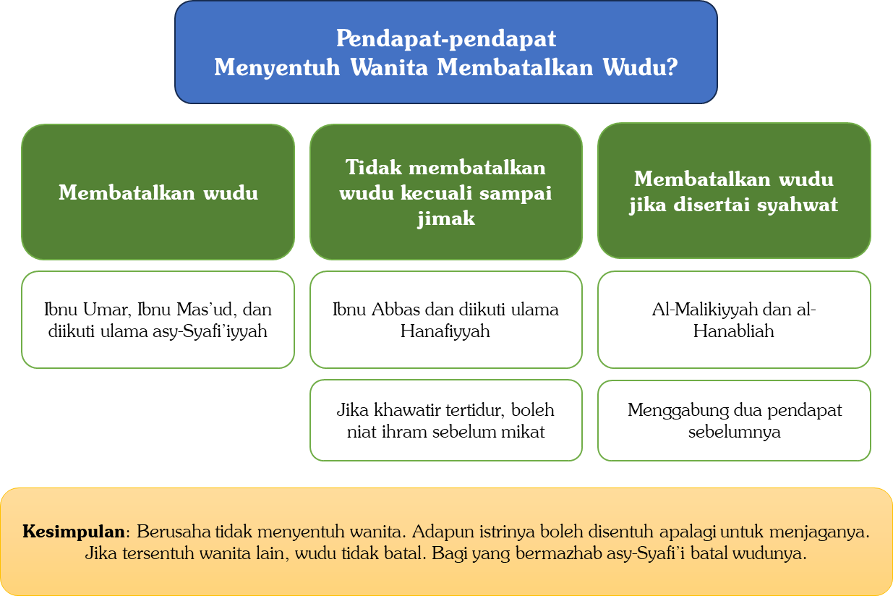

Pertanyaan 2: Bolehkah Menggabungkan Tawaf Ifadah dengan Tawaf Wadak?

Jawab:

Tidak diragukan lagi bahwa rangkaian amalan haji adalah ibadah yang melelahkan, terlebih bagi kaum wanita. Karena itulah Rasulullah ﷺ menyebut haji dan umrah sebagai jihadnya kaum wanita.

Di zaman sekarang, kondisi ini semakin berat karena jumlah jemaah haji yang sangat banyak dan berdesakan, terutama saat tawaf. Mataf (area tawaf) terasa begitu sempit dan sesak. Seorang yang berhaji Tamattu’ bahkan wajib melakukan tiga kali tawaf: tawaf umrah, tawaf ifadah, dan tawaf wadak.

Sebagian jemaah mengakhirkan tawaf ifadahnya dan mengerjakannya menjelang meninggalkan Makkah, lalu menggabungkannya dengan tawaf wadak. Artinya, cukup satu kali tawaf dengan niat tawaf ifadah, namun sudah mencukupkan tawaf wadak sekaligus. Bagaimana hukumnya?

Para ulama berselisih pendapat dalam masalah ini. Akar perselisihannya kembali kepada dua pertanyaan mendasar.

Pertama, apakah tawaf wadak adalah ibadah khusus yang dimaksudkan oleh syariat, ataukah tawaf wadak tidak dimaksudkan secara khusus, yang penting sebelum meninggalkan Makkah seseorang mengerjakan tawaf?

Ini mirip dengan salat tahiat masjid, yang bukan merupakan ibadah khusus yang dimaksudkan tersendiri, melainkan yang penting sebelum duduk di masjid seseorang telah mengerjakan dua rakaat. Karenanya, siapa pun yang masuk masjid lalu langsung mengerjakan salat dua rakaat, baik salat qabliyah, salat sunah wudu, salat istikharah, maupun salat wajib seperti subuh atau salat yang lebih dari dua rakaat seperti Magrib, Zuhur, Asar, dan Isya, maka salat tahiat masjid sudah terwakili karena tujuannya telah tercapai.

Pendapat pertama, bagi ulama yang memandang tawaf wadak sebagai ibadah khusus yang dimaksudkan oleh syariat, mereka menyatakan bahwa tawaf ifadah tidak boleh digabungkan dengan tawaf wadak.

Prinsipnya, suatu kewajiban tidak bisa mewakilkan kewajiban yang lain jika memang masing-masing dimaksudkan secara tersendiri oleh syariat. Ini adalah pendapat mazhab Hanafiyah.

Ibnu Nujaim Al-Hanafi (wafat 970 H) berkata,

```arabic
لَوْ دَخَلَ الْمَسْجِدَ، وَصَلَّى الْفَرْضَ أَوْ الرَّاتِبَةَ دَخَلَتْ فِيهِ التَّحِيَّةُ، وَلَوْ طَافَ الْقَادِمُ عَنْ فَرْضٍ، وَنَذْرٍ دَخَلَ فِيهِ طَوَافُ الْقُدُومِ بِخِلَافِ مَا لَوْ طَافَ لِلْإِفَاضَةِ لَا يَدْخُلُ فِيهِ طَوَافُ الْوَدَاعِ؛ لِأَنَّ كُلًّا مِنْهُمَا مَقْصُودٌ وَمَقْصُودَهُمَا مُخْتَلِفٌ
```

"Jika ia masuk masjid lalu salat fardu atau sunah rawatib maka telah masuk ke dalamnya salat tahiat masjid. Dan jika seseorang yang datang ke Makkah lalu melakukan tawaf karena kewajiban atau karena nazar maka telah masuk ke dalamnya tawaf qudum. Hal ini berbeda jika seandainya ia tawaf dengan tawaf ifadah maka tawaf wadak tidak masuk ke dalamnya, karena masing-masing dari keduanya dimaksudkan (oleh syariat) dan tujuan keduanya pun berbeda."[^102]

Abul Hasan Ali bin al-Husain as-Sugdiy (wafat 461 H) berkata,

```arabic
وَأَمَّا طَوَافُ الْوَدَاعِ فَهُوَ عِنْدَ النَّفْرِ، فَيَطُوفُ بِالْبَيْتِ سَبْعًا بِلَا رَمَلٍ، وَيَخْرُجُ وَلَا يَلْبَثُ. فَإِنْ تَرَكَ طَوَافَ الزِّيَارَةِ وَطَافَ لِلْوَدَاعِ، فَإِنَّهُ يَقُومُ مَقَامَ طَوَافِ الزِّيَارَةِ، وَعَلَيْهِ دَمَانِ: دَمٌ لِتَأْخِيرِهِ طَوَافَ الزِّيَارَةِ، وَدَمٌ لِفَوَاتِ طَوَافِ الْوَدَاعِ فِي قَوْلِ أَبِي حَنِيفَةَ. وَفِي قَوْلِ أَبِي يُوسُفَ وَمُحَمَّدٍ عَلَيْهِ دَمٌ وَاحِدٌ لِفَوَاتِ طَوَافِ الْوَدَاعِ، وَلَيْسَ عَلَيْهِ شَيْءٌ لِتَأْخِيرِ طَوَافِ الزِّيَارَةِ
```

"Adapun tawaf wada’ maka dilakukan tatkala hendak pergi, maka ia pun tawaf di Ka’bah tujuh kali tanpa melakukan ar-ramal. Lalu ia pergi dan tidak tinggal di Makkah. Jika ia meninggalkan tawaf ziarah/ifadah dan ia melakukan tawaf wadak maka jadilah tawaf wadak nya menggantikan posisi tawaf ifadah, akan tetapi wajib baginya dua dam, pertama dam karena mengakhirkan tawaf wadak, dan kedua dam karena tidak melakukan tawaf wadak. Dan dalam satu pendapat Abu Hanifah, dan satu pendapat Abu Yusuf dan Muhammad bin al-Hasan Asy-Syaibani: hanya wajib baginya satu dam saja yaitu karena meninggalkan tawaf wadak, dan ia tidak wajib bayar dam karena mengakhirkan tawaf ifadah."[^103]

Pendapat ini juga dipilih oleh Syekh al-Albâni rahimahullâh. Beliau berkata,

```arabic
وَهُنَاكَ قَاعِدَةٌ أَنَّهُ لَا يُغْنِي وَاجِبٌ عَنْ وَاجِبٍ، وَقَدْ يُغْنِي وَاجِبٌ عَنْ مُسْتَحَبٍّ. وَالسُّؤَالُ الْآنَ: هَلْ يُمْكِنُ أَنْ يَسْتَغْنِيَ الْحَاجُّ بِطَوَافِ الْإِفَاضَةِ عَنْ طَوَافِ الْوَدَاعِ؟
```

```arabic
نَقُولُ: لَوْ كَانَ طَوَافُ الْوَدَاعِ سُنَّةً، لَقُلْنَا يَكْفِي أَنْ يَنْوِيَ فِي قَلْبِهِ الْفَرْضَ، وَهُوَ طَوَافُ الْإِفَاضَةِ، وَيَزِيدَ عَلَى ذَلِكَ نِيَّةً أُخْرَى، وَهِيَ أَدَاءُ سُنَّةِ طَوَافِ الْوَدَاعِ، هَذَا عَلَى افْتِرَاضِ أَنَّ طَوَافَ الْوَدَاعِ سُنَّةٌ.
```

```arabic
وَلَكِنَّ طَوَافَ الْوَدَاعِ وَاجِبٌ، أَمَرَ بِهِ النَّبِيُّ صَلَّى اللَّهُ عَلَيْهِ وَآلِهِ وَسَلَّمَ، وَفَرَّقَ بَيْنَهُ وَبَيْنَ طَوَافِ الْإِفَاضَةِ، فَجَعَلَ طَوَافَ الْإِفَاضَةِ لَابُدَّ لِلْمَرْأَةِ الْحَائِضِ إِذَا حَاضَتْ أَنْ تَتَأَخَّرَ، وَأَنْ لَا تَطُوفَ وَهِيَ حَائِضٌ، مَهْمَا طَالَ بِهَا الْحَيْضُ، حَتَّى تَتَطَهَّرَ، وَتَطُوفَ طَوَافَ الْإِفَاضَةِ طَاهِرًا.
```

```arabic
أَمَّا طَوَافُ الْوَدَاعِ، فَقَدْ أَسْقَطَ الشَّارِعُ الْحَكِيمُ وُجُوبَهُ عَنِ الْمَرْأَةِ الْحَائِضِ، تَخْفِيفًا مِنْ رَبِّهَا عَنْهَا.
```

```arabic
فَإِذًا لَا يَجُوزُ الِاكْتِفَاءُ بِطَوَافِ الْإِفَاضَةِ عَنْ طَوَافِ الْوَدَاعِ، لِأَنَّ كُلًّا مِنْهُمَا وَاجِبٌ، وَأَحَدُهُمَا آكَدُ مِنَ الْآخَرِ، وَهُوَ طَوَافُ الْإِفَاضَةِ
```

“Terdapat sebuah kaidah: ‘suatu kewajiban tidak bisa mewakilkan kewajiban yang lain, meskipun bisa jadi suatu kewajiban mencukupkan sesuatu yang mustahab.’ Pertanyaannya, apakah seorang haji bisa mencukupkan tawaf ifadah untuk mewakili tawaf wadak?

Kami katakan, seandainya tawaf wadak itu sunah, maka cukup baginya berniat dalam hati untuk mengerjakan tawaf wajib yaitu tawaf ifadah, ditambah niat mengerjakan sunah tawaf wadak. Namun tawaf wadak hukumnya wajib, diperintahkan oleh Nabi ﷺ, dan beliau membedakan antara tawaf wadak dengan tawaf ifadah.

Beliau menjadikan tawaf ifadah sebagai sesuatu yang wajib bagi wanita haid, bagaimana pun lamanya haid, ia harus menunggu hingga suci baru boleh tawaf ifadah dalam keadaan suci. Adapun tawaf wadak, Allah Yang Maha bijaksana telah menggugurkan kewajibannya dari wanita haid sebagai keringanan. Maka tidak boleh mencukupkan tawaf ifadah untuk mewakili tawaf wadak, karena masing-masing adalah kewajiban tersendiri, dan salah satunya lebih wajib dari yang lain, yaitu tawaf ifadah.” [^104]

Pendapat kedua, bagi ulama yang menganalogikan tawaf wadak seperti salat tahiat masjid, mereka memandang bahwa tawaf ifadah yang diakhirkan dan dikerjakan menjelang meninggalkan Makkah sudah mencukupkan tawaf wadak.

Syekh Bin Baz rahimahullâh berkata,

```arabic
لَوْ أَنَّ إِنْسَانًا أَخَّرَ طَوَافَ الْإِفَاضَةِ، فَلَمَّا عَزَمَ عَلَى السَّفَرِ طَافَ عِنْدَ سَفَرِهِ بَعْدَمَا رَمَى الْجِمَارَ وَانْتَهَى مِنْ كُلِّ شَيْءٍ، فَإِنَّ طَوَافَ الْإِفَاضَةِ يُجْزِئُهُ عَنْ طَوَافِ الْوَدَاعِ. وَإِنْ طَافَهُمَا – طَوَافَ الْإِفَاضَةِ وَطَوَافَ الْوَدَاعِ – فَهَذَا خَيْرٌ إِلَى خَيْرٍ، وَلَكِنْ مَتَى اكْتَفَى بِوَاحِدٍ وَنَوَى طَوَافَ الْحَجِّ أَجْزَأَهُ ذَلِكَ
```

"Jika seseorang mengakhirkan tawaf ifadahnya, lalu ketika hendak bersafar ia tawaf setelah melempar jamarat dan telah selesai dari seluruh manasik, maka tawaf ifadahnya sudah mencukupkan tawaf wadak. Dan jika ia mengerjakan keduanya, tawaf ifadah dan tawaf wadak, maka itu lebih baik. Namun barang siapa yang mencukupkan hanya dengan satu tawaf saja dengan niat tawaf haji (tawaf ifadah), maka itu sudah mencukupinya."[^105]

Syekh Ibnu al-'Utsaimin rahimahullâh berkata,

```arabic
إِنْ نَوَى طَوَافَ الْوَدَاعِ فَقَطْ لَمْ يُجْزِئْ عَنْ طَوَافِ الْإِفَاضَةِ؛ لِأَنَّ طَوَافَ الْوَدَاعِ وَاجِبٌ، وَطَوَافَ الْإِفَاضَةِ رُكْنٌ، بَلْ إِنَّ طَوَافَ الْوَدَاعِ سُنَّةٌ عِنْدَ كَثِيرٍ مِنَ الْعُلَمَاءِ، وَطَوَافَ الْإِفَاضَةِ رُكْنٌ.
```

```arabic
وَإِنْ نَوَى طَوَافَ الْإِفَاضَةِ فَقَدْ أَجْزَأَ عَنِ الْوَدَاعِ؛ لِأَنَّهُ أَعْلَى مِنْهُ، وَلِأَنَّ الْمَقْصُودَ بِطَوَافِ الْوَدَاعِ أَنْ يَكُونَ آخِرَ عَهْدِهِ بِالْبَيْتِ، وَقَدْ حَصَلَ، فَيُجْزِئُهُ طَوَافُ الْإِفَاضَةِ عَنْ طَوَافِ الْوَدَاعِ، كَمَا تُجْزِئُ الْفَرِيضَةُ فِي الْمَسْجِدِ عَنْ تَحِيَّةِ الْمَسْجِدِ.
```

```arabic
وَقَالَ: إِنْ نَوَاهُمَا جَمِيعًا جَازَ؛ لِعُمُومِ قَوْلِ النَّبِيِّ صَلَّى اللَّهُ عَلَيْهِ وَعَلَى آلِهِ وَسَلَّمَ:))إِنَّمَا الْأَعْمَالُ بِالنِّيَّاتِ، وَإِنَّمَا لِكُلِّ امْرِئٍ مَا نَوَى))
```

"Jika ia berniat tawaf wadak saja, maka tidak mencukupkan tawaf ifadah, sebab tawaf wadak hukumnya wajib sedangkan tawaf ifadah adalah rukun. Bahkan banyak ulama yang menganggap tawaf wadak hanya sunah sementara tawaf ifadah adalah rukun. Adapun jika ia meniatkan tawaf ifadah, maka itu sudah mencukupkan tawaf wadak, karena tawaf ifadah lebih tinggi kedudukannya. Lagipula, tujuan tawaf wadak adalah agar kegiatan terakhirnya sebelum meninggalkan Ka’bah adalah tawaf, dan tujuan itu sudah tercapai. Maka tawaf ifadah mencukupkan tawaf wadak, sebagaimana salat wajib sudah mencukupkan tahiat masjid. Beliau juga berkata: jika ia meniatkan keduanya sekaligus maka diperbolehkan, berdasarkan keumuman sabda Nabi ﷺ, 'Sesungguhnya amalan-amalan itu tergantung niatnya, dan bagi setiap orang apa yang ia niatkan.'"[^106]

Kedua, jika kita menyatakan bolehnya menggabungkan tawaf ifadah dengan tawaf wadak, maka ada dua bentuk permasalahan yang perlu dicermati.

Bentuk pertama: jika yang menggabungkan adalah seorang haji Ifrad atau haji Kiran yang sebelumnya sudah mengerjakan sai haji setelah tawaf qudum, maka tidak ada masalah. Karena setelah tawaf tersebut mereka langsung keluar dari Makkah tanpa manasik lain yang tersisa, sehingga tawaf benar-benar menjadi kegiatan manasik terakhir mereka. Ini sesuai dengan sabda Nabi ﷺ,

```arabic
((لَا يَنْفِرَنَّ أَحَدٌ حَتَّى يَكُونَ آخِرُ عَهْدِهِ الطَّوَافَ بِالْبَيْتِ))
```

"Janganlah salah seorang dari kalian meninggalkan (Makkah) hingga kegiatan terakhirnya adalah tawaf di Ka’bah."[^107]

Bentuk kedua: jika yang menggabungkan adalah seorang haji Tamattu’, maka ada permasalahan tersendiri. Setelah tawaf ifadah, ia masih harus mengerjakan sai haji, sehingga kegiatan manasik terakhirnya bukan tawaf melainkan sai. Lantas, apakah tawaf ifadahnya bisa mewakili tawaf wadak? Para ulama kembali terbagi menjadi dua pendapat.

Pendapat pertama: tawaf ifadah tidak bisa mewakili tawaf wadak karena manasik terakhir yang dikerjakan adalah sai, bukan tawaf. Ini adalah pendapat mazhab Syafi’iyah dan sebagian ulama Hanbali.

Badruddin az-Zarkasyi dalam al-Mantsûr fî-al-Qawâ'id berkata,

```arabic
فَإِنْ قُلْتَ: هَلْ يَصِحُّ السَّعْيُ بَعْدَ طَوَافِ الْوَدَاعِ؟ قُلْتُ: هَذَا مُغَالَطَةٌ؛ لِأَنَّ طَوَافَ الْوَدَاعِ لَا يَصِحُّ قَبْلَ إِتْمَامِ الْمَنَاسِكِ، فَكَيْفَ يَصِحُّ قَبْلَ السَّعْيِ؟
```

"Jika engkau berkata, ‘Apakah sah sai yang dilakukan setelah tawaf wadak?'

Aku katakan, ‘Ini merupakan kesalahan, karena tawaf wadak tidaklah sah sebelum menyelesaikan seluruh manasik haji, maka bagaimana bisa sah tawaf wadak sebelum sai?’"[^108]

Ar-Rafi’i berkata,

```arabic
غَيْرَ أَنَّهُ لَا يُتَصَوَّرُ وُقُوعُ السَّعْيِ بَعْدَ طَوَافِ الْوَدَاعِ؛ فَإِنَّ طَوَافَ الْوَدَاعِ هُوَ الْوَاقِعُ بَعْدَ أَعْمَالِ الْمَنَاسِكِ، فَإِذَا بَقِيَ السَّعْيُ عَلَيْهِ لَمْ يَكُنِ الْمَأْتِيُّ بِهِ طَوَافَ الْوَدَاعِ
```

"Hanya saja tidaklah tergambarkan dilaksanakannya sai setelah tawaf wadak, karena tawaf wadak itulah yang dikerjakan setelah seluruh amalan-amalan manasik haji, jika ternyata masih tersisa sai yang harus ia kerjakan (setelah tawaf wadak), maka tawaf yang dikerjakan tersebut bukanlah tawaf wadak…"[^109]

Zakariya al-Anshari berkata,

```arabic
يَجِبُ على الصَّبِيِّ إذَا بَلَغَ بِعَرَفَةَ إعَادَتُهُ كما سَيَأْتِي فَإِنْ أَخَّرَهُ إلَى ما بَعْدَ طَوَافِ الْوَدَاعِ لم يُعْتَدَّ بِوَدَاعِهِ لِأَنَّهُ إنَّمَا يُؤْتَى بِهِ بَعْدَ الْفَرَاغِ وَاذَا بَقِيَ السَّعْيُ لم يَكُنْ الْمَأْتِيُّ بِهِ طَوَافَ وَدَاعٍ
```

"Wajib bagi seorang anak (yang sudah mendahulukan sai haji setelah tawaf qudum-pen) jika ternyata balig (dewasa) ketika di 'Arafah untuk mengulangi sai hajinya–sebagaimana akan datang penjelasannya-. Dan jika ia mengakhirkan sai nya hingga setelah tawaf wadak maka tawaf wadaknya tidak teranggap, karena tawaf wadak hanyalah dikerjakan setelah selesai (dari seluruh amalan manasik haji-pen), dan jika setelah tawaf wadak masih tersisa sai maka tawaf yang dikerjakan tersebut bukanlah tawaf wadak…"[^110]

Ini juga merupakan zahir pendapat sebagian ulama Hanbali. Ibnu Qudamah rahimahullâh berkata,

```arabic
وَوَقْتُهُ بَعْدَ فَرَاغِ الْمَرْءِ مِنْ جَمِيعِ أُمُورِهِ، لِيَكُونَ آخِرَ عَهْدِهِ بِالْبَيْتِ، عَلَى مَا جَرَتْ بِهِ الْعَادَةُ فِي تَوْدِيعِ الْمُسَافِرِ إِخْوَانَهُ وَأَهْلَهُ؛ وَلِذَلِكَ قَالَ النَّبِيُّ صَلَّى اللَّهُ عَلَيْهِ وَسَلَّمَ: ((حَتَّى يَكُونَ آخِرَ عَهْدِهِ بِالْبَيْتِ))
```

"Dan waktu pelaksanaan tawaf wadak adalah setelah seseorang selesai dari seluruh urusannya, agar kegiatan terakhirnya adalah tawaf sebagaimana kebiasaan yang berlaku bagi seorang musafir yang hendak mengucapkan selamat tinggal terhadap saudara-saudaranya dan keluarganya. Karenanya Nabi Muhammad ﷺ bersabda, ‘Hingga akhir kegiatannya adalah tawaf di Ka’bah.’"[^111]

Pendapat kedua: tawaf ifadah sudah mencukupkan tawaf wadak meskipun setelahnya masih ada sai, karena sai hanyalah kegiatan yang sebentar sehingga tidak dianggap memutus perpisahan. Ini adalah pendapat mazhab Malikiah, sebagian ulama Hanbali, dan sebagian ulama Syafi’iyah.

Khalil bin Ishaq al-Jundi berkata,

```arabic
وَتَأَدَّى بِالإِفَاضَةِ وَالْعُمْرَةِ
```

"Dan Tawaf al-Wadak terkerjakan dengan tawaf ifadah dan tawaf umrah."[^112]

Ahmad ad-Dardir menjelaskan perkataan al-Khalil ini dengan berkata,

```arabic
(وَتَأَدَّى) الْوَدَاعُ (بِالْإِفَاضَةِ وَ) بِطَوَافِ (الْعُمْرَةِ)، أَيْ سَقَطَ طَلَبُهُ بِهِمَا، وَيَحْصُلُ لَهُ ثَوَابُ طَوَافِ الْوَدَاعِ إِنْ نَوَاهُ بِهِمَا
```

"Yaitu tawaf wadak terkerjakan dengan tawaf ifadah dan tawaf umrah, yaitu tawaf wadak gugur dengan mengerjakan kedua tawaf tersebut (yaitu tawaf ifadah dan tawaf umrah), dan ia mendapatkan pahala tawaf wadak jika ia meniatkan tawaf wadak bersamaan dengan kedua tawaf tersebut."[^113]

Dan kita maklumi bahwa dalam umrah, seseorang mengerjakan tawaf kemudian sai. Namun menurut mazhab Malikiah, sai tersebut tidak menghalangi tawaf umrah untuk berposisi sebagai tawaf wadak karena sai hanyalah sebentar.

Ahmad ash-Shawi berkata,

```arabic
قَوْلُهُ: [وَتَأَدَّى طَوَافُ الْوَدَاعِ] إلَخْ: أَيْ لِأَنَّهُ لَيْسَ مَقْصُودًا لِذَاتِهِ، بَلْ لِيَكُونَ آخِرَ عَهْدِهِ مِنْ الْبَيْتِ الطَّوَافُ، وَلَا يَكُونُ السَّعْيُ بَعْدَهُ طُولًا حَيْثُ لَمْ يَقُمْ بَعْدَهُ إقَامَةً تَقْطَعُ حُكْمَ التَّوْدِيعِ
```

"Maksud perkataan al-Khalil adalah karena tawaf wadak tidak dimaksudkan secara zatnya sendiri, melainkan agar kegiatan terakhirnya sebelum berpisah dari Ka’bah adalah tawaf. Dan sai setelahnya tidaklah dianggap panjang, karena sai bukanlah menetap yang memutus hukum perpisahan."[^114]

Sebagian ulama Syafi’iyah pun berpendapat demikian. An-Nawawi berkata,

```arabic
قَالَ صَاحِبُ الْبَيَانِ: قَالَ الشَّيْخُ أَبُو نَصْرٍ: يَجُوزُ لِمَنْ أَحْرَمَ بِالْحَجِّ مِنْ مَكَّةَ إِذَا طَافَ لِلْوَدَاعِ لِخُرُوجِهِ إِلَى مِنًى أَنْ يُقَدِّمَ السَّعْيَ بَعْدَ هَذَا الطَّوَافِ. قَالَ: وَبِمَذْهَبِنَا هَذَا قَالَ ابْنُ عُمَرَ وَابْنُ الزُّبَيْرِ وَالْقَاسِمُ بْنُ مُحَمَّدٍ.
```

```arabic
وَقَالَ مَالِكٌ وَأَحْمَدُ وَإِسْحَاقُ: لَا يَجُوزُ ذَلِكَ لَهُ، وَإِنَّمَا يَجُوزُ لِلْقَادِمِ.
```

```arabic
دَلِيلُنَا: أَنَّهُ إِذَا جَازَ ذَلِكَ لِمَنْ أَحْرَمَ مِنْ خَارِجِ مَكَّةَ، جَازَ لِلْمُحْرِمِ مِنْهَا
```

"Pemilik kitab al-Bayân berkata, asy-Syaikh Abu Nashr berkata, Boleh bagi yang berihram haji dari Makkah, jika ia tawaf wadak untuk keluar ke Mina, untuk mengerjakan sai setelah tawaf tersebut. Ia berkata, Yang sependapat dengan kami adalah Ibnu Umar, Ibnu az-Zubair, dan al-Qasim bin Muhammad. Imam Malik, Ahmad, dan Ishaq berkata, Hal ini hanya boleh bagi yang berihram dari luar Makkah. Dalil kami: jika diperbolehkan bagi yang berihram dari luar Makkah, maka demikian pula berlaku bagi yang berihram dari dalam Makkah." [^115]

Namun an-Nawawi sendiri mengomentari, "Penukilan dari pemilik kitab al-Bayân ini, aku tidak menemukan selain dia yang menyetujuinya. Dan zahir pendapat para ulama Syafi’iyah adalah tidak bolehnya sai kecuali setelah tawaf qudum atau tawaf ifadah." [^116]

Dalam kitab fikih mazhab Hanbali[^117] disebutkan,

```arabic
وَلَوْ أَخَّرَ ذَلِكَ إِلَى مَا بَعْدَ طَوَافِ الْإِفَاضَةِ جَازَ؛ فَإِنَّ الْحَجَّ فِيهِ ثَلَاثَةُ أَطْوَافٍ: طَوَافُ الْقُدُومِ...وَطَوَافُ الْإِفَاضَةِ...وَالطَّوَافُ الثَّالِثُ هُوَ لِمَنْ أَرَادَ الْخُرُوجَ مِنْ مَكَّةَ، وَهُوَ طَوَافُ الْوَدَاعِ، وَإِذَا سَعَى عَقِبَ وَاحِدٍ مِنْهَا أَجْزَأَهُ
```

"Jika ia mengakhirkan sai hingga setelah tawaf ifadah maka boleh. Karena dalam haji ada tiga tawaf: tawaf qudum... tawaf ifadah...dan tawaf ketiga... yaitu tawaf wadak bagi yang hendak keluar dari Makkah. Jika ia mengerjakan sai setelah salah satu dari tiga tawaf tersebut maka sudah mencukupinya."

Pendapat yang terkuat

Pendapat yang kuat adalah tawaf ifadah tetap bisa mewakili tawaf wadak meskipun setelahnya masih ada sai haji. Dalilnya adalah kisah umrah Aisyah radhiyallâhu ‘anhâ yang ditemani saudaranya Abdurrahman bin Abu Bakar radhiyallâhu ‘anhumâ.

Umrah tersebut dilakukan Aisyah radhiyallâhu 'anhâ ketika bersafar berhaji dari Madinah ke Makkah bersama Nabi ﷺ. Haji Aisyah adalah haji Kiran. Sebelum kembali ke Madinah, beliau mengerjakan umrah dengan satu tawaf, yaitu tawaf umrah, lalu sai umrah, kemudian langsung pulang bersama Nabi ﷺ tanpa mengerjakan tawaf wadak lagi. Ini menunjukkan bahwa tawaf umrahnya sudah mencukupkan tawaf wadak, dan sai umrah yang beliau lakukan setelahnya tidak membatalkan perpisahan tersebut, karena sai adalah kegiatan yang sebentar dan tidak dianggap seperti orang yang akan menetap di Makkah.

Al-Imam al-Bukhari rahimahullâh dalam sahihnya membuat bab:

```arabic
بَابٌ: الْمُعْتَمِرُ إِذَا طَافَ طَوَافَ الْعُمْرَةِ ثُمَّ خَرَجَ، هَلْ يُجْزِئُهُ عَنْ طَوَافِ الْوَدَاعِ؟
```

"Bab: Seorang yang umrah jika melakukan tawaf umrah kemudian keluar, apakah sudah mencukupkan tawaf wadak?"

Setelah itu beliau membawakan hadis tentang kisah umrah Aisyah radhiyallâhu ‘anhâ, di mana Aisyah berkata,

```arabic
فَدَعَا عَبْدَ الرَّحْمَنِ فَقَالَ: ((اُخْرُجْ بِأُخْتِكَ الْحَرَمَ فَلْتُهِلَّ بِعُمْرَةٍ ثُمَّ افْرُغَا مِنْ طَوَافِكُمَا أَنْتَظِرُكُمَا هَا هُنَا)) فَأَتَيْنَا فِي جَوْفِ اللَّيْلِ، فَقَالَ: ((فَرَغْتُمَا؟)) قُلْتُ: نَعَمْ، فَنَادَى بِالرَّحِيْلِ فِي أَصْحَابِهِ فَارْتَحَلَ النَّاسُ وَمَنْ طَافَ بِالْبَيْتِ قَبْلَ صَلَاةِ الصُّبْحِ ثُمَّ خَرَجَ مُوَجّهًا إِلَى الْمَدِيْنَةِ
```

"Maka Nabi Muhammad ﷺ memanggil Abdurrahman (bin Abu Bakar) lalu beliau berkata, ‘Bawalah saudara perempuanmu (yaitu Aisyah binti Abu Bakar) ke luar haram lalu hendaknya Aisyah berihram untuk umrah, lalu selesailah kalian berdua dari tawaf kalian dan aku menunggu kalian berdua di sini.’

(Setelah selesai umrah-pen) kami pun mendatangi Nabi di tengah malam. Lalu Nabi berkata, ‘Apakah kalian berdua sudah selesai (dari umrah kalian)?’

Aku (Aisyah) berkata, ‘Iya.’

Lalu Nabi mengumumkan kepada para sahabatnya untuk bersafar (pulang meninggalkan Makkah-pen). Maka orang-orang pun bersafar demikian juga orang-orang yang tawaf di Ka’bah sebelum salat subuh, lalu Nabi pun keluar menuju ke Madinah"[^118]

Sangat jelas dari hadis ini bahwa Aisyah hanya mengerjakan tawaf umrah, dan tawaf itu sudah mewakili tawaf wadaknya meskipun setelah tawaf umrah beliau masih mengerjakan sai umrah. Sai tersebut tidak menghalangi tawaf umrahnya untuk berposisi sebagai tawaf wadak.

Ibnu Hajar berkata,

```arabic
وَيُسْتَفَادُ مِنْ قِصَّةِ عَائِشَةَ أَنَّ السَّعْيَ إِذَا وَقَعَ بَعْدَ طَوَافِ الرُّكْنِ، إِنْ قُلْنَا إِنَّ طَوَافَ الرُّكْنِ يُغْنِي عَنْ طَوَافِ الْوَدَاعِ، أَنَّ تَخَلُّلَ السَّعْيِ بَيْنَ الطَّوَافِ وَالْخُرُوجِ لَا يَقْطَعُ إِجْزَاءَ الطَّوَافِ الْمَذْكُورِ عَنِ الرُّكْنِ وَالْوَدَاعِ مَعًا
```

"Dan diambil faedah dari kisah Aisyah bahwasanya sai jika dilakukan setelah tawaf rukun—jika kita mengatakan bahwa tawaf rukun sudah mencukupkan tawaf wadak- bahwasanya dilakukannya sai antara tawaf dengan keluar (dari Makkah) tidaklah memotong/membatalkan bagian—bagian tawaf tersebut dari rukunnya dan wadak nya sekaligus."[^119]

Bahkan dalam riwayat lain disebutkan bahwa setelah Aisyah menemui Nabi, beliau pun berangkat mengerjakan tawaf sebelum subuh, baru kemudian pulang ke Madinah. Tawaf yang dikerjakan Nabi itu adalah tawaf wadak.[^120] Sementara Aisyah hanya menunggu dan tidak ikut tawaf bersama Nabi, karena tawaf umrahnya sudah mewakili tawaf wadak.

Pendapat ini juga diperkuat oleh kisah bahwa setelah Nabi ﷺ mengerjakan tawaf wadak sebelum subuh dan hendak keluar dari Masjidilharam, ternyata istrinya Ummu Salamah belum sempat tawaf wadak karena sakit. Akhirnya Nabi menunggu, dan beliau pun mengimami salat subuh di Masjidilharam sementara Ummu Salamah mengerjakan tawaf wadak. Ini menunjukkan bahwa salat subuh di Masjidilharam, dengan bacaan yang panjang, yaitu surah Ath-Thûr, pun tidak membatalkan tawaf wadak.[^121]

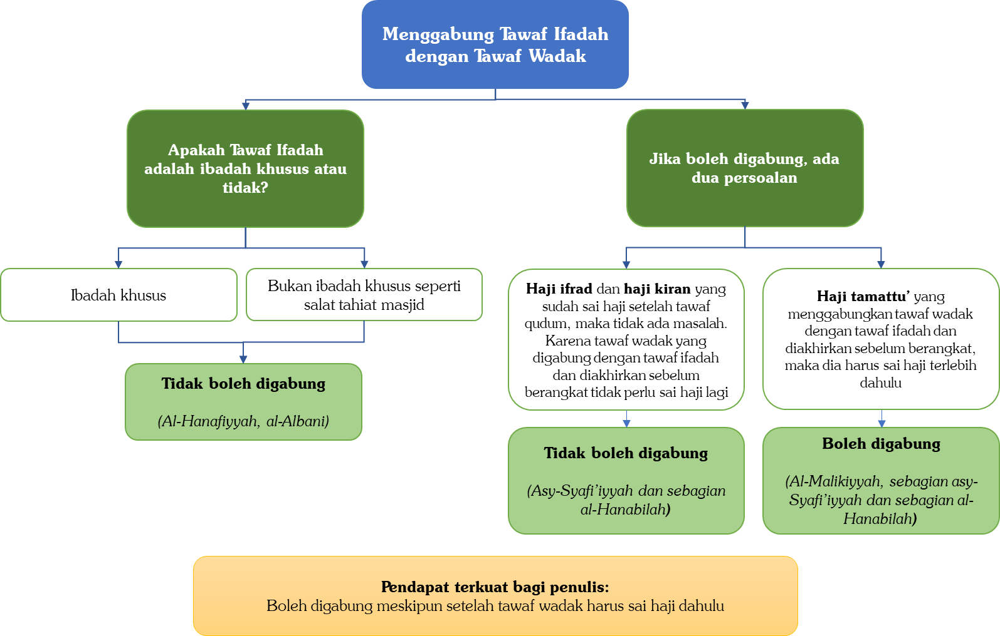

Pertanyaan 3: Bagaimana jika seseorang batal wudunya ketika sedang tawaf?

Jawab:

Jika seseorang batal wudu di tengah tawaf, hendaknya ia berhenti sejenak untuk berwudu kembali, lalu melanjutkan tawafnya dari titik ia batal, tidak perlu mengulang dari awal. Jika kondisi sangat padat dan sulit untuk keluar berwudu lalu kembali ke posisi semula, maka tidak mengapa ia melanjutkan tawafnya dan tidak perlu membayar dam.

Perincian:

Para ulama berselisih tentang apakah bersuci merupakan syarat sah tawaf. Secara umum ada tiga pendapat.

Pertama, bersuci merupakan syarat sah tawaf. Ini adalah pendapat jumhur ulama, yaitu mazhab Malikiah,[^122] Syafi’iyah,[^123] dan Hanabilah.[^124]

Kedua, bersuci bukan syarat sah tawaf, melainkan hanya kewajiban tawaf. Artinya, jika seseorang sengaja tawaf dalam kondisi berhadas atau junub, tawafnya sah namun ia wajib membayar dam karena meninggalkan kewajiban. Ini adalah pendapat Hanafiyah.[^125]

Ketiga, bersuci dari hadas kecil hukumnya sunah dalam tawaf, sehingga jika seseorang tawaf dalam kondisi berhadas kecil, tawafnya sah dan tidak perlu membayar dam. Ini adalah pendapat yang dipilih oleh Ibnu Taimiyyah[^126] dan al-‘Utsaimin[^127].

Dari perselisihan di atas, muncul pula perselisihan dalam permasalahan yang sedang kita bahas: apa yang harus dilakukan seseorang yang batal wudunya di tengah tawaf?

Pendapat pertama, mazhab Hanafiyah: Jika ia melanjutkan saja, tawafnya sah namun wajib membayar dam. Jika ia ingin sempurna, ia berwudu lalu mengulangi tawaf dari awal (dari putaran pertama). As-Sarakhsi berkata,

```arabic
أَنَّ طَوَافَ الْمُحْدِثِ مُعْتَدٌّ بِهِ عِنْدَنَا، وَلَكِنَّ الأَفْضَلَ أَنْ يُعِيدَهُ، وَإِنْ لَمْ يُعِدْهُ فَعَلَيْهِ دَمٌ
```

“Sesungguhnya tawaf orang yang berhadas adalah sah di sisi kami (mazhab Hanafiyah), akan tetapi yang lebih afdhal adalah ia mengulangi lagi. Jika ia tidak mengulangi tawaf maka ia wajib bayar dam.”[^128]

Pendapat kedua, mazhab Malikiah: Ia wajib berwudu dan mengulangi tawaf dari awal (dari putaran pertama). Al-Qarafi berkata,

```arabic
وَمَنْ أَحْدَثَ فِي طَوَافِهِ قَاصِدًا أَوْ غَيْرَ قَاصِدٍ انْتَقَضَ طَوَافُهُ وَتَطَهَّرَ وَابْتَدَأَهُ
```

“Siapa yang berhadas dalam tawafnya baik sengaja maupun tidak sengaja maka batallah tawafnya dan ia bersuci lalu memulai lagi dari awal.”[^129]

Al-Khurasyi berkata,

```arabic
أَنَّهُ إذَا حَصَلَ فِي أَثْنَاءِ الطَّوَافِ حَدَثٌ عَمْدًا، أَوْ سَهْوًا أَيْ: سَاهِيًا عَنْ كَوْنِهِ فِي الطَّوَافِ، أَوْ غَلَبَةً فَإِنَّهُ يُبْطِلُهُ وَيَمْنَعُ مِنْ الْبِنَاءِ عَلَى مَا مَضَى مِنْ الَاشْوَاطِ عَلَى الْمَشْهُورِ كَانَ الطَّوَافُ وَاجِبًا أَوْ تَطَوُّعًا
```

“Jika timbul hadas di tengah-tengah tawaf baik karena sengaja ataupun kelupaan, yaitu ia lupa kalau ia sedang tawaf, atau karena tidak bisa ia tahan lantas berhadas maka ia batalkan tawafnya, dan tidak boleh ia melanjutkan putaran-putaran sebelumnya, menurut pendapat yang masyhur, baik tawaf yang wajib ataupun sunah.”[^130]

Pendapat ketiga, mazhab Hanbali (salah satu riwayat): Jika batal karena sengaja, ia berwudu dan harus mengulang dari awal. Namun jika tidak sengaja, ia berwudu dan cukup melanjutkan dari putaran tempat ia batal. Ibnu Qudamah berkata,

```arabic
إذَا أَحْدَثَ عَمْدًا فَإِنَّهُ يَبْتَدِئُ الطَّوَافَ؛ لِأَنَّ الطَّهَارَةَ شَرْطٌ لَهُ، فَإِذَا أَحْدَثَ عَمْدًا أَبْطَلَهُ، كَالصَّلَاةِ، وَإِنْ سَبَقَهُ الْحَدَثُ، فَفِيهِ رِوَايَتَانِ: إحْدَاهُمَا، يَبْتَدِئُ أَيْضًا. وَهُوَ قَوْلُ الْحَسَنِ، وَمَالِكٍ، قِيَاسًا عَلَى الصَّلَاةِ. وَالرِّوَايَةُ الثَّانِيَةُ، يَتَوَضَّأُ، وَيَبْنِي. وَبِهَا قَالَ الشَّافِعِيُّ، وَإِسْحَاقُ
```

“Adapun jika ia sengaja berhadas maka ia mulai lagi tawafnya dari awal, karena bersuci adalah syarat tawaf. Maka jika ia sengaja berhadas maka ia batalkan tawafnya seperti salat.

Adapun jika hadas itu terjadi tanpa sengaja (mendahuluinya), maka dalam hal ini ada dua riwayat (dari Imam Ahmad): riwayat (1) ia mulai lagi dari awal, dan ini adalah pendapat al-Hasan dan Malik, dikiaskan dengan salat. Dan riwayat ke (2) ia berwudu dan melanjutkan dan ini adalah pendapat Syafi’i dan Ishaq.”[^131]

Pendapat keempat, mazhab Syafi’i: Ia berwudu lalu melanjutkan tawaf tanpa perlu mengulang dari awal, baik hadasnya disengaja maupun tidak. Asy-Syirazi berkata,

```arabic
وَإِنْ أَحْدَثَ وَهُوَ فِي الطَّوَافِ تَوَضَّأَ وَبَنَى
```

“Jika ia berhadas tatkala tawaf makai a berwudu dan ia melanjutkan (tawafnya).”[^132]

Pendapat kelima, Ibnu Taimiyyah: Jika berhadas, ia boleh melanjutkan tawafnya tanpa harus berwudu, karena bersuci dalam tawaf hukumnya sunah, bukan wajib. Beliau berkata,

```arabic
وَاَلَّذِينَ أَوْجَبُوا الْوُضُوءَ لِلطَّوَافِ لَيْسَ مَعَهُمْ حُجَّةٌ أَصْلًا فَإِنَّهُ لَمْ يَنْقُلْ أَحَدٌ عَنْ النَّبِيِّ صَلَّى اللَّهُ عَلَيْهِ وَسَلَّمَ لَا بِإِسْنَادِ صَحِيحٍ؛ وَلَا ضَعِيفٍ أَنَّهُ أَمَرَ بِالْوُضُوءِ لِلطَّوَافِ مَعَ الْعِلْمِ بِأَنَّهُ قَدْ حَجَّ مَعَهُ خَلَائِقُ عَظِيمَةٌ وَقَدْ اعْتَمَرَ عُمَرًا مُتَعَدِّدَةً وَالنَّاسُ يَعْتَمِرُونَ مَعَهُ فَلَوْ كَانَ الْوُضُوءُ فَرْضًا لِلطَّوَافِ لَبَيَّنَهُ النَّبِيُّ صَلَّى اللَّهُ عَلَيْهِ وَسَلَّمَ بَيَانًا عَامًّا وَلَوْ بَيَّنَهُ لَنَقَلَ ذَلِكَ الْمُسْلِمُونَ عَنْهُ وَلَمْ يُهْمِلُوهُ وَلَكِنْ ثَبَتَ فِي الصَّحِيحِ أَنَّهُ لَمَّا طَافَ تَوَضَّأَ. وَهَذَا وَحْدَهُ لَا يَدُلُّ عَلَى الْوُجُوبِ فَإِنَّهُ قَدْ كَانَ يَتَوَضَّأُ لِكُلِّ صَلَاةٍ وَقَدْ قَالَ: ((إنِّي كَرِهْت أَنْ أَذْكُرَ اللَّهَ إلَّا عَلَى طُهْرٍ)) فَيَتَيَمَّمُ لِرَدِّ السَّلَامِ
```

“Dan mereka yang mewajibkan wudu untuk tawaf tidak memiliki argumentasi sama sekali, karena tidak seorang pun yang menukil dari Nabi Muhammad ﷺ baik dengan sanad yang sahih demikian juga sanad yang lemah bahwasanya beliau memerintahkan berwudu untuk tawaf. Padahal yang berhaji bersama beliau jumlah manusia yang sangat banyak. Demikian pula beliau telah berumrah berulang-ulang dan orang-orang berumrah bersama beliau. Jika wudu wajib untuk tawaf tentu Nabi ﷺ akan menjelaskannya dengan penjelasan umum. Jika Nabi menjelaskannya tentu kaum muslimin akan menukil hal tersebut dari beliau dan tidak akan dilalaikan. Akan tetapi yang valid dalam hadis yang sahih bahwasanya ‘Nabi ﷺ tatkala beliau tawaf beliau berwudu.’

Dalil ini saja tidak cukup untuk menunjukan kewajiban. Karena Nabi selalu berwudu setiap kali salat, dan beliau berkata, ‘Sesungguhnya aku benci untuk berzikir kepada Allah kecuali dalam kondisi suci.’ Maka Nabi pun bertayamum untuk menjawab salam.”[^133]

Mengingat kuatnya perselisihan para ulama di atas, maka jika seseorang batal wudunya ketika tawaf, hendaknya ia berwudu lalu kembali melanjutkan tawafnya selama jedanya tidak lama. Namun jika jedanya lama, lebih baik ia mengulang tawaf dari awal. Adapun jika kondisi sangat padat dan sangat sulit untuk keluar berwudu lalu Kembali, terutama bagi yang tawaf bersama rombongan maka tidak mengapa ia melanjutkan tawafnya meskipun dalam kondisi berhadas, karena mewajibkan seseorang dalam kondisi demikian berdasarkan dalil yang tidak tegas merupakan sikap yang kurang tepat. [^134]

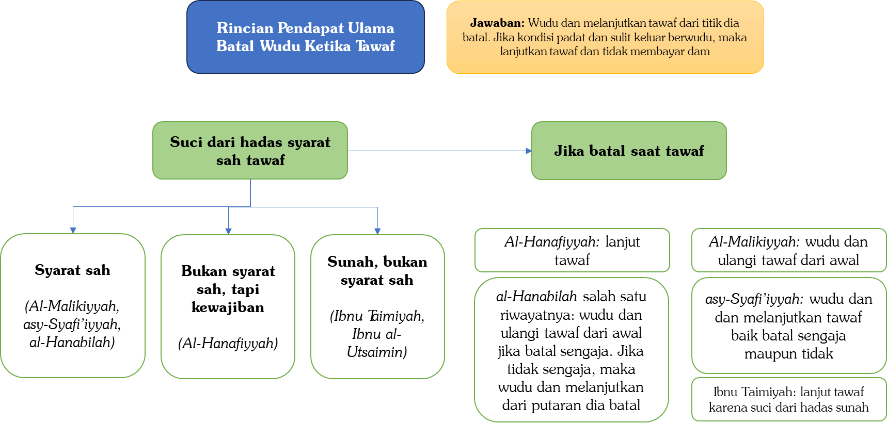

Pertanyaan 4: Bolehkah tawaf dengan kursi roda atau skuter padahal mampu berjalan?

Jawab:

Jika ada uzur, seperti sakit, usia lanjut, atau kelelahan yang sangat, maka boleh tawaf dan sai dengan berkendaraan, kursi roda, skuter, atau dipikul. Adapun jika tidak ada uzur, maka tawaf dan sai dengan berjalan kaki lebih utama. Namun jika seseorang tetap memilih berkendaraan tanpa uzur, tawaf dan sainya tetap diperbolehkan meskipun menyelisihi yang lebih utama.

Perinciannya sebagai berikut.

Kondisi pertama: Jika ada uzur untuk tawaf dan sai dengan berkendaraan, maka boleh tawaf dan sai dengan naik kendaraan, kursi roda, skuter, atau dipikul. Ini merupakan perkara yang disepakati oleh para ulama. Uzur tersebut bisa berupa sakit, kelelahan yang amat sangat, atau keperluan agar orang lain bisa meneladani.

Ummu Salamah radhiyallâhu ‘anhâ berkata,

```arabic
شَكَوْتُ إِلَى رَسُولِ اللَّهِ صَلَّى اللهُ عَلَيْهِ وَسَلَّمَ أَنِّي أَشْتَكِي قَالَ: ((طُوفِي مِنْ وَرَاءِ النَّاسِ وَأَنْتِ رَاكِبَةٌ)) فَطُفْتُ وَرَسُولُ اللَّهِ صَلَّى اللهُ عَلَيْهِ وَسَلَّمَ يُصَلِّي إِلَى جَنْبِ الْبَيْتِ يَقْرَأُ بِالطُّورِ وَكِتَابٍ مَسْطُورٍ
```

"Aku mengeluhkan kepada Rasulullah ﷺ bahwasanya aku sakit, maka Rasulullah ﷺ berkata, ‘Tawaflah engkau di belakang jemaah sambil menaiki (untamu).’ Maka aku pun tawaf, sementara Rasulullah tatkala itu sedang salat di sisi Ka’bah, dan beliau membaca, ‘Watthûr wa kitâbim-masthûr….’ (Surat At-Thûr)"[^135]

Demikian pula, jika ada keperluan untuk tawaf di atas kendaraan meskipun dalam kondisi sehat, maka tidak mengapa. Nabi ﷺ pernah tawaf naik kendaraan karena ingin dilihat oleh para sahabat agar mereka bisa meneladani dan bertanya kepada beliau. Jabir bin Abdillah radhiyallâhu ‘anhumâ berkata,

```arabic
طَافَ رَسُولُ اللَّهِ صَلَّى اللَّهُ عَلَيْهِ وَسَلَّمَ بِالْبَيْتِ فِي حَجَّةِ الْوَدَاعِ عَلَى رَاحِلَتِهِ، يَسْتَلِمُ الْحَجَرَ بِمِحْجَنِهِ؛ لِأَنْ يَرَاهُ النَّاسُ، وَلِيُشْرِفَ، وَلِيَسْأَلُوهُ، فَإِنَّ النَّاسَ غَشُوهُ
```

“Rasulullah ﷺ tawaf di Ka’bah tatkala haji Wadak di atas untanya, beliau mengusap hajar aswad dengan tongkatnya, yaitu agar orang-orang bisa melihat beliau, agar beliau bisa mengawasi (kegiatan haji para sahabat untuk membimbing mereka-pen), agar mereka bisa bertanya kepada belia, karena orang-orang sudah ramai mengerumuni beliau.”

Dalam riwayat yang lain beliau berkata,

```arabic
طَافَ النَّبِيُّ صَلَّى اللهُ عَلَيْهِ وَسَلَّمَ فِي حَجَّةِ الْوَدَاعِ عَلَى رَاحِلَتِهِ بِالْبَيْتِ، وَبِالصَّفَا وَالْمَرْوَةِ، لِيَرَاهُ النَّاسُ، وَلِيُشْرِفَ وَلِيَسْأَلُوهُ، فَإِنَّ النَّاسَ غَشُوهُ
```

“Nabi ﷺ tawaf di Ka’bah tatkala haji wadak dengan naik unta, demikian juga beliau sai antara Shafa dan marwa juga dengan naik unta, agar orang-orang bisa melihat beliau, agar beliau bisa mengawasi mereka, dan agar mereka bisa bertanya kepada beliau. Sesungguhnya orang-orang sudah ramai mengerumuni beliau.”[^136]

Kondisi kedua: Jika seseorang mampu berjalan dan tidak ada uzur, maka para ulama telah sepakat bahwa tawaf dan sai dengan berjalan kaki lebih utama.[^137] Mereka juga sepakat bahwa tawaf dan sai dengan berkendaraan tanpa uzur hukumnya makruh.[^138] Hanya saja mereka berselisih tentang keabsahannya.

Mayoritas ulama berpendapat tidak boleh tawaf dan sai dengan berkendaraan tanpa uzur. Kemudian mereka berselisih lagi: apakah tawafnya tidak sah, ini adalah salah satu riwayat dari Imam Ahmad,[^139] ataukah sah namun wajib membayar dam? Yang terakhir adalah pendapat Hanafiyah,[^140] dan Malikiah,[^141] dan riwayat yang kedua dari Imam Ahmad.[^142]

Adapun al-Imam asy-Syafi’i[^143] dan riwayat ketiga dari Imam Ahmad membolehkan tawaf dengan berkendaraan meskipun tanpa uzur. [^144]

Pendapat inilah yang lebih kuat menurut penulis. Alasannya, Allah memerintahkan tawaf secara mutlak tanpa mensyaratkan berjalan kaki. Maka kapan saja seseorang berputar mengelilingi Ka’bah, tawafnya sah. Tidak boleh kita menyatakan tidak sah kecuali dengan dalil yang tegas.[^145]

Perlu diperhatikan pula bahwa Nabi ﷺ tawaf dengan naik unta semata-mata agar bisa dilihat dan ditanya oleh para sahabat, suatu uzur yang berkaitan dengan kemaslahatan orang lain, bukan karena ketidakmampuan berjalan. Ini semakin memperkuat bahwa tawaf berkendaraan pada dasarnya diperbolehkan.

Karenanya, pendapat yang lebih kuat adalah pendapat mazhab Syafi’i yang juga merupakan riwayat ketiga dari Imam Ahmad. Meskipun demikian, yang lebih berhati-hati adalah seseorang tidak tawaf dengan berkendaraan kecuali karena uzur, agar keluar dari perselisihan ulama dan karena para ulama telah sepakat bahwa tawaf dengan berjalan kaki lebih utama.

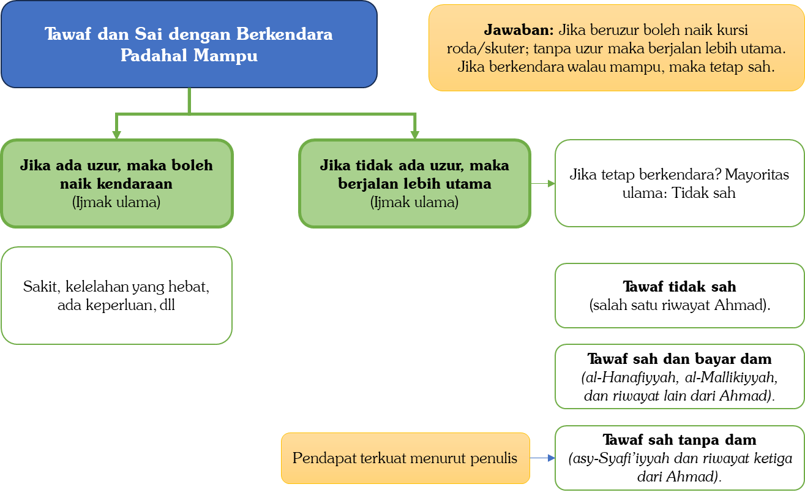

Pertanyaan 5: Apakah ada tawaf wadak ketika melaksanakan umrah?

Jawab:

Tawaf wadak hanya wajib bagi yang berhaji. Adapun bagi yang umrah, tawaf wadak tidak wajib dan tidak disyariatkan. Namun jika seseorang hendak mengerjakan tawaf sunah sebelum meninggalkan kota Makkah, maka tidak mengapa.

Perincian:

Telah datang hadis-hadis yang menunjukkan wajibnya tawaf wadak. Hanya saja hadis-hadis tersebut datang dalam konteks pelaksanaan haji, bukan umrah. Ibnu Abbas radhiyallâhu ‘anhumâ berkata,

```arabic
أُمِرَ النَّاسُ أَنْ يَكُونَ آخِرُ عَهْدِهِمْ بِالْبَيْتِ إِلَّا أَنَّهُ خُفِّفَ عَنِ الْحَائِضِ
```

"Orang-orang diperintahkan agar kegiatan terakhir mereka sebelum meninggalkan kota Makkah adalah tawaf di Ka’bah, hanya saja diberi keringanan kepada wanita yang haid." [^146]

Ibnu Abbas juga berkata,

```arabic
كَانَ النَّاسُ يَنْصَرِفُونَ فِي كُلِّ وَجْهٍ، فَقَالَ رَسُولُ اللهِ صَلَّى اللهُ عَلَيْهِ وَسَلَّمَ: ((لَا يَنْفِرَنَّ أَحَدٌ حَتَّى يَكُونَ آخِرُ عَهْدِهِ بِالْبَيْتِ))
```

"Orang-orang pergi ke segala arah setelah dari Mina, maka Rasulullah ﷺ bersabda, 'Janganlah seorang pun pergi meninggalkan Makkah hingga kegiatan terakhirnya adalah tawaf di Ka’bah.'" [^147]

Dari sinilah para ulama berselisih tentang tawaf wadak setelah umrah. Namun perlu dicatat, tidak ada khilaf di kalangan ulama bahwa orang yang setelah umrah langsung meninggalkan kota Makkah tidak perlu lagi mengerjakan tawaf wadak. Perselisihan hanya terjadi pada orang yang setelah umrah masih menetap di Makkah, apakah ia wajib tawaf wadak ketika hendak pulang? Berikut rincian pendapat para ulama.

Pendapat pertama: tawaf wadak tidak disyariatkan setelah umrah.

Ini adalah pendapat mazhab Hanafiyah,[^148] Hanabilah,[^149] dan Malikiah,[^150] serta dipilih oleh Syekh al-Albani rahimahullâh. Dasarnya:

Pertama, perintah tawaf wadak dalam hadis Ibnu Abbas hanya berkaitan dengan haji.

Kedua, ketika Nabi ﷺ melakukan umrah al-Ju’ranah dan umrah al-Qadha`, tidak ada satu pun riwayat yang menyebutkan bahwa beliau mengerjakan tawaf wadak atau memerintahkan para sahabat untuk melakukannya. Bahkan pada umrah al-Qadha` (tahun 7 Hijriah), Nabi ﷺ dan para sahabat menetap di Makkah selama tiga hari,[^151] namun tidak ada satu pun riwayat yang menyebutkan mereka mengerjakan tawaf wadak.

Ketiga, rukun utama umrah adalah tawaf, sedangkan tawaf wadak adalah pengikut, bukan rukun. Maka tidak selayaknya syariat tawaf menjadi tujuan utama sekaligus pengikut dalam satu ibadah. Ini seperti haji yang rukun utamanya adalah wukuf, tidak diulang dua kali dalam satu ibadah.

Keempat, umrah disyariatkan kapan saja sepanjang tahun dan bisa dikerjakan berkali-kali, berbeda dengan haji yang hanya sekali setahun. Karenanya, bagi yang berhaji perlu ada tawaf perpisahan sebelum pulang ke tanah air, sementara yang umrah tidak.

Pendapat kedua: tawaf wadak wajib setelah umrah sebagaimana dalam haji.

Para ulama yang mewajibkan terbagi menjadi dua kelompok.

Kelompok pertama mewajibkan karena mengiaskan umrah dengan haji, atau karena menganggap hadis Ibnu Abbas berlaku umum mencakup umrah juga. Ini adalah pendapat al-‘Utsaimin.[^152]

Kelompok kedua mewajibkan karena memandang bahwa siapa saja yang menetap di Makkah lalu hendak meninggalkannya wajib tawaf wadak, baik ia haji, umrah, maupun bukan keduanya. Mereka memandang tawaf wadak sebagai ibadah tersendiri bagi orang yang hendak meninggalkan Makkah, tanpa kaitannya dengan haji maupun umrah. Di antara ulama yang berpendapat demikian adalah al-Baghawi,[^153] an-Nawawi,[^154] dan Ibnu Taimiyyah.[^155]

Pendapat yang lebih kuat adalah pendapat pertama, bahwa tawaf wadak tidak disyariatkan ketika umrah. Wallâhu a’lam bish-shawâb.

Adapun dalil-dalil ulama yang mewajibkan, masing-masing tidak lepas dari kritikan.

Sanggahan terhadap dalil pertama: mereka berdalil dengan sabda Nabi ﷺ:

```arabic
اصْنَعْ فِي عُمْرَتِكَ مَا تَصْنَعُ فِي حَجِّكَ
```

"Kerjakanlah pada umrahmu apa yang kamu kerjakan pada hajimu." [^156]

Menurut mereka, hukum asalnya orang yang umrah mengerjakan apa yang dikerjakan orang yang haji, kecuali ada dalil yang membedakan seperti wukuf, mabit, dan lempar jamarat. Dan tawaf wadak termasuk yang dilakukan saat haji, maka demikian pula saat umrah.

Kritikan: sabda Nabi ﷺ di atas adalah jawaban atas pertanyaan tentang orang yang berihram dalam keadaan memakai wewangian. Berikut hadisnya secara lengkap. Dari Ya’la bin Umayyah, ia berkata,

```arabic
أَتَى النَّبِيَّ صَلَّى اللهُ عَلَيْهِ وَسَلَّمَ رَجُلٌ وَهُوَ بِالْجِعْرَانَةِ، وَأَنَا عِنْدَ النَّبِيِّ صَلَّى اللهُ عَلَيْهِ وَسَلَّمَ، وَعَلَيْهِ مُقَطَّعَاتٌ - يَعْنِي جُبَّةً - وَهُوَ مُتَضَمِّخٌ بِالْخَلُوقِ، فَقَالَ: إِنِّي أَحْرَمْتُ بِالْعُمْرَةِ وَعَلَيَّ هَذَا، وَأَنَا مُتَضَمِّخٌ بِالْخَلُوقِ فَقَالَ لَهُ النَّبِيُّ صَلَّى اللهُ عَلَيْهِ وَسَلَّمَ: ((مَا كُنْتَ صَانِعًا فِي حَجِّكَ؟)) قَالَ: أَنْزِعُ عَنِّي هَذِهِ الثِّيَابَ، وَأَغْسِلُ عَنِّي هَذَا الْخَلُوقَ، فَقَالَ لَهُ النَّبِيُّ صَلَّى اللهُ عَلَيْهِ وَسَلَّمَ: ((مَا كُنْتَ صَانِعًا فِي حَجِّكَ، فَاصْنَعْهُ فِي عُمْرَتِكَ))
```

“Nabi ﷺ didatangi seseorang sementara beliau di al-Ju’ranah. Ketika itu aku sedang berada di sisi beliau, sementara lelaki tersebut memakai jubah yang dilumuri oleh minyak wangi. Maka lelaki itu berkata, ‘Sesungguhnya aku telah berihram untuk umrah, dan aku memakai jubah, serta aku berlumuran minyak wangi.’

Maka Nabi ﷺ berkata kepadanya, ‘Apa yang kau lakukan tatkala haji (jika dalam kondisi seperti ini)?’

Ia menjawab, ‘Aku melepaskan baju ini, dan aku cuci tubuhku dari minyak wangi ini.’[^157]

Maka Nabi ﷺ berkata kepadanya, ‘Apa yang kau lakukan tatkala haji maka lakukanlah juga pada umrahmu’.”[^158]

Dengan demikian, hadis riwayat Muslim ini mengkhususkan cakupan hadis-hadis lain dan memperjelas bahwa yang dimaksud Nabi ﷺ hanyalah perintah untuk melepas jubah dan membersihkan wewangian, bukan semua amalan haji.[^159]

Sanggahan terhadap dalil kedua: mereka berdalil dengan penamaan Nabi ﷺ terhadap umrah sebagai haji kecil:

```arabic
((وَإِنَّ الْعُمْرَةَ الْحَجُّ الأَصْغَرُ))
```

"Dan sesungguhnya umrah adalah haji kecil." [^160]

Kritikan: hadis ini diperselisihkan kesahihannya. Seandainya pun sahih, justru lafalnya menunjukkan bahwa umrah tidak bisa disamakan begitu saja dengan haji, karena Nabi menyebutnya sebagai haji kecil, dan tentu berbeda antara yang kecil dan yang besar.[^161] Karenanya Allah menamai haji dengan al-Hajj al-Akbar, yang merupakan rukun Islam dan wajib, sementara umrah adalah haji kecil yang tidak wajib. Haji hanya bisa dikerjakan sekali setahun, sementara umrah boleh dikerjakan kapan saja sepanjang tahun. Ini seperti syirik besar yang tidak bisa disamakan dengan syirik kecil.

Sanggahan terhadap dalil ketiga: mereka berdalil dengan keumuman hadis Ibnu Abbas tentang perintah Nabi ﷺ agar tidak seorang pun meninggalkan Makkah sebelum tawaf. Menurut mereka, ini mencakup orang yang umrah juga.

Kritikan: anggapan bahwa hadis ini mencakup umrah kurang tepat, karena beberapa alasan. Nabi ﷺ tidak pernah mengucapkan perintah ini kecuali pada saat haji Wadak, tidak pernah saat umrah, ini menunjukkan hadis tersebut khusus untuk orang yang berhaji. Para sahabat dan tabiin juga mengerjakan umrah dan tidak ada satu pun riwayat dari mereka yang mengerjakan atau memerintahkan tawaf wadak setelah umrah. Justru sebaliknya, semua atsar yang valid dari para sahabat dan tabiin tentang tawaf wadak berkaitan dengan haji. Di antaranya perkataan Umar radhiyallâhu ‘anhu,

```arabic
لَا يَصْدُرَنَّ أَحَدٌ مِنَ الْحَاجِّ حَتَّى يَطُوفَ بِالْبَيْتِ، فَإِنَّ آخِرَ النُّسُكِ الطَّوَافُ بِالْبَيْتِ
```

"Janganlah seorang haji pun pergi meninggalkan Makkah hingga ia tawaf di Ka’bah, karena ritual haji yang terakhir adalah tawaf di Ka’bah."[^162]

Demikian pula perkataan Ibnu Umar radhiyallâhu ‘anhumâ,

```arabic
مَنْ حَجَّ الْبَيْتَ فَلْيَكُنْ آخِرُ عَهْدِهِ بِالْبَيْتِ إِلَّا الْحُيَّضَ رَخَّصَ لَهُنَّ رَسُولُ اللهِ صَلَّى اللهُ عَلَيْهِ وَسَلَّمَ
```

"Barang siapa yang haji maka hendaknya kegiatan akhirnya adalah tawaf di Ka’bah, kecuali para wanita yang haid, Rasulullah ﷺ telah memberi keringanan bagi mereka." [^163]

Sanggahan terhadap dalil keempat: mereka menyatakan bahwa tawaf wadak bukan bagian dari ritual haji, sehingga wajib bagi siapa saja yang menetap di Makkah dan hendak meninggalkannya, baik yang haji, yang umrah, maupun yang bukan keduanya.

Kritikan: pernyataan ini bertentangan dengan perkataan Umar radhiyallâhu ‘anhu yang dengan tegas menyatakan:

```arabic
لَا يَصْدُرَنَّ أَحَدٌ مِنَ الْحَاجِّ حَتَّى يَطُوفَ بِالْبَيْتِ، فَإِنَّ آخِرَ النُّسُكِ الطَّوَافُ بِالْبَيْتِ
```

"Janganlah seorang haji pun pergi hingga ia tawaf di Ka’bah, karena ritual haji yang terakhir adalah tawaf di Ka’bah." [^164]

Pernyataan ini juga bertentangan dengan ijmak. Ibnu Abdil barr berkata,

```arabic
وَقَدْ أَجْمَعُوا أَنَّ طَوَافَ الْوَدَاعِ مِنَ النُّسُكِ
```

"Para ulama telah sepakat bahwa tawaf wadak termasuk ritual haji." [^165]

Selain itu, jika kita mewajibkan tawaf wadak bagi setiap orang yang menetap di Makkah lalu hendak pergi, maka ini adalah beban yang sangat berat. Betapa banyak musafir yang datang ke Makkah dan menetap beberapa hari, sementara Ka’bah senantiasa dipadati oleh lautan manusia. Mewajibkan mereka semua untuk tawaf wadak adalah memberatkan tanpa ada dalil yang tegas. Wallâhu a’lam bish-shawâb.

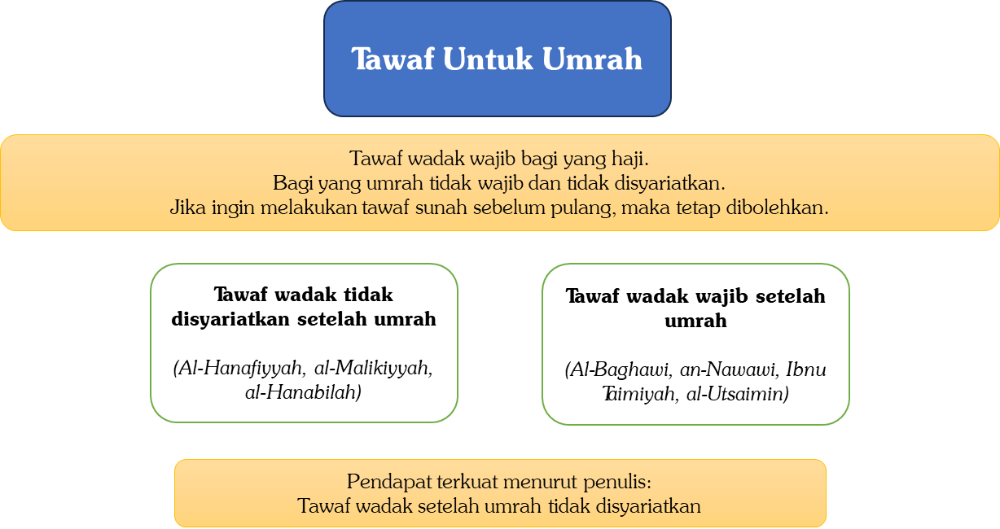

# 4.3 — Sai

Pertanyaan 1: Bolehkah sai dalam kondisi tidak bersuci?

Jawab:

Para ulama telah bersepakat bahwa bersuci bukanlah syarat sah dalam melaksanakan sai. Jadi, jika seseorang batal wudunya di tengah-tengah sai, ia boleh melanjutkannya tanpa perlu bersuci terlebih dahulu.

Ibnu Qudamah berkata,

```arabic
أَكْثَرُ أَهْلِ الْعِلْمِ يَرَوْنَ أَنْ لَا تُشْتَرَطَ الطَّهَارَةُ لِلسَّعْيِ بَيْنَ الصَّفَا وَالْمَرْوَةِ
```

"Mayoritas ulama memandang bahwa bersuci tidak disyaratkan ketika sai antara bukit Shafa dan bukit Marwah." [^166]

Bahkan sebagian ulama memandang bahwa hal ini merupakan ijmak. Ibnul Mundzir berkata,

```arabic
وَأَجْمَعُوا عَلَى أَنَّهُ إِنْ سَعَى بَيْنَ الصَّفَا وَالْمَرْوَةِ عَلَى غَيْرِ طُهْرٍ أَنَّ ذَلِكَ يُجْزِئُهُ، وَانْفَرَدَ الْحَسَنُ، فَقَالَ: إِنْ ذَكَرَ قَبْلَ أَنْ يَحِلَّ فَلْيُعِدِ الطَّوَافَ
```

“Para ulama telah bersepakat bahwasanya jika ia melakukan sai antara Shafa dan Marwah tanpa bersuci maka hal itu sah. Dan al-Hasan al-Bashri berbeda sendiri, ia berkata, ‘Jika ia ingat bahwa ia tidak bersuci sebelum ia bertahalul maka hendaknya mengulangi sai nya.’”[^167]

Adapun dalil akan hal ini adalah sabda Nabi ﷺ kepada Aisyah yang sedang haid:

```arabic
فَافْعَلِي مَا يَفْعَلُ الحَاجُّ، غَيْرَ أَنْ لَا تَطُوفِي بِالْبَيْتِ حَتَّى تَطْهُرِي
```

“Maka lakukanlah apa yang dilakukan oleh jemaah haji, hanya saja janganlah engkau tawaf di Ka’bah hingga engkau suci.”[^168]

Nabi membolehkan Aisyah melakukan seluruh rangkaian haji, dan hanya mengecualikan tawaf. Dengan demikian, sai pun boleh dilakukan meski oleh wanita yang sedang haid. Lagi pula, sai tidak berkaitan langsung dengan Ka’bah, sehingga ia serupa dengan wukuf di Padang Arafah yang juga tidak mensyaratkan kesucian.[^169]

Pertanyaan 2: Jika seseorang kelelahan setelah tawaf, bolehkah ia menunda sai hingga keesokan harinya?

Jawab:

Disunahkan adanya al-Muwâlâh antara sai dan tawaf, yakni keduanya dilakukan secara berkesinambungan, sai dikerjakan segera setelah tawaf. Akan tetapi, ini tidaklah wajib, karena sai merupakan ibadah yang berdiri sendiri. Inilah pendapat mazhab Hanafi, [^170] mazhab Syafi’i, [^171] dan mazhab Hanbali. [^172]

Karenanya, jika seseorang sedang umrah lalu selesai tawaf, kemudian ia kelelahan dan beristirahat, lalu baru melanjutkan sai keesokan harinya, maka hal itu tidak mengapa. Tentu saja ia masih dalam kondisi berihram, sehingga seluruh larangan ihram tetap berlaku.

Pertanyaan 3: Jika seseorang telah sai 5 lintasan lalu kelelahan dan pulang ke hotel, bolehkah setelah istirahat ia melanjutkan 2 lintasan sisanya? Ataukah harus mengulang dari awal?

Jawab:

Disunahkan adanya al-Muwâlâh (kesinambungan) antara satu lintasan sai dengan lintasan berikutnya. Namun hal ini tidaklah wajib,[^173] karena yang dituntut adalah menyelesaikan sai sebanyak tujuh lintasan. Kapan pun ketujuh lintasan itu terpenuhi, baik berkesinambungan maupun terpisah-pisah, maka sai telah sah.

Jadi, seseorang disunahkan menyelesaikan lintasan pertama hingga ketujuh secara berturut-turut. Namun jika di tengah sai ia perlu keluar untuk buang air, lalu kembali melanjutkan lintasan berikutnya, maka hal itu tidak mengapa.

Pertanyaan 4: Adakah sai sunah sebagaimana adanya tawaf sunah?

Jawab:

Tidak ada ibadah sai sunah yang berdiri sendiri, karena sai hanya dilakukan dalam rangkaian umrah atau haji. Ini berbeda dengan tawaf yang memang ada pelaksanaan tawaf sunahnya.

# 4.4 — Bercukur/gundul

Pertanyaan 1: Bolehkah mencukur rambut hanya sebagian saja ketika bertahalul?

Jawab:

Para ulama empat mazhab bersepakat bahwa menggundul kepala adalah lebih utama. Demikian pula ketika memilih untuk memendekkan rambut, lebih utama jika cukuran itu mencakup seluruh sisi kepala. Namun mereka berbeda pendapat mengenai ukuran minimal yang dianggap sah, dan terbagi menjadi tiga pendapat:

---

## Pertama: Wajib mencukur seluruh sisi kepala. ini adalah pendapat hanabilah[^174] dan malikiah.[^175]

---

## Kedua: Mencukur seperempat bagian kepala sudah dianggap sah;[^176] jika kurang dari seperempat maka tidak sah. ini pendapat hanafiyah.[^177]

---

## Ketiga: Mencukur tiga helai rambut sudah dianggap sah. ini pendapat syafi'iyah.[^178]

Kesimpulan: Yang paling utama adalah mencukur rambut dari seluruh sisi kepala. Adapun mencukur sebagian kepala, apalagi kurang dari seperempat, maka ini sah menurut mazhab Syafi’i namun tidak sah menurut tiga mazhab lainnya.

Selain itu, cara mencukur yang hanya tiga helai rambut tidak menampakkan bekas yang nyata di kepala. Padahal Allah berfirman,

```arabic
ﵟمُحَلِّقِينَ رُءُوسَكُمۡ وَمُقَصِّرِينَﵞ
```

"Dengan mencukur rambut (gundul) kepala dan mengguntingnya (memendekkannya)." (QS. Al-Fath: 27)

Maka harus ada bekas yang tampak dari tahalul ini, yaitu tercukurnya rambut secara nyata. Tiga helai rambut jelas tidak mencapai tujuan tersebut.

Kami menganjurkan agar setiap orang berusaha melakukan yang terbaik dan paling sesuai dengan sunah Nabi ﷺ, di mana beliau dan para sahabatnya tidak pernah bertahalul hanya dengan mencukur sebagian kecil rambut kepala. Wallâhu a’lam.

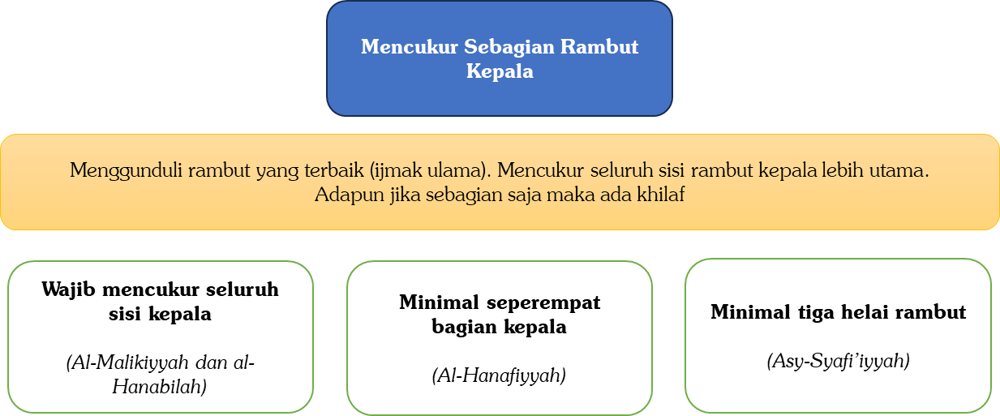

Pertanyaan 2: Apakah orang yang mencukur harus sudah bertahalul terlebih dahulu?

Jawab:

Tidak ada dalil yang mensyaratkan bahwa yang boleh mencukur atau menggundul hanya orang yang sudah bertahalul. Bahkan jika seseorang yang masih berihram menggundul atau memendekkan rambutnya sendiri, hal itu tidak mengapa dan tidak terlarang. Yang dituntut oleh syariat adalah terjadinya proses gundul atau cukur itu sendiri sebagai bagian dari tahalul.

Orang yang mencukur rambutnya sendiri pun termasuk dalam keumuman firman Allah ﷻ,

```arabic
ﵟثُمَّ لۡيَقۡضُواْ تَفَثَهُمۡﵞ
```

"Kemudian hendaklah mereka menghilangkan kotoran yang ada pada badan mereka." (QS. Al-Hajj: 29)

Di antara tafsir at-Tafats (kotoran) adalah rambut kepala. Demikian pula keumuman firman Allah ﷻ,

```arabic
ﵟمُحَلِّقِينَ رُءُوسَكُمۡ وَمُقَصِّرِينَﵞ
```

"Dengan mencukur rambut (gundul) kepala dan mengguntingnya (memendekkannya)." (QS. Al-Fath: 27)

Jika kita mewajibkan jemaah haji dan umrah untuk tidak boleh mencukur sendiri, berarti kita secara otomatis mewajibkan mereka bergantung kepada orang lain yang tidak sedang berihram. Padahal ibadah-ibadah pada umumnya, seperti salat dan puasa, tidak memerlukan bantuan orang lain.

Meski demikian, jika ada orang lain yang mencukurkan tentu lebih baik dan lebih sesuai sunah Nabi ﷺ. Anas bin Malik berkata,

```arabic
أَنَّ رَسُولَ اللهِ صَلَّى اللهُ عَلَيْهِ وَسَلَّمَ رَمَى جَمْرَةَ الْعَقَبَةِ، ثُمَّ انْصَرَفَ إِلَى الْبُدْنِ فَنَحَرَهَا وَالْحَجَّامُ جَالِسٌ، وَقَالَ: بِيَدِهِ عَنْ رَأْسِهِ، فَحَلَقَ شِقَّهُ الأَيْمَنَ فَقَسَمَهُ فِيمَنْ يَلِيهِ، ثُمَّ قَالَ: ((احْلِقِ الشِّقَّ الْآخَرَ))، فَقَالَ: ((أَيْنَ أَبُو طَلْحَةَ؟)) فَأَعْطَاهُ إِيَّاهُ
```

"Bahwasanya Rasulullah ﷺ melempar jamrah Aqabah, lalu beliau menuju unta dan menyembelihnya sementara tukang cukur duduk menunggu. Lalu Nabi memberi isyarat agar tukang cukur itu mencukur kepalanya, maka digundullah sisi kanan kepala beliau, lalu Nabi membagikan rambut itu kepada orang-orang yang ada di dekatnya.

Kemudian beliau berkata, 'Gundul bagian kiri kepala.'

Lalu beliau bertanya, 'Ke mana Abu Thalhah?' Maka beliau pun memberikan rambut sisi kiri itu kepadanya." [^179]

Dan tentu saja, jika yang mencukur adalah orang lain, hasilnya akan lebih rapi dan lebih bersih. Wallâhu a’lam bish-shawâb.

Pertanyaan 3: Bolehkah para wanita menunda pemotongan rambut mereka setelah tawaf dan sai umrah, dan melakukannya di kamar hotel?

Jawab:

Hal itu tidak mengapa. Akan tetapi, selama ia belum bertahalul dari umrahnya, seluruh larangan ihram masih tetap berlaku.

# 4.5 — Mina

Pertanyaan 1: Bolehkah mabit di Mina hanya 6 jam, lalu tidur di hotel yang ada di al-Aziziyah (dekat Mina)?

Kadar minimal seseorang berada di Mina adalah mayoritas malam,[^180] yakni lebih dari separuh malam. Jika panjang malam, dihitung dari terbenamnya matahari hingga terbitnya fajar, adalah 10 jam, maka seseorang wajib berada di Mina minimal lebih dari 5 jam.

Dengan demikian, tidak mengapa jika setelah melewati lebih dari separuh malam di Mina, seseorang kemudian pergi dan tidur di hotel di luar Mina.

Namun yang terbaik adalah mengikuti sunah, yaitu menghabiskan seluruh malam di Mina,[^181] karena setiap momen malam yang dijalani seorang jemaah haji di Mina bernilai pahala di sisi Allah. Haji pun hanya berlangsung beberapa hari saja, maka hendaknya seseorang sungguh-sungguh mempersiapkan diri, lahir dan batin, untuk menjalani hari-hari yang singkat itu demi meraih rida dan ampunan Allah.

Pertanyaan 2: Siapa sajakah yang diberi uzur boleh tidak mabit di Mina?

Jawab:

Bagi yang memiliki uzur, dibolehkan meninggalkan mabit di Mina. Di antara yang diberi keringanan oleh Nabi adalah para penggembala[^182] dan para penyedia air bagi jemaah haji.[^183] Siapa pun yang memiliki uzur sehingga tidak bisa mabit di Mina, ia tidak berdosa dan tidak wajib membayar dam.

Uzur-uzur ini bersifat umum, baik yang berkaitan dengan kemaslahatan pribadi, dikiaskan dengan para penggembala unta yang harus menjaga ternaknya agar tidak hilang atau dicuri, maupun demi kemaslahatan jemaah haji secara luas, dikiaskan dengan para penyedia minuman yang diizinkan Nabi untuk meninggalkan mabit.[^184]

Di antara contoh uzur tersebut adalah: sakit, para dokter dan perawat yang merawat jemaah haji yang sakit, para pemandu yang harus bolak-balik mengurusi kebutuhan jemaah dan armada bus, serta orang yang tidak mendapatkan tenda atau tempat di Mina meskipun telah berusaha mencarinya.

Pertanyaan 3: Jika tidak mampu mendapatkan tenda di Mina, bolehkah seseorang menginap di al-Aziziyah yang dekat dengan Mina?

Jawab:

Sebagaimana telah dijelaskan sebelumnya, orang yang tidak memiliki tenda di Mina dan tidak mendapatkan tempat di sana meskipun telah berusaha, tidak mengapa baginya untuk mabit di luar Mina. Perlu diingat pula bahwa seseorang tidak boleh memaksakan diri mendirikan tenda di fasilitas umum hingga mengganggu lalu lintas di Mina. Jalan-jalan yang diperuntukkan bagi kendaraan maupun pejalan kaki menuju lokasi lempar jamrah tidak boleh dijadikan tempat mendirikan tenda-tenda liar, karena hal itu sangat mengganggu kelancaran jemaah haji.

Bagi yang kondisinya demikian, para ulama kontemporer memiliki dua pendapat:

---

## Pertama: Orang yang tidak memiliki tenda di mina boleh menginap di makkah di mana saja, tidak harus dekat dengan mina. kewajiban mabit di mina telah gugur baginya, sebagaimana para penggembala dan penyedia air minum diizinkan Nabi untuk bermalam di makkah

---

## Kedua: Orang yang tidak memiliki tenda tetap wajib mabit di tempat yang bersambung dengan mina, karena salah satu tujuan haji adalah berkumpulnya umat Islam di satu tempat, antara lain di arafah dan mina. hal ini dikiaskan pula dengan salat berjemaah, tidak mengapa jika dilakukan di luar masjid selama shaf tetap bersambung. karenanya, mereka yang tidak mendapat tenda harus mabit di tempat yang masih terhubung dengan tenda-tenda di mina, seperti di muzdalifah atau al-aziziyah. inilah pendapat yang dipilih oleh syekh al-'utsaimin[^185] dan merupakan pendapat yang lebih berhati-hati. namun pendapat pertama juga cukup kuat dan lebih memudahkan jemaah haji, terutama di zaman sekarang. wallâhu a’lam

Pertanyaan 4: Apa hukum mabit di hari-hari Tasyrik di tenda-tenda yang ada di Mina Jadid?

Jawab:

Mina Jadid (Mina Baru) adalah istilah yang sudah familiar di kalangan jemaah haji Indonesia. Maksudnya adalah tenda-tenda yang dibangun di luar area Mina, tepatnya di kawasan Muzdalifah. Hal ini dilakukan oleh pemerintah Arab Saudi karena jumlah jemaah haji yang begitu besar sehingga tenda-tenda di area Mina tidak lagi mampu menampung semuanya. Sebagian kecil jemaah haji Indonesia reguler memang ditempatkan di Muzdalifah (Mina Jadid) ini.

Para ulama telah membolehkan dan menganggap sah mabit di Mina Jadid karena kondisi darurat, selama tenda-tenda tersebut masih bersambung dengan area Mina, sebagaimana kondisi yang ada saat ini.[^186]

---

[^1]: Lihat: Tafsîr Ath-Thabarî (3/515-523). Bahkan, ath-Thabari tidak menukil pendapat selain pendapat yang menyatakan bahwa al-Masy’ar al-Haram adalah seluruh Muzdalifah.
[^2]: Lihat: Tafsîr al-Baghawî (1/229).
[^3]: Lokasi Nabi ﷺ singgah dan bermalam di Muzdalifah adalah tempat yang saat ini telah dibangun sebuah masjid di atasnya. [Lihat: Mirqâh al-Mafâtîh (5/1800)]
[^4]: HR. Muslim No. 1218.
[^5]: Para ulama menyebutkan bahwa ini adalah kemudahan yang diberikan oleh Nabi ﷺ; karena jika Nabi ﷺ dan para sahabat berhenti di tengah jalan untuk salat magrib, lalu kembali melanjutkan perjalanan, maka ini perkara yang berat. Demikian juga, jika Nabi ﷺ salat magrib di Arafah terlebih dahulu, maka ini juga merupakan perkara yang berat; karena para sahabat harus melakukan persiapan—seperti bersuci terlebih dahulu dan lainnya. Akibatnya, mereka bisa terlambat sampai di Muzdalifah.
[^6]: Kemudian an-Nawawi menjelaskan bahwa ini adalah pendapat mazhab Syafi’i, Maliki, dan Hanbali. Sementara itu, mazhab Hanafi dan Zhahiri tidak membolehkan salat magrib dan isya sebelum sampai di Muzdalifah; karena menurut mereka, sebab diperbolehkannya jamak pada malam itu adalah karena nusuk (rangkaian manasik, yaitu salat Magrib dan Isya di Muzdalifah). Sementara menurut jumhur ulama, sebab bolehnya menjamak adalah karena Shafar. Dan sebagaimana diketahui, seorang musafir diperbolehkan melakukan jamak takdim maupun jamak takhir. [Lihat: Al-Majmû’ Syarh al-Muhadzdzab (8/148)].
[^7]: Lihat: Majmû’ Fatâwâ wa-Rasâ`il, al-‘Utsaimin (23/54-55).
[^8]: HR. Muslim, No. 1218.
[^9]: Lihat: Asy-Syarh al-Mumti’, al-‘Utsaimin (7/310).
[^10]: Di antara hikmah disunahkan untuk tidur dan istirahat di malam Muzdalifah adalah karena besoknya—yaitu tanggal 10 Zulhijah—terdapat banyak kegiatan berat yang harus dilakukan oleh jamaah haji, seperti lempar jamrah, mencukur, menyembelih hadyu, serta tawaf dan sai. Wallâhu a’lam.
[^11]: Lihat: Asy-Syarh al-Mumti’, al-‘Utsaimin (7/310-311).
[^12]: Abdullah Maula Asma’ binti Abu Bakar berkata, قَالَتْ لِي أَسْمَاءُ: وَهِيَ عِنْدَ دَارِ الْمُزْدَلِفَةِ هَلْ غَابَ الْقَمَرُ؟ قُلْتُ: لَا، فَصَلَّتْ سَاعَةً، ثُمَّ قَالَتْ: يَا بُنَيَّ هَلْ غَابَ الْقَمَرُ؟ قُلْتُ: نَعَمْ، قَالَتْ: ارْحَلْ بِي، فَارْتَحَلْنَا حَتَّى رَمَتِ الْجَمْرَةَ، ثُمَّ صَلَّتْ فِي مَنْزِلِهَا، فَقُلْتُ لَهَا: أَيْ هَنْتَاهْ لَقَدْ غَلَّسْنَا، قَالَتْ: كَلَّا، أَيْ بُنَيَّ، إِنَّ النَّبِيَّ صَلَّى اللهُ عَلَيْهِ وَسَلَّمَ أَذِنَ لِلظُّعُنِ “Asma berkata kepadaku—tatkala ia sedang berada di Muzdalifah—‘Apakah rembulan telah tenggelam?’ Aku berkata, ‘Belum.’ Maka Asma’ pun salat beberapa waktu. Lalu bertanya lagi, ‘Wahai anakku, apakah rembulan telah tenggelam?’ Aku berkata, ‘Iya.’ Maka ia berkata, ‘Mari kita berangkat (menuju Mina).’ Maka kami pun berangkat hingga kami melempar jumrah. Lalu ia salat di rumahnya. Maka aku berkata kepadanya, ‘Wahai ibu, kita terlalu cepat (masih remang-remang).’ Ia berkata, ‘Tidak (kecepatan) wahai anakku, karena sesungguhnya Nabi ﷺ mengizinkan bagi wanita (untuk keluar dari Muzdalifah sebelum subuh)’.” (HR. Al-Bukhari, No. 1679, dan Muslim, No. 1291).
[^13]: Akan datang penjelasannya pada amalan hari ke 10 Zulhijah.
[^14]: Di antara yang diizinkan oleh Nabi ﷺ untuk meninggalkan Muzdalifah sebelum subuh adalah Ummul Mukminin Saudah binti Zam’ah (HR. Al-Bukhari, No. 1681, dan Muslim, No. 1290), Ummul Mukminin Ummu Habibah (HR. Muslim, No. 1292), dan Ibnu Abbas bersama keluarganya yang tergolong lemah (HR. Al-Bukhari, No. 1678 dan Muslim, No. 1293). Hal ini juga dilakukan oleh Ibnu Umar. Beliau memerintahkan orang-orang lemah dari keluarganya untuk meninggalkan Muzdalifah sebelum subuh. Beliau beralasan bahwa Nabi ﷺ memberi keringanan kepada orang-orang lemah (HR. Al-Bukhari, No. 1676 dan Muslim, No. 1295). Demikian juga Asma’ binti Abu Bakar meninggalkan Muzdalifah sebelum subuh dengan alasan bahwa Nabi ﷺ membolehkan para wanita untuk meninggalkannya (HR. Al-Bukhari, No. 1679, dan Muslim, No. 1291).
[^15]: HR. Muslim, No. 1293.
[^16]: HR. Al-Bukhari, No. 1679, dan Muslim, No. 1291.
[^17]: Oleh karena itu, kebanyakan jamaah haji pada masa sekarang yang tergabung dalam satu travel atau satu KBIH dihukumi sebagai satu rombongan. Sangat sulit untuk memisahkan antara yang kuat dan yang lemah dalam rombongan tersebut. Karena itu, mereka diperbolehkan meninggalkan Muzdalifah setelah lewat tengah malam. Namun, apabila mereka mampu bertahan hingga waktu Subuh, maka itu tentu lebih utama dan lebih afdal. Syekh Bin Baz berkata, إِذَا كَانَ الْحُجَّاجُّ مَعَهُ نِسَاءٌ فَلَهُمُ الرُّخْصَةُ أَنْ يَنْصَرِفُوا مِنْ مُزْدَلِفَة فِي النِّصْفِ الَاخِيْرِ مِنَ اللَّيْلِ لَيْلَةِ النَّحْرِ؛ لِأَنَّ النَّبِيَّ ﷺ رَخَّصَ لِلضَّعَفَةِ مِنْ أَهْلِهِ أَنْ يَنْصَرِفُوا مِنْهَا بِلَيْلٍ، وَهَذَا ثَابِتٌ عَنْهُ عَلَيْهِ الصَّلَاةُ وَالسَّلَامُ، وَالَّذِي يَظْهَرُ: أَنَّ أَصْحَابَهُمْ مِثْلُهُمْ، فَالَّذِيْنَ مَعَ النِّسَاءِ مِنَ الرِّجَالِ الْقَوَّامِيْنَ عَلَيْهِنَّ وَالرِّفَاقِ الَّذِيْنَ مَعَهُمْ، الَّذِي يَظْهَرُ: أَنَّهُمْ شَيْءٌ وَاحِدٌ، فَإِذَا سُمِحَ لِلضُّعَفَاءِ أَنْ يَنْصَرِفُوا فَالَّذِيْنَ مَعَهُمْ كَذَلِكَ مَسْمُوْحٌ لَهُمُ الاِنْصِرَافُ...إِذَا كَانُوا فِي سَيَّارَةٍ وَاحِدَةٍ تَجْمَعُ رِجَالاً وَنِسَاءً وَشَبَاباً وَشِيْباً فَهَؤُلَاءِ دَرْبُهُمْ وَاحِدٌ، وَلَا حَرَجَ -إِنْ شَاءَ اللهُ- فِي انْصِرَافِهِمْ جَمِيْعاً وَذَهَابِهِمْ إِلَى مِنَى آخِرَ اللَّيْلِ وَرَمْيِهِمْ الْجَمْرَةَ، وَذَهَابِهِمْ إِلَى مَكَّةَ، كُلُّ هَذَا لَا حَرَجَ فِيْهِ إِنْ شَاءَ اللهُ؛ لِأَنَّ الضَّعِيْفَ يَتْبَعُهُ الْقَوِيُّ الَّذِي هُوَ فِي رُفْقَتِهِ أَوْ فِي الْقِيَامِ عَلَى شُئُوْنِهِ “Jika para jamaah haji bersama para wanita maka boleh bagi mereka untuk meninggalkan Muzdalifah setelah lewat tengah malam, yaitu malam hari an-Nahr. Karena Nabi ﷺ memberi keringanan/rukhsah kepada istri-istri beliau untuk meninggalkan Muzdalifah di malam hari. Ini telah valid dari Nabi ﷺ. Yang nampak bahwasanya orang-orang yang bersama orang-orang yang lemah juga hukumnya seperti mereka. Maka mereka para lelaki yang mengurusi para wanita demikian juga teman perjalanan yang menemani mereka yang nampaknya mereka dihukumi satu kesatuan. Jika dibolehkan bagi yang lemah (para wanita) untuk meninggalkan Muzdalifah maka dibolehkan juga bagi orang-orang yang bersama para wanita untuk meninggalkan Muzdalifah… Jika mereka berada di satu mobil yang mengumpulkan para lelaki, para wanita, para pemuda, dan para orang-orang tua, maka mereka itu satu jalan (rombongan), dan tidak mengapa -insya Allah- bagi mereka semuanya untuk meninggalkan Muzdalifah dan pergi ke Mina di akhir malam, boleh untuk melempar jumrah, boleh bagi mereka ke Makkah (Masjidilharam untuk tawaf dan sai). Hal ini semua tidak mengapa insya Allah, karena orang yang lemah (hukumnya) diikuti oleh orang yang kuat yang merupakan satu rombongan atau mengurusi urusan yang lemah.” [Fatâwâ Nûr ‘alâ ad-Darb, Syekh Bin Baz (17/429-430)].
[^18]: Lihat: Tafsîr ath-Thabarî (3/549-553).
[^19]: Lihat: Adhwâ` al-Bayân, asy-Syinqithi (4/479).
[^20]: HR. Abu Daud, No. 1888, at-Tirmidzi, No. 902, an-Nawawi berkata, “Seluruh sanadnya sahih kecuali Ubaidillah, dan kebanyakan para ulama menilainya daif (lemah) dengan kelemahan yang ringan.” [Al-Majmû’ (8/56)], dan hadis ini dinyatakan daif oleh al-Albani.
[^21]: HR. Al-Hakim, No. 1713 dan al-Baihaqi dalam as-Sunan al-Kubrâ, No. 9693 dan dinyatakan sahih oleh al-Hakim dan al-Albani dalam Shahih at-Targhîb, No.1156.
[^22]: Ihyâ’ ‘Ulûm ad-Dîn (1/270).
[^23]: Adhwâ` al-Bayân (4/479-480).
[^24]: Karena area Mina adalah dari Wadi al-Muhassir hingga Jamrah Aqabah. Dan telah sahih dari Umar bin al-Khaththab, Ibnu Umar, dan Ibnu Abbas radhiyallâhu 'anhum bahwa mereka melarang orang-orang mabit di balik Jamrah Aqabah [Lihat: At-Taudhîh Li-Syarh al-Jâmi’ ash-Shahîh, Ibnul Mulaqqin (11/448)].
[^25]: Hal ini berdasarkan hadis Ibnu Abbas. Pada hari an-Nahr, seseorang bertanya kepada Nabi ﷺ, رَمَيْتُ بَعْدَ مَا أَمْسَيْتُ “Aku melempar setelah masuk waktu petang.” Nabi berkata, ((لَا حَرَجَ)) “Tidak mengapa.” (HR. Al-Bukhari, No. 1735). Meskipun penanya dalam hadis ini tidak melempar di malam hari—melainkan di sore hari, namun kata الْمَسَاءُ dalam Bahasa Arab mencakup malam hari. Secara Bahasa الْمَسَاءُ atau الإِمْسَاءُ ada dua pendapat di kalangan ahli bahasa: (1) pertama: dari Zuhur hingga terbenam matahari, dan (2) kedua: dari Zuhur hingga tengah malam. Al-Khalil bin Ahmad al-Farahidi (wafat 170 H) berkata, وَالْمَسَاءُ: بَعْدَ الظُّهْرِ إِلَى صَلَاةِ الْمَغْرِبِ. وَقَالَ بَعْضٌ: إِلَى نِصْفِ اللَّيْلِ “Al-Masâ` (petang) adalah setelah Zuhur hingga salat Magrib. Sebagian berkata, ‘hingga tengah malam’” [Al-‘Ain (7/323)]. Hal serupa dinyatakan oleh al-Azhari (wafat 310 H) dalam kitabnya Tahdzîb al-Lughah (13/82) dan az-Zabidi dalam Tâj al-‘Arûs (39/530). Dengan demikian, sisi istidlal dari hadis tersebut—atas kebolehan melempar di malam hari—dari tiga sisi: Pertama, keumuman makna al-Masâ`, yaitu mencakup makna awal malam. Nabi ﷺ juga tidak merinci kepada penanya: apakah dia melempar di akhir hari atau di awal malam? Ini menunjukkan bahwa urusan ini bersifat lapang dan fleksibel. [Lihat: Asy-Syarh al-Mumti’ (7/354)]. Kedua, karena Nabi ﷺ tidak memberi batas akhir waktu melempar. Dan jika Nabi ﷺ tidak melarang atau membatasi, maka hukum asalnya adalah boleh. [Lihat: Majmû’ Fatâwâ Ibn Bâz (17/368)]. Ketiga, dikiaskan dengan hari Arafah. Bagi yang tidak sempat wukuf di siang hari, maka boleh wukuf di malam hari hingga sebelum terbit fajar, karena malam mengikuti hukum siangnya. Demikian pula, hal ini berlaku ketika melempar jamrah. [Lihat: Asy-Syarh al-Mumti’ (7/355)]. Sebagian ulama berpendapat jika seseorang tidak sempat melempar Jamrah Aqabah di tanggal 10 Zulhijah hingga matahari tenggelam, maka hendaknya dia melemparnya di tanggal 11 Zulhijah setelah masuk waktu Zuhur. Jadi, dia melempar untuk hari kemarin terlebih dahulu, setelah itu barulah melempar untuk tanggal 11 Zulhijjah. [Lihat: Asy-Syarh al-Kabîr, Ibnu Qudamah (9/203)]. Namun, yang benar adalah tidak mengapa baginya untuk melempar meski di malam hari.
[^26]: Para ulama menjelaskan tentang ukuran kerikil untuk melempar jamrah, yaitu: seukuran kacang merah, atau seukuran ruas jari, atau biji kurma. [Lihat: Al-Minhâj Syarh Shahîh Muslim (8/191) dan Mirqâh al-Mafâtîh (5/1815)].
[^27]: HR. Ibnu Majah, No. 3029 dan Ahmad, No. 1851 dan 3248.
[^28]: Meskipun sebagian ulama menyatakan: jika kerikil tersebut lebih besar atau lebih kecil, maka tetap sah, hanya saja hal itu menyelisihi perintah Nabi ﷺ. [Lihat: Al-Minhâj Syarh Shahîh Muslim (8/191)]
[^29]: Lihat: Al-Majmû’ Syarh al-Muhadzdzab, (8/124). Al-Imam Ahmad berkata “Ambillah kerikil dari mana saja yang kau kehendaki” [Asy-Syarh al-Kabîr, Ibnu Qudamah al-Maqdisi (9/188)]
[^30]: Zahir hadis Ibnu Abbas menunjukkan bahwa Nabi ﷺ memerintahkannya mencari kerikil ketika di perjalanan menjelang melempar Jamrah Aqabah di Mina. Akan tetapi, para salaf—seperti Ibnu Umar radhiyallâhu ‘anhu dan Sa’id bin Jubir rahimahullâh—mengambil kerikil dari Muzdalifah sebagai persiapan untuk untuk melempar. Hal itu dilakukan agar ketika tiba di Mina, maka yang pertama kali mereka lakukan adalah melempar; sehingga mereka tidak sibuk lagi untuk mencari-cari kerikil. [Lihat: Asy-Syarh al-Kabîr, Ibnu Qudamah al-Maqdisi (9/188)].
[^31]: Bahkan sebagian ulama berpendapat: jika dia melempar jamrah dengan kerikil yang ada najisnya, maka lemparan tersebut tetap sah, karena dia telah melempar kerikil. Asy-Syarh al-Kabîr, Ibnu Qudamah al-Maqdisi (9/190)].
[^32]: Ibnu Qudamah berkata, وَيُسَمَّى طَوَافَ الْإِفَاضَةِ؛ لِأَنَّهُ يَأْتِي بِهِ عِنْدَ إفَاضَتِهِ مِنْ مِنًى إلَى مَكَّةَ، وَهُوَ رُكْنٌ لِلْحَجِّ، لَا يَتِمُّ إلَّا بِهِ. لَا نَعْلَمُ فِيهِ خِلَافًا “Dan dinamakan dengan tawaf Ifadah (bertolak/beranjak pergi) karena ia mengerjakannya ketika bertolak meninggalkan Mina menuju Makkah. Dan tawaf ini merupakan rukun haji, tidak sah haji tanpa mengerjakannya. Kami tidak mengetahui ada khilaf akan hal ini.” [Al-Mughnî (3/390).
[^33]: Jabir bin Abdillah berkata, فَأَفَاضَ إِلَى الْبَيْتِ، فَصَلَّى بِمَكَّةَ الظُّهْرَ “Maka Nabi pun menuju Ka’bah (untuk tawaf Ifadah) lalu beliau salat Zuhur di Makkah.” (HR. Muslim, No. 1218) Dalam hadis Ibnu Umar beliau berkata, أَفَاضَ يَوْمَ النَّحْرِ، ثُمَّ رَجَعَ فَصَلَّى الظُّهْرَ بِمِنًى “Nabi Muhammad melakukan tawaf Ifadah pada hari an-Nahr lalu beliau kembali (ke Mina) dan salat Zuhur di Mina.” (HR. Muslim, No. 1308)
[^34]: Ini adalah pendapat asy-Syafi’i. Sedangkan Abu Hanifah berpendapat bahwa tawaf ifadah hanya boleh dikerjakan setelah terbit fajar pada tanggal 10 Zulhijah. [Lihat: Al-Mughnî, Ibnu Qudamah (3/391)].
[^35]: An-Nawawi asy-Syafi’i berkata, أَنَّ مَذْهَبَنَا أَنَّ طَوَافَ الْإِفَاضَةِ لَا آخِرَ لِوَقْتِهِ بَلْ يَبْقَى مَا دَامَ حَيًّا وَلَا يَلْزَمُهُ بِتَأْخِيرِهِ دَمٌ قَالَ ابْنُ الْمُنْذِرِ وَلَا أَعْلَمُ خِلَافًا بَيْنَهُمْ فِي أَنَّ مَنْ أَخَّرَهُ وَفَعَلَهُ فِي أَيَّامِ التَّشْرِيقِ أَجْزَأَهُ وَلَا دَمَ فَإِنْ أَخَّرَهُ عَنْ أَيَّامِ التَّشْرِيقِ فَقَدْ قَالَ جُمْهُورُ الْعُلَمَاءِ كَمَذْهَبِنَا لَا دَمَ “Sesungguhnya mazhab kami (mazhab Syafi’i) bahwasanya tawaf ifadah tidak memiliki batas akhir waktu pelaksanaannya. Bahkan waktunya terus berlanjut selama ia masih hidup. Dan tidak wajib bayar dam jika menunda pelaksanaannya. Ibnul Mundzir berkata, ‘Dan aku tidak mengetahui adanya khilaf di antara para ulama tentang barang siapa yang menunda tawaf ifadah (dari hari an-Nahr) lalu mengerjakannya tatkala hari Tasyrik maka sah tidak perlu bayar dam. Dan jika ia menundanya hingga hari-hari Tasyrik telah selesai maka mayoritas ulama berpendapat seperti mazhab kita, yaitu tidak perlu bayar dam’.” [Al-Majmû’ (8/224)]. Ibnu Qudamah al-Hanbali berkata, وَالصَّحِيحُ أَنَّ آخِرَ وَقْتِهِ غَيْرُ مَحْدُودٍ؛ فَإِنَّهُ مَتَى أَتَى بِهِ صَحَّ بِغَيْرِ خِلَافٍ، وَإِنَّمَا الْخِلَافُ فِي وُجُوبِ الدَّمِ، فَنَقُولُ: إنَّهُ طَافَ فِيمَا بَعْدَ أَيَّامِ النَّحْرِ طَوَافًا صَحِيحًا، فَلَمْ يَلْزَمْهُ دَمٌ، كَمَا لَوْ طَافَ أَيَّامَ النَّحْرِ، فَأَمَّا الْوُقُوفُ وَالرَّمْيُ، فَإِنَّهُمَا لَمَّا كَانَا مُؤَقَّتَيْنِ، كَانَ لَهُمَا وَقْتٌ يَفُوتَانِ بِفَوَاتِهِ، وَلَيْسَ كَذَلِكَ الطَّوَافُ، فَإِنَّهُ مَتَى أَتَى بِهِ صَحَّ “Yang benar bahwasanya akhir waktu tawaf ifadah tidak terbatas. Kapan seseorang mengerjakannya maka sah tawafnya tanpa ada khilaf. Khilaf para ulama hanya pada apakah harus bayar dam atau tidak (karena menunda tawaf ifadah di luar hari an-Nahr). Maka kami katakan, ‘Sesungguhnya ia telah tawaf setelah hari an-Nahr dengan tawaf yang sah—sebagaimana jika ia tawaf di hari an-Nahr—maka tidak wajib baginya untuk membayar dam. Adapun wukuf (di Arafah) dan melempar (jumrah) maka keduanya dibatasi dengan waktu, jika telah lewat waktunya maka terluputlah keduanya. Hal ini tidak seperti tawaf, kapan seseorang mengerjakannya maka sah’.” [Al-Mughnî, Ibnu Qudamah (3/391)]. Adapun mazhab Abu Hanifah: barang siapa yang menunda pelaksanaan tawaf ifadah hingga hari-hari tasyrik selesai, maka dia harus membayar dam. Akan tetapi, pendapat jumhur ulama lebih kuat; karena hukum asal adalah tidak ada keharusan bayar dam hingga terdapat dalil yang menunjukkannya. [Lihat: Al-Majmû’ (8/224)].
[^36]: Ibnu Abbas berkata, أَنَّ النَّبِيَّ صَلَّى اللَّهُ عَلَيْهِ وَسَلَّمَ لَمْ يَرْمُلْ فِي السَّبْعِ الَّذِي أَفَاضَ فِيهِ “Sesungguhnya Nabi tidaklah melakukan ar-Ramal tatkala tawaf ifadah 7 putaran.” (HR. Abu Daud, No. 1746 dan dinyatakan sahih oleh al-Albani)
[^37]: Lihat: Nomor 2.2.
[^38]: Dalil akan wajibnya mabit di Mina pada malam hari-hari Tasyrik adalah hadis Ibnu Umar radhiyallâhu 'anhumâ. Beliau berkata, اسْتَأْذَنَ العَبَّاسُ بْنُ عَبْدِ المُطَّلِبِ رَضِيَ اللَّهُ عَنْهُ رَسُولَ اللَّهِ صَلَّى اللهُ عَلَيْهِ وَسَلَّمَ أَنْ يَبِيتَ بِمَكَّةَ لَيَالِيَ مِنًى، مِنْ أَجْلِ سِقَايَتِهِ، فَأَذِنَ لَهُ “Al-Abbas bin Abdul Muththalib radhiyallâhu 'anhu meminta izin kepada Rasulullah ﷺ untuk mabit (menginap) di Makkah di malam-malam Mina (yaitu malam hari-hari Tasyrik-pen) untuk mengurusi penyediaan air minum. Maka Nabi Muhammad ﷺ pun mengizinkannya.” (HR. Al-Bukhari, No. 1634, dan Muslim, No. 1315). Dalam hadis lain, dari Ashim bin Adi, رَخَّصَ رَسُولُ اللَّهِ صَلَّى اللهُ عَلَيْهِ وَسَلَّمَ لِرِعَاءِ الْإِبِلِ فِي الْبَيْتُوتَةِ، أَنْ يَرْمُوا يَوْمَ النَّحْرِ، ثُمَّ يَجْمَعُوا رَمْيَ يَوْمَيْنِ بَعْدَ النَّحْرِ، فَيَرْمُونَهُ فِي أَحَدِهِمَا ثُمَّ يَرْمُونَ يَوْمَ النَّفْرِ “Rasulullah ﷺ memberikan rukhsah (keringanan) bagi para penggembala kambing untuk mabit (di luar Mina), dan untuk melontar jumrah pada hari an-Nahr, lalu menggabungkan lontaran 2 hari—setelah hari an-Nahr—maka melempar di salah satu hari dari dua hari tersebut, lalu mereka melempar pada hari 13 Zulhijah.” (HR. Ibnu Majah, No. 3037, dan Ahmad, No. 23775 dan 23776) Lafal رَخَّصَ—atau dalam riwayat yang lain أَرْخَصَ—artinya adalah Nabi ﷺ memberi keringanan. Ini menunjukkan bahwa hukum asalnya adalah wajib [Lihat: Fath al-Bârî, Ibnu Hajar (3/579), asy-Syarh al-Mumti’, al-’Utsaimin (7/389/390) dan Majmû’ Fatâwâ wa-Rasâ`il al-’Utsaimin (23/241). Demikian juga, ketika al-Abbas hendak meninggalkan mabit di Mina, beliau minta izin kepada Nabi ﷺ. Ini mengisyaratkan bahwa hukum mabit di Mina pada malam-malam hari-hari Tasyrik adalah wajib. Pendapat wajib ini adalah zahir dari sikap Umar bin al-Khaththab, beliau berkata, لَا يَبِيتَنَّ أَحَدٌ مِنَ الْحَاجِّ لَيَالِيَ مِنًى مِنْ وَرَاءِ الْعَقَبَةِ “Janganlah sekali-kali seorang pun dari jamaah haji yang mabit di balik jamrah Aqabah pada malam-malam Mina.” (HR. Malik di al-Muwaththa`, No. 209, perkataan yang sama juga diriwayatkan dari Ibnu Abbas sebagaimana di Mushannaf Ibn Abî Syaibah, No. 14367 dan juga diriwayatkan dari Ibnu Umar sebagaimana di Mushannaf Ibn Abî Syaibah, No. 14368). Bahkan, Umar menugaskan orang-orang untuk memasukkan para jamaah haji yang bermalam di balik Jamrah Aqabah untuk masuk ke zona Mina. (Lihat: al-Muwaththa`, No. 208).
[^39]: Lihat: Al-Majmû’, an-Nawawi (8/247). Karena secara bahasa, jika seseorang bersumpah bahwa dia tidak akan mabit (bermalam) di suatu tempat, maka sumpahnya tidak batal kecuali jika dia menginap lebih dari setengah malam. [Lihat: Mughnî al-Muhtâj, asy-Syirbini (2/274)].
[^40]: Karena Allah ﷻ berfirman, ﵟوَٱذۡكُرُواْ ٱللَّهَ فِيٓ أَيَّامٖ مَّعۡدُودَٰتٖۚ فَمَن تَعَجَّلَ فِي يَوۡمَيۡنِ فَلَآ إِثۡمَ عَلَيۡهِ وَمَن تَأَخَّرَ فَلَآ إِثۡمَ عَلَيۡهِۖ لِمَنِ ٱتَّقَىٰۗﵞ “Ingatlah Allah di hari-hari yang berbilang (yaitu tiga hari Tasyrik). Barang siapa yang ingin cepat berangkat (dari Mina) sesudah dua hari (yaitu mengambil nafar awal), maka tiada dosa baginya. Dan barang siapa yang ingin menangguhkan (keberangkatannya dari dua hari itu yaitu mengambil nafar tsani), maka tidak ada dosa pula baginya, bagi orang yang bertakwa.” (QS. Al-Baqarah: 203) Para ulama telah ijmak bahwa yang dimaksud dengan “hari-hari yang berbilang” dalam ayat ini adalah hari-hari Tasyrik yaitu 3 hari setelah hari id/an-Nahr [Lihat: At-Tamhîd, Ibnu Abdilbarr (21/233) dan al-Majmû’, an-Nawawi (8/381)]. Ayat ini menunjukkan bahwa orang yang mengambil nafar awal diperbolehkan untuk keluar pada hari kedua dari hari Tasyrik, yaitu pada siang hari. Hal ini karena firman Allah ﴿يَوْم﴾ adalah siang hari dan tidak mencakup malam hari [Lihat: Al-Majmû’, an-Nawawi (8/283)].
[^41]: Dalil atas hal ini adalah firman Allah ﷻ, ﵟفَمَن تَعَجَّلَ فِي يَوۡمَيۡنِ فَلَآ إِثۡمَ عَلَيۡهِﵞ “Barang siapa yang ingin cepat berangkat (dari Mina) sesudah dua hari (yaitu mengambil nafar awal), maka tiada dosa baginya.” (QS. Al-Baqarah: 203) Dan firman Allah ﴿يَوْم﴾ adalah siang hari dan tidak mencakup malam hari. Maka barang siapa yang mendapati malam pada hari ke-12, maka dia sudah masuk dalam ﴿وَمَن تَأَخَّرَ﴾ “orang yang mengambil nafar tsani”. Ini adalah pendapat Jumhur ulama dari Malikiah, Syafi‎’iyah, dan Hanabilah. Sedangkan menurut Hanafiyah, maka seseorang boleh keluar dari Mina (nafar awal) meskipun matahari telah terbenam, selama belum terbit fajar pada tanggal 13 Zulhijah. Namun, yang benar adalah pendapat Jumhur ulama [Lihat: Al-Majmû’, an-Nawawi (8/283), asy-Syarh al-Mumti’, al-’Utsaimin (7/361)]. Ibnu Umar radhiyallâhu 'anhumâ berkata, مَنْ غَرَبَتْ عَلَيْهِ الشَّمْسُ وَهُوَ بِمِنًى مِنْ أَوْسَطِ أَيَّامِ التَّشْرِيقِ فَلَا يَنْفِرَنَّ حَتَّى يَرْمِيَ الْجِمَارَ مِنَ الْغَدِ “Barang siapa yang terbenam matahari sementara ia masih di Mina pada tanggal 12 Zulhijah maka janganlah ia meninggalkan Mina hingga ia melempar jumrah besoknya.” (Atsar riwayat al-Baihaqi dalam as-Sunan al-Kubrâ, No. 9686 dan al-Imam Malik dalam al-Muwaththa`, No. 511, dan dinyatakan sahih oleh Ibnul Mulaqqin di al-Badr al-Munîr (6/310) dan al-Albani dalam Manâsik al-Hajj wa-al-‘Umrah, hlm. 38).
[^42]: Ini adalah pendapat muktamad dalam mazhab Syafi’iyah. Karena dia sudah masuk ke dalam hukum orang yang mengambil nafar awal. [Lihat: Al-Majmû’ (8/250), ar-Raudhah (3/107), Mughnî al-Muhtâj, 2/275, dan ini yang kuatkan oleh al-‘Utsaimin dalam asy-Syarh al-Mumti’ (7/361) dan Majmû’ Fatâwâ wa-Rasâ`il al-’Utsaimin (23/296). Adapun zahir dari pendapat mazhab Malikiah, maka wajib baginya untuk mengambil nafar tsani meskipun sedang bersiap-siap keluar dari Mina, atau sedang berjalan keluar dari Mina. Karena mazhab Malikiah mewajibkan secara mutlak, yakni jika matahari terbenam sementara dia masih berada di Mina, maka dia harus mengambil nafar tsani [Lihat: Syarh Mukhtashar Khalîl, al-Khirasy (2/338) dan Adhwâ` al-Bayân, asy-Syinqithi (4/476)]
[^43]: Sebagaimana telah lalu dari Ashim bin Adi: رَخَّصَ رَسُولُ اللَّهِ صَلَّى اللهُ عَلَيْهِ وَسَلَّمَ لِرِعَاءِ الْإِبِلِ فِي الْبَيْتُوتَةِ، أَنْ يَرْمُوا يَوْمَ النَّحْرِ، ثُمَّ يَجْمَعُوا رَمْيَ يَوْمَيْنِ بَعْدَ النَّحْرِ، فَيَرْمُونَهُ فِي أَحَدِهِمَا ثُمَّ يَرْمُونَ يَوْمَ النَّفْرِ “Rasulullah ﷺ memberikan rukhsah (keringanan) bagi para penggembala kambing untuk mabit (di luar Mina), dan untuk melontar jamarat pada hari an-Nahr, lalu menggabungkan lontaran 2 hari—setelah hari an-Nahr—maka melempar di salah satu hari dari dua hari tersebut, lalu mereka melempar pada hari 13 Zulhijah.” (HR. Ibnu Majah, No. 3037 dan Ahmad No. 23775 dan 23776).
[^44]: Sebagaimana telah lalu bahwasanya Ibnu Umar berkata, اسْتَأْذَنَ العَبَّاسُ بْنُ عَبْدِ الْمُطَّلِبِ رَضِيَ اللَّهُ عَنْهُ رَسُولَ اللَّهِ صَلَّى اللهُ عَلَيْهِ وَسَلَّمَ أَنْ يَبِيتَ بِمَكَّةَ لَيَالِيَ مِنًى، مِنْ أَجْلِ سِقَايَتِهِ، فَأَذِنَ لَهُ “Al-Ábbas bin Abdul Muththalib radhiyallâhu 'anhu meminta izin kepada Rasulullah ﷺ untuk mabit (menginap) di Makkah di malam-malam Mina (yaitu malam hari-hari Tasyrik-pen) untuk mengurusi penyediaan air minum. Maka Nabi Muhammad ﷺ pun mengizinkannya.” (HR. Al-Bukhari, No. 1634 dan Muslim, No. 1315)
[^45]: () Ibnu Qudamah berkata, وَأَهْلُ الأَعْذَارِ مِنْ غَيْرِ الرِّعَاءِ، كَالْمَرْضَى، وَمَنْ لَهُ مَالٌ يَخَافُ ضَيَاعَهُ، وَنَحْوِهِمْ، كَالرِّعَاءِ فِي تَرْكِ الْبَيْتُوتَةِ؛ لِأَنَّ النَّبِيَّ - صَلَّى اللَّهُ عَلَيْهِ وَسَلَّمَ - رَخَّصَ لِهَؤُلَاءِ تَنْبِيهًا عَلَى غَيْرِهِمْ، أَوْ نَقُولُ: نَصَّ عَلَيْهِ لِمَعْنًى وُجِدَ فِي غَيْرِهِمْ، فَوَجَبَ إلْحَاقُهُ بِهِمْ “Dan orang-orang yang beruzur—selain dari para penggembala—seperti orang-orang sakit, orang yang takut hartanya hilang dan yang semisal mereka, maka mereka ini sama seperti para penggembala dalam hal bolehnya meninggalkan mabit di Mina. Karena Nabi ﷺ memberikan keringanan kepada para penggembala sebagai isyarat tentang selain mereka. Atau kita katakan bahwa Nabi ﷺ menyebutkan secara teks para gembala karena ada suatu makna yang terdapat juga pada selain mereka, maka wajib mengikutkan hukumnya dengan mereka.” [Al-Mughnî, (3/427)].
[^46]: Bagi orang yang tidak mendapatkan tempat di Mina, maka ada dua pendapat di kalangan para ulama kontemporer: Pertama: orang yang tidak memiliki tenda di Mina, maka dia boleh menginap di setiap sisi Makkah, dan tidak harus dekat dengan Mina. Karena kewajiban untuk mabit di Mina baginya telah gugur, sebagaimana para penggembala unta dan para penyedia air minum diizinkan oleh Nabi ﷺ untuk mabit di Makkah. Kedua: orang yang tidak memiliki tenda, maka wajib baginya untuk mabit di tempat yang bersambung dengan Mina; karena tujuan dari haji adalah mengumpulkan umat Islam pada satu tempat, seperti di Arafah dan di Mina. Dan juga dikiaskan dengan salat berjamaah: tidak mengapa mendirikan salat di luar masjid jika jamaah membludak, selama saf mereka masih bersambung. Maka, orang yang tidak memiliki tenda harus mabit di tempat yang bersambung dengan tenda-tenda di Mina, seperti di Muzdalifah dan di al-Aziziyah. Ini pendapat yang dipilih oleh Syekh al-’Utsaimin [Lihat: Fatâwâ Nûr álâ Ad-Darb (8/246-247), dan ini juga merupakan pendapat yang lebih hati-hati. Namun, pendapat pertama juga cukup kuat, serta lebih mudah bagi jamaah haji, terutama di zaman sekarang. Wallâhu a’lam.
[^47]: Syekh al-’Utsaimin menyatakan bahwa yang penting adalah hal itu disebut sedekah. Beliau memisalkan 10 reyal atau atau 3 reyal, maka itu sudah cukup disebut sebagai sedekah [Lihat: Majmû’ Fatâwâ wa-Rasâ`il al-’Utsaimin (23/239)].
[^48]: Ini pendapat yang dipilih oleh Syekh Bin Baz [Lihat: Majmû’ Fatâwâ Ibn Bâz (17/386)] dan Ibnu al-’Utsaimin [Lihat: Majmû’ Fatâwâ wa-Rasâ`il al-’Utsaimin (23/239)]. Hal ini karena mabit di Mina pada malam-malam hari-hari Tasyrik adalah satu kesatuan. Maka, jika dia hanya meninggalkan sebagian—seperti hanya meninggalkan satu malam saja—maka tidak sampai harus membayar dam, namun cukup baginya untuk bersedekah dan disertai istigfar. Sebagaimana dengan orang yang kurang satu atau dua kerikil saat melempar jamrah. Akan tetapi, jika dia meninggalkan mabit secara kesuluruhan—yaitu seluruh malam—maka dia harus bayar dam. Sebagian ulama berpendapat bahwa jika seseorang meninggalkan mabit di Mina hanya satu malam saja, maka dia wajib membayar dam. [Lihat: Al-Inshâf fî Ma’rifat ar-Râjih min-al-Khilâf, al-Mirdawi (4/48)].
[^49]: Di antara dalilnya adalah sebagai berikut: Pertama: Nabi ﷺ selama hari-hari Tasyrik tidak melempar kecuali setelah zawal (setalah masuk waktu Zuhur). Jabir bin Abdillah berkata, رَمَى رَسُولُ اللهِ صَلَّى اللهُ عَلَيْهِ وَسَلَّمَ الْجَمْرَةَ يَوْمَ النَّحْرِ ضُحًى، وَأَمَّا بَعْدُ فَإِذَا زَالَتِ الشَّمْسُ “Rasulullah ﷺ melempar jamrah di hari an-Nahr di waktu Dhuha. Adapun setelahnya (yaitu di hari-hari Tasyrik) maka saat telah masuk waktu Zuhur.” (HR. Muslim, No. 1299) Kedua: Inilah yang dilakukan oleh para sahabat bersama Nabi ﷺ. Ibnu Umar berkata, كُنَّا نَتَحَيَّنُ فَإِذَا زَالَتِ الشَّمْسُ رَمَيْنَا “Kami dahulu menunggu-nunggu waktu Zuhur (tergelincirnya matahari dari tengah langit), jika telah tiba waktu Zuhur maka kami pun melempar.” (HR. Al-Bukhari, No. 1746) Beliau juga berkata, لََا تُرْمَى الْجِمَارُ فِي الأَيَّامِ الثَّلَاثَةِ، حَتَّى تَزُولَ الشَّمْسُ “Tidaklah dilempar jamarat di tiga hari Tasyrik melainkan saat matahari telah tergelincir.” (HR. Malik No. 1536) Ketiga: Nabi ﷺ tidak memberikan keringanan kepada seorang pun dari para sahabat yang berhaji bersama beliau untuk melempar di waktu pagi sebelum zuhur. Padahal di antara mereka terdapat orang tua, orang sakit, dan anak-anak. Sementara itu, Nabi ﷺ memberi keringanan kepada orang-orang lemah untuk melempar Jamrah Aqabah pada hari an-Nahr setelah lewat tengah malam. Tentu Nabi ﷺ menginginkan kemudahan bagi umatnya, dan tidak diragukan bahwa waktu pagi lebih dingin daripada waktu siang. Namun Nabi ﷺ tetap menunda waktu melempar hingga panas terik, yaitu ketika tiba waktu Zuhur. Keempat: Begitu waktu Zuhur tiba, Nabi ﷺ terlebih dahulu melempar jamrah, kemudian beliau salat Zuhur—sebagaimana ditunjukkan oleh hadis-hadis di atas. [Lihat: Majmû’ Fatâwâ wa-Rasâ`il al-’Utsaimin (23/147)]. Ini adalah pendapat jumhur ulama. Mereka memandang barang siapa yang melempar di hari-hari Tasyrik sebelum waktu Zuhur, maka lemparan tersebut tidak sah dan harus diulang. Benar sebagian ulama membolehkan melempar sebelum Zuhur, akan tetapi pendapat tersebut lemah.
[^50]: Hal ini—sebagaimana telah lalu dalam pembahasan melempar jamrah Aqabah di hari an-Nahr—karena tidak ada larangan untuk melempar setelah terbenam matahari. Dan Nabi Muhammad ﷺ telah mengizinkan para penggembala untuk melempar jamrah di malam hari. Nabi ﷺ bersabda, ((الرَّاعِي يَرْمِي بِاللَّيْلِ، وَيَرْعَى بِالنَّهَارِ)) “Penggembala melempar jamarat di malam hari dan menggembala di siang hari.” (HR. Al-Baihaqi dalam as-Sunan al-Kubrâ, No. 9677 dan dinyatakan sahih oleh al-Albani dalam as-Shahîhah, No. 2477)
[^51]: Syekh al-’Utsaimin berkata, “Tidak boleh dia mengakhirkan melempar jamrah hingga hari terakhir kecuali dalam satu kondisi, yaitu seperti tempat tinggalnya (di Mina) jauh sehingga susah baginya untuk pulang-pergi setiap hari. Terlebih lagi jika hari-hari begitu panas serta padatnya jamaah haji. Jika demikian, maka tidak mengapa dia mengakhirkan melempar jamrah hingga hari terakhir sekaligus. Karena orang seperti ini lebih utama untuk diberi uzur dari pada para penggembala yang diberi keringanan oleh Nabi ﷺ untuk menggabungkan lemparan di satu hari. Adapun orang yang kuat, atau orang yang mudah baginya untuk melempar karena lokasinya dekat dengan jamrah, atau (meski lokasinya jauh namun) dia mampu naik kendaraan untuk mendekati lokasi jamrah, maka wajib baginya untuk melempar setiap hari.” [Asy-Syarh al-Mumti’ (7/357-358)]
[^52]: Dan ini adalah pendapat asy-Syafi’iyah [Lihat: Raudhâh ath-Thâlibîn, an-Nawawi (3/108) dan Nihâyah al-Muhtâj, ar-Ramli (3/315) dan al-Hanabilah [Lihat: Kasysyâf al-Qinâ’, al-Buhuti (2/510)]. Dalilnya adalah—sebagaimana telah lalu dari Ashim bin Adi, رَخَّصَ رَسُولُ اللَّهِ صَلَّى اللهُ عَلَيْهِ وَسَلَّمَ لِرِعَاءِ الْإِبِلِ فِي الْبَيْتُوتَةِ، أَنْ يَرْمُوا يَوْمَ النَّحْرِ، ثُمَّ يَجْمَعُوا رَمْيَ يَوْمَيْنِ بَعْدَ النَّحْرِ، فَيَرْمُونَهُ فِي أَحَدِهِمَا ثُمَّ يَرْمُونَ يَوْمَ النَّفْرِ “Rasulullah memberikan rukhsah (keringanan) bagi para penggembala kambing untuk mabit (di luar Mina), dan untuk melontar jamarat pada hari an-Nahr, lalu menggabungkan lontaran 2 hari—setelah hari an-Nahr—maka melempar di salah satu hari dari dua hari tersebut, lalu mereka melempar pada hari 13 Zulhijah.” (HR. Ibnu Majah, No. 3037 dan Ahmad No. 23775 dan 23776). Peringatan: Sebagian ulama hanyalah membolehkan untuk menggabungkan lemparan jamrah dengan jamak takhir, seperti al-Imam Malik. Dalam al-Muwaththa`, riwayat Abu Mush’ab az-Zuhri datang dengan lafal berikut, أَنَّ رَسُولَ اللَّهِ صَلَّى اللهُ عَلَيْهِ وَسَلَّمَ أَرْخَصَ لِرِعَاءِ الْإِبِلِ... يَرْمُونَ يَوْمَ النَّحْرِ، ثُمَّ يَرْمُونَ الْغَدَ، وَمِنْ بَعْدِ الْغَدِ لِيَوْمَيْنِ، ثُمَّ يَرْمُونَ يَوْمَ النَّفْرِ “Bahwasanya Rasulullah memberi keringanan kepada para penggembala unta….untuk melempar pada hari an-Nahr lalu melempar untuk hari besoknya (tanggal 11) dan hari berikutnya lagi (untuk hari 12 Zulhijah) untuk dua hari, lalu melempar pada hari nafar (tanggal 13 Zulhijah).” (HR. Malik di al-Muwaththa` riwayat Abu Mush’ab az-Zuhri, No. 1425) Ketika meriwayatkan hadis ini, al-Imam Malik berkata, وَتَفْسِيرُ ذَلِكَ الْحَدِيْثِ... أَنَّهُمْ يَرْمُونَ يَوْمَ النَّحْرِ، وإِذَا مَضَى الْيَوْمُ الَّذِي يَلِي يَوْمَ النَّحْرِ، رَمَوْا مِنَ الْغَدِ، وَذَلِكَ يَوْمُ النَّفْرِ الأَوَّلِ، يَرْمُونَ لِلْيَوْمِ الَّذِي مَضَى، ثُمَّ يَرْمُونَ لِيَوْمِهِمْ ذَلِكَ، وذلك لِأَنَّهُ لَا يَقْضِي أَحَدٌ شَيْئًا حَتَّى يَجِبَ عَلَيْهِ، فَإِذَا وَجَبَ عَلَيْهِ وَمَضَى كَانَ الْقَضَاءُ بَعْدَ ذَلِكَ، وإِنْ نَفَرُوْا يَوْمَ النَّفْرُ الْأَوَّلُ فَقَدْ فَرَغُوا ، وَإِنْ أَقَامُوا إِلَى الْغَدِ، رَمَوْا مَعَ النَّاسِ يَوْمَ النَّفْرِ الآخِرِ، ثم نَفَرُوا “Dan tafsir hadis ini…bahwasanya mereka (para penggembala unta) melempar pada hari an-Nahr (tanggal 10). Jika telah berlalu hari setelahnya (berlalu hari 11 Zulhijah) maka mereka melempar pada hari berikutnya yaitu hari nafar awal (tanggal 12 Zulhijah). Mereka melempar untuk hari sebelumnya (hari 11) lalu mereka melempar untuk hari mereka itu (hari 12). Hal ini (yaitu harus jamak takhir-pen) karena tidak boleh seseorang mengqada sesuatu hingga wajib terlebih dahulu atasnya. Jika telah tetap kewajiban atasnya dan telah lewat maka qada dilakukan setelah itu. Jika mereka mengambil nafar awal maka mereka telah selesai. Jika mereka menetap hingga esok maka mereka melempar lagi bersama jamaah haji yang lain untuk nafar tsani, lalu mereka pergi meninggalkan Mina.” [Al-Muwaththa` (1/548)] Argumentasi al-Imam Malik adalah bahwa jika seseorang melakukan jamak takdim dalam melempar, misalnya melempar pada hari 11 untuk dua hari sekaligus (hari 11 dan 12), maka dia melempar untuk hari ke-12 padahal kewajiban melempar hari ke-12 belum jatuh baginya. Lalu bagaimana bisa seseorang tidak bisa mengqada sesuatu yang belum wajib baginya. Namun sebagian ulama—seperti Ibnu Abdilbarr [Lihat: - 17/257-258 dan al- [Lihat: At-3/1227—membolehkan juga untuk melempar dengan jamak takdim, yaitu memajukan lemparan hari ke-12 Zulhijah untuk digabungkan ke hari sebelumnya, yaitu hari ke-11 Zulhijah. Karena seluruh hari Tasyrik adalah hari-hari untuk melempar. Hal ini berdasarkan riwayat al-Imam Malik yang lain dengan lafal pilihan, ثُمَّ يَرْمُونَ مِنَ الْغَدِ، أَوْ مِنْ بَعْدِ الْغَدِ لِيَوْمَيْنِ “Lalu melempar untuk hari besoknya (tanggal 11) atau hari berikutnya lagi (untuk hari 12 Zulhijah) untuk dua hari.” [HR. Malik di al-Muwaththa’ dengan riwayat Muhammad bin al-Hasan asy-Syaibani (1/167), No. 495]. ثُمَّ يَرْمُونَ مِنَ الْغَدِ، أَوْ مِنْ بَعْدِ الْغَدِ لِيَوْمَيْنِ “Lalu melempar untuk hari besoknya (tanggal 11) atau hari berikutnya lagi (untuk hari 12 Zulhijah) untuk dua hari.” [HR. Malik di al-Muwaththa’ dengan riwayat Muhammad bin al-Hasan asy-Syaibani (1/167), No. 495]. Riwayat dengan pilihan “atau” ini juga sepadan dengan riwayat, ثُمَّ يَجْمَعُوا رَمْيَ يَوْمَيْنِ... فَيَرْمُونَهُ فِي أَحَدِهِمَا “…Lalu menggabungkan lontaran 2 hari … maka mereka melempar di salah satu dari dua hari tersebut.” (HR. At-Tirmidzi, No. 955, Ibnu Majah, No. 3037, dan Ahmad, No. 23775 dan 23776). Pendapat ini lebih ringan bagi para jamaah haji, namun pendapat pertama lebih hati-hati.
[^53]: HR. Al-Bukhari, No. 1755 dan Muslim, No. 1328.
[^54]: HR. Muslim, No. 1327.
[^55]: Hal ini karena perintah untuk tawaf Wadak dalam hadis Ibnu Abbas hanya berkaitan dengan haji. Dan Nabi ﷺ sudah umrah sebanyak tiga kali, yaitu umrah Hudaibiah, umrah al-Qadha`, dan umrah al-Ju’ranah. Akan tetapi, tidak diriwayatkan sama sekali bahwa beliau melakukan tawaf Wadak setelah umrah. Bahkan tatkala umrah al-Qadha`, Nabi ﷺ dan para sahabat menetap di Makkah selama tiga hari [Lihat: As-Sîrah an-Nabawiyyah as-Shahîhah, Dr. Akram al-‘Umari (2/464)], dan tidak diriwayatkan bahwa salah seorang dari mereka melakukan tawaf wadak. Selain itu, umrah boleh dikerjakan sepanjang tahun, berbeda dengan haji yang dikerjakan sekali dalam setahun. Oleh karena itulah diperlukan bagi seseorang untuk tawaf perpisahan sebelum kembali ke tanah airnya. Dan ini adalah pendapat yang dipilih oleh mazhab Hanafiyah dan dipilih juga oleh Syekh al-Albani, yaitu: tidak disyariatkan tawaf Wadak bagi orang yang umrah. Sebagian ulama memandang bahwa tawaf Wadak wajib bagi orang yang umrah sebagaimana wajib bagi orang yang haji. Dan ini adalah pendapat yang dipilih oleh Syekh al-‘Utsaimin. Bahkan sebagian ulama berpendapat jika seseorang menetap di Makkah (meskipun tidak sedang haji dan umrah), kemudian dia ingin meninggalkan kota Makkah, maka dia wajib untuk melakukan tawaf Wadak. Sebagian lainnya berpendapat bahwa tawaf Wadak hanya disunahkan bagi orang yang umrah, dan tidak sampai wajib. Ini adalah pendapat yang dipilih para ulama al-Lajnah ad-Daimah, di antaranya Syeikh Bin Baz. Peringatan: Khilaf para ulama di atas adalah berkaitan dengan seorang yang masih bermukim atau menetap di Makkah setelah melakukan umrah. Adapun orang yang langsung meninggalkan makkah setelah umrah, maka tidak ada khilaf di kalangan para ulama bahwa dia tidak perlu lagi untuk melakukan tawaf Wadak.
[^56]: HR. Al-Bukhari, No. 1757 dan 4410, dan Muslim, No. 1211.
[^57]: Lihat: Al-Majmû’ Syarh al-Muhadzdzab (8/255).
[^58]: HR. Muslim, No. 1327.
[^59]: Lihat: Al-Majmû’, an-Nawawi (8/253), Majmû’ Fatâwâ wa-Rasâ`il al-’Utsaimin (24/387). Bahkan Syekh Bin Baz berkata, “Barang siapa yang tawaf Wadak, lalu butuh membeli sesuatu untuk berdagang, maka tidak mengapa jika hanya sebentar. Adapun waktunya lama secara urf, maka dia mengulangi tawaf Wadaknya.” [Majmû’ Fatâwâ Bin Bâz (16/151)]. Dalilnya adalah sebuah hadis dari Ummu Salamah, dia berkata, أَنَّ رَسُولَ اللَّهِ صَلَّى اللهُ عَلَيْهِ وَسَلَّمَ قَالَ وَهُوَ بِمَكَّةَ، وَأَرَادَ الخُرُوجَ، وَلَمْ تَكُنْ أُمُّ سَلَمَةَ طَافَتْ بِالْبَيْتِ وَأَرَادَتِ الخُرُوجَ، فَقَالَ لَهَا رَسُولُ اللَّهِ صَلَّى اللهُ عَلَيْهِ وَسَلَّمَ: ((إِذَا أُقِيمَتْ صَلَاةُ الصُّبْحِ فَطُوفِي عَلَى بَعِيرِكِ وَالنَّاسُ يُصَلُّونَ)). فَفَعَلَتْ ذَلِكَ، فَلَمْ تُصَلِّ حَتَّى خَرَجَتْ “Rasulullah tatkala di Makkah dan hendak keluar (meninggalkan Makkah) dan Ummu Salamah belum tawaf di Ka’bah namun juga hendak keluar (meninggalkan Makkah), maka Rasulullah ﷺ berkata kepadanya, ‘Jika telah ditegakkan salat subuh maka tawaflah engkau di atas untamu sementara orang-orang sedang salat.’ Maka Ummu Salamah pun mengerjakan hal tersebut dan ia tidak salat hingga keluar (dari Masjidilharam)." (HR. Al-Bukhari, No. 1626). Dalam riwayat yang lain, Ummu Salamah berkata, شَكَوْتُ إِلَى رَسُولِ اللَّهِ صَلَّى اللهُ عَلَيْهِ وَسَلَّمَ أَنِّي أَشْتَكِي قَالَ: ((طُوفِي مِنْ وَرَاءِ النَّاسِ وَأَنْتِ رَاكِبَةٌ)) فَطُفْتُ وَرَسُولُ اللَّهِ صَلَّى اللهُ عَلَيْهِ وَسَلَّمَ يُصَلِّي إِلَى جَنْبِ الْبَيْتِ يَقْرَأُ بِالطُّورِ وَكِتَابٍ مَسْطُورٍ "Aku mengeluhkan kepada Rasulullah ﷺ bahwasanya aku sakit, maka Rasulullah ﷺ berkata, ‘Tawaflah engkau di belakang jamaah sambil menunggangi (untamu).’ Maka aku pun tawaf, sementara Rasulullah tatkala itu sedang salat di sisi Ka’bah, dan beliau membaca, "Watthûr wa kitâbim-masthûr…." (Surah at-Thûr)." (HR. Al-Bukhari, No. 1619). Sisi istidlalnya adalah: Setelah tawaf Wadak (sebelum subuh), Nabi ﷺ ingin keluar dari Makkah (Masjidilharam), akan tetapi istri beliau—Ummu Salamah—belum tawaf wadak karena dalam kondisi sakit. Akhirnya Nabi ﷺ menunggu Ummu Salamah hingga sehat. Beliau ﷺ juga memimpin salat subuh di Masjidilharam sementara Ummu Salamah melakukan tawaf wadak. Hal ini menunjukkan bahwa salat subuh di Masjidilharam juga tidak membatalkan tawaf Wadak, padahal bacaan Nabi ﷺ tatkala salat subuh bacaan yang panjang, karena beliau membaca surat At-Thûr. [Lihat: Asy-Syarh Al-Mumti', 7/370)].
[^60]: Jika seseorang telah melakukan tawaf Wadak, namun dia melakukan kegiatan orang mukim, seperti sengaja tidur atau bermalam di hotel tanpa ada uzur, maka dia harus kembali melakukan tawaf Wadak. Atau jika dia tahu bahwa jadwal Shafarnya adalah setelah magrib, lalu dia tawaf sebelum subuh, maka dia harus mengulangi kembali tawaf wadak. [Lihat: Majmû’ Fatâwâ wa-Rasâ`il al-’Utsaimin (23/330). Akan tetapi, jika seseorang setelah tawaf wadak keluar dari batas kota Makkah dan bermalam di luar kota, maka ia tidak perlu mengulangi tawaf wadak, karena ia sudah benar-benar meninggalkan kota Makkah. [Lihat: Majmû’ Fatâwâ wa-Rasâ`il al-’Utsaimin (23/326)]. Namun, jika seseorang telah melakukan tawaf wadak lalu berjalan menuju keluar Makkah—misalnya menuju hotel atau penginapan untuk menunggu bus jemputan—ternyata busnya datang terlambat hingga ia harus bermalam, atau dia tersibukkan memperbaiki mobilnya yang rusak [Lihat: Majmû’ Fatâwâ wa-Rasâ`il al-’Utsaimin (23/338), ataud ia mencari keluarganya yang hilang dengan niat kapan bertemu dengannya dia langsung meninggalkan Makkah, maka dia tidak perlu mengulangi tawaf wadak; karena dia telah berniat keluar dari Makkah, hanya saja dia terhalangi oleh uzur. [Lihat: Majmû’ Fatâwâ wa-Rasâ`il al-’Utsaimin (23/360)].
[^61]: Akan datang pembahasannya secara khusus disertai penjelasan tentang perselisihan para ulama dan pendapat yang lebih kuat dalam hal ini.
[^62]: Lihat: Majmû’ Fatâwâ wa-Rasâ`il al-’Utsaimin (23/350-351).
[^63]: Lihat: Majmû’ Fatâwâ wa-Rasâ`il al-’Utsaimin (23/350-356).
[^64]: Lihat: Majmû’ Fatâwâ wa-Rasâ`il al-’Utsaimin (23/358-359).
[^65]: Lihat: Majmû’ Fatâwâ asy-Syaikh Ibn Bâz (17/396-397).
[^66]: Lihat: Asy-Syarh al-Mumti’, al-‘Utsaimin (7/362-363).
[^67]: HR. Al-Bukhari, dengan Fath al-Bârî, (3/408), Muslim, (2/841).
[^68]: HR. Al-Hakim, menurut pendapatnya, hadis tersebut adalah sahih. Imam adz-Dzahabi menyetujuinya (2/100), Ibnu as-Sunni, No. 524. Menurut al-Hafizh Ibnu Hajar dalam Takhrîj Adzkâr (5/154), “Hadis tersebut adalah hasan.” Syekh Bin Baz berkata, “Hadis itu diriwayatkan pula oleh an-Nasa`i dengan sanad yang hasan.” (Lihat: Tuhfatul Akhyar, hlm. 37).
[^69]: HR. Abu Daud, lihat Shahîh al-Jâmi', No. 4591.
[^70]: HR. Ibnu as-Sunni, No. 88, dinyatakan hasan oleh al-Albani.
[^71]: HR. Abu Daud, lihat Shahîh al-Jâmi' (1/528).
[^72]: HR. Muslim (1/494). Dalam Sunan Ibnu Majah, dari hadis Fathimah "Allaahummagh fir li dzunubi waftahli abwaba rahmatik", Al-Albani menyatakan sahih karena memiliki beberapa syahid. [Lihat: Shahîh Ibnu Majah (1/128-129)].
[^73]: Atsar riwayat Ibnu Abi Syaibah di al-Mushannaf (7/102) dan al-Baihaqi di as-Sunan al-Kubrâ (5/73) dengan sanad yang sahih.
[^74]: HR. Al-Bukhari dengan Fath al-Bârî (3/476), maksud "sesuatu" adalah tongkat. [Lihat: Al-Bukhari dengan Fath al-Bârî (3/472)].
[^75]: HR. Abu Daud, (2/179), Ahmad, (3/411) dan al-Baghawi dalam Syarh as-Sunnah (7/128). Al-Albani menyatakan, hadis tersebut hasan dalam Shahîh Abi Daud (1/354).
[^76]: HR. Ad-Daruqutni dalam Sunannya No. 2738, akan tetapi dinyatakan daif oleh al-Albani dalam al-Irwâ’ (4/333); karena pada sanadnya terdapat perawi yang bernama al-Hakam, yaitu Ibnu Aban al-Adani.
[^77]: HR. Muslim, (2/888).
[^78]: HR. At-Tirmidzi dan lihat Shahîh at-Tirmidzî (3/ 184). Al-Albani menyatakan, hadis tersebut adalah hasan. Lihat pula al-Ahadîts ash-Shahîhah, al-Albani (4/6).
[^79]: HR. Muslim, (2/891).
[^80]: HR. Al-Bukhari, dengan Fath al-Bârî (3/583), (3/584) dan (3/581). Muslim juga meriwayatkannya.
[^81]: Lihat: Majmû’ Fatâwâ asy-Syaikh Ibn Bâz (16/172 dan 17/38).
[^82]: Lihat: Majmû’ Fatâwâ asy-Syaikh Ibn Bâz (17/48).
[^83]: Hal ini disebabkan karena jika seseorang terlambat semenit atau bahkan setengah menit saja, bisa jadi ia sudah melewati mikat, mengingat mikat hanyalah sebuah lembah atau gunung, yang bisa dilalui pesawat dengan sangat cepat. Berdasarkan pengalaman, waktu yang diumumkan oleh pramugari untuk melewati mikat kadang berubah-ubah, sehingga diperlukan kehati-hatian. Oleh karena itu, tidak mengapa jika seseorang berniat ihram 5–10 menit sebelum waktu yang ditentukan, sebagai antisipasi agar tidak terlewat.
[^84]: Al-Ijmâ’, hlm. 51.
[^85]: HR. Al-Bukhari, dari hadis Ibnu Umar No. 5852 dan Muslim, dari hadis Jabir No. 1179.
[^86]: Lihat: Majmû’ Fatâwâ asy-Syaikh Ibn Bâz (17/48-49).
[^87]: Talkhîsh al-Habîr, (1/353).
[^88]: Lihat: Al-Umm, asy-Syafi’i (1/30) dan al-Majmû’, an-Nawawi (2/35).
[^89]: Lihat: Kifâyah al-Akhyâr, hlm. 34.
[^90]: Lihat: Al-Iqnâ',asy-Syirbini (1/62).
[^91]: Dinyatakan sahih oleh al-Albani dalam as-Shahîhah (3/237), No. 1235.
[^92]: Asnâ al-Mathâlib (1/56).
[^93]: Al-Mabsûth (1/121).
[^94]: Majmû’ Fatâwâ, Ibnu Taimiyyah, (21/235)
[^95]: Sahih. HR. Ahmad, No. 25766, at-Tirmidzi, No. 86, Abu Daud, No. 179, an-Nasa`i, No. 170, Ibnu Majah, No. 502, dinyatakan sahih oleh al-Albani dalam al-Misykâh No. 323, demikian pula para penahkik Musnad Al-Imâm Ahmad.
[^96]: Lihat penjelasan Ibnu Hajar dalam at-Talkhîsh al-Habîr, (2/460) dan al-Baihaqi dalam as-Sunan al-Kubrâ, (1/125).
[^97]: HR. Al-Bukhari, No. 2 dan Muslim, No. 512.
[^98]: HR. Muslim, No. 486.
[^99]: At-Tamhîd, (21/173).
[^100]: Lihat penjelasan Ibnu Abdil Barr (21/175-176).
[^101]: Lihat: Hasyiyah ad-Dusûqî (1/114); Syarh Muntahâ al-Irâdât (1/73); dan al-Mughnî, Ibnu Qudamah (1/142).
[^102]: Al-Asybâh wa-an-Nadzâ`ir, hlm. 112, dengan hawasyi Syekh Zakariya, Darul Kutub al-‘Ilmiyyah.
[^103]: An-Nutaf fî-al-Fatâwâ, tahkik: DR. Shalahuddin an-Nahi (1/210).
[^104]: .
[^105]: .
[^106]: .
[^107]: HR. Muslim, No. 1327, Abu Daud, No. 2004, dan Ibnu Majah, No. 3070.
[^108]: Al-Mantsûr fî-al-Qawâ'id, (3/404), tahkik: Dr. Taisir Faiq Ahmad Mahmud, Wizâratul Auqâf al-Kuwaitiyyah, cetakan ke-2.
[^109]: Al-‘Azîz Syarh al-Wajîz, ar-Rafi’i (7/348).
[^110]: Asnâ al-Mathâlib, Zakariya al-Anshari, (1/484-485).
[^111]: Al-Mughnî, (3/489), cetakan Darul Fikr, Beirut.
[^112]: Mukhtashar al-Khalîl, hlm. 71.
[^113]: Asy-Syarh al-Kabîr (2/53).
[^114]: Bulghah as-Sâlik li Aqrab al-Masâlik, Ahmad ash-Shawi, tahkik: Muhammad Abdussalam Sya'hin, Dârul Kutub al-‘Ilmiyyah, (2/454).
[^115]: Al-Majmû' Syarh al-Muhadzdzab, (8/72-73).
[^116]: Al-Majmû’, (8/73).
[^117]: Hâsyiyah ar-Raudh al-Murbi’, (4/114).
[^118]: HR. al-Bukhari, No. 1788.
[^119]: Fath al-Bârî (3/612).
[^120]: Lihat: Fath al-Bârî, Ibnu Hajar (3/613).
[^121]: Lihat: Asy-Syarh al-Mumti’ (7/370).
[^122]: Lihat: Syarh Mukhtashar Khalîl, al-Khurasyi (2/313-314).
[^123]: Lihat: Al-Muhaddzab, asy-Syirazi (1/403).
[^124]: Lihat: Al-Mughnî, Ibnu Qudamah (3/357).
[^125]: Lihat: Al-Mabsûth, as-Sarakhsi (4/38).
[^126]: Lihat: Majmû’ al-Fatâwâ (21/273).
[^127]: Lihat: Asy-Syarh al-Mumti’ (7/260).
[^128]: Al-Mabsûth (4/38).
[^129]: Adz-Dzakhîrah (3/249).
[^130]: Syarh Mukhtashar Khalîl (2/314).
[^131]: Al-Mughnî (3/357).
[^132]: Al-Muhaddzab (1/408), dan lihat al-Majmû’, an-Nawawi (8/48).
[^133]: Majmû’ al-Fatâwâ (21/273).
[^134]: Lihat: Asy-Syarh al-Mumti’ (7/262-263).
[^135]: HR. Al-Bukhari, No. 1619.
[^136]: HR. Muslim, No. 1273.
[^137]: Ibnu Qudamah berkata, وَلَا خِلَافَ فِي أَنَّ الطَّوَافَ رَاجِلًا أَفْضَلُ؛ لِأَنَّ أَصْحَابَ النَّبِيِّ - صَلَّى اللَّهُ عَلَيْهِ وَسَلَّمَ - طَافُوا مَشْيًا، وَالنَّبِيُّ - صَلَّى اللَّهُ عَلَيْهِ وَسَلَّمَ - فِي غَيْرِ حَجَّةِ الْوَدَاعِ طَافَ مَشْيًا "Tidak ada khilaf bahwa tawaf dengan berjalan kaki lebih utama, karena para sahabat Nabi ﷺ tawaf dengan berjalan kaki, dan Nabi ﷺ pun di selain haji Wadak selalu tawaf dengan berjalan kaki." [Al-Mughnî, 3/358)]. Demikian pula pada haji Wadak, pada awalnya Nabi ﷺ tawaf dengan berjalan kaki; barulah setelah orang-orang semakin ramai mengerumuni beliau, beliau beralih ke atas kendaraan. Abu ath-Thufail berkata kepada Ibnu Abbas, أَخْبِرْنِي عَنِ الطَّوَافِ بَيْنَ الصَّفَا وَالْمَرْوَةِ رَاكِبًا، أَسُنَّةٌ هُوَ؟ فَإِنَّ قَوْمَكَ يَزْعُمُونَ أَنَّهُ سُنَّةٌ، قَالَ: صَدَقُوا وَكَذَبُوا، قَالَ قُلْتُ: وَمَا قَوْلُكَ: صَدَقُوا وَكَذَبُوا؟ قَالَ: إِنَّ رَسُولَ اللهِ صَلَّى اللهُ عَلَيْهِ وَسَلَّمَ كَثُرَ عَلَيْهِ النَّاسُ، يَقُولُونَ: هَذَا مُحَمَّدٌ هَذَا مُحَمَّدٌ، حَتَّى خَرَجَ الْعَوَاتِقُ مِنَ الْبُيُوتِ قَالَ: وَكَانَ رَسُولُ اللهِ صَلَّى اللهُ عَلَيْهِ وَسَلَّمَ لَا يُضْرَبُ النَّاسُ بَيْنَ يَدَيْهِ، فَلَمَّا كَثُرَ عَلَيْهِ رَكِبَ وَالْمَشْيُ وَالسَّعْيُ أَفْضَلُ "Ceritakan kepadaku tentang sai antara Shafa dan Marwah dengan berkendaraan, apakah itu sunah? Karena kaummu menyangka itu adalah sunah." Ibnu Abbas menjawab, "Mereka benar dan mereka keliru." Aku bertanya, "Apa maksudnya benar sekaligus keliru?" Ibnu Abbas berkata, "Sesungguhnya orang-orang ramai mendekati Rasulullah ﷺ seraya berkata, 'Ini Muhammad, ini Muhammad,' hingga para wanita pingitan keluar dari rumah-rumah mereka. Dan Rasulullah ﷺ tidak membiarkan orang-orang dipukuli di hadapan beliau untuk menghalangi mereka. Maka ketika kerumunan semakin padat, beliau pun naik kendaraan. Namun berjalan dan sai tanpa kendaraan tetap lebih utama." (HR. Muslim, No. 1264)
[^138]: () Ibnu Abdil Barr berkata, وَكُلُّهُمْ يَكْرَهُ الطَّوَافَ رَاكِبًا لِلصَّحِيحِ الَّذِي لَا عُذْرَ لَهُ وَفِي ذَلِكَ مَا يُبَيِّنُ أَنَّ طَوَافِ رَسُولِ اللَّهِ صَلَّى اللَّهُ عَلَيْهِ وَسَلَّمَ رَاكِبًا فِي حَجَّتِهِ إِنْ صَحَّ ذَلِكَ عَنْهُ كَانَ لِعُذْرٍ وَاللَّهُ أَعْلَمُ “Seluruh ulama membenci tawaf dengan berkendaraan bagi orang yang sehat dan tidak ada uzur. Dan ini menjelaskan bahwa tawaf Rasulullah ﷺ dengan berkendaraan ketika haji, jika hadisnya sahih, adalah karena ada uzur. Wallâhu a'lam." [At-Tamhîd (13/100)]. Beliau juga berkata, وَمِمَّا يَدُلُّ عَلَى كَرَاهَةِ الطَّوَافِ رَاكِبًا مِنْ غَيْرِ عُذْرٍ أَنِّي لَا أَعْلَمُ خِلَافًا بَيْنَ عُلَمَاءِ الْمُسْلِمِينَ أَنَّهُمْ لَا يَسْتَحِبُّونَ لِأَحَدٍ أَنْ يَطُوفَ بَيْنَ الصَّفَا وَالْمَرْوَةِ عَلَى رَاحِلَةٍ رَاكِبًا، وَلَوْ كَانَ طَوَافُهُ رَاكِبًا لِغَيْرِ عُذْرٍ لَكَانَ ذَلِكَ مُسْتَحَبًّا عِنْدَهُمْ "Di antara yang menunjukkan makruhnya tawaf dengan berkendaraan tanpa uzur adalah bahwa aku tidak mengetahui adanya khilaf di kalangan para ulama kaum muslimin bahwa mereka tidak menganjurkan seorang pun untuk sai antara Shafa dan Marwah di atas kendaraan. Seandainya tawaf Nabi ﷺ dengan berkendaraan tanpa uzur, tentu hal itu akan menjadi perkara yang dianjurkan menurut mereka." [At-Tamhîd (2/95)].
[^139]: Ibnu Qudamah berkata, فَأَمَّا الطَّوَافُ رَاكِبًا أَوْ مَحْمُولًا لِغَيْرِ عُذْرٍ، فَمَفْهُومُ كَلَامِ الْخِرَقِيِّ أَنَّهُ لَا يُجْزِئُ. وَهُوَ إحْدَى الرِّوَايَاتِ عَنْ أَحْمَدَ؛ لِأَنَّ النَّبِيَّ - صَلَّى اللَّهُ عَلَيْهِ وَسَلَّمَ - قَالَ: ((الطَّوَافُ بِالْبَيْتِ صَلَاةٌ)) وَلِأَنَّهَا عِبَادَةٌ تَتَعَلَّقُ بِالْبَيْتِ، فَلَمْ يَجُزْ فِعْلُهَا رَاكِبًا لِغَيْرِ عُذْرٍ، كَالصَّلَاةِ، وَالثَّانِيَةُ، يُجْزِئُهُ، وَيَجْبُرُهُ بِدَمٍ. وَهُوَ قَوْلُ مَالِكٍ. وَبِهِ قَالَ أَبُو حَنِيفَةَ "Adapun tawaf dengan berkendaraan atau dipikul tanpa uzur, maka yang dipahami dari perkataan Al-Khiraqi adalah tidak sah. Ini adalah salah satu riwayat dari Imam Ahmad, karena Nabi ﷺ bersabda, 'Tawaf di Ka’bah adalah salat,' dan karena tawaf adalah ibadah yang berkaitan dengan Ka’bah sehingga tidak boleh dikerjakan dengan berkendaraan tanpa uzur, sebagaimana salat. Riwayat kedua dari Imam Ahmad: tawafnya sah namun wajib membayar dam. Ini adalah pendapat Imam Malik dan juga Abu Hanifah." [Al-Mughnî, (3/358)].
[^140]: As-Sarakhsi berkata, وَإِنْ طَافَ رَاكِبًا أَوْ مَحْمُولًا فَإِنْ كَانَ لِعُذْرٍ مِنْ مَرَضٍ أَوْ كِبَرٍ لَمْ يَلْزَمْهُ شَيْءٌ، وَإِنْ كَانَ لِغَيْرِ عُذْرٍ أَعَادَهُ مَا دَامَ بِمَكَّةَ فَإِنْ رَجَعَ إلَى أَهْلِهِ فَعَلَيْهِ الدَّمُ عِنْدَنَا "Jika ia tawaf dengan berkendaraan atau dipikul karena uzur seperti sakit atau usia lanjut, maka tidak ada kewajiban apa pun baginya. Jika tanpa uzur, hendaknya ia mengulangi tawafnya selama masih di Makkah. Jika telah kembali ke negerinya, maka menurut kami wajib baginya membayar dam." [Al-Mabsûth (4/45-46)].
[^141]: Ad-Dusuqi berkata, وَأَمَّا الْقَادِرُ إذَا طَافَ، أَوْ سَعَى مَحْمُولًا أَوْ رَاكِبًا فَإِنَّهُ يُؤْمَرُ بِإِعَادَتِهِ مَاشِيًا مَا دَامَ بِمَكَّةَ وَلَا يُجْبَرُ بِالدَّمِ...وَإِنْ رَجَعَ لِبَلَدِهِ فَلَا يُؤْمَرُ بِالْعَوْدِ لِإِعَادَتِهِ وَيَلْزَمُهُ دَمٌ فَإِنْ رَجَعَ وَأَعَادَهُ مَاشِيًا سَقَطَ الدَّمُ عَنْهُ "Adapun orang yang mampu, jika ia tawaf atau sai dengan dipikul atau berkendaraan, maka ia diperintahkan untuk mengulanginya dengan berjalan selama masih di Makkah dan tidak perlu membayar dam. Jika telah kembali ke negerinya, ia tidak diperintahkan kembali untuk mengulanginya, namun wajib membayar dam. Jika ia kembali ke Makkah dan mengulangi tawafnya dengan berjalan kaki, maka dam pun gugur." [Hasyiyah ad-Dusûqî 'alâ asy-Syarh al-Kabîr, (2/40)].
[^142]: Sebagaimana telah lalu penukilannya [Lihat: al-Mughnî, (3/358)].
[^143]: Al-Imam asy-Syafi’i berkata, فَأَحَبُّ إلَيَّ أَنْ يَطُوفَ الرَّجُلُ بِالْبَيْتِ وَالصَّفَا وَالْمَرْوَةِ مَاشِيًا إلَّا مِنْ عِلَّةٍ، وَإِنْ طَافَ رَاكِبًا مِنْ غَيْرِ عِلَّةٍ فَلَا إعَادَةَ عَلَيْهِ وَلَا فِدْيَةَ "Yang lebih aku sukai adalah seseorang tawaf di Ka’bah dan sai antara Shafa dan Marwah dengan berjalan kaki, kecuali karena sakit. Dan jika ia tawaf dengan berkendaraan tanpa uzur, maka ia tidak perlu mengulangi tawafnya dan tidak perlu membayar fidyah." [Al-Umm,(2/190)].
[^144]: Ibnu Qudamah berkata, وَالثَّالِثَةُ، يُجْزِئُهُ، وَلَا شَيْءَ عَلَيْهِ... وَهِيَ مَذْهَبُ الشَّافِعِيِّ "Riwayat ketiga dari Imam Ahmad: tawaf dengan berkendaraan tanpa uzur adalah sah dan tidak perlu membayar dam... dan inilah mazhab Imam asy-Syafi'i." [Al-Mughnî, (3/358)].
[^145]: Lihat pendalilan Ibnul Mundzir sebagaimana dinukilkan oleh Ibnu Qudamah dalam Al-Mughnî, (3/358).
[^146]: HR. Al-Bukhari, No. 1755 dan Muslim, No. 1328.
[^147]: HR. Muslim, No. 1327.
[^148]: Al-Kasani berkata, فَأَمَّا طَوَافُ الصَّدْرِ فَلَا يَجِبُ عَلَى الْمُعْتَمِرِ،... أَنَّ الشَّرْعَ عَلَّقَ طَوَافَ الصَّدْرِ بِالْحَجِّ “Adapun tawaf as-Shadr (tawaf wadak) maka tidak wajib bagi orang yang umrah… karena syariat mengaitkan tawaf wadak dengan haji.” [Badâ`i’ ash-Shanâ`i’ (2/227)]. As-Sarakhsi berkata, وَلَيْسَ فِي الْعُمْرَةِ طَوَافُ الصَّدَرِ، وَلَا طَوَافُ الْقُدُومِ أَمَّا طَوَافُ الْقُدُومِ فَلِأَنَّهُ كَمَا وَصَلَ إلَى الْبَيْتِ يَتَمَكَّنُ مِنْ أَدَاءِ الطَّوَافِ الَّذِي هُوَ رُكْنٌ فِي هَذَا النُّسُكِ فَلَا يَشْتَغِلُ بِغَيْرِهِ بِخِلَافِ الْحَجِّ فَإِنَّهُ عِنْدَ الْقُدُومِ لَا يَتَمَكَّنُ مِنْ الطَّوَافِ الَّذِي هُوَ رُكْنُ الْحَجِّ فَيَأْتِي بِالطَّوَافِ الْمَسْنُونِ إلَى أَنْ يَجِيءَ وَقْتُ الطَّوَافِ الَّذِي هُوَ رُكْنٌ، وَأَمَّا طَوَافُ الصَّدَرِ... نَقُولُ إنَّ مُعْظَمَ الرُّكْنِ فِي الْعُمْرَةِ الطَّوَافُ، وَمَا هُوَ مُعْظَمُ الرُّكْنِ فِي النُّسُكِ لَا يَتَكَرَّرُ عِنْدَ الصَّدَرِ كَالْوُقُوفِ فِي الْحَجِّ لِأَنَّ الشَّيْءَ الْوَاحِدَ لَا يَجُوزُ أَنْ يَكُونَ مُعْظَمَ الرُّكْنِ فِي نُسُكٍ، وَهُوَ بِعَيْنِهِ غَيْرُ رُكْنٍ فِي ذَلِكَ النُّسُكِ، وَلِأَنَّ مَا هُوَ مُعْظَمُ الرُّكْنِ مَقْصُودٌ، وَطَوَافُ الصَّدَرِ تَبَعٌ يَجِبُ لِقَصْدِ تَوْدِيعِ الْبَيْتِ، وَالشَّيْءُ الْوَاحِدُ لَا يَكُونُ مَقْصُودًا وَتَبَعًا “Pada umrah tidak ada tawaf wadak (as-Shadr), dan tidak ada juga tawaf qudum. Adapun (tidak disyariatkannya) tawaf qudum karena jika ia sampai ke Ka’bah ia langsung bisa melaksanakan tawaf (umrah) yang merupakan rukun umrah, maka ia tidak sibuk dengan yang lainnya. Hal ini berbeda dengan haji, maka ketika ia tiba di Ka’bah ia tidak bisa melaksanakan tawaf yang merupakan rukun haji (yaitu tawaf Ifadah) maka ia pun melaksanakan tawaf yang disunahkan (yaitu tawaf qudum/kedatangan) hingga tiba waktu untuk bisa melaksanakan tawaf Ifadah (yaitu pada tanggal 10 Zulhijah). Adapun (tidak disyariatkannya) tawaf wadak …kami katakan bahwa sebagian besar (mayoritas) rukun dalam umrah adalah tawaf, dan apa yang merupakan mayoritas rukun dalam suatu nusuk (haji/umrah) maka tidak diulangi tatkala di ujung/akhir nusuk. Seperti wukuf takala haji (tidak diulang lagi), karena satu perkara tidak boleh merupakan mayoritas rukun dan sekaligus bukan rukun pada nusuk tersebut. Dan karena mayoritas rukun tersebut memang merupakan tujuan utama. Dan tawaf Wadak adalah pengikut dengan tujuan untuk berpisah dari Ka’bah, dan satu perkara tidak boleh menjadi tujuan utama dan sekaligus menjadi pengikut.” [Al-Mabsûth (4/25)].
[^149]: Dalam kitab-kitab fikih Hambali tatkala membahas tentang tawaf Wadak maka disebutkan: لَا يَجِبُ عَلَى غَيْرِ الْحَاجِّ “Tawaf Wadak tidak wajib bagi selain haji.” [Silahkan lihat al-Furû’, Ibnu Muflih (6/70), al-Inshâf, al-Mirdawi (4/61), Syarh Muntahâ al-Irâdât, al-Buhuti (1/596), dan Hâsyiah ar-Raudh al-Murbi’, Ibnu Qasim (4/203)].
[^150]: Ibnu Rusyd berkata, كَمَا أَجْمَعُوا عَلَى أَنَّهُ لَيْسَ عَلَى الْمُعْتَمِرِ إِلَّا طَوَافُ الْقُدُومِ “Sebagaimana mereka (para ulama) telah sepakat bahwasanya tidak wajib bagi seorang yang umrah kecuali hanya tawaf qudum saja (tawaf umrah).” [Bidâyah al-Mujtahid (2/109)].
[^151]: Lihat: As-Sîrah an-Nabawiyyah ash-Shahîhah, Dr. Akram al-'Umarî (2/464).
[^152]: Lihat: Asy-Syarh al-Mumti’ (7/398-3400) dan Majmû’ Fatâwâ wa-Rasâ`il al-’Utsaimin (23/369).
[^153]: Al-Baghawi berkata, طَوَافُ الْوَدَاعِ، لَا رَخْصَةَ فِي تَرْكِهِ لِمَنْ أَرَادَ مُفَارَقَةَ مَكَّةَ إِلَى مَسَافَةِ الْقَصْرِ، مَكِّيًّا كَانَ أَوْ آفَاقِيًّا، حَجَّ أَوْ لَمْ يَحُجَّ “Tawaf Wadak tidak ada keringanan untuk meninggalkannya bagi orang yang hendak meninggalkan kota Makkah hingga jarak Shafar (salat qasar). Apakah ia seorang yang tinggal di Makkah atau orang jauh, baik haji maupun tidak haji.” [Syarh as-Sunnah (7/235)].
[^154]: An-Nawawi ketika menyarah sabda Nabi, ((لِلْمُهَاجِرِ إِقَامَةُ ثَلَاثٍ بَعْدَ الصَّدَرِ بِمَكَّةَ)) “Bagi seorang muhajirin boleh untuk tinggal di Makkah selama 3 hari setelah meninggalkan Mina.” (HR. Muslim, No. 1352). Beliau berkata, وَفِي هَذَا دَلَالَةٌ لَاصَحِّ الْوَجْهَيْنِ عِنْدَ أَصْحَابِنَا أَنَّ طَوَافَ الْوَدَاعِ لَيْسَ مِنْ مَنَاسِكِ الْحَجِّ بَلْ هُوَ عِبَادَةٌ مُسْتَقِلَّةٌ أُمِرَ بِهَا مَنْ أَرَادَ الْخُرُوجَ مِنْ مَكَّةَ لَا أَنَّهُ نُسُكٌ مِنْ مَنَاسِكِ الْحَجِّ “Pada hadis ini dalil akan pendapat yang terbenar diantara dua pendapat mazhab Syafi’iyah, yaitu bahwa tawaf wadak bukanlah termasuk manasik haji, akan tetapi ia merupakan ibadah tersendiri yang diperintahkan untuk dikerjakan oleh orang yang hendak keluar dari kota Makkah, bukan diperintahkan karena ia termasuk manasik haji.” [Al-Minhâj Syarh Shahîh Muslim (9/122)].
[^155]: Ibnu Taimiyyah berkata, وَطَوَافُ الْوَدَاعِ لَيْسَ بِرُكْنِ بَلْ هُوَ وَاجِبٌ وَلَيْسَ هُوَ مِنْ تَمَامِ الْحَجِّ وَلَكِنْ كُلُّ مَنْ خَرَجَ مِنْ مَكَّةَ عَلَيْهِ أَنْ يُوَدِّعَ “Dan tawaf wadak bukanlah rukun haji, akan tetapi ia adalah wajib, dan ia bukanlah penyempurna haji, akan tetapi setiap orang yang keluar dari Makkah wajib untuk tawaf wadak.” [Majmû’ al-Fatâwâ (26/6)].
[^156]: HR. Al-Bukhari, No. 1847.
[^157]: Ibnul 'Arabi menjelaskan bahwa pada zaman jahiliah, orang-orang Arab ketika berhaji terbiasa melepaskan jubah dan menjauhi wewangian, namun ketika berumrah mereka meremehkan hal tersebut. Maka Nabi ﷺ menegaskan bahwa keduanya sama, baik haji maupun umrah, jubah tetap harus dilepas dan wewangian tetap harus dijauhi. [Lihat: 'Âridhah al-Ahwadzî, Ibnul 'Arabi, (4/59); dinukil pula oleh Ibnu Hajar dalam Fath al-Bâri, (3/394)].
[^158]: HR Muslim, No. 1180.
[^159]: Lihat: Min Ahkâm al-‘Umrah, Furaih al-Bahlal, hlm. 303.
[^160]: HR. Ibnu Hibban, No. 6525, al-Albani menyatakan sahih lighairihi.
[^161]: Lihat: Majmû’ al-Fatâwâ, Ibnu Taimiyyah 26/9
[^162]: Muwaththa’ Mâlik, No. 1365)
[^163]: HR. Ibnu Hibban, No. 3888, dinyatakan sahih oleh al-Albani.
[^164]: Muwaththa' Mâlik, No. 1365.
[^165]: At-Tamhîd (17/269).
[^166]: Al-Mughnî (3/355).
[^167]: Al-Ijmâ’ hlm. 56 No. 181.
[^168]: HR. Al-Bukhari, No. 305.
[^169]: Lihat: Al-Mughnî (3/356).
[^170]: Ibnu Nujaim berkata, أَنَّ السَّعْيَ لَا يَجِبُ بَعْدَ الطَّوَافِ فَوْرًا بَلْ لَوْ أَتَى بِهِ بَعْدَ زَمَانٍ وَلَوْ طَوِيلًا لَا شَيْءَ عَلَيْهِ وَالسُّنَّةُ الِاتِّصَالُ بِهِ “Sesungguhnya sai tidak wajib langsung dikerjakan setelah tawaf, akan tetapi bahkan jika ia mengerjakan sai setelah waktu yang meskipun lama maka tidaklah mengapa. Dan sunnahnya adalah setelah tawaf langsung sai.”[Al-Bahr ar-Râ`iq (2/357)].
[^171]: An-Nawawi berkata, الْمُوَالَاةُ بَيْنَ الطَّوَافِ وَالسَّعْيِ فَسُنَّةٌ فَلَوْ فَرَّقَ بَيْنَهُمَا تَفْرِيْقًا قَلِيْلاً أَوْ كَثِيْرًا جَازَ وَصَحَّ سَعْيُهُ “Bersambung antara tawaf dan sai adalah sunnah (tidak wajib), maka jika ia memisahkan antara keduanya dengan pemisahan yang sebentar atau lama maka boleh, dan sah sai-nya.” [Al-Majmû’ (8/73)].
[^172]: Ibnu Qudamah berkata, وَلَا تَجِبُ الْمُوَالَاةُ بَيْنَ الطَّوَافِ وَالسَّعْيِ. قَالَ أَحْمَدُ: لَا بَأْسَ أَنْ يُؤَخِّرَ السَّعْيَ حَتَّى يَسْتَرِيحَ أَوْ إلَى الْعَشِيِّ. وَكَانَ عَطَاءٌ، وَالْحَسَنُ لَا يَرَيَانِ بَأْسًا لِمَنْ طَافَ بِالْبَيْتِ أَوَّلَ النَّهَارِ، أَنْ يُؤَخِّرَ الصَّفَا وَالْمَرْوَةَ إلَى الْعَشِيِّ. وَفَعَلَهُ الْقَاسِمُ، وَسَعِيدُ بْنُ جُبَيْرٍ؛ لِأَنَّ الْمُوَالَاةَ إذَا لَمْ تَجِبْ فِي نَفْسِ السَّعْيِ، فَفِيمَا بَيْنَهُ وَبَيْنَ الطَّوَافِ أَوْلَى “Tidak wajib sambung antara tawaf dengan sai. Imam Ahmad berkata, ‘Tidak mengapa seseorang mengakhirkan sai hingga beristirahat, atau hingga sore hari.’ Atha dan al-Hasan memandang tidak mengapa bagi orang yang tawaf di Ka’bah pagi hari untuk menunda sai antara Shafa dan Marwa hingga sore hari. Dan hal ini juga dilakukan oleh al-Qasim dan Sa’id bin Jubair. Karena al-Muwâlâh (sambung satu putaran dengan putaran yang lainnya) jika tidak wajib pada sai-nya sendiri maka antara sai dan tawaf lebih utama untuk tidak wajib.” [Al-Mughnî (3/352)].
[^173]: Dan ini adalah pendapat mazhab asy-Syafi’i, an-Nawawi berkata, وَالْمُوَالَاةُ فِي مَرَّاتِ السَّعْيِ سُنَّةٌ “Dan ketersambungan antara putaran-putaran sai adalah sunah.” [Raudhah Ath-Tâlibîn (3/90)]. Bahkan an-Nawawi juga berkata, فَلَوْ تَخَلَّلَ فَصْلٌ يَسِيْرٌ أَوْ طَوِيْلٌ بَيْنَهُنَّ لَمْ يَضُرَّ وَإِنْ كَانَ شَهْرًا أَوْ سَنَةً أَوْ أَكْثَرَ، هَذَا هُوَ الْمَذْهَبُ وَبِهِ قَطَعَ الْجُمْهُوْرُ “Jika terpisah antara putaran yang satu dengan yang lainnya jeda yang sebentar atau yang lama maka tidak mengapa. Bahkan meskipun jeda-nya hingga sebulan atau setahun atau lebih dari itu. Ini adalah pendapat mazhab Syafi’i dan inilah pendapat yang dipastikan oleh mayoritas ulama.” [Al-Majmû (8/73)]. Dan pendapat inilah yang dirajihkan oleh Ibnu Qudamah al-Hanbali [Lihat: Al-Mughnî, 3/198)] dan Syekh Bin Baz [Lihat: Majmû’ Fatâwâ Ibn Bâz (17/232)].
[^174]: Ibnu Qudamah berkata, وَقَالَ أَبُو دَاوُد: سَمِعْت أَحْمَدَ سُئِلَ عَنْ الْمَرْأَةِ تُقَصِّرُ مِنْ كُلِّ رَأْسِهَا؟ قَالَ: نَعَمْ، تَجْمَعُ شَعْرَهَا إلَى مُقَدَّمِ رَأْسِهَا، ثُمَّ تَأْخُذُ مِنْ أَطْرَافِ شَعْرِهَا قَدْرَ أُنْمُلَةٍ. وَالرَّجُلُ الَّذِي يُقَصِّرُ فِي ذَلِكَ كَالْمَرْأَةِ “Abu Daud berkata, ‘Aku mendengar Imam Ahmad ditanya tentang wanita, apakah ia mencukur dari seluruh sisi kepalanya?’ Imam Ahmad berkata, ‘Iya, ia mengumpulkan rambutnya hingga kepala bagian depan, lalu ia mengambil ujung-ujung rambutnya seukuran ruas jari. Dan lelaki yang mencukur pendek dalam hal ini seperti wanita’.” [Al-Mughnî, (3/390)]
[^175]: Al-Baji berkata tentang kadar rambut wanita yang dicukur ketika bertahalul, قَالَ مَالِكٌ: لَيْسَ لِذَلِكَ عِنْدَنَا حَدٌّ مَعْلُومٌ وَمَا أَخَذَتْ مِنْهُ أَجْزَأَهَا وَلَا بُدَّ مِنْ أَنْ تَعُمَّ بِالتَّقْصِيرِ الشَّعْرَ كُلَّهُ طَوِيلَهُ وَقَصِيرَهُ وَالدَّلِيلُ عَلَى أَنَّهَا عِبَادَةٌ تَتَعَلَّقُ بِالرَّأْسِ فَكَانَ حُكْمُهَا فِيهِ الِاسْتِيعَابَ كَالْمَسْحِ فِي الْوُضُوءِ “Imam Malik berkata, ‘Menurut kami tidak ada ukuran tertentu, sepanjang apapun ia (sang wanita) potong maka sah, dan ia harus memotong pendek seluruh bagian rambutnya, baik yang bagian panjang rambutnya maupun bagian yang pendek.’ Dalilnya adalah bahwasanya ibadah ini (bercukur tatkala tahalul) adalah ibadah yang berkaitan dengan kepala, maka hukumnya adalah mencakup seluruh bagian kepala, seperti permasalahan mengusap kepala ketika wudu.” [Al-Muntaqâ Syarh Muwaththa` Mâlik (3/29)].
[^176]: As-Sarakhsi berkata, وَالتَّقْصِيرُ، قَائِمٌ مَقَامَ الْحَلْقِ فِي حُكْمِ التَّحَلُّلِ فَإِذَا فَعَلَ ذَلِكَ فِي أَحَدِ جَانِبَيْ رَأْسِهِ أَجْزَأَهُ بِمَنْزِلَةِ مَا لَوْ حَلَقَ نِصْفَ رَأْسِهِ، وَكَذَلِكَ إنْ فَعَلَهُ فِي أَقَلَّ مِنْ النِّصْفِ، وَكَانَ بِقَدْرِ الثُّلُثِ أَوْ الرُّبُعِ فَكَذَلِكَ يُجْزِئُهُ؛ لِأَنَّ كُلَّ حُكْمٍ تَعَلَّقَ بِالرَّأْسِ فَالرُّبُعُ مِنْهُ يَنْزِلُ مَنْزِلَةَ الْكَمَالِ كَالْمَسْحِ بِالرَّأْسِ، وَلَكِنَّهُ مُسِيءٌ فِي الِاكْتِفَاءِ بِهَذَا الْمِقْدَارِ؛ لِأَنَّ النَّبِيَّ - صَلَّى اللَّهُ عَلَيْهِ وَسَلَّمَ - حَلَقَ جَمِيعَ رَأْسِهِ، وَأُمِرْنَا بِالِاقْتِدَاءِ بِهِ فَمَا كَانَ أَقْرَبَ إلَى مُوَافَقَةِ فِعْلِهِ فَهُوَ أَفْضَلُ “Dan at-Taqshîr (mencukur pendek) menduduki posisi al-Halq (menggundul) dalam hukum tahalul. Maka jika ia mencukur pendek di salah satu dari dua sisi kepalanya maka sudah sah, kedudukannya seperti jika ia menggundul setengah bagian kepalanya. Demikian juga jika ia mencukur pendek kurang dari setengah bagian kepalanya, yaitu sepertiga kepala atau seperempat, maka juga sah. Karena semua hukum yang berkaitan dengan kepala maka seperempat dari kepala menduduki kedudukan sempurna, sebagaimana mengusap kepala (tatkala wudhu). Akan tetapi ia telah berbuat buruk dengan mencukupkan hanya kadar ini (sepertiga dan seperempat), karena Nabi ﷺ menggundul seluruh bagian kepalanya, dan kita diperintahkan untuk mencontohi beliau. Maka semakin mendekati teladan perbuatan beliau maka semakin afdhal,” [Al-Mabshûth (4/70)].
[^177]: Lihat: Al-Muhîth al-Burhâni (2/475).
[^178]: Zakariya al-Anshari berkata, (وَ) يُسْتَحَبُّ (التَّقْصِيرُ) لِمَنْ يُقَصِّرُ (قَدْرَ أُنْمُلَةٍ مِنْ جَمِيعِ الرَّأْسِ)... (وَيُجْزِئُ) فِي الْحَلْقِ وَالتَّقْصِيرِ (ثَلَاثُ شَعَرَاتٍ دُفْعَةً مِنْ الرَّأْسِ) لِوُجُوبِ الدَّمِ بِإِزَالَتِهَا الْمُحَرَّمَةِ وَاكْتِفَاءً بِمُسَمَّى الْجَمْعِ “Dan dianjurkan untuk orang yang mencukur pendek agar mencukur seukuran ruas jari dari seluruh sisi kepala… dan sah dalam menggundul maupun mencukur pendek sekumpulan 3 helai rambut dari kepala, karena wajib membayar dam jika mencukur/mencabut 3 helai rambut dengan cara yang haram, dan cukup 3 helai rambut karena itu adalah bilangan (terkecil) jamak.” [Asnâ al-Mathâlib (1/429)].
[^179]: HR. Muslim No. 1305
[^180]: Lihat: Al-Majmû', an-Nawawi, (8/247). Hal ini karena secara bahasa, apabila seseorang bersumpah bahwa ia tidak akan bermalam di suatu tempat, sumpahnya baru dianggap dilanggar jika ia benar-benar menginap lebih dari separuh malam di tempat tersebut. [Lihat: Mughnî al-Muhtâj, asy-Syirbini (2/247)].
[^181]: An-Nawawi berkata, وَالأَكْمَلُ أَنْ يَبِيْتَ بِهَا كُلَّ اللَّيْلِ “Dan yang sempurna adalah ia menginap/mabit semalam suntuk di Mina.” [Al-Majmû’ (8/247)].
[^182]: Sebagaimana telah lalu dari Ashim bin Adi: رَخَّصَ رَسُولُ اللَّهِ صَلَّى اللهُ عَلَيْهِ وَسَلَّمَ لِرِعَاءِ الْإِبِلِ فِي الْبَيْتُوتَةِ، أَنْ يَرْمُوا يَوْمَ النَّحْرِ، ثُمَّ يَجْمَعُوا رَمْيَ يَوْمَيْنِ بَعْدَ النَّحْرِ، فَيَرْمُونَهُ فِي أَحَدِهِمَا ثُمَّ يَرْمُونَ يَوْمَ النَّفْرِ “Rasulullah ﷺ memberikan rukhsah (keringanan) bagi para penggembala kambing untuk mabit (di luar Mina), dan untuk melontar jumrah pada hari an-Nahr, lalu menggabungkan lontaran 2 hari—setelah hari an-Nahr—maka melempar di salah satu hari dari dua hari tersebut, lalu mereka melempar pada hari 13 Zulhijah.” (HR. Ibnu Majah, No. 3037, dan Ahmad, No. 23775 dan 23776).
[^183]: Sebagaimana telah lalu bahwasanya Ibnu Umar berkata, اسْتَأْذَنَ العَبَّاسُ بْنُ عَبْدِ الْمُطَّلِبِ رَضِيَ اللَّهُ عَنْهُ رَسُولَ اللَّهِ صَلَّى اللهُ عَلَيْهِ وَسَلَّمَ أَنْ يَبِيتَ بِمَكَّةَ لَيَالِيَ مِنًى، مِنْ أَجْلِ سِقَايَتِهِ، فَأَذِنَ لَهُ “Al-Abbas bin Abdul Muththalib radhiyallâhu 'anhu meminta izin kepada Rasulullah ﷺ untuk mabit (menginap) di Makkah di malam-malam Mina (yaitu malam hari-hari Tasyrik-pen) untuk mengurusi penyediaan air minum. Maka Nabi pun mengizinkannya.” (HR. Al-Bukhari, No. 1634, dan Muslim, No. 1315).
[^184]: () Ibnu Qudamah berkata, وَأَهْلُ الأَعْذَارِ مِنْ غَيْرِ الرِّعَاءِ، كَالْمَرْضَى، وَمَنْ لَهُ مَالٌ يَخَافُ ضَيَاعَهُ، وَنَحْوِهِمْ، كَالرِّعَاءِ فِي تَرْكِ الْبَيْتُوتَةِ؛ لِأَنَّ النَّبِيَّ - صَلَّى اللَّهُ عَلَيْهِ وَسَلَّمَ - رَخَّصَ لِهَؤُلَاءِ تَنْبِيهًا عَلَى غَيْرِهِمْ، أَوْ نَقُولُ: نَصَّ عَلَيْهِ لِمَعْنًى وُجِدَ فِي غَيْرِهِمْ، فَوَجَبَ إلْحَاقُهُ بِهِمْ. “Dan orang-orang yang beruzur -selain dari para penggembala- seperti orang-orang sakit, orang yang takut hartanya hilang dan yang semisal mereka, maka mereka ini sama seperti para penggembala dalam hal bolehnya meninggalkan mabit di Mina. Karena Nabi ﷺ memberikan keringanan kepada para penggembala sebagai isyarat tentang selain mereka. Atau kita katakana bahwa Nabi ﷺ menyebutkan secara teks para gembala karena ada suatu makna yang terdapat juga pada selain mereka, maka wajib mengikutkan hukumnya dengan mereka.” [Al-Mughnî (3/427)].
[^185]: Lihat: Fatâwâ Nûr 'alâ ad-Darb (8/246–247).
[^186]: Silakan baca kembali jawaban pertanyaan nomor 3 di atas.
