# 4.6 — Wukuf di Arafah

# 4.6.1 — Pertanyaan 1: Jika Wukuf Jatuh Pada Hari Jumat, Haji Akbar? Sama dengan 70 Haji?

Jawab:

Sebagian jamaah haji beranggapan bahwa apabila pelaksanaan wukuf di Arafah bertepatan dengan hari Jumat, maka pahala haji tersebut setara dengan tujuh puluh kali haji.

Persangkaan ini tidak tepat; karena tidak ada dalil yang menunjukkan akan hal ini. Adapun hadis yang sering dijadikan sandaran oleh masyarakat dalam hal ini adalah sebuah hadis batil yang tidak ada asalnya, yaitu,

```arabic
((أَفْضَلُ الَايَّامِ يَوْمُ عَرَفَةَ إِذَا وَافَقَ يَوْمَ الْجُمْعَةِ، وَهُوَ أَفْضَلُ مِنْ سَبْعِيْنَ حَجَّةً فِي غِيْرِ جُمْعَةٍ))
```

“Sebaik-baik hari adalah hari Arafah jika bertepatan pada hari Jumat, dan ia lebih baik daripada 70 haji yang tidak bertepatan hari Arafahnya dengan hari Jumat.”

Ibnul Qayyim rahimahullâh berkata,

```arabic
وَأَمّا مَا اسْتَفَاضَ عَلَى أَلْسِنَةِ الْعَوَامّ بِأَنّهَا تَعْدِلُ ثِنْتَيْنِ وَسَبْعِينَ حَجّةً فَبَاطِلٌ لَا أَصْلَ لَهُ عَنْ رَسُولِ اللّهِ صَلّى اللّهُ عَلَيْهِ وَسَلّمَ وَلَا عَنْ أَحَدٍ مِنَ الصّحَابَةِ وَالتَّابِعِيْنَ وَاللَّهُ أَعْلَمُ
```

“Adapun apa yang sering diucapkan oleh orang-orang awam bahwasanya jika hari Arafah bertepatan dengan hari Jumat maka nilainya seperti 72 haji maka merupakan perkara yang batil, tidak ada asalnya dari Rasulullah ﷺ dan tidak pula dari seorang pun dari generasi para sahabat dan para tabiin. Wallâhu a’lam.”[^1]

Syekh al-Albani rahimahullâh berkata,

```arabic
بَاطِلٌ لَا أَصْلَ لَهُ... فَإِنَّهُ لَا أَصْلَ لَهُ فِي هَذِهِ الْكُتُبِ وَلَا فِي غَيْرهَا مِنْ كُتُبِ الْحَدِيْثِ الْمَعْرُوْفَةِ
```

“Hadis batil tidak ada asalnya....Sesungguhnya hadis ini tidak ada asalnya (tidak tercantumkan sama sekali-pen) pada kitab-kitab ini  (yaitu al-Kutub as-Sittah) dan tidak juga terdapat pada kitab-kitab hadis yang terkenal lainnya.”[^2]

Namun, mengenai hal ini—jika hari Arafah bertepatan dengan hari Jumat, maka hari tersebut memiliki banyak keistimewaan sebagaimana dijelaskan oleh al-Imam Ibnul Qayyim rahimahullâh dalam kitabnya Zâd al-Ma`âd (1/57):

Di antara keistimewaannya adalah:

---

## Pertama: Telah berkumpul dua hari raya, karena sesungguhnya hari jumat adalah hari raya kaum muslimin, sedangkan hari arafah adalah hari raya para jamaah haji

Ibnul Qayyim berkata,

```arabic
قَالَ شَيْخُنَا: وَإِنّمَا يَكُونُ يَوْمُ عَرَفَةَ عِيدًا فِي حَقِّ أَهْلِ عَرَفَة َ لِاجْتِمَاعِهِمْ فِيهِ بِخِلَافِ أَهْلِ الأَمْصَارِ فَإِنّهُمْ إنَّمَا يَجْتَمِعُونَ يَوْمَ النَّحْرِ فَكَانَ هُوَ الْعِيدَ فِي حَقِّهِمْ وَالْمَقْصُودُ أَنّهُ إذَا اتَّفَقَ يَوْمُ عَرَفَةَ وَيَوْمُ جُمْعَةٍ فَقَدِ اتَّفَقَ عِيْدَانِ مَعًا
```

“Berkata guru kami (yaitu Ibnu Taimiyyah), ‘Hanyalah hari Arafah merupakan hari ‘id bagi jamaah haji di Arafah karena pada hari tersebut mereka berkumpul. Berbeda dengan para penduduk kota (yang tidak berhaji), mereka berkumpul pada hari an-Nahr (10 Zulhijah), maka 10 Zulhijah adalah hari raya mereka. Maksudnya jika bertepatan hari Arafah dengan hari Jumat maka telah bertemu dua hari raya’.”

---

## Kedua: Ketaatan yang dilakukan di hari jumat lebih afdal daripada di hari-hari yang lain

Ibnul Qayyim rahimahullâh berkata,

```arabic
أَنَّ الطَّاعَةَ الْوَاقِعَةَ مِنَ الْمُسْلِمِينَ يَوْمَ الْجُمُعَةِ وَلَيْلَةَ الْجُمُعَةِ أَكْثَرُ مِنْهَا فِي سَائِرِ الْأَيَّامِ، حَتَّى إِنَّ أَكْثَرَ أَهْلِ الْفُجُورِ يَحْتَرِمُونَ يَوْمَ الْجُمُعَةِ وَلَيْلَتَهُ، وَيَرَوْنَ أَنَّ مَنْ تَجَرَّأَ فِيهِ عَلَى مَعَاصِي اللَّهِ عَزَّ وَجَلَّ عَجَّلَ اللَّهُ عُقُوبَتَهُ وَلَمْ يُمْهِلْهُ. وَهَذَا أَمْرٌ قَدِ اسْتَقَرَّ عِنْدَهُمْ وَعَلِمُوهُ بِالتَّجَارِبِ، وَذَلِكَ لِعِظَمِ الْيَوْمِ وَشَرَفِهِ عِنْدَ اللَّهِ، وَاخْتِيَارِ اللَّهِ سُبْحَانَهُ لَهُ مِنْ بَيْنِ سَائِرِ الْأَيَّامِ. وَلَا رَيْبَ أَنَّ لِلْوَقْفَةِ فِيهِ مَزِيَّةً عَلَى غَيْرِهِ
```

“Sesungguhnya ketaatan yang dilakukan oleh kaum muslimin pada hari Jumat dan malam Jumat lebih banyak dari pada di hari-hari yang lain. Bahkan sampai-sampai mayoritas ahli maksiat pun menghormati hari dan malam Jumat. Mereka memandang bahwasanya barang siapa yang berani melakukan kemaksiatan pada hari Jumat maka Allah ﷻ akan menyegerakan hukuman baginya dan tidak menundanya.

Ini merupakan perkara yang sudah tertanam dalam diri mereka dan mereka telah mengetahuinya dengan pengalaman. Hal ini dikarenakan keagungan dan kemuliaan hari Jumat di sisi Allah yang merupakan hari yang dipilih oleh Allah di antara hari-hari yang lain. Dan tidak diragukan lagi bahwasanya wukuf pada hari Jumat memiliki keistimewaan dibandingkan di hari yang lainnya.”

---

## Ketiga: Telah berkumpul dua sebab besar dikabulkannya doa

Ibnul Qayyim berkata,

```arabic
أَنَّهُ يَدْنُو الرَّبُّ تَبَارَكَ وَتَعَالَى عَشِيَّةَ يَوْمِ عَرَفَةَ مِنْ أَهْلِ الْمَوْقِفِ، ثُمَّ يُبَاهِي بِهِمُ الْمَلَائِكَةَ، فَيَقُولُ: مَا أَرَادَ هَؤُلَاءِ؟ أُشْهِدُكُمْ أَنِّي قَدْ غَفَرْتُ لَهُمْ. وَتَحْصُلُ مَعَ دُنُوِّهِ مِنْهُمْ تَبَارَكَ وَتَعَالَى سَاعَةُ الْإِجَابَةِ الَّتِي لَا يَرُدُّ فِيهَا سَائِلًا يَسْأَلُ خَيْرًا، فَيَقْرُبُونَ مِنْهُ بِدُعَائِهِمْ وَالتَّضَرُّعِ إِلَيْهِ فِي تِلْكَ السَّاعَةِ، وَيَقْرُبُ مِنْهُمْ تَعَالَى نَوْعَيْنِ مِنَ الْقُرْبِ: أَحَدُهُمَا قُرْبُ الْإِجَابَةِ الْمُحَقَّقَةِ فِي تِلْكَ السَّاعَةِ، وَالثَّانِي قُرْبُهُ الْخَاصُّ مِنْ أَهْلِ عَرَفَةَ وَمُبَاهَاتُهُ بِهِمْ مَلَائِكَتَهُ.
```

“Sesungguhnya Allah mendekat pada sore hari Arafah kepada orang-orang yang wukuf, kemudian Dia membanggakan mereka di hadapan para malaikat. Lalu Dia berfirman, ‘Apa yang mereka inginkan? Aku persaksikan kepada kalian bahwa Aku telah mengampuni mereka.’

Bersamaan dengan kedekatan-Nya kepada mereka, terjadi pula saat dikabulkannya doa, yaitu waktu yang pada saat itu Allah tidak menolak seorang pun yang meminta kebaikan. Maka mereka mendekat kepada-Nya dengan doa dan kerendahan hati pada waktu tersebut, dan Allah mendekat kepada mereka dengan dua jenis kedekatan:

Pertama, kedekatan berupa pengabulan doa yang pasti terjadi pada saat itu.

Kedua, kedekatan khusus-Nya kepada Ahli Arafah (orang-orang yang wukuf di Arafah) serta kebanggaan-Nya terhadap mereka di hadapan para malaikat-Nya.”[^3]

Maka hendaklah para jamaah haji berbahagia ketika mendapati Hari Arafah bertepatan dengan hari Jumat; karena itu menandakan banyak kebaikan yang terkumpul. Oleh karena itulah Allah ﷻ menjadikan wukufnya Nabi ﷺ pada haji Wadak bertepatan dengan hari Jumat.

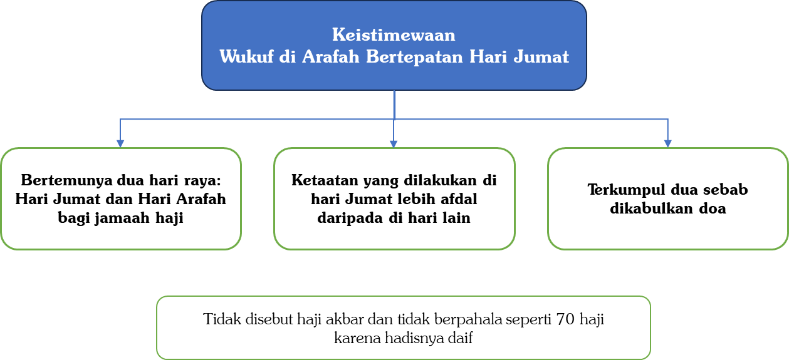

Pertanyaan 2: Apakah disyariatkan wukuf di atas Jabal ar-Rahmah?


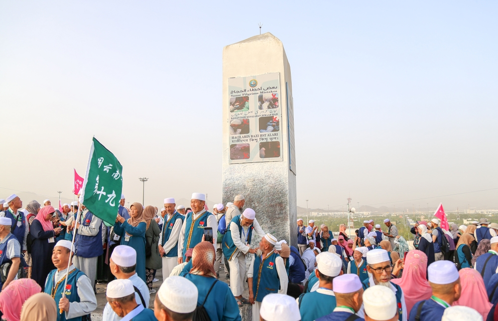

Jawab:

Di antara fenomena tahunan sebagian jamaah haji dari berbagai negara adalah berebut-rebutan untuk menaiki Jabal ar-Rahmah di padang Arafah. Jabal ar-Rahmah disebut juga oleh para ulama dengan nama Jabal Ilal “إِلَال”—seperti pengucapan hilal.

Para jamaah haji di Jabal ar-Rahmah melakukan berbagai kegiatan untuk mencari keberkahan; ada yang salat di situ, ada yang hanya sekedar berdoa di situ, ada yang meninggalkan fotonya di situ, ada yang menulis-nulis di situ dan lain-lain. Bahkan, Penulis pernah melihat sendiri ada jamaah haji yang salat menghadap Jabal ar-Rahmah dan tidak menghadap kiblat; tatkala ditegur, maka terjadilah dialog ringan, namun si haji tetap bersikeras untuk salat menghadap Jabal ar-Rahmah dan tidak menghadap kiblat. Sebagian jamaah juga meyakini bahwa dengan menuju ke Jabal ar-Rahmah, maka kecintaan dalam keluarga akan semakin langgeng.

Sebenarnya apa rahasia dibalik keistimewaan Jabal ar-Rahmah?

Cerita yang tersebar di tengah para jamaah haji adalah bahwa di Jabal ar-Rahmah merupakan tempat pertemuan Nabi Adam ‘alaihissalâm dengan Hawa. Mereka berdua diturunkan ke bumi pada tempat yang terpisah, kemudian mereka berdua saling mencari satu sama lain hingga akhirnya bertemu di Jabal ar-Rahmah. Akhirnya, kerinduan dan kecintaan antara dua kekasih tumbuh kembali setelah pertemuan di Jabal ar-Rahmah. Namun, apakah cerita ini benar?

Tidak dipungkiri bahwa sebagian ahli tafsir, ketika menyebutkan sebab penamaan padang Arafah, mereka menyebutkan ada beberapa pendapat. Di antara pendapat tersebut adalah sebagai berikut:

- Dinamakan Arafah karena para jamaah haji berkumpul di sana, sehingga mereka pun,

```arabic
يَتَعَارَفُوْنَ فِيْهَا
```

“Saling mengenal di antara mereka di padang tersebut.”

- Dinamakan Arafah karena tempat itu telah diperlihatkan dan digambarkan kepada Nabi Ibrahim ‘alaihissalâm. Ketika beliau melihatnya, beliau pun mengenalinya, sebagaimana disebutkan,

```arabic
لِأَنَّهَا وُصِفَتْ لِإِبْرَاهِيمَ عَلَيْهِ السَّلَامُ، فَلَمَّا أَبْصَرَهَا عَرَفَهَا
```

“Karena ia (tempat itu) telah digambarkan kepada Ibrahim ‘alaihissalâm; maka ketika beliau melihatnya, beliau pun mengenalinya.”

- Ada pula yang berpendapat bahwa ketika Malaikat Jibril ‘alaihissalâm membawa Nabi Ibrahim mengelilingi tempat-tempat manasik, beliau diperlihatkan Padang Arafah. Kemudian Nabi Ibrahim berkata,

```arabic
عَرَفْتُ عَرَفْتُ
```

“Aku tahu, aku tahu.”

- Dinamakan Arafah karena di tempat itulah Nabi Adam dan Hawa bertemu kembali setelah terpisah, lalu saling mengenal,

```arabic
اِلْتَقَى فِيْهَا آدَمُ وَحَوَّاءَ فَتَعَارَفَا
```

“Nabi Adam dan Siti Hawa bertemu di padang tersebut maka mereka berdua saling mengenal.”

Inilah sebagian pendapat yang disebutkan oleh para ahli tafsir, seperti al-Qurthubi, az-Zamakhsari, Ibnu Katsir, dan asy-Syaukani rahimahumullâh.

Namun az-Zamakhsari dan Ibnu ‘Athiyyah mengisyaratkan pendapat yang menyatakan bahwa nama Arafah merupakan salah satu dari al-Asma` al-Murtajalah, yaitu nama-nama yang tidak berasal dari kata lainnya. Dengan kata lain, nama tersebut merupakan penamaan khusus yang tidak diturunkan dari akar kata tertentu, sebagaimana banyak nama tempat lainnya..

Yang menjadi perhatian adalah pendapat yang menyatakan bahwa Arafah dinamakan demikian karena Nabi Adam setelah berpisah lama dengan Hawa, akhirnya bertemu kembali di padang Arafah. Terdapat beberapa catatan tentang pendapat tersebut, di antaranya adalah:

- Pendapat tersebut tidak memiliki dalil, serta tidak ada riwayat sahih yang bisa dijadikan sandaran. Dan kemungkinan besar pendapat tersebut diambil dari cerita israiliat.

- Kalaupun riwayat tersebut dianggap sahih—padahal sebenarnya tidak—tetap tidak disebutkan bahwa pertemuan Nabi Adam ‘alaihissalâm dan Hawa terjadi di sebuah gunung. Yang disebutkan hanyalah bahwa mereka bertemu di Padang Arafah secara umum, tanpa pengkhususan pada suatu tempat yang tinggi. Selain itu, secara logika, tidak ada alasan kuat mengapa pertemuan itu harus terjadi di tempat yang tinggi. Justru lebih masuk akal apabila mereka bertemu di tempat yang landai dan mudah dijangkau.

- Kalaupun benar bahwa rasa cinta antara Nabi Adam dan Hawa tumbuh kembali, maka tempat tersebut hanyalah kebetulan menjadi lokasi pertemuan mereka. Tempat itu tidak dapat dijadikan sebagai tempat yang dianggap membawa keberkahan, lalu dijadikan lokasi khusus untuk salat, tempat dikabulkannya doa, atau sarana untuk melanggengkan cinta kasih, dan sebagainya.

Intinya, semua penjelasan ini disampaikan seandainya kisah tersebut benar adanya. Namun, sebagaimana telah diketahui, tidak terdapat satu pun riwayat sahih yang menunjukkan kebenaran cerita tersebut. Oleh karena itu, para ahli tafsir menyebutkan pendapat ini dengan menggunakan ungkapan وَقِيْلَ “dan dikatakan…”, sebagai isyarat bahwa kisah tersebut tidak memiliki landasan dalil yang kuat dan tidak dapat dijadikan pegangan.

Para ulama telah mengingkari perbuatan jamaah haji yang semangat menaiki Jabal ar-Rahmah untuk mencari keberkahan.

Asy-Syinqithi rahimahullâh berkata dalam tafsirnya,

```arabic
اِعْلَمْ أَنَّ الصُّعُودَ عَلَى جَبَلِ الرَّحْمَةِ الَّذِي يَفْعَلُهُ كَثِيرٌ مِنَ الْعَوَامِّ لَا أَصْلَ لَهُ، وَلَا فَضِيلَةَ فِيهِ، لِأَنَّهُ لَمْ يَرِدْ فِي خُصُوصِهِ شَيْءٌ بَلْ هُوَ كَسَائِرِ أَرْضِ عَرَفَةَ، وَعَرَفَةُ كُلُّهَا مَوْقِفٌ، وَكُلُّ أَرْضِهَا سَوَاءٌ إِلَّا مَوْقِفَ رَسُولِ اللَّهِ صَلَّى اللَّهُ عَلَيْهِ وَسَلَّمَ، فَالْوُقُوفُ فِيهِ أَفْضَلُ مِنْ غَيْرِهِ
```

“Ketahuilah bahwasanya menaiki jabal Ramah yang dilakukan oleh banyak orang awam adalah perbuatan yang tidak ada asalnya (tidak ada dalilnya), dan tidak ada keutamaannya. Karena tidak ada sama sekali dalil yang menunjukkan keutamaan Jabal ar-Rahmah. Maka Jabal ar-Rahmah sama saja sebagaimana lokasi-lokasi yang lain di padang Arafah. Dan seluruh padang Arafah adalah lokasi untuk wukuf. Seluruh tempat yang ada di Arafah sama hukumnya, kecuali lokasi tempat wukufnya Nabi, maka wukuf di lokasi tersebut lebih afdal daripada yang lainnya.”[^4]

Ibnu Taimiyyah rahimahullâh berkata,

```arabic
وَلَا يُشْرَعُ صُعُودُ جَبَلِ الرَّحْمَةِ إجْمَاعًا
```

“Tidak disyariatkan menaiki Jabal ar-Rahmah berdasarkan ijmak ulama.”[^5]

Bahkan telah datang pengingkaran dari para ulama besar mazhab Syafi’iyah. Di antara yang mengingkarinya adalah:

---

## Pertama: Imamul haramain al-juwaini. beliau berkata,

```arabic
وَفِي وَسَطِهَا جَبَلٌ يُسَمَّى جَبَلَ الرَّحْمَةِ، وَلَا نُسُكَ فِي الرُّقِيِّ فِيْهِ، وَإِنْ كَانَ يَعْتَادُهُ النَّاسُ
```

“Di tengah padang Arafah ada sebuah gunung yang dinamakan Jabal ar-Rahmah, tidak ada manasik di atas gunung tersebut, meskipun orang-orang terbiasa melakukannya. Wallâhu a’lam.”[^6]

---

## Kedua: Al-imam an-nawawi rahimahullâh. beliau menyatakan bahwa menaiki jabal ar-rahmah menyelisihi sunah Nabi ﷺ. beliau juga membantah Ibnu jarir ath-thabari dan al-mawardi yang menyatakan bahwa menaiki jabal ar-rahmah adalah perbuatan yang disukai. an-nawawi berkata,

```arabic
(وَأَمَّا) مَا اشْتَهَرَ عِنْدَ الْعَوَامّ مِنَ الِاعْتِنَاءِ بِالْوُقُوفِ عَلَى جَبَلِ الرَّحْمَةِ الَّذِي هُوَ بِوَسَطِ عَرَفَاتٍ كَمَا سَبَقَ بَيَانُهُ وَتَرْجِيحِهِمْ لَهُ عَلَى غَيْرِهِ مِنْ أَرْضِ عَرَفَاتٍ حَتَّى رُبَّمَا تُوُهِّمَ مِنْ جَهَلَتِهِمْ أَنَّهُ لَا يَصِحُّ الْوُقُوفُ إلَّا فِيهِ فَخَطَأٌ ظَاهِرٌ وَمُخَالِفٌ لِلسُّنَّةِ وَلَمْ يَذْكُرْ أَحَدٌ مِمَّنْ يُعْتَمَدُ فِي صُعُوْدِ هَذَا الْجَبَلِ فَضِيلَةً يَخْتَصُّ بِهَا بَلْ لَهُ حُكْمُ سَائِرِ أَرْضِ عَرَفَاتٍ غَيْرِ مَوْقِفِ رَسُولُ اللَّهِ صَلَّى اللَّهُ عَلَيْهِ وَسَلَّمَ أَلَا أَبُو جَعْفَرٍ مُحَمَّدُ بْنُ جَرِيرٍ الطَّبَرِيُّ فَإِنَّهُ قَالَ يُسْتَحَبُّ الْوُقُوفُ عَلَيْهِ وَكَذَا قَالَ الْمَاوَرْدِيُّ فِي الْحَاوِي يُسْتَحَبُّ قَصْدُ هَذَا الْجَبَلِ الَّذِي يُقَالُ لَهُ جَبَلُ الدُّعَاءِ قَالَ وَهُوَ مَوْقِفُ الأَنْبِيَاءِ صَلَوَاتُ اللَّهِ وَسَلَامُهُ عَلَيْهِمْ وَذَكَرَ الْبَنْدَنِيجِيُّ نَحْوَهُ
```

```arabic
وَهَذَا الَّذِي قَالُوهُ لَا أَصْلَ لَهُ وَلَمْ يَرِدْ فِيهِ حَدِيثٌ صَحِيحٌ وَلَا ضَعِيفٌ فَالصَّوَابُ الِاعْتِنَاءُ بِمَوْقِفِ رَسُولِ اللَّهِ صَلَّى اللَّهُ عَلَيْهِ وَسَلَّمَ وَهُوَ الَّذِي خَصَّهُ الْعُلَمَاءُ بِالذِّكْرِ وَحَثُّوا عَلَيْهِ وَفَضَّلُوهُ وَحَدِيثُهُ فِي صَحِيحِ مُسْلِمٍ وَغَيْرِهِ كَمَا سَبَقَ هَكَذَا نَصَّ عَلَيْهِ الشَّافِعِيُّ وَجَمِيعُ أَصْحَابِنَا وَغَيْرُهُمْ مِنْ الْعُلَمَاءِ
```

“Adapun yang terkenal pada orang-orang awam berupa perhatian mereka untuk wukuf di atas Jabal ar-Rahmah yang berada di tengah padang Arafah…dan mereka mengafdalkan Jabal ar-Rahmah daripada lokasi yang lain di padang Arafah, bahkan sampai sebagian mereka karena kebodohannya menyangka bahwa tidak sah wukuf kecuali di Jabal ar-Rahmah, maka ini merupakan kesalahan yang jelas dan menyelisihi sunah. Tidak seorang ulama pun yang dijadikan patokan menyebutkan ada keutamaan khusus naik di atas Jabal ar-Rahmah. Hukum Jabal ar-Rahmah sama dengan lokasi-lokasi yang lain di padang Arafah kecuali lokasi wukufnya Nabi.

Yang menyatakan ada keutamaan khusus hanyalah Abu Ja’far Muhammad bin Jarir ath-Thabari, ia menyatakan disukai untuk wukuf di Jabal ar-Rahmah. Demikian juga al-Mawardi dalam kitab al-Hâwî menyatakan disukai untuk mencari jabal/gunung tersebut yang dikenal dengan gunung doa. Al-Mawardi juga berkata bahwa Jabal ar-Rahmah adalah tempat wukufnya para nabi ‘alaihimussalâm. Al-Bandanijiyu juga mengebutkan yang semisal ini.

Hal-hal yang disebutkan oleh ketiga ulama ini tidak ada asalnya, tidak ada hadis tentang hal ini, baik yang sahih maupun yang daif.

Yang benar adalah perhatian terhadap tempat wukufnya Nabi, dan inilah yang disebutkan secara khusus oleh para ulama dan dimotivasi dan dinyatakan utama oleh mereka. Dan hadisnya terdapat di dalam Shahîh Muslim dan yang lainnya—sebagaimana telah lalu. Inilah yang telah dinyatakan oleh asy-Syafi’i dan seluruh para ulama syafi’iyah dan ulama yang lainnya.”[^7]

---

## Ketiga: Ad-dimyathi. beliau berkata,

```arabic
وَاعْلَمْ أَنَّ الصُّعُوْدَ عَلَى الْجَبَلِ لِلْوُقُوْفِ عَلَيْهِ كَمَا يَفْعَلُهُ الْعَوَامُّ خَطَأٌ، مُخَالِفٌ لِلسُّنَّةِ
```

“Ketahuilah bahwasanya naik ke atas Jabal ar-Rahmah untuk wukuf di situ sebagaimana yang dilakukan oleh orang awam adalah suatu kesalahan dan menyelisihi sunah.”[^8]

---

## Keempat: Ibnu Hajar al-haitami. beliau berkata,

```arabic
وَلْيَحْذَرْ مِنْ صُعُودِ جَبَلِ الرَّحْمَةِ بِوَسَطِ عَرَفَةَ، فَإِنَّهُ بِدْعَةٌ
```

“Dan berhati-hatilah dari memanjat Jabal ar-Rahmah yang ada di tengah padang Arafah, karena hal ini adalah bidah.”[^9]

Kesimpulan:

1. Nabi ﷺ dan para sahabat sama sekali tidak pernah menaiki Jabal ar-Rahmah.

1. Lokasi wukuf Nabi ﷺ adalah di bawah, dekat Jabal ar-Rahmah, bukan di atas Jabal ar-Rahmah. Nabi ﷺ berwukuf sambil menaiki unta dan menghadap kiblat, sementara Jabal ar-Rahmah berada di antara beliau dan kiblat.

1. Semua tempat wukuf di Padang Arafah memiliki kedudukan yang sama dan tidak ada yang bersifat khusus atau istimewa, kecuali lokasi wukuf Nabi ﷺ.

1. Para ulama telah ijmak bahwa tidak disyariatkan menaiki Jabal ar-Rahmah. Bahkan ulama Syafi’iyah telah mengingkari hal tersebut; ada yang mengatakan menyelisihi sunah, bahkan ada juga yang menyatakan bidah.

1. Yang disyariatkan bagi jamaah haji adalah berdoa sejak selesai salat Zuhur dan asar (jamak qasar takdim) hingga terbenam matahari. Para jamaah tidak perlu bersusah payah mencari lokasi Jabal ar-Rahmah karena akan menghabiskan waktu emas untuk berdoa. Selain itu, mencari lokasi Jabal ar-Rahmah kemudian kembali ke tenda merupakan sesuatu yang sulit, terutama jamaah haji yang tidak tahu medan padang Arafah.

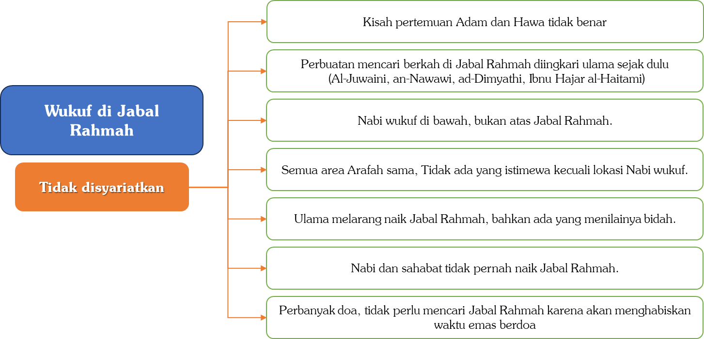

# 4.7 — Muzdalifah

Pertanyaan 1: Apakah kerikil harus diambil di Muzdalifah?

Jawab:

Mengambil kerikil di Muzdalifah bukanlah suatu keharusan. Bahkan Nabi ﷺ sendiri tidak mengambil kerikil di Muzdalifah, melainkan mengambilnya di Mina tatkala hendak melempar jamrah Aqabah.[^10] Hanya saja, memang terdapat banyak kerikil di Muzdalifah, berbeda dengan Mina sekarang yang cukup sulit untuk mencari kerikil.

Pada dasarnya, tidak mengapa mengambil kerikil di mana pun, karena semuanya tetap disebut sebagai kerikil. [^11] Namun, para ulama berbeda pendapat mengenai tempat yang lebih utama untuk mengambilnya, apakah di Muzdalifah atau di perjalanan menuju Mina.([^12])

Pertanyaan 2: Bolehkah meninggalkan Muzdalifah setelah lewat tengah malam karena mengikuti rombongan?

Jawab:

Bagi orang yang kuat dan tidak beruzur, maka dia wajib untuk mabit (bermalam) di Muzdalifah hingga salat subuh. Adapun orang yang lemah seperti anak-anak, para wanita, orang-orang tua, orang-orang sakit, dan yang beruzur, maka dibolehkan bagi mereka untuk meninggalkan Muzdalifah setelah lewat tengah malam.([^13])

Rukhsah (keringanan) ini juga berlaku bagi orang-orang yang kuat namun mereka harus menemani atau menjaga para wanita dan orang-orang yang lemah. Sebagaimana Nabi ﷺ mengutus Ibnu Abbas—tatkala itu usianya sekitar 14 tahun—untuk menemani orang-orang lemah. Ibnu Abbas berkata,

```arabic
بَعَثَنِي رَسُولُ اللهِ صَلَّى اللهُ عَلَيْهِ وَسَلَّمَ فِي الثَّقَلِ - أَوْ قَالَ فِي الضَّعَفَةِ - مِنْ جَمْعٍ بِلَيْلٍ
```

“Rasulullah mengutusku bersama orang-orang lemah untuk keluar dari Muzdalifah di malam hari.”[^14]

Begitu juga dengan Abdullah maula Asma` binti Abu Bakar keluar untuk menemani Asma` yang keluar dari Muzdalifah setelah lewat tengah malam.[^15]

Jika hal tersebut saja diperbolehkan pada masa Nabi ﷺ, ketika kondisi belum terlalu padat, maka terlebih lagi pada masa sekarang, ketika jumlah jamaah haji telah mencapai jutaan orang.([^16])

Pertanyaan 3: Jika tidak mendapat tempat di Muzdalifah, bolehkah mabit di luar Muzdalifah?

Jawab:

Barang siapa yang tidak mabit di Muzdalifah tanpa uzur, maka ia harus bayar dam karena telah meninggalkan salah satu kewajiban haji.

Syekh Bin Baz berkata,

```arabic
إِنْ كَانَ لَمْ يَجِدْ مَكَانًا فِي مُزْدَلِفَةَ أَوْ مَنَعَهُ الْجُنُوْدُ مِنَ النُّزُوْلِ بِهَا فَلَا شَيْءَ عَلَيْهِ؛ لِقَوْلِ اللهِ سُبْحَانَهُ: ﵟفَٱتَّقُواْ ٱللَّهَ مَا ٱسۡتَطَعۡتُمۡﵞ وَإِنْ كَانَ ذَلِكَ عَنْ تَسَاهُلٍ مِنْهُ فَعَلَيْهِ دَمٌ مَعَ التَّوْبَةِ
```

“Jika ia tidak mendapati tempat (untuk mabit) di Muzdalifah atau ia dilarang oleh askar untuk berhenti di Muzdalifah maka tidak kena kewajiban apa pun. Hal ini berdasarkan firman Allah, ‘Bertakwalah semampu kalian.’ (QS. At-Taghâbun: 16). Namun jika hal itu terjadi karena sikap bermudah-mudahan (menyepelekan dan menggampangkan) maka wajib baginya untuk membayar dam disertai dengan tobat.”[^17]

Jika seseorang telah berusaha meninggalkan Arafah segera setelah matahari terbenam, namun tetap tidak mendapatkan tempat untuk mabit di Muzdalifah, maka hal tersebut tidak mengapa baginya.

Berbeda halnya apabila seseorang bersikap menggampangkan, dengan sengaja meninggalkan Arafah setelah larut malam menuju Muzdalifah, atau seperti sebagian travel yang sengaja melewati jalur yang salah sehingga dilarang masuk oleh petugas dan aparat keamanan. Dalam kondisi seperti ini, dia wajib membayar dam serta bertobat kepada Allah atas kelalaiannya.

# 4.8 — Melempar Jamrah

Pertanyaan 1: Bagaimanakah cara mewakilkan melempar jamrah?

Jawab:

Ada beberapa perkara yang harus diperhatikan:

Pertama, wajib bagi jamaah haji untuk melakukan seluruh rangkaian haji sendiri tanpa mewakilkannya kepada orang lain. Namun, jika memang ada uzur syar’i sehingga tidak bisa melakukan sendiri, maka boleh baginya untuk mewakilkannya kepada orang lain.

An-Nawawi berkata,

```arabic
قَالَ الشَّافِعِيُّ وَالأَصْحَابُ رَحِمَهُمُ اللهُ: الْعَاجِزُ عَنِ الرَّمْيِ بِنَفْسِهِ لِمَرَضٍ أَوْ حَبْسٍ وَنَحْوِهِمَا يَسْتَنِيْبُ مَنْ يَرْمِي عَنْهُ... وَسَوَاءٌ كَانَ الْمَرَضُ مَرْجُوَّ الزَّوَالِ أَوْ غَيْرَهُ... وَسَوَاءً اسْتَنَابَ بِأُجْرَةٍ أَوْ بِغَيْرِهَا وَسَوَاءً اسْتَنَابَ رَجُلاً أَوْ امْرَأَةً
```

“Asy-Syafi’i dan para ulama mazhab Syafi’i berkata, ‘Orang yang tidak mampu untuk melempar sendiri karena sakit atau tertahan dan yang semisalnya maka ia mewakilkan orang lain yang melemparkan untuknya…sama saja apakah penyakitnya masih diharapkan sembuh atau tidak…dan sama saja apakah ia mewakilkan dengan upah atau tanpa upah, dan sama saja apakah ia mewakilkan kepada lelaki ataupun wanita’.”([^18])

Sebagaimana ibadah haji boleh diwakilkan kepada orang lain, demikian pula sebagian rangkaiannya, seperti melempar jamrah. Terlebih lagi, waktu pelaksanaan lempar jamrah sangat terbatas, berbeda dengan tawaf dan sai yang waktunya lebih longgar. Oleh karena itu, lempar jamrah memungkinkan untuk diwakilkan, sedangkan tawaf dan sai tidak dapat diwakilkan.([^19])

Contoh orang-orang yang beruzur adalah orang sakit; seorang wanita yang sedang hamil; anak kecil yang belum bisa melempar sendiri; orang yang sangat tua renta sehingga tidak kuat jalan, dan yang semisalnya.

Adapun orang yang tidak memiliki uzur,[^20] maka dia tidak boleh mewakilkan lemparan jamrah kepada orang lain. Jika dia tetap mewakilkannya, maka lemparan tersebut tidak sah, dan dia harus membayar fidyah.

Kedua, disyaratkan bagi orang yang diwakilkan sudah selesai melempar untuk dirinya sendiri terlebih dahulu, baru kemudian boleh melempar untuk orang yang mewakilkan.[^21]

Oleh karena itu, cara melempar jamrah agar lebih praktis dan mudah dilakukan adalah sebagai berikut:

Orang yang mendapat amanah untuk mewakili terlebih dahulu melempar al-Jamrah ash-Shughra sebanyak tujuh kali untuk dirinya sendiri, kemudian melempar tujuh kali untuk orang yang diwakilinya. Setelah itu, dia melempar al-Jamrah al-Wustha tujuh kali untuk dirinya, lalu tujuh kali untuk orang yang diwakilinya. Selanjutnya, dia melempar al-Jamrah al-Kubra (Jamrah Aqabah) tujuh kali untuk dirinya, kemudian diikuti dengan tujuh kali lemparan untuk orang yang diwakilinya.[^22]

Dengan cara ini, pelaksanaan lempar jamrah menjadi lebih mudah dan tidak perlu bolak-balik.

Ketiga, jika seseorang telah mewakilkan orang lain untuk melempar jamrah, maka dia tidak boleh langsung meninggalkan Makkah dengan melakukan tawaf Wadak, kecuali jika seluruh kewajiban melontar telah selesai. Karena tawaf Wadak tidak dikerjakan kecuali setelah seluruh rangkaian haji telah selesai dikerjakan.

Oleh karena itu, apabila seseorang telah mewakilkan lempar jamrah dengan niat mengambil nafar awal, kemudian pada tanggal 11 Zulhijah dia melaksanakan tawaf Wadak dan meninggalkan Makkah, maka tawaf tersebut tidak sah. Karena dia masih memiliki tanggungan lempar jamrah melalui wakilnya pada tanggal 12 Zulhijah. Dalam kondisi demikian, dia wajib membayar dam.

Pertanyaan 2: Bolehkan bagi jamaah yang keluar dari Muzdalifah setelah lewat tengah malam langsung melempar Jamrah Aqabah? Ataukah harus menunggu sampai matahari terbit?

Jawab:

Sunahnya adalah melempar Jamrah Aqabah setelah matahari terbit. Ini berlaku juga bagi orang-orang yang diizinkan dan diberi keringanan untuk keluar dari Muzdalifah setelah lewat tengah malam. Ibnu Abbas berkata,

```arabic
كَانَ رَسُولُ اللَّهِ صَلَّى اللهُ عَلَيْهِ وَسَلَّمَ يُقَدِّمُ ضُعَفَاءَ أَهْلِهِ بِغَلَسٍ، وَيَأْمُرُهُمْ يَعْنِي لَا يَرْمُونَ الْجَمْرَةَ حَتَّى تَطْلُعَ الشَّمْسُ
```

“Rasulullah mendahulukan keluarganya yang lemah untuk meninggalkan Muzdalifah tatkala masih remang-remang, dan beliau memerintahkan mereka agar tidak melempar jamrah Aqabah hingga terbit matahari.”[^23]

Namun, melempar Jamrah Aqabah setelah matahari terbit adalah sunah dan tidak wajib. Bagi siapa yang keluar dari Muzdalifah setelah tengah malam, maka boleh baginya untuk langsung melempar Jamrah Aqabah begitu sampai di Mina.

Salim berkata,

```arabic
وَكَانَ عَبْدُ اللَّهِ بْنُ عُمَرَ رَضِيَ اللَّهُ عَنْهُمَا يُقَدِّمُ ضَعَفَةَ أَهْلِهِ، فَيَقِفُونَ عِنْدَ الْمَشْعَرِ الْحَرَامِ بِالْمُزْدَلِفَةِ بِلَيْلٍ فَيَذْكُرُونَ اللَّهَ مَا بَدَا لَهُمْ، ثُمَّ يَرْجِعُونَ قَبْلَ أَنْ يَقِفَ الإِمَامُ وَقَبْلَ أَنْ يَدْفَعَ، فَمِنْهُمْ مَنْ يَقْدَمُ مِنًى لِصَلَاةِ الْفَجْرِ، وَمِنْهُمْ مَنْ يَقْدَمُ بَعْدَ ذَلِكَ، فَإِذَا قَدِمُوا رَمَوْا الجَمْرَةَ وَكَانَ ابْنُ عُمَرَ رَضِيَ اللَّهُ عَنْهُمَا يَقُولُ: أَرْخَصَ فِي أُولَئِكَ رَسُولُ اللَّهِ صَلَّى اللهُ عَلَيْهِ وَسَلَّمَ
```

“Ibnu Umar mendahulukan orang-orang yang lemah dari keluarganya (baik wanita maupun yang lainnya), maka mereka pun mabit di al-Masy’ar al-Haram di Muzdalifah di malam hari. Lalu mereka berzikir kepada Allah hingga yang dimudahkan bagi mereka. Lalu mereka kembali (ke Mina) sebelum Imam (penguasa) pergi bertolak ke Mina. Di antara mereka ada yang tiba di Mina ketika waktu salat subuh. Dan di antara mereka ada yang tiba di Mina setelah itu. Jika mereka tiba di Mina, mereka melempar jamrah Aqabah. Ibnu Umar radhiyallâhu ‘anhumâ berkata, ‘Rasulullah memberi keringanan kepada mereka’.”[^24]

Hadis ini jelas menunjukkan kebolehan melempar Jamrah Aqabah meskipun matahari belum terbit, dan juga menunjukkan bahwa jamaah bisa langsung melempar Jamrah Aqabah begitu tiba di Mina.[^25]

Mukhbir berkata dari Asma`,

```arabic
أَنَّهَا رَمَتِ الْجَمْرَةَ، قُلْتُ: إِنَّا رَمَيْنَا الْجَمْرَةَ بِلَيْلٍ، قَالَتْ: إِنَّا كُنَّا نَصْنَعُ هَذَا عَلَى عَهْدِ رَسُولِ اللَّهِ صَلَّى اللهُ عَلَيْهِ وَسَلَّمَ
```

“Bahwasanya Asma` melempar jamrah Aqabah. Aku (Mukhbir) berkata, ‘Apakah kita melempar jamrah Aqabah di malam hari?’

Asma` berkata, ‘Kami dahulu melakukannya di masa Nabi’.”[^26]

Hadis ini juga sangat jelas menunjukkan bahwa kebolehan melempar Jamrah Aqabah di malam hari sebelum fajar terbit.

# 4.9 — Dam dan Kurban

Pertanyaan 1: Apakah jamaah haji masih perlu berkurban?

Jawab:

Banyak jamaah haji yang memiliki semangat tinggi dalam beramal kebaikan. Meskipun mereka telah diwajibkan untuk menyembelih hewan hadyu, mereka tetap antusias melaksanakan ibadah kurban. Terlebih lagi dengan anggapan bahwa berkurban di tanah suci Makkah menjanjikan pahala yang berlipat ganda dibandingkan berkurban di tanah air.

Lalu, apakah mereka masih disyariatkan untuk berkurban? Jika iya, manakah yang lebih utama: berkurban di Makkah atau di tanah air yang memiliki lebih banyak fakir miskin dan orang-orang yang membutuhkan?

Mazhab Hanafiah berpendapat bahwa ibadah kurban hukumnya wajib bagi setiap muslim yang mampu. Namun, menurut mereka, seseorang yang sedang menunaikan ibadah haji tidak diwajibkan berkurban karena dia berada dalam kondisi safar. Adapun penduduk Makkah yang melaksanakan haji tetap diwajibkan berkurban, sebab mereka berstatus sebagai mukim, bukan musafir.

As-Sarakhsi berkata,

```arabic
وَإِنَّمَا لَمْ تَجِبْ عَلَى الْمُسَافِرِينَ لِمَا يَلْحَقُهُمْ مِنْ الْمَشَقَّةِ فِي تَحْصِيلِهَا... هِيَ وَاجِبَةٌ عَلَى أَهْلِ الأَمْصَارِ مَا خَلَا الْحَاجَّ....فَأَمَّا أَهْلُ مَكَّةَ فَعَلَيْهِمْ الْأُضْحِيَّةُ، وَإِنْ حَجُّوا
```

“Kurban tidaklah wajib bagi orang-orang yang bersafar karena hal ini memberatkan mereka… Kurban wajib bagi penduduk kota selain yang sedang haji…Adapun penduduk kota Makkah maka wajib bagi mereka untuk berkurban meskipun mereka berhaji.”[^27]

Adapun mazhab Malikiah, kurban tidak disyariatkan bagi orang yang berhaji karena dia karena dia sedang melakukan ibadah haji, bukan karena dia sedang bersafar. Oleh karena itu, meski orang yang berhaji adalah penduduk Mina—sehingga status mereka mukim, bukan musafir—tetap saja tidak disyariatkan untuk berkurban.

Al-Imam Malik berkata,

```arabic
لَيْسَ عَلَى الْحَاجِّ أُضْحِيَّةٌ وَإِنْ كَانَ مِنْ سَاكِنِي مِنًى بَعْدَ أَنْ يَكُونَ حَاجًّا
```

“Seorang haji tidak berkewajiban kurban meskipun ia tinggal di Mina setelah ia melaksanakan haji.”[^28]

Bagi mazhab Malikiah, kurban hukumnya sunah muakadah bagi yang mampu, bahkan musafir yang mampu juga hendaknya berkurban. Namun, orang yang sedang berhaji tidak disunahkan untuk berkurban, karena yang sunah bagi mereka adalah al-hadyu, bukan al-udhiyah (kurban).[^29]

Oleh karena itulah hadyu boleh disembelih meskipun matahari belum terbit, berbeda dengan al-udhiyah (kurban) yang tidak boleh disembelih kecuali setelah salat Iduladha, karena ibadah kurban berkaitan dengan Iduladha. Sementara itu para jamaah haji tidak melakukan salat Iduladha. Dengan demikian, mereka tidak perlu untuk berkurban. Bahkan tidak disunahkan bagi mereka untuk salat Iduladha, karena salat mereka diganti dengan wukuf setelah subuh di Muzdalifah.[^30]

Adapun mazhab Syafi’iyah, ibadah kurban tetap disyariatkan bagi siapa saja yang mampu, baik mukim maupun musafir, termasuk yang sedang berhaji.

Al-Imam asy-Syafi’i berkata,

```arabic
الْأُضْحِيَّةُ سُنَّةٌ عَلَى كُلِّ مَنْ وَجَدَ السَّبِيلَ مِنَ الْمُسْلِمِينَ، مِنْ أَهْلِ الْمَدَائِنِ وَالْقُرَى، وَأَهْلِ السَّفَرِ وَالْحَضَرِ، وَالْحَاجِّ بِمِنًى وَغَيْرِهِمْ، مَنْ كَانَ مَعَهُ هَدْيٌ وَمَنْ لَمْ يَكُنْ مَعَهُ هَدْيٌ
```

“Kurban hukumnya sunah bagi kaum muslimin mana saja yang mampu, baik penduduk kota atau kampung, baik yang sedang bersafar atau bermukim, baik yang haji di Mina atau selain mereka, baik yang membawa hadyu atau yang tidak membawa hadyu.”[^31]

Al-Imam an-Nawawi berdalil dengan sebuah hadis dengan lafal,

```arabic
((ضَحَّى رَسُولُ اللَّهِ صَلَّى اللهُ عَلَيْهِ وَسَلَّمَ عَنْ أَزْوَاجِهِ بِالْبَقَرِ))
```

“Rasulullah ber-udhiyah (berkurban) untuk para istrinya dengan seekor sapi.”[^32]

Pendapat tersebut juga didukung oleh Ibnu Hazm.

Adapun menurut mazhab Hanabilah, bagi jamaah haji yang melaksanakan haji Tamattu’ dan Kiran, kewajiban yang harus ditunaikan adalah menyembelih hadyu. Sementara itu, bagi jamaah yang tidak diwajibkan hadyu, yaitu orang yang melaksanakan haji Ifrad, maka diperbolehkan baginya untuk melaksanakan ibadah kurban.

Berkata Ibnu Qudamah,

```arabic
فَإِنْ لَمْ يَكُنْ مَعَهُ هَدْيٌ، وَعَلَيْهِ هَدْيٌ، وَاجِبٌ، اشْتَرَاهُ، وَإِنْ لَمْ يَكُنْ عَلَيْهِ وَاجِبٌ، فَأَحَبَّ أَنْ يُضَحِّيَ، اشْتَرَى مَا يُضَحِّي بِهِ
```

“Jika ia tidak membawa hewan hadyu padahal ia wajib untuk menyembelih hadyu maka ia beli hewan hadyu tersebut. Kemudian jika ia tidak wajib hadyu, namun ia ingin berkurban maka silakan ia membeli kurbannya.”[^33]

Pendapat yang terkuat:

Pendapat yang terkuat adalah pendapat jumhur ulama, yaitu: tidak disyariatkan berkurban bagi orang yang sedang melakukan ibadah haji. Karena tidak dinukilkan bahwa Nabi ﷺ dan para sahabat berkurban ketika sedang berhaji. Yang diriwayatkan hanyalah bahwa mereka menyembelih hewan hadyu, bukan hewan kurban.[^34]

Adapun hadis Nabi ﷺ,

```arabic
((ضَحَّى رَسُولُ اللَّهِ صَلَّى اللهُ عَلَيْهِ وَسَلَّمَ عَنْ أَزْوَاجِهِ بِالْبَقَرِ))
```

“Rasulullah ber-udhiyah (berkurban) untuk para istrinya dengan seekor sapi.”[^35]

Maka penjelasannya—sebagaimana yang dijelaskan oleh al-Hafiz Ibnu Hajar rahimahullâh—dari dua sisi:

---

## Pertama: Lafal yang terdapat dalam hadis memiliki beragam redaksi. di antaranya terdapat lafal نَحَرَ dan ذَبَحَ yang bermakna “menyembelih”, serta lafal أَهْدَى yang berarti “menyembelih hewan hadyu”. hal ini menunjukkan bahwa penggunaan lafal ضَحَّى, نَحَرَ, dan ذَبَحَ dalam sebagian riwayat merupakan bentuk periwayatan secara makna oleh sebagian perawi

Adapun lafal yang benar adalah أَهْدَى, yaitu bahwa beliau menyembelihkan hewan hadyu Tamattu’ untuk istri-istri beliau. Hal ini diperkuat dengan riwayat yang tegas dari Abu Hurairah,

```arabic
أَنَّ رَسُولَ اللَّهِ صَلَّى اللَّهُ عَلَيْهِ وَسَلَّمَ ذَبَحَ عَمَّنِ اعْتَمَرَ مِنْ نِسَائِهِ بَقَرَةً بَيْنَهُنَّ
```

“Bahwasanya Rasulullah menyembelihkan untuk istri-istrinya yang melaksanakan umrah (yaitu umrah Tamattu’) seekor sapi.”[^36]

---

## Kedua: Kebiasaan Nabi ﷺ ketika menyembelih kurban adalah dengan menyembelih seekor kambing untuk dirinya dan seluruh keluarganya, bukan menyembelih seekor sapi yang dikhususkan hanya untuk istri-istrinya. sementara itu, secara zahir, hadis tersebut seolah-olah menunjukkan bahwa Nabi ﷺ berkurban khusus untuk para istri beliau.[^37]

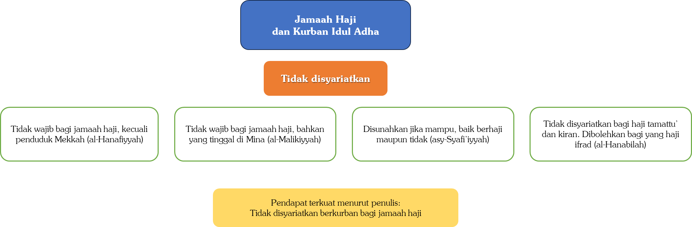

Peringatan:

Bagi jamaah haji yang mengikuti pendapat mazhab Syafi‘i dan tetap ingin melaksanakan ibadah kurban, maka apabila telah masuk hilal Zulhijah, ia tidak diperbolehkan mencukur rambut, mencabut bulu, maupun memotong kuku. Dari Ummu Salamah radhiyallâhu ‘anhâ bahwa Nabi ﷺ bersabda,

```arabic
((إِذَا رَأَيْتُمْ هِلَالَ ذِي الْحِجَّةِ وَأَرَادَ أَحَدُكُمْ أَنْ يُضَحِّيَ فَلْيُمْسِكْ عَنْ شَعْرِهِ وَأَظْفَارِهِ))
```

“Jika kalian melihat hilal bulan Zulhijah dan salah seorang dari kalian ingin menyembelih (kurban) maka hendaknya dia tidak memotong rambut dan kukunya.”[^38]

Dalam riwayat lain,

```arabic
((فَلَا يَمُسُّ مِنْ شَعْرِهِ وَبَشَرِهِ شَيْئًا))
```

“Janganlah ia menyentuh rambut dan bulu-bulunya (rambut badannya) sedikit pun.”[^39]

Dalam riwayat lain,

```arabic
((مَنْ كَانَ لَهُ ذِبْحٌ يَذْبَحُهُ فَإِذَا أَهَلَّ هِلَالُ ذِي الْحِجَّةِ فَلَا يَأْخُذَنَّ مِنْ شَعْرِهِ وَلَا مِنْ أَظْفَارِهِ شَيْئًا حَتَّى يُضَحِّيَ))
```

“Barang siapa yang memiliki hewan sembelihan yang akan ia sembelih maka jika telah nampak hilal bulan Zulhijah maka janganlah ia memotong rambutnya dan kukunya sedikit pun hingga ia menyembelih.”[^40]

Faidah-Faidah Hadis:

Pertama, apabila telah masuk malam tanggal 1 Zulhijah, yaitu dengan terlihatnya hilal—yang dimulai sejak terbenamnya matahari—maka sejak saat itu seseorang yang berniat berkurban tidak diperbolehkan memotong kuku, mencukur rambut, maupun mencabut bulu-bulu lainnya..

Kedua, larangan ini berlaku hingga ia menyembelih hewan kurbannya. Apabila seseorang berniat menyembelih lebih dari satu hewan, maka ia boleh memotong rambut, bulu, dan kukunya setelah menyembelih hewan yang pertama, meskipun masih ada hewan lain yang belum disembelih.

Ketiga, berdasarkan zahir hadis, larangan memotong kuku dan mencukur rambut ini menunjukkan hukum haram, bukan sekadar makruh, meskipun terdapat perbedaan pendapat di kalangan ulama. Pendapat yang lebih kuat menyatakan bahwa hukumnya haram, karena pada asalnya setiap larangan menunjukkan keharaman, sampai ada dalil yang memalingkannya kepada makruh.

Adapun seseorang yang sengaja memotong kuku atau mencukur rambut dan bulunya, maka hendaknya ia beristighfar dan bertobat kepada Allah ﷻ. Ia tidak diwajibkan membayar fidyah, dan perbuatannya tersebut tidak memengaruhi keutamaan ibadah kurbannya.

Keempat, larangan memotong kuku dan mencukur rambut ini hanya berlaku bagi orang yang berniat menyembelih hewan kurban. Larangan tersebut tidak berlaku bagi orang yang diwakilkan untuk membeli atau menyembelih hewan kurban, serta tidak berlaku bagi orang-orang yang turut disertakan dalam pahala kurban. Misalnya, seorang kepala keluarga menyembelih seekor kambing untuk dirinya dan keluarganya, maka yang dilarang mencukur rambut dan memotong kuku hanyalah dirinya, bukan istri dan anak-anaknya..

Kelima, apabila seseorang pada awal Zulhijah belum berniat berkurban, lalu beberapa hari kemudian ia berniat, maka sejak saat itulah ia dilarang memotong kuku serta mencukur rambut dan bulunya.

Keenam, apabila seseorang membutuhkan untuk memotong kuku—misalnya karena pecah dan menimbulkan rasa sakit—atau perlu mencukur rambut—misalnya untuk keperluan pengobatan seperti berbekam—maka hal tersebut diperbolehkan. Karena keadaan orang yang hendak berkurban tidak lebih mulia daripada orang yang sedang ihram. Jika orang yang ihram saja diperbolehkan mencukur rambut ketika ada kebutuhan, maka demikian pula orang yang hendak berkurban. Hanya saja, orang yang ihram wajib membayar fidyah, sedangkan orang yang berkurban tidak diwajibkan fidyah..

Ketujuh, tidak mengapa bagi orang yang hendak berkurban untuk mencuci rambutnya. Yang dilarang hanyalah mencukur rambut atau mencabut bulu-bulu tubuh.

Kedelapan, apabila seseorang ingin berkorban lalu bertekad untuk melaksanakan haji atau umrah, maka hendaknya dia tidak memotong kuku dan tidak mencukur bulu ketika hendak ihram. Karena memotong kuku dan mencukur bulu hukumnya adalah sunah, sehingga lebih didahulukan larangan mencukur bulu dan memotong kuku.

Namun, jika telah umrah dan hendak bertahalul, maka tidak mengapa dia mencukur rambutnya karena mencukur rambut—menurut pendapat yang lebih kuat—termasuk salah satu manasik umrah. Demikian pula seseorang yang telah melempar Jamrah Aqabah, maka boleh baginya untuk mencukur rambut–-meskipun hewan kurbannya belum disembelih.[^41]

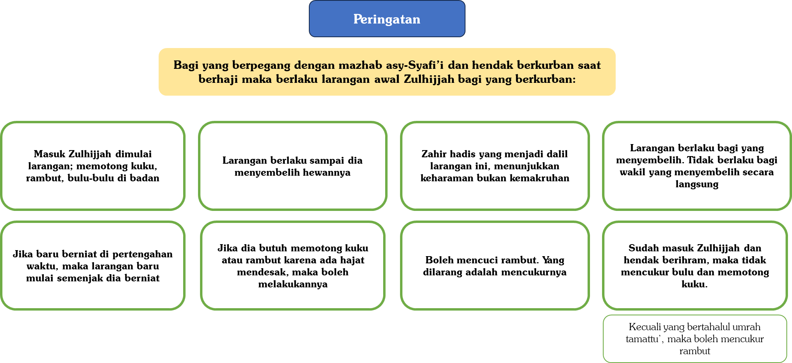

Pertanyaan 2: Bolehkah menyembelih hadyu Tamattu’ sebelum tanggal 10 Zulhijah?

Jawab:

Banyak jamaah haji dari tanah air Indonesia menyembelih hadyu Tamattu’ sebelum tanggal 10 Zulhijah. Apakah sembelihan mereka tersebut sah sebagai hadyu Tamattu’?

Mayoritas ulama (mazhab Hanafi, Maliki, dan Hanbali) memandang bahwa sembelihan tersebut tidak sah sebagai dam Tamattu’. Adapun mazhab Syafi’i memandang bahwa ia sah sebagai dam Tamattu’ tersebut jika disembelih setelah si haji menggunakan ihram untuk umrah Tamattu’.

Perlu dicatat bahwa kedua kelompok—yang membolehkan dan yang melarang—telah bersepakat bahwa:

- Udhiyah (hewan kurban) tidak sah jika disembelih sebelum hari an-Nahr, karena telah datang nas yang tegas dari hadis Nabi ﷺ yang menyatakan menyembelih udhiyah sebelum waktunya tidak sah.

- Dam pelanggaran (fidyah) maka boleh disembelih ketika melakukan pelanggaran meskipun sebelum hari an-Nahr.

- Hadyu (dam Tamattu’ dan Kiran) maka yang terbaik adalah disembelih pada hari an-Nahr.

Hadyu

- tathawwu’ (sunah) atau hadyu nazar (yang tidak ditentukan waktu menyembelih ketika bernazar) maka hukumnya sama dengan udhiyah, yaitu tidak boleh disembelih sebelum hari an-Nahr. Dan hal ini juga telah dinyatakan oleh para ulama Syafi’iyah.[^42]

Letak perbedaan: Hadyu yang merupakan dam wajib bagi orang yang melakukan haji Tamattu’ dan Kiran. Namun, apakah ia boleh disembelih sebelum hari an-Nahr?

Menurut jumhur ulama yaitu: Hanafiah,[^43] Malikiah,[^44] dan Hanabilah[^45] tidak boleh, jika dilakukan maka tidak sah.

Dalil mereka adalah:

---

## Pertama: Firman Allah ﷻ,

```arabic
ﵟوَلَا تَحۡلِقُواْ رُءُوسَكُمۡ حَتَّىٰ يَبۡلُغَ ٱلۡهَدۡيُ مَحِلَّهُۥۚﵞ
```

“Dan janganlah kamu mencukur kepalamu, sebelum kurban sampai di tempat penyembelihannya.” (QS. Al-Baqarah: 196)

Ayat ini menunjukkan bahwa kalau boleh menyembelih hadyu (dam Tamattu’/Kiran) sebelum hari an-Nahr, maka secara konsekuensi diperbolehkan pula mencukur kepala sebelum hari an-Nahr. Padahal ini tidak mungkin dilakukan bagi jamaah haji; karena seluruh jamaah haji (baik Tamattu’, Kiran, dan Ifrad) tidak mungkin bertahalul dari ihram haji mereka dengan mencukur rambut kecuali tanggal 10 Zulhijah (hari an-Nahr).

Hanya saja, beristidlal dengan ayat ini tidak kuat, karena ayat tersebut berkaitan dengan muhshar.

---

## Kedua: Firman Allah ﷻ,

```arabic
ﵟفَكُلُواْ مِنۡهَا وَأَطۡعِمُواْ ٱلۡبَآئِسَ ٱلۡفَقِيرَ 28 ثُمَّ لۡيَقۡضُواْ تَفَثَهُمۡﵞ
```

“Maka makanlah sebahagian daripada hewan-hewan ternak tersebut dan (sebahagian lagi) berikanlah untuk dimakan orang-orang yang sengsara dan fakir. Kemudian, hendaklah mereka menghilangkan kotoran yang ada pada badan mereka.” (QS. Al-Hajj: 28-29)

Qadha` at-Tafats (penghilangan kotoran, seperti mencukur dan memotong kuku) hanya dilakukan pada hari an-Nahr. Terlebih lagi penyebutan Qadha` at-Tafats datang setelah penyebutan menyembelih dan memakan dam tersebut.

---

## Ketiga: Hadis Nabi ﷺ. dari hafshah radhiyallâhu ‘anhâ, istri Nabi ﷺ bahwasanya dia berkata,

```arabic
يَا رَسُولَ اللَّهِ، مَا شَأْنُ النَّاسِ حَلُّوا بِعُمْرَةٍ وَلَمْ تَحْلِلْ أَنْتَ مِنْ عُمْرَتِكَ؟
```

“Wahai Rasulullah, kenapa orang-orang bertahalul (mencukur kepala mereka) dengan umrah sementara engkau tidak bertahalul dari umrahmu?”

Nabi ﷺ pun bersabda,

```arabic
((إِنِّي لَبَّدْتُ رَأْسِي وَقَلَّدْتُ هَدْيِي، فَلَا أَحِلُّ حَتَّى أَنْحَرَ))
```

“Aku telah mentalbid[^46] rambutku, dan aku telah membawa hewan dam-ku, maka aku tidak akan bertahalul hingga aku menyembelihnya.”[^47]

Hadis ini menunjukkan bahwa Nabi ﷺ mengaitkan tahalul dengan penyembelihan dam. Jika seandainya penyembelihan dam boleh dilakukan sebelum hari an-Nahr, maka Nabi ﷺ akan menyembelih dam, bertahalul dan mengubah haji Kiran beliau menjadi haji Tamattu’.

Terlebih lagi dalam riwayat disebutkan bahwa,

```arabic
فَأَمَرَ النَّبِيُّ صَلَّى اللَّهُ عَلَيْهِ وَسَلَّمَ أَصْحَابَهُ أَنْ يَجْعَلُوهَا عُمْرَةً، وَيَطُوفُوا، ثُمَّ يُقَصِّرُوا وَيَحِلُّوا، إِلَّا مَنْ كَانَ مَعَهُ الْهَدْيُ
```

“Nabi memerintahkan para sahabatnya untuk menjadikan haji mereka sebagai umrah dan agar mereka melakukan tawaf lalu mencukur pendek rambut mereka dan bertahalul, kecuali yang membawa hadyu/dam.”[^48]

Jika ada yang berkata, “Bisa jadi Nabi mengakhirkan penyembelihan hadyu karena beliau ingin melakukan yang afdal dan terbaik. Akan tetapi hal ini tidak menunjukkan larangan menyembelih sebelum hari an-Nahr.”

Maka kita katakan, “Justru ada perkara terbaik yang dicita-citakan oleh Nabi, yaitu bertahalul dan berhaji Tamattu’. Sampai-sampai Nabi berkata,

```arabic
((لَوِ اسْتَقْبَلْتُ مِنْ أَمْرِي مَا اسْتَدْبَرْتُ مَا أَهْدَيْتُ وَلَوْلَا أَنَّ مَعِيَ الْهَدْيَ لَأَحْلَلْتُ))
```

“Kalau seandainya aku sebelumnya mengetahui apa yang akhirnya terjadi aku tidak akan membawa hadyu, kalau bukan karena aku membawa hadyu maka aku akan bertahalul.”[^49]

---

## Keempat: Nabi ﷺ dan puluhan ribu para sahabat tiba di makkah tanggal 4 zulhijah. lalu seluruh hewan—baik unta maupun kambing—diikat hingga tiba hari tarwiyah, yaitu tanggal 8 zulhijah. tentunya puluhan ribu sahabat membutuhkan makanan, dan penyediaan makanan dengan jumlah tersebut selama empat hari bukanlah perkara yang mudah. jika seandainya memotong hewan dam diperbolehkan sebelum tanggal 10 zulhijah, tentu Nabi ﷺ akan membolehkan menyembelih hewan-hewan tersebut dengan dicicil mengingat adanya kebutuhan penyediaan makanan. akan tetapi, tidak ada seekor hewan pun yang disembelih sebelum hari an-nahr

---

## Kelima: Yang benar adalah hewan dam tamattu’/kiran bukanlah dam jubran, akan tetapi adalah dam nusuk sebagai bentuk bersyukur kepada Allah ﷻ. karena orang yang melakukan haji tamattu’ dan kiran bisa menggabungkan antara haji dan umrah dalam sekali safar. oleh karena itulah Nabi membawa dan menggiring hewan-hewan beliau dari kota madinah menuju makkah sebagai bentuk syukur. jika demikian, maka dam tamattu’ atau kiran lebih kuat untuk dikiaskan kepada udhiyah (hewan kurban) yang tidak boleh disembelih kecuali pada hari an-nahr, daripada dikiaskan dengan fidyah pelanggaran yang boleh disembelih sebelum hari an-nahr.[^50]

Sementara itu, pendapat kedua, yaitu ulama mazhab Syafi’iyah, mereka memandang bolehnya memotong kambing atau unta sebelum tanggal 10 Zulhijah jika si haji telah melakukan umrah Tamattu’.([^51])

Dalil mereka adalah:

---

## Pertama: Firman Allah ﷻ,

```arabic
ﵟفَمَن تَمَتَّعَ بِٱلۡعُمۡرَةِ إِلَى ٱلۡحَجِّ فَمَا ٱسۡتَيۡسَرَ مِنَ ٱلۡهَدۡيِۚﵞ
```

“Maka bagi siapa yang ingin mengerjakan umrah sebelum haji (di dalam bulan haji), (wajiblah ia menyembelih) kurban yang mudah didapat.” (QS. Al-Baqarah: 196)

Istidlal dengan ayat ini dari dua sisi:

Pertama, huruf Fâ pada firman Allah ﷻ, ﵟفَمَا ٱسۡتَيۡسَرَ مِنَ ٱلۡهَدۡيِۚﵞ menunjukkan tartîb (urutan) dan ta’qib (langsung). Oleh karena itu, setelah seseorang selesai umrah, dia boleh menyembelih hewannya, karena dia sudah terkena kewajiban untuk menyembelih dam Tamattu’.

Kedua, ayat ini menunjukkan bahwa hadyu bagi haji Tamattu’ adalah dam pelanggaran. Oleh karena itu, ia dapat dikiaskan dengan dam jabrân, yaitu dam yang berfungsi untuk menutupi pelanggaran. Sebagaimana dam jabrân boleh disembelih sebelum tanggal 10 Zulhijah, yaitu ketika pelanggaran terjadi, maka demikian pula hadyu Tamattu’ dapat disembelih sebelum hari an-Nahr.[^52]

Dalam ayat ini juga tidak disebutkan batasan waktu awal bolehnya memotong sembelihan dam Tamattu’, akan tetapi Allah menjadikan waktunya umum tanpa penentuan waktu tertentu.

---

## Kedua: Orang yang melakukan haji tamattu’ dan kiran, jika tidak mampu untuk mendapatkan sembelihan, maka dia menggantinya dengan puasa tiga hari di musim haji dan sepuluh hari ketika pulang ke tanah air. karena firman Allah ﷻ, “maka puasa tiga hari di haji” (qs. al-baqarah: 196)

Jika penggantinya—yaitu puasa 3 hari—boleh dikerjakan sebelum hari an-Nahr, maka demikian juga yang digantikan—yaitu menyembelih hadyu—boleh dikerjakan sebelum hari an-Nahr.([^53])

---

## Ketiga: Kemaslahatan-kemaslahatan yang bisa diraih jika disembelih sebelum hari an-nahr. di antaranya: Harga hewan sembelihan lebih murah; dan juga lebih bermanfaat bagi fukara karena daging tersebut bisa didistribusi dengan lebih mudah dibandingkan jika seluruh daging sembelihan bertumpuk pada hari an-nahr, sehingga bisa jadi terdapat daging-daging yang terbuang sia-sia

Pendapat yang lebih kuat:

Dari penjelasan di atas, maka sangat tampak bahwa permasalahan ini adalah permasalahan khilafiah yang sangat kuat di antara para ulama. Hal ini tidaklah terjadi melainkan karena memang tidak ada nas yang tegas dalam permasalahan ini:

- Tidak ada nas tegas dari perkataan Nabi ﷺ yang menyatakan bahwa waktu bolehnya menyembelih dam Tamattu’ atau Kiran adalah hari an-Nahr.

- Demikian juga tidak ada nas tegas dari perkataan Nabi ﷺ bahwa beliau melarang menyembelih dam Tamattu’ sebelum hari an-Nahr.

- Adanya kemungkinan bahwa Nabi ﷺ menyembelih pada hari an-Nahr karena beliau melakukan yang terbaik. Akan tetapi, hal itu bukan berarti tidak boleh menyembelihnya sebelum hari an-Nahr. Tentu Nabi ﷺ selalu melakukan yang terbaik dalam beribadah.

- Demikian juga bahwa fi’il (perbuatan) Nabi ﷺ tidak menunjukkan perintah atau larangan.

Meskipun memang tidak ada nas yang tegas dalam hal ini, akan tetapi terdapat indikator-indikator yang menguatkan pendapat jumhur akan pelarangan menyembelih dam Tamattu’ sebelum hari an-Nahr. Selain itu, ini adalah pendapat yang lebih hati-hati. Wallâhu a’lam bi-ash-shawâb.

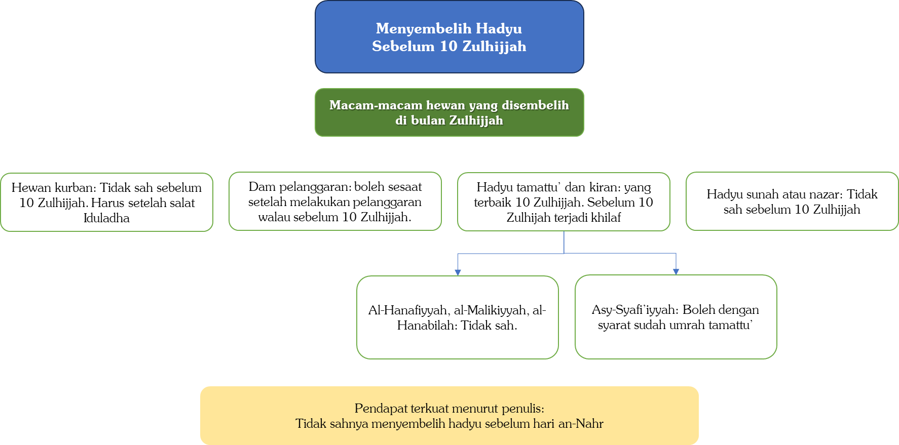

Catatan penutup:

---

## Pertama: Bagi jamaah haji indonesia yang memilih pendapat al-imam asy-syafi’i, meskipun boleh menyembelih dam sebelum hari an-nahr, akan tetapi hendaknya mereka mewakilkan penyembelihan tersebut kepada orang yang mereka ketahui keamanahannya, mengingat sering terjadinya penipuan dari para penjual kambing

Di antara kasus-kasus penipuan kambing yang pernah sampai kepada penulis—baik yang melaporkan adalah para jamaah haji atau dari para bekas penjual kambing yang telah bertobat—adalah sebagai berikut:

- Ternyata tidak ada kambing yang disembelih. Jamaah haji hanya disuruh menonton kambing-kambing yang dipotong, ternyata itu adalah kambing milik jamaah lain. Penulis pernah bertemu dengan seorang kepala kloter yang tertipu oleh penjual kambing Indonesia. Tatkala mereka menyaksikan penyembelihan kambing, mereka menyangka kambing-kambing tersebut milik mereka, ternyata milik jamaah dari negara lain??!!

- Atau kambing yang disembelih hanya sebagian, tidak semua. Biasanya jamaah diajak untuk menyaksikan pemotongan kambing-kambing mereka, dan pemotongannya menjelang salat Zuhur. Tatkala dipotong sebagian dari kambing-kambing tersebut, maka para jamaah dianjurkan untuk pulang agar tidak ketinggalan salat Zuhur di Masjidilharam.

- Para jamaah tidak bisa menyaksikan langsung pemotongan kambing mereka dengan alasan kesehatan.

- Daging kambing yang telah disembelih ternyata dijual kembali ke restoran-restoran.

- Kambing yang disembelih terlalu kecil, belum cukup umur.

Semua ini semakin menekankan agar para jamaah haji lebih hati-hati dalam menyerahkan uang dam. Serahkanlah hanya kepada orang yang amanah. Terkadang uang mereka diserahkan kepada kepala rombongan atau ketua kloter yang amanah, akan tetapi apakah ketua rombongan dan ketua kloter tersebut membelinya dari orang yang amanah juga?

---

## Kedua: Solusi dari ini semua adalah hendaknya mereka membeli dam ke bank al-bilad, atau bank ar-rajhi, atau kantor pos saudi yang cabang penjualannya berada di bagian belakang masjid nabawi atau di masjidilharam dekat hotel hilton

Meskipun harga seekor kambing tahun ini agak mahal—450 hingga 490 reyal, akan tetapi di antara keuntungan dari membeli lewat bank ini adalah:

- Bank-bank ini telah direkomendasi oleh pemerintah Arab Saudi karena keamanahannya.

- Penyembelihan hanya dilakukan setelah masuk hari an-Nahr

- Sebagian mahasiswa Universitas Islam Madinah bertugas untuk mengawasi kambing-kambing atau unta-unta yang hendak disembelih agar memenuhi persyaratan penyembelihan.

- Daging hewan-hewan tersebut tidak diperjualbelikan dan tidak juga terbuang secara cuma-cuma, akan tetapi dikirim ke negara-negara miskin yang membutuhkan daging-daging tersebut.

---

## Ketiga: Yang wajib bagi para jamaah haji tamattu’ hanyalah menyembelih seekor dam saja. tidak wajib bagi mereka untuk menyembelih kurban, apalagi membayar juga dam pelanggaran. karena sebagian para penjual kambing telah menipu para jamaah haji dengan perkataan mereka, “harus beli dam pelanggaran, karena bagaimanapun juga jamaah haji pasti melakukan pelanggaran.”

Adapun hewan kurban, maka hukumnya—menurut pendapat yang lebih kuat sebagaimana telah lalu penjelasannya—adalah tidak disyariatkan bagi jamaah haji.

# 4.10 — Kewanitaan

Pertanyaan 1: Bolehkah seorang wanita selama haji dan umrah menggunakan obat penunda haid?

Jawab:

Boleh menggunakan obat penunda haid selama tidak menimbulkan kemudaratan bagi wanita. Syekh Bin Baz berkata,

```arabic
لَا حَرَجَ أَنْ تَأْخُذَ الْمَرْأَةُ حُبُوْبَ مَنْعِ الْحَمْلِ لِتَمْنَعَ الدَّوْرَةَ الشَّهْرِيَّةَ أَيَّامَ رَمَضَانَ حَتَّى تَصُوْمَ مَعَ النَّاسِ، وَفِي أَيَّامِ الْحَجِّ حَتَّى تَطُوْفَ مَعَ النَّاسِ، وَلَا تَتَعَطَّلُ عَنْ أَعْمَالِ الْحَجِّ وَإِنْ وُجِدَ غَيْرُ الْحُبُوْبِ شَيْءٌ يَمْنَعُ مِنَ الدَّوْرَةِ فَلَا بَأْسَ إِذَا لَمْ يَكُنْ فِيْهِ مَحْذُوْرٌ شَرْعًا أَوْ مَضَرَّةٌ
```

“Tidak mengapa bagi seorang wanita untuk menggunakan obat tablet penunda haid selama bulan Ramadhan hingga ia bisa berpuasa bersama orang-orang lain. Demikian juga tatkala hari-hari haji agar ia bisa tawaf bersama jamaah yang lain dan tidak terhalangi dari menjalankan kegiatan haji. Dan jika selain obat tablet ada sesuatu yang lain yang bisa menunda haid maka tidak mengapa dikonsumsi, selama tidak ada perkara yang haram secara syar’i atau kemudaratan.”[^54]

Namun, sebagian wanita yang menggunakan obat penunda haid mengalami kemudaratan, seperti timbul sakit tertentu dan lainnya. Maka untuk wanita seperti ini hendaknya tidak menggunakan obat penunda haid.

Syekh al-‘Utsaimin berkata,

```arabic
اِسْتِعْمَالُ الْمَرْأَةِ حُبُوْبَ مَنْعِ الْحَيِضْ إِذَا لَمْ يَكُنْ عَلَيْهَا ضَرَرٌ مِنَ النَّاحِيَةِ الصِّحِّيَّةِ، فَإِنَّهُ لَا بَأْسَ بِهِ، بِشَرْطِ أَنْ يَأْذَنَ الزَّوْجُ بِذَلِكَ، وَلَكِنْ حَسَبَ مَا عَلِمْتُهُ أَنَّ هَذِهِ الْحُبُوْبَ تَضُرُّ الْمَرْأَةَ، وَمِنَ الْمَعْلُوْمِ أَنَّ خُرُوْجَ دَمِ الْحَيِضِ خُرُوْجٌ طَبِيْعِيٌّ، وَالشَّيْءُ الطَّبِيْعِيُّ إِذَا مُنِعَ فِي وَقْتِهِ، فَإِنَّهُ لَا بُدَّ أَنْ يَحْصُلَ مِنْ مَنْعِهِ ضَرَرٌ عَلَى الْجِسْمِ، وَكَذَلِكَ أَيْضاً مِنَ الْمَحْذُوْرِ فِي هَذِهِ الْحُبُوْبِ أَنَّهَا تَخْلِطُ عَلَى الْمَرْأَةِ عَادَتَهَا، فَتَخْتَلِفُ عَلَيْهَا، وَحِيْنَئِذٍ تَبْقَى فِي قَلَقٍ وَشَكٍّ مِنْ صَلَاتِهَا وَمِنْ مُبَاشَرَةِ زَوْجِهَا وَغَيْرِ ذَلِكَ، لِهَذَا أَن لَا أَقُوْلُ إِنَّهَا حَرَامٌ وَلَكِنِّي لَا أُحِبُّ لِلْمَرْأَةِ أَنْ تَسْتَعْمِلَهَا خَوْفاً مِنَ الضَّرَرِ عَلَيْهَا
```

“Tidak mengapa bagi seorang wanita untuk mengonsumsi obat penunda haid selama tidak menimbulkan kemudaratan dari sisi kesehatan, dengan syarat diizinkan oleh suaminya. Akan tetapi berdasarkan apa yang aku ketahui, bahwasanya obat-obat ini memberi kemudaratan bagi wanita. Dan sebagaimana diketahui bahwasanya keluarnya darah haid adalah keluarnya darah secara tabiat/alami. Dan sesuatu yang secara tabiat/alami jika dihalangi pada waktunya maka mau tidak mau akan menimbulkan kemudaratan pada tubuh. Demikian juga di antara hal yang terlarang pada obat-obat ini adalah menyebabkan kebiasaan haidnya menjadi tidak teratur, sehingga akhirnya ia pun dalam kondisi gelisah dan ragu pada salatnya (apakah sah atau tidak), dan dalam hal berhubungan intim dengan suaminya dan perkara-perkara yang lain. Karenanya aku tidak mengatakan bahwa mengonsumsi obat-obat ini adalah haram, akan tetapi aku tidak suka wanita mengonsumsinya karena kawatir kemudaratan menimpanya.”[^55]

Peringatan:

Sebagian wanita merasa sedih dan bersalah di hari-hari haji, sehingga di Arafah kurang afdal. Sesungguhnya Aisyah radhiyallâhu 'anhâ tatkala awal tiba di Makkah dalam kondisi haid, namun hal ini tidaklah mengurangi nilai haji yang lakukan. Nabi Muhammad ﷺ berkata kepadanya ketika Aisyah radhiyallâhu 'anhâ bersedih,

```arabic
((فَإِنَّ ذَلِكِ شَيْءٌ كَتَبَهُ اللَّهُ عَلَى بَنَاتِ آدَمَ، فَافْعَلِي مَا يَفْعَلُ الحَاجُّ، غَيْرَ أَنْ لَا تَطُوفِي بِالْبَيْتِ حَتَّى تَطْهُرِي))
```

“Sesungguhnya ini adalah perkara yang telah Allah tetapkan/kodratkan bagi putri-putri Adam, maka lakukanlah apa yang dilakukan oleh jamaah haji, hanya saja janganlah engkau tawaf di Ka’bah hingga engkau suci.”[^56]

Jadi, wanita tidak harus mengonsumsi obat penunda haid. Jika dia haid di tengah pelaksanaan haji, maka hal itu tidak mengapa, dan tidak mempengaruhi kemabruran hajinya.

Pertanyaan 2: Apakah bercak-bercak darah yang keluar setelah mengonsumsi obat penunda haid merupakan darah haid?

Jawab:

Pertama, untuk mengetahui apakah bercak tersebut merupakan darah haid atau bukan, maka penentuannya harus dikembalikan kepada ahlinya, yaitu para dokter.

Syekh al-‘Utsaimin rahimahullâh pernah ditanya, “Aku seorang ibu dari seorang anak yang berumur empat bulan, dan aku menggunakan obat penghalang hamil, namun terkadang keluar darah sedikit yang berwarna merah setelah mandi janabah dari jimak, dan ini terjadi tatkala bulan Ramadan. Aku melihat darah keluar setelah makan sahur dan sebelum salat subuh, lalu aku menunggu hingga sekitar 15 menit sebelum terbit fajar kemudian aku pun mandi lagi. Setelah itu, aku salat subuh lalu tidur. Kemudian hal itu muncul lagi di siang hari. Maka aku pun berwudu setiap kali salat. Dan itu berlangsung selama satu setengah hari, lalu aku pun suci dengan sempurna (tidak keluar darah lagi), kemudian aku mandi lagi untuk ketiga kalinya. Maka aku ingin bertanya apakah salatku sah dan apakah puasaku sah?”

Syekh al-‘Utsaimin menjawab:

```arabic
فَلْتَسْأَلِ السَّائِلَةُ الأَطِبَّةَ هَلْ يُعْتَبَرُ هَذَا الدَّمُ حَيْضًا أَمْ هُوَ دَمُ عِرْقٍ؟ إِنْ كَانَ دَمَ عِرْقٍ فَإِنَّهُ لَا يَمْنَعُهَا مِنَ الصِّيَامِ فَصِيَامُهَا صَحِيْحٌ وَلَا يَمْنَعُهَا مِنَ الصَّلَاةِ فَيَجِبُ عَلَيْهَا أَنْ تُصَلِّيَ، وَأَمَّا إِنْ كَانَ مِنَ الْحَيْضِ تَحَرَّكَ بِسَبَبِ هَذِهِ الْحُبُوْبِ فَإِنَّ صِيَامَهَا لَا يَصِحُّ وَلَا تَلْزَمُهَا الصَّلَاةُ
```

“Hendaknya sang penanya bertanya kepada para dokter, apakah darah tersebut merupakan darah haid ataukah darah dari urat? Jika itu merupakan darah dari urat maka darah tersebut tidaklah menghalanginya dari puasa, maka puasanya sah dan tidak juga menghalanginya dari salat maka wajib baginya untuk salat. Adapun jika darah tersebut adalah darah haid keluar karena obat tersebut maka puasanya tidak sah dan ia tidak wajib salat.”[^57]

Secara umum, menurut ilmu kedokteran jika obat penunda haid dikonsumsi tepat dari tiga sisi: (1) waktu awal meminum (2) dosis yang tepat, dan (3) teratur dalam meminumnya, maka tidak akan keluar darah haid. Jika ada bercak yang muncul, maka secara ilmu kedokteran hal itu bukanlah darah haid, melainkan darah dari sisa-sisa sel yang rusak. Maka darah tersebut dihukumi dengan darah istihadah.

Akan tetapi jika ketiga sisi tersebut tidak diperhatikan, maka bisa jadi darah haid tetap keluar meskipun telah mengonsumsi obat penunda haid

Kedua, hukum asal wanita adalah dalam kondisi suci. Jika darah yang keluar darinya berupa bercak-bercak, dan dia ragu apakah itu darah haid atau bukan, maka secara hukum asal darah itu bukanlah darah haid; karena hukum asal wanita adalah dalam kondisi suci. Dan kaidah menyatakan,

```arabic
الْيَقِيْنُ لَا يَزُوْلُ بِالشَّكِّ
```

“Keyakinan tidak bisa dihilangkan dengan keraguan.”

Dan darah yang keluar ini disebut dengan darah rusak atau darah istihadah.

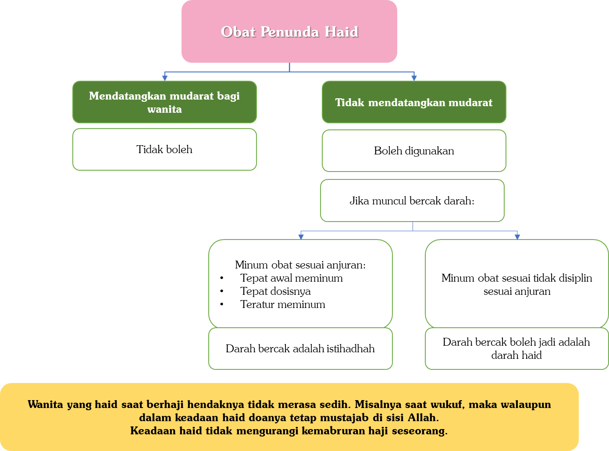

# 4.10.1 — Haid/menstruasi[^58]

# 4.10.1.1 — Definisi Haid

Haid atau menstruasi adalah keadaan yang siklik (berulang) berupa luruhnya/hancurnya lapisan endometrium (selaput lendir rahim) dalam rahim yang dipicu oleh penurunan mendadak (withdrawal) hormon Progesteron dan Estrogen.1 Lapisan endometrium yang luruh tersebut keluar melalui serviks uteri (mulut rahim) dan berlanjut ke vagina.1,2

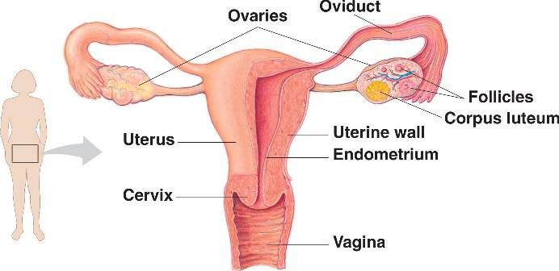

Gambar 1. Anatomi organ kandungan wanita. Organ terkait haid yaitu Ovarium (Ovaries) dan Endometrium dalam rahim wanita

Terjadinya haid merupakan proses yang sangat kompleks melibatkan banyak organ tubuh yaitu: Hipotalamus, Hipofisis, Ovarium dan Endometrium di dalam rahim. Namun, dapat dipahami bahwa pemicu terjadinya keluar darah haid adalah pada penurunan mendadak (withdrawal) hormon Progesteron dan Estrogen dalam tubuh wanita. Kedua hormon ini dihasilkan oleh ovarium (indung telur).1,2

# 4.10.1.2 — Proses Fisiologi Pada Haid

Berikut ini gambaran skematis terjadinya haid/menstruasi secara normal.

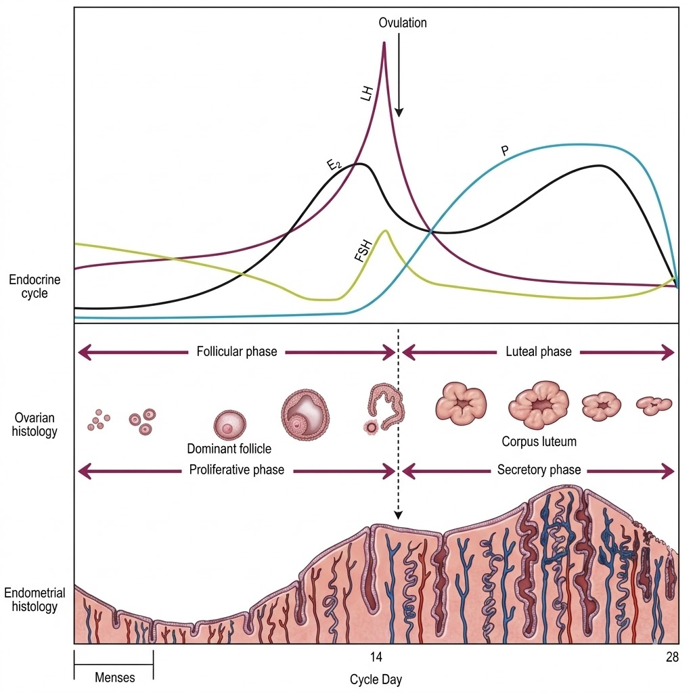

Gambar 2. Skematik Siklus Haid/Menstruasi. Haid terjadi akibat penurunan mendadak Hormon Sex Steroid (Progesteron dan Estrogen) yang dihasilkan oleh ovarium (tanda panah merah). Dalam gambar tersebut, grafik P: progesteron, E2: Estradiol (Estrogen)

Kita coba jelaskan secara ringkas mengenai proses yang terjadi di dalam tubuh dari satu haid/menstruasi hingga haid berikutnya. Dari gambar 2 di atas, ada 2 organ utama yang mengalami perubahan selama siklus haid wanita, yaitu Ovarium (indung telur) dan Endometrium (dalam rahim).

1. Perubahan yang terjadi pada Ovarium (indung telur).

Pada hari awal keluar darah haid/menstruasi, terjadi pemilihan/rekrutmen folikel (calon telur) yang akan ditumbuhkan/dimatangkan oleh tubuh agar saat masa subur siap untuk dibuahi oleh sperma. Fase ini kita sebut dengan fase folikuler. Setelah folikel matang (menjadi folikel dominan), lalu akan terjadi ovulasi (pelepasan sel telur/oosit) dari folikel menuju tuba falopi dan rahim dengan harapan mudah untuk dibuahi oleh sperma suami.3

Sisa folikel yang ditinggalkan oleh sel telur/oosit disebut korpus luteum. Sehingga fase ini disebut Fase Luteal. Korpus luteum ini penghasil utama hormon Progesteron dalam tubuh wanita. Korpus luteum ini akan rusak/mati secara alami dalam waktu sekitar 9-11 hari setelah ovulasi dengan mekanisme apoptosis.2 Setelah 2 pekan maka sel-sel dalam korpus luteum akan mati dan produksi hormon Progesteron akan terhenti sehingga kadarnya dalam darah turun mendadak (withdrawal).

Berbeda halnya ketika terjadi pembuahan oleh sperma dan terjadi kehamilan, maka hasil kehamilan dalam rahim akan menghasilkan hormon HCG (human chorionic gonadotropin) yang akan menyelamatkan korpus luterum dari kerusakan alami. Dengan demikian korpus luteum tetap menghasilkan Progesteron dan Estrogen, sehingga endometerium tidak luruh/ hancur dan tidak terjadi haid, sehingga kehamilan dapat berlanjut dengan baik.3

1. Perubahan pada endometrium dalam rahim.

Setelah menstruasi selesai, maka endometrium dalam rahim akan kembali tumbuh akibat rangsangan hormon estrogen. Fase pertumbuhan ini disebut fase proliferasi (Proliferative phase). Lalu setelah terjadi ovulasi, maka endometrium akan mempersiapkan diri untuk menampung hasil pembuahan dengan meningkatkan sekresi berbagai glikoprotein. Fase ini disebut Fase Sekresi (Secretory phase). Fase Sekresi ini dipengaruhi oleh hormon progesteron yang dihasilkan oleh korpus luteum. Ketika korpus luteum regresi (tidak berfungsi lagi), maka produksi hormon progesteron akan berhenti. Rendahnya kadar progesteron dalam darah, akan menghentikan proses sekresi dan terjadilah peluruhan endometrium yang terbentuk sehingga dimulailah menstruasi yang baru.1.3

# 4.10.1.4 — Mekanisme Kerja Obat Penunda Haid

Ada berbagai macam obat penunda haid. Setiap obat memiliki mekanisme tersendiri yang terjadi pada tubuh. Untuk mempermudah pembahasan, maka akan dijelaskan mekanisme kerja obat-obatan penunda haid yang sangat sering/umum dikonsumsi saat Haji dan Umrah.4

1. Golongan Progestin only pills.

Obat golongan ini paling banyak dipakai oleh Jamaah Haji dan Umrah. Beberapa merek dagang yang terkenal di antaranya Primolut N, Luthenyl dan lainnya. Cara kerja obat ini adalah dengan menggantikan/menempati reseptor progesteron alami pada endometrium.

Seperti yang dijelaskan sebelumnya bahwa Progesteron alami tubuh akan turun mendadak (withdrawal) akibat degenerasi korpus luteum di ovarium. Dengan diberikan obat ini dengan dosis dan cara yang tepat, maka seolah-olah tidak terjadi penurunan kerja hormon progesteron pada endometrium. Sehingga endometrium terus-menerus menerima signal dari hormon progesteron untuk melanjutkan Fase Sekresi. Dengan demikian tidak terjadi peluruhan dari endometrium, sehingga tidak terjadi haid.4

1. Pil Kontrasepsi Kombinasi (Combine Oral Contraceptive).

Obat ini adalah Pil Keluarga Berencana (KB) atau Pil Penunda kehamilan. Obat ini mengandung dua hormon sekaligus yaitu estrogen dan pregesteron. Merek dagang yang mudah ditemukan seperti Microgynon, Yasmin, Yaz, Diane dan lainnya.

Dengan diberikan obat pil KB ini dengan dosis dan cara pemakaian yang teratur, termasuk tidak meminum obat yang plasebo, maka tidak akan terjadi penurunan kadar estrogen dan progesteron dalam darah. Dengan demikian tidak terjadi peluruhan endometrium dan tidak terjadi menstruasi/haid.4

1. Syarat penggunaan pil penunda haid.

Untuk mencegah terjadinya proses penurunan (withdrawal) kadar progesteron dan estrogen yang memulai luruhnya endometrium (proses awal haid) dengan memakai obat-obatan, maka ada beberapa hal yang harus diperhatikan sebagai berikut:

1. Waktu memulai minum obat harus tepat.

Jika memakai golongan progestin only, seperti Primolut N atau Luthenyl tablet, maka harus dimulai saat fase midluthelal, sekitar 7-10 hari dari prediksi haid selanjutnya.

Jika memakai pil KB kombinasi (COC pills) maka harus dimulai saat fase proliferasi awal yaitu haid sekitar hari 1-3 dari hari keluarnya darah haid..

1. Besar dosis harus sesuai.

Setiap obat yang dipakai dosisnya harus disesuaikan dengan kondisi pasien. Di antara parameter yang menentukan dosis adalah berat badan, luas permukaan tubuh, pemakaian obat-obatan yang saling berinteraksi atau obat pengencer darah, menderita penyakit tertentu (seperti gangguan fungi hati dan liver). Sebaiknya sebelum menggunakan obat, harus didiskusikan dengan dokter.

1. Keteraturan jadwal minum harus diatur ketat.

Keteraturan jadwal minum obat sangat mempengaruhi kegagalan dalam penundaan haid, karena masing-masing obat memiliki waktu paruh berbeda-beda sehingga lama jangka waktu obat bekerja juga terbatas. Jika hormon progestin yang diminum terlambat dari waktunya, maka akan terjadi penurunan kadarnya di dalam darah, sehingga terjadi keluar bercak darah akibat withdrawal bleeding (mekanisme haid).4

1. Kondisi kesehatan tertentu.

Ada beberapa kondisi medis yang bisa menyebabkan obat tidak bekerja optimal, beberapa di antaranya adalah obesitas, penyakit gangguan fungsi liver dan ginjal, alergi terhadap obat yang diberikan, atau interaksi dengan obat lain yang dikonsumsi.

# 4.10.1.4 — Mekanisme Terjadi Bercak Darah/bercak Hitam yang Keluar Setelah Minum Obat Penunda Haid

Perdarahan yang terjadi pada haid/menstruasi secara mekanisme terjadinya disebut withdrawal bleeding, maksudnya adalah luruhnya endometrium lalu keluar menjadi darah haid melalui vagina, yang terjadi akibat penurunan mendadak Progesteron dan Estrogen dalam tubuh wanita.

Jika seorang wanita minum pil penunda haid dengan memenuhi syarat-syarat di atas, agar tidak terjadi withdrawal (penurunan) hormon progesteron, maka secara mekanisme keluarnya darah dari vagina diduga bukan akibat penurunan hormon tapi merupakan suatu breakthrough bleeding.

Hal ini masih merupakan dugaan kuat, karena jika ingin mendapatkan data paling objektif adalah dengan mengukur kadar obat dan hormon progesteron dalam darah pasien.

Breakthrough bleeding adalah keluarnya darah dari rahim (uterus) dengan tidak terjadwal, umumnya pada pengguna pil KB atau pil progesteron. Mekanisme keluarnya darah disebabkan kerapuhan (fragilitas) kapiler pada lapisan endometrium. Mekanisme lain yang diduga adalah perubahan faktor angiogenik lokal, perfusi dan integritas struktur pada endometrium.5

Breakthrough bleeding ini cukup sering terjadi, sekitar 20% pada pengguna pil KB kombinasi. Sedangkan pada pengguna pil progestin only sekitar 10-15%.5 Sehingga perlu dilakukan edukasi kepada jamaah Haji dan Umrah agar bisa memahami kondisi efek samping dalam pemakaian obat-obatan ini.

Kesimpulan:

Haid/Menstruasi terjadi keluar darah dari rahim dengan mekanisme withdrawal bleeding. Sedangkan pada pasien pengguna pil penunda haid atau pil kontrasepsi mekanisme yang terjadi berbeda yaitu Breakthough bleeding. Namun untuk menegakkan ini bukanlah suatu withdrawal bleeding perlu dievaluasi secara teliti setiap jamaah tentang kapan memulai minum obat, dosis, keteraturan dan kondisi-kondisi medis yang terkait. Dengan demikian setiap jamaah walaupun sama-sama mengonsumsi obat penunda haid, bisa saja terjadi perbedaan dalam evaluasi mekanisme perdarahan yang terjadi.

Makalah ini hanya memaparkan perbedaan mekanisme perdarahan yang terjadi pada kedua kondisi di atas, dengan tujuan dapat sedikit membantu ustaz atau pembimbing ibadah dalam memberikan fatwa/arahan terhadap kondisi jamaah.[^59]

Pertanyaan 3: Apakah wanita yang haid dan tiba di Madinah boleh menunda ihramnya hingga suci di Makkah?

Jawab:

Ada beberapa hal penting yang perlu dipahami dalam permasalahan ini.

Wanita yang haid tetap wajib berihram dari mikatnya, yaitu di Dzul Hulaifah, sebagaimana jamaah yang lain.[^60] Jika ia tiba di Makkah, ia tidak boleh melakukan tawaf hingga ia suci. Selama menunggu masa suci, ia tetap dalam kondisi berihram, sehingga seluruh larangan ihram masih berlaku baginya. Hendaknya ia benar-benar memperhatikan hal ini.

Jika telah suci, ia mandi besar lalu langsung tawaf di Ka’bah, tanpa perlu pergi dulu ke at-Tan’im, karena sejak di Dzul Hulaifah ia sudah dalam keadaan berihram.

Adapun jika ia menunda ihramnya hingga sampai di Makkah, berarti ia telah melewati mikat tanpa ihram. Ini adalah pelanggaran, dan ia wajib membayar dam.

Pertanyaan 4: Bolehkah wanita yang sedang ihram membuka jilbabnya di hadapan sesama wanita?

Jawab:

Menutup aurat bukanlah syarat ihram. Karenanya, seseorang yang berihram boleh mandi, dan di dalam kamar mandi ia boleh membuka auratnya sebagaimana biasa.

Demikian pula seorang wanita yang sedang berihram, jika ia berada di kamar bersama sesama wanita, bersama mahramnya, atau bersama suaminya, maka boleh baginya memperlihatkan rambutnya di hadapan mereka.

Namun ketika tawaf, ia wajib menutup auratnya, karena menutup aurat adalah syarat sah tawaf.

Pertanyaan 5: Jika sebagian aurat tersingkap tanpa sengaja ketika tawaf, apakah tawafnya batal?

Jawab:

Menutup aurat memang merupakan syarat sah tawaf. Namun jika aurat seseorang tersingkap tanpa sengaja ketika tawaf, hal itu dimaafkan dengan syarat ia segera menutupnya saat itu juga. An-Nawawi rahimahullâh berkata,

```arabic
سَتْرُ الْعَوْرَةِ شَرْطٌ لِصِحَّةِ الطَّوَافِ... فَمَتَى انْكَشَفَ جُزْءٌ مِنْ عَوْرَةِ أَحَدِهِمَا بِتَفْرِيطِهِ بَطَلَ... وَإِنِ انْكَشَفَ بِلَا تَفْرِيطٍ وَسَتَرَ فِي الْحَالِ لَمْ يَبْطُلْ طَوَافُهُ كَمَا لَا تَبْطُلُ صَلَاتُهُ
```

“Menutup aurat adalah syarat sah tawaf... Kapan saja sebagian aurat seseorang, baik laki-laki maupun perempuan tersingkap karena kelalaiannya, maka tawafnya batal. Namun jika tersingkap bukan karena kelalaiannya, artinya ia sudah berusaha menutupnya, lalu ia segera menutupnya saat itu juga, maka tawafnya tidak batal, sebagaimana salatnya pun tidak batal jika terjadi hal yang sama.”[^61]

Pertanyaan 6: Bolehkah Wanita Berwudu dengan Hanya Mengusap di Atas Kerudungnya Tanpa Melepasnya?

Jawab:

Boleh bagi seorang wanita yang memakai jilbab untuk hanya mengusap di atas jilbabnya ketika berwudu, tanpa perlu memasukkan tangan ke bawah jilbab, apalagi sampai membukanya.

Perincian:

Para ulama berselisih tentang kebolehan wanita mengusap di atas jilbabnya tanpa membukanya. Jumhur ulama membolehkannya hanya dalam kondisi darurat. Adapun mazhab Hanbali membolehkannya meskipun bukan dalam kondisi darurat, dengan syarat memang ada kesulitan untuk membuka jilbab tersebut. Dan pada umumnya jilbab-jilbab yang dipakai sekarang memang tidak mudah dibuka, tidak seperti songkok yang cukup diangkat untuk dilepaskan.[^62]

Pendapat inilah yang lebih kuat, berdasarkan hadis Bilal radhiyallâhu ‘anhu,

```arabic
أَنَّ رَسُولَ اللهِ صَلَّى اللهُ عَلَيْهِ وَسَلَّمَ مَسَحَ عَلَى الْخُفَّيْنِ وَالْخِمَارِ
```

“Sesungguhnya Rasulullah ﷺ ketika berwudu mengusap kedua khuf dan mengusap khimar (penutup kepala).”[^63]

An-Nawawi berkata, “Yang dimaksud dengan khimar di sini adalah ‘imâmah (sorban), karena sorban menutup kepala.”[^64]

Dan telah datang pula hadis-hadis lain tentang kebolehan mengusap sorban sebagai pengganti mengusap kepala ketika berwudu. [^65]

Jika laki-laki boleh mengusap sorban, maka wanita pun boleh mengusap jilbabnya, dengan beberapa alasan berikut.

Pertama, hukum asal adalah kesetaraan antara laki-laki dan perempuan dalam hukum syariat. Sebagaimana laki-laki boleh mengusap penutup kepalanya (sorban), maka demikian pula perempuan boleh mengusap penutup kepalanya (jilbab) ketika berwudu.

Kedua, ini sesuai dengan keumuman lafal hadis Bilal, yaitu kata “al-Khimar” yang mencakup seluruh penutup kepala, karena khimar dalam bahasa Arab berarti penutup kepala.

Ketiga, jika laki-laki dibolehkan mengusap sorban karena ada kemudahan dan untuk menghilangkan kesulitan membuka sorban,[^66] maka wanita lebih layak mendapat keringanan ini, dilihat dari beberapa sisi: kebutuhan wanita terhadap penutup kepala lebih besar daripada kebutuhan laki-laki terhadap sorban, karena jilbab menutup aurat; jilbab wanita umumnya lebih menutup kepala dibanding sorban laki-laki; dan melepas serta memasang kembali jilbab jelas lebih sulit daripada melepas dan memasang sorban.

Keempat, kebolehan ini semakin kuat jika ada sebab-sebab lain yang menyertainya, seperti cuaca dingin, kekhawatiran rambutnya tersingkap, atau sebab-sebab lainnya.

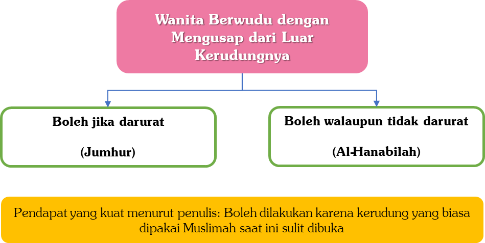

# 4.11 — Salat

Pertanyaan 1: Bolehkah jamaah haji dan umrah mengerjakan salat sunah rawatib?

Jawab:

Kondisi seorang musafir ketika salat ada dua keadaan.

Keadaan pertama: ia mengerjakan salat qasar, dan qasar memang yang disunahkan bagi musafir. Dalam kondisi ini, yang disyariatkan adalah meninggalkan salat sunah rawatib, kecuali dua rakaat sebelum subuh. Adapun salat witir, salat sunah mutlak, salat-salat sunah yang memiliki sebab seperti salat sunah wudu, dua rakaat setelah tawaf, salat duha, dan salat tahajud, semuanya tetap disyariatkan.[^67]

Keadaan kedua: ia salat bermakmum kepada imam yang salatnya sempurna (empat rakaat), sebagaimana kondisi para jamaah haji dan umrah yang biasanya salat berjamaah di Masjid Nabawi dan Masjidilharam. Dalam kondisi ini, yang lebih utama adalah tetap mengerjakan salat sunah rawatib, karena salatnya telah mengikuti hukum orang yang mukim.

Syekh Bin Baz rahimahullâh pernah ditanya,

```arabic
هَلْ عَلَى الْمُسَافِرِ سُنَّةُ الرَّاتِبَةِ إِذَا صَلَّى مَعَ الَّذِينَ يُتِمُّونَ؟
```

“Apakah seorang musafir hendaknya mengerjakan salat sunah rawatib jika ia salat bersama orang-orang yang salatnya sempurna?”

Maka beliau menjawab,

```arabic
إِذَا صَلَّى مَعَ الْمُتِمِّينَ فَالأَفْضَلُ أَنْ يَأْتِيَ بِالرَّاتِبَةِ لِأَنَّهُ صَارَ لَهُ حُكْمُ الْمُقِيمِينَ فَيُصَلِّي الرَّاتِبَةَ، وَإِنْ تَرَكَ فَلَا بَأْسَ، لَكِنْ إِذَا أَتَمَّ فَالْأَفْضَلُ أَنْ يَأْتِيَ بِالرَّاتِبَةِ. وَإِنْ قَصَرَ فَالأَفْضَلُ تَرْكُ الرَّاتِبَةِ لِلظُّهْرِ وَالْعِشَاءِ. أَمَّا الْفَجْرُ فَإِنَّ سُنَّتَهَا ثَابِتَةٌ فِي السَّفَرِ وَالْحَضَرِ. وَهَكَذَا الْوِتْرُ، الْمُسَافِرُ يُوتِرُ وَيُصَلِّي سُنَّةَ الْفَجْرِ. أَمَّا سُنَّةُ الْمَغْرِبِ وَسُنَّةُ الظُّهْرِ وَسُنَّةُ الْعِشَاءِ فَالأَفْضَلُ تَرْكُهَا لِلْمُسَافِرِينَ إِذَا قَصَرُوا
```

“Jika ia salat bersama orang-orang yang salatnya sempurna, maka yang lebih utama adalah ia mengerjakan salat sunah rawatib, karena ia telah mengikuti hukum orang yang mukim. Jika ia meninggalkannya pun tidak mengapa. Namun jika salatnya sempurna, yang lebih utama adalah mengerjakan rawatib. Jika salatnya qasar, yang lebih utama adalah meninggalkan rawatib Zuhur dan Isya. Adapun dua rakaat sebelum subuh, ia tetap dikerjakan baik dalam safar maupun tidak. Demikian pula witir, musafir tetap mengerjakan witir dan dua rakaat sebelum subuh. Adapun rawatib magrib, Zuhur, dan Isya, yang lebih utama bagi musafir adalah meninggalkannya jika mereka salat qasar.”[^68]

Pertanyaan 2: Apakah ada Salat Arba’în di masjid nabawi?

Jawab:

Istilah “Salat Arba’în” sudah sangat akrab di telinga jamaah haji Indonesia. Para jamaah yang hanya diberi kesempatan delapan hari di Kota Madinah benar-benar bersungguh-sungguh untuk bisa salat empat puluh waktu di Masjid Nabawi tanpa terlewat satu pun. Ini tentu bukan perkara ringan mengingat waktu yang tersedia hanya delapan hari.

Dari situlah muncul berbagai fenomena yang kerap kita saksikan. Ada jamaah yang berwajah murung penuh kesedihan karena terluput satu waktu salat akibat uzur tertentu, sehingga bilangan empat puluh waktu pun tidak tercapai. Ada yang merasa dosa-dosanya di Tanah Air menjadi penghalang untuk menyempurnakan Salat Arba’în. Ada pula yang berlari-lari dari hotel ke masjid demi mengejar Takbiratul ihram, hingga masuk ke saf dalam keadaan ngos-ngosan kelelahan, dan tidak jarang pula tetap ketinggalan. Bahkan ada jamaah yang sampai menerima fatwa tidak bertanggung jawab yang membolehkan tayamum di Masjid Nabawi demi tidak melewatkan Salat Arba’în. Sebaliknya, ada pula jamaah yang setelah mencapai empat puluh waktu tidak mau lagi ke masjid, padahal masih bisa meraih bonus waktu ke-41 dan ke-42.

Lalu, apa sebenarnya landasan para jamaah dalam berusaha keras menyempurnakan “Salat Arba’în” ini?

Imam Ahmad bin Hanbal dalam Musnadnya No. 12583 membawakan hadis berikut,

```arabic
عَنْ أَنَسِ بْنِ مَالِكٍ عَنِ النَّبِيِّ صَلَّى اللهُ عَلَيْهِ وَسَلَّمَ أَنَّهُ قَالَ: مَنْ صَلَّى فِي مَسْجِدِي أَرْبَعِينَ صَلَاةً لَا يَفُوتُهُ صَلَاةٌ كُتِبَتْ لَهُ بَرَاءَةٌ مِنَ النَّارِ وَنَجَاةٌ مِنَ الْعَذَابِ وَبَرِئَ مِنَ النِّفَاقِ
```

“Dari Anas bin Malik radhiyallâhu ‘anhu, dari Nabi ﷺ, bahwa beliau bersabda, ‘Barang siapa yang salat di masjidku empat puluh kali salat tanpa terlewat satu pun, maka dicatat baginya kebebasan dari neraka, keselamatan dari azab, dan terbebaskan dari kemunafikan.’”

Sanad Imam Ahmad adalah: al-Hakam bin Musa, dari Abdurrahman bin Abi ar-Rijal, dari Nubaith bin Umar, dari Anas bin Malik, dari Nabi ﷺ. Hadis ini juga diriwayatkan oleh ath-Thabrani dalam al-Mu’jam al-Ausath dengan jalur yang sama. Setelah itu Ath-Thabrani berkata,

```arabic
لَمْ يَرْوِ هَذَا الْحَدِيثَ عَنْ أَنَسٍ إِلَّا نُبَيْطُ بْنُ عُمَرَ، تَفَرَّدَ بِهِ عَبْدُ الرَّحْمَنِ بْنُ أَبِي الرِّجَالِ
```

“Tidak ada yang meriwayatkan hadis ini dari Anas kecuali Nubaith bin Umar, dan Abdurrahman bin Abi ar-Rijal bersendirian dalam meriwayatkannya dari Nubaith.”[^69]

Dengan demikian, hadis ini bermasalah dari dua sisi.

Pertama, kedudukan perawi Nubaith bin Umar. Ia adalah perawi yang majhul, tidak dikenal kecuali dalam periwayatan ini. Adapun penilaian tsiqah dari Ibnu Hibban terhadap Nubaith tidak dapat diterima, karena Ibnu Hibban memang dikenal sering menilai tsiqah perawi-perawi yang majhul.

Kedua, Nubaith juga bersendirian dalam menyebutkan “pengkhususan Masjid Nabawi.” Ini bertentangan dengan perawi-perawi lain yang juga meriwayatkan dari Anas bin Malik tentang keutamaan Salat Arba’în, namun dengan dua perbedaan mendasar: yang dimaksud adalah empat puluh hari, bukan empat puluh waktu; dan keutamaan tersebut bisa diperoleh di masjid mana saja, tidak khusus di Masjid Nabawi.

Syekh al-Albani rahimahullâh telah menyebutkan jalur-jalur dari hadis Anas bin Malik dengan lafal,

```arabic
((مَنْ صَلَّى لِلَّهِ أَرْبَعِينَ يَوْمًا فِي جَمَاعَةٍ يُدْرِكُ التَّكْبِيرَةَ الْأُولَى كُتِبَ لَهُ بَرَاءَتَانِ: بَرَاءَةٌ مِنَ النَّارِ وَبَرَاءَةٌ مِنَ النِّفَاقِ))
```

“Barang siapa yang salat karena Allah selama empat puluh hari secara berjamaah dan mendapati Takbiratul ihram, maka dicatat baginya dua kebebasan: kebebasan dari neraka dan kebebasan dari kemunafikan.”[^70]

Hadis ini dinyatakan hasan oleh al-Albani setelah menyebutkan tiga jalur periwayatannya. Hadis Anas ini diriwayatkan secara marfuk dan juga maukuf. Sekalipun maukuf, hadis ini tetap dihukumi marfuk, karena isinya tidak mungkin diucapkan berdasarkan ijtihad Anas bin Malik sendiri, dan Anas tidak dikenal mengambil riwayat dari israiliat.

Karenanya, al-Albani tidak hanya menilai hadis Salat Arba’în (versi empat puluh waktu di Masjid Nabawi) sebagai hadis lemah, bahkan beliau menghukuminya mungkar karena bertentangan dengan riwayat-riwayat para perawi lain dari Anas bin Malik.[^71]

Ketiga, yang semakin memperkuat kemungkaran hadis Salat Arba’în tersebut adalah bahwa hadis Anas versi yang sahih, “Barang siapa yang salat karena Allah empat puluh hari secara berjamaah mendapati Takbiratul ihram...” juga diriwayatkan oleh dua sahabat lain, yaitu Abu Kahil radhiyallâhu ‘anhu dan Umar bin al-Khaththab radhiyallâhu ‘anhu.[^72]

Hadis Salat Arba’în ini juga dinilai lemah oleh para ulama lain, di antaranya Syekh Bin Baz rahimahullâh dan Syu’aib al-Arna’uth dalam tahkik Musnad Imam Ahmad.

Beberapa Catatan Penting

Pertama, mengetahui lemahnya hadis Salat Arba’în bukan berarti kita atau para jamaah haji boleh menggampangkan salat berjamaah di Masjid Nabawi. Justru sebaliknya, para jamaah hendaknya terus berusaha salat lima waktu berjamaah di Masjid Nabawi, karena salat di sana pahalanya seribu kali lipat dibanding salat di masjid lainnya. Bayangkan: jika seseorang bisa salat penuh lima waktu dalam sehari di Masjid Nabawi, itu setara dengan salat seribu hari di masjid-masjid lain, sekitar tiga tahun. Siapakah yang mampu salat tiga tahun penuh berjamaah tanpa terputus?

Kedua, tujuan pembahasan ini adalah untuk menghibur para jamaah yang terkadang terhalang uzur sehingga tidak bisa memenuhi bilangan empat puluh waktu, baik karena sakit, wanita yang haid, maupun halangan lainnya. Dengan memahami bahwa hadis Salat Arba’în adalah lemah, mereka tidak perlu terlalu larut dalam kesedihan.

Ketiga, para jamaah hendaknya sejak tiba di Madinah sudah membiasakan diri salat berjamaah setiap waktu. Sebab jika suatu hari mereka berhalangan karena sakit atau uzur lain, pahala salat berjamaah tetap dicatat untuk mereka. Nabi ﷺ bersabda,

```arabic
((إِذَا مَرِضَ الْعَبْدُ أَوْ سَافَرَ كُتِبَ لَهُ مِثْلُ مَا كَانَ يَعْمَلُ مُقِيمًا صَحِيْحًا))
```

“Jika seorang hamba sakit atau bersafar, maka tetap dicatat baginya seperti amal yang biasa ia lakukan ketika sehat dan tidak bersafar.”[^73]

Keempat, janganlah para jamaah haji hanya rajin salat berjamaah selama di Tanah Suci, lalu begitu kembali ke Tanah Air kebiasaan itu pun ikut ditinggalkan. Jadikanlah ibadah di Madinah dan Makkah sebagai latihan dan bekal untuk terus istikamah salat berjamaah sepulang haji.

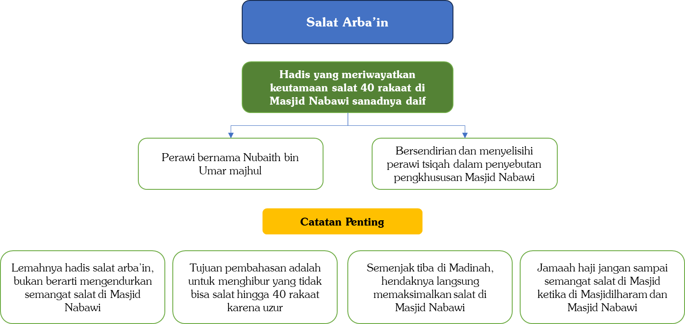

Pertanyaan 3: Apakah salat di masjid-masjid lain di kota Makkah juga mendapat pahala seratus ribu kali lipat seperti salat di Masjidilharam?

Jawab:

Salat di masjid mana pun di tanah haram Makkah mendapat pahala seratus ribu kali lipat. Namun demikian, salat di Masjidilharam tetap lebih utama.

Perincian:

Rasulullah ﷺ bersabda,

```arabic
((صَلَاةٌ فِي مَسْجِدِي هَذَا أَفْضَلُ مِنْ أَلْفِ صَلَاةٍ فِيمَا سِوَاهُ إِلَّا الْمَسْجِدَ الْحَرَامَ، وَصَلَاةٌ فِي الْمَسْجِدِ الْحَرَامِ أَفْضَلُ مِنْ مِائَةِ أَلْفِ صَلَاةٍ))
```

“Salat di masjidku ini (Masjid Nabawi) lebih baik dari seribu salat di masjid lain kecuali Masjidilharam. Dan salat di lebih baik dari seratus ribu salat di masjid lainnya.” [^74]

Para ulama berselisih tentang maksud “Masjidilharam” dalam hadis ini: apakah yang dimaksud adalah masjidnya saja ataukah seluruh tanah haram? Dari perbedaan pandangan inilah muncul dua pendapat yang masyhur.

Pendapat pertama: pelipatgandaan pahala seratus ribu kali lipat hanya berlaku di Masjidilharam saja, yaitu masjid yang di dalamnya terdapat Ka’bah. Di antara ulama yang berpendapat demikian adalah an-Nawawi[^75], al-Muhibb ath-Thabari[^76], Ibnu Hajar Al-Haitami[^77], Ibnu Muflih[^78], dan ini dipilih pula oleh Ibnu Al-Utsaimin.[^79]

Dalil mereka adalah sebagian lafal hadis yang menyebut,

```arabic
((صَلَاةٌ فِيهِ أَفْضَلُ مِنْ أَلْفِ صَلَاةٍ فِيمَا سِوَاهُ مِنَ الْمَسَاجِدِ إِلَّا مَسْجِدَ الْكَعْبَةِ))
```

“Salat di Masjid Nabawi lebih baik dari seribu salat di masjid-masjid lain kecuali Masjid al-Ka’bah.”[^80]

Lafal “Masjid al-Ka’bah” ini mereka jadikan penafsir bagi “Masjidilharam”, bahwa yang dimaksud adalah masjid tempat Ka’bah berada, bukan seluruh tanah haram.

Pendapat kedua: pelipatgandaan pahala berlaku di seluruh tanah haram Makkah. Ini adalah pendapat mayoritas ulama dari mazhab Hanafiyah, Malikiah, dan Syafi’iyah.[^81]

Pendapat yang lebih kuat adalah pendapat kedua, berdasarkan beberapa argumen berikut.

Pertama, lafal “Masjidilharam” disebutkan dalam al-Qur`an sebanyak lima belas kali, dan seluruhnya bermakna tanah haram Makkah, kecuali satu ayat yang diulang tiga kali, yaitu firman Allah ﷻ,

```arabic
ﵟفَوَلِّ وَجۡهَكَ شَطۡرَ ٱلۡمَسۡجِدِ ٱلۡحَرَامِۚﵞ
```

“Maka arahkanlah wajahmu ke Masjidilharam.” (QS. Al-Baqarah: 144, 149 dan 150)

Ini menunjukkan bahwa makna asal “Masjidilharam” adalah tanah haram Makkah, sehingga lafal tersebut dalam hadis pun semestinya dibawa kepada makna asalnya.[^82]

Kedua, bahkan kata “al-Bait” (Ka’bah) pun terkadang bermakna seluruh tanah haram. Allah ﷻ berfirman,

```arabic
ﵟوَإِذۡ جَعَلۡنَا ٱلۡبَيۡتَ مَثَابَةٗ لِّلنَّاسِ وَأَمۡنٗاﵞ
```

“Dan (ingatlah) ketika Kami menjadikan rumah itu (Baitullah) tempat berkumpul bagi manusia dan tempat yang aman.” (QS. Al-Baqarah: 125)

Al-Jashshash berkata, “Allah mensifati al-Bait (Ka’bah) dengan ‘tempat yang aman’, dan yang dimaksud adalah seluruh tanah haram.” [^83]

Demikian pula firman Allah ﷻ,

```arabic
ﵟهَدۡيَۢا بَٰلِغَ ٱلۡكَعۡبَةِﵞ
```

“Sebagai hewan hadyu yang dibawa sampai ke Ka’bah.” (QS. Al-Mâ`idah: 95)

Yang dimaksud “Ka’bah” di sini adalah tanah haram secara keseluruhan, karena hewan-hewan hadyu disembelih di Mina, bukan di depan Ka’bah atau di areal masjid. Haramnya tanah haram itu sendiri bersumber dari keberadaan Ka’bah, sehingga boleh diungkapkan dengan lafal “Ka’bah.”[^84]

Karenanya, hadirnya lafal “Masjid al-Ka’bah” tidak menjadikan “Masjidilharam” harus diartikan sempit sebagai masjid tempat Ka’bah saja, karena lafal “Ka’bah” itu sendiri bisa bermakna tanah haram.

Ketiga, kedua lafal dalam hadis adalah lafal yang sudah bersifat khusus. “Masjidilharam” sudah khusus karena adanya alif-lam ta’rif dan sifat “al-Harâm”. “Masjid al-Ka’bah” juga sudah khusus karena adanya idhâfah (disandarkan kepada al-Ka’bah). Maka tidak bisa dikatakan salah satunya mengkhususkan yang lain, karena keduanya sudah merupakan lafal yang khusus. Justru penyifatan masjid dengan dua sifat khusus ini menjadikannya semakin mulia.

Keempat, inilah pemahaman Abdullah bin az-Zubair radhiyallâhu ‘anhumâ, perawi hadis ini sendiri, dan tentu beliau lebih tahu maksudnya. Atha` bin Abi Rabah berkata,

```arabic
بَيْنَمَا ابْنُ الزُّبَيْرِ يَخْطُبُنَا إِذْ قَالَ: قَالَ رَسُولُ اللهِ صَلَّى اللهُ عَلَيْهِ وَسَلَّمَ: ((صَلَاةٌ فِي مَسْجِدِي هَذَا أَفْضَلُ مِنْ أَلْفِ صَلَاةٍ فِيمَا سِوَاهُ إِلَّا الْمَسْجِدَ الْحَرَامَ، وَصَلَاةٌ فِي الْمَسْجِدِ الْحَرَامِ تَفْضُلُ بِمِائَةٍ)) قُلْتُ: يَا أَبَا مُحَمَّدٍ، هَذَا الْفَضْلُ الَّذِي تَذْكُرُ فِي الْمَسْجِدِ الْحَرَامِ وَحْدَهُ أَوْ فِي الْحَرَمِ؟ قَالَ: لَا، بَلْ فِي الْحَرَمِ، فَإِنَّ الْحَرَمَ كُلَّهُ مَسْجِدٌ
```

“Ketika Ibnu az-Zubair berkhotbah di hadapan kami, ia menyampaikan sabda Rasulullah ﷺ, ‘Salat di masjidku ini lebih baik dari seribu salat di masjid lain kecuali Masjidilharam. Dan salat di Masjidilharam lebih baik seratus kali lipat dari salat di Masjid Nabawi.’

Aku (Atha`) pun bertanya, ‘Wahai Abu Muhammad, keutamaan yang engkau sebutkan ini, apakah hanya berlaku di Masjidilharam saja atau di seluruh tanah haram?’

Ibnu az-Zubair menjawab, ‘Bahkan berlaku di seluruh tanah haram Makkah, karena seluruh tanah haram adalah masjid.’”[^85]

Kelima, dalam peristiwa Perjanjian Hudaibiah disebutkan,

```arabic
وَكَانَ رَسُولُ اللهِ صَلَّى اللهُ عَلَيْهِ وَسَلَّمَ يُصَلِّي فِي الْحَرَمِ وَهُوَ مُضْطَرِبٌ فِي الْحِلِّ
```

“Rasulullah ﷺ salat di tanah haram sementara beliau mendirikan kemah di tanah halal.”[^86]

Ini menunjukkan bahwa Nabi ﷺ sengaja salat di tanah haram meskipun kemah beliau berada di tanah halal. Demikian pula yang dipahami dan dipraktikkan oleh para sahabat. Mujahid berkata,

```arabic
رَأَيْتُ عَبْدَ اللهِ بْنَ عَمْرِو بْنِ الْعَاصِ بِعَرَفَةَ وَمَنْزِلُهُ فِي الْحِلِّ وَمُصَلَّاهُ فِي الْحَرَمِ، فَقِيلَ لَهُ: لِمَ تَفْعَلُ هَذَا؟ فَقَالَ: لِأَنَّ الْعَمَلَ فِيهِ أَفْضَلُ وَالْخَطِيئَةَ أَعْظَمُ فِيهِ
```

“Aku melihat Abdullah bin Amr bin al-‘Ash di Arafah; tempat tinggalnya di tanah halal, tetapi tempat salatnya di tanah haram. Ditanyakan kepadanya, ‘Mengapa engkau melakukan ini?’

Ia menjawab, ‘Karena beramal di tanah haram lebih utama, dan bermaksiat di tanah haram pun lebih besar dosanya.’”[^87]

Catatan penting

Meskipun salat di masjid mana pun di tanah haram Makkah mendapat pahala seratus ribu kali lipat, salat di Masjidilharam tetap lebih utama karena jumlah jamaahnya yang jauh lebih banyak. Nabi ﷺ bersabda,

```arabic
((وَإِنَّ صَلَاةَ الرَّجُلِ مَعَ الرَّجُلِ أَزْكَى مِنْ صَلَاتِهِ وَحْدَهُ، وَصَلَاتُهُ مَعَ الرَّجُلَيْنِ أَزْكَى مِنْ صَلَاتِهِ مَعَ الرَّجُلِ، وَمَا كَثُرَ فَهُوَ أَحَبُّ إِلَى اللهِ تَعَالَى))
```

“Salat seseorang bersama satu orang lain lebih mulia dari salatnya sendirian. Salatnya bersama dua orang lebih mulia dari salatnya bersama satu orang. Dan semakin banyak jamaahnya, semakin dicintai Allah.”[^88]

Beliau juga bersabda,

```arabic
((صَلَاةُ رَجُلَيْنِ يَؤُمُّ أَحَدُهُمَا صَاحِبَهُ أَزْكَى عِنْدَ اللهِ مِنْ صَلَاةِ ثَمَانِيَةٍ تَتْرَى، وَصَلَاةُ أَرْبَعَةٍ يَؤُمُّهُمْ أَحَدُهُمْ أَزْكَى عِنْدَ اللهِ مِنْ صَلَاةِ مِائَةٍ تَتْرَى))
```

“Salat dua orang yang salah satunya menjadi imam lebih mulia di sisi Allah dari salat delapan orang yang terpisah-pisah. Dan salat empat orang yang diimami salah seorang dari mereka lebih mulia di sisi Allah dari salat seratus orang yang terpisah-pisah.”[^89]

Ibnu Taimiyyah rahimahullâh berkata,

```arabic
لِأَنَّ اجْتِمَاعَ النَّاسِ فِي مَسْجِدٍ وَاحِدٍ أَفْضَلُ مِنْ تَفْرِيقِهِمْ فِي مَسْجِدَيْنِ، لِأَنَّ الْجَمْعَ كُلَّمَا كَثُرَ كَانَ أَفْضَلَ
```

“Berkumpulnya manusia di satu masjid lebih baik daripada mereka terbagi di dua masjid, karena semakin banyak jamaah semakin utama.”[^90]

Dengan demikian, salat berjamaah yang semakin banyak jamaahnya mendapat pelipatgandaan pahala dari dua sisi sekaligus: dari sisi “berjamaahnya” dua puluh tujuh kali lipat, dan dari sisi “banyaknya” jamaah. Belum lagi pelipatgandaan dari sisi-sisi lain seperti jauhnya masjid dan kemuliaannya. [^91]

Karenanya, jamaah haji yang penginapannya jauh dari Masjidilharam boleh salat di masjid-masjid terdekat jika ada kesulitan, karena pahalanya pun tetap berlipat ganda seratus ribu kali. Namun jika ada kesempatan untuk pergi ke Masjidilharam, usahakanlah salat di sana karena pahalanya lebih besar.

Yang perlu diingat, jangan sampai semangat mengejar pahala justru mengabaikan kondisi kesehatan. Sebagian jamaah memaksakan diri pergi ke Masjidilharam meski jarak jauh dan cuaca terik padahal kondisi tubuh sedang kurang baik, hingga akhirnya justru kerepotan ketika pelaksanaan haji yang sesungguhnya tiba. Wallâhu a’lam bish-shawâb.

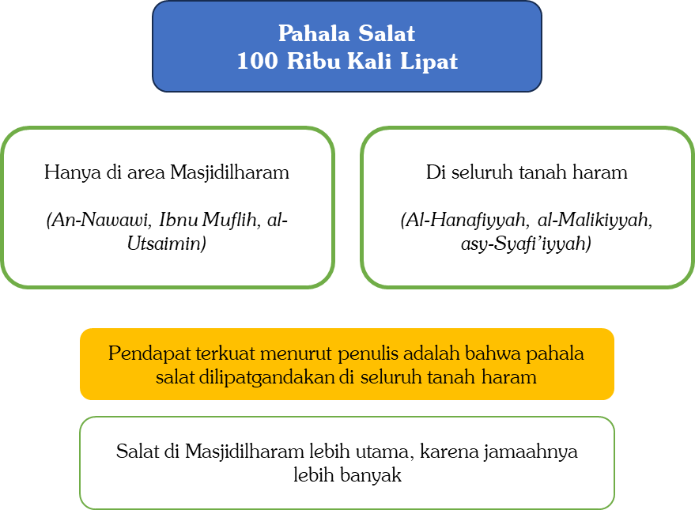

# 4.12 — Salat Jenazah

Pertanyaan 1: Bagaimana tata cara salat jenazah?

Jawab:

Berikut urutan tata cara salat jenazah.

---

## Pertama: Takbiratul ihram (takbir pertama), dengan mengangkat kedua tangan sejajar pundak atau telinga,[^92] lalu melipatkan tangan sebagaimana salat biasa. setelah itu tidak membaca doa iftitah, melainkan langsung membaca taawuz:

```arabic
أَعُوذُ بِاللهِ مِنَ الشَّيْطَانِ الرَّجِيمِ
```

lalu membaca basmalah,

```arabic
بِسْمِ اللهِ الرَّحْمَنِ الرَّحِيمِ
```

kemudian membaca al-Fâtihah.[^93] Sebagian ulama membolehkan membaca surah pendek atau beberapa ayat setelahnya.[^94]

---

## Kedua: Takbir kedua, lalu membaca selawat kepada Nabi ﷺ.[^95] yang terbaik adalah selawat ibrahimiyah yang diajarkan langsung oleh Nabi ﷺ untuk dibaca dalam salat:

```arabic
اللَّهُمَّ صَلِّ عَلَى مُحَمَّدٍ وَأَزْوَاجِهِ وَذُرِّيَّتِهِ كَمَا صَلَّيْتَ عَلَى آلِ إِبْرَاهِيمَ، وَبَارِكْ عَلَى مُحَمَّدٍ وَأَزْوَاجِهِ وَذُرِّيَّتِهِ كَمَا بَارَكْتَ عَلَى آلِ إِبْرَاهِيمَ، إِنَّكَ حَمِيدٌ مَجِيدٌ
```

“Ya Allah, rahmatilah Muhammad, istri-istri beliau, dan keturunan beliau, sebagaimana Engkau merahmati keluarga Ibrahim. Dan berilah keberkahan kepada Muhammad, istri-istrinya, dan keturunannya, sebagaimana Engkau memberkahi keluarga Ibrahim. Sesungguhnya Engkau Maha Terpuji lagi Maha Agung.”[^96]

---

## Ketiga: Takbir ketiga, lalu mendoakan jenazah dengan doa-doa yang terdapat dalam hadis-hadis sahih. di antara doa-doa tersebut adalah:

```arabic
اللَّهُمَّ اغْفِرْ لِحَيِّنَا وَمَيِّتِنَا وَشَاهِدِنَا وَغَائِبِنَا وَصَغِيرِنَا وَكَبِيرِنَا وَذَكَرِنَا وَأُنْثَانَا، اللَّهُمَّ مَنْ أَحْيَيْتَهُ مِنَّا فَأَحْيِهِ عَلَى الْإِسْلَامِ، وَمَنْ تَوَفَّيْتَهُ مِنَّا فَتَوَفَّهُ عَلَى الْإِيمَانِ، اللَّهُمَّ لَا تَحْرِمْنَا أَجْرَهُ وَلَا تُضِلَّنَا بَعْدَهُ
```

“Ya Allah, ampunilah yang masih hidup dan yang telah wafat di antara kami, yang hadir dan yang tidak hadir, yang kecil dan yang tua, laki-laki maupun perempuan. Ya Allah, siapa di antara kami yang Engkau beri kehidupan, hidupkanlah dalam Islam. Dan siapa di antara kami yang Engkau wafatkan, wafatkanlah dalam iman. Ya Allah, janganlah Engkau halangi kami dari pahala bersabar atas musibah kematiannya, dan janganlah Engkau sesatkan kami setelahnya.”[^97]

Di antara doa lainnya:

```arabic
اللَّهُمَّ اغْفِرْ لَهُ وَارْحَمْهُ وَعَافِهِ وَاعْفُ عَنْهُ، وَأَكْرِمْ نُزُلَهُ، وَوَسِّعْ مُدْخَلَهُ، وَاغْسِلْهُ بِالْمَاءِ وَالثَّلْجِ وَالْبَرَدِ، وَنَقِّهِ مِنَ الْخَطَايَا كَمَا نَقَّيْتَ الثَّوْبَ الأَبْيَضَ مِنَ الدَّنَسِ، وَأَبْدِلْهُ دَارًا خَيْرًا مِنْ دَارِهِ وَأَهْلًا خَيْرًا مِنْ أَهْلِهِ وَزَوْجًا خَيْرًا مِنْ زَوْجِهِ، وَأَدْخِلْهُ الْجَنَّةَ وَأَعِذْهُ مِنْ عَذَابِ الْقَبْرِ أَوْ مِنْ عَذَابِ النَّارِ
```

“Ya Allah, ampuni dan rahmatilah dia. Selamatkan dan maafkanlah dia. Muliakanlah tempat singgahnya dan luaskanlah tempat masuknya. Mandikanlah dia dengan air, salju, dan embun. Bersihkanlah dia dari kesalahan-kesalahan sebagaimana Engkau membersihkan kain putih dari kotoran. Gantikanlah baginya rumah yang lebih baik dari rumahnya, keluarga yang lebih baik dari keluarganya, dan pasangan yang lebih baik dari pasangannya. Masukkanlah dia ke dalam surga dan lindungilah dari azab kubur atau azab neraka.”[^98]

Perlu diperhatikan:

Jika yang disalatkan adalah jenazah perempuan, semua kata ganti hu (هُ) diganti menjadi hâ (هَا), sehingga doa menjadi:

```arabic
اللَّهُمَّ اغْفِرْ لَهَا وَارْحَمْهَا وَعَافِهَا وَاعْفُ عَنْهَا وَأَكْرِمْ نُزُلَهَا وَوَسِّعْ مُدْخَلَهَا وَاغْسِلْهَا بِالْمَاءِ وَالثَّلْجِ وَالْبَرَدِ وَنَقِّهَا مِنَ الْخَطَايَا كَمَا نَقَّيْتَ الثَّوْبَ الأَبْيَضَ مِنَ الدَّنَسِ وَأَبْدِلْهَا دَارًا خَيْرًا مِنْ دَارِهَا وَأَهْلًا خَيْرًا مِنْ أَهْلِهَا وَزَوْجًا خَيْرًا مِنْ زَوْجِهَا وَأَدْخِلْهَا الْجَنَّةَ وَأَعِذْهَا مِنْ عَذَابِ الْقَبْرِ أَوْ مِنْ عَذَابِ النَّارِ
```

Jika yang disalatkan dua jenazah, kata ganti diganti menjadi bentuk tatsniyah humâ (هُمَا):

```arabic
اللَّهُمَّ اغْفِرْ لَهُمَا وَارْحَمْهُمَا وَعَافِهُمَا وَاعْفُ عَنْهُمَا وَأَكْرِمْ نُزُلَهُمَا وَوَسِّعْ مُدْخَلَهُمَا وَاغْسِلْهُمَا بِالْمَاءِ وَالثَّلْجِ وَالْبَرَدِ وَنَقِّهُمَا مِنَ الْخَطَايَا كَمَا نَقَّيْتَ الثَّوْبَ الأَبْيَضَ مِنَ الدَّنَسِ وَأَبْدِلْهُمَا دِيَارًا خَيْرًا مِنْ دِيَارِهِمَا وَأَهْلِينَ خَيْرًا مِنْ أَهْلِيهِمَا وَأَزْوَاجًا خَيْرًا مِنْ أَزْوَاجِهِمَا وَأَدْخِلْهُمَا الْجَنَّةَ وَأَعِذْهُمَا مِنْ عَذَابِ الْقَبْرِ أَوْ مِنْ عَذَابِ النَّارِ
```

Jika yang disalatkan banyak jenazah, kata ganti diganti menjadi bentuk jamak hum (هُمْ):

```arabic
اللَّهُمَّ اغْفِرْ لَهُمْ وَارْحَمْهُمْ وَعَافِهِمْ وَاعْفُ عَنْهُمْ وَأَكْرِمْ نُزُلَهُمْ وَوَسِّعْ مُدْخَلَهُمْ وَاغْسِلْهُمْ بِالْمَاءِ وَالثَّلْجِ وَالْبَرَدِ وَنَقِّهِمْ مِنَ الْخَطَايَا كَمَا نَقَّيْتَ الثَّوْبَ الأَبْيَضَ مِنَ الدَّنَسِ وَأَبْدِلْهُمْ دِيَارًا خَيْرًا مِنْ دِيَارِهِمْ وَأَهْلِينَ خَيْرًا مِنْ أَهْلِيهِمْ وَأَزْوَاجًا خَيْرًا مِنْ أَزْوَاجِهِمْ وَأَدْخِلْهُمُ الْجَنَّةَ وَأَعِذْهُمْ مِنْ عَذَابِ الْقَبْرِ أَوْ مِنْ عَذَابِ النَّارِ
```

Jika seseorang tidak mengetahui status jenazah apakah laki-laki atau perempuan, satu orang atau banyak, sebagaimana yang sering terjadi di Masjid Nabawi dan Masjidilharam karena posisi jenazah jauh di depan dan tidak terlihat, maka ia boleh berdoa menggunakan kata ganti laki-laki hu (هُ) dengan niat yang dimaksud adalah al-Mayyit (jenazah), atau menggunakan kata ganti perempuan hâ (هَا) dengan niat yang dimaksud adalah al-Janâzah. Baik kata al-Mayyit maupun al-Janâzah adalah kata yang mencakup semua jenis jenazah, baik laki-laki maupun perempuan, satu orang maupun banyak.[^99]

Adapun jika yang disalatkan adalah jenazah anak kecil, tidak ada doa khusus yang sahih dari Nabi ﷺ.[^100] Namun ada beberapa doa yang diriwayatkan dari sebagian ulama salaf. Di antaranya doa yang berasal dari Abu Hurairah radhiyallâhu ‘anhu,

```arabic
اللَّهُمَّ أَعِذْهُ مِنْ عَذَابِ الْقَبْرِ
```

“Ya Allah, lindungilah dia dari azab kubur.”

Dan dari al-Hasan al-Bashri,

```arabic
اللَّهُمَّ اجْعَلْهُ لَنَا فَرَطًا وَسَلَفًا وَأَجْرًا
```

“Ya Allah, jadikanlah anak kecil ini bagi kami sebagai farth (yang tiba lebih dahulu untuk mempersiapkan tempat bagi yang datang belakangan), salaf (yang lebih dahulu menuju surga), dan pahala (kematiannya menjadi sebab kami mendapat pahala dengan kesabaran kami).”[^101]

Sebagian ulama menganjurkan untuk mendoakan kedua orang tua sang anak, karena bayi dan anak kecil tidak memiliki dosa sama sekali, sehingga kedua orang tuanyalah yang lebih utama untuk didoakan. Di antara doa yang disebutkan para fukaha adalah:

```arabic
اللَّهُمَّ اجْعَلْهُ فَرَطًا لِوَالِدَيْهِ وَذُخْرًا وَسَلَفًا وَأَجْرًا، اللَّهُمَّ ثَقِّلْ بِهِ مَوَازِينَهُمَا وَأَعْظِمْ بِهِ أُجُورَهُمَا، اللَّهُمَّ اجْعَلْهُ فِي كَفَالَةِ إِبْرَاهِيمَ وَأَلْحِقْهُ بِصَالِحِ سَلَفِ الْمُؤْمِنِينَ، وَأَجِرْهُ بِرَحْمَتِكَ مِنْ عَذَابِ الْجَحِيمِ، وَأَبْدِلْهُ دَارًا خَيْرًا مِنْ دَارِهِ وَأَهْلًا خَيْرًا مِنْ أَهْلِهِ
```

“Ya Allah, jadikanlah anak ini sebagai farth, dzukhr, salaf, dan pahala bagi kedua orang tuanya. Ya Allah, perberat karenanya timbangan kebaikan mereka berdua dan perbanyak pahala mereka. Masukkanlah dia dalam pengasuhan Ibrahim dan pertemukanlah dia dengan orang-orang saleh terdahulu dari kalangan orang-orang yang beriman. Dengan rahmat-Mu, lindungilah dia dari siksa neraka Jahim, dan gantikanlah baginya tempat tinggal yang lebih baik dari tempat tinggalnya serta keluarga yang lebih baik dari keluarganya.”[^102]

Ibnu Qudamah berkata,

```arabic
وَبِأَيِّ شَيْءٍ دَعَا مِمَّا ذَكَرْنَا أَوْ نَحْوَهُ أَجْزَأَهُ وَلَيْسَ فِيهِ شَيْءٌ مُوَقَّتٌ
```

“Dengan doa apa pun yang ia baca dari yang telah kami sebutkan atau yang semisalnya, maka itu sudah cukup. Tidak ada doa khusus yang valid dalam hal ini.”[^103]

---

## Keempat: Takbir terakhir (takbir keempat),[^104] berhenti sejenak, lalu mengucapkan salam sekali ke arah kanan.[^105]

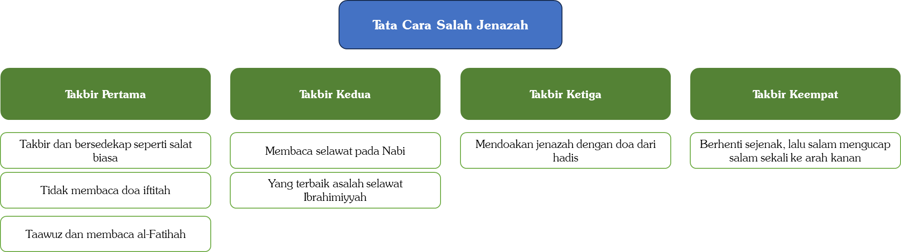

Pertanyaan 2: Bagaimana cara salat jenazah jika masbuk?

Jawab:

Secara umum ada dua pendapat dalam permasalahan ini.

Pendapat pertama, mayoritas ulama: setiap takbir dalam salat jenazah berkedudukan seperti setiap rakaat dalam salat-salat lainnya. As-Sarakhsi dari mazhab Hanafi berkata,

```arabic
أَنَّ كُلَّ تَكْبِيرَةٍ فِي الصَّلَاةِ عَلَى الْجِنَازَةِ قَائِمَةٌ مَقَامَ رَكْعَةٍ
```

“Setiap takbir dalam salat jenazah berkedudukan seperti setiap rakaat.”[^106]

Berdasarkan ini, jika seseorang terlambat dua takbir, misalnya baru ikut pada takbir ketiga, maka ia menyelesaikan bersama imam hingga takbir keempat, lalu setelah imam salam ia menyempurnakan dua takbir yang tertinggal. Jika ia tidak mengqada takbir yang terlewat dan langsung salam bersama imam, maka salatnya tidak sah, dikiaskan dengan salat-salat lain: siapa yang masbuk dan tidak mengqada rakaat yang tertinggal, salatnya tidak sah. Ini adalah pendapat mazhab Hanafi, Maliki, dan Syafi’i.[^107]

Adapun cara pelaksanaannya: misalnya ia mendapati imam pada takbir ketiga, maka ia bertakbir pertama lalu membaca al-Fâtihah (sementara imam sedang berdoa setelah takbir ketiga). Ketika imam bertakbir keempat, ia pun bertakbir keduanya dan membaca selawat kepada Nabi ﷺ. Ketika imam salam, ia bertakbir ketiga dan berdoa untuk jenazah, namun dengan segera sebelum jenazah diangkat, cukup dengan doa singkat seperti “Allâhummaghfir lahu” (Ya Allah, ampunilah dia) lalu bertakbir keempat dan salam.[^108]

Pendapat kedua, mazhab Hanbali: mengqada takbir yang tertinggal hukumnya sunah, bukan wajib. Jika seseorang tidak mengqadanya dan langsung salam bersama imam, maka tidak mengapa. Imam Ahmad berkata,

```arabic
إِذَا لَمْ يَقْضِ لَمْ يُبَالِ
```

“Jika ia tidak mengqada (takbir yang tertinggal), maka aku tidak mempermasalahkannya.”[^109]

Alasannya, takbir-takbir dalam salat jenazah adalah takbir-takbir yang berturut-turut dikerjakan dalam posisi berdiri, mirip dengan takbir-takbir dalam salat Id. Sehingga jika ada yang tertinggal, tidak harus diqada.

Cara pelaksanaannya menurut pendapat ini: misalnya masbuk mendapati imam pada takbir ketiga, ia langsung bertakbir dan berdoa sebagaimana imam sedang berdoa. Ketika imam salam setelah takbir keempat, ia boleh salam bersama imam, atau mengqada dua takbir yang tertinggal: setelah imam salam ia bertakbir pertama sambil membaca al-Fâtihah, lalu bertakbir kedua sambil berselawat kepada Nabi ﷺ, lalu salam.[^110]

Pertanyaan 3: Jika tidak tahu jenis kelamin dan jumlah jenazah, bagaimana cara berdoanya?

Jawab:

Jika seseorang tidak mengetahui status jenazah, apakah laki-laki atau perempuan, satu orang atau banyak, sebagaimana yang sering terjadi di Masjid Nabawi dan Masjidilharam karena posisi jenazah jauh di depan dan tidak terlihat, maka ada dua pilihan. Ia boleh berdoa menggunakan kata ganti laki-laki hu (هُ), seperti “Allâhummaghfir lahu warhamhu...”, dengan niat yang dimaksud adalah al-Mayyit (jenazah). Atau ia menggunakan kata ganti perempuan hâ (هَا), seperti “Allâhummaghfir lahâ warhamhâ...”, dengan niat yang dimaksud adalah al-Janâzah. Baik kata al-Mayyit maupun al-Janâzah adalah kata yang mencakup semua jenis dan jumlah jenazah, baik laki-laki maupun perempuan, satu orang maupun banyak.[^111]

Pertanyaan 4: Jika lupa membaca al-Fâtihah atau selawat dalam salat jenazah, apakah perlu sujud sahwi?

Jawab:

Ada dua kesepakatan ulama dalam hal ini.

Pertama, para ulama sepakat tidak ada sujud apa pun dalam salat jenazah.

Kedua, para ulama sepakat bahwa makmum yang lupa tidak perlu sujud sahwi. Kesepakatan ini berlaku dalam salat-salat yang ada sujudnya, maka tentu lebih berlaku lagi untuk salat jenazah yang memang tidak ada sujudnya sama sekali.

Kesimpulannya, jika seorang makmum lupa dalam salat jenazah, baik lupa membaca al-Fâtihah, lupa berselawat, lupa berdoa, maupun lupa bertakbir, ia tidak perlu sujud sahwi. Namun jika ia lupa satu takbir dan baru ingat sesaat kemudian, hendaknya ia menambahkan takbir tersebut, karena para ulama memandang salat jenazah harus empat takbir; jika kurang dari itu secara sengaja, salatnya tidak sah.

Ibnu Qudamah berkata,

```arabic
فَإِنْ نَقَصَ مِنْهَا تَكْبِيرَةً عَامِدًا بَطَلَتْ كَمَا لَوْ تَرَكَ رَكْعَةً عَمْدًا، وَإِنْ تَرَكَهَا سَهْوًا احْتَمَلَ أَنْ يُعِيدَهَا كَمَا فَعَلَ أَنَسٌ، وَيَحْتَمِلُ أَنْ يُكَبِّرَهَا مَا لَمْ يَطُلِ الْفَصْلُ كَمَا لَوْ نَسِيَ رَكْعَةً، وَلَا يُشْرَعُ لَهَا سُجُودُ سَهْوٍ فِي الْمَوْضِعَيْنِ
```

“Jika kurang satu takbir karena sengaja maka batal salatnya, sebagaimana jika sengaja meninggalkan satu rakaat. Jika meninggalkan satu takbir karena lupa, maka memungkinkan ia mengulangi salatnya sebagaimana yang dilakukan Anas bin Malik, dan memungkinkan ia bertakbir lagi selama jedanya tidak lama, sebagaimana jika lupa satu rakaat ia boleh menambahnya selama tidak lama. Dan pada kedua kondisi ini tidak disyariatkan sujud sahwi.”[^112]

Pertanyaan 5: Apakah setelah takbir keempat masih boleh berdoa ataukah diam saja?

Jawab:

Sebagian ulama berpendapat tidak ada doa setelah takbir keempat, ini adalah pendapat mazhab Hanafi dan Hanbali, yaitu cukup diam sejenak lalu salam. Adapun mazhab Syafi’i dan Maliki berpendapat ada doa setelah takbir keempat.[^113]

Pendapat yang lebih kuat adalah dianjurkannya berdoa setelah takbir keempat, berdasarkan dua dalil.

Pertama, hadis Abdullah bin Abi Aufa. Abu Ya’fur berkata,

```arabic
شَهِدْتُهُ وَكَبَّرَ عَلَى جِنَازَةٍ أَرْبَعًا ثُمَّ قَامَ سَاعَةً يَعْنِي يَدْعُو، ثُمَّ قَالَ: أَتَرَوْنِي كُنْتُ أُكَبِّرُ خَمْسًا؟ قَالُوا: لَا. قَالَ: إِنَّ رَسُولَ اللهِ صَلَّى اللهُ عَلَيْهِ وَسَلَّمَ كَانَ يُكَبِّرُ أَرْبَعًا
```

“Aku menyaksikan Abdullah bin Abi Aufa salat jenazah dan bertakbir empat kali, lalu beliau diam sesaat, yaitu berdoa, kemudian berkata, ‘Apakah kalian melihatku bertakbir yang kelima?’

Mereka menjawab, ‘Tidak.’

Beliau berkata, ‘Sesungguhnya Rasulullah ﷺ bertakbir empat kali.’”[^114]

Hadis ini sangat jelas menunjukkan bahwa setelah takbir keempat masih ada doa, sebagaimana yang dipraktikkan oleh Abdullah bin Abi Aufa radhiyallâhu ‘anhu.

Kedua, berdoa tentu lebih baik daripada diam saja. Syekh Al-‘Utsaimin berkata,

```arabic
وَالْقَوْلُ بِأَنَّهُ يَدْعُو بِمَا تَيَسَّرَ أَوْلَى مِنَ السُّكُوتِ، لِأَنَّ الصَّلَاةَ عِبَادَةٌ لَيْسَ فِيهَا سُكُوتٌ أَبَدًا إِلَّا لِسَبَبٍ كَالِاسْتِمَاعِ لِقِرَاءَةِ الْإِمَامِ وَنَحْوِ ذَلِكَ
```

“Pendapat yang menyatakan berdoa dengan apa yang dimudahkan setelah takbir keempat lebih utama daripada diam, karena salat adalah ibadah yang tidak ada diam sama sekali di dalamnya kecuali karena ada sebab, seperti mendengarkan bacaan imam dan semisalnya.”[^115]

Pertanyaan 6: Jika imam di Masjidilharam atau Masjid Nabawi hanya salam sekali, bolehkah makmum salam dua kali?

Jawab:

Persoalan salam sekali atau dua kali adalah persoalan khilafiah yang diperselisihkan para ulama. Pendapat yang lebih kuat adalah cukup salam sekali. Namun jika seseorang berpendapat salam dua kali lalu bermakmum kepada imam yang hanya salam sekali, maka yang lebih baik adalah ia pun hanya salam sekali, agar lebih sempurna dalam mengikuti imam, terutama dalam perkara khilafiah. Meski demikian, jika ia tetap salam dua kali, tidak mengapa.

Syekh al-‘Utsaimin berkata,

```arabic
إِذَا سَلَّمَ الْإِمَامُ تَسْلِيمَةً وَاحِدَةً فَلِلْمَأْمُومِ أَنْ يُسَلِّمَ تَسْلِيمَتَيْنِ لِأَنَّهُ لَا يَتَحَقَّقُ بِهِ الْمُخَالَفَةُ
```

“Jika imam salam sekali, boleh bagi makmum untuk salam dua kali, karena hal itu tidak dianggap menyelisihi imam.”[^116]

Alasannya, dengan mengikuti salam imam yang pertama, makmum sudah sempurna mengikuti imamnya karena imam telah selesai salat. Maka jika ia menambahkan salam kedua setelahnya, itu tidak dianggap menyelisihi.

# 4.13 — Badal Haji

Pertanyaan: Bolehkah badal haji dan umrah?

Jawab:

Berikut hukum-hukum yang berkaitan dengan badal haji dan umrah.

Pertama, orang yang mampu tidak boleh dihajikan orang lain. Ini adalah kesepakatan para ulama.[^117]

Kedua, orang yang tidak mampu boleh dihajikan orang lain. Ketidakmampuan ini ada dua bentuk: (1) sudah meninggal dunia, dan (2) masih hidup namun tidak mampu lagi melaksanakan haji, seperti karena terlalu tua hingga tidak bisa naik kendaraan, atau mengalami sakit yang menurut medis sulit untuk disembuhkan.

Ketiga, jika orang yang akan dihajikan sudah meninggal, ada dua kondisi.

(1) Ia meninggal dalam keadaan sudah terkena kewajiban haji, yaitu ia meninggalkan harta yang mencukupi untuk biaya haji. Dalam kondisi ini wajib dihajikan, baik ia telah mewasiatkannya maupun tidak. Biaya badal hajinya diambil dari hartanya sebelum dibagikan sebagai warisan.[^118] Hal ini berdasarkan hadis-hadis Nabi ﷺ dan diperkuat dengan fatwa para sahabat.[^119]

Demikian pula, seseorang boleh berbuat baik dengan menghajikan mayat tersebut meskipun bukan dari harta sang mayat. Atau misalnya ketika masih hidup ia sudah terkena kewajiban haji, namun ketika meninggal ia tidak meninggalkan harta yang cukup untuk biaya hajinya. Dalam kondisi ini ahli warisnya tidak wajib menghajikannya, namun disunahkan. Dan ini diperbolehkan baik dengan izin sang mayat sebelum meninggal maupun tanpanya, baik yang menghajikan adalah ahli warisnya maupun bukan. Ini seperti halnya boleh bagi seseorang yang bukan ahli waris membayarkan utang mayat meskipun sang mayat tidak mewasiatkannya, maka demikian pula utang haji. [^120]

(2) Ia meninggal dalam keadaan sudah berhaji (haji pertama/haji Islam). Apakah boleh menghajikannya untuk haji sunah?

Para ulama berselisih dalam masalah ini, ada yang membolehkan[^121] dan ada yang melarang.[^122] Pendapat yang lebih kuat adalah yang membolehkan, karena dua alasan. Telah datang dalil tentang bolehnya badal haji untuk haji wajib, maka demikian pula untuk haji sunah. Hukum asal adalah kesamaan antara yang wajib dan yang sunah selama tidak ada dalil yang membedakan, dan tidak ada dalil yang membedakan keduanya. Bahkan perkara sunah tidak seketat perkara wajib, sehingga jika yang wajib saja dibolehkan, tentu yang sunah lebih layak untuk dibolehkan.

Keempat, jika orang yang akan dihajikan masih hidup namun tidak mampu melaksanakan haji karena sangat tua, tidak mampu naik kendaraan, atau sakit yang secara medis sulit disembuhkan, maka:

(1) Jika ia mampu secara ekonomi meski fisiknya tidak mampu, maka wajib baginya menyerahkan kepada orang lain untuk menghajikannya. Ibnu Abbas radhiyallâhu ‘anhumâ meriwayatkan bahwa ketika haji Wadak, seorang wanita dari Khats’am bertanya kepada Nabi ﷺ,

```arabic
يَا رَسُولَ اللهِ إِنَّ فَرِيضَةَ اللهِ عَلَى عِبَادِهِ فِي الْحَجِّ أَدْرَكَتْ أَبِي شَيْخًا كَبِيرًا لَا يَثْبُتُ عَلَى الرَّاحِلَةِ، أَفَأَحُجُّ عَنْهُ؟
```

“Wahai Rasulullah, kewajiban haji yang Allah wajibkan kepada para hamba-Nya telah mengenai ayahku yang sudah sangat tua dan tidak mampu duduk tegak di atas kendaraan. Bolehkah aku menghajikannya?”

Maka Nabi ﷺ menjawab: “Ya.” [^123]

(2) Disyaratkan orang yang menghajikan harus mendapat izin dari orang yang ia hajikan. Ini berbeda dengan menghajikan mayat yang tidak memerlukan izin.[^124]

(3) Jika setelah dihajikan ternyata ia sembuh, maka menurut pendapat yang lebih kuat hajinya sudah sah dan ia tidak perlu berhaji lagi, karena badal haji yang dikerjakan untuknya ketika sakit telah memenuhi seluruh persyaratan.

(4) Demikian pula boleh menghajikannya untuk haji sunah. Yaitu jika ia telah mengerjakan haji Islam lalu sakit dan tidak mampu lagi berhaji, maka boleh dilakukan badal haji untuknya meskipun untuk haji sunah.

Kelima, syarat orang yang akan melakukan badal haji adalah ia harus sudah berhaji terlebih dahulu untuk dirinya sendiri.[^125] Ibnu Abbas radhiallâhu ‘anhumâ meriwayatkan,

```arabic
أَنَّ النَّبِيَّ صَلَّى اللهُ عَلَيْهِ وَسَلَّمَ سَمِعَ رَجُلًا يَقُولُ: لَبَّيْكَ عَنْ شُبْرُمَةَ. قَالَ: ((مَنْ شُبْرُمَةُ؟)) قَالَ: أَخٌ لِي أَوْ قَرِيبٌ لِي. قَالَ: ((حَجَجْتَ عَنْ نَفْسِكَ؟)) قَالَ: لَا. قَالَ: ((حُجَّ عَنْ نَفْسِكَ ثُمَّ حُجَّ عَنْ شُبْرُمَةَ))
```

“Nabi ﷺ mendengar seseorang mengucapkan, ‘Labbaik untuk Syubrumah.’

Nabi bertanya, ‘Siapa Syubrumah?’

Ia menjawab, ‘Saudaraku’ atau ‘Kerabatku.’

Nabi bertanya, ‘Engkau sudah berhaji?’

Ia menjawab, ‘Belum.’

Nabi bersabda, ‘Hajikan dulu dirimu, baru hajikan Syubrumah!’”[^126]

Keenam, tidak mengapa seorang laki-laki menghajikan seorang wanita, dan begitu pula sebaliknya.[^127]

Ketujuh, jika seseorang hendak menghajikan kerabatnya, yang paling utama adalah mendahulukan ibu sebelum ayah, karena Nabi ﷺ memerintahkan untuk lebih mendahulukan berbuat baik kepada ibu daripada ayah.

Kedelapan, apa yang berlaku pada haji berlaku pula pada umrah. Karenanya, orang yang hendak mengumrahkan orang lain disyaratkan ia sendiri harus sudah pernah umrah. Karena hukum asal, apa yang berlaku bagi haji berlaku pula bagi umrah selama tidak ada dalil yang membedakan.

Kesembilan, tidak mengapa seseorang yang melakukan haji Tamattu’ meniatkan umrahnya untuk membadalkan ibunya dan hajinya untuk dirinya sendiri, atau sebaliknya, umrahnya untuk dirinya sendiri dan hajinya untuk membadalkan ibunya.

Kesepuluh, hukum asal badal haji dan umrah adalah pahalanya untuk orang yang dihajikan atau diumrahkan. Para ulama al-Lajnah ad-Dâ’imah berkata,

```arabic
مَنْ حَجَّ أَوِ اعْتَمَرَ عَنْ غَيْرِهِ بِأُجْرَةٍ أَوْ بِدُونِهَا فَثَوَابُ الْحَجِّ وَالْعُمْرَةِ لِمَنْ نَابَ عَنْهُ، وَيُرْجَى لَهُ أَيْضًا أَجْرٌ عَظِيمٌ عَلَى حَسَبِ إِخْلَاصِهِ وَرَغْبَتِهِ لِلْخَيْرِ
```

“Barang siapa yang menghajikan atau mengumrahkan orang lain, baik dengan upah maupun tanpa upah, maka pahala haji dan umrah tersebut untuk orang yang ia badalkan. Dan diharapkan ia pun mendapatkan pahala yang besar sesuai kadar keikhlasan dan semangatnya dalam berbuat kebaikan.”[^128]

Ini semua berkaitan dengan amal ibadah manasik haji dan umrah. Adapun ibadah-ibadah di luar manasik yang dilakukan oleh orang yang menghajikan, seperti salat fardu dan salat sunah di Masjidilharam, membaca al-Qur`an selama haji, salat sunah di Mina, atau tawaf sunah selain tawaf haji dan umrah, maka pahalanya untuk dirinya sendiri, bukan untuk orang yang ia badalkan.[^129]

Kesebelas, jika tidak mengetahui nama orang yang akan dihajikan atau diumrahkan, maka tidak mengapa. Yang terpenting adalah penentuan orangnya. Misalnya seseorang ingin menghajikan neneknya namun tidak tahu namanya, maka tidak mengapa, cukup ia niatkan bahwa ia berhaji untuk neneknya tersebut.[^130]

Kedua belas, seseorang yang hendak membayar orang lain untuk menghajikan atau mengumrahkan kerabatnya hendaknya memilih orang yang amanah. Karena memang ada orang-orang yang tidak amanah dan hendak memakan harta orang lain dengan cara yang batil, di antaranya satu orang menerima uang dari lima orang lalu ia badalkan untuk lima orang sekaligus, padahal satu orang hanya bisa membadalkan untuk satu orang saja.[^131]

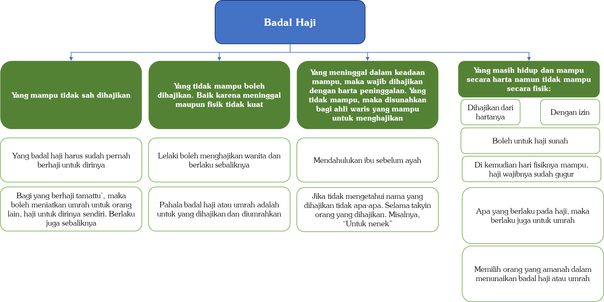

# 4.14 — Lain-lain

Pertanyaan 1: Haji jalan kaki atau reguler atau ONH plus kah yang lebih mabrur?

Jawab:

Sebagian jamaah haji memahami ungkapan “pahala sesuai dengan kadar kesulitan” dengan meyakini bahwa kepayahan dalam beribadah haji, atau ibadah apa pun secara umum, memang dituntut oleh syariat agar pahala semakin bertambah.

Karenanya, ada di antara mereka yang sengaja berhaji dengan berjalan kaki tanpa mau memanfaatkan layanan biro perjalanan haji, ada pula yang sengaja melakukan haji Ifrad karena menganggap haji Ifrad lebih berat sehingga lebih baik. Bahkan ada jamaah yang mengeluhkan kepada penulis bahwa pembimbingnya mengajak berhaji jalan kaki sementara ia membawa anak kecil, hingga sang anak akhirnya jatuh sakit. Ada pula yang berpendapat bahwa haji reguler lebih afdal daripada haji plus karena lebih merepotkan dan lebih banyak berjalan kaki. Benarkah demikian?

Kemudahan Merupakan Tujuan Syariat

Tidak diragukan bahwa di antara tujuan (Maqâshid) syariat adalah menghilangkan kesulitan dari para mukalaf.

Allah ﷻ berfirman,

```arabic
﴿يُرِيدُ ٱللَّهُ بِكُمُ ٱلۡيُسۡرَ وَلَا يُرِيدُ بِكُمُ ٱلۡعُسۡرَ﴾
```

“Allah menghendaki kemudahan bagimu dan tidak menghendaki kesukaran bagimu.” (QS. Al-Baqarah: 185)

Allah ﷻ berfirman,

```arabic
﴿مَا يُرِيدُ ٱللَّهُ لِيَجۡعَلَ عَلَيۡكُم مِّنۡ حَرَجٖ﴾
```

“Allah tidak hendak menyulitkan kamu.” (QS. Al-Mâ’idah: 6)

Allah ﷻ berfirman,

```arabic
﴿وَمَا جَعَلَ عَلَيۡكُمۡ فِي ٱلدِّينِ مِنۡ حَرَجٖۚ﴾
```

“Dan Allah sekali-kali tidak menjadikan untuk kamu dalam agama suatu kesempitan.” (QS. Al-Hajj: 78)

Rasulullah ﷺ juga bersabda dalam beberapa hadisnya,

```arabic
((إِنَّ اللَّهَ يُحِبُّ أَنْ تُؤْتَى رُخَصُهُ كَمَا يُحِبُّ أَنْ تُتْرَكَ مَعْصِيَتُهُ))
```

“Sesungguhnya Allah suka untuk diambil keringanan-Nya sebagaimana Allah suka untuk ditinggalkan kemaksiatan kepada-Nya.” [^132]

```arabic
((إِنَّ اللهَ يُحِبُّ أَنْ تُؤْتَى رُخَصُهُ كَمَا يُحِبُّ أَنْ تُؤْتَى عَزَائِمُهُ))
```

“Sesungguhnya Allah suka untuk dikerjakan keringanan-keringanan dari-Nya sebagaimana Allah suka jika dikerjakan ‘azâ’im-Nya (hukum-hukum asal sebelum ada keringanan).”[^133]

```arabic
((إِنَّ هَذَا الدِّينَ يُسْرٌ وَلَنْ يُشَادَّ الدِّينَ أَحَدٌ إِلَّا غَلَبَهُ))
```

“Sesungguhnya agama ini mudah, dan tidaklah seseorang mempersulit diri dalam agama ini kecuali ia akan terkalahkan.”[^134]

Karenanya, Aisyah radhiyallâhu ‘anhâ berkata,

```arabic
مَا خُيِّرَ رَسُولُ اللهِ صَلَّى اللهُ عَلَيْهِ وَسَلَّمَ بَيْنَ أَمْرَيْنِ قَطُّ إِلَّا أَخَذَ أَيْسَرَهُمَا مَا لَمْ يَكُنْ إِثْمًا، فَإِنْ كَانَ إِثْمًا كَانَ أَبْعَدَ النَّاسِ مِنْهُ
```

“Tidaklah Rasulullah ﷺ diberi pilihan di antara dua perkara kecuali beliau memilih yang paling ringan dari keduanya, selama bukan dosa. Jika itu dosa, maka beliau adalah orang yang paling menjauhinya.”[^135]

Bahkan ada amalan yang ringan namun pahalanya besar. Contohnya zikir dalam hadis,

```arabic
))كَلِمَتَانِ خَفِيفَتَانِ عَلَى اللِّسَانِ ثَقِيلَتَانِ فِي الْمِيزَانِ حَبِيبَتَانِ إِلَى الرَّحْمَنِ سُبْحَانَ اللهِ وَبِحَمْدِهِ سُبْحَانَ اللهِ الْعَظِيمِ((
```

“Dua kalimat yang ringan di lisan, berat di timbangan, dan dicintai oleh ar-Rahmân: Subhânallâhi wa-bi-hamdihî, subhânallâhil ‘azhîm. (Maha suci Allah dan dengan memuji-Nya; Maha suci Allah Yang Maha agung).”[^136]

Bahkan bisa jadi amalan yang ringan justru mengalahkan amalan yang lebih berat. Di antaranya:

Pertama, mengqasar salat bagi musafir lebih afdal daripada menyempurnakannya empat rakaat.

Kedua, salat berjamaah sekali lebih baik daripada salat sendirian di rumah sebanyak 25 atau 27 kali, yang tentu jauh lebih berat.

Ketiga, meringankan (mempercepat) salat dua rakaat qabliyah Subuh lebih baik daripada memperpanjangnya, karena demikianlah sunah Nabi ﷺ.

Keempat, salat Id lebih afdal daripada salat gerhana, padahal salat gerhana lebih berat dan lebih banyak pengerjaannya. Ini karena waktu salat Id lebih mulia dan telah ditentukan, sehingga menyerupai salat wajib, sementara salat gerhana tidak demikian.

Kelima, zikir lâ ilâha illallâh lebih afdal daripada menyingkirkan gangguan dari jalan, sebagaimana disebutkan dalam hadis,

```arabic
((الْإِيمَانُ بِضْعٌ وَسَبْعُونَ أَوْ بِضْعٌ وَسِتُّونَ شُعْبَةً، فَأَفْضَلُهَا قَوْلُ لَا إِلَهَ إِلَّا اللهُ، وَأَدْنَاهَا إِمَاطَةُ الَاذَى عَنِ الطَّرِيقِ، وَالْحَيَاءُ شُعْبَةٌ مِنَ الإِيمَانِ))
```

“Iman itu tujuh puluh sekian atau enam puluh sekian cabang; yang paling afdal adalah ucapan lâ ilâha illallâh, dan yang paling rendah adalah menyingkirkan gangguan dari jalan, sedangkan rasa malu adalah salah satu cabang keimanan.”[^137]

Keenam, haji Tamattu’ lebih afdal daripada haji Ifrad, padahal haji Ifrad lebih sulit karena pelakunya tidak boleh bertahalul, sehingga tidak bisa berganti pakaian biasa dan tidak boleh berhubungan dengan istri, hingga ia selesai dari tahalul tsani dalam hajinya.

Sebaliknya, pada haji Tamattu’, setelah berumrah seseorang boleh kembali memakai pakaian biasa dan boleh berhubungan dengan istrinya.

Demikian pula, telah datang dalil-dalil yang melarang mempersulit diri dalam beribadah. Dari Ibnu Abbas radhiyallâhu ‘anhumâ, bahwa ketika sampai kabar kepada Nabi ﷺ bahwa saudari Uqbah bin Amir telah bernazar untuk berhaji dengan berjalan kaki, Nabi bersabda,

```arabic
((إِنَّ اللَّهَ لَغَنِيٌّ عَنْ نَذْرِهَا، مُرْهَا فَلْتَرْكَبْ))
```

“Sesungguhnya Allah tidak membutuhkan nazarnya itu. Perintahkan dia untuk naik kendaraan.”[^138]

Dalam riwayat Ahmad disebutkan,

```arabic
))مُرْهَا فَلْتَرْكَبْ فَإِنَّ اللهَ عَزَّ وَجَلَّ عَنْ تَعْذِيبِ أُخْتِكَ نَفْسَهَا لَغَنِيٌّ((
```

“Perintahkan dia agar naik kendaraan, karena sesungguhnya Allah tidak membutuhkan sikap saudarimu yang menyiksa dirinya sendiri.” [^139]

Kesulitan yang menambah pahala

Kesulitan bukanlah sesuatu yang dikehendaki oleh syariat. Jika ada seseorang berkata, “Daripada naik pesawat, lebih baik saya berhaji naik bus karena lebih sulit dan lebih besar pahalanya,” atau, “Lebih baik saya jalan kaki daripada naik bus karena lebih susah payah,” maka kita katakan, anggapan seperti ini tidak dibenarkan. Telah lalu kisah saudari Uqbah bin Amir yang justru diperintahkan oleh Nabi ﷺ untuk berhaji dengan naik kendaraan. Dan Nabi ﷺ sendiri berhaji dengan menunggang unta.

Adapun kesulitan yang memang tidak bisa dipisahkan dari suatu ibadah, maka itulah yang mendatangkan pahala. Sebagai contoh, seseorang yang hendak melempar jamarat ketika haji mau tidak mau harus berjalan jauh, kadang di bawah terik matahari yang menyengat. Semua itu mendatangkan pahala, dan semakin tinggi kadar kesulitan yang tidak bisa dihindari, semakin besar pula pahalanya.

Inilah yang dimaksud Nabi ﷺ ketika Aisyah radhiyallâhu ‘anhâ mengadu kepada beliau,

```arabic
يَا رَسُوْلَ اللهِ يَصْدُرُ النَّاسُ بِنُسُكَيْنِ وَأَصْدُرُ بِنُسُكٍ وَاحِدٍ؟
```

“Wahai Rasulullah, orang-orang pulang dengan membawa dua nusuk (haji dan umrah) sementara aku pulang dengan membawa satu nusuk saja (haji saja)?”

Maka Nabi menjawab,

```arabic
((انْتَظِرِي فإذَا طَهُرْتِ فاخْرُجِي إلَى التَّنْعِيمِ فأهِلِّي ثُمَّ ائتِينَا بِمَكَانِ كذَا وكَذَا ولَكِنَّهَا عَلَى قَدْرِ نَفَقَتِكِ أوْ نَصَبكِ))
```

“Tunggulah. Jika engkau telah suci, keluarlah menuju at-Tan’im lalu bertalbiahlah (untuk umrah) dari sana, kemudian temui kami di tempat ini dan itu. Akan tetapi ganjaran umrahmu itu setara dengan kadar nafkah dan keletihanmu.”([^140])

Syaikhul Islam Ibnu Taimiyyah rahimahullâh berkata,

```arabic
وَمِمَّا يَنْبَغِي أَنْ يُعْرَفَ ‌أَنَّ ‌اللَّهَ ‌لَيْسَ ‌رِضَاهُ أَوْ مَحَبَّتُهُ فِي مُجَرَّدِ عَذَابِ النَّفْسِ وَحَمْلِهَا عَلَى الْمَشَاقِّ حَتَّى يَكُونَ الْعَمَلُ كُلَّمَا كَانَ أَشَقَّ كَانَ أَفْضَلَ كَمَا يَحْسَبُ كَثِيرٌ مِنْ الْجُهَّالِ أَنَّ الأَجْرَ عَلَى قَدْرِ الْمَشَقَّةِ فِي كُلِّ شَيْءٍ لَا وَلَكِنَّ الأَجْرَ عَلَى قَدْرِ مَنْفَعَةِ الْعَمَلِ وَمَصْلَحَتِهِ وَفَائِدَتِهِ، وَعَلَى قَدْرِ طَاعَةِ أَمْرِ اللَّهِ وَرَسُولِهِ. فَأَيُّ الْعَمَلَيْنِ كَانَ أَحْسَنَ وَصَاحِبُهُ أَطْوَعَ وَأَتْبَعَ كَانَ أَفْضَلَ. فَإِنَّ الأَعْمَالَ لَا تَتَفَاضَلُ بِالْكَثْرَةِ. وَإِنَّمَا تَتَفَاضَلُ بِمَا يَحْصُلُ فِي الْقُلُوبِ حَالَ الْعَمَلِ
```

“Di antara perkara yang harus diketahui adalah bahwa keridaan dan kecintaan Allah tidak terletak pada sekadar menyusahkan diri dan membebaninya dengan perkara-perkara yang sulit, hingga suatu amal semakin berat semakin utama sebagaimana yang disangka banyak orang yang tidak tahu bahwa pahala itu selalu berbanding lurus dengan kadar kesulitan pada segala hal. Tidak demikian! Pahala itu sesuai dengan besar kecilnya manfaat, maslahat, dan faedah amal, juga sesuai dengan kadar ketaatan kepada Allah dan Rasul-Nya. Mana di antara dua amal yang lebih baik dan pelakunya lebih taat serta lebih mengikuti sunah, maka itulah yang lebih utama. Karena amal-amal itu tidak berbeda derajatnya semata dari sisi kuantitas, melainkan berbeda sesuai kondisi hati ketika beramal.

```arabic
وَلِهَذَا لَمَّا نَذَرَتْ أُخْتُ عُقْبَةَ بْنِ عَامِرٍ أَنْ تَحُجَّ مَاشِيَةً حَافِيَةً قَالَ النَّبِيُّ ﷺ: ((إنَّ اللَّهَ لَغَنِيٌّ عَنْ تَعْذِيبِ أُخْتِك نَفْسَهَا مُرْهَا فَلْتَرْكَبْ)) وَرُوِيَ))أَنَّهُ أَمَرَهَا بِالْهَدْيِ((وَرُوِيَ))بِالصَّوْمِ((. وَكَذَا حَدِيثُ جُوَيْرِيَّةَ فِي تَسْبِيحِهَا بِالْحَصَى أَوْ النَّوَى وَقَدْ دَخَلَ عَلَيْهَا ضُحًى ثُمَّ دَخَلَ عَلَيْهَا عَشِيَّةً فَوَجَدَهَا عَلَى تِلْكَ الْحَالِ. وَقَوْلُهُ لَهَا: ((لَقَدْ قُلْتُ بَعْدَكِ أَرْبَعَ كَلِمَاتٍ، ثَلَاثَ مَرَّاتٍ، لَوْ وُزِنَتْ بِمَا قُلْتِ مُنْذُ الْيَوْمِ لَرَجَحَتْ))
```

Karenanya, ketika saudari Uqbah bin Amir bernazar untuk berhaji jalan kaki tanpa alas kaki, Nabi ﷺ bersabda, “Sesungguhnya Allah Maha kaya, tidak butuh kepada sikap saudarimu yang menyiksa dirinya. Perintahkan dia untuk naik kendaraan!”

Diriwayatkan pula bahwa Nabi ﷺ menyuruhnya menyembelih hadyu, dan dalam riwayat lain memerintahkannya berpuasa.

Demikian pula kisah Juwairiyah radhiyallâhu ‘anhâ yang berzikir dengan kerikil atau biji-bijian. Nabi ﷺ menemuinya di waktu duha, lalu kembali menemuinya di waktu petang dan mendapatinya masih dalam keadaan yang sama. Maka Nabi ﷺ bersabda, “Sungguh, sejak tadi pagi aku telah mengucapkan empat untaian kalimat sebanyak tiga kali. Seandainya ditimbang, niscaya lebih berat dari semua yang engkau zikirkan sejak pagi tadi.”

Ibnu Taimiyyah melanjutkan,

```arabic
وَأَصْلُ ذَلِكَ أَنْ يَعْلَمَ الْعَبْدُ أَنَّ اللَّهَ لَمْ يَأْمُرْنَا إلَّا بِمَا فِيهِ صَلَاحُنَا وَلَمْ يَنْهَنَا إلَّا عَمَّا فِيهِ فَسَادُنَا؛... وَأَمَرَنَا بِالأَعْمَالِ الصَّالِحَةِ لِمَا فِيهَا مِنَ الْمَنْفَعَةِ وَالصَّلَاحِ لَنَا. وَقَدْ لَا تَحْصُلُ هَذِهِ الأَعْمَالُ إِلَّا بِمَشَقَّةِ: كَالْجِهَادِ وَالْحَجِّ وَالأَمْرِ بِالْمَعْرُوفِ وَالنَّهْيِ عَنْ الْمُنْكَرِ وَطَلَبِ الْعِلْمِ فَيَحْتَمِلُ تِلْكَ الْمَشَقَّةَ وَيُثَابُ عَلَيْهَا لِمَا يَعْقُبُهُ مِنَ الْمَنْفَعَةِ
```

“Dan landasan dari semua ini adalah seorang hamba hendaknya mengetahui bahwa Allah tidak memerintahkan kita kecuali dengan perkara yang mendatangkan kebaikan, dan tidak melarang kita kecuali dari perkara yang mendatangkan kerusakan... Allah memerintahkan amal saleh karena ada manfaat dan kebaikan bagi kita. Terkadang amal-amal saleh itu tidak bisa terlaksana kecuali dengan kesulitan, seperti jihad, haji, amar makruf nahi mungkar, dan menuntut ilmu. Maka kesulitan itu dijalani dan diberi ganjaran karena mendatangkan manfaat.”[^141]

Catatan Penting

Telah datang beberapa hadis yang menjelaskan bahwa berjalan kaki dalam sebagian ibadah lebih utama daripada berkendaraan, seperti berjalan menuju salat berjamaah. Dari Ubay bin Ka’ab radhiyallâhu ‘anhu, ia berkata,

```arabic
كَانَ رَجُلٌ لَا أَعْلَمُ رَجُلًا أَبْعَدَ مِنَ الْمَسْجِدِ مِنْهُ وَكَانَ لَا تُخْطِئُهُ صَلَاةٌ، فَقِيلَ لَهُ: لَوِ اشْتَرَيْتَ حِمَارًا تَرْكَبُهُ فِي الظَّلْمَاءِ وَفِي الرَّمْضَاءِ. قَالَ: مَا يَسُرُّنِي أَنَّ مَنْزِلِي إِلَى جَنْبِ الْمَسْجِدِ، إِنِّي أُرِيدُ أَنْ يُكْتَبَ لِي مَمْشَايَ إِلَى الْمَسْجِدِ وَرُجُوعِي إِذَا رَجَعْتُ إِلَى أَهْلِي. فَقَالَ رَسُولُ اللهِ صَلَّى اللهُ عَلَيْهِ وَسَلَّمَ:))قَدْ جَمَعَ اللهُ لَكَ ذَلِكَ كُلَّهُ((
```

“Ada seorang lelaki yang aku tidak tahu ada orang yang lebih jauh tempat tinggalnya dari masjid selain dia, namun ia tidak pernah sekalipun meninggalkan salat berjamaah. Dikatakan kepadanya, ‘Bagaimana kalau engkau membeli keledai untuk ditunggangi ketika melintas dalam kegelapan dan di atas tanah yang panas?’

Ia menjawab, ‘Aku tidak suka jika rumahku dekat dengan masjid. Aku ingin dicatatkan bagiku setiap langkahku menuju masjid dan langkahku kembali ke rumah.’

Maka Rasulullah ﷺ bersabda, ‘Sungguh Allah telah mengumpulkan itu semua untukmu’.”([^142])

Lihatlah sahabat ini, terpatri dalam dirinya keyakinan bahwa berjalan ke masjid lebih besar pahalanya daripada berkendaraan, dan Nabi ﷺ pun membenarkannya. Demikian pula dalam perjalanan menuju salat Jumat. Dalam hadis Aus ats-Tsaqafi radhiyallâhu ‘anhu, Nabi ﷺ bersabda,

```arabic
))مَنْ غَسَّلَ يَوْمَ الْجُمُعَةِ وَاغْتَسَلَ ثُمَّ بَكَّرَ وَابْتَكَرَ وَمَشَى وَلَمْ يَرْكَبْ وَدَنَا مِنَ الْإِمَامِ وَاسْتَمَعَ وَلَمْ يَلْغُ كَانَ لَهُ بِكُلِّ خُطْوَةٍ عَمَلُ سَنَةٍ أَجْرُ صِيَامِهَا وَقِيَامِهَا((
```

“Barang siapa yang menggauli istrinya pada hari Jumat lalu mandi, kemudian bersegera menuju masjid dengan berjalan kaki tanpa berkendaraan, duduk dekat imam, mendengarkan khotbah, dan tidak berbuat sia-sia, maka baginya untuk setiap langkahnya pahala amal setahun: pahala puasa dan salat malamnya.”([^143])

Hadis-hadis ini menunjukkan bahwa disunahkan berjalan kaki dalam sebagian ibadah, seperti salat berjamaah. Lalu apakah hal ini bisa dikiaskan dengan ibadah-ibadah lain seperti haji? Terlebih ada beberapa atsar dari sebagian ulama salaf yang sengaja berhaji dengan berjalan kaki.

Pendapat yang lebih berhati-hati, kita tidak mengatakan berjalan kaki adalah sunah kecuali pada perkara-perkara yang ada dalilnya secara khusus. Adapun yang dilakukan oleh sebagian salaf, maka itu bukanlah dalil, terlebih yang melakukannya hanya sebagian kecil.

Kita pahami bahwa berjalan kaki bagi mereka barangkali tidak terlalu berat menurut ukuran dan kondisi mereka. Karena jika sampai memberatkan secara berlebihan, apalagi mengorbankan kemaslahatan-kemaslahatan yang lain, tentu tidak disyariatkan.

Terlebih lagi, Nabi ﷺ berhaji dengan menunggang unta, dan apa yang dilakukan beliau itulah yang terbaik. Terlebih haji hanya beliau tunaikan sekali seumur hidup, maka beliau pasti mencontohkan yang paling sempurna bagi umatnya.([^144]) Demikian pula dalam jihad, Nabi ﷺ menggunakan kendaraan, padahal jihad adalah ibadah yang sangat agung. Bahkan dalam sebagian pertempuran, Nabi ﷺ memerintahkan para sahabat untuk berbuka puasa di bulan Ramadan agar lebih kuat berperang.

Dan telah lalu pula kisah saudari Uqbah bin Amir yang bernazar berhaji jalan kaki, Nabi ﷺ melarangnya dan memerintahkannya untuk naik kendaraan.

Mayoritas Ulama Berpendapat Haji Berkendaraan Lebih Utama

An-Nawawi dari mazhab Syafi’i berkata,

```arabic
قَالَ الْمُصَنِّفُ رَحِمَهُ اللهُ تَعَالَى: وَمَنْ قَدَرَ عَلَى الْحَجِّ رَاكِبًا وَمَاشِيًا فَالأَفْضَلُ أَنْ يَحُجَّ رَاكِبًا، لِأَنَّ النَّبِيَّ صَلَّى اللهُ عَلَيْهِ وَسَلَّمَ حَجَّ رَاكِبًا، وَلِأَنَّ الرُّكُوبَ أَعْوَنُ عَلَى الْمَنَاسِكِ.
```

```arabic
الشَّرْحُ: الْمَنْصُوصُ لِلشَّافِعِيِّ رَحِمَهُ اللهُ فِي الْإِمْلَاءِ وَغَيْرِهِ أَنَّ الرُّكُوبَ فِي الْحَجِّ أَفْضَلُ مِنَ الْمَشْيِ، وَنَصَّ أَنَّهُ إِذَا نَذَرَ الْحَجَّ مَاشِيًا لَزِمَهُ، وَأَنَّهُ إِذَا أَوْصَى بِحَجِّهِ مَاشِيًا لَزِمَ أَنْ يُسْتَأْجَرَ عَنْهُ مَنْ يَحُجُّ مَاشِيًا. وَلِلأَصْحَابِ طَرِيقَانِ: أَصَحُّهُمَا، وَبِهِ قَطَعَ الْمُصَنِّفُ وَمُعْظَمُ الْعِرَاقِيِّينَ، أَنَّ الرُّكُوبَ أَفْضَلُ، لِأَنَّ النَّبِيَّ صَلَّى اللهُ عَلَيْهِ وَسَلَّمَ حَجَّ رَاكِبًا، وَلِأَنَّهُ أَعْوَنُ عَلَى الْمَنَاسِكِ وَالدُّعَاءِ وَسَائِرِ عِبَادَاتِهِ فِي طَرِيقِهِ وَأَنْشَطُ لَهُ... وَقَالَ الْغَزَالِيُّ: مَنْ سَهُلَ عَلَيْهِ الْمَشْيُ فَهُوَ أَفْضَلُ فِي حَقِّهِ، وَمَنْ ضَعُفَ وَسَاءَ خُلُقُهُ بِالْمَشْيِ فَالرُّكُوبُ أَفْضَلُ. وَالصَّحِيحُ أَنَّ الرُّكُوبَ أَفْضَلُ مُطْلَقًا.
```

“Pengarang (Abu Ishaq Ibrahim asy-Syirazi) rahimahullâh, berkata, ‘Barang siapa yang mampu berhaji baik dengan berkendaraan maupun berjalan kaki, maka yang lebih utama adalah berhaji dengan berkendaraan, karena Nabi ﷺ berhaji dengan berkendaraan, dan karena berkendaraan lebih membantu dalam melaksanakan manasik.’

Penjelasan: Yang dinaskan oleh Imam asy-Syafi’i dalam al-Imlâ` dan kitab-kitab lainnya adalah bahwa berkendaraan dalam haji lebih utama daripada berjalan kaki. Di antara dua pendapat yang ada, yang paling sahih, dan inilah yang ditetapkan oleh pengarang serta kebanyakan ulama Irak, adalah bahwa berkendaraan lebih utama, karena Nabi ﷺ berhaji berkendaraan, dan karena hal itu lebih membantu dalam melaksanakan manasik, berdoa, dan berbagai ibadah lainnya di perjalanan, serta lebih membangkitkan semangat... Al-Ghazali berkata, ‘Siapa yang mudah baginya berjalan kaki, maka itu lebih utama baginya. Siapa yang lemah dan berjalan kaki justru memperburuk keadaan dirinya, maka berkendaraan lebih utama.’ Namun pendapat yang sahih adalah berkendaraan lebih utama secara mutlak.”[^145]

An-Nawawi juga berkata,

```arabic
فِي مَذَاهِبِ الْعُلَمَاءِ فِي الْحَجِّ مَاشِيًا وَرَاكِبًا أَيُّهُمَا أَفْضَلُ: قَدْ ذَكَرْنَا أَنَّ الصَّحِيحَ فِي مَذْهَبِنَا أَنَّ الرَّاكِبَ أَفْضَلُ. قَالَ الْعَبْدَرِيُّ: وَبِهِ قَالَ أَكْثَرُ الْفُقَهَاءِ.
```

“Mengenai pendapat para ulama tentang mana yang lebih utama antara haji berjalan kaki atau berkendaraan: telah kami sebutkan bahwa yang sahih dalam mazhab kami adalah berkendaraan lebih utama. al-Abdari berkata, ‘Dan ini adalah pendapat mayoritas para fukaha’.”[^146]

Asy-Syinqithi berkata,

```arabic
وَمَا ذَكَرْنَا عَنْ مَالِكٍ مِنْ أَنَّ الرُّكُوبَ فِي الْحَجِّ أَفْضَلُ مِنَ الْمَشْيِ، هُوَ قَوْلُ أَكْثَرِ أَهْلِ الْعِلْمِ، وَبِهِ قَالَ أَبُو حَنِيفَةَ وَالشَّافِعِيُّ وَغَيْرُهُمَا.
```

“Apa yang kami sebutkan dari Malik bahwa berkendaraan dalam haji lebih utama daripada berjalan kaki, itulah pendapat mayoritas ulama, dan inilah yang dipegang oleh Abu Hanifah, asy-Syafi’i, dan selain keduanya.”[^147]

Kesimpulan

Tidak bisa dikatakan secara mutlak bahwa haji reguler lebih utama dan lebih mabrur daripada haji plus. Memang benar bahwa haji reguler lebih banyak merepotkan, lebih melelahkan, dan lebih banyak jalan kaki dibanding haji plus. Namun meskipun haji reguler lebih besar “letihnya”, haji plus lebih besar pengeluarannya. Dan dalam hadis Aisyah radhiyallâhu ‘anhâ, Nabi ﷺ bersabda,

```arabic
))وَلَكِنَّهَا عَلَى قَدْرِ نَفَقَتِكِ أَوْ نَصَبِكِ((
```

“Akan tetapi pahalanya sesuai dengan kadar nafkah dan keletihanmu.”[^148]

Haji plus memang lebih mahal biayanya, dan biaya itu dikeluarkan semata-mata dalam rangka menjalankan perintah Allah. Maka masing-masing, baik haji reguler maupun haji plus, telah melakukan sesuatu yang baik dengan caranya sendiri. Tidak bisa dikatakan secara mutlak bahwa haji reguler lebih mabrur dari haji plus, atau sebaliknya.

Yang terpenting, baik yang berhaji plus maupun reguler hendaknya melaksanakan hajinya sesuai sunah dan penuh ketakwaan. Haji mabrur bisa diraih melalui keduanya. Wallâhu a’lam bish-shawâb.

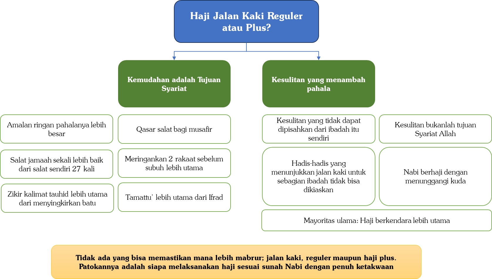

---

[^1]: Zâd al-Ma’âd (1/57).
[^2]: Silsilah al-Ahâdîts adh-Dha’îfah (1/373), No. 207.
[^3]: Zâd al-Ma’âd (1/57).
[^4]: Adhwâ` al-Bayân (4/440-441).
[^5]: Al-Fatâwâ al-Kubrâ (5/383), lihat juga Majmû’ al-Fatâwâ (26/133).
[^6]: Nihâyah al-Mathlab fî-Dirâyah al-Madzhab (4/311), sebagaimana dinukil juga oleh an-Nawawi di al-Majmû’ Syarh al-Muhadzdzab (8/113).
[^7]: Al-Majmû’ Syarh al-Muhadzdzab (8/112-113), demikian juga an-Nawawi menyatakan pernyataan yang sama dalam kitabnya Al-Îdhâh fî Manâsik al-Hajji wa-al-’Umrah, hlm. 282.
[^8]: I’ânah at-Thâlibin (2/325).
[^9]: Tuhfah al-Muhtâj fî Syarh Al-Minhâj (4/108).
[^10]: Ibnu Abbas berkata, قَالَ لِي رَسُولُ اللهِ صَلَّى اللهُ عَلَيْهِ وَسَلَّمَ غَدَاةَ الْعَقَبَةِ، وَهُوَ وَاقِفٌ عَلَى رَاحِلَتِهِ: ((هَاتِ الْقُطْ لِي)) فَلَقَطْتُ لَهُ حَصَيَاتٍ هُنَّ حَصَى الْخَذْفِ، فَوَضَعَهُنَّ فِي يَدِهِ، فَقَالَ: ((بِأَمْثَالِ هَؤُلَاءِ)) مَرَّتَيْنِ، وَقَالَ بِيَدِهِ - فَأَشَارَ يَحْيَى أَنَّهُ رَفَعَهَا - وَقَالَ: ((إِيَّاكُمْ وَالْغُلُوَّ؛ فَإِنَّمَا هَلَكَ مَنْ كَانَ قَبْلَكُمْ بِالْغُلُوِّ فِي الدِّينِ)) “Rasulullah ﷺ berkata kepadaku di pagi hari melempar jamrah Aqabah, sementara beliau menunggangi ontanya, ‘Carikan buatku (kerikil).’ Maka aku pun mengambil untuk beliau kerikil-kerikil yaitu kerikil ukuran untuk mengutik. Lalu beliau meletakkan kerikil-kerikil tersebut di tangan beliau dan berkata sebanyak dua kali, ‘Seperti (ukuran) kerikil-kerikil inilah (kalian melempar).’ Dan beliau berkata dengan mengangkat tangannya, ‘Waspadalah kalian dari sikap berlebih-lebihan dalam agama. Karena sesungguhnya umat sebelum kalian dibinasakan oleh sikap berlebihan dalam agama’.” (HR. Ibnu Majah, No. 3029 dan Ahmad, No. 1851 dan 3248).
[^11]: Lihat Al-Majmû’ Syarh al-Muhadzdzab (8/124). Al-Imam Ahmad berkata “Ambillah kerikil dari mana saja yang kau kehendaki.” [Asy-Syarh al-Kabîr, Ibnu Qudamah al-Maqdisi (9/188)].
[^12]: Zahir hadis Ibnu Abbas menunjukkan Nabi Muhammad ﷺ menyuruh beliau mencari kerikil adalah di perjalanan menjelang melempar jamrah Aqabah di Mina. Akan tetapi para salaf (seperti Ibnu Umar radhiyallâhu 'anhu dan Sa’id bin Jubair rahimahullâh) mereka mengambil kerikil dari Muzdalifah untuk melempar. Sehingga tatkala tiba di Mina yang pertama mereka lakukan adalah melempar dan tidak sibuk lagi mencari-cari kerikil. [Lihat: Asy-Syarh al-Kabîr, Ibnu Qudamah al-Maqdisi (9/188)].
[^13]: Di antara yang diizinkan oleh Nabi ﷺ untuk meninggalkan Muzdalifah sebelum Subuh adalah Ummul mukminin Saudah binti (HR. Al-Bukhari, No. 1681 dan Muslim, No. 1290), Ummul Mukminin Ummu Habibah (HR. Muslim, No. 1292), Ibnu Abbas bersama keluarganya yang digolongkan lemah (HR. Al-Bukhari, No. 1678 dan Muslim, No. 1293). Dan ini juga dilakukan oleh Ibnu Umardi mana beliau menyuruh orang-orang yang lemah dari keluarganya untuk meninggalkan Muzdalifah sebelum Subuh, dan beliau beralasan Nabi ﷺ memberi keringanan kepada orang-orang lemah (HR. Al-Bukhari, No. 1676 dan Muslim, No. 1295). Demikian juga Asma’ binti Abu Bakar meninggalkan Muzdalifah sebelum subuh bahwa Nabi membolehkan para wanita untuk itu (HR. Al-Bukhari, No. 1679 dan Muslim, No. 1291).
[^14]: HR. Muslim, No. 1293.
[^15]: HR. Al-Bukhari, No. 1679 dan Muslim No. 1291.
[^16]: kebanyakan jemaah haji sekarang yang tergabung dalam satu travel atau satu KBIH, mereka dihukumi satu grup sangat sulit memilah-milih antara yang kuat dan yang lemah. Oleh karena itulah mereka boleh meninggalkan Muzdalifah setelah lewat tengah malam meskipun jika bertahan hingga subuh tentu hal itu lebih afdal. Syekh Bin Baz berkata, إِذَا كَانَ الْحُجَّاجُّ مَعَهُ نِسَاءٌ فَلَهُمُ الرُّخْصَةُ أَنْ يَنْصَرِفُوا مِنْ مُزْدَلِفَة فِي النِّصْفِ الأَخِيْرِ مِنَ اللَّيْلِ لَيْلَةِ النَّحْرِ؛ لأَنَّ النَّبِيَّ ﷺ رَخَّصَ لِلضَّعَفَةِ مِنْ أَهْلِهِ أَنْ يَنْصَرِفُوا مِنْهَا بِلَيْلٍ، وَهَذَا ثَابِتٌ عَنْهُ عَلَيْهِ الصَّلاَةُ وَالسَّلاَمُ، وَالَّذِي يَظْهَرُ: أَنَّ أَصْحَابَهُمْ مِثْلُهُمْ، فَالَّذِيْنَ مَعَ النِّسَاءِ مِنَ الرِّجَالِ الْقَوَّامِيْنَ عَلَيْهِنَّ وَالرِّفَاقِ الَّذِيْنَ مَعَهُمْ، الَّذِي يَظْهَرُ: أَنَّهُمْ شَيْءٌ وَاحِدٌ، فَإِذَا سُمِحَ لِلضُّعَفَاءِ أَنْ يَنْصَرِفُوا فَالَّذِيْنَ مَعَهُمْ كَذَلِكَ مَسْمُوْحٌ لَهُمُ الاِنْصِرَافُ...إِذَا كَانُوا فِي سَيَّارَةٍ وَاحِدَةٍ تَجْمَعُ رِجَالاً وَنِسَاءً وَشَبَاباً وَشِيْباً فَهَؤُلاَءِ دَرْبُهُمْ وَاحِدٌ، وَلاَ حَرَجَ -إِنْ شَاءَ اللهُ- فِي انْصِرَافِهِمْ جَمِيْعاً وَذَهَابِهِمْ إِلَى مِنَى آخِرَ اللَّيْلِ وَرَمْيِهِمْ الْجَمْرَةَ، وَذَهَابِهِمْ إِلَى مَكَّةَ، كُلُّ هَذَا لاَ حَرَجَ فِيْهِ إِنْ شَاءَ اللهُ؛ لِأَنَّ الضَّعِيْفَ يَتْبَعُهُ الْقَوِيُّ الَّذِي هُوَ فِي رُفْقَتِهِ أَوْ فِي الْقِيَامِ عَلَى شُئُوْنِهِ “Jika para jemaah haji bersama para wanita maka boleh bagi mereka untuk meninggalkan Muzdalifah setelah lewat tengah malam, yaitu malam hari an-Nahr, karena Nabi ﷺ memberi keringanan/rukhsah kepada istri-istri beliau untuk meninggalkan Muzdalifah di malam hari. Ini telah valid dari Nabi ﷺ. Yang nampak bahwasanya orang-orang yang bersama orang-orang yang lemah juga hukumnya seperti mereka. Maka mereka para lelaki yang mengurusi para wanita demikian juga teman perjalanan yang menemani mereka yang nampaknya mereka dihukumi satu kesatuan. Jika dibolehkan bagi yang lemah (para wanita) untuk meninggalkan Muzdalifah maka dibolehkan juga bagi orang-orang yang bersama para wanita untuk meninggalkan Muzdalifah… Jika mereka berada di satu mobil yang mengumpulkan para lelaki, para wanita, para pemuda, dan para orang-orang tua, maka mereka itu satu jalan (rombongan), dan tidak mengapa -insya Allah- bagi mereka semuanya untuk meninggalkan Muzdalifah dan pergi ke Mina di akhir malam, boleh untuk melempar jamarat, boleh bagi mereka ke Makkah (Masjidilharam untuk tawaf dan sai -pen). Hal ini semua tidak mengapa insya Allah, karena orang yang lemah (hukumnya) diikuti oleh orang yang kuat yang merupakan satu rombongan atau mengurusi urusan yang lemah”[Fatâwâ Nûr ‘Alâ Ad-Darb, Syekh Bin Baz (17/429-430)].
[^17]: Majmû’ Fatâwâ Ibn Bâz (17/287).
[^18]: Al-Majmû’ Syarh al-Muhadzdzab (8/243-244).
[^19]: () Lihat: Al-Majmû’ Syarh al-Muhadzdzab, An-Nawawi (8/243) dan al-Hâwi al-Kabîr, al-Mawardi (4/204). Telah datang hadis tentang mewakilkan pelemparan, dari Jabir bin Abdillah beliau berkata, حَجَجْنَا مَعَ رَسُولِ اللهِ صَلَّى اللهُ عَلَيْهِ وَسَلَّمَ، وَمَعَنَا النِّسَاءُ وَالصِّبْيَانُ، فَلَبَّيْنَا عَنِ الصِّبْيَانِ، وَرَمَيْنَا عَنْهُمْ “Kami berhaji bersama Rasulullah ﷺ. Bersama kami ada para wanita dan anak-anak. Maka kami pun bertalbiah atas nama anak-anak, dan kami melemparkan () untuk mereka.” (HR. Ahmad, No. 14370, akan tetapi sanadnya lemah, karena pada sanadnya ada perawi Asy’ats bin Sawwar, dan mayoritas ulama menilainya lemah).
[^20]: melempar jamrah Nabi ﷺ tidak mudah memberi uzur. Nabi mengizinkan para wanita dan orang-orang lemah untuk keluar dari Muzdalifah lebih cepat agar mereka bisa langsung melempar jamrah dan menghindari keramaian. Nabi tidak memberi keringanan bagi mereka untuk mewakilkan Demikian juga Nabi ﷺ memberi keringanan kepada para penggembala untuk tidak mabit di Mina akan tetapi Nabi tetap memerintahkan mereka untuk melempar jamrah di malam hari, bahkan Nabi membolehkan mereka untuk melempar meskipun dengan cara di jamak. Ini menunjukkan tidak boleh bermudah-mudahan dalam mewakilkan kepada orang lain kecuali jika benar-benar beruzur. dan kepadatan jemaah haji bukanlah uzur untuk mewakilkan [Lihat: Majmû’ Fatâwâ wa-Rasâ`il al-‘Utsaimin (23/107-108)].
[^21]: Hal ini disebabkan oleh beberapa hal: Pertama: Tidak boleh baginya untuk menggantikan melaksanakan ibadah orang lain sementara dia sendiri belum melaksanakan ibadah tersebut. Kedua: Jika dia melemparkan orang lain terlebih dahulu, maka lemparan tersebut adalah untuk dirinya sendiri, sebagaimana jika seorang belum berhaji kemudian dia menghajikan orang lain, maka haji tersebut adalah untuk diri sendiri.
[^22]: disyaratkan melempar ketiga terlebih dahulu untuk dirinya lalu lagi dari awal (al- as-) untuk melemparkan yang mewakilkan tidak ada dalil yang mengharuskan demikian hal ini tentu mendatangkan kesulitan yang luar biasa, terlebih zaman sekarang padat jalur untuk melempar jauh dan -putar untuk menghindari kemacetan. [Lihat: Majmû’ Fatâwâ Ibn Bâz 16/86 dan Majmû’ Fatâwâ wa-Rasâ`il al-‘Utsaimin (24/309)].
[^23]: HR. Abu Daud, No. 1941 dan disahihkan oleh al-Albani.
[^24]: HR. Al-Bukhari, No. 1676 dan Muslim, No. 1295.
[^25]: Para ulama berselisih tentang awal waktu kebolehan melempar Jamrah Aqabah: Pertama: Awal waktu melempar adalah terbitnya matahari. Ini adalah pendapat Mujahid, an-Nakha`i, at-Tsauri, Abu Tsaur, dan Ishaq. Kedua: Awal waktu melempar adalah terbitnya fajar. Ini adalah pendapat Abu Hanifah, Malik dan Ahmad. Menurut mereka barang siapa yang melempar jamrah Aqabah sebelum terbit fajar, maka dia harus mengulang lemparan. a Ketiga: Dan pendapat yang ketiga inilah yang lebih kuat berdasarkan dalil-dalil yang ada.
[^26]: HR. Abu Daud, No. 1943 dan dinyatakan sahih oleh al-Albani.
[^27]: Al-Mabsûth (12/18), lihat juga Badâ`i’ ash-Shanâ`i’, al-Kasyani (5/63), Râdd al-Muhtâr ‘alâ ad-Durr al-Mukhtâr, Ibnu ‘Abidin (6/315).
[^28]: Al-Mudawwanah (1/550).
[^29]: Lihat: Al-Kâfî fî Fiqhi Ahli al-Madînah, Ibnu Abdil Barr (1/418).
[^30]: Lihat: Mawâhib al-Jalîl Syarh Mukhtashar al-Khalîl (2/190) dan Syarh Mukhtashar al-Khalîl, al-Khurasyi (2/98), (3/34) dan (3/33).
[^31]: Al-Majmû’ Syarh al-Muhadzdzab, an-Nawawi (8/383).
[^32]: HR. Al-Bukhari, No. 5548.
[^33]: Al-Mughnî, (3/383).
[^34]: Lihat pernyataan Ibnul Qayyim dalam Zâd al-Ma’âd (2/243).
[^35]: HR. Al-Bukhari, No. 5548.
[^36]: HR. Al-Hakim, 1717 dan Abu Daud dalam Sunannya No. 1751 dan disahihkan al-Hakim dan disepakati oleh adz-Dzhabi dan juga disahihkan oleh al-Albani dan al-Arnauth. [Lihat penjelasan Ibnu Hajar di Fath al-Bârî (3/551)].
[^37]: Lihat penjelasan al-Qurthubi yang dinukil dan didukung oleh Ibnu Hajar dalam Fath al-Bârî (10/6). Hal ini menguatkan bahwa yang dimaksud dalam hadis tersebut bukanlah kurban, melainkan penyembelihan hewan hadyu.
[^38]: HR. Muslim, No. 1977.
[^39]: HR. Muslim, No. 1977. Lihat penjelasan perbedaan antara Sya’r dan Basyar dalam ‘Aun al-Ma’bûd (7/349).
[^40]: HR. Muslim, No. 1977.
[^41]: Faedah-Faedah di atas diringkas dari kitab Ahâdîts ‘Asyr Dzilhijjah, Abdullah Fauzan, hlm. 8-10.
[^42]: Lihat: Nihayah al-Muhtâj, ar-Romli (3/360) dan Tuhfah al-Muhtâj, Ibna Hajr al-Haitami (4/199).
[^43]: Abu Bakar al-Haddad al-Yamani (wafat 800 H) dari mazhab Hanafiah berkata, لَا يَجُوزُ ذَبْحُهُ قَبْلَ يَوْمِ النَّحْرِ إجْمَاعًا وَهُوَ دَمُ التَّمَتُّعِ وَالْقِرَانِ وَالْأُضْحِيَّةِ “Tidak boleh disembelih sebelum hari an-Nahr. berdasarkan ijmak, yaitu dam Tamattu’, Kiran dan udhiyah (kurban).” [Al-Jauharah an-Nayyirah ‘Alâ Mukhtashar al-Qudûri (2/222-223)]. Silakan lihat juga perkataan Syamsuddin as-Sarakhsi dalam kitab al-Mabsûth, cetakan Dârul Ma’rifah, Lebanon, (4/109-110).
[^44]: Ada dua pendapat di kalangan ulama mazhab Malikiah tentang kapan seseorang yang berhaji Tamattu’ terkena kewajiban dam Tamattu’? Syamsuddin at-Tharabulsi berkata, وَإِذَا عُلِمَ ذَلِكَ فَتَحَصَّلَ أَنَّ فِي وَقْتِ وُجُوبِهِ طَرِيقَتَيْنِ: إِحْدَاهُمَا لِابْنِ رُشْدٍ وَابْنِ الْعَرَبِيِّ وَصَاحِبِ الطِّرَازِ وَابْنِ عَرَفَةَ أَنَّهُ إنَّمَا يَجِبُ بِرَمْيِ جَمْرَةِ الْعَقَبَةِ أَوْ بِخُرُوجِ وَقْتِ الْوُقُوفِ، وَالثَّانِيَةَ لِلَّخَمِيِّ، وَمَنْ تَبِعَهُ: أَنَّهُ يَجِبُ بِإِحْرَامِ الْحَجِّ، وَالطَّرِيقَةُ الْأُولَى: أَظْهَرُ؛ لِأَنَّ ثَمَرَةَ الْوُجُوبِ إنَّمَا تَظْهَرُ فِيمَا إذَا مَاتَ الْمُتَمَتِّعُ “Jika diketahui demikian maka kesimpulannya tentang wajibnya dam/hadyu Tamattu’ ada dua pendapat: Pertama adalah pendapat Ibnu Rusyd, Ibnul Arabi, Penulis kita at-Thiraz, dan Ibnu Arafah bahwasanya hanyalah wajib jika sang haji telah melempar jamrah Aqabah (yaitu pagi hari Nahr-pen) atau dengan keluarnya/berakhirnya waktu wukuf di Arafah. Kedua: Pendapat al-Lakhami dan para ulama yang mengikutinya bahwasanya wajibnya tatkala berihram haji. Pendapat yang pertama lebih utama, karena buah dari khilafnya nampak jika sang haji Tamattu’ meninggal…(yaitu meninggal sebelum melempar jamrah Aqabah, apakah ia tetap wajib membayar dam Tamattu’?-pen).” [Mawâhib al-Jalîl (3/60-61)]. Dari dua pendapat di atas sangat jelas bahwa tidak ada seorang ulama Malikiah yang memandang bolehnya menyembelih dam Tamattu’ setelah umrah. Karena waktu minimal wajibnya dam Tamattu’ (sebagaimana pendapat al-Lakhomi) adalah ketika berihram dengan ihram haji. Karena itulah bentuk awal penggabungan antara umrah dan haji. [Lihat: Mawâhib al-Jalîl (3/61)]. Dan hal ini bukan berarti jika jamaah haji telah berihram haji pada tanggal 8 Dzulhijjah, maka secara otomatis boleh memotong dam Tamattu’ sebelum hari an-Nahr. Akan tetapi, maksudnya adalah jika dia meninggal sebelum hari an-Nahr dan setelah berihram haji, maka dia tetap terkena tanggungan hutang menyembelih dam Tamattu’, dan penyembelihannya tetap dilaksanakan pada hari an-Nahr. Syamsuddin At-Tharabulsi berkata, وَهُوَ يَدُلُّ عَلَى أَنَّهُ لَا يُجْزِئُ نَحْرُهُ قَبْلَ ذَلِكَ، وَاَللَّهُ أَعْلَمُ. وَنُصُوصُ أَهْلِ الْمَذْهَبِ شَاهِدَةٌ لِذَلِكَ قَالَ الْقَاضِي عَبْدُ الْوَهَّابِ فِي الْمَعُونَةِ، وَلَا يَجُوزُ نَحْرُ هَدْيِ التَّمَتُّعِ وَالْقِرَانِ قَبْلَ يَوْمِ النَّحْرِ خِلَافًا لِلشَّافِعِيِّ “Dan ini menunjukkan bahwasanya tidak sah penyembelihan dam Tamattu’ sebelum hari Nahr, Wallâhu a’lam. Pernyataan-pernyataan dari para ulama mazhab Maliki mendukung akan hal ini. Al-Qadhi Abdul Wahhab dalam kitab al-Ma’ûnah berkata, ‘Tidak boleh menyembelih dam Tamattu’ dan Kiran sebelum hari Nahr, berbeda dengan pendapat Asy-Syafi’i’.”  [Mawâhib al-Jalîl (3/62)].
[^45]: Ibnu Qudamah berkata, فَأَمَّا وَقْتُ إخْرَاجِهِ فَيَوْمُ النَّحْرِ. وَبِهِ قَالَ مَالِكٌ، وَأَبُو حَنِيفَةَ؛ لِأَنَّ مَا قَبْلَ يَوْمِ النَّحْرِ لَا يَجُوزُ فِيهِ ذَبْحُ الْأُضْحِيَّةِ، فَلَا يَجُوزُ فِيهِ ذَبْحُ هَدْيِ التَّمَتُّعِ “Adapun waktu menyembelihnya adalah pada hari an-Nahr, dan ini adalah pendapat Malik dan Abu Hanifah. Karena sebelum hari an-Nahr. tidak boleh menyembelih Udhiyah (kurban), maka tidak boleh menyembelih dam Tamattu’.” [Al-Mughnî (3/416), lihat juga al-Inshâf fî Ma’rifah ar-Râjih min-al-Khilâf, al-Mirdawi (3/444-445)].
[^46]: Talbîd adalah meletakan sesuatu—semacam minyak—di rambut kepala agar rambut tidak menjadi semrawut.
[^47]: HR. Al-Bukhari, No. 1566, dan Muslim, No. 1229.
[^48]: HR. Al-Bukhari, No. 1652.
[^49]: HR. Al-Bukhari, No. 1652.
[^50]: Silahkan lihat: )
[^51]: Al-Imam asy-Syafi’i rahimahullâh berkata, وَإِذَا سَاقَ الْمُتَمَتِّعُ الْهَدْيَ مَعَهُ أَوْ الْقَارِنُ لِمُتْعَتِهِ أَوْ قِرَانِهِ فَلَوْ تَرَكَهُ حَتَّى يَنْحَرَهُ يَوْمَ النَّحْرِ كَانَ أَحَبَّ إلَيَّ وَإِنْ قَدِمَ فَنَحَرَهُ فِي الْحَرَمِ أَجْزَأَ عَنْهُ “Jika seorang haji Tamattu’ membawa hadyu (hewan dam) bersamanya karena mut’ahnya, atau seorang haji Kiran membawa hadyu karena Kirannya, maka ia membiarkan hadyunya hingga ia baru menyembelihnya tatkala hari an-Nahr. maka itu lebih aku sukai. Dan jika ia tiba (sebelum hari an-Nahr-pen) lalu ia menyembelihnya di tanah haram maka sudah sah.” [Al-Umm (2/238)]. Al-Imam Ahmad dalam satu riwayatnya juga membolehkan menyembelih sebelum hari an-Nahr. Ibnu Qudamah berkata, وَقَالَ أَبُو طَالِبٍ: سَمِعْت أَحْمَدْ، قَالَ فِي الرَّجُلِ يَدْخُلُ مَكَّةَ فِي شَوَّالٍ وَمَعَهُ هَدْيٌ. قَالَ: يَنْحَرُ بِمَكَّةَ، وَإِنْ قَدِمَ قَبْلَ الْعَشْرِ نَحَرَهُ، لَا يَضِيعُ أَوْ يَمُوتُ أَوْ يُسْرَقُ “Abu Thalib berkata, ‘Aku mendengar Ahmad berkata tentang seseorang yang masuk di kota Makkah di bulan Syawal sambil membawa hadyu: “Orang tersebut menyembelih di Makkah. Jika ia datang sebelum 10 hari Dzulhijjah maka ia menyembelihnya hingga tidak hilang hewan hadyunya atau mati atau dicuri”.’” [Al-Mughnî (3/416)].
[^52]: Al-Imam an-Nawawi berkata tentang ayat ini, أَيْ بِسَبَبِ الْعُمْرَةِ؛ لِأَنَّهُ إِنَّمَا يَتَمَتَّعُ بِمَحْظُورَاتِ الْإِحْرَامِ بَيْنَ الْحَجِّ وَالْعُمْرَةِ بِسَبَبِ الْعُمْرَةِ “Yaitu dikarenakan umrah (ia wajib memotong dam Tamattu’) karena ia berTamattu’ (bersenang-senang) dengan melakukan hal-hal yang dilarang dalam ihram antara haji dan umrah disebabkan umrah tersebut.” [Al-Majmû’ (7/184)]. Ar-Rafi’i rahimahullâh berkata, فَالدِّمَاءُ الْوَاجِبَةُ فِي الْإِحْرَامِ إِمَّا لِارْتِكَابِ مَحْظُورَاتٍ، أَوْ جَبْرًا لِتَرْكِ مَأْمُورٍ، لَا اخْتِصَاصَ لَهَا بِزَمَانٍ، بَلْ يَجُوزُ ذَبْحُهَا فِي يَوْمِ النَّحْرِ وَغَيْرِهِ، وَإِنَّمَا الضَّحَايَا هِيَ الَّتِي تَخْتَصُّ بِيَوْمِ النَّحْرِ وَأَيَّامِ التَّشْرِيقِ. وَعَنْ أَبِي حَنِيفَةَ رَحِمَهُ اللَّهُ: إِنَّ دَمَ الْقِرَانِ وَالتَّمَتُّعِ لَا يَجُوزُ ذَبْحُهُ قَبْلَ يَوْمِ النَّحْرِ. لَنَا: الْقِيَاسُ عَلَى جَزَاءِ الصَّيْدِ، وَدَمِ التَّطَيُّبِ، وَالْحَلْقِ “Maka dam-dam yang wajib dalam ihram karena melanggar larangan atau sebagai penambal karena meninggalkan yang diperintahkan, maka tidak dikhususkan (waktu penyembelihannya) dengan waktu tertentu. Bahkan boleh disembelih pada hari an-Nahr. dan juga hari-hari yang lain. Yang terkhususkan dengan waktu hari an-Nahr. dan hari-hari Tasyrik hanyalah udhiyah. Dari Abu Hanifah rahimahullâh bahwasanya beliau memandang dam Kiran dan Tamattu’ tidak boleh disembelih sebelum hari an-Nahr. Dalil kami (ulama syafi’iyyah) adalah bolehnya dengan mengiaskan terhadap fidyah berburu dan dam karena memakai minyak wangi dan mencukur.” [Al-‘Azîz Syarh al-Wajîz (8/83)].
[^53]: Al-Imam an-Nawawi rahimahullâh berkata, وَاحْتَجَّ بِهِ مَالِكٌ وَأَبُو حَنِيفَةَ فِي أَنَّ دَمَ التَّمَتُّعِ لَا يَجُوزُ قَبْلَ يَوْمِ النَّحْرِ بِالْقِيَاسِ عَلَى الْأُضْحِيَّةِ. وَاحْتَجَّ أَصْحَابُنَا عَلَيْهِمَا بِالْآيَةِ الْكَرِيمَةِ، وَلِأَنَّهُمَا وَافَقَا عَلَى جَوَازِ صَوْمِ التَّمَتُّعِ قَبْلَ يَوْمِ النَّحْرِ، أَعْنِي صَوْمَ الْأَيَّامِ الثَّلَاثَةِ، فَالْهَدْيُ أَوْلَى. وَلِأَنَّهُ دَمُ جُبْرَانٍ، فَجَازَ بَعْدَ وُجُوبِهِ وَقَبْلَ يَوْمِ النَّحْرِ، كَدَمِ فِدْيَةِ الطِّيبِ وَاللِّبَاسِ وَغَيْرِهِمَا. يُخَالِفُ الْأُضْحِيَّةَ؛ لِأَنَّهَا مَنْصُوصٌ عَلَى وَقْتِهَا، وَاللَّهُ أَعْلَمُ. “Al-Imam Malik dan Abu Hanifah berdalil bahwa dam Tamattu’ tidak boleh disembelih sebelum hari an-Nahr. dengan qiyas terhadap udhiyah (kurban). Para ulama Syafi’iyyah berdalil membantah mereka berdua (Malik dan Abu Hanifah) dengan ayat yang mulia. Dan juga mereka berdua sepakat akan bolehnya puasa Tamattu’ –yaitu maksudku puasa tiga hari (bagi yang tidak mendapatkan dam-pen) sebelum hari an-Nahr. Maka al-Hadyu (Dam Tamattu’) lebih utama untuk boleh disembelih sebelum hari an-Nahr. Juga karena dam Tamattu’ adalah dam jabrân (penambal kekurangan-pen) maka boleh disembelih setelah tiba waktu kewajibannya (yaitu setelah umrah Tamattu’-pen) dan sebelum hari an-Nahr. sebagaimana dam fidyah (karena memakai) minyak wangi, pakaian berjahit, dan selainnya. Hal ini berbeda dengan udhiyah (kurban) karena telah ada nasnya yang menunjukkan akan waktunya yang telah ditentukan pada hari an-Nahr.” [Al-Majmû’ (7/184)].
[^54]: Fatâwâ Tata’allaq bi-Ahkâm al-Hajj wa-al-‘Umrah, hlm. 14.
[^55]: Majmû’ Fatâwâ wa-Rasâ`il al-‘Utsaimin (11/238).
[^56]: HR. Al-Bukhari, No. 305.
[^57]: 
[^58]: Artikel ini ditulis oleh dr. Ridwan Mahmuddin, SpOG.
[^59]: Detail penelitian terkait hal ini dapat dilihat dalam: Berek SJ, et al., Berek & Novak's Gynecology, 15th ed. (Philadelphia: Lippincott Williams & Wilkins, 2012); Papadakis MA, et al., Current Medical Diagnosis & Treatment (New York: McGraw-Hill Education, 2016); Cunningham FG, et al., Williams Obstetrics, 25th ed. (New York: McGraw-Hill Education, 2018); Baziad A, Wiweko B, Hendarto H, Kiat Mengatur Pola Haid saat Haji dan Umrah: Mekanisme Dasar, Masalah dan Solusinya (Jakarta: Himpunan Endokrinologi Reproduksi dan Fertilitas Indonesia, 2007); Royal College of Obstetricians and Gynaecologists, Management of Unscheduled Bleeding in Women Using Hormonal Contraception (London: RCOG, 2009).
[^60]: Wajib bagi setiap orang yang berniat ihram untuk berihram di mikat, berdasarkan hadis Ibnu Abbas radhiyallâhu ‘anhumâ, إِنَّ النَّبِيَّ صَلَّى اللهُ عَلَيْهِ وَسَلَّمَ وَقَّتَ لِأَهْلِ الْمَدِينَةِ ذَا الحُلَيْفَةِ، وَلِأَهْلِ الشَّامِ الجُحْفَةَ، وَلِأَهْلِ نَجْدٍ قَرْنَ الْمَنَازِلِ، وَلِأَهْلِ اليَمَنِ يَلَمْلَمَ، هُنَّ لَهُنَّ، وَلِمَنْ أَتَى عَلَيْهِنَّ مِنْ غَيْرِهِنَّ مِمَّنْ أَرَادَ الحَجَّ وَالعُمْرَةَ، وَمَنْ كَانَ دُونَ ذَلِكَ، فَمِنْ حَيْثُ أَنْشَأَ حَتَّى أَهْلُ مَكَّةَ مِنْ مَكَّةَ “Sesungguhnya Rasulullah ﷺ telah menetapkan mikat bagi penduduk Madinah di Dzul Hulaifah, bagi penduduk Syam di al-Juhfah, bagi penduduk Najd di al-Qarn al-Manazil, dan bagi penduduk Yaman di Yalamlam. Mikat-mikat tersebut diperuntukkan bagi penduduknya dan bagi siapa saja yang melewatinya yang hendak berhaji atau umrah. Adapun yang tinggal di antara mikat dan Makkah, maka ia berihram dari tempat tinggalnya, termasuk penduduk Makkah yang berihram dari Makkah.” (HR. Al-Bukhari, No. 1524). Wanita haid yang mendarat di Madinah dan hendak umrah atau haji wajib berihram di Dzul Hulaifah meskipun dalam kondisi haid, dan tidak boleh menundanya hingga tiba di Makkah. Nabi ﷺ memerintahkan Asma’ binti Umais yang sedang nifas untuk tetap berihram di Dzul Hulaifah, dengan bersabda, اغْتَسِلِي وَاسْتَثْفِرِي بِثَوْبٍ وَأَحْرِمِي “Mandilah, tutuplah area nifas dengan kain, dan berihramlah.” (HR. Muslim No. 1218). Para ulama sepakat bahwa hukum wanita haid sama dengan wanita nifas dalam masalah ini.
[^61]: Al-Majmû’ Syarh al-Muhadzdzab (8/16).
[^62]: Adapun penutup kepala yang mudah dibuka, seperti songkok dan gutrah (syimagh) yang biasa dipakai orang Arab Saudi, tidak boleh diusap ketika berwudu. [Lihat: Asy-Syarh al-Mumti’ (1/236)]. Demikian pula bagi wanita: jika penutup kepalanya bukan jilbab melainkan hanya kerudung atau kain yang diletakkan di atas kepala dan mudah dilepas, maka tidak boleh diusap ketika berwudu.
[^63]: HR. Muslim, No. 275.
[^64]: Al-Minhâj Syarh Shahîh Muslim (3/147).
[^65]: Hadis-hadis tentang mengusap sorban datang dalam dua bentuk. Pertama, mengusap sebagian rambut di ubun-ubun lalu dilanjutkan mengusap sorban. Dari al-Mughirah bin Syu’bah, أَنَّ النَّبِيَّ صَلَّى اللهُ عَلَيْهِ وَسَلَّمَ تَوَضَّأَ فَمَسَحَ بِنَاصِيَتِهِ وَعَلَى الْعِمَامَةِ وَعَلَى الْخُفَّيْنِ “Bahwasanya Nabi ﷺ berwudu, lalu beliau mengusap ubun-ubun, mengusap sorban, dan mengusap kedua khuf beliau.” (HR. Al-Bukhari, No. 182, dan Muslim, No. 274). Kedua, mengusap sorban saja tanpa mengusap sebagian kepala. Dari Amr bin Umayyah: رَأَيْتُ النَّبِيَّ صَلَّى اللهُ عَلَيْهِ وَسَلَّمَ يَمْسَحُ عَلَى عِمَامَتِهِ وَخُفَّيْهِ “Aku melihat Nabi ﷺ mengusap sorban dan kedua khuf beliau.” (HR. Al-Bukhari, No. 205). Demikian pula hadis Bilal yang telah disebutkan di atas. Zahir hadis Amr bin Umayyah dan hadis Bilal menunjukkan bolehnya mengusap sorban saja tanpa harus mengusap sebagian kepala, selama sorban tersebut menutup seluruh kepala.
[^66]: Lihat penjelasan Syekh Abdul Muhsin az-Zamil di:
[^67]: Lihat: Fatâwâ asy-Syaikh Ibn Bâz (11/391).
[^68]: Fatâwâ Nûr ‘alâ ad-Darb, Ibn Baz 10/381-382).
[^69]: Al-Mu’jam al-Ausath (5/325), No. 5444.
[^70]: HR. At-Tirmidzi, No. 241.
[^71]: Lihat: Silsilah al-Ahâdîts ash-Shahîhah (4/629), No. 1979.
[^72]: Al-Albani telah menyebutkan jalur periwayatannya dalam Silsilah al-Ahâdîts ash-Shahîhah, (6/314) No. 2652.
[^73]: HR. Al-Bukhari, No. 2996.
[^74]: Hadis dengan lafal yang tegas menyebutkan pahala salat di Masjidilharam seratus ribu kali lipat diriwayatkan dari dua sahabat. Pertama, dari Jabir bin Abdillah radhiyallâhu ‘anhumâ (HR. Ahmad No. 14694 dan Ibnu Majah No. 1406, dengan sanad yang sahih; lihat: al-Irwâ’, No. 1129). Kedua, dari Abdullah bin Az-Zubair radhiyallâhu ‘anhumâ (HR. Al-Bazzar No. 2196, Ibnu Hibban, No. 1620, ath-Thabrani dalam al-Kabîr, No. 269, al-Baihaqi dalam asy-Syu’ab No. 3846-3847, dan as-Sunan al-Kubrâ, No. 10278).
[^75]: Al-Majmû’, (3/197).
[^76]: Sebagaimana dinukil Ibnu Hajar dalam Fath al-Bârî (3/64).
[^77]: Tuhfah al-Muhtâj, (3/466).
[^78]: Al-Âdâb asy-Syar’iyyah, (3/429).
[^79]: Fatâwâ al-‘Utsaimin, 12/395),
[^80]: HR. Muslim, No. 1396 dari Ummul Mukminin Maimunah radhiyallâhu 'anhâ.
[^81]: Al-Mausû’ah al-Fiqhiyyah al-Kuwaitiyyah (17/200-201) dan (37/239), serta dipilih oleh Syekh Bin Baz [Fatâwâ Ibn Bâz, (4/130) dan para ulama al-Lajnah ad-Dâ`imah [Fatâwâ al-Lajnah (6/223)].
[^82]: Lihat penjelasan al-Mawardi di Hâsyiah Kifâyah al-Muhtâj, hlm. 106.
[^83]: Ahkâm al-Qur`ân,(1/89-90).
[^84]: Ahkâm al-Qur`ân (1/90).
[^85]: HR. Abu Daud ath-Thayalisi dalam Musnadnya, No. 1464, dengan sanad yang hasan.
[^86]: HR. Ahmad, No. 18910, sanadnya hasan.
[^87]: Mushannaf Abdurrazzaq, No. 8870.
[^88]: HR. Abu Daud, No. 554 dan an-Nasa`i, No. 843 dari Ubay bin Ka’ab, dinyatakan hasan al-Albani.
[^89]: Dinyatakan sahih oleh al-Albani dalam ash-Shahîhah, No. 1912.
[^90]: Majmû’ al-Fatâwâ, (31/220).
[^91]: Lihat: Tharhu at-Tatsrîb (2/301).
[^92]: () Para ulama sepakat bahwa mengangkat tangan disunahkan pada takbir pertama. Adapun pada takbir kedua, ketiga, dan seterusnya, para ulama berselisih. Ibnul Mundzir berkata, وَأَجْمَعُوا عَلَى أَنَّ الْمُصَلِّيَ عَلَى الْجَنَازَةِ يَرْفَعُ يَدَيْهِ فِي أَوَّلِ تَكْبِيرَةٍ يُكَبِّرُهَا “Para ulama telah sepakat bahwa orang yang salat jenazah mengangkat kedua tangannya pada takbir yang pertama.” (Al-Ijmâ’, hlm. 44, No. 84). Jumhur ulama berpendapat bahwa kedua tangan diangkat pada setiap kali takbir. (Lihat penjelasan at-Tirmidzi dalam Sunannya setelah hadis No. 1077). Hal ini dikuatkan oleh riwayat yang sahih dari Ibnu Umar radhiyallâhu ‘anhumâ, bahwa beliau mengangkat kedua tangannya pada setiap takbir dalam salat jenazah. Al-Bukhari meriwayatkannya secara ta’liq dalam Bab Sunnah ash-Shalâh ‘alâ al-Janâzah, dan disambungkan dalam kitabnya Raf’u al-Yadain, أَنَّهُ كَانَ يَرْفَعُ يَدَيْهِ فِي كُلِّ تَكْبِيرَةٍ عَلَى الْجَنَازَة “Bahwasanya Ibnu Umar mengangkat kedua tangannya pada setiap takbir dalam salat jenazah.” [Raf’u al-Yadain, hlm. 74, No. 106; lihat juga Fath al-Bârî, (3/190)].
[^93]: () Membaca Al-Fâtihah dalam salat jenazah diperselisihkan para ulama. [Lihat: Fath al-Bârî, Ibnu Hajar, 3/203]. Ibnu Taimiyyah rahimahullâh berkata, وَتَنَازَعَ الْعُلَمَاءُ فِي الْقِرَاءَةِ عَلَى الْجِنَازَةِ عَلَى ثَلَاثَةِ أَقْوَالٍ: قِيلَ لَا تُسْتَحَبُّ بِحَالٍ كَمَا هُوَ مَذْهَبُ أَبِي حَنِيفَةَ وَمَالِكٍ. وَقِيلَ بَلْ يَجِبُ فِيهَا الْقِرَاءَةُ بِالْفَاتِحَةِ كَمَا يَقُولُهُ مَنْ يَقُولُهُ مِنْ أَصْحَابِ الشَّافِعِيِّ وَأَحْمَدَ. وَقِيلَ بَلْ قِرَاءَةُ الْفَاتِحَةِ فِيهَا سُنَّةٌ وَإِنْ لَمْ يَقْرَأْ بَلْ دَعَا بِلَا قِرَاءَةٍ جَازَ وَهَذَا هُوَ الصَّوَابُ “Para ulama berselisih tentang membaca al-Fâtihah dalam salat jenazah menjadi tiga pendapat. Pertama, tidak disyariatkan sama sekali, ini pendapat Abu Hanifah, [Lihat: ‘Umdah al-Qârî, (8/139)] dan Malik [Syarh Shahîh al-Bukhârî, Ibnu Baththal, (3/317)]. Kedua, wajib membaca al-Fâtihah, ini pendapat sebagian ulama Syafi’iyah dan Hanabilah. Ketiga, membaca al-Fâtihah adalah sunah; jika tidak dibaca dan hanya berdoa saja, maka dibolehkan, dan inilah pendapat yang benar.” [Majmû’ al-Fatâwâ, (22/274)]. Perselisihan ini muncul karena telah sahih diriwayatkan bahwa Ibnu Umar salat jenazah tanpa membaca Al-Fâtihah. Dari Nafi’, ia berkata, أَنَّ عَبْدَ اللهِ بْنَ عُمَرَ كَانَ لَا يَقْرَأُ فِي الصَّلَاةِ عَلَى الْجِنَازَةِ “Bahwasanya Ibnu Umar tidak membaca Al-Fâtihah dalam salat jenazah.” (HR. Malik, No. 777). Di sisi lain, hadis-hadis lain menunjukkan wajibnya membaca al-Fâtihah dalam salat, seperti sabda Nabi ﷺ, ((لَا صَلَاةَ لِمَنْ لَمْ يَقْرَأْ بِفَاتِحَةِ الْكِتَابِ)) “Tidak ada salat bagi orang yang tidak membaca al-Fâtihah.” (HR. Al-Bukhari, No. 714 dan Muslim, No. 595). Salat jenazah termasuk salat sebagaimana Allah menamakannya dengan “salat” dalam firman-Nya, “Dan janganlah engkau sekali-kali menyalatkan (jenazah) seorang pun yang mati di antara mereka (kaum munafik)” (QS. At-Taubah: 84). Nabi ﷺ pun menyebutnya salat dalam sabda-sabda beliau seperti “Shalatlah atas jenazah sahabat kalian” dan “Barang siapa yang menyalatkan jenazah...”. Demikian pula Ibnu Abbas pernah menjaharkan al-Fâtihah dalam salat jenazah (HR. Al-Bukhari, No. 1335) dan menjelaskan bahwa itu adalah sunah Nabi ﷺ. [Lihat: Asy-Syarh al-Mumti’, (5/318)]. Maka untuk lebih berhati-hati, hendaknya seseorang membaca al-Fâtihah dalam salat jenazah.
[^94]: () Berdasarkan hadis Ibnu Abbas, dari Thalhah bin Abdullah bin ‘Auf, ia berkata, صَلَّيْتُ خَلْفَ ابْنِ عَبَّاسٍ رَضِيَ اللهُ عَنْهُمَا عَلَى جَنَازَةٍ فَقَرَأَ بِفَاتِحَةِ الْكِتَابِ وَسُورَةٍ وَجَهَرَ حَتَّى أَسْمَعَنَا، فَلَمَّا فَرَغَ أَخَذْتُ بِيَدِهِ فَسَأَلْتُهُ فَقَالَ: سُنَّةٌ وَحَقٌّ “Aku salat bermakmum kepada Ibnu Abbas radhiyallâhu ‘anhumâ dalam salat jenazah. Beliau membaca al-Fâtihah dan sebuah surah, dan menjaharkan bacaannya hingga kami mendengarnya. Setelah selesai aku memegang tangannya dan bertanya. Beliau menjawab, ‘Ini adalah sunah dan kebenaran.’“(HR. An-Nasa’i, No. 1987, disahihkan al-Albani). Adapun jumhur ulama berpendapat tidak disyariatkan membaca surah setelah al-Fâtihah sama sekali, karena riwayat di atas dinilai syadz. Yang sahih adalah riwayat Ibnu Abbas dalam Shahîh al-Bukhâri tanpa tambahan membaca surah. Dari Thalhah bin Abdullah bin Auf, صَلَّيْتُ خَلْفَ ابْنِ عَبَّاسٍ رَضِيَ اللهُ عَنْهُمَا عَلَى جَنَازَةٍ فَقَرَأَ بِفَاتِحَةِ الْكِتَابِ قَالَ: لِيَعْلَمُوا أَنَّهَا سُنَّةٌ “Aku salat bermakmum kepada Ibnu Abbas radhiyallâhu ‘anhumâ dalam salat jenazah, dan beliau membaca al-Fâtihah. Beliau berkata, ‘Agar mereka tahu bahwa membaca al-Fâtihah adalah sunah Nabi.’“(HR. Al-Bukhari, No. 1335). Al-Baihaqi setelah meriwayatkan atsar Ibnu Abbas yang menyebutkan pembacaan surah, berkata, “Penyebutan ‘surah’ dalam riwayat ini tidak mahfuzh (tidak terjaga).” [As-Sunan al-Kubrâ, (4/26), No. 6954). Namun pernyataan Al-Baihaqi ini diselisihi ulama lain yang memandang tambahan “membaca surah” adalah tambahan yang sahih, di antaranya: an-Nawawi [Al-Majmû’, (5/234)] dan Ibnu Hajar [At-Talkhîsh, 95/165)]. Lihat juga penjelasan Al-Albani dalam Ashl Shifah ash-Shalâh, (2/555), serta Dzakhîratul ‘Uqbâ, al-Ityubi, (19/321)].
[^95]: () Berdasarkan hadis Abu Umamah bin Sahl bin Hunaif, ia menyebutkan bahwa sebagian sahabat Rasulullah ﷺ mengabarkan kepadanya, أَنَّ السُّنَّةَ فِي الصَّلَاةِ عَلَى الْجِنَازَةِ أَنْ يُكَبِّرَ الْإِمَامُ ثُمَّ يَقْرَأَ بِفَاتِحَةِ الْكِتَابِ بَعْدَ التَّكْبِيرَةِ الْأُولَى سِرًّا فِي نَفْسِهِ ثُمَّ يُصَلِّيَ عَلَى النَّبِيِّ صَلَّى اللهُ عَلَيْهِ وَسَلَّمَ “Bahwa sunah dalam salat jenazah adalah imam bertakbir, lalu membaca al-Fâtihah secara sirr (pelan) setelah takbir pertama, kemudian berselawat kepada Nabi ﷺ.” (HR. Al-Hakim, No. 1331 dan al-Baihaqi dalam as-Sunan al-Kubrâ, No. 6959 dan 6962).
[^96]: HR. Al-Bukhari, No. 3369 dan Muslim No. 407.
[^97]: HR. Abu Daud, No. 3201, dinyatakan sahih Al-Albani.
[^98]: HR. Muslim, No. 963.
[^99]: Lihat: Majmû’ Fatâwâ wa-Rasâ`il al-‘Utsaimin (17/103).
[^100]: Al-Azhim Abadi berkata, وَأَمَّا الصَّلَاةُ عَلَى الطِّفْلِ الَّذِي لَمْ يَبْلُغِ الْحُلُمَ فَكَالصَّلَاةِ عَلَى الْكَبِيرِ، وَلَمْ يَثْبُتْ عَنِ النَّبِيِّ بِسَنَدٍ صَحِيحٍ أَنَّهُ عَلَّمَ أَصْحَابَهُ دُعَاءً آخَرَ لِلْمَيِّتِ الصَّغِيرِ غَيْرَ الدُّعَاءِ الَّذِي عَلَّمَهُمْ لِلْمَيِّتِ الْكَبِيرِ، بَلْ كَانَ يَقُولُ: ((اللَّهُمَّ اغْفِرْ لِحَيِّنَا وَمَيِّتِنَا وَشَاهِدِنَا وَغَائِبِنَا وَصَغِيرِنَا وَكَبِيرِنَا)) “Adapun salat atas jenazah anak kecil yang belum balig, maka hukumnya sama dengan salat atas jenazah orang dewasa. Tidak valid dari Nabi ﷺ dengan sanad yang sahih bahwa beliau mengajarkan kepada para sahabat doa khusus untuk jenazah anak kecil selain doa yang diajarkan untuk jenazah orang dewasa. Bahkan beliau berdoa dengan, ((اللَّهُمَّ اغْفِرْ لِحَيِّنَا وَمَيِّتِنَا، وَشَاهِدِنَا وَغَائِبِنَا، وَصَغِيرِنَا وَكَبِيرِنَا)) ‘Ya Allah, ampunilah yang hidup dan yang telah wafat di antara kami, yang hadir dan yang tidak hadir, yang masih kecil dan yang sudah tua.’” [‘Aun al-Ma’bûd, (8/362)] Ini merupakan isyarat bahwa al-Azhim Abadi berpendapat bolehnya berdoa untuk jenazah anak kecil dengan doa yang sama yang digunakan untuk jenazah orang dewasa.
[^101]: Shahîh al-Bukhâri, (2/89), Bab Qirâ’ah Fâtihah al-Kitâb ‘alâ al-Janâzah.
[^102]: Al-Mughnî, Ibnu Qudamah, (2/365).
[^103]: Al-Mughnî, (2/365).
[^104]: Telah datang dalam hadis-hadis dan atsar sahabat yang sahih bahwa Nabi ﷺ pernah bertakbir dalam salat jenazah lebih dari empat kali, yaitu lima kali, tujuh kali, bahkan sembilan kali. Karenanya, boleh seseorang bertakbir lebih dari empat kali, dan sesekali melakukannya untuk menunjukkan bahwa hal itu pun termasuk sunah Nabi ﷺ. Namun jika seseorang ingin menetapkan satu cara saja, hendaknya ia bertakbir empat kali, karena hadis-hadis yang menunjukkan takbir empat kali jumlahnya lebih banyak. (Lihat: Ahkâm al-Janâ’iz, al-Albani, hlm. 111-114). Ibnul Qayyim rahimahullâh berkata, وَهَذِهِ آثَارٌ صَحِيحَةٌ فَلَا مُوجِبَ لِلْمَنْعِ مِنْهَا، وَالنَّبِيُّ صَلَّى اللهُ عَلَيْهِ وَسَلَّمَ لَمْ يَمْنَعْ مِمَّا زَادَ عَلَى الْأَرْبَعِ بَلْ فَعَلَهُ هُوَ وَأَصْحَابُهُ مِنْ بَعْدِهِ “Ini adalah atsar-atsar yang sahih, sehingga tidak ada alasan untuk melarang bertakbir lebih dari empat kali. Nabi ﷺ pun tidak melarangnya, bahkan beliau sendiri melakukannya dan para sahabat setelah beliau pun demikian.” [Zâd al-Ma’âd, (1/489)].
[^105]: Ini adalah pendapat mayoritas ulama, baik dari kalangan salaf maupun khalaf. Sebagian ulama, di antaranya Abu Hanifah dan salah satu pendapat asy-Syafi’i, berpendapat dua salam dengan mengiaskannya kepada salat-salat lainnya. [Lihat: Al-Istidzkâr, Ibnu Abdil Barr (3/32); pendapat Syafi’iyah dalam al-Majmû’, an-Nawawi (5/240); dan pendapat Hanafiyah dalam al-Mabsûth, as-Sarakhsi, (2/64)]. Ibnu Qudamah berkata, التَّسْلِيمُ عَلَى الْجِنَازَةِ تَسْلِيمَةٌ وَاحِدَةٌ عَنْ سِتَّةٍ مِنْ أَصْحَابِ النَّبِيِّ صَلَّى اللهُ عَلَيْهِ وَسَلَّمَ وَلَيْسَ فِيهِ اخْتِلَافٌ إِلَّا عَنْ إِبْرَاهِيمَ... وَلَمْ يُعْرَفْ لَهُمْ مُخَالِفٌ فِي عَصْرِهِمْ فَكَانَ إِجْمَاعًا. قَالَ أَحْمَدُ: لَيْسَ فِيهِ اخْتِلَافٌ إِلَّا عَنْ إِبْرَاهِيمَ “Salam dalam salat jenazah adalah satu salam, diriwayatkan dari enam sahabat Nabi ﷺ, tidak ada perselisihan kecuali dari Ibrahim an-Nakha`i (seorang tabiin)... dan tidak diketahui ada yang menyelisihi para sahabat tersebut di zaman mereka, maka ini adalah perkara ijmak. Imam Ahmad berkata: ‘Tidak ada perselisihan kecuali dari Ibrahim an-Nakha`i.’“[Al-Mughnî, (2/366)] Adapun yang berpendapat dua salam berdalil dengan hadis Ibnu Mas’ud, di mana beliau berkata, ثَلَاثُ خِلَالٍ كَانَ رَسُولُ اللهِ صَلَّى اللهُ عَلَيْهِ وَسَلَّمَ يَفْعَلُهُنَّ تَرَكَهُنَّ النَّاسُ، إِحْدَاهُنَّ: التَّسْلِيمُ عَلَى الْجِنَازَةِ مِثْلُ التَّسْلِيمِ فِي الصَّلَاةِ “Tiga perkara yang biasa dilakukan Nabi ﷺ namun ditinggalkan orang-orang; salah satunya adalah mengucapkan salam dalam salat jenazah sebagaimana mengucapkan salam dalam salat.” [HR. Al-Baihaqi, No. 6989; sanadnya dinilai baik oleh an-Nawawi dalam al-Majmû’ (5/239), dan dinyatakan hasan al-Albani dalam Ahkâm al-Janâ`iz, hlm. 127). Namun penunjukan hadis ini tidak begitu tegas, karena perkataan Ibnu Mas’ud “salam dalam salat jenazah seperti salam dalam salat lainnya” tidak pasti bermakna dua kali salam. Masih ada kemungkinan maksudnya adalah bahwa salat jenazah pun memiliki salam sebagaimana salat biasa, tanpa berkaitan dengan jumlahnya. Terlebih lagi, telah datang hadis yang menunjukkan bahwa Nabi ﷺ hanya salam sekali. Dari Abu Hurairah radhiyallâhu ‘anhu, أَنَّ رَسُولَ اللهِ صَلَّى اللهُ عَلَيْهِ وَسَلَّمَ صَلَّى عَلَى جِنَازَةٍ فَكَبَّرَ عَلَيْهَا أَرْبَعًا وَسَلَّمَ تَسْلِيمَةً وَاحِدَةً “Bahwa Rasulullah ﷺ menyalatkan jenazah, bertakbir empat kali, dan mengucapkan salam sekali.” (HR. Ad-Daruquthni No. 1817, Al-Hakim No. 1332, dan Al-Baihaqi No. 6982; dinyatakan hasan al-Albani dalam Ahkâm al-Janâ`iz, hlm. 129)]. Lagipula salat jenazah memang salat yang ringan karena tujuan utamanya adalah berdoa, sehingga salam sekali sudah mencukupi.
[^106]: Al-Mabsûth, (2/66).
[^107]: Lihat khilaf permasalahan ini di al-Mughnî, Ibnu Qudamah (2/369).
[^108]: Demikian pula jika ia tertinggal takbir kedua: ketika mengqadanya, cukup membaca selawat yang paling ringkas, yaitu “Allâhumma shalli ‘alâ Muhammad”, agar ia bisa menyelesaikan salatnya sebelum jenazah diangkat.
[^109]: Al-Mughnî (2/369).
[^110]: Lihat: Al-Mughnî (2/370).
[^111]: Lihat Majmû’ Fatâwâ wa-Rasâ`il al-‘Utsaimin (17/103).
[^112]: Al-Mughnî (2/385).
[^113]: Lihat: Al-Mausû’ah al-Fiqhiyyah al-Kuwaitiyyah, (16/28).
[^114]: HR. Al-Baihaqi, No. 6937, dinyatakan sahih oleh al-Albani dalam Ahkâm al-Janâ`iz, hlm. 126.
[^115]: Asy-Syarh al-Mumti’, (5/336).
[^116]: Asy-Syarh al-Mumti’, (5/337).
[^117]: Lihat: Al-Ijmâ’, Ibnul Mundzir, hlm. 59.
[^118]: Ini adalah mazhab Syafi’iyah [Lihat: Al-Majmû’, an-Nawawi, (7/98)], Hanabilah [Lihat: Asy-Syarh al-Kabîr, Ibnu Qudamah (3/183)], dan azh-Zhahiriyah. Bahkan menurut Ibnu Hazm, penunaian haji dengan hartanya lebih didahulukan daripada membayar utang kepada manusia, karena utang kepada Allah lebih utama untuk ditunaikan. [Lihat: Al-Muhallâ, Ibnu Hazm (5/41) masalah No. 818].
[^119]: () Buraidah radhiyallâhu ‘anhu berkata, بَيْنَا أَنَا جَالِسٌ عِنْدَ رَسُولِ اللهِ صَلَّى اللهُ عَلَيْهِ وَسَلَّمَ، إِذْ أَتَتْهُ امْرَأَةٌ، فَقَالَتْ: إِنِّي تَصَدَّقْتُ عَلَى أُمِّي بِجَارِيَةٍ، وَإِنَّهَا مَاتَتْ، قَالَ: فَقَالَ: ((وَجَبَ أَجْرُكِ، وَرَدَّهَا عَلَيْكِ الْمِيرَاثُ)) قَالَتْ: يَا رَسُولَ اللهِ، إِنَّهُ كَانَ عَلَيْهَا صَوْمُ شَهْرٍ، أَفَأَصُومُ عَنْهَا؟ قَالَ: ((صُومِي عَنْهَا)) قَالَتْ: إِنَّهَا لَمْ تَحُجَّ قَطُّ، أَفَأَحُجُّ عَنْهَا؟ قَالَ: ((حُجِّي عَنْهَا)) “Ketika aku sedang duduk di sisi Rasulullah ﷺ, tiba-tiba datang seorang wanita dan berkata, ‘Aku pernah menyedekahkan seorang budak perempuan kepada ibuku, dan ibuku telah meninggal.’ Nabi bersabda, ‘Pahalamu telah tetap, dan warisan mengembalikan budak itu kepadamu.’ Wanita itu berkata, ‘Ya Rasulullah, ibuku punya kewajiban puasa sebulan, bolehkah aku berpuasa untuknya?’ Nabi menjawab, ‘Berpuasalah untuknya.’ Ia berkata lagi, ‘Ibuku belum pernah berhaji sama sekali, bolehkah aku menghajikannya?’ Nabi menjawab, ‘Hajikanlah dia.’“(HR. Muslim, No. 1149). Dari Ibnu Abbas radhiyallâhu ‘anhumâ, أَنَّ امْرَأَةً مِنْ جُهَيْنَةَ، جَاءَتْ إِلَى النَّبِيِّ صَلَّى اللهُ عَلَيْهِ وَسَلَّمَ، فَقَالَتْ: إِنَّ أُمِّي نَذَرَتْ أَنْ تَحُجَّ فَلَمْ تَحُجَّ حَتَّى مَاتَتْ، أَفَأَحُجُّ عَنْهَا؟ قَالَ: ((نَعَمْ حُجِّي عَنْهَا، أَرَأَيْتِ لَوْ كَانَ عَلَى أُمِّكِ دَيْنٌ أَكُنْتِ قَاضِيَةً؟ اقْضُوا اللَّهَ فَاللَّهُ أَحَقُّ بِالوَفَاءِ)) “Seorang wanita dari Juhainah datang kepada Nabi ﷺ dan berkata, ‘Ibuku pernah bernazar untuk berhaji, namun ia meninggal sebelum sempat berhaji. Bolehkah aku menghajikannya?’ Nabi menjawab, ‘Ya, hajikan ibumu. Bagaimana menurutmu jika ibumu punya utang, apakah engkau melunasinya? Tunaikanlah kepada Allah, karena Allah lebih berhak untuk dipenuhi utang kepada-Nya.’“(HR. Al-Bukhari, No. 1852). Jika haji yang wajib karena nazar saja hendaknya ditunaikan atas nama mayat, maka haji Islam (haji pertama) tentu lebih utama lagi untuk ditunaikan. Demikian pula fatwa Ibnu Abbas radhiyallâhu ‘anhumâ dalam masalah ini. Dari ‘Ikrimah, ia berkata, جَاءَتِ امْرَأَةٌ إِلَى ابْنِ عَبَّاسٍ فَقَالَتْ: إِنْ أُمِّي مَاتَتْ وَعَلَيْهَا حَجَّةٌ، أَفَأَقْضِيهَا عَنْهَا؟ فَقَالَ ابْنُ عَبَّاسٍ: هَلْ كَانَ عَلَى أُمِّكِ دَيْنٌ؟ قَالَتْ: نَعَمْ: قَالَ: فَكَيْفَ صَنَعْتِ؟ قَالَتْ: قَضَيْتُهُ عَنْهَا، قَالَ ابْنُ عَبَّاسٍ: فَاللَّهُ خَيْرُ غُرَمَائِكِ “Seorang wanita datang kepada Ibnu Abbas dan berkata, ‘Ibuku meninggal dalam keadaan masih berkewajiban haji, bolehkah aku mengqadanya?’ Ibnu Abbas bertanya, ‘Apakah ibumu punya utang?’ Ia menjawab, ‘Ya.’ Ibnu Abbas bertanya lagi, ‘Apa yang kamu lakukan?’ Ia menjawab, ‘Aku melunasinya.’ Ibnu Abbas berkata, ‘Maka Allah adalah yang paling berhak untuk kamu lunasi.’“(Atsar riwayat Ibnu Abi Syaibah dalam al-Mushannaf No. 15006)
[^120]: Lihat penjelasan an-Nawawi dalam al-Majmû’, (7/110). Adapun dalilnya, dari Ibnu Abbas radhiyallâhu ‘anhumâ, أَتَى رَجُلٌ النَّبِيَّ صَلَّى اللهُ عَلَيْهِ وَسَلَّمَ فَقَالَ لَهُ: إِنَّ أُخْتِي قَدْ نَذَرَتْ أَنْ تَحُجَّ وَإِنَّهَا مَاتَتْ. فَقَالَ النَّبِيُّ صَلَّى اللهُ عَلَيْهِ وَسَلَّمَ: ((لَوْ كَانَ عَلَيْهَا دَيْنٌ أَكُنْتَ قَاضِيَهُ؟)) قَالَ: نَعَمْ. قَالَ: ((فَاقْضِ اللهَ فَهُوَ أَحَقُّ بِالْقَضَاءِ)) “Seorang lelaki menemui Nabi ﷺ dan berkata, ‘Saudariku telah bernazar untuk berhaji, namun ia telah meninggal.’ Nabi ﷺ bertanya, ‘Seandainya saudarimu punya tanggungan utang, apakah engkau akan melunasinya?’ Ia menjawab, ‘Ya.’ Nabi bersabda, ‘Maka tunaikanlah kepada Allah, karena Allah lebih berhak untuk dipenuhi utang kepada-Nya.’“(HR. Al-Bukhari, No. 6699) Dalam hadis ini Nabi ﷺ tidak memperinci dan tidak bertanya apakah lelaki tersebut ahli waris saudarinya. Ini menunjukkan bahwa hukumnya bersifat umum: badal haji boleh dilakukan oleh ahli waris maupun bukan, baik laki-laki maupun perempuan. Nabi ﷺ juga mengiaskan utang haji dengan utang harta; jika utang harta boleh dilunasi oleh siapa saja tanpa harus sepengetahuan orang yang berutang, maka demikian pula dengan haji.
[^121]: Ini adalah pendapat Syafi’iyah, namun dengan syarat sang mayat semasa hidupnya telah mewasiatkan hal tersebut [Lihat: Al-Majmû’, (7/114)]. Ini juga merupakan pendapat mazhab Hanbali [Lihat: Al-Mughnî, Ibnu Qudamah, (3/224)] dan pendapat yang dipilih oleh Syekh Bin Baz [Lihat: Majmû’ Fatâwâ Ibn Bâz, (16/405)]. Beliau pernah ditanya tentang boleh tidaknya seseorang menghajikan ibunya yang telah meninggal, sementara semasa hidupnya sang ibu telah berhaji tujuh kali. Beliau menyatakan hal tersebut dibolehkan dan merupakan bentuk bakti kepada ibu yang mendatangkan pahala yang besar.
[^122]: Ini adalah salah satu pendapat mazhab Syafi’iyah [Lihat: Al-Majmû’, (7/114) dan pendapat yang dipilih oleh al-‘Utsaimin [Lihat: Majmû’ Fatâwâ wa-Rasâ’il al-‘Utsaimin, (21/141)]. Menurut beliau, badal haji untuk haji wajib (haji Islam) dibolehkan karena darurat semata, sehingga tidak bisa dikiaskan dengan haji sunah.
[^123]: HR. Al-Bukhari, No. 1513, dan Muslim, No. 1334.
[^124]: Lihat: Al-Mughnî, Ibnu Qudamah (3/226-227).
[^125]: Ini adalah pendapat jumhur ulama
[^126]: HR. Abu Daud, No. 1811, Ibnu Majah, No. 2903, Ibnu Khuzaimah, No. 3039, Ibnu Hibban, No. 3988, dan ath-Thabrani, No. 12419, dinyatakan sahih oleh al-Albani dan al-Arna’uth.
[^127]: () Telah lalu bahwa Ibnu Abbas radhiyallâhu ‘anhumâ meriwayatkan ketika haji Wadak, seorang wanita dari Khats’am bertanya kepada Nabi ﷺ, يَا رَسُولَ اللهِ إِنَّ فَرِيضَةَ اللهِ عَلَى عِبَادِهِ فِي الْحَجِّ أَدْرَكَتْ أَبِي شَيْخًا كَبِيرًا لَا يَثْبُتُ عَلَى الرَّاحِلَةِ أَفَأَحُجُّ عَنْهُ؟ “Wahai Rasulullah, kewajiban haji yang Allah wajibkan kepada para hamba-Nya telah mengenai ayahku yang sudah sangat tua dan tidak mampu duduk tegak di atas kendaraan. Bolehkah aku menghajikannya?” Nabi ﷺ menjawab, “Ya.” (HR. Al-Bukhari, No. 1513, dan Muslim, No. 1334). Hadis ini sangat jelas menunjukkan seorang wanita menghajikan seorang laki-laki. Ibnu Qudamah berkata, يَجُوزُ أَنْ يَنُوبَ الرَّجُلُ عَنِ الرَّجُلِ وَالْمَرْأَةِ، وَالْمَرْأَةُ عَنِ الرَّجُلِ وَالْمَرْأَةِ فِي الْحَجِّ فِي قَوْلِ عَامَّةِ أَهْلِ الْعِلْمِ، لَا نَعْلَمُ فِيهِ مُخَالِفًا إِلَّا الْحَسَنَ بْنَ صَالِحٍ فَإِنَّهُ كَرِهَ حَجَّ الْمَرْأَةِ عَنِ الرَّجُلِ “Boleh bagi seorang laki-laki menghajikan laki-laki maupun perempuan, dan boleh bagi seorang perempuan menghajikan laki-laki maupun perempuan, menurut pendapat seluruh ulama. Kami tidak mengetahui seorang pun yang menyelisihi hal ini kecuali Al-Hasan bin Shalih, yang memakruhkan seorang perempuan menghajikan seorang laki-laki.” [Al-Mughnî, (3/226)].
[^128]: Fatâwâ al-Lajnah ad-Dâ’imah, (11/77-78).
[^129]: Lihat: Ad-Diyâ’ al-Lâmi’ min-al-Khuthab al-Jawâmi’, al-Utsaimin (2/478).
[^130]: Lihat: Fatâwâ al-Lajnah ad-Dâ’imah (11/172).
[^131]: Lihat: Fatâwâ al-Lajnah ad-Dâ’imah (11/58).
[^132]: HR. Ahmad, No. 5866, Ibnu Khuzaimah dalam Shahîh-nya, No. 2027.
[^133]: HR. Ibnu Hibban, dalam Shahîh-nya, No. 354.
[^134]: HR. Al-Bukhari, No. 39.
[^135]: HR. Al-Bukhari, No. 3560.
[^136]: HR. Al-Bukhari, No. 6682, dan Muslim, No. 2694.
[^137]: HR. Muslim, No. 35.
[^138]: HR. Abu Dawud, No. 3299.
[^139]: HR. Ahmad, No. 17291.
[^140]: HR. Al-Bukhari, No. 1787 dan Muslim, No. 1211.
[^141]: Majmû’ Fatâwâ (25/281-282).
[^142]: HR. Muslim, No. 663.
[^143]: HR. Abu Daud, No. 345, at-Tirmidzi, No. 496, an-Nasa`i, No. 1384, Ibnu Majah, No. 1087. Dinyatakan sahih oleh al-Albani.
[^144]: Lihat: Al-Majmû’, an-Nawawi (7/92).
[^145]: Al-Majmû’, (7/91).
[^146]: Al-Majmû’, (7/91).
[^147]: Adhwâ’ al-Bayân (4/301).
[^148]: HR. Al-Bukhari, No. 1211, dan Muslim, No. 1787.
