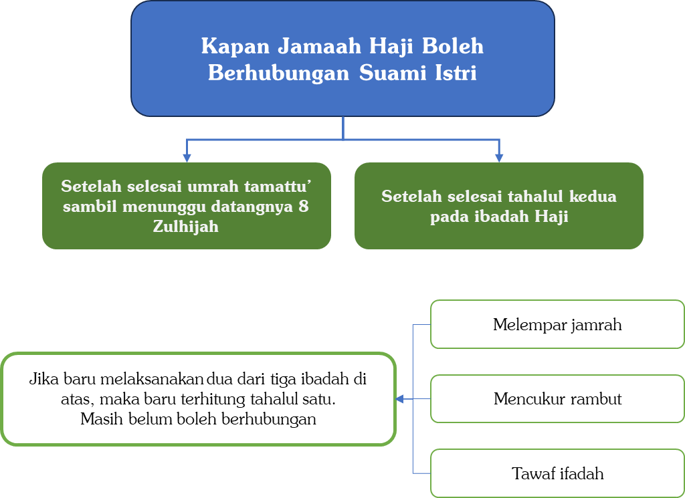
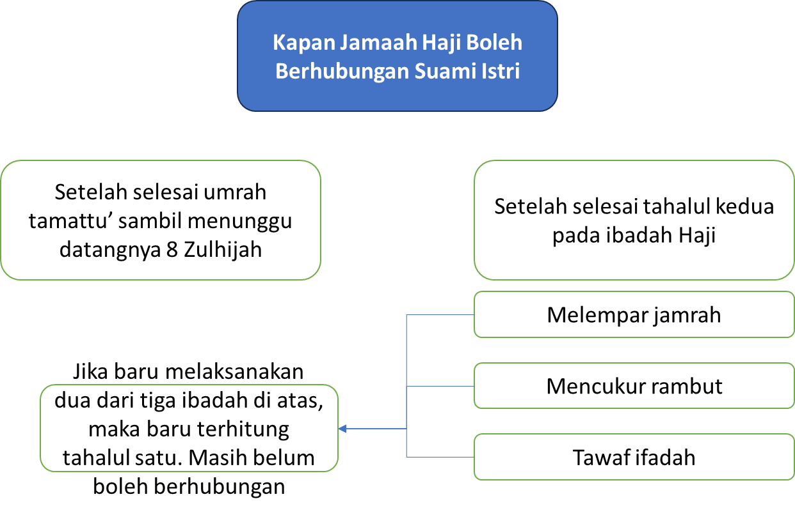
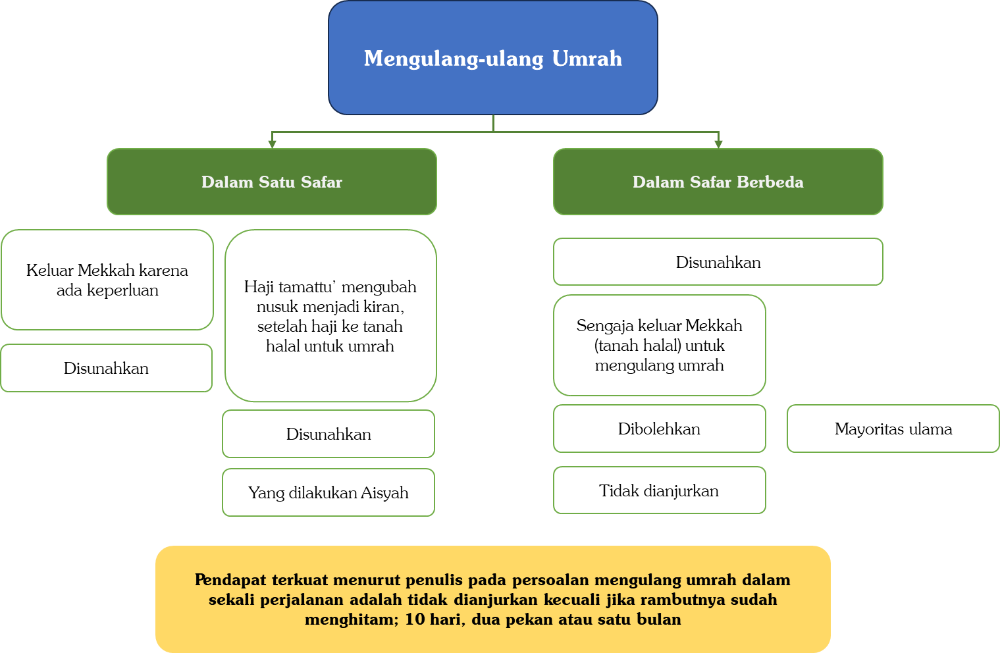
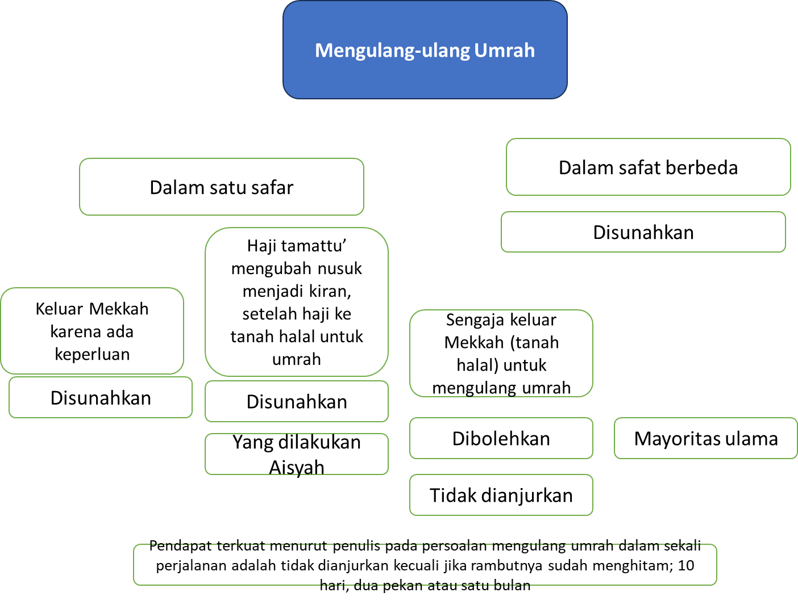
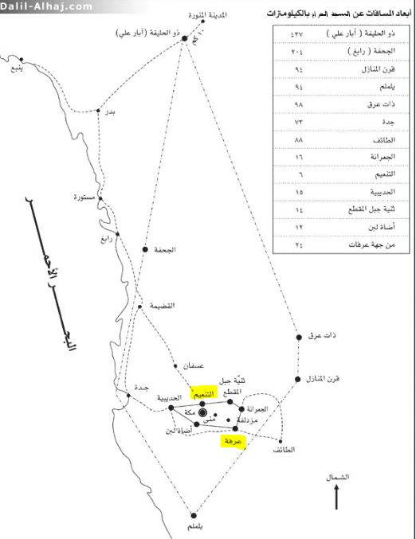
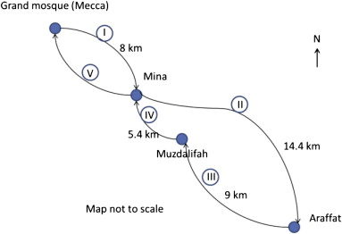
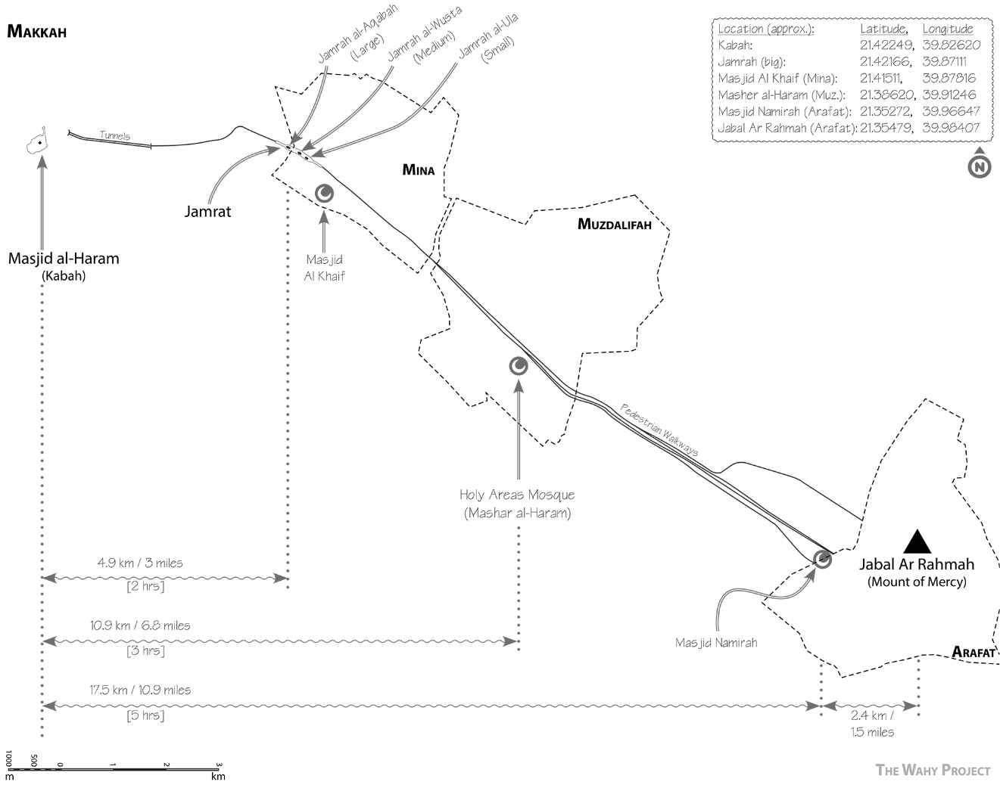

Pertanyaan 2: Kapankah seorang suami boleh menggauli istrinya selama musim haji?

Jawab:

Di antara hal yang tampaknya sepele namun ternyata penting adalah mengetahui kapan seorang yang datang ke Tanah Suci boleh menggauli istrinya. Ternyata banyak jamaah haji Indonesia yang belum memahami perincian ini, sehingga sebagian dari mereka menahan diri padahal sebenarnya dibolehkan.

Untuk memahami persoalan ini, kita cukup mengetahui kapan hubungan intim itu dilarang. Sebab, selain waktu-waktu terlarang itu, hukumnya diperbolehkan.

Seseorang hanya dilarang menggauli pasangannya ketika sedang dalam keadaan berihram, baik ihram umrah maupun ihram haji. Setelah bertahalul dari ihram umrah atau ihram haji, hubungan intim kembali dibolehkan.

Tahalul dalam Umrah dan Haji

Dalam umrah, proses tahalul hanya satu: selesai tawaf dan sai lalu bertahalul dengan mencukur rambut. Setelah itu seseorang sudah boleh kembali menggauli istrinya.

Adapun dalam haji, proses tahalul ada dua: tahalul pertama dan tahalul kedua. Tahalul pertama membolehkan kembali perkara-perkara yang sebelumnya dilarang selama ihram, seperti memakai wewangian, mengenakan pakaian biasa, menutup kepala, serta bagi wanita boleh kembali memakai cadar dan kaos tangan. Namun hubungan intim dengan istri belum dibolehkan. Seseorang baru boleh menggauli istrinya setelah tahalul kedua.

Apa Itu Tahalul Pertama dan Tahalul Kedua?

Untuk memahami ini, perlu diketahui bahwa pada tanggal 10 Zulhijah (hari an-Nahr) ada tiga kegiatan inti haji yang berkaitan dengan proses tahalul, yaitu: (1) melempar jamrah Aqabah, (2) mencukur rambut, dan (3) tawaf dan sai haji.[^1]

Meskipun Nabi ﷺ melakukan ketiganya secara berurutan, beliau membolehkan ketiganya dikerjakan dalam urutan yang berbeda. Tidaklah Nabi ﷺ pada hari itu ditanya tentang suatu amalan yang didahulukan atau diakhirkan kecuali beliau membolehkannya. Abdullah bin Amr bin al-Ash berkata,

```arabic
أَنَّ رَسُولَ اللهِ صَلَّى اللهُ عَلَيْهِ وَسَلَّمَ وَقَفَ فِي حَجَّةِ الْوَدَاعِ فَجَعَلُوا يَسْأَلُونَهُ، فَقَالَ رَجُلٌ: لَمْ أَشْعُرْ فَحَلَقْتُ قَبْلَ أَنْ أَذْبَحَ. قَالَ: ((اذْبَحْ وَلَا حَرَجَ)). فَجَاءَ آخَرُ فَقَالَ: لَمْ أَشْعُرْ فَنَحَرْتُ قَبْلَ أَنْ أَرْمِيَ. قَالَ: ((ارْمِ وَلَا حَرَجَ)). فَمَا سُئِلَ يَوْمَئِذٍ عَنْ شَيْءٍ قُدِّمَ وَلَا أُخِّرَ إِلَّا قَالَ: ((افْعَلْ وَلَا حَرَجَ))
```

“Rasulullah ﷺ berdiri ketika haji Wadak (dalam riwayat lain: di sisi jamrah Aqabah), lalu orang-orang pun bertanya kepada beliau. Seorang berkata, ‘Aku tidak sadar, ternyata aku menggundul kepala sebelum menyembelih.’ Nabi menjawab, ‘Sembelihlah, tidak mengapa.’ Lalu datang orang lain berkata, ‘Aku tidak sadar, ternyata aku menyembelih sebelum melempar jamrah Aqabah.’ Nabi menjawab, ‘Lempar saja, tidak mengapa.’ Maka tidaklah Nabi ﷺ pada hari itu ditanya tentang sesuatu yang didahulukan atau diakhirkan kecuali beliau menjawab, ‘Lakukan saja, tidak mengapa.’”[^2]

Dalam riwayat lain disebutkan ada seorang yang berkata,

```arabic
إِنِّي أَفَضْتُ إِلَى الْبَيْتِ قَبْلَ أَنْ أَرْمِيَ
```

“Sesungguhnya aku telah tawaf di Ka’bah sebelum melempar jamrah Aqabah.”[^3]

Dari sini para ulama menyatakan: barang siapa yang telah mengerjakan dua dari tiga kegiatan tersebut, ia telah bertahalul pertama. Dan barang siapa yang telah mengerjakan ketiganya, ia telah bertahalul kedua.

Contoh:

(1) Seseorang dari Muzdalifah langsung tawaf dan sai haji, lalu setelah itu mencukur rambutnya. Ia telah bertahalul pertama karena sudah mengerjakan dua dari tiga kegiatan. Ia boleh memakai baju dan wewangian, namun belum boleh menggauli istrinya karena belum melempar jamrah.

(2) Seseorang dari Muzdalifah pergi ke Mina untuk melempar jamrah Aqabah lalu mencukur rambutnya. Ia pun telah bertahalul pertama. Ia boleh memakai baju dan wewangian, namun belum boleh menggauli istrinya karena belum mengerjakan kegiatan ketiga, yaitu tawaf dan sai haji.

Kasus yang Sering Terjadi

Banyak jamaah haji Indonesia karena ketidaktahuan menyangka bahwa setelah selesai umrah Tamattu’ dan menetap di Makkah menunggu tanggal 8 Zulhijah, mereka tidak boleh menggauli istri hingga selesai berhaji. Ini jelas keliru dan bertentangan dengan petunjuk Nabi ﷺ kepada para sahabat. Justru Nabi ﷺ pernah memerintahkan para sahabat yang telah selesai umrah pada tanggal 4 Zulhijah untuk menggauli istri-istri mereka.

Jabir radhiyallâhu ‘anhu berkata,

```arabic
فَقَدِمَ النَّبِيُّ صَلَّى اللهُ عَلَيْهِ وَسَلَّمَ صُبْحَ رَابِعَةٍ مَضَتْ مِنْ ذِي الْحِجَّةِ، فَلَمَّا قَدِمْنَا أَمَرَنَا النَّبِيُّ صَلَّى اللهُ عَلَيْهِ وَسَلَّمَ أَنْ نَحِلَّ وَقَالَ: ((أَحِلُّوا وَأَصِيبُوا مِنَ النِّسَاءِ)). قَالَ عَطَاءٌ: قَالَ جَابِرٌ: وَلَمْ يَعْزِمْ عَلَيْهِمْ وَلَكِنْ أَحَلَّهُنَّ لَهُمْ، فَبَلَغَهُ أَنَّا نَقُولُ: لَمَّا لَمْ يَكُنْ بَيْنَنَا وَبَيْنَ عَرَفَةَ إِلَّا خَمْسٌ أَمَرَنَا أَنْ نَحِلَّ إِلَى نِسَائِنَا فَنَأْتِيَ عَرَفَةَ تَقْطُرُ مَذَاكِيرُنَا الْمَذْيَ
```

“Nabi ﷺ tiba di Makkah pada subuh hari keempat Zulhijah. Ketika kami tiba, Nabi memerintahkan kami untuk bertahalul dan bersabda, ‘Bertahalullah dan gaulilah istri-istri kalian.’

Atha` berkata, Jabir berkata, ‘Nabi tidak mewajibkan mereka, namun beliau menghalalkan para istri untuk digauli.’

Maka sampailah kepada Nabi Muhammad ﷺ bahwa kami berkata, ‘Bagaimana mungkin kami menggauli istri sementara Arafah tinggal lima hari lagi, lalu kami datang ke Arafah sementara zakar kami meneteskan air mazi?’”[^4]

Dalam riwayat lain,

```arabic
فَيَرُوحُ أَحَدُنَا إِلَى مِنًى وَذَكَرُهُ يَقْطُرُ مَنِيًّا
```

“Maka apakah salah seorang dari kami pergi ke Mina dalam keadaan zakarnya meneteskan air mani?”[^5]

Para sahabat merasa keberatan karena menyangka menggauli istri menjelang haji akan mengurangi kesempurnaan ibadah mereka. Maka Nabi ﷺ menjawab,

```arabic
((قَدْ عَلِمْتُمْ أَنِّي أَتْقَاكُمْ لِلهِ وَأَصْدَقُكُمْ وَأَبَرُّكُمْ))
```

“Sesungguhnya kalian telah mengetahui bahwa aku adalah orang yang paling bertakwa kepada Allah di antara kalian, paling jujur, dan paling baik.”

Maka Jabir berkata,

```arabic
فَحَلَلْنَا وَسَمِعْنَا وَأَطَعْنَا
```

“Maka kami pun bertahalul, kami dengar, dan kami taati.”[^6]

Dalam riwayat lain Jabir berkata,

```arabic
فَأَحْلَلْنَا حَتَّى وَطِئْنَا النِّسَاءَ
```

“Maka kami pun bertahalul hingga kami menggauli para istri.”[^7]

Nabi ﷺ memerintahkan para sahabat untuk menggauli istri-istri mereka guna menghilangkan anggapan keliru bahwa hal itu mengurangi kualitas haji. Perintah ini bisa bermakna pembolehan untuk meluruskan persangkaan mereka, atau bahkan dianjurkan.[^8]

Dengan demikian, tidak mengapa bagi seseorang yang telah selesai umrah untuk menggauli istrinya meskipun menjelang pelaksanaan haji. Bahkan hal ini bisa lebih menenangkan hati sebelum berhaji sehingga ia bisa lebih berkonsentrasi, karena hasratnya telah tersalurkan.

Hal ini serupa dengan anjuran untuk menggauli istri sebelum berangkat salat Jumat. Sebagian ulama memandang hal itu dianjurkan agar seseorang lebih berkonsentrasi di perjalanan menuju masjid dan lebih mampu menundukkan pandangan, karena syahwatnya telah tersalurkan. Wallâhu a’lam.





Pertanyaan: Hukum mengulang-ulang umrah dalam satu safar.

Jawab:

Mengulang-ulang umrah terbagi dalam dua kondisi.

Kondisi Pertama: Mengulang umrah dalam safar yang berbeda-beda. Yaitu setiap umrah dikerjakan dalam safar tersendiri. Menurut mayoritas ulama,[^9] hal ini dianjurkan berdasarkan sabda Nabi ﷺ,

```arabic
((تَابِعُوا بَيْنَ الْحَجِّ وَالْعُمْرَةِ فَإِنَّهُمَا يَنْفِيَانِ الْفَقْرَ وَالذُّنُوبَ كَمَا يَنْفِي الْكِيرُ خَبَثَ الْحَدِيدِ وَالذَّهَبِ وَالْفِضَّةِ وَلَيْسَ لِلْحَجَّةِ الْمَبْرُورَةِ ثَوَابٌ إِلَّا الْجَنَّةُ))
```

“Tunaikanlah haji dan umrah secara silih berganti, karena keduanya dapat menghilangkan kefakiran dan dosa-dosa sebagaimana alat tiup pandai besi menghilangkan karat besi, emas, dan perak. Dan tidak ada balasan bagi haji mabrur kecuali surga.”[^10]

Demikian pula sabda Nabi ﷺ,

```arabic
((الْعُمْرَةُ إِلَى الْعُمْرَةِ كَفَّارَةٌ لِمَا بَيْنَهُمَا وَالْحَجُّ الْمَبْرُورُ لَيْسَ لَهُ جَزَاءٌ إِلَّا الْجَنَّةُ))
```

“Umrah yang satu hingga umrah berikutnya merupakan penebus dosa-dosa yang ada di antara keduanya, dan haji mabrur tidak ada balasan yang setimpal kecuali surga.”[^11]

Sebagian ulama memandang makruh jika dilakukan terlalu sering.[^12] Ibrahim an-Nakha`i, seorang ulama tabiin, berkata,

```arabic
مَا كَانُوا يَعْتَمِرُونَ فِي السَّنَةِ إِلَّا مَرَّةً وَاحِدَةً
```

“Tidaklah mereka (para salaf) umrah dalam setahun kecuali hanya sekali saja.”[^13]

Namun pendapat yang lebih kuat adalah boleh umrah lebih dari dua kali dalam setahun, karena keumuman dalil-dalil dan hal ini diriwayatkan dari sebagian sahabat. [^14]

Kondisi Kedua: Mengulang umrah berulang kali dalam satu safar

Kondisi ini terbagi menjadi tiga keadaan.

Pertama, jika ia mengulang umrah karena sebelumnya keluar dari Makkah dengan tujuan yang benar dan ada keperluan, lalu ingin masuk kembali ke Makkah, maka tidak mengapa ia berumrah lagi.[^15] Karena para fukaha sepakat menganjurkan seseorang yang masuk ke Makkah untuk berihram.[^16]

Kedua, jika sejak awal ia berniat haji Tamattu’ (umrah dulu baru haji), namun di tengah jalan terpaksa mengubahnya menjadi haji Kiran, maka setelah haji selesai ia boleh ke tanah halal untuk berumrah lagi. Inilah yang dialami Aisyah radhiyallâhu ‘anhâ; karena haid ketika haji beliau tidak bisa haji Tamattu’, maka setelah haji selesai Nabi ﷺ mengizinkannya berumrah dari at-Tan’im.[^17]

Ketiga, jika ia sengaja keluar dari Makkah ke tanah halal, baik ke at-Tan’im, al-Ju’ranah, maupun Hudaibiah, semata-mata hanya untuk mengulang umrah tanpa ada maksud lain, maka dalam hal ini para ulama berselisih.

Pendapat pertama (jumhur ulama): tidak mengapa mengulang-ulang umrah.[^18] Dalilnya adalah kisah Aisyah yang berumrah lagi setelah haji dengan keluar ke at-Tan’im atas izin Nabi ﷺ, ditambah keumuman hadis-hadis yang menganjurkan memperbanyak umrah.

Pendapat kedua: tidak dianjurkan mengulang-ulang umrah dalam waktu berdekatan. Yang lebih baik adalah tetap tinggal di Makkah dan memperbanyak salat serta tawaf.

Inilah yang diriwayatkan dari para salaf. Rata-rata mereka baru membolehkan umrah lagi setelah rambut sudah cukup panjang untuk dicukur kembali. Sebagian anak Anas bin Malik radhiyallâhu ‘anhu berkata,

```arabic
كُنَّا مَعَ أَنَسِ بْنِ مَالِكٍ بِمَكَّةَ فَكَانَ إِذَا حَمَّمَ رَأْسُهُ خَرَجَ فَاعْتَمَرَ
```

“Kami bersama Anas bin Malik di Makkah. Jika kepala beliau sudah menghitam kembali (karena setelah gundul rambut mulai tumbuh),[^19] barulah beliau keluar menuju tanah halal untuk berumrah.”[^20]

Ikrimah berkata,

```arabic
يَعْتَمِرُ إِذَا أَمْكَنَ الْمُوسَى مِنْ شَعْرِهِ
```

“Ia berumrah jika alat cukur sudah bisa mencukur rambutnya.”[^21]

Atha` berkata,

```arabic
إِنْ شَاءَ اعْتَمَرَ فِي كُلِّ شَهْرٍ مَرَّتَيْنِ
```

“Jika mau, ia boleh umrah sebulan dua kali.”[^22]

Imam Ahmad berkata,

```arabic
إِذَا اعْتَمَرَ فَلَا بُدَّ مِنْ أَنْ يَحْلِقَ أَوْ يُقَصِّرَ وَفِي عَشَرَةِ أَيَّامٍ يُمْكِنُ حَلْقُ الرَّأْسِ
```

“Jika ia umrah maka ia harus gundul atau cukur pendek, dan dalam sepuluh hari memungkinkan untuk menggundul kepalanya kembali.”[^23]

Dalam riwayat lain beliau berkata,

```arabic
إِنْ شَاءَ اعْتَمَرَ فِي كُلِّ شَهْرٍ
```

“Jika mau, ia boleh umrah setiap bulan.”[^24]

Ibnu Taimiyyah berkata,

```arabic
مِثْلَ أَنْ يَعْتَمِرَ مَنْ يَكُونُ مَنْزِلُهُ قَرِيبًا مِنَ الْحَرَمِ كُلَّ يَوْمٍ أَوْ كُلَّ يَوْمَيْنِ أَوْ يَعْتَمِرَ الْقَرِيبُ مِنَ الْمَوَاقِيتِ الَّتِي بَيْنَهَا وَبَيْنَ مَكَّةَ يَوْمَانِ فِي الشَّهْرِ خُمْسَ عُمَرٍ أَوْ سِتَّ عُمَرٍ وَنَحْوَ ذَلِكَ، أَوْ يَعْتَمِرَ مَنْ يَرَى الْعُمْرَةَ مِنْ مَكَّةَ كُلَّ يَوْمٍ عُمْرَةً أَوْ عُمْرَتَيْنِ، فَهَذَا مَكْرُوهٌ بِاتِّفَاقِ سَلَفِ الْأُمَّةِ لَمْ يَفْعَلْهُ أَحَدٌ مِنَ السَّلَفِ بَلِ اتَّفَقُوا عَلَى كَرَاهِيَتِهِ، وَهُوَ وَإِنْ كَانَ اسْتَحَبَّهُ طَائِفَةٌ مِنَ الْفُقَهَاءِ مِنْ أَصْحَابِ الشَّافِعِيِّ وَأَحْمَدَ فَلَيْسَ مَعَهُمْ فِي ذَلِكَ حُجَّةٌ أَصْلًا إِلَّا مُجَرَّدَ الْقِيَاسِ الْعَامِّ وَهُوَ أَنَّ هَذَا تَكْثِيرٌ لِلْعِبَادَاتِ أَوِ التَّمَسُّكُ بِالْعُمُومَاتِ فِي فَضْلِ الْعُمْرَةِ وَنَحْوَ ذَلِكَ
```

“Seperti seseorang yang rumahnya dekat Masjidilharam lalu berumrah setiap hari atau setiap dua hari, atau seseorang yang tinggal dekat mikat dengan jarak dua hari perjalanan ke Makkah lalu berumrah lima atau enam kali dalam sebulan, atau seseorang yang tinggal di Makkah dan berumrah setiap hari sekali atau dua kali, maka ini makruh berdasarkan kesepakatan para salaf. Tidak seorang pun dari salaf yang melakukannya, bahkan mereka sepakat atas kemakruhannya. Meskipun sekelompok fukaha dari kalangan Syafi’iyah dan Hanabilah berpendapat dianjurkan, mereka tidak memiliki hujah sama sekali selain kias umum semata, yaitu bahwa ini merupakan bentuk memperbanyak ibadah atau berpegang dengan keumuman dalil tentang keutamaan umrah.”[^25]

Ibnu Qudamah berkata,

```arabic
وَقَالَ بَعْضُ أَصْحَابِنَا يُسْتَحَبُّ الْإِكْثَارُ مِنَ الِاعْتِمَارِ، وَأَقْوَالُ السَّلَفِ وَأَحْوَالُهُمْ تَدُلُّ عَلَى مَا قُلْنَاهُ، وَلِأَنَّ النَّبِيَّ صَلَّى اللهُ عَلَيْهِ وَسَلَّمَ وَأَصْحَابَهُ لَمْ يُنْقَلْ عَنْهُمُ الْمُوَالَاةُ بَيْنَهُمَا وَإِنَّمَا نُقِلَ عَنْهُمْ إِنْكَارُ ذَلِكَ وَالْحَقُّ فِي اتِّبَاعِهِمْ
```

“Sebagian ulama kami dari mazhab Hanbali berpendapat dianjurkan memperbanyak umrah. Namun perkataan dan sikap para salaf menunjukkan sebaliknya. Nabi ﷺ dan para sahabat tidak pernah diriwayatkan melakukan dua umrah secara berdekatan; yang justru diriwayatkan dari mereka adalah pengingkaran terhadap hal itu. Dan kebenaran ada pada mengikuti mereka.”[^26]

Ibnu Qudamah kemudian menukil perkataan Thawus rahimahullâh,

```arabic
الَّذِينَ يَعْتَمِرُونَ مِنَ التَّنْعِيمِ مَا أَدْرِي يُؤْجَرُونَ عَلَيْهَا أَوْ يُعَذَّبُونَ؟ قِيلَ لَهُ: فَلِمَ يُعَذَّبُونَ؟ قَالَ: لِأَنَّهُ يَدَعُ الطَّوَافَ بِالْبَيْتِ وَيَخْرُجُ إِلَى أَرْبَعَةِ أَمْيَالٍ
```

“Orang-orang yang berumrah dari Tan’im, aku tidak tahu apakah mereka mendapat pahala atau azab.”

Ditanyakan kepada beliau, “Mengapa diazab?”

Beliau menjawab, “Karena ia meninggalkan tawaf di Ka’bah dan keluar sejauh empat mil.”[^27]

Pendapat yang Kuat

Pendapat yang lebih kuat adalah pendapat kedua: tidak dianjurkan mengulang-ulang umrah dalam waktu berdekatan selama berada di Makkah, kecuali jika rambutnya sudah menghitam kembali sekitar sepuluh hari, dua minggu, atau setelah sebulan. Sebab keberadaan seseorang di Masjidilharam untuk memperbanyak salat dan tawaf jauh lebih baik daripada keluar ke at-Tan’im, al-Ju’ranah, atau Hudaibiah hanya untuk berumrah lagi.

Adapun dalil mereka yang membolehkan berumrah berulang dalam waktu dekat dengan menggunakan kisah Aisyah, perlu dicermati beberapa hal berikut.

Pertama, Aisyah memang belum pernah umrah secara tersendiri karena beliau hanya melakukan haji Kiran.

Kedua, Abdurrahman bin Abu Bakar yang menemaninya ke at-Tan’im ternyata tidak ikut berumrah, padahal ia sudah sekalian berangkat. Ini menunjukkan telah tertanam dalam hati para sahabat bahwa umrah tidak dilakukan berulang-ulang dalam waktu yang berdekatan.

Ketiga, dari sekitar delapan puluh ribu sahabat yang berhaji bersama Nabi ﷺ, tidak seorang pun diriwayatkan mengulang umrah selama mereka di Makkah hingga kembali dari haji. Padahal semangat ibadah mereka jauh melebihi orang-orang sesudah mereka.

Hal ini semakin dikuatkan oleh sikap Nabi ﷺ sendiri yang tidak pernah mengulang umrah selama di Makkah. Ketika beliau melakukan umrah al-Qadha’ pada tahun 7 Hijriyah, beliau dan sekitar dua ribu sahabat hanya diizinkan oleh kaum kafir Quraisy tinggal di Makkah selama tiga hari.[^28] Ini adalah umrah pertama Nabi setelah tujuh tahun berhijrah meninggalkan Makkah, dengan kesempatan yang sangat terbatas dan tidak ada kepastian kapan bisa kembali. Namun meskipun demikian, Nabi ﷺ tidak mengulang umrah untuk memanfaatkan tiga hari tersebut.

Demikian pula ketika Nabi menaklukkan kota Makkah dan menetap di sana selama sembilan belas hari,([^29]) tidak seorang pun dari Nabi ﷺ maupun para sahabat yang diriwayatkan sengaja keluar ke at-Tan’im untuk berumrah.





Jarak Mikat-Mikat



Jarak Masjidilharam – Mina – Arofah – Muzdalifah



---

[^1]: Pada tanggal 10 Zulhijah (hari an-Nahr), Nabi ﷺ melakukan empat kegiatan secara berurutan: (1) melempar jamrah Aqabah, (2) menyembelih hewan hadyu, (3) mencukur (menggundul) rambut, dan (4) tawaf Ifadah. Namun kegiatan kedua, yaitu menyembelih hewan hadyu, tidak berkaitan dengan proses tahalul, karena penyembelihan boleh diwakilkan kepada orang lain dan waktunya pun luas, dari tanggal 10 hingga 13 Zulhijah. Bahkan sebagian ulama Syafi’iyah membolehkannya sebelum tanggal 10 Zulhijah bagi yang berhaji Tamattu’ dan telah selesai umrah. Dengan demikian, yang berkaitan dengan proses tahalul hanyalah tiga: melempar jamrah Aqabah, mencukur atau menggundul rambut, dan tawaf Ifadah (beserta sai haji bagi yang belum mengerjakannya). Lebih dari itu, jika seseorang tidak mampu menyembelih hewan hadyu sama sekali, ia boleh menggantinya dengan puasa sepuluh hari: tiga hari ketika masih berhaji dan tujuh hari setelah kembali ke Tanah Air.
[^2]: HR. Al-Bukhari, No. 1736, dan Muslim, No. 1306.
[^3]: HR. Muslim, No. 1306.
[^4]: HR. Al-Bukhari, No. 7367, dan Muslim, No. 1216.
[^5]: Disebutkan Ibnu Hajar dalam Fath al-Bârî (13/338).
[^6]: HR. Al-Bukhari, No. 7367.
[^7]: HR. Muslim, No. 1216.
[^8]: Lihat: Mirqâh al-Mafâtîh (5/1781).
[^9]: Ini adalah pendapat Hanafiyah dan Syafi’iyah [Lihat: Al-Majmû’, an-Nawawi (7/149)] serta Hanbali [Lihat: Al-Mughnî, Ibnu Qudamah (3/220)]. Kesemuanya berpendapat boleh mengulang-ulang umrah meski dalam tahun yang sama. Hal ini diriwayatkan dari Ali, Ibnu Umar, Ibnu Abbas, Anas, dan Aisyah radhiyallâhu ‘anhum, juga dari Atha’, Thawus, dan ‘Ikrimah rahimahumullâh dari kalangan tabiin. [Lihat: Al-Mughnî (3/220) dan Majmû’ al-Fatâwâ, Ibnu Taimiyyah (26/268)].
[^10]: HR. At-Tirmidzi dan an-Nasa`i, dinyatakan sahih oleh al-Albani dalam ash-Shahîhah, No. 1200.
[^11]: HR. Al-Bukhari, No. 1773, dan Muslim, No. 1349 dari Abu Hurairah radhiyallâhu ‘anhu.
[^12]: Ini adalah pendapat al-Hasan al-Bashri dan Ibnu Sirin. Imam Malik memandang makruh umrah dua kali dalam setahun. [Lihat: Al-Mughnî, Ibnu Qudamah (3/220)].
[^13]: Atsar riwayat Ibnu Abi Syaibah dalam al-Mushannaf.
[^14]: Lihat: al-Mughnî, Ibnu Qudamah (3/220) dan Majmû’ al-Fatâwâ, Ibnu Taimiyah (26/268).
[^15]: Misalnya para petugas haji yang terkadang harus bolak-balik antara Makkah dan Madinah karena tugas pengaturan jamaah haji.
[^16]: Orang yang masuk ke kota Makkah karena ada keperluan, seperti untuk berdagang, ziarah atau kunjungan, menjenguk orang sakit, dan semisalnya (selama tidak berulang-ulang), para ulama sepakat bahwa dianjurkan baginya masuk Makkah dalam keadaan berihram. Hanya saja para ulama berselisih apakah berihram itu wajib atau hanya sunah. [Lihat: Al-Majmû’, an-Nawawi (7/16)].
[^17]: Aisyah radhiyallâhu ‘anhâ berkata, يَا رَسُولَ اللهِ يَرْجِعُ النَّاسُ بِعُمْرَةٍ وَحَجَّةٍ وَأَرْجِعُ أَنَا بِحَجَّةٍ. قَالَ: ((وَمَا طُفْتِ لَيَالِيَ قَدِمْنَا مَكَّةَ؟)) قُلْتُ: لَا. قَالَ: ((فَاذْهَبِي مَعَ أَخِيكِ إِلَى التَّنْعِيمِ فَأَهِلِّي بِعُمْرَةٍ ثُمَّ مَوْعِدُكِ كَذَا وَكَذَا)) “Ya Rasulullah, orang-orang pulang membawa haji dan umrah, sementara aku hanya pulang dengan haji?” Nabi ﷺ bertanya, “Bukankah engkau belum tawaf (umrah) ketika kita pertama tiba di Makkah?” Aisyah menjawab, “Tidak.” Nabi bersabda, “Pergilah bersama saudaramu (Abdurrahman bin Abi Bakar) ke Tan’im, lalu bertalbiahlah untuk umrah, kemudian tempat pertemuan kita di tempat ini dan itu.” (HR. Al-Bukhari, No. 1561, dan Muslim, No. 1211).
[^18]: Ibnu Abdil Barr berkata, وَالْجُمْهُورُ عَلَى جَوَازِ الِاسْتِكْثَارِ مِنْهَا فِي الْيَوْمِ وَاللَّيْلَةِ لِأَنَّهُ عَمَلُ بِرٍّ وَخَيْرٍ فَلَا يَجِبُ الِامْتِنَاعُ مِنْهُ إِلَّا بِدَلِيلٍ وَلَا دَلِيلَ يَمْنَعُ مِنْهُ بَلِ الدَّلِيلُ يَدُلُّ عَلَيْهِ “Mayoritas ulama memandang bolehnya memperbanyak umrah dalam sehari semalam, karena itu adalah amal kebajikan dan kebaikan. Maka tidak wajib menolaknya kecuali dengan dalil, dan tidak ada dalil yang melarangnya; bahkan dalil justru menunjukkan anjurannya.” [Al-Istidzkâr, (4/113)]. An-Nawawi berkata, وَلَا يُكْرَهُ عُمْرَتَانِ وَثَلَاثٌ وَأَكْثَرُ فِي السَّنَةِ الْوَاحِدَةِ وَلَا فِي الْيَوْمِ الْوَاحِدِ بَلْ يُسْتَحَبُّ الْإِكْثَارُ مِنْهَا بِلَا خِلَافٍ عِنْدَنَا “Tidak makruh melakukan dua, tiga, atau lebih umrah dalam satu tahun, bahkan dalam satu hari sekalipun. Bahkan dianjurkan memperbanyak umrah tanpa ada perselisihan di kalangan kami (ulama Syafi’iyah).” [Al-Majmû’ (7/147-148)]. Pendapat jumhur ini pula yang dipilih oleh Syekh Bin Baz rahimahullâh. [Lihat: Majmû’ Fatâwâ Ibn Bâz (17/432)].
[^19]: Dalam kamus-kamus bahasa Arab disebutkan: وَحَمَّمَ رَأْسُهُ إِذَا اسْوَدَّ بَعْدَ الْحَلْقِ “Hammama ra’suhu maknanya adalah kepalanya menghitam (penuh rambut) setelah dicukur gundul.” [Lihat: Tahdzîb al-Lughah, al-Azhari (4/14); Gharîb al-Hadîts, Ibnu Qutaibah (2/397); Jamharah al-Lughah, Ibnu Duraid al-Azdi (1/102); Lisân al-‘Arab, Ibnu Manzhur (12/158); dan al-Mu’jam al-Wasîth (1/200)].
[^20]: Musnad asy-Syafi’i, hlm. 113; as-Sunan al-Kubrâ, al-Baihaqi, No. 8730.
[^21]: Al-Mughnî (3/220).
[^22]: Al-Mughnî (3/220).
[^23]: Al-Mughnî (3/220).
[^24]: Al-Mughnî (3/220).
[^25]: Majmû’ al-Fatâwâ, Ibnu Taimiyyah, (26/270).
[^26]: Al-Mughnî (3/220).
[^27]: Al-Mughnî, Ibnu Qudamah (3/220).
[^28]: Lihat: Fath al-Bâri, Ibnu Hajar (2/562).
[^29]: Lihat: As-Sîrah an-Nabawiyah as-Shahîhah, Akram al-‘Umari (2/464).
